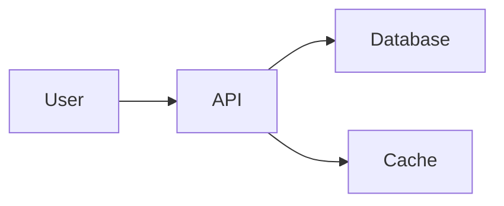

# Visual Design

> "Clutter and confusion are not attributes of information, they are failures of design."
> — Edward Tufte

## The Problem

People don't read documentation word-by-word. They scan. Visual design determines whether they can find what they need or give up in frustration. Good visual design is invisible — the reader finds the answer without noticing the design. Bad visual design is a wall of text.

---

## The Hierarchy Stack

Create visual hierarchy through formatting layers. Each layer should be visually distinct:

### Level 1: Headers

```markdown
# Document Title (H1)
## Major Section (H2)
### Subsection (H3)
#### Minor Section (H4)
```

**Rules:**
- One H1 per document (the title)
- H2 for major sections
- H3 for subsections
- Rarely need H4+
- Never skip levels (don't jump from H2 to H4)
- Keep header text short (under 10 words)

### Level 2: Emphasis

**Bold for key terms and important phrases:**
```markdown
The **primary key** must be unique across all rows.
```

**Italics for definitions, citations, or gentle emphasis:**
```markdown
See *The Art of Readable Code* for more on naming.
```

**Code formatting for technical elements:**
```markdown
The `DATABASE_URL` environment variable must be set.
```

**Rules:**
- Bold the one most important phrase per paragraph
- Don't bold entire sentences (loses impact)
- Don't italic whole paragraphs (hard to read)
- Reserve ALL CAPS for constants in code, not emphasis

### Level 3: Lists

Break apart paragraphs with lists:

**Unordered:**
```markdown
- First item
- Second item
- Third item
```

**Ordered:**
```markdown
1. First step
2. Second step
3. Third step
```

**Nested:**
```markdown
- Main point
  - Supporting detail
  - Another detail
- Second main point
  - Its detail
```

**Rules:**
- Use lists for 2+ related items
- Keep items short (1-2 lines each)
- Parallel grammatical structure
- Don't nest more than 2 levels deep

### Level 4: Callouts and Admonitions

Highlight critical information:

```markdown
> **Note:** This only works in production environments.

> **Warning:** This operation cannot be undone.

> **Tip:** Use the --dry-run flag to preview changes.
```

Or with emoji markers (if your platform supports):
```markdown
💡 **Tip:** Use keyboard shortcuts to speed up workflow.
⚠️ **Warning:** Backup your data first.
✅ **Success:** Configuration complete.
```

**Use sparingly.** Too many callouts = nothing stands out.

### Level 5: Tables

Use tables for structured data, comparisons, and reference information:

```markdown
| Environment | URL | Deploy Method |
|-------------|-----|---------------|
| Development | localhost:3000 | `npm start` |
| Staging | staging.example.com | Push to `staging` branch |
| Production | example.com | Push to `main` branch |
```

**When to use tables:**
- Comparing options
- Listing parameters/fields
- Reference information (commands, configs)
- Status or compatibility matrices

**When not to use tables:**
- Explanatory text (use paragraphs)
- Simple lists (use bullets)
- Complex nested data (use diagrams)

### Level 6: Code Blocks

````markdown
```bash
npm install
npm test
npm start
```
````

**Always include:**
- Language identifier for syntax highlighting
- Context (when/why you'd run this)
- Expected output (if not obvious)

### Level 7: Diagrams

Use visual diagrams for:
- Workflows and processes
- System architecture
- Data flows
- Hierarchies and relationships

**Formats:**
- Mermaid (renders in many markdown platforms)
- ASCII art (universal but limited)
- Image files (PNG/SVG for complex diagrams)

**Example (Mermaid):**
````markdown

````

**Rules:**
- Only add diagrams that clarify (not decoration)
- Keep diagrams simple
- Label all elements
- Provide text alternative (for accessibility)

---

## Whitespace

Whitespace is not wasted space. Whitespace is what makes text readable.

### Vertical Whitespace

**Use blank lines to:**
- Separate sections
- Create breathing room between paragraphs
- Set off lists, tables, and code blocks
- Isolate callouts

**Bad (dense):**
```markdown
To deploy the application you need to build the Docker image first. This ensures
that all dependencies are included. After building you should push the image to
the registry. Make sure you're authenticated first. Once pushed you can update
the Kubernetes manifests with the new image tag. Then apply the manifests to
the cluster using kubectl.
```

**Good (whitespace):**
```markdown
To deploy the application:

1. Build the Docker image
2. Push to the registry (authenticate first)
3. Update Kubernetes manifests with the new image tag
4. Apply manifests: `kubectl apply -f manifests/`

See [Deployment Guide](deploy.md) for detailed steps.
```

### Horizontal Whitespace

**Keep line length readable:**
- Target: 80-100 characters per line
- Hard limit: 120 characters
- Reason: Long lines are hard to scan

**Exception:** Code blocks, tables, and URLs can exceed this.

### Paragraph Spacing

- Blank line between paragraphs (always)
- Blank line before/after lists (always)
- Blank line before/after code blocks (always)
- Blank line before/after headers (always)

---

## The Squint Test

Print or zoom out on your document until you can't read the words. Squint.

**You should see:**
- Clear blocks of different sizes (not one uniform gray)
- Headers standing out
- Lists and bullets creating visual rhythm
- Tables as distinct rectangular blocks
- Whitespace between sections

**If you see a uniform wall of gray text — restructure.**

*Source: Garr Reynolds' "Presentation Zen" (2008). "The Non-Designer's Design Book" by Robin Williams (2004).*

---

## Scanability Patterns

### The F-Pattern

Eye-tracking studies show readers scan in an F-pattern:
- Horizontal across the top (title, first paragraph)
- Vertical down the left edge (headers, first words of paragraphs)
- Horizontal at points of interest (midway down)

**Design for the F-pattern:**
- Front-load important information
- Make headers descriptive (not decorative)
- Bold first key phrase in paragraphs
- Use lists to break up text

*Source: Jakob Nielsen's eye-tracking research (2006).*

### The Z-Pattern

For shorter sections, readers scan in a Z:
- Top-left to top-right (title)
- Diagonal to bottom-left (scanning)
- Bottom-left to bottom-right (conclusion/action)

**Design for the Z-pattern:**
- Title at top-left
- Summary or key point at top-right (if using columns)
- Call-to-action or next steps at bottom-right

---

## Formatting Anti-Patterns

### 1. Wall of Text

**Problem:** Long paragraphs with no breaks.

**Fix:** Break into shorter paragraphs. Add lists. Use headers.

### 2. Emphasis Overload

**Problem:** Everything is bold or italicized.

**Bad:**
```markdown
The **system** uses **Redis** for **caching** which **improves performance** by 
**reducing database queries**. You should **configure** the **connection pool** 
and **set appropriate timeouts**.
```

**When everything is emphasized, nothing is.**

**Fix:** Bold only the most important phrase.

### 3. Header Abuse

**Problem:** Headers used for emphasis instead of structure.

**Bad:**
```markdown
## This is really important

Some text here.

## Another important thing

More text.
```

**Fix:** Use actual hierarchy. Use callouts for emphasis.

### 4. Inconsistent Formatting

**Problem:** Using different formats for the same type of information.

**Bad:**
```markdown
Run npm install
Then execute: `npm test`
Finally, you should npm start
```

**Fix:** Consistent formatting for all commands:
```markdown
1. `npm install`
2. `npm test`
3. `npm start`
```

### 5. ASCII Art Overload

**Problem:** Decorative boxes, lines, borders.

**Bad:**
```markdown
╔═══════════════════════╗
║   IMPORTANT NOTE      ║
╚═══════════════════════╝
```

**Fix:** Use markdown emphasis:
```markdown
> **Important:** This note...
```

### 6. Color Reliance

**Problem:** Relying on color alone (accessibility issue, doesn't work in plain text).

**Bad:** "The green text is good, red text is bad."

**Fix:** Use symbols or explicit labels:
```markdown
✅ **Success:** Operation completed
❌ **Error:** Connection failed
```

---

## Platform-Specific Formatting

### Markdown (GitHub, GitLab, etc.)

- Use fenced code blocks with language tags
- Tables supported
- Mermaid diagrams supported (GitHub, GitLab)
- Collapsible details: `<details><summary>...</summary>...</details>`

### Confluence

- Use Expand macro for collapsible sections
- Status macros for visual indicators
- Panel macros for callouts
- Info/Warning/Note macros for emphasis

### Plain Text

- Use ALL CAPS for headers
- Use `---` for separators
- Use `* ` for bullets
- Keep it simple (no special characters)

**Design for the most constrained format you'll need to support.**

---

## Accessibility

### For Screen Readers

- Use proper header hierarchy (don't skip levels)
- Provide alt text for images: ``
- Use descriptive link text (not "click here")
- Tables with headers: `| Header 1 | Header 2 |`

### For Low Vision

- Sufficient contrast (don't rely on subtle color differences)
- Avoid red/green alone (colorblind accessibility)
- Readable font sizes (check mobile rendering)

### For Cognitive Accessibility

- Short paragraphs (easier to process)
- Lists break up text (easier to scan)
- Consistent formatting (reduces cognitive load)
- Whitespace (reduces overwhelm)

*Source: W3C Web Content Accessibility Guidelines (WCAG). "Inclusive Design Patterns" by Heydon Pickering (2016).*

---

## Tools

### Linters and Formatters

- **markdownlint** — Catches formatting inconsistencies
- **prettier** — Auto-formats markdown
- **vale** — Style guide enforcement (plain language rules)

### Diagram Tools

- **Mermaid** — Text-to-diagram (renders in many platforms)
- **draw.io** — Visual diagramming tool
- **Excalidraw** — Hand-drawn style diagrams
- **PlantUML** — Text-based UML diagrams

### Preview Tools

- **Markdown Preview (VS Code)** — See rendered output
- **grip** — GitHub-flavored markdown server
- **pandoc** — Convert between formats

---

## Checklist

Before publishing:
- [ ] Clear visual hierarchy (headers, emphasis, lists)
- [ ] Whitespace between sections
- [ ] Short paragraphs (under 5 sentences)
- [ ] Lists for multiple items (not buried in paragraphs)
- [ ] Tables for structured data
- [ ] Code blocks with language tags
- [ ] Diagrams for complex relationships (if needed)
- [ ] Passes the squint test (not a wall of gray)
- [ ] Consistent formatting throughout
- [ ] Headers form a logical hierarchy (no skipped levels)
- [ ] Emphasis used sparingly (bold for key phrases only)
- [ ] Accessible (proper headers, alt text, descriptive links)

---

**Next**: [Maintenance and Lifecycle →](05-maintenance.md)
