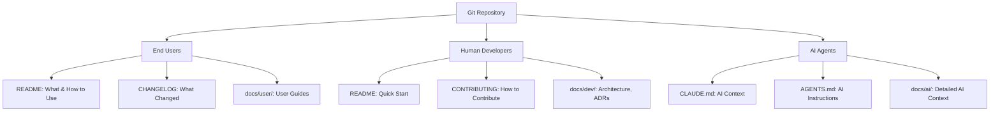

# Git Repository Documentation

> A git repository without documentation is a puzzle. A git repository with documentation for only one audience is an incomplete puzzle.

---

## The Problem

Most git repositories document for one audience (if they document at all). The README serves developers. Or it serves end users. Or it's abandoned after the initial commit. The result: three distinct audiences trying to use the same incomplete, misdirected documentation.

**End users** need to know what the software does and how to use it.
**Human developers** need to know how to build, test, and contribute.
**AI agents** need unambiguous, structured instructions to assist effectively.

Each audience has different mental models, different goals, and different tolerance for ambiguity. One document cannot serve all three.

This guide shows you how to document a git repository for all three audiences.

---

## The Three-Audience Model



---

## Who This Is For

- **Repository maintainers** — Setting up documentation structure
- **Open source project owners** — Documenting for contributors and users
- **Engineering teams** — Standardizing internal repo documentation
- **AI-assisted developers** — Creating effective AI context

---

## Guide Structure

### The Foundation

**[00 — The Manifesto](00-manifesto.md)**
The core commandments for git repository documentation. The three-audience model, why one README isn't enough, and what each audience needs. **Start here.**

**[01 — Documentation Architecture](01-architecture.md)**
The recommended file and directory structure for a well-documented repository. Where files go, what they're for, and how they connect.

### The Three Audiences

**[02 — End Users](02-end-users.md)**
Writing for people who want to *use* the software. README structure, CHANGELOG conventions, user-facing documentation. Assumes zero codebase knowledge.

**[03 — Human Developers](03-human-devs.md)**
Writing for people who will *modify* the code. CONTRIBUTING.md, architecture docs, ADRs (Architecture Decision Records), development setup, code conventions.

**[04 — AI Agents](04-ai-agents.md)**
Writing for AI assistants like Claude, Cursor, GitHub Copilot. CLAUDE.md, AGENTS.md, zero-drift templates, forbidden words, MUST ALWAYS/MUST NEVER patterns. **The most novel chapter.**

### Deep Dives

**[05 — README Deep Dive](05-readmes.md)**
The anatomy of a great README. Templates for different repository types (library, service, monorepo, internal tool, infrastructure).

**[06 — Changelogs and Versioning](06-changelogs.md)**
How to maintain a changelog. Keep a Changelog format, Conventional Commits, Semantic Versioning, automated generation.

### The Warnings

**[07 — Anti-Patterns Gallery](07-anti-patterns.md)**
Git documentation failure modes: "README is the only doc", "docs are a year behind code", "AI agents hallucinate because CLAUDE.md is vague", "docs live in Confluence not in repo".

### The Toolkit

**[08 — Templates](08-templates.md)**
Copy-paste templates: README.md, CONTRIBUTING.md, CLAUDE.md, AGENTS.md, ADR, PR template. Ready to use.

**[09 — Pre-Push Checklist](09-checklist.md)**
What to check before pushing your documentation.

### The Library

**[10 — Sources and Further Reading](10-sources.md)**
Bibliography, standards (Keep a Changelog, Conventional Commits), and recommended reading.

---

## How to Use This Guide

| If you have... | Read... |
|---|---|
| 5 minutes | [The Manifesto](00-manifesto.md) — the three-audience model |
| 15 minutes | The Manifesto + [Architecture](01-architecture.md) |
| 30 minutes | The Manifesto + [End Users](02-end-users.md) + [Human Developers](03-human-devs.md) |
| 1 hour | All of the above + [AI Agents](04-ai-agents.md) |
| Setting up a new repo | [Architecture](01-architecture.md) + [Templates](08-templates.md) |
| Deep interest | The full guide, start to finish |

---

## The Single Test

> Can someone from each audience find what they need in 30 seconds?

- **End user:** Can they tell what this software does and how to install it?
- **Human developer:** Can they set up a dev environment and make their first contribution?
- **AI agent:** Can they understand the codebase structure and coding conventions without ambiguity?

If any answer is "no" — your documentation is incomplete.

---

## Related Guides

- **[Generic Documentation Writing Guide](../doc-writing/INDEX.md)** — Universal principles for all documentation (audience analysis, structure, writing style, visual design, maintenance). Read this first if you're new to documentation writing.
- **[Confluence Writing Guide](../confluence-writing/INDEX.md)** — Applies these principles specifically to Confluence pages

---

## Quick Start: New Repository

Setting up documentation for a new repository?

1. **Create the files:**
   ```bash
   touch README.md CONTRIBUTING.md CHANGELOG.md CLAUDE.md
   mkdir -p docs/{user,dev,ai}
   ```

2. **Use the templates:**
   - Copy templates from [Templates](08-templates.md)
   - Customize for your repository type

3. **Fill out each audience:**
   - README: What & why (for users)
   - CONTRIBUTING: How to develop (for humans)
   - CLAUDE.md: System context (for AI)

4. **Verify:**
   - [ ] End user can understand what this is
   - [ ] Developer can set up dev environment
   - [ ] AI has unambiguous context

See [Architecture](01-architecture.md) for the complete structure.
