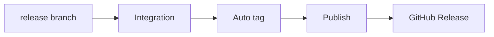

# Autorelease: how it should work and how to test it

## How it should work

The release pipeline is a single path from the release branch to a published GitHub Release. Each stage has a clear trigger and outcome; no manual publish steps are required for a normal version-bump release.

- **Release branch**  
Maintainers merge a PR to `main` that bumps the version in `package.json`. That push is the only human gate; everything after is automated.
- **Integration**  
CI runs on every PR and every push to `main`. It must pass (e.g. full stack, deploy, tests) so that only green state can lead to a tag. Failures block the pipeline; there is no way to tag or publish from a failing main.
- **Auto tag**  
On every push to `main`, a workflow checks whether `package.json` version is greater than the latest existing tag. If yes, it creates and pushes a tag `v<version>`. If no (e.g. no version bump in that push), it does nothing. No manual tagging is required for a normal release.
- **Publish**  
A tag push `v*.*.`* triggers the Release workflow. It publishes the package to npm and pushes the Docker image to the configured registries. Order is fixed: npm first, then image, so the image build uses the published version.
- **Release**  
After publish jobs succeed, the same workflow creates the GitHub Release for that tag (notes, artifacts). Users see the new version on the repo’s Releases page.

**Invariants**

- The only path that publishes is: merge to main → Integration passes → Auto tag (if version bumped) → Release workflow on tag. Manual publish workflows exist only for one-off repair or debugging, not as the normal path.
- Tag creation is conditional on version comparison; duplicate or out-of-order tags for the same version should not be created by the auto-tag workflow.
- If the tag is pushed by automation, something (e.g. PAT) must allow the Release workflow to run on that tag push; otherwise the pipeline stops at “tag exists” and Release must be run manually or fixed in config.

---

## How to test it

Testing is split into: (1) verifying the pipeline behavior end-to-end in a safe way, and (2) validating that docs and config match that behavior.

**1. End-to-end pipeline test (dry or real)**

- **Scope:** One full run: merge a version bump to main → observe Integration → Auto tag → Release workflow → GitHub Release (and npm/Docker if acceptable).
- **Approach:** Use a test branch and a small version bump (e.g. patch). Optionally use a pre-release tag or a separate repo clone to avoid polluting production tags.
- **Pass criteria:**  
  - Integration runs and passes on the merge.  
  - Auto-tag workflow runs on push to main; it creates and pushes the expected `v*.*.`* only when version was increased.  
  - Release workflow runs on that tag; npm publish (and Docker push) succeed; GitHub Release is created and points to the correct tag and artifacts.
- **Negative check:** Push to main without a version bump → auto-tag does not create a new tag. Merge with Integration failing → no new tag (and thus no publish) from that push.

**2. Docs and config consistency**

- **Scope:** [.github/workflows/README.Autorelease.md](.github/workflows/README.Autorelease.md) and [.github/workflows/README.md](.github/workflows/README.md) (and any links from [README.md](README.md)).
- **Approach:** Read the “who / what / when / outcome” table and the workflow docs; walk through the repo’s workflow files and triggers.
- **Pass criteria:**  
  - The described flow (release branch → Integration → Auto tag → Publish → Release) matches the actual triggers and job order in the workflows.  
  - Required secrets/variables (e.g. for tag push triggering Release, Docker, npm) are documented where they are used.  
  - Links from the main README to “Release cycle (autorelease)” point to the autorelease doc and the doc’s “how it should work” matches the above behavior.

No implementation details are specified here; the above defines desired behavior and how to confirm it with one E2E run and a doc/config review.