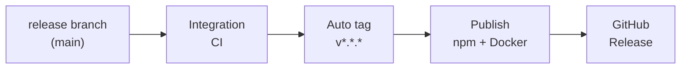

# Autorelease

Full auto release cycle: end-to-end flow from release branch through integration, auto tag, publish, and GitHub Release.

| Stage | Who | What | When | Outcome |
|-------|-----|------|------|---------|
| **Release branch** | Developer / maintainer | Merge PR to `main` (e.g. version bump in `package.json`). | When release is ready. | `main` has new version; push event fires. |
| **Integration** | GitHub Actions (Integration workflow) | Run full CI: Docker stack (Redis, Qdrant, Postgres, Keycloak), deploy, `npm run dev:test`. | Every PR and every push to `main`. | Main stays green; broken changes caught before tag. |
| **Auto tag** | GitHub Actions (Release tag on version bump) | Compare `package.json` version to latest tag; if greater, create and push tag `v<version>`. | On every push to `main` (after merge). | Tag `v*.*.*` pushed, or no-op if version not increased. |
| **Publish** | GitHub Actions (Release workflow) | Publish package to npm; build and push Docker image to Docker Hub and Quay. | On tag push `v*.*.*` (triggered by auto tag or manual tag). | Package on npm; images `debian777/kairos-mcp:<version>` and Quay available. |
| **Release** | GitHub Actions (Release workflow) | Create GitHub Release for the tag with generated release notes. | After publish jobs succeed (same Release workflow). | GitHub Release page and artifacts; users see new version. |

**Who** = actor (human or workflow). **What** = action. **When** = trigger or condition. **Outcome** = observable result.

For workflow files, triggers, and job details, see [README.md](README.md) in this directory.

---

## Invariants

- The only path that publishes is: merge to main → Integration passes → Auto tag (if version bumped) → Release workflow on tag. Manual publish workflows exist only for one-off repair or debugging, not as the normal path.
- Tag creation is conditional on version comparison; duplicate or out-of-order tags for the same version are not created by the auto-tag workflow.
- If the tag is pushed by automation, a PAT (`GH_PAT`) must be set to allow the Release workflow to run on that tag push; without it the tag is still pushed but Release must be run manually (see [README.md](README.md) for details).

---

## How to test it

Testing is split into: (1) verifying the pipeline behavior end-to-end, and (2) validating that docs and config match that behavior.

### 1. End-to-end pipeline test (dry or real)

- **Scope:** One full run: merge a version bump to main → observe Integration → Auto tag → Release workflow → GitHub Release (and npm/Docker if acceptable).
- **Approach:** Use a test branch and a small version bump (e.g. patch). Optionally use a pre-release tag or a separate repo clone to avoid polluting production tags.
- **Pass criteria:**
  - Integration runs and passes on the merge.
  - Auto-tag workflow runs on push to main; it creates and pushes the expected `v*.*.*` only when version was increased.
  - Release workflow runs on that tag; npm publish (and Docker push) succeed; GitHub Release is created and points to the correct tag and artifacts.
- **Negative check:** Push to main without a version bump → auto-tag does not create a new tag and no npm or Docker publish occurs. Merge with Integration failing → no new tag (and thus no publish) from that push.

### 2. Docs and config consistency

- **Scope:** This file and [README.md](README.md) (and any links from the root [README.md](../../README.md)).
- **Approach:** Read the "who / what / when / outcome" table and the workflow docs; walk through the repo's workflow files and triggers.
- **Pass criteria:**
  - The described flow (release branch → Integration → Auto tag → Publish → Release) matches the actual triggers and job order in the workflows.
  - Required secrets/variables are documented where they are used (see [README.md](README.md) for the full list: `GH_PAT`, Docker/Quay credentials, `QUAY_NAMESPACE`, npm Trusted Publisher).
  - Links from the root README to "Release cycle (autorelease)" point to this doc and this doc's flow matches the above behavior.
