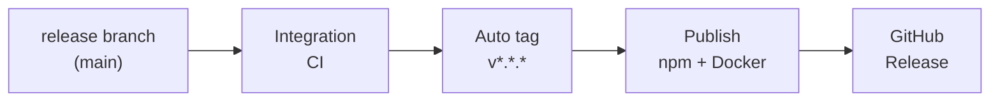

# Autorelease

Full auto release cycle: end-to-end flow from release branch through integration, auto tag, publish, and GitHub Release.

| Stage | Who | What | When | Outcome |
|-------|-----|------|------|---------|
| **Release branch** | Developer / maintainer | Merge PR to `main` (e.g. version bump in `package.json`). | When release is ready. | `main` has new version; push event fires. |
| **Integration** | GitHub Actions (Integration workflow) | Run full CI: Docker stack (Redis, Qdrant, Postgres, Keycloak), deploy, `npm run dev:test`. | Every PR and every push to `main`. | Main stays green; broken changes caught before tag. |
| **Auto tag** | GitHub Actions (Release tag on version bump) | Compare `package.json` version to latest tag; if greater, create and push tag `v<version>`. | On every push to `main` (after merge). | Tag `v*.*.*` pushed, or no-op if version not increased. |
| **Publish** | GitHub Actions (Release workflow) | Publish package to npm; build and push Docker image to Docker Hub and Quay. | On tag push `v*.*.*` (triggered by auto tag or manual tag). | Package on npm; images `debian777/kairos-mcp:<version>` and Quay available. |
| **Release** | GitHub Actions (Release workflow) | Create GitHub Release for the tag with generated release notes. | After publish jobs succeed (same Release workflow). | GitHub Release page and artifacts; users see new version. |

**Who** = actor (human or workflow). **What** = action. **When** = trigger or condition. **Outcome** = observable result.

For workflow files, triggers, and job details, see [README.md](README.md) in this directory.
