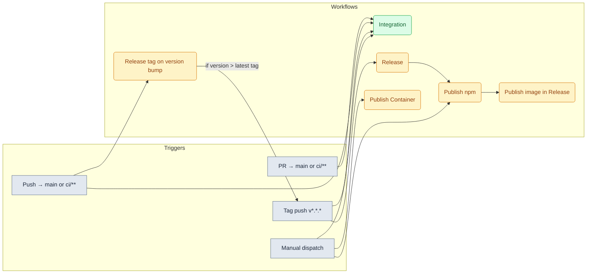
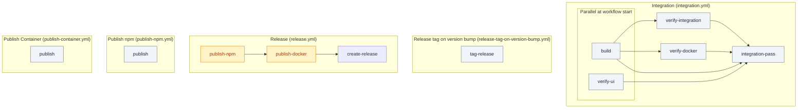

# GitHub Actions – workflow design

## Overview

**Release path (normal flow):** Version-bump PR merged to main → **Release tag on version bump** runs; if `package.json` version &gt; latest tag, it pushes that tag → **Release** runs on tag push (publish npm → publish Docker → create GitHub Release).

**Integration:** Runs on every PR and push to **main** or **`ci/**`** (integration and beta lines such as `ci/integration-line`), and on tag push to re-verify the released ref. Manual run available. Without a push (or PR) trigger on those `ci/**` branches, **Release tag on version bump** never sees a successful **Integration** `workflow_run`, so beta tags are not created automatically after CI green.

**PR/MR tooling:** This repo uses the GitHub CLI (**gh**) for PRs. For GitLab MRs use **glab**. KAIROS protocols: *GitHub PR with gh* (create/track PRs with `gh`), *GitLab MR with glab* (create/track MRs with `glab`).

**Dependabot:** Auto-merge is enabled at repository level (Settings → General → Pull Requests → Allow auto-merge). On each Dependabot PR, use **Enable auto-merge**; the PR will merge when required status checks pass. No workflow is used for this.

**Manual-only:** Publish npm and Publish Container are for ad-hoc republish/debug; they use `package.json` version when not run from a tag.

## Workflows and job dependencies

Each workflow is made of one or more **jobs**. Arrows show `needs:` — the target job runs only after the source job succeeds.

| Workflow | Job(s) | Dependencies |
|----------|--------|--------------|
| Integration | `build` ∥ `verify-ui`; then `verify-integration` ∥ `verify-docker` (both need `build`); → `integration-pass` | `integration-pass` needs all four jobs |
| Security | `dependency-review`, `npm-audit`, `codeql` | — (parallel jobs) |
| Release tag on version bump | `tag-release` | — |
| Release | `publish-npm` → `publish-docker` → `create-release` | `publish-docker` and `create-release` need `publish-npm`; `create-release` needs `publish-docker` |
| Publish npm | `publish` | — |
| Publish image (in Release) | `publish-docker` | after `publish-npm` |
| Publish Container | `publish` | — |

## Integration workflow

### Secrets and variables

The integration workflow uses **optional secrets:** `OPENAI_API_KEY` (embedding tests), `KEYCLOAK_ADMIN_PASSWORD`, `KEYCLOAK_DB_PASSWORD`, `SESSION_SECRET`. In the workflow they are referenced as `${{ secrets.OPENAI_API_KEY }}` etc. Non-sensitive values use **repository variables** as `${{ vars.VAR_NAME }}`. If optional secrets are not set, the job uses fixed defaults for Keycloak and generates `SESSION_SECRET` so the job runs without any secrets.

**Triggers:** `pull_request` / `push` to **main** or **`ci/**`**; `push` tags `v*.*.*`; `workflow_dispatch` (optional force input).

**Actions → Integration → Run workflow** (workflow_dispatch).

**Jobs:** **`build`** — **no Docker infra**; `npm ci` and `npm run build:tgz`, then uploads the **`npm-package`** artifact. **`verify-ui`** runs **in parallel with `build`** (static checks, Playwright, tsc/knip/UI tests — no tgz). **`verify-integration`** (`needs: build`) downloads the tgz **after** **Compose is already up and `npm ci` has run** (infra + test harness do not wait on the artifact); then Playwright + infra wait, Keycloak, `npm install` from tgz, `dev:start`, **`dev:test`**. **`verify-docker`** (`needs: build`, parallel with `verify-integration`) stages `package.tgz`, **`docker build` (runtime-ci)**, **Trivy** — release sanity check only. **`integration-pass`** requires **`build`**, **`verify-ui`**, **`verify-integration`**, and **`verify-docker`** (with `if: always()` so skipped jobs fail the gate). Use **Integration workflow passed** as the single required check.

**Caching:** **`verify-ui`** and **`verify-integration`** share the **`~/.cache/ms-playwright`** key. **`verify-integration`** restores/saves **Docker infra** images (`compose.yaml` hash).

**Note:** `verify-integration` cannot start until **`build`** finishes (artifact). Within that job, **infra starts before the artifact download** so pulls and boot overlap post-build time plus later steps.

**Job summary:** Most steps append a **Vitest-style** block to `$GITHUB_STEP_SUMMARY` (`##` title, `### Summary`, ✅/❌ bullets) via `scripts/ci-github-step-summary.mjs`. The parallel checks step appends tsc and Knip summaries after all three commands finish. **Vitest** adds its own “Vitest Test Report” when `CI=true` (`vitest.config.ts`). **Jest** integration tests append “Jest integration tests” via `tests/reporters/jest-github-summary-reporter.cjs` when `GITHUB_STEP_SUMMARY` is set (`scripts/deploy-run-env.sh`).

## Release: only acceptable final output

After a version-bump PR is merged to main, the **only** path that publishes is: **Release tag on version bump** (creates tag if needed) → **Release** workflow (publish-npm → publish-docker → create GitHub Release).

## Release tag on version bump

`release-tag-on-version-bump.yml` runs on `workflow_run` from **Integration** and **Integration Simple** on **`main`** or **`ci/**`**, or via **manual dispatch**. For automatic runs it gates tag creation on both workflows being `success` for the same head SHA. Human version bumps follow [.cursor/skills/version-bump-release/SKILL.md](../../.cursor/skills/version-bump-release/SKILL.md): branch **`release/<version>`** → PR to **`main`** → merge → integration workflows on **`main`** → this workflow creates the tag (no local tag from the skill).

- **Main:** Full releases (`vX.Y.Z`) and pre-releases (e.g. `vX.Y.Z-rc.N`) — creates and pushes the tag when `package.json` version is **greater** than the latest existing **stable** tag (`X.Y.Z` only) **and** `v<package.json version>` does not already exist (local or on `origin`). Repeat Integration runs for the same version exit cleanly instead of failing on duplicate `git tag`.
- **`ci/**`:** **Beta only** — creates the tag only if the version contains `-beta.` (e.g. `3.2.0-beta.0`) and that tag does not already exist (local or on `origin`). Full/pre releases are not created from non-main branches.
- **Concurrency:** One job at a time per repository (`cancel-in-progress: false`) so concurrent runs do not race on `git tag` / `git push`.
- **Manual trigger (Actions → Release tag on version bump → Run workflow):** Provide **ref** (branch or SHA, e.g. `ci/integration-line` or a commit SHA). Beta only: tags the commit if `package.json` version contains `-beta.` and the tag `v<version>` does not exist. Use when integration workflows have not run on that ref yet or you need to retry tagging. Prefer the automatic path: push to **`ci/**`** or merge to **main**, let **Integration** and **Integration Simple** go green on the same SHA, then this workflow runs from **`workflow_run`** and pushes the tag and dispatches **Release**.

**Flow:** When a tag is created (by this workflow), it triggers the **Release** workflow (npm → Docker → GitHub Release).

**Required for Release to run:** GitHub does not trigger workflows when a tag is pushed by another workflow using the default `GITHUB_TOKEN`. To have the **Release** workflow run after the tag is pushed, add a **Personal Access Token (PAT)** with `repo` scope as repository secret **`GH_PAT`** (e.g. `gh secret set GH_PAT` or Settings → Secrets → Actions). Without it, the tag is still pushed but Release will not run (run it manually from Actions → Release → Run workflow with the new tag ref).

Branch protection does not block tag pushes by default. If you use “Restrict pushes that create matching tags”, allow this repo’s GitHub Actions to create tags or run the tag step with a token that can push tags.
## Release workflow (tag → npm + Docker)

**Release** (`release.yml`) runs on **tag push** `v*.*.*` or `v*.*.*-*` (e.g. `v3.0.1`, `v3.0.1-beta.4`). It is the **only** path that publishes. Jobs run in order:

1. **Publish npm** — lint, knip, prepare:publish (tgz + test install), `npm publish` with `latest` or `beta` tag (OIDC, no NPM_TOKEN).
2. **Publish image** — runs after npm succeeds; builds and pushes `debian777/kairos-mcp:<version>` and `latest` to Docker Hub, and `quay.io/<QUAY_NAMESPACE>/kairos-mcp:<version>` and `latest` to Quay.
3. **Create GitHub Release** — runs after the image job; creates the GitHub Release for the tag with generated release notes.

**Required secrets:** `DOCKER_USERNAME`, `DOCKER_PASSWORD` (Docker Hub); `QUAY_USERNAME`, `QUAY_PASSWORD` (Quay login). **Required repository variable:** `QUAY_NAMESPACE` (Quay namespace used in image tags, e.g. your Quay username). Without them, the image job fails.

The Release workflow uses **npm Trusted Publishers** (OIDC) for publish; no `NPM_TOKEN` is required when Trusted Publisher is configured.

## Manual publish workflows (ad-hoc only)

- **Publish npm** (`publish-npm.yml`): **workflow_dispatch** only; uses `package.json` version.
- **Publish Container** (`publish-container.yml`): **workflow_dispatch** only; builds and pushes to Docker Hub and Quay. Uses the same secrets and `QUAY_NAMESPACE` variable as Release.

Use only for one-off republish or debugging. Normal releases go through the Release workflow only.

## Docker: release vs local dev

- **Release** (CI and `npm run docker:build`): **Dockerfile** installs the published package from npm (`@debian777/kairos-mcp@${PACKAGE_VERSION}`). No source build; version is a required build-arg. The Release workflow passes the tag version.
- **Local dev** (build from source): **Dockerfile.dev** copies source and runs `npm run build` inside the image. Use `npm run docker:build:dev` or `docker build -f Dockerfile.dev -t kairos-mcp:dev .`. No publish required.
