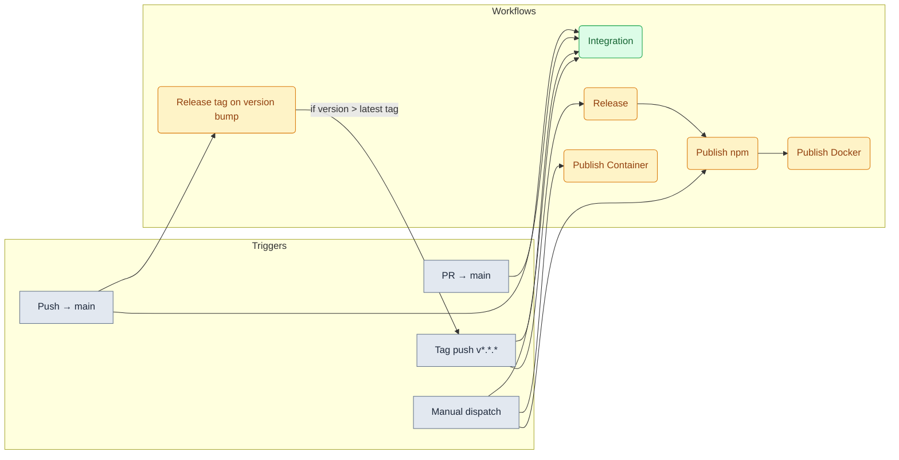
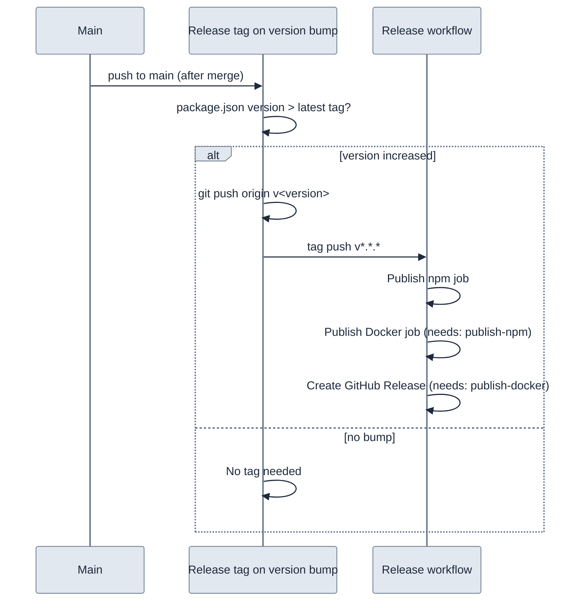

# GitHub Actions workflows

## Overview

**Release path (normal flow):** Version-bump PR merged to main → **Release tag on version bump** runs; if `package.json` version &gt; latest tag, it pushes that tag → **Release** runs on tag push (publish npm → publish Docker → create GitHub Release).

**Integration:** Runs on every PR and push to main (and on tag push to re-verify the released ref). Manual run available.

**Manual-only:** Publish npm and Publish Docker are for ad-hoc republish/debug; they use `package.json` version when not run from a tag.

## Workflows and job dependencies

Each workflow is made of one or more **jobs**. Arrows show `needs:` — the target job runs only after the source job succeeds.

```mermaid
flowchart TB
  subgraph INT_WF["Integration (integration.yml)"]
    J_INT[integration]
  end

  subgraph RTAG_WF["Release tag on version bump (release-tag-on-version-bump.yml)"]
    J_TAG[tag-release]
  end

  subgraph REL_WF["Release (release.yml)"]
    J_NPM[publish-npm]
    J_DOCKER[publish-docker]
    J_REL[create-release]
    J_NPM --> J_DOCKER --> J_REL
  end

  subgraph PNPM_WF["Publish npm (publish-npm.yml)"]
    J_PNPM[publish]
  end

  subgraph PCONT_WF["Publish Container (publish-container.yml)"]
    J_PCONT[publish]
  end

  classDef jobDefault fill:#f1f5f9,stroke:#64748b,color:#1e293b
  classDef jobNeeds fill:#fef3c7,stroke:#d97706,color:#92400e
  class J_INT,J_TAG,J_PNPM,J_PCONT jobDefault
  class J_NPM,J_DOCKER jobNeeds
```

| Workflow | Job(s) | Dependencies |
|----------|--------|---------------|
| Integration | `integration` | — |
| Release tag on version bump | `tag-release` | — |
| Release | `publish-npm` → `publish-docker` → `create-release` | `publish-docker` and `create-release` need `publish-npm`; `create-release` needs `publish-docker` |
| Publish npm | `publish` | — |
| Publish Docker (in Release) | `publish-docker` | after `publish-npm` |
| Publish Container | `publish` | — |

## Integration workflow

`integration.yml` runs Docker infra (Redis, Qdrant, Postgres, Keycloak) with **AUTH enabled**, configures Keycloak realms and test user, then `npm run dev:deploy && npm run dev:test`. It runs on **pull_request** and **push** to `main` so main stays green; **workflow_dispatch** is still available for manual runs.

### Secrets and variables

The integration workflow uses **optional secrets:** `OPENAI_API_KEY` (embedding tests), `KEYCLOAK_ADMIN_PASSWORD`, `KEYCLOAK_DB_PASSWORD`, `SESSION_SECRET`. In the workflow they are referenced as `${{ secrets.OPENAI_API_KEY }}` etc. Non-sensitive values use **repository variables** as `${{ vars.VAR_NAME }}`. If optional secrets are not set, the job uses fixed defaults for Keycloak and generates `SESSION_SECRET` so the job runs without any secrets.

### Running the integration workflow manually

**Actions → Integration → Run workflow** (workflow_dispatch).

## Release: only acceptable final output

After a version-bump PR is merged to main, the **only** path that publishes is: **Release tag on version bump** (creates tag if needed) → **Release** workflow (publish-npm → publish-docker → create GitHub Release).

## Release tag on version bump

`release-tag-on-version-bump.yml` runs on **push to main**. If `package.json` version is **greater** than the latest existing tag (e.g. tag `v3.0.0` exists and package is `3.0.1`), it creates and pushes tag `v<version>`. That tag push triggers the **Release** workflow (`release.yml`).

**Flow:** When a version-bump PR is merged to main, this workflow **only** creates and pushes the tag if needed. The tag push then triggers the **Release** workflow (npm → Docker → GitHub Release).

Branch protection does not block tag pushes by default. If you use “Restrict pushes that create matching tags”, allow this repo’s GitHub Actions to create tags or run the tag step with a token that can push tags.

## Release workflow (tag → npm + Docker)

**Release** (`release.yml`) runs on **tag push** `v*.*.*` or `v*.*.*-*` (e.g. `v3.0.1`, `v3.0.1-beta.4`). It is the **only** path that publishes. Jobs run in order:

1. **Publish npm** — lint, knip, prepare:publish (tgz + test install), `npm publish` with `latest` or `beta` tag (OIDC, no NPM_TOKEN).
2. **Publish Docker** — runs after npm succeeds; builds and pushes `debian777/kairos-mcp:<version>` and `latest` to Docker Hub, and `quay.io/<QUAY_USERNAME>/kairos-mcp:<version>` and `latest` to Quay.
3. **Create GitHub Release** — runs after Docker; creates the GitHub Release for the tag with generated release notes.

**Required secrets:** `DOCKER_USERNAME`, `DOCKER_PASSWORD` (Docker Hub); `QUAY_USERNAME`, `QUAY_PASSWORD` (Quay). Without them, the Docker job fails.

The Release workflow uses **npm Trusted Publishers** (OIDC) for publish; no `NPM_TOKEN` is required when Trusted Publisher is configured.

## Manual publish workflows (ad-hoc only)

- **Publish npm** (`publish-npm.yml`): **workflow_dispatch** only; uses `package.json` version.
- **Publish Container** (`publish-container.yml`): **workflow_dispatch** only; builds and pushes to Docker Hub and Quay.

Use only for one-off republish or debugging. Normal releases go through the Release workflow only.

## Docker: release vs local dev

- **Release** (CI and `npm run docker:build`): **Dockerfile** installs the published package from npm (`@debian777/kairos-mcp@${PACKAGE_VERSION}`). No source build; version is a required build-arg. The Release workflow passes the tag version.
- **Local dev** (build from source): **Dockerfile.dev** copies source and runs `npm run build` inside the image. Use `npm run docker:build:dev` or `docker build -f Dockerfile.dev -t kairos-mcp:dev .`. No publish required.
