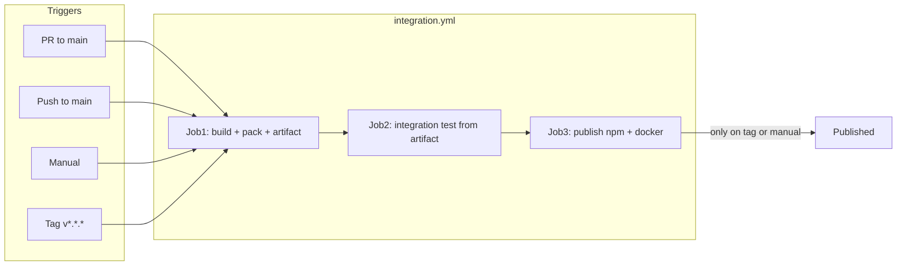

# GitHub Actions – workflow design

Overview of what runs when and how the workflows relate. Build and integration tests run on every **pull request** and **push to main** (and manual); running on every commit to every branch would be overkill.

## Flow

## integration.yml

**Triggers:** `pull_request` (main), `push` (main), `push` tags `v*.*.*`, `workflow_dispatch`.

**Job 1 – build+pack+artifact:** Checkout, sync version from tag when applicable, npm ci, lint, knip, build, npm pack, upload artifact (tarball). No infra or tests; only produces the npm package artifact.

**Job 2 – integration test:** Depends on Job 1. Downloads the package artifact, installs the app from it, starts Docker infra (Redis, Qdrant, Postgres, Keycloak), configures Keycloak, runs integration tests against the installed package. So we test the exact artifact we will publish.

**Job 3 – publish (npm + docker):** Depends on Job 2. Runs only on **tag** or **manual** (e.g. workflow_dispatch with publish input). Downloads the artifact, publishes to npm (`npm publish ... --access public`, OIDC). Then builds and pushes the Docker image (from public npm, `KAIROS_VERSION`). Both npm and docker in one job.

## publish-npm.yml

**Triggers:** `push` tags `v*.*.*`, `workflow_dispatch` (optional force input).

**Purpose:** Standalone path to publish the npm package when the full integration pipeline is not used (e.g. manual publish from source). Version from tag or from package.json. Uses npm Trusted Publishing (OIDC); no NPM_TOKEN. Can be removed if all publish goes through integration.yml Job 3.

## publish-docker.yml

**Triggers:** `workflow_run` when “Publish npm Package” completes successfully after a **tag** push; `workflow_dispatch` for manual docker-only runs.

**Purpose:** Build and push the Docker image from public npm (`KAIROS_VERSION`). Does not run when npm was published manually (no tag). Version from tag at commit or from package.json on manual. If publish is done only via integration.yml Job 3, this workflow can be kept for docker-only manual runs or removed.
