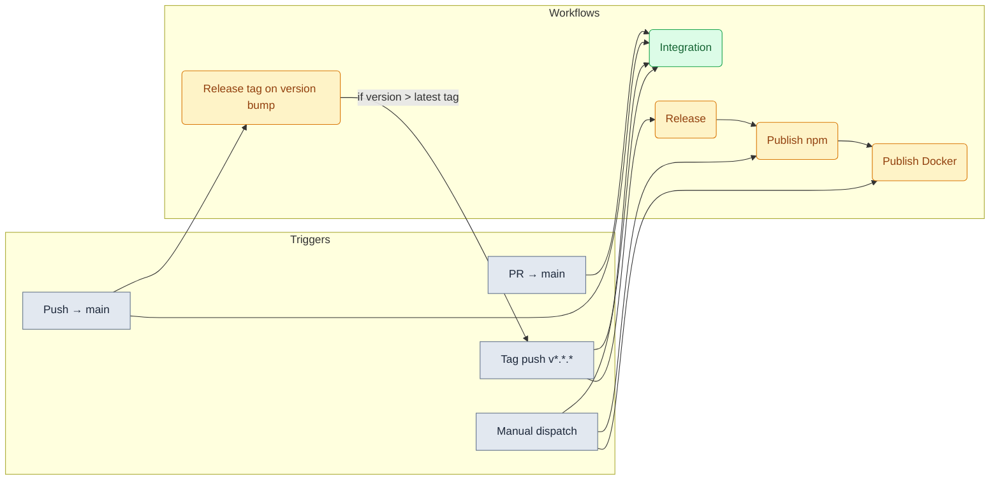
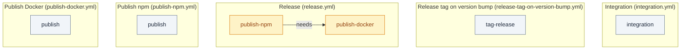
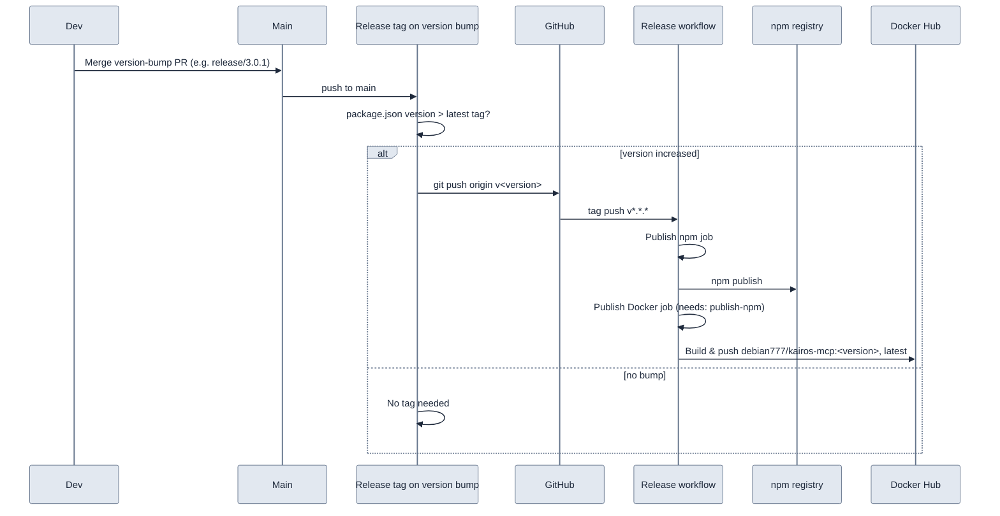

# GitHub Actions workflows

## Overview



**Release path (normal flow):** Version-bump PR merged to main → **Release tag on version bump** runs; if `package.json` version &gt; latest tag, it pushes that tag → **Release** runs on tag push (publish npm → publish Docker).

**Integration:** Runs on every PR and push to main (and on tag push to re-verify the released ref). Manual run available.

**Manual-only:** Publish npm and Publish Docker are for ad-hoc republish/debug; they use `package.json` version when not run from a tag.

## Workflows and job dependencies

Each workflow is made of one or more **jobs**. Arrows show `needs:` — the target job runs only after the source job succeeds.



| Workflow | Job(s) | Dependencies |
|----------|--------|---------------|
| Integration | `integration` | — |
| Release tag on version bump | `tag-release` | — |
| Release | `publish-npm` → `publish-docker` | `publish-docker` **needs** `publish-npm` |
| Publish npm | `publish` | — |
| Publish Docker | `publish` | — |

## Integration workflow

`integration.yml` runs Docker infra (Redis, Qdrant, Postgres, Keycloak) with **AUTH enabled**, configures Keycloak realms and test user, then `npm run dev:deploy && npm run dev:test`. It runs on **pull_request** and **push** to `main` so main stays green; **workflow_dispatch** is still available for manual runs.

### Secrets and variables (gh CLI)

You can use **GitHub Actions secrets** (sensitive) and **repository variables** (non-sensitive) in workflows. Set them with the GitHub CLI from the repo root:

**Secrets** (e.g. `OPENAI_API_KEY` for embedding tests):

```bash
# Set from stdin (prompted)
gh secret set OPENAI_API_KEY

# Set from env var
gh secret set OPENAI_API_KEY --body "$OPENAI_API_KEY"

# Set from file
gh secret set OPENAI_API_KEY < .env.local
```

**List secrets** (names only, values are hidden):

```bash
gh secret list
```

**Variables** (non-sensitive; use `vars.VAR_NAME` in the workflow):

```bash
gh variable set MY_VAR --body "value"
gh variable list
```

In the workflow, use `${{ secrets.OPENAI_API_KEY }}` and `${{ vars.MY_VAR }}`. The integration workflow uses:

- **Optional secrets:** `OPENAI_API_KEY` (embedding tests), `KEYCLOAK_ADMIN_PASSWORD`, `KEYCLOAK_DB_PASSWORD`, `SESSION_SECRET`. If not set, CI uses fixed defaults for Keycloak and generates `SESSION_SECRET` so the job runs without any secrets.

### Running the integration workflow manually

- **UI:** Actions → Integration → Run workflow.
- **CLI:** `gh workflow run integration.yml` (from default branch).

## Release: only acceptable final output

After a release branch is merged to main, the **only acceptable final output** is: **npm** package in the registry and **Docker** image on Docker Hub (`debian777/kairos-mcp`). Single path: merge version-bump PR → tag created → **Release** workflow (npm then Docker).



## Release tag on version bump

`release-tag-on-version-bump.yml` runs on **push to main**. If `package.json` version is **greater** than the latest existing tag (e.g. tag `v3.0.0` exists and package is `3.0.1`), it creates and pushes tag `v<version>`. That tag push triggers the **Release** workflow (`release.yml`).

**Flow:** Bump version in a PR (e.g. `npm version 3.0.1-beta.4 --no-git-tag-version`), merge to main → this workflow creates/pushes the tag → **Release** runs (npm then Docker).

Branch protection does not block tag pushes by default. If you use “Restrict pushes that create matching tags”, allow this repo’s GitHub Actions to create tags or run the tag step with a token that can push tags.

## Release workflow (tag → npm + Docker)

**Release** (`release.yml`) runs on **tag push** `v*.*.*` or `v*.*.*-*` (e.g. `v3.0.1`, `v3.0.1-beta.4`). It is the **only** path that publishes. Jobs run in order:

1. **Publish npm** — lint, knip, build, `npm publish` (OIDC, no NPM_TOKEN).
2. **Publish Docker** — runs only if npm succeeds; builds and pushes `debian777/kairos-mcp:<version>` and `latest` to Docker Hub.

**Required secrets:** `DOCKER_USERNAME`, `DOCKER_PASSWORD` (Docker Hub). Without them, the Docker job fails.

## Manual publish workflows (ad-hoc only)

- **Publish npm** (`publish-npm.yml`): **workflow_dispatch** only; uses `package.json` version.
- **Publish Docker** (`publish-docker.yml`): **workflow_dispatch** only.

Use only for one-off republish or debugging. Normal releases go through the Release workflow only.
