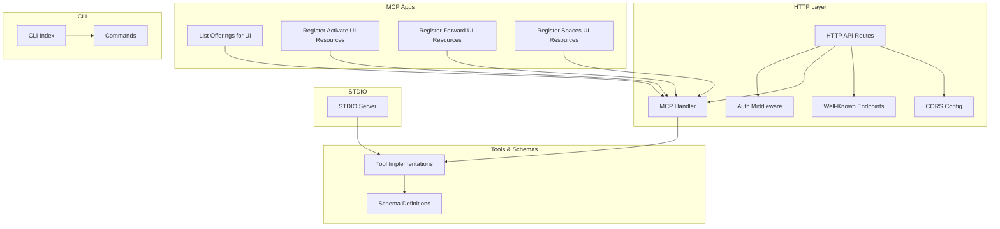
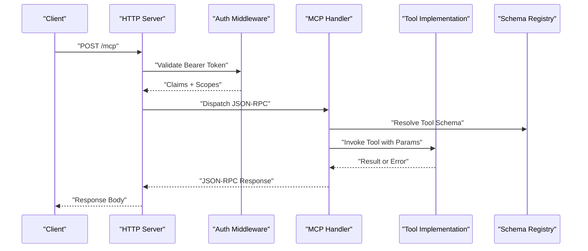
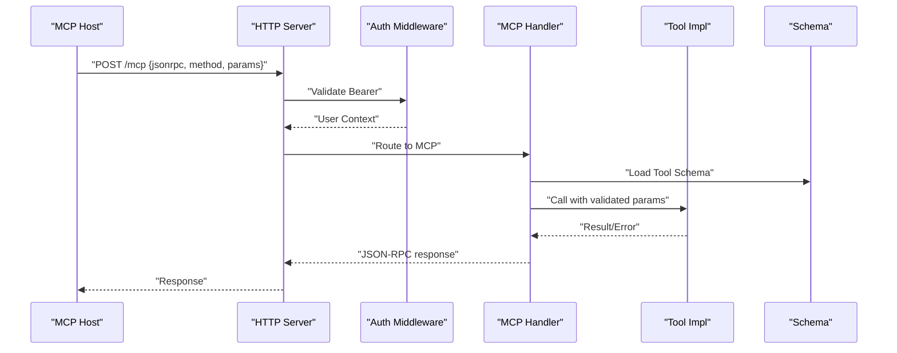
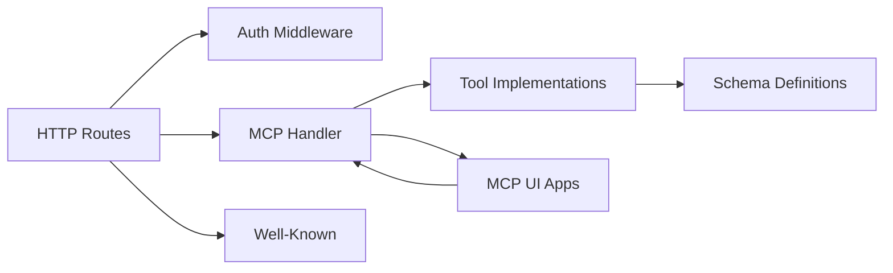

# API Reference

<cite>
**Referenced Files in This Document**
- [src/http/http-api-routes.ts](file://src/http/http-api-routes.ts)
- [src/http/http-mcp-handler.ts](file://src/http/http-mcp-handler.ts)
- [src/http/http-auth-middleware.ts](file://src/http/http-auth-middleware.ts)
- [src/http/http-well-known.ts](file://src/http/http-well-known.ts)
- [src/stdio/stdio-server.ts](file://src/stdio/stdio-server.ts)
- [src/cli/index.ts](file://src/cli/index.ts)
- [src/cli/commands/login.ts](file://src/cli/commands/login.ts)
- [src/cli/commands/logout.ts](file://src/cli/commands/logout.ts)
- [src/cli/commands/token.ts](file://src/cli/commands/token.ts)
- [src/cli/commands/spaces.ts](file://src/cli/commands/spaces.ts)
- [src/cli/commands/search.ts](file://src/cli/commands/search.ts)
- [src/cli/commands/begin.ts](file://src/cli/commands/begin.ts)
- [src/cli/commands/attest.ts](file://src/cli/commands/attest.ts)
- [src/cli/commands/export.ts](file://src/cli/commands/export.ts)
- [src/cli/commands/train.ts](file://src/cli/commands/cli-train.ts)
- [src/cli/commands/update.ts](file://src/cli/commands/update.ts)
- [src/cli/commands/delete.ts](file://src/cli/commands/delete.ts)
- [src/cli/commands/delete-metadata.ts](file://src/cli/commands/delete-metadata.ts)
- [src/cli/commands/serve.ts](file://src/cli/commands/serve.ts)
- [src/tools/activate_schema.ts](file://src/tools/activate_schema.ts)
- [src/tools/forward_schema.ts](file://src/tools/forward_schema.ts)
- [src/tools/reward_schema.ts](file://src/tools/reward_schema.ts)
- [src/tools/search_schema.ts](file://src/tools/search_schema.ts)
- [src/tools/train_schema.ts](file://src/tools/train_schema.ts)
- [src/tools/tune_schema.ts](file://src/tools/tune_schema.ts)
- [src/tools/dump_schema.ts](file://src/tools/dump_schema.ts)
- [src/tools/export_schema.ts](file://src/tools/export_schema.ts)
- [src/tools/update_schema.ts](file://src/tools/update_schema.ts)
- [src/tools/delete_schema.ts](file://src/tools/delete_schema.ts)
- [src/tools/next_schema.ts](file://src/tools/next_schema.ts)
- [src/tools/spaces_schema.ts](file://src/tools/spaces_schema.ts)
- [src/mcp-apps/list-offerings-for-ui.ts](file://src/mcp-apps/list-offerings-for-ui.ts)
- [src/mcp-apps/register-activate-ui-resources.ts](file://src/mcp-apps/register-activate-ui-resources.ts)
- [src/mcp-apps/register-forward-ui-resources.ts](file://src/mcp-apps/register-forward-ui-resources.ts)
- [src/mcp-apps/register-spaces-ui-resources.ts](file://src/mcp-apps/register-spaces-ui-resources.ts)
- [src/http/http-mcp-cors.ts](file://src/http/http-mcp-cors.ts)
- [src/http/http-error-handlers.ts](file://src/http/http-error-handlers.ts)
- [src/http/http-route-errors.ts](file://src/http/http-route-errors.ts)
- [src/http/http-client-registration-proxy.ts](file://src/http/http-client-registration-proxy.ts)
- [src/http/http-auth-callback.ts](file://src/http/http-auth-callback.ts)
- [src/http/http-auth-oidc-redirect.ts](file://src/http/http-auth-oidc-redirect.ts)
- [src/http/oidc-scopes.ts](file://src/http/oidc-scopes.ts)
- [src/http/oidc-profile-claims.ts](file://src/http/oidc-profile-claims.ts)
- [src/me-response.ts](file://src/me-response.ts)
- [src/utils/build-version.ts](file://src/utils/build-version.ts)
</cite>

## Table of Contents
1. [Introduction](#introduction)
2. [Project Structure](#project-structure)
3. [Core Components](#core-components)
4. [Architecture Overview](#architecture-overview)
5. [Detailed Component Analysis](#detailed-component-analysis)
6. [Dependency Analysis](#dependency-analysis)
7. [Performance Considerations](#performance-considerations)
8. [Troubleshooting Guide](#troubleshooting-guide)
9. [Conclusion](#conclusion)
10. [Appendices](#appendices)

## Introduction
This document provides a comprehensive API reference for Kairos MCP interfaces, including:
- RESTful HTTP endpoints with methods, URL patterns, request/response schemas, and authentication requirements
- The MCP Protocol interface for AI tool integration (tool registration, invocation patterns, error handling)
- CLI command reference with commands, parameters, and usage examples
- STDIO interface specifications for programmatic access
- Complete schema definitions for request/response objects, error codes, and status messages
- Authentication methods, rate limiting information, and versioning considerations
- WebSocket support for real-time communication and streaming responses where applicable

## Project Structure
Kairos exposes multiple interfaces:
- HTTP REST API routes for core operations
- MCP handler for JSON-RPC-based tool invocation over HTTP
- STDIO server for programmatic control via standard input/output
- CLI commands that wrap the HTTP client and local operations
- UI offerings and resources registered by MCP apps

**Diagram sources**
- [src/http/http-api-routes.ts](file://src/http/http-api-routes.ts)
- [src/http/http-mcp-handler.ts](file://src/http/http-mcp-handler.ts)
- [src/http/http-auth-middleware.ts](file://src/http/http-auth-middleware.ts)
- [src/http/http-well-known.ts](file://src/http/http-well-known.ts)
- [src/http/http-mcp-cors.ts](file://src/http/http-mcp-cors.ts)
- [src/mcp-apps/list-offerings-for-ui.ts](file://src/mcp-apps/list-offerings-for-ui.ts)
- [src/mcp-apps/register-activate-ui-resources.ts](file://src/mcp-apps/register-activate-ui-resources.ts)
- [src/mcp-apps/register-forward-ui-resources.ts](file://src/mcp-apps/register-forward-ui-resources.ts)
- [src/mcp-apps/register-spaces-ui-resources.ts](file://src/mcp-apps/register-spaces-ui-resources.ts)
- [src/stdio/stdio-server.ts](file://src/stdio/stdio-server.ts)
- [src/cli/index.ts](file://src/cli/index.ts)

**Section sources**
- [src/http/http-api-routes.ts](file://src/http/http-api-routes.ts)
- [src/http/http-mcp-handler.ts](file://src/http/http-mcp-handler.ts)
- [src/http/http-auth-middleware.ts](file://src/http/http-auth-middleware.ts)
- [src/http/http-well-known.ts](file://src/http/http-well-known.ts)
- [src/http/http-mcp-cors.ts](file://src/http/http-mcp-cors.ts)
- [src/mcp-apps/list-offerings-for-ui.ts](file://src/mcp-apps/list-offerings-for-ui.ts)
- [src/mcp-apps/register-activate-ui-resources.ts](file://src/mcp-apps/register-activate-ui-resources.ts)
- [src/mcp-apps/register-forward-ui-resources.ts](file://src/mcp-apps/register-forward-ui-resources.ts)
- [src/mcp-apps/register-spaces-ui-resources.ts](file://src/mcp-apps/register-spaces-ui-resources.ts)
- [src/stdio/stdio-server.ts](file://src/stdio/stdio-server.ts)
- [src/cli/index.ts](file://src/cli/index.ts)

## Core Components
- HTTP API Routes: Central routing for REST endpoints and MCP handlers
- MCP Handler: JSON-RPC processing for tool listing and invocation
- Auth Middleware: OIDC bearer validation and session management
- Well-Known Endpoints: Discovery and health checks
- STDIO Server: Programmatic control via stdin/stdout JSON-RPC
- CLI Commands: User-facing commands to interact with the server
- Tool Schemas: JSON Schema definitions for all tools

Key responsibilities:
- Route registration and middleware composition
- Authentication enforcement and scope/claim resolution
- MCP tool discovery and execution
- STDIO transport for headless automation
- CLI orchestration and user feedback

**Section sources**
- [src/http/http-api-routes.ts](file://src/http/http-api-routes.ts)
- [src/http/http-mcp-handler.ts](file://src/http/http-mcp-handler.ts)
- [src/http/http-auth-middleware.ts](file://src/http/http-auth-middleware.ts)
- [src/http/http-well-known.ts](file://src/http/http-well-known.ts)
- [src/stdio/stdio-server.ts](file://src/stdio/stdio-server.ts)
- [src/cli/index.ts](file://src/cli/index.ts)

## Architecture Overview
The system integrates HTTP REST, MCP JSON-RPC, and STDIO transports. Authentication is enforced at the HTTP layer using OIDC bearer tokens. MCP tools are discovered and invoked through a centralized handler. UI offerings are dynamically registered for interactive flows.

**Diagram sources**
- [src/http/http-api-routes.ts](file://src/http/http-api-routes.ts)
- [src/http/http-mcp-handler.ts](file://src/http/http-mcp-handler.ts)
- [src/http/http-auth-middleware.ts](file://src/http/http-auth-middleware.ts)
- [src/tools/activate_schema.ts](file://src/tools/activate_schema.ts)
- [src/tools/forward_schema.ts](file://src/tools/forward_schema.ts)
- [src/tools/reward_schema.ts](file://src/tools/reward_schema.ts)
- [src/tools/search_schema.ts](file://src/tools/search_schema.ts)
- [src/tools/train_schema.ts](file://src/tools/train_schema.ts)
- [src/tools/tune_schema.ts](file://src/tools/tune_schema.ts)
- [src/tools/dump_schema.ts](file://src/tools/dump_schema.ts)
- [src/tools/export_schema.ts](file://src/tools/export_schema.ts)
- [src/tools/update_schema.ts](file://src/tools/update_schema.ts)
- [src/tools/delete_schema.ts](file://src/tools/delete_schema.ts)
- [src/tools/next_schema.ts](file://src/tools/next_schema.ts)
- [src/tools/spaces_schema.ts](file://src/tools/spaces_schema.ts)

## Detailed Component Analysis

### HTTP REST API
Endpoints are defined under the HTTP routes module. Typical categories include:
- Health and well-known discovery
- Authentication callbacks and redirects
- Client registration proxy
- Data and workflow operations (begin, forward, reward, search, train, tune, export, update, delete, spaces, attest, dump)

Authentication:
- Most endpoints require OIDC bearer token validated by the auth middleware
- Some endpoints may be public (health, well-known)

Rate Limiting:
- Rate limiting behavior is implemented within the HTTP layer; consult route-specific comments and middleware configuration for limits and headers.

Versioning:
- Versioning is exposed via build metadata and can be referenced in responses and headers.

Example endpoint families (namespaces):
- /health, /.well-known/*
- /auth/callback, /auth/oidc/redirect
- /client-registration/proxy
- /api/* (data/workflow operations)
- /mcp (JSON-RPC)

Request/Response Schemas:
- Each operation has associated request/response types defined in corresponding modules and schemas. Refer to section “Schemas” below for canonical definitions.

Error Handling:
- Global error handlers map internal errors to standardized HTTP responses.
- Route-level errors provide consistent error shapes.

WebSocket Support:
- No explicit WebSocket endpoints are defined in the analyzed files. Real-time features, if any, would be implemented via SSE or other mechanisms not present here.

**Section sources**
- [src/http/http-api-routes.ts](file://src/http/http-api-routes.ts)
- [src/http/http-auth-middleware.ts](file://src/http/http-auth-middleware.ts)
- [src/http/http-well-known.ts](file://src/http/http-well-known.ts)
- [src/http/http-client-registration-proxy.ts](file://src/http/http-client-registration-proxy.ts)
- [src/http/http-auth-callback.ts](file://src/http/http-auth-callback.ts)
- [src/http/http-auth-oidc-redirect.ts](file://src/http/http-auth-oidc-redirect.ts)
- [src/http/http-error-handlers.ts](file://src/http/http-error-handlers.ts)
- [src/http/http-route-errors.ts](file://src/http/http-route-errors.ts)
- [src/utils/build-version.ts](file://src/utils/build-version.ts)

### MCP Protocol Interface (JSON-RPC over HTTP)
The MCP handler processes JSON-RPC requests for tool discovery and invocation. It enforces authentication and resolves tool schemas before execution.

Key behaviors:
- Tool listing: returns available tools and their schemas
- Tool invocation: validates inputs against schemas, executes tools, returns results or errors
- UI offerings: dynamic registration of UI resources for activate/forward/space workflows

Authentication:
- Requires valid OIDC bearer token unless explicitly exempted
- Claims and scopes influence authorization decisions

Error Handling:
- Errors are returned as JSON-RPC error objects with standardized codes and messages

Sequence diagram for tool invocation:

**Diagram sources**
- [src/http/http-mcp-handler.ts](file://src/http/http-mcp-handler.ts)
- [src/http/http-auth-middleware.ts](file://src/http/http-auth-middleware.ts)
- [src/mcp-apps/list-offerings-for-ui.ts](file://src/mcp-apps/list-offerings-for-ui.ts)
- [src/mcp-apps/register-activate-ui-resources.ts](file://src/mcp-apps/register-activate-ui-resources.ts)
- [src/mcp-apps/register-forward-ui-resources.ts](file://src/mcp-apps/register-forward-ui-resources.ts)
- [src/mcp-apps/register-spaces-ui-resources.ts](file://src/mcp-apps/register-spaces-ui-resources.ts)
- [src/tools/activate_schema.ts](file://src/tools/activate_schema.ts)
- [src/tools/forward_schema.ts](file://src/tools/forward_schema.ts)
- [src/tools/reward_schema.ts](file://src/tools/reward_schema.ts)
- [src/tools/search_schema.ts](file://src/tools/search_schema.ts)
- [src/tools/train_schema.ts](file://src/tools/train_schema.ts)
- [src/tools/tune_schema.ts](file://src/tools/tune_schema.ts)
- [src/tools/dump_schema.ts](file://src/tools/dump_schema.ts)
- [src/tools/export_schema.ts](file://src/tools/export_schema.ts)
- [src/tools/update_schema.ts](file://src/tools/update_schema.ts)
- [src/tools/delete_schema.ts](file://src/tools/delete_schema.ts)
- [src/tools/next_schema.ts](file://src/tools/next_schema.ts)
- [src/tools/spaces_schema.ts](file://src/tools/spaces_schema.ts)

**Section sources**
- [src/http/http-mcp-handler.ts](file://src/http/http-mcp-handler.ts)
- [src/mcp-apps/list-offerings-for-ui.ts](file://src/mcp-apps/list-offerings-for-ui.ts)
- [src/mcp-apps/register-activate-ui-resources.ts](file://src/mcp-apps/register-activate-ui-resources.ts)
- [src/mcp-apps/register-forward-ui-resources.ts](file://src/mcp-apps/register-forward-ui-resources.ts)
- [src/mcp-apps/register-spaces-ui-resources.ts](file://src/mcp-apps/register-spaces-ui-resources.ts)

### CLI Command Reference
The CLI wraps HTTP interactions and local operations. Available commands include:
- login: Authenticate with OIDC provider
- logout: Clear stored credentials
- token: Manage tokens
- spaces: Space-related operations
- search: Search memory
- begin: Start a workflow step
- attest: Attestation operations
- export: Export data
- train: Train models
- update: Update resources
- delete: Delete resources
- delete-metadata: Delete metadata
- serve: Serve the application locally

Usage examples:
- kairos login --help
- kairos spaces list
- kairos search --query "example"
- kairos begin --space my-space --protocol my-protocol
- kairos export --format jsonl --output ./export.jsonl
- kairos train --input ./data.md
- kairos update --id <resource-id> --payload '{"key":"value"}'
- kairos delete --id <resource-id>
- kairos delete-metadata --id <resource-id>
- kairos serve --port 8080

Parameters and flags are defined per command implementation. Consult each command file for detailed options.

**Section sources**
- [src/cli/index.ts](file://src/cli/index.ts)
- [src/cli/commands/login.ts](file://src/cli/commands/login.ts)
- [src/cli/commands/logout.ts](file://src/cli/commands/logout.ts)
- [src/cli/commands/token.ts](file://src/cli/commands/token.ts)
- [src/cli/commands/spaces.ts](file://src/cli/commands/spaces.ts)
- [src/cli/commands/search.ts](file://src/cli/commands/search.ts)
- [src/cli/commands/begin.ts](file://src/cli/commands/begin.ts)
- [src/cli/commands/attest.ts](file://src/cli/commands/attest.ts)
- [src/cli/commands/export.ts](file://src/cli/commands/export.ts)
- [src/cli/commands/cli-train.ts](file://src/cli/commands/cli-train.ts)
- [src/cli/commands/update.ts](file://src/cli/commands/update.ts)
- [src/cli/commands/delete.ts](file://src/cli/commands/delete.ts)
- [src/cli/commands/delete-metadata.ts](file://src/cli/commands/delete-metadata.ts)
- [src/cli/commands/serve.ts](file://src/cli/commands/serve.ts)

### STDIO Interface Specifications
The STDIO server enables programmatic control via stdin/stdout JSON-RPC. It mirrors MCP capabilities for headless environments.

Behavior:
- Reads JSON-RPC messages from stdin
- Validates authentication when required
- Dispatches to tool implementations
- Writes JSON-RPC responses to stdout

Use cases:
- Automation scripts
- CI/CD pipelines
- Integration with external orchestrators

**Section sources**
- [src/stdio/stdio-server.ts](file://src/stdio/stdio-server.ts)

### Authentication Methods
- OIDC Bearer Tokens: Required for protected endpoints
- Callback and Redirect Flows: For browser-based login
- Client Registration Proxy: Facilitates dynamic client registration

Scopes and Claims:
- Scopes define permissions for API access
- Profile claims inform user context and authorization

**Section sources**
- [src/http/http-auth-middleware.ts](file://src/http/http-auth-middleware.ts)
- [src/http/http-auth-callback.ts](file://src/http/http-auth-callback.ts)
- [src/http/http-auth-oidc-redirect.ts](file://src/http/http-auth-oidc-redirect.ts)
- [src/http/http-client-registration-proxy.ts](file://src/http/http-client-registration-proxy.ts)
- [src/http/oidc-scopes.ts](file://src/http/oidc-scopes.ts)
- [src/http/oidc-profile-claims.ts](file://src/http/oidc-profile-claims.ts)

### Rate Limiting Information
Rate limiting is implemented within the HTTP layer. Limits and headers vary by endpoint and configuration. Check route-specific middleware and global settings for details.

**Section sources**
- [src/http/http-api-routes.ts](file://src/http/http-api-routes.ts)
- [src/http/http-mcp-handler.ts](file://src/http/http-mcp-handler.ts)

### Versioning Considerations
Build metadata exposes version information. Use this to ensure compatibility across clients and servers.

**Section sources**
- [src/utils/build-version.ts](file://src/utils/build-version.ts)

### WebSocket Support
No WebSocket endpoints are defined in the analyzed files. If real-time features are needed, consider implementing SSE or additional transports outside the current scope.

[No sources needed since this section doesn't analyze specific files]

## Dependency Analysis
The following diagram shows key dependencies among HTTP, MCP, Auth, Tools, and Schemas.

**Diagram sources**
- [src/http/http-api-routes.ts](file://src/http/http-api-routes.ts)
- [src/http/http-mcp-handler.ts](file://src/http/http-mcp-handler.ts)
- [src/http/http-auth-middleware.ts](file://src/http/http-auth-middleware.ts)
- [src/http/http-well-known.ts](file://src/http/http-well-known.ts)
- [src/mcp-apps/list-offerings-for-ui.ts](file://src/mcp-apps/list-offerings-for-ui.ts)
- [src/mcp-apps/register-activate-ui-resources.ts](file://src/mcp-apps/register-activate-ui-resources.ts)
- [src/mcp-apps/register-forward-ui-resources.ts](file://src/mcp-apps/register-forward-ui-resources.ts)
- [src/mcp-apps/register-spaces-ui-resources.ts](file://src/mcp-apps/register-spaces-ui-resources.ts)

**Section sources**
- [src/http/http-api-routes.ts](file://src/http/http-api-routes.ts)
- [src/http/http-mcp-handler.ts](file://src/http/http-mcp-handler.ts)
- [src/http/http-auth-middleware.ts](file://src/http/http-auth-middleware.ts)
- [src/http/http-well-known.ts](file://src/http/http-well-known.ts)
- [src/mcp-apps/list-offerings-for-ui.ts](file://src/mcp-apps/list-offerings-for-ui.ts)
- [src/mcp-apps/register-activate-ui-resources.ts](file://src/mcp-apps/register-activate-ui-resources.ts)
- [src/mcp-apps/register-forward-ui-resources.ts](file://src/mcp-apps/register-forward-ui-resources.ts)
- [src/mcp-apps/register-spaces-ui-resources.ts](file://src/mcp-apps/register-spaces-ui-resources.ts)

## Performance Considerations
- Concurrency: MCP tool invocations should be designed to handle concurrent requests efficiently
- Caching: Leverage caching layers where appropriate to reduce latency
- Payload Size: Keep request/response payloads minimal to improve throughput
- Timeouts: Configure timeouts for long-running operations like training or exporting

[No sources needed since this section provides general guidance]

## Troubleshooting Guide
Common issues and resolutions:
- Authentication failures: Verify OIDC configuration and bearer token validity
- MCP invocation errors: Ensure tool parameters match schema definitions
- Rate limit exceeded: Back off and retry with exponential backoff
- CORS errors: Confirm allowed origins and methods in CORS configuration
- Route errors: Inspect route-level error responses for actionable details

**Section sources**
- [src/http/http-error-handlers.ts](file://src/http/http-error-handlers.ts)
- [src/http/http-route-errors.ts](file://src/http/http-route-errors.ts)
- [src/http/http-mcp-cors.ts](file://src/http/http-mcp-cors.ts)

## Conclusion
Kairos MCP provides a robust set of interfaces for AI tool integration, including HTTP REST, MCP JSON-RPC, and STDIO transports. Authentication is enforced via OIDC, and tool schemas ensure reliable contract adherence. The CLI offers convenient access to server capabilities, while MCP UI apps enhance interactive workflows.

[No sources needed since this section summarizes without analyzing specific files]

## Appendices

### Schemas
Canonical schema definitions for tools are provided in dedicated schema files. These define request and response structures for all supported operations.

- activate: [src/tools/activate_schema.ts](file://src/tools/activate_schema.ts)
- forward: [src/tools/forward_schema.ts](file://src/tools/forward_schema.ts)
- reward: [src/tools/reward_schema.ts](file://src/tools/reward_schema.ts)
- search: [src/tools/search_schema.ts](file://src/tools/search_schema.ts)
- train: [src/tools/train_schema.ts](file://src/tools/train_schema.ts)
- tune: [src/tools/tune_schema.ts](file://src/tools/tune_schema.ts)
- dump: [src/tools/dump_schema.ts](file://src/tools/dump_schema.ts)
- export: [src/tools/export_schema.ts](file://src/tools/export_schema.ts)
- update: [src/tools/update_schema.ts](file://src/tools/update_schema.ts)
- delete: [src/tools/delete_schema.ts](file://src/tools/delete_schema.ts)
- next: [src/tools/next_schema.ts](file://src/tools/next_schema.ts)
- spaces: [src/tools/spaces_schema.ts](file://src/tools/spaces_schema.ts)

**Section sources**
- [src/tools/activate_schema.ts](file://src/tools/activate_schema.ts)
- [src/tools/forward_schema.ts](file://src/tools/forward_schema.ts)
- [src/tools/reward_schema.ts](file://src/tools/reward_schema.ts)
- [src/tools/search_schema.ts](file://src/tools/search_schema.ts)
- [src/tools/train_schema.ts](file://src/tools/train_schema.ts)
- [src/tools/tune_schema.ts](file://src/tools/tune_schema.ts)
- [src/tools/dump_schema.ts](file://src/tools/dump_schema.ts)
- [src/tools/export_schema.ts](file://src/tools/export_schema.ts)
- [src/tools/update_schema.ts](file://src/tools/update_schema.ts)
- [src/tools/delete_schema.ts](file://src/tools/delete_schema.ts)
- [src/tools/next_schema.ts](file://src/tools/next_schema.ts)
- [src/tools/spaces_schema.ts](file://src/tools/spaces_schema.ts)

### Error Codes and Status Messages
Standardized error responses are handled globally and per-route. Refer to error handlers and route error modules for exact codes and messages.

**Section sources**
- [src/http/http-error-handlers.ts](file://src/http/http-error-handlers.ts)
- [src/http/http-route-errors.ts](file://src/http/http-route-errors.ts)

### Me Endpoint
The me endpoint returns authenticated user profile information.

**Section sources**
- [src/me-response.ts](file://src/me-response.ts)