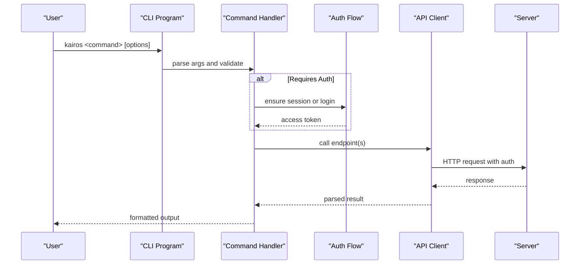
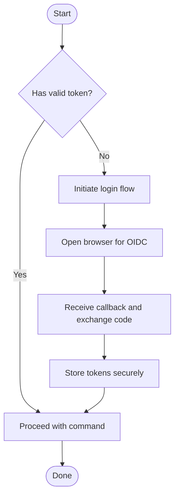
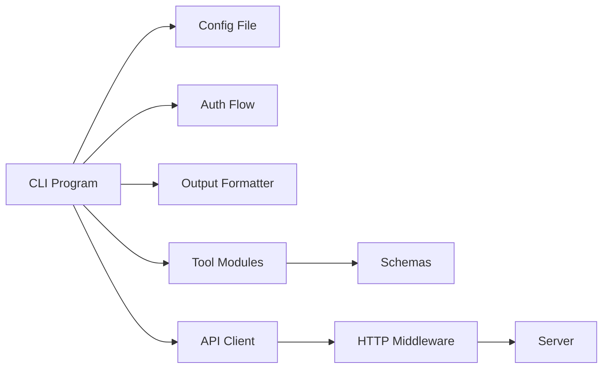

# CLI Command Reference

<cite>
**Referenced Files in This Document**
- [src/cli/commands/begin.ts](file://src/cli/commands/begin.ts)
- [src/cli/commands/login.ts](file://src/cli/commands/login.ts)
- [src/cli/commands/logout.ts](file://src/cli/commands/logout.ts)
- [src/cli/commands/token.ts](file://src/cli/commands/token.ts)
- [src/cli/commands/spaces.ts](file://src/cli/commands/spaces.ts)
- [src/cli/commands/search.ts](file://src/cli/commands/search.ts)
- [src/cli/commands/export.ts](file://src/cli/commands/export.ts)
- [src/cli/commands/train.ts](file://src/cli/commands/train.ts)
- [src/cli/commands/cli-train.ts](file://src/cli/commands/cli-train.ts)
- [src/cli/program.ts](file://src/cli/program.ts)
- [src/cli/config-file.ts](file://src/cli/config-file.ts)
- [src/cli/config-file-write.ts](file://src/cli/config-file-write.ts)
- [src/cli/config-file-internals.ts](file://src/cli/config-file-internals.ts)
- [src/cli/config.ts](file://src/cli/config.ts)
- [src/cli/keyring.ts](file://src/cli/keyring.ts)
- [src/cli/output.ts](file://src/cli/output.ts)
- [src/cli/api-client.ts](file://src/cli/api-client.ts)
- [src/cli/auth-error.ts](file://src/cli/auth-error.ts)
- [src/cli/oauth-refresh.ts](file://src/cli/oauth-refresh.ts)
- [src/cli/resolve-api-base.ts](file://src/cli/resolve-api-base.ts)
- [src/cli/safe-http-url.ts](file://src/cli/safe-http-url.ts)
- [src/cli/download-export-ref.ts](file://src/cli/download-export-ref.ts)
- [src/tools/train.ts](file://src/tools/train.ts)
- [src/tools/train_schema.ts](file://src/tools/train_schema.ts)
- [src/tools/export.ts](file://src/tools/export.ts)
- [src/tools/export_schema.ts](file://src/tools/export_schema.ts)
- [src/tools/search.ts](file://src/tools/search.ts)
- [src/tools/search_schema.ts](file://src/tools/search_schema.ts)
- [src/tools/spaces.ts](file://src/tools/spaces.ts)
- [src/tools/spaces_schema.ts](file://src/tools/spaces_schema.ts)
- [src/tools/activate.ts](file://src/tools/activate.ts)
- [src/tools/activate_schema.ts](file://src/tools/activate_schema.ts)
- [src/http/http-auth-middleware.ts](file://src/http/http-auth-middleware.ts)
- [src/http/http-auth-callback.ts](file://src/http/http-auth-callback.ts)
- [src/http/http-auth-oidc-redirect.ts](file://src/http/http-auth-oidc-redirect.ts)
- [src/utils/log-core.ts](file://src/utils/log-core.ts)
- [src/utils/structured-logger.ts](file://src/utils/structured-logger.ts)
</cite>

## Table of Contents
1. [Introduction](#introduction)
2. [Project Structure](#project-structure)
3. [Core Components](#core-components)
4. [Architecture Overview](#architecture-overview)
5. [Detailed Component Analysis](#detailed-component-analysis)
6. [Dependency Analysis](#dependency-analysis)
7. [Performance Considerations](#performance-considerations)
8. [Troubleshooting Guide](#troubleshooting-guide)
9. [Conclusion](#conclusion)
10. [Appendices](#appendices)

## Introduction
This document provides a comprehensive CLI command reference for Kairos MCP tools. It covers all available commands including begin, activate, export, train, search, spaces, login, logout, and token management. For each command, you will find detailed syntax, required and optional parameters, environment variables, configuration options, practical usage examples, authentication setup, configuration file management, credential handling, output formats, logging options, debugging capabilities, batch operations, scripting integration, CI/CD pipeline usage, troubleshooting guidance, and performance optimization tips.

## Project Structure
The CLI is implemented as a set of subcommands under the main program entry point. Each command maps to a dedicated module that defines its schema, arguments, and behavior. The CLI integrates with HTTP APIs for authentication and data operations, uses a local configuration file for persistent settings, and supports secure storage via a keyring when available.

```mermaid
graph TB
CLI["CLI Program<br/>src/cli/program.ts"] --> Begin["begin<br/>src/cli/commands/begin.ts"]
CLI --> Login["login<br/>src/cli/commands/login.ts"]
CLI --> Logout["logout<br/>src/cli/commands/logout.ts"]
CLI --> Token["token<br/>src/cli/commands/token.ts"]
CLI --> Spaces["spaces<br/>src/cli/commands/spaces.ts"]
CLI --> Search["search<br/>src/cli/commands/search.ts"]
CLI --> Export["export<br/>src/cli/commands/export.ts"]
CLI --> Train["train<br/>src/cli/commands/train.ts"]
CLI --> CliTrain["cli-train<br/>src/cli/commands/cli-train.ts"]
CLI --> ConfigFile["Config File<br/>src/cli/config-file.ts"]
CLI --> Keyring["Keyring<br/>src/cli/keyring.ts"]
CLI --> Output["Output Formatting<br/>src/cli/output.ts"]
CLI --> API["API Client<br/>src/cli/api-client.ts"]
CLI --> ResolveBase["Resolve API Base<br/>src/cli/resolve-api-base.ts"]
CLI --> SafeURL["Safe URL Helper<br/>src/cli/safe-http-url.ts"]
CLI --> OAuthRefresh["OAuth Refresh<br/>src/cli/oauth-refresh.ts"]
CLI --> AuthError["Auth Error Helpers<br/>src/cli/auth-error.ts"]
CLI --> DownloadRef["Download Export Ref<br/>src/cli/download-export-ref.ts"]
Train --> ToolsTrain["Tools: train<br/>src/tools/train.ts"]
Train --> TrainSchema["Tools: train schema<br/>src/tools/train_schema.ts"]
Export --> ToolsExport["Tools: export<br/>src/tools/export.ts"]
Export --> ExportSchema["Tools: export schema<br/>src/tools/export_schema.ts"]
Search --> ToolsSearch["Tools: search<br/>src/tools/search.ts"]
Search --> SearchSchema["Tools: search schema<br/>src/tools/search_schema.ts"]
Spaces --> ToolsSpaces["Tools: spaces<br/>src/tools/spaces.ts"]
Spaces --> SpacesSchema["Tools: spaces schema<br/>src/tools/spaces_schema.ts"]
Activate["activate (MCP tool)<br/>src/tools/activate.ts"] --> ActivateSchema["Tools: activate schema<br/>src/tools/activate_schema.ts"]
```

**Diagram sources**
- [src/cli/program.ts](file://src/cli/program.ts)
- [src/cli/commands/begin.ts](file://src/cli/commands/begin.ts)
- [src/cli/commands/login.ts](file://src/cli/commands/login.ts)
- [src/cli/commands/logout.ts](file://src/cli/commands/logout.ts)
- [src/cli/commands/token.ts](file://src/cli/commands/token.ts)
- [src/cli/commands/spaces.ts](file://src/cli/commands/spaces.ts)
- [src/cli/commands/search.ts](file://src/cli/commands/search.ts)
- [src/cli/commands/export.ts](file://src/cli/commands/export.ts)
- [src/cli/commands/train.ts](file://src/cli/commands/train.ts)
- [src/cli/commands/cli-train.ts](file://src/cli/commands/cli-train.ts)
- [src/cli/config-file.ts](file://src/cli/config-file.ts)
- [src/cli/keyring.ts](file://src/cli/keyring.ts)
- [src/cli/output.ts](file://src/cli/output.ts)
- [src/cli/api-client.ts](file://src/cli/api-client.ts)
- [src/cli/resolve-api-base.ts](file://src/cli/resolve-api-base.ts)
- [src/cli/safe-http-url.ts](file://src/cli/safe-http-url.ts)
- [src/cli/oauth-refresh.ts](file://src/cli/oauth-refresh.ts)
- [src/cli/auth-error.ts](file://src/cli/auth-error.ts)
- [src/cli/download-export-ref.ts](file://src/cli/download-export-ref.ts)
- [src/tools/train.ts](file://src/tools/train.ts)
- [src/tools/train_schema.ts](file://src/tools/train_schema.ts)
- [src/tools/export.ts](file://src/tools/export.ts)
- [src/tools/export_schema.ts](file://src/tools/export_schema.ts)
- [src/tools/search.ts](file://src/tools/search.ts)
- [src/tools/search_schema.ts](file://src/tools/search_schema.ts)
- [src/tools/spaces.ts](file://src/tools/spaces.ts)
- [src/tools/spaces_schema.ts](file://src/tools/spaces_schema.ts)
- [src/tools/activate.ts](file://src/tools/activate.ts)
- [src/tools/activate_schema.ts](file://src/tools/activate_schema.ts)

**Section sources**
- [src/cli/program.ts](file://src/cli/program.ts)
- [src/cli/config-file.ts](file://src/cli/config-file.ts)
- [src/cli/config-file-write.ts](file://src/cli/config-file-write.ts)
- [src/cli/config-file-internals.ts](file://src/cli/config-file-internals.ts)
- [src/cli/config.ts](file://src/cli/config.ts)

## Core Components
- CLI Program: Registers subcommands and parses global flags.
- Configuration Management: Reads/writes user config, resolves API base URLs, and manages environment overrides.
- Authentication: Handles OIDC login flows, token refresh, and error reporting.
- Output Formatting: Provides structured outputs for machine consumption and human readability.
- API Client: Encapsulates HTTP calls to server endpoints used by commands.
- Tool Schemas: Define input validation and help text for commands and MCP tools.

**Section sources**
- [src/cli/program.ts](file://src/cli/program.ts)
- [src/cli/config-file.ts](file://src/cli/config-file.ts)
- [src/cli/config-file-write.ts](file://src/cli/config-file-write.ts)
- [src/cli/config-file-internals.ts](file://src/cli/config-file-internals.ts)
- [src/cli/config.ts](file://src/cli/config.ts)
- [src/cli/output.ts](file://src/cli/output.ts)
- [src/cli/api-client.ts](file://src/cli/api-client.ts)

## Architecture Overview
The CLI orchestrates user interactions, validates inputs against schemas, performs authentication, and delegates business logic to tool modules. It communicates with the server over HTTP using an API client and persists credentials and preferences locally.

**Diagram sources**
- [src/cli/program.ts](file://src/cli/program.ts)
- [src/cli/api-client.ts](file://src/cli/api-client.ts)
- [src/cli/auth-error.ts](file://src/cli/auth-error.ts)
- [src/cli/oauth-refresh.ts](file://src/cli/oauth-refresh.ts)
- [src/http/http-auth-middleware.ts](file://src/http/http-auth-middleware.ts)
- [src/http/http-auth-callback.ts](file://src/http/http-auth-callback.ts)
- [src/http/http-auth-oidc-redirect.ts](file://src/http/http-auth-oidc-redirect.ts)

## Detailed Component Analysis

### Global Options and Environment Variables
- Common flags include output format selection, verbosity/logging level, and API base override.
- Environment variables can override configuration values such as API base URL, token, and feature toggles.
- Configuration file locations and precedence are managed by the config subsystem.

Typical environment variables:
- KAIROS_API_BASE_URL: Override default API base URL.
- KAIROS_TOKEN: Provide a bearer token directly (for automation).
- KAIROS_CONFIG_PATH: Path to custom config file.
- KAIROS_LOG_LEVEL: Control log verbosity.

Configuration file keys:
- apiBaseUrl: Default API base URL.
- activeSpace: Default space context.
- outputFormat: Default output format (e.g., json, table).
- logLevel: Default logging level.

**Section sources**
- [src/cli/config-file.ts](file://src/cli/config-file.ts)
- [src/cli/config-file-write.ts](file://src/cli/config-file-write.ts)
- [src/cli/config-file-internals.ts](file://src/cli/config-file-internals.ts)
- [src/cli/config.ts](file://src/cli/config.ts)
- [src/cli/resolve-api-base.ts](file://src/cli/resolve-api-base.ts)
- [src/cli/safe-http-url.ts](file://src/cli/safe-http-url.ts)
- [src/cli/output.ts](file://src/cli/output.ts)

### Authentication Setup and Credential Handling
- Login initiates an OIDC flow, opens a browser for authorization, and stores tokens securely.
- Logout clears stored credentials.
- Token management allows listing, refreshing, and exporting tokens.
- When a keyring is available, secrets are stored there; otherwise, they fall back to encrypted config storage.

**Diagram sources**
- [src/cli/commands/login.ts](file://src/cli/commands/login.ts)
- [src/cli/commands/logout.ts](file://src/cli/commands/logout.ts)
- [src/cli/commands/token.ts](file://src/cli/commands/token.ts)
- [src/cli/keyring.ts](file://src/cli/keyring.ts)
- [src/cli/oauth-refresh.ts](file://src/cli/oauth-refresh.ts)
- [src/http/http-auth-oidc-redirect.ts](file://src/http/http-auth-oidc-redirect.ts)
- [src/http/http-auth-callback.ts](file://src/http/http-auth-callback.ts)
- [src/http/http-auth-middleware.ts](file://src/http/http-auth-middleware.ts)

**Section sources**
- [src/cli/commands/login.ts](file://src/cli/commands/login.ts)
- [src/cli/commands/logout.ts](file://src/cli/commands/logout.ts)
- [src/cli/commands/token.ts](file://src/cli/commands/token.ts)
- [src/cli/keyring.ts](file://src/cli/keyring.ts)
- [src/cli/oauth-refresh.ts](file://src/cli/oauth-refresh.ts)
- [src/cli/auth-error.ts](file://src/cli/auth-error.ts)
- [src/http/http-auth-oidc-redirect.ts](file://src/http/http-auth-oidc-redirect.ts)
- [src/http/http-auth-callback.ts](file://src/http/http-auth-callback.ts)
- [src/http/http-auth-middleware.ts](file://src/http/http-auth-middleware.ts)

### Command: begin
Purpose:
- Starts a new workflow run or step sequence.

Syntax:
- kairos begin [options]

Common options:
- --space or -s: Target space path.
- --protocol or -p: Protocol slug or identifier.
- --input or -i: Input payload (JSON string or file path).
- --output or -o: Output file path.
- --format: Output format (json, table).
- --verbose: Enable verbose logging.

Environment variables:
- KAIROS_API_BASE_URL
- KAIROS_TOKEN
- KAIROS_LOG_LEVEL

Configuration options:
- activeSpace
- outputFormat
- logLevel

Example workflows:
- Start a guided run in a specific space with JSON input.
- Pipe previous command output into begin using stdin.

**Section sources**
- [src/cli/commands/begin.ts](file://src/cli/commands/begin.ts)
- [src/tools/activate.ts](file://src/tools/activate.ts)
- [src/tools/activate_schema.ts](file://src/tools/activate_schema.ts)

### Command: activate
Note:
- activate is primarily exposed as an MCP tool but may be invoked from CLI contexts through tool execution.

Purpose:
- Activates a protocol or skill within a space.

Syntax:
- kairos activate [options]

Common options:
- --space or -s: Space path.
- --slug or -u: Protocol or adapter slug.
- --input or -i: Activation payload.
- --output or -o: Output destination.
- --format: Output format.

Environment variables:
- KAIROS_API_BASE_URL
- KAIROS_TOKEN
- KAIROS_LOG_LEVEL

Configuration options:
- activeSpace
- outputFormat
- logLevel

Example workflows:
- Activate a skill bundle and capture results.
- Use in scripts to bootstrap environments before training.

**Section sources**
- [src/tools/activate.ts](file://src/tools/activate.ts)
- [src/tools/activate_schema.ts](file://src/tools/activate_schema.ts)

### Command: export
Purpose:
- Exports artifacts, skills, or telemetry from a space or run.

Syntax:
- kairos export [options]

Common options:
- --space or -s: Source space path.
- --run-id or -r: Specific run identifier.
- --artifact or -a: Artifact selector or filter.
- --output or -o: Destination directory or file.
- --format: Output format (zip, jsonl, etc.).
- --include-telemetry: Include telemetry data.
- --parallel or -j: Number of parallel downloads.

Environment variables:
- KAIROS_API_BASE_URL
- KAIROS_TOKEN
- KAIROS_LOG_LEVEL

Configuration options:
- activeSpace
- outputFormat
- logLevel

Example workflows:
- Export a full skill bundle to a local zip.
- Export telemetry for analysis and auditing.

**Section sources**
- [src/cli/commands/export.ts](file://src/cli/commands/export.ts)
- [src/tools/export.ts](file://src/tools/export.ts)
- [src/tools/export_schema.ts](file://src/tools/export_schema.ts)
- [src/cli/download-export-ref.ts](file://src/cli/download-export-ref.ts)

### Command: train
Purpose:
- Trains models or indexes based on provided artifacts or datasets.

Syntax:
- kairos train [options]

Common options:
- --space or -s: Target space path.
- --input or -i: Input dataset path or artifact reference.
- --model or -m: Model identifier or variant.
- --output or -o: Output model or index location.
- --format: Input/output format.
- --batch-size: Batch size for processing.
- --max-concurrency: Concurrency limit for uploads/downloads.
- --dry-run: Validate inputs without executing.

Environment variables:
- KAIROS_API_BASE_URL
- KAIROS_TOKEN
- KAIROS_LOG_LEVEL

Configuration options:
- activeSpace
- outputFormat
- logLevel

Example workflows:
- Train on a local dataset directory.
- Train using artifacts exported from a space.

**Section sources**
- [src/cli/commands/train.ts](file://src/cli/commands/train.ts)
- [src/cli/commands/cli-train.ts](file://src/cli/commands/cli-train.ts)
- [src/tools/train.ts](file://src/tools/train.ts)
- [src/tools/train_schema.ts](file://src/tools/train_schema.ts)

### Command: search
Purpose:
- Searches across spaces and artifacts using filters and queries.

Syntax:
- kairos search [options]

Common options:
- --query or -q: Text query or structured filter.
- --space or -s: Scope to a specific space.
- --limit or -n: Maximum number of results.
- --offset: Pagination offset.
- --sort: Sorting criteria.
- --format: Output format (json, table).
- --fields: Select fields to return.

Environment variables:
- KAIROS_API_BASE_URL
- KAIROS_TOKEN
- KAIROS_LOG_LEVEL

Configuration options:
- activeSpace
- outputFormat
- logLevel

Example workflows:
- Find recent artifacts matching keywords.
- Paginate through large result sets.

**Section sources**
- [src/cli/commands/search.ts](file://src/cli/commands/search.ts)
- [src/tools/search.ts](file://src/tools/search.ts)
- [src/tools/search_schema.ts](file://src/tools/search_schema.ts)

### Command: spaces
Purpose:
- Lists, creates, updates, or deletes spaces and their metadata.

Syntax:
- kairos spaces [subcommand] [options]

Subcommands:
- list: List available spaces.
- create: Create a new space.
- update: Update space properties.
- delete: Delete a space.

Common options:
- --filter or -f: Filter by name or pattern.
- --output or -o: Output destination.
- --format: Output format.
- --verbose: Enable verbose logging.

Environment variables:
- KAIROS_API_BASE_URL
- KAIROS_TOKEN
- KAIROS_LOG_LEVEL

Configuration options:
- activeSpace
- outputFormat
- logLevel

Example workflows:
- Enumerate spaces for automation.
- Provision spaces programmatically.

**Section sources**
- [src/cli/commands/spaces.ts](file://src/cli/commands/spaces.ts)
- [src/tools/spaces.ts](file://src/tools/spaces.ts)
- [src/tools/spaces_schema.ts](file://src/tools/spaces_schema.ts)

### Command: login
Purpose:
- Authenticates the user via OIDC and stores credentials.

Syntax:
- kairos login [options]

Common options:
- --browser: Force opening a browser even if not interactive.
- --no-browser: Use device code flow instead of browser.
- --server-url: Custom OIDC server URL.
- --client-id: OIDC client identifier.
- --scope: Requested scopes.
- --output or -o: Save token to file.

Environment variables:
- KAIROS_API_BASE_URL
- KAIROS_TOKEN
- KAIROS_LOG_LEVEL

Configuration options:
- apiBaseUrl
- outputFormat
- logLevel

Example workflows:
- Interactive login with browser.
- Non-interactive device code flow for headless environments.

**Section sources**
- [src/cli/commands/login.ts](file://src/cli/commands/login.ts)
- [src/http/http-auth-oidc-redirect.ts](file://src/http/http-auth-oidc-redirect.ts)
- [src/http/http-auth-callback.ts](file://src/http/http-auth-callback.ts)
- [src/http/http-auth-middleware.ts](file://src/http/http-auth-middleware.ts)

### Command: logout
Purpose:
- Clears stored credentials and invalidates sessions.

Syntax:
- kairos logout [options]

Common options:
- --all: Clear all stored tokens and sessions.
- --force: Skip confirmation prompts.

Environment variables:
- KAIROS_API_BASE_URL
- KAIROS_TOKEN
- KAIROS_LOG_LEVEL

Configuration options:
- outputFormat
- logLevel

Example workflows:
- Clean up credentials before switching accounts.
- Automated cleanup in CI jobs.

**Section sources**
- [src/cli/commands/logout.ts](file://src/cli/commands/logout.ts)

### Command: token
Purpose:
- Manages tokens: list, refresh, export, and import.

Syntax:
- kairos token [subcommand] [options]

Subcommands:
- list: Show current tokens and expiry.
- refresh: Refresh expired tokens.
- export: Export token to file.
- import: Import token from file.

Common options:
- --output or -o: Destination file path.
- --format: Output format.
- --verbose: Enable verbose logging.

Environment variables:
- KAIROS_API_BASE_URL
- KAIROS_TOKEN
- KAIROS_LOG_LEVEL

Configuration options:
- outputFormat
- logLevel

Example workflows:
- Export token for use in CI pipelines.
- Rotate tokens automatically.

**Section sources**
- [src/cli/commands/token.ts](file://src/cli/commands/token.ts)
- [src/cli/keyring.ts](file://src/cli/keyring.ts)
- [src/cli/oauth-refresh.ts](file://src/cli/oauth-refresh.ts)

### Output Formats and Logging
- Output formats:
  - json: Machine-readable structured output.
  - table: Human-friendly tabular display.
  - raw: Unprocessed server responses.
- Logging levels:
  - debug: Detailed internal logs.
  - info: Standard operational logs.
  - warn: Warnings only.
  - error: Errors only.
- Structured logging:
  - Uses a structured logger for consistent formatting and parsing.

**Section sources**
- [src/cli/output.ts](file://src/cli/output.ts)
- [src/utils/log-core.ts](file://src/utils/log-core.ts)
- [src/utils/structured-logger.ts](file://src/utils/structured-logger.ts)

### Practical Usage Examples and Automation Scenarios
- Start a guided run and save output:
  - kairos begin --space my-space --protocol example --input ./payload.json --output ./result.json --format json
- Export a skill bundle:
  - kairos export --space my-space --output ./bundle.zip --format zip
- Train on a dataset:
  - kairos train --space my-space --input ./dataset --model v1 --output ./model --batch-size 64
- Search results:
  - kairos search --query "error handling" --space my-space --limit 20 --format json
- Manage spaces:
  - kairos spaces list --filter "prod-*" --format table
- Authenticate non-interactively:
  - kairos login --no-browser --server-url https://auth.example.com --client-id cli-app
- Export token for CI:
  - kairos token export --output ./ci-token.json
- Run in CI:
  - Set KAIROS_TOKEN and KAIROS_API_BASE_URL, then execute commands without login.

[No sources needed since this section aggregates examples without analyzing specific files]

### Batch Operations and Scripting Integration
- Use loops and xargs to process multiple inputs.
- Combine export and train to build pipelines.
- Parse JSON outputs with jq for further processing.
- Use dry-run modes where available to validate configurations.

[No sources needed since this section provides general guidance]

### CI/CD Pipeline Usage
- Pre-seed tokens using secret managers.
- Configure KAIROS_API_BASE_URL per environment.
- Capture logs and artifacts for audit.
- Fail fast on authentication errors.

[No sources needed since this section provides general guidance]

## Dependency Analysis
The CLI depends on configuration, authentication, and tool modules. Commands delegate to tool implementations which define schemas and core logic. HTTP middleware enforces authentication at the server side.

**Diagram sources**
- [src/cli/program.ts](file://src/cli/program.ts)
- [src/cli/config-file.ts](file://src/cli/config-file.ts)
- [src/cli/output.ts](file://src/cli/output.ts)
- [src/cli/api-client.ts](file://src/cli/api-client.ts)
- [src/tools/train.ts](file://src/tools/train.ts)
- [src/tools/export.ts](file://src/tools/export.ts)
- [src/tools/search.ts](file://src/tools/search.ts)
- [src/tools/spaces.ts](file://src/tools/spaces.ts)
- [src/http/http-auth-middleware.ts](file://src/http/http-auth-middleware.ts)

**Section sources**
- [src/cli/program.ts](file://src/cli/program.ts)
- [src/cli/config-file.ts](file://src/cli/config-file.ts)
- [src/cli/output.ts](file://src/cli/output.ts)
- [src/cli/api-client.ts](file://src/cli/api-client.ts)
- [src/tools/train.ts](file://src/tools/train.ts)
- [src/tools/export.ts](file://src/tools/export.ts)
- [src/tools/search.ts](file://src/tools/search.ts)
- [src/tools/spaces.ts](file://src/tools/spaces.ts)
- [src/http/http-auth-middleware.ts](file://src/http/http-auth-middleware.ts)

## Performance Considerations
- Increase parallelism for exports and downloads where supported.
- Use appropriate batch sizes for training to balance throughput and memory.
- Cache frequently accessed resources locally when possible.
- Limit concurrency to avoid rate limiting and server overload.
- Prefer JSON output for automated processing to reduce parsing overhead.

[No sources needed since this section provides general guidance]

## Troubleshooting Guide
Common issues:
- Authentication failures:
  - Ensure OIDC server URL and client ID are correct.
  - Verify token validity and expiration.
  - Use token refresh or re-login.
- Network errors:
  - Check KAIROS_API_BASE_URL connectivity.
  - Inspect proxy settings and firewall rules.
- Permission denied:
  - Confirm space access rights and group membership.
- Output parsing errors:
  - Validate JSON structure and field names.
  - Use appropriate output format flags.

Debugging steps:
- Enable verbose logging with --verbose or KAIROS_LOG_LEVEL=debug.
- Inspect structured logs for request/response details.
- Test with minimal payloads to isolate issues.
- Use dry-run modes to validate inputs.

**Section sources**
- [src/cli/auth-error.ts](file://src/cli/auth-error.ts)
- [src/cli/oauth-refresh.ts](file://src/cli/oauth-refresh.ts)
- [src/utils/log-core.ts](file://src/utils/log-core.ts)
- [src/utils/structured-logger.ts](file://src/utils/structured-logger.ts)

## Conclusion
The Kairos MCP CLI provides a robust interface for managing spaces, running protocols, exporting artifacts, training models, and searching content. With strong authentication, flexible configuration, and structured outputs, it supports both interactive use and automation in CI/CD pipelines. Follow the guidelines here to optimize performance and troubleshoot effectively.

[No sources needed since this section summarizes without analyzing specific files]

## Appendices

### Appendix A: Environment Variables Reference
- KAIROS_API_BASE_URL: API base URL override.
- KAIROS_TOKEN: Bearer token for automation.
- KAIROS_CONFIG_PATH: Custom config file path.
- KAIROS_LOG_LEVEL: Logging verbosity.

**Section sources**
- [src/cli/config.ts](file://src/cli/config.ts)
- [src/cli/resolve-api-base.ts](file://src/cli/resolve-api-base.ts)
- [src/cli/safe-http-url.ts](file://src/cli/safe-http-url.ts)

### Appendix B: Configuration File Keys
- apiBaseUrl: Default API base URL.
- activeSpace: Default space context.
- outputFormat: Default output format.
- logLevel: Default logging level.

**Section sources**
- [src/cli/config-file.ts](file://src/cli/config-file.ts)
- [src/cli/config-file-write.ts](file://src/cli/config-file-write.ts)
- [src/cli/config-file-internals.ts](file://src/cli/config-file-internals.ts)