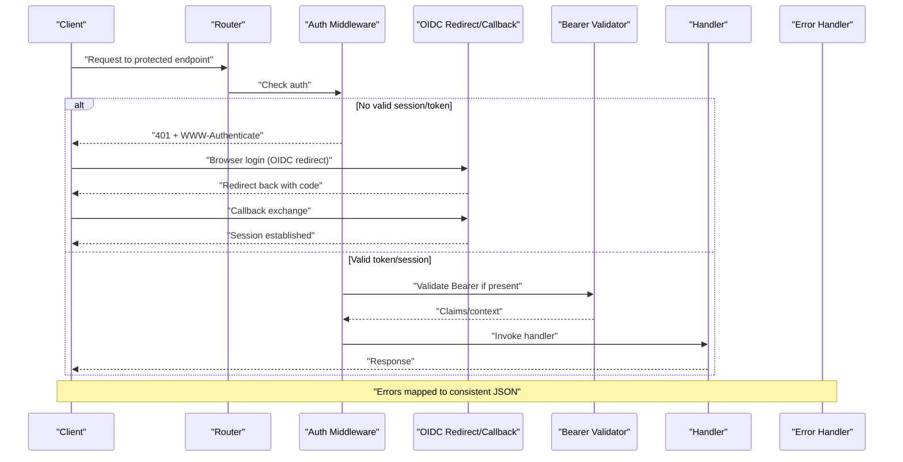
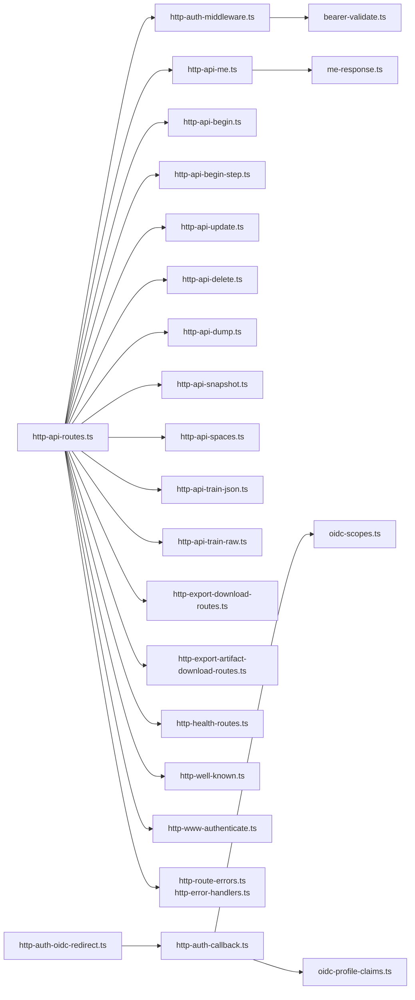

# HTTP REST API

<cite>
**Referenced Files in This Document**
- [http-api-routes.ts](file://src/http/http-api-routes.ts)
- [http-auth-middleware.ts](file://src/http/http-auth-middleware.ts)
- [http-auth-callback.ts](file://src/http/http-auth-callback.ts)
- [http-auth-oidc-redirect.ts](file://src/http/http-auth-oidc-redirect.ts)
- [bearer-validate.ts](file://src/http/bearer-validate.ts)
- [http-api-me.ts](file://src/http/http-api-me.ts)
- [http-api-begin.ts](file://src/http/http-api-begin.ts)
- [http-api-begin-step.ts](file://src/http/http-api-begin-step.ts)
- [http-api-update.ts](file://src/http/http-api-update.ts)
- [http-api-delete.ts](file://src/http/http-api-delete.ts)
- [http-api-dump.ts](file://src/http/http-api-dump.ts)
- [http-api-snapshot.ts](file://src/http/http-api-snapshot.ts)
- [http-api-spaces.ts](file://src/http/http-api-spaces.ts)
- [http-api-train-json.ts](file://src/http/http-api-train-json.ts)
- [http-api-train-raw.ts](file://src/http/http-api-train-raw.ts)
- [http-export-download-routes.ts](file://src/http/http-export-download-routes.ts)
- [http-export-artifact-download-routes.ts](file://src/http/http-export-artifact-download-routes.ts)
- [http-health-routes.ts](file://src/http/http-health-routes.ts)
- [http-well-known.ts](file://src/http/http-well-known.ts)
- [http-www-authenticate.ts](file://src/http/http-www-authenticate.ts)
- [http-route-errors.ts](file://src/http/http-route-errors.ts)
- [http-error-handlers.ts](file://src/http/http-error-handlers.ts)
- [oidc-profile-claims.ts](file://src/http/oidc-profile-claims.ts)
- [oidc-scopes.ts](file://src/http/oidc-scopes.ts)
- [me-response.ts](file://src/me-response.ts)
- [tools/forward_schema.ts](file://src/tools/forward_schema.ts)
- [tools/train_schema.ts](file://src/tools/train_schema.ts)
- [tools/search_schema.ts](file://src/tools/search_schema.ts)
- [tools/spaces_schema.ts](file://src/tools/spaces_schema.ts)
- [tools/delete_schema.ts](file://src/tools/delete_schema.ts)
- [tools/dump_schema.ts](file://src/tools/dump_schema.ts)
- [tools/update_schema.ts](file://src/tools/update_schema.ts)
- [tools/activate_schema.ts](file://src/tools/activate_schema.ts)
- [tools/reward_schema.ts](file://src/tools/reward_schema.ts)
</cite>

## Table of Contents
1. [Introduction](#introduction)
2. [Project Structure](#project-structure)
3. [Core Components](#core-components)
4. [Architecture Overview](#architecture-overview)
5. [Detailed Component Analysis](#detailed-component-analysis)
6. [Dependency Analysis](#dependency-analysis)
7. [Performance Considerations](#performance-considerations)
8. [Troubleshooting Guide](#troubleshooting-guide)
9. [Conclusion](#conclusion)
10. [Appendices](#appendices)

## Introduction
This document provides comprehensive HTTP REST API documentation for the Kairos MCP server. It covers authentication, endpoints for memory operations, workflow management, user information, artifact handling, and system administration. It includes request/response schemas, error codes, retry strategies, rate limiting policies, versioning considerations, and practical examples.

## Project Structure
The HTTP layer is implemented under src/http with modular route handlers, middleware, and shared utilities:
- Routes are organized by feature (auth, memory/workflow tools, export downloads, health, well-known).
- Authentication is handled via OIDC redirect/callback and Bearer token validation.
- Error handling and WWW-Authenticate responses are centralized.

```mermaid
graph TB
Client["Client"] --> Router["HTTP Router<br/>http-api-routes.ts"]
Router --> AuthMW["Auth Middleware<br/>http-auth-middleware.ts"]
AuthMW --> Bearer["Bearer Validator<br/>bearer-validate.ts"]
Router --> Me["GET /api/me<br/>http-api-me.ts"]
Router --> Begin["POST /api/begin<br/>http-api-begin.ts"]
Router --> BeginStep["POST /api/begin/:id/step<br/>http-api-begin-step.ts"]
Router --> Update["PUT /api/:id<br/>http-api-update.ts"]
Router --> Delete["DELETE /api/:id<br/>http-api-delete.ts"]
Router --> Dump["GET /api/dump<br/>http-api-dump.ts"]
Router --> Snapshot["GET /api/snapshot<br/>http-api-snapshot.ts"]
Router --> Spaces["GET /api/spaces<br/>http-api-spaces.ts"]
Router --> TrainJSON["POST /api/train/json<br/>http-api-train-json.ts"]
Router --> TrainRaw["POST /api/train/raw<br/>http-api-train-raw.ts"]
Router --> ExportDL["GET /api/export/download/*<br/>http-export-download-routes.ts"]
Router --> ArtifactDL["GET /api/artifact/download/*<br/>http-export-artifact-download-routes.ts"]
Router --> Health["GET /health<br/>http-health-routes.ts"]
Router --> WellKnown["GET /.well-known/*<br/>http-well-known.ts"]
Router --> WWWAuth["WWW-Authenticate Helper<br/>http-www-authenticate.ts"]
Router --> Errors["Route Errors & Handlers<br/>http-route-errors.ts<br/>http-error-handlers.ts"]
```

**Diagram sources**
- [http-api-routes.ts](file://src/http/http-api-routes.ts)
- [http-auth-middleware.ts](file://src/http/http-auth-middleware.ts)
- [bearer-validate.ts](file://src/http/bearer-validate.ts)
- [http-api-me.ts](file://src/http/http-api-me.ts)
- [http-api-begin.ts](file://src/http/http-api-begin.ts)
- [http-api-begin-step.ts](file://src/http/http-api-begin-step.ts)
- [http-api-update.ts](file://src/http/http-api-update.ts)
- [http-api-delete.ts](file://src/http/http-api-delete.ts)
- [http-api-dump.ts](file://src/http/http-api-dump.ts)
- [http-api-snapshot.ts](file://src/http/http-api-snapshot.ts)
- [http-api-spaces.ts](file://src/http/http-api-spaces.ts)
- [http-api-train-json.ts](file://src/http/http-api-train-json.ts)
- [http-api-train-raw.ts](file://src/http/http-api-train-raw.ts)
- [http-export-download-routes.ts](file://src/http/http-export-download-routes.ts)
- [http-export-artifact-download-routes.ts](file://src/http/http-export-artifact-download-routes.ts)
- [http-health-routes.ts](file://src/http/http-health-routes.ts)
- [http-well-known.ts](file://src/http/http-well-known.ts)
- [http-www-authenticate.ts](file://src/http/http-www-authenticate.ts)
- [http-route-errors.ts](file://src/http/http-route-errors.ts)
- [http-error-handlers.ts](file://src/http/http-error-handlers.ts)

**Section sources**
- [http-api-routes.ts](file://src/http/http-api-routes.ts)
- [http-auth-middleware.ts](file://src/http/http-auth-middleware.ts)
- [bearer-validate.ts](file://src/http/bearer-validate.ts)
- [http-health-routes.ts](file://src/http/http-health-routes.ts)
- [http-well-known.ts](file://src/http/http-well-known.ts)

## Core Components
- Authentication
  - OIDC Redirect: Initiates browser-based login flow to the configured OIDC provider.
  - OIDC Callback: Completes login by exchanging authorization code for tokens and establishing a session.
  - Bearer Token Validation: Validates Authorization: Bearer <token> for programmatic access.
  - WWW-Authenticate: Provides standardized challenge headers when authentication is required or fails.
- Route Handlers
  - User info: GET /api/me
  - Workflow lifecycle: POST /api/begin, POST /api/begin/:id/step, PUT /api/:id, DELETE /api/:id
  - Data operations: GET /api/dump, GET /api/snapshot, GET /api/spaces
  - Training: POST /api/train/json, POST /api/train/raw
  - Downloads: GET /api/export/download/*, GET /api/artifact/download/*
  - System: GET /health, GET /.well-known/*
- Shared Utilities
  - Error mapping and response formatting
  - Rate limiting and metrics middleware integration points
  - OIDC scopes and profile claims extraction

**Section sources**
- [http-auth-callback.ts](file://src/http/http-auth-callback.ts)
- [http-auth-oidc-redirect.ts](file://src/http/http-auth-oidc-redirect.ts)
- [bearer-validate.ts](file://src/http/bearer-validate.ts)
- [http-www-authenticate.ts](file://src/http/http-www-authenticate.ts)
- [http-api-me.ts](file://src/http/http-api-me.ts)
- [http-api-begin.ts](file://src/http/http-api-begin.ts)
- [http-api-begin-step.ts](file://src/http/http-api-begin-step.ts)
- [http-api-update.ts](file://src/http/http-api-update.ts)
- [http-api-delete.ts](file://src/http/http-api-delete.ts)
- [http-api-dump.ts](file://src/http/http-api-dump.ts)
- [http-api-snapshot.ts](file://src/http/http-api-snapshot.ts)
- [http-api-spaces.ts](file://src/http/http-api-spaces.ts)
- [http-api-train-json.ts](file://src/http/http-api-train-json.ts)
- [http-api-train-raw.ts](file://src/http/http-api-train-raw.ts)
- [http-export-download-routes.ts](file://src/http/http-export-download-routes.ts)
- [http-export-artifact-download-routes.ts](file://src/http/http-export-artifact-download-routes.ts)
- [http-health-routes.ts](file://src/http/http-health-routes.ts)
- [http-well-known.ts](file://src/http/http-well-known.ts)
- [http-route-errors.ts](file://src/http/http-route-errors.ts)
- [http-error-handlers.ts](file://src/http/http-error-handlers.ts)
- [oidc-scopes.ts](file://src/http/oidc-scopes.ts)
- [oidc-profile-claims.ts](file://src/http/oidc-profile-claims.ts)
- [me-response.ts](file://src/me-response.ts)

## Architecture Overview
Authentication and routing flow:
- Unauthenticated requests to protected routes trigger WWW-Authenticate challenges.
- Browser-based login uses OIDC redirect and callback to obtain tokens and set session context.
- Programmatic clients use Bearer tokens validated per request.
- Route handlers invoke tool logic and return JSON or file streams.

**Diagram sources**
- [http-auth-middleware.ts](file://src/http/http-auth-middleware.ts)
- [http-auth-oidc-redirect.ts](file://src/http/http-auth-oidc-redirect.ts)
- [http-auth-callback.ts](file://src/http/http-auth-callback.ts)
- [bearer-validate.ts](file://src/http/bearer-validate.ts)
- [http-www-authenticate.ts](file://src/http/http-www-authenticate.ts)
- [http-error-handlers.ts](file://src/http/http-error-handlers.ts)

## Detailed Component Analysis

### Authentication Endpoints
- OIDC Redirect
  - Method: GET
  - Path: /api/auth/oidc/redirect
  - Purpose: Start browser-based login flow.
  - Query Parameters:
    - redirect_uri: string; optional; where to return after successful login.
  - Response: 302 redirect to OIDC provider.
  - Notes: Uses configured OIDC discovery and scopes.

- OIDC Callback
  - Method: GET
  - Path: /api/auth/oidc/callback
  - Query Parameters:
    - code: string; authorization code from OIDC provider.
    - state: string; CSRF/state parameter.
    - redirect_uri: string; optional; final redirect after callback.
  - Response: 302 redirect to client-provided redirect_uri with session established.
  - Security: State validation and code exchange performed server-side.

- WWW-Authenticate
  - Behavior: When authentication is missing or invalid, responses include a WWW-Authenticate header indicating supported schemes (e.g., Bearer).
  - Header Example: WWW-Authenticate: Bearer realm="kairos"

**Section sources**
- [http-auth-oidc-redirect.ts](file://src/http/http-auth-oidc-redirect.ts)
- [http-auth-callback.ts](file://src/http/http-auth-callback.ts)
- [http-www-authenticate.ts](file://src/http/http-www-authenticate.ts)
- [oidc-scopes.ts](file://src/http/oidc-scopes.ts)

### User Information
- Get Current User
  - Method: GET
  - Path: /api/me
  - Authentication: Required (Bearer or session).
  - Response Schema:
    - id: string; unique user identifier.
    - email: string; user email address.
    - name: string; display name.
    - groups: string[]; group memberships used for authorization.
    - tenant: string; tenant context if applicable.
  - Status Codes:
    - 200 OK: Successful retrieval.
    - 401 Unauthorized: Missing or invalid credentials.
    - 403 Forbidden: Insufficient permissions.

**Section sources**
- [http-api-me.ts](file://src/http/http-api-me.ts)
- [me-response.ts](file://src/me-response.ts)
- [bearer-validate.ts](file://src/http/bearer-validate.ts)

### Workflow Management
- Begin Workflow
  - Method: POST
  - Path: /api/begin
  - Authentication: Required.
  - Request Body:
    - space: string; target space slug.
    - protocol: string; protocol slug.
    - inputs: object; protocol-specific input schema.
  - Response Schema:
    - id: string; workflow instance ID.
    - status: string; initial status.
    - next_step: string; first step slug.
    - artifacts: array; initial artifact references.
  - Status Codes:
    - 201 Created: Workflow started.
    - 400 Bad Request: Invalid inputs or protocol not found.
    - 401/403: Authentication/authorization failures.

- Continue Step
  - Method: POST
  - Path: /api/begin/:id/step
  - Authentication: Required.
  - Path Parameters:
    - id: string; workflow instance ID.
  - Request Body:
    - step: string; step slug to execute.
    - inputs: object; step-specific inputs.
  - Response Schema:
    - id: string; workflow instance ID.
    - status: string; updated status.
    - next_step: string|null; next step slug or null if complete.
    - outputs: object; step outputs.
    - artifacts: array; updated artifact references.
  - Status Codes:
    - 200 OK: Step executed successfully.
    - 400 Bad Request: Invalid step or inputs.
    - 404 Not Found: Workflow instance not found.
    - 401/403: Authentication/authorization failures.

- Update Workflow
  - Method: PUT
  - Path: /api/:id
  - Authentication: Required.
  - Path Parameters:
    - id: string; workflow instance ID.
  - Request Body:
    - fields: object; updatable fields for the workflow instance.
  - Response Schema:
    - id: string; workflow instance ID.
    - status: string; updated status.
    - next_step: string|null; next step slug or null if complete.
    - outputs: object; latest outputs.
    - artifacts: array; current artifact references.
  - Status Codes:
    - 200 OK: Updated successfully.
    - 400 Bad Request: Invalid update payload.
    - 404 Not Found: Workflow instance not found.
    - 401/403: Authentication/authorization failures.

- Delete Workflow
  - Method: DELETE
  - Path: /api/:id
  - Authentication: Required.
  - Path Parameters:
    - id: string; workflow instance ID.
  - Response Schema:
    - success: boolean; deletion result.
  - Status Codes:
    - 200 OK: Deleted successfully.
    - 404 Not Found: Workflow instance not found.
    - 401/403: Authentication/authorization failures.

**Section sources**
- [http-api-begin.ts](file://src/http/http-api-begin.ts)
- [http-api-begin-step.ts](file://src/http/http-api-begin-step.ts)
- [http-api-update.ts](file://src/http/http-api-update.ts)
- [http-api-delete.ts](file://src/http/http-api-delete.ts)
- [tools/forward_schema.ts](file://src/tools/forward_schema.ts)
- [tools/activate_schema.ts](file://src/tools/activate_schema.ts)

### Memory Operations
- Dump Memory
  - Method: GET
  - Path: /api/dump
  - Authentication: Required.
  - Query Parameters:
    - space: string; optional; filter by space.
    - limit: number; optional; max items to return.
    - offset: number; optional; pagination offset.
  - Response Schema:
    - items: array; memory entries.
    - total: number; total count matching filters.
  - Status Codes:
    - 200 OK: Dump returned.
    - 400 Bad Request: Invalid query parameters.
    - 401/403: Authentication/authorization failures.

- Snapshot
  - Method: GET
  - Path: /api/snapshot
  - Authentication: Required.
  - Query Parameters:
    - format: string; snapshot format (e.g., jsonl).
    - space: string; optional; filter by space.
  - Response: File stream (application/octet-stream or application/x-ndjson depending on format).
  - Status Codes:
    - 200 OK: Snapshot streamed.
    - 400 Bad Request: Unsupported format or invalid parameters.
    - 401/403: Authentication/authorization failures.

- List Spaces
  - Method: GET
  - Path: /api/spaces
  - Authentication: Required.
  - Response Schema:
    - spaces: array; list of space objects with metadata.
  - Status Codes:
    - 200 OK: Spaces listed.
    - 401/403: Authentication/authorization failures.

**Section sources**
- [http-api-dump.ts](file://src/http/http-api-dump.ts)
- [http-api-snapshot.ts](file://src/http/http-api-snapshot.ts)
- [http-api-spaces.ts](file://src/http/http-api-spaces.ts)
- [tools/dump_schema.ts](file://src/tools/dump_schema.ts)
- [tools/spaces_schema.ts](file://src/tools/spaces_schema.ts)

### Training and Tuning
- Train JSON
  - Method: POST
  - Path: /api/train/json
  - Authentication: Required.
  - Request Body:
    - space: string; target space.
    - items: array; training items conforming to train schema.
  - Response Schema:
    - job_id: string; training job identifier.
    - status: string; initial status.
  - Status Codes:
    - 202 Accepted: Job queued.
    - 400 Bad Request: Invalid training payload.
    - 401/403: Authentication/authorization failures.

- Train Raw
  - Method: POST
  - Path: /api/train/raw
  - Authentication: Required.
  - Request Body:
    - space: string; target space.
    - raw: string; raw content to be parsed into training items.
  - Response Schema:
    - job_id: string; training job identifier.
    - status: string; initial status.
  - Status Codes:
    - 202 Accepted: Job queued.
    - 400 Bad Request: Parsing errors or invalid content.
    - 401/403: Authentication/authorization failures.

**Section sources**
- [http-api-train-json.ts](file://src/http/http-api-train-json.ts)
- [http-api-train-raw.ts](file://src/http/http-api-train-raw.ts)
- [tools/train_schema.ts](file://src/tools/train_schema.ts)

### Artifact Handling
- Download Export
  - Method: GET
  - Path: /api/export/download/:exportId
  - Authentication: Required.
  - Path Parameters:
    - exportId: string; export identifier.
  - Response: File stream (content type depends on exported bundle).
  - Status Codes:
    - 200 OK: Streamed export.
    - 404 Not Found: Export not found.
    - 401/403: Authentication/authorization failures.

- Download Artifact
  - Method: GET
  - Path: /api/artifact/download/:artifactId
  - Authentication: Required.
  - Path Parameters:
    - artifactId: string; artifact identifier.
  - Response: File stream (content type inferred from artifact metadata).
  - Status Codes:
    - 200 OK: Streamed artifact.
    - 404 Not Found: Artifact not found.
    - 401/403: Authentication/authorization failures.

**Section sources**
- [http-export-download-routes.ts](file://src/http/http-export-download-routes.ts)
- [http-export-artifact-download-routes.ts](file://src/http/http-export-artifact-download-routes.ts)

### System Administration
- Health Check
  - Method: GET
  - Path: /health
  - Authentication: None.
  - Response Schema:
    - status: string; overall health status.
    - components: object; subcomponent statuses.
  - Status Codes:
    - 200 OK: Healthy.
    - 503 Service Unavailable: Degraded or unhealthy.

- Well-Known
  - Method: GET
  - Path: /.well-known/*
  - Authentication: None.
  - Purpose: Expose configuration and capabilities (e.g., OIDC discovery, server metadata).
  - Response: JSON or text depending on resource.
  - Status Codes:
    - 200 OK: Resource available.
    - 404 Not Found: Unknown resource.

**Section sources**
- [http-health-routes.ts](file://src/http/http-health-routes.ts)
- [http-well-known.ts](file://src/http/http-well-known.ts)

## Dependency Analysis
Key dependencies between HTTP components:
- Routes depend on auth middleware and bearer validator.
- Handlers rely on tool schemas for validation and output shaping.
- Error handlers centralize error mapping and response formatting.
- OIDC utilities provide scopes and profile claim extraction.

**Diagram sources**
- [http-api-routes.ts](file://src/http/http-api-routes.ts)
- [http-auth-middleware.ts](file://src/http/http-auth-middleware.ts)
- [bearer-validate.ts](file://src/http/bearer-validate.ts)
- [http-api-me.ts](file://src/http/http-api-me.ts)
- [http-api-begin.ts](file://src/http/http-api-begin.ts)
- [http-api-begin-step.ts](file://src/http/http-api-begin-step.ts)
- [http-api-update.ts](file://src/http/http-api-update.ts)
- [http-api-delete.ts](file://src/http/http-api-delete.ts)
- [http-api-dump.ts](file://src/http/http-api-dump.ts)
- [http-api-snapshot.ts](file://src/http/http-api-snapshot.ts)
- [http-api-spaces.ts](file://src/http/http-api-spaces.ts)
- [http-api-train-json.ts](file://src/http/http-api-train-json.ts)
- [http-api-train-raw.ts](file://src/http/http-api-train-raw.ts)
- [http-export-download-routes.ts](file://src/http/http-export-download-routes.ts)
- [http-export-artifact-download-routes.ts](file://src/http/http-export-artifact-download-routes.ts)
- [http-health-routes.ts](file://src/http/http-health-routes.ts)
- [http-well-known.ts](file://src/http/http-well-known.ts)
- [http-auth-oidc-redirect.ts](file://src/http/http-auth-oidc-redirect.ts)
- [http-auth-callback.ts](file://src/http/http-auth-callback.ts)
- [oidc-scopes.ts](file://src/http/oidc-scopes.ts)
- [oidc-profile-claims.ts](file://src/http/oidc-profile-claims.ts)
- [me-response.ts](file://src/me-response.ts)
- [http-route-errors.ts](file://src/http/http-route-errors.ts)
- [http-error-handlers.ts](file://src/http/http-error-handlers.ts)

**Section sources**
- [http-api-routes.ts](file://src/http/http-api-routes.ts)
- [http-auth-middleware.ts](file://src/http/http-auth-middleware.ts)
- [bearer-validate.ts](file://src/http/bearer-validate.ts)
- [http-route-errors.ts](file://src/http/http-route-errors.ts)
- [http-error-handlers.ts](file://src/http/http-error-handlers.ts)

## Performance Considerations
- Streaming Responses: Export and artifact downloads use streaming to minimize memory usage.
- Pagination: Dump endpoint supports limit/offset to control payload size.
- Concurrency Limits: Server may apply concurrency limits to CPU-intensive operations (training, embedding).
- Caching: Session and token validation can leverage caches to reduce overhead.
- Metrics: HTTP metrics middleware collects latency and throughput data for monitoring.

[No sources needed since this section provides general guidance]

## Troubleshooting Guide
Common issues and resolutions:
- 401 Unauthorized
  - Cause: Missing or invalid Authorization header or expired session.
  - Action: Ensure Bearer token is present and valid; re-authenticate via OIDC callback if using browser flow.
- 403 Forbidden
  - Cause: Insufficient permissions for the requested operation.
  - Action: Verify user groups and space access controls.
- 400 Bad Request
  - Cause: Invalid request body or query parameters.
  - Action: Validate against documented schemas; check field types and constraints.
- 404 Not Found
  - Cause: Resource identifier does not exist.
  - Action: Confirm IDs and paths; ensure resources were created previously.
- 500 Internal Server Error
  - Cause: Unexpected server-side failure.
  - Action: Check server logs; report with request correlation IDs.
- 503 Service Unavailable
  - Cause: Downstream dependency unhealthy (database, vector store).
  - Action: Retry with exponential backoff; monitor /health.

Retry Strategy:
- Use exponential backoff with jitter for transient errors (429, 500, 503).
- Limit retries to avoid cascading failures.
- Implement circuit breakers for long-running jobs.

Rate Limiting Policies:
- Per-client request rates enforced at the router/middleware layer.
- Excess requests receive 429 Too Many Requests with Retry-After header.
- Adjust limits based on deployment tier and capacity.

Versioning Considerations:
- Base path remains stable (/api); future major changes will introduce versioned prefixes (e.g., /v2/api).
- Content negotiation and Accept headers may be used for schema evolution.
- Deprecation notices communicated via response headers and well-known endpoints.

**Section sources**
- [http-route-errors.ts](file://src/http/http-route-errors.ts)
- [http-error-handlers.ts](file://src/http/http-error-handlers.ts)
- [http-health-routes.ts](file://src/http/http-health-routes.ts)
- [http-well-known.ts](file://src/http/http-well-known.ts)

## Conclusion
The Kairos MCP HTTP REST API provides secure, structured endpoints for workflow management, memory operations, training, artifact handling, and system administration. Authentication supports both OIDC browser flows and Bearer tokens. Consistent error handling and streaming responses enhance reliability and performance. Follow the documented schemas and retry strategies for robust integrations.

[No sources needed since this section summarizes without analyzing specific files]

## Appendices

### Authentication Examples
- Bearer Token
  - curl example:
    - curl -H "Authorization: Bearer YOUR_TOKEN" https://SERVER/api/me
- OIDC Redirect
  - curl example:
    - curl -L "https://SERVER/api/auth/oidc/redirect?redirect_uri=YOUR_REDIRECT_URI"
- OIDC Callback
  - curl example:
    - curl -L "https://SERVER/api/auth/oidc/callback?code=AUTH_CODE&state=STATE&redirect_uri=YOUR_REDIRECT_URI"

### Common Request/Response Schemas
- /api/me Response
  - Fields: id, email, name, groups, tenant
- /api/begin Request
  - Fields: space, protocol, inputs
- /api/begin/:id/step Request
  - Fields: step, inputs
- /api/:id Update Request
  - Fields: fields
- /api/dump Response
  - Fields: items, total
- /api/spaces Response
  - Fields: spaces
- /api/train/json Request
  - Fields: space, items
- /api/train/raw Request
  - Fields: space, raw

**Section sources**
- [http-api-me.ts](file://src/http/http-api-me.ts)
- [http-api-begin.ts](file://src/http/http-api-begin.ts)
- [http-api-begin-step.ts](file://src/http/http-api-begin-step.ts)
- [http-api-update.ts](file://src/http/http-api-update.ts)
- [http-api-dump.ts](file://src/http/http-api-dump.ts)
- [http-api-spaces.ts](file://src/http/http-api-spaces.ts)
- [http-api-train-json.ts](file://src/http/http-api-train-json.ts)
- [http-api-train-raw.ts](file://src/http/http-api-train-raw.ts)
- [me-response.ts](file://src/me-response.ts)
- [tools/forward_schema.ts](file://src/tools/forward_schema.ts)
- [tools/train_schema.ts](file://src/tools/train_schema.ts)
- [tools/dump_schema.ts](file://src/tools/dump_schema.ts)
- [tools/spaces_schema.ts](file://src/tools/spaces_schema.ts)