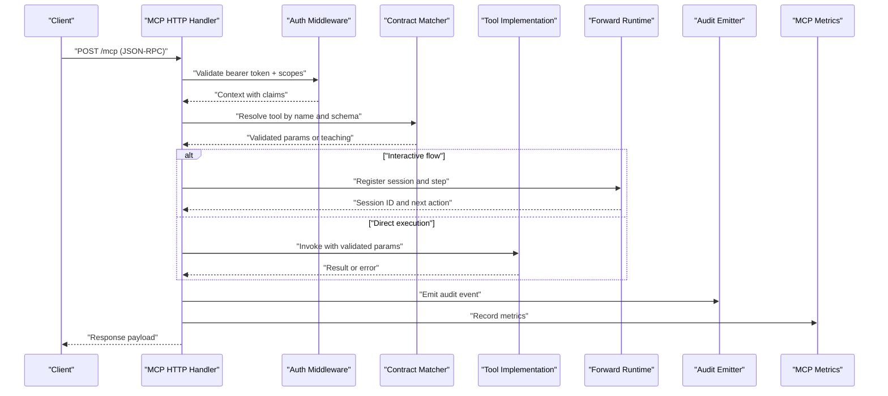
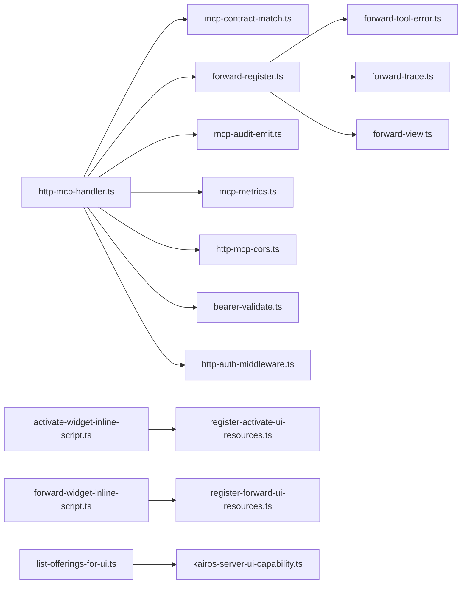
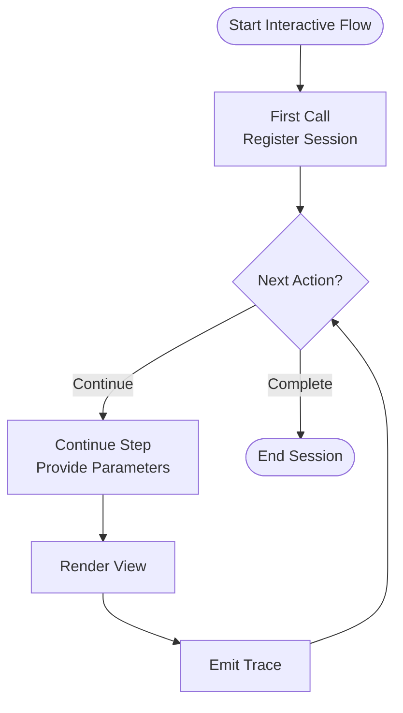

# MCP Protocol Interface

<cite>
**Referenced Files in This Document**
- [http-mcp-handler.ts](file://src/http/http-mcp-handler.ts)
- [mcp-audit-emit.ts](file://src/http/mcp-audit-emit.ts)
- [http-mcp-cors.ts](file://src/http/http-mcp-cors.ts)
- [mcp-contract-match.ts](file://src/tools/mcp-contract-match.ts)
- [mcp-tool-input-teaching.ts](file://src/tools/mcp-tool-input-teaching.ts)
- [mcp-runtime-error.ts](file://src/tools/mcp-runtime-error.ts)
- [mcp-loose-input-schema.ts](file://src/tools/mcp-loose-input-schema.ts)
- [forward-register.ts](file://src/tools/forward-register.ts)
- [forward-tool-error.ts](file://src/tools/forward-tool-error.ts)
- [forward-trace.ts](file://src/tools/forward-trace.ts)
- [forward-view.ts](file://src/tools/forward-view.ts)
- [activate-widget-inline-script.ts](file://src/mcp-apps/activate-widget-inline-script.ts)
- [forward-widget-inline-script.ts](file://src/mcp-apps/forward-widget-inline-script.ts)
- [register-activate-ui-resources.ts](file://src/mcp-apps/register-activate-ui-resources.ts)
- [register-forward-ui-resources.ts](file://src/mcp-apps/register-forward-ui-resources.ts)
- [list-offerings-for-ui.ts](file://src/mcp-apps/list-offerings-for-ui.ts)
- [kairos-server-ui-capability.ts](file://src/mcp-apps/kairos-server-ui-capability.ts)
- [oidc-scopes.ts](file://src/http/oidc-scopes.ts)
- [bearer-validate.ts](file://src/http/bearer-validate.ts)
- [http-auth-middleware.ts](file://src/http/http-auth-middleware.ts)
- [mcp-metrics.ts](file://src/services/metrics/mcp-metrics.ts)
- [test-ai-mcp-integration.mjs](file://scripts/test-ai-mcp-integration.mjs)
- [mcp-client-utils.ts](file://tests/utils/mcp-client-utils.ts)
- [mcp-list-tools.test.ts](file://tests/integration/mcp-list-tools.test.ts)
- [mcp-host-client-groups.test.ts](file://tests/integration/mcp-host-client-groups.test.ts)
- [mcp-ui-resource-read.test.ts](file://tests/integration/mcp-ui-resource-read.test.ts)
- [mcp-auth-jsonrpc-error.test.ts](file://tests/integration/mcp-auth-jsonrpc-error.test.ts)
- [http-mcp-concurrency.test.ts](file://tests/integration/http-mcp-concurrency.test.ts)
</cite>

## Table of Contents
1. [Introduction](#introduction)
2. [Project Structure](#project-structure)
3. [Core Components](#core-components)
4. [Architecture Overview](#architecture-overview)
5. [Detailed Component Analysis](#detailed-component-analysis)
6. [Dependency Analysis](#dependency-analysis)
7. [Performance Considerations](#performance-considerations)
8. [Security and Access Control](#security-and-access-control)
9. [Streaming, Real-time Communication, and Progress Reporting](#streaming-real-time-communication-and-progress-reporting)
10. [Protocol Versioning and Compatibility](#protocol-versioning-and-compatibility)
11. [Implementation Examples](#implementation-examples)
12. [Troubleshooting Guide](#troubleshooting-guide)
13. [Conclusion](#conclusion)

## Introduction
This document describes the Model Context Protocol (MCP) interface as implemented in this repository for AI tool integration. It covers tool registration and discovery, invocation patterns, input/output contracts, parameter validation, lifecycle management, error handling, streaming and real-time communication, progress reporting, security and authentication flows, access control, client/server implementation examples, and protocol versioning strategies. The goal is to provide a comprehensive reference for both implementers and consumers of the MCP interface.

## Project Structure
The MCP implementation spans HTTP transport, tool contracts, UI offerings, metrics, and tests. Key areas include:
- HTTP transport and request handling for MCP endpoints
- Tool contract matching and input schema validation
- Forwarding runtime for interactive workflows
- UI widget resources for activation and forwarding
- Security middleware and OIDC scopes
- Metrics and audit logging
- Integration and unit tests validating behavior

```mermaid
graph TB
subgraph "HTTP Transport"
H1["http-mcp-handler.ts"]
H2["http-mcp-cors.ts"]
H3["mcp-audit-emit.ts"]
end
subgraph "Tool Contracts"
T1["mcp-contract-match.ts"]
T2["mcp-tool-input-teaching.ts"]
T3["mcp-runtime-error.ts"]
T4["mcp-loose-input-schema.ts"]
end
subgraph "Forward Runtime"
F1["forward-register.ts"]
F2["forward-tool-error.ts"]
F3["forward-trace.ts"]
F4["forward-view.ts"]
end
subgraph "UI Offerings"
U1["activate-widget-inline-script.ts"]
U2["forward-widget-inline-script.ts"]
U3["register-activate-ui-resources.ts"]
U4["register-forward-ui-resources.ts"]
U5["list-offerings-for-ui.ts"]
U6["kairos-server-ui-capability.ts"]
end
subgraph "Security"
S1["bearer-validate.ts"]
S2["http-auth-middleware.ts"]
S3["oidc-scopes.ts"]
end
subgraph "Observability"
O1["mcp-metrics.ts"]
end
H1 --> T1
H1 --> T2
H1 --> T3
H1 --> T4
H1 --> F1
H1 --> F2
H1 --> F3
H1 --> F4
H1 --> U1
H1 --> U2
H1 --> U3
H1 --> U4
H1 --> U5
H1 --> U6
H1 --> S1
H1 --> S2
H1 --> S3
H1 --> O1
H1 --> H2
H1 --> H3
```

**Diagram sources**
- [http-mcp-handler.ts](file://src/http/http-mcp-handler.ts)
- [http-mcp-cors.ts](file://src/http/http-mcp-cors.ts)
- [mcp-audit-emit.ts](file://src/http/mcp-audit-emit.ts)
- [mcp-contract-match.ts](file://src/tools/mcp-contract-match.ts)
- [mcp-tool-input-teaching.ts](file://src/tools/mcp-tool-input-teaching.ts)
- [mcp-runtime-error.ts](file://src/tools/mcp-runtime-error.ts)
- [mcp-loose-input-schema.ts](file://src/tools/mcp-loose-input-schema.ts)
- [forward-register.ts](file://src/tools/forward-register.ts)
- [forward-tool-error.ts](file://src/tools/forward-tool-error.ts)
- [forward-trace.ts](file://src/tools/forward-trace.ts)
- [forward-view.ts](file://src/tools/forward-view.ts)
- [activate-widget-inline-script.ts](file://src/mcp-apps/activate-widget-inline-script.ts)
- [forward-widget-inline-script.ts](file://src/mcp-apps/forward-widget-inline-script.ts)
- [register-activate-ui-resources.ts](file://src/mcp-apps/register-activate-ui-resources.ts)
- [register-forward-ui-resources.ts](file://src/mcp-apps/register-forward-ui-resources.ts)
- [list-offerings-for-ui.ts](file://src/mcp-apps/list-offerings-for-ui.ts)
- [kairos-server-ui-capability.ts](file://src/mcp-apps/kairos-server-ui-capability.ts)
- [bearer-validate.ts](file://src/http/bearer-validate.ts)
- [http-auth-middleware.ts](file://src/http/http-auth-middleware.ts)
- [oidc-scopes.ts](file://src/http/oidc-scopes.ts)
- [mcp-metrics.ts](file://src/services/metrics/mcp-metrics.ts)

**Section sources**
- [http-mcp-handler.ts](file://src/http/http-mcp-handler.ts)
- [mcp-contract-match.ts](file://src/tools/mcp-contract-match.ts)
- [mcp-tool-input-teaching.ts](file://src/tools/mcp-tool-input-teaching.ts)
- [mcp-runtime-error.ts](file://src/tools/mcp-runtime-error.ts)
- [mcp-loose-input-schema.ts](file://src/tools/mcp-loose-input-schema.ts)
- [forward-register.ts](file://src/tools/forward-register.ts)
- [forward-tool-error.ts](file://src/tools/forward-tool-error.ts)
- [forward-trace.ts](file://src/tools/forward-trace.ts)
- [forward-view.ts](file://src/tools/forward-view.ts)
- [activate-widget-inline-script.ts](file://src/mcp-apps/activate-widget-inline-script.ts)
- [forward-widget-inline-script.ts](file://src/mcp-apps/forward-widget-inline-script.ts)
- [register-activate-ui-resources.ts](file://src/mcp-apps/register-activate-ui-resources.ts)
- [register-forward-ui-resources.ts](file://src/mcp-apps/register-forward-ui-resources.ts)
- [list-offerings-for-ui.ts](file://src/mcp-apps/list-offerings-for-ui.ts)
- [kairos-server-ui-capability.ts](file://src/mcp-apps/kairos-server-ui-capability.ts)
- [bearer-validate.ts](file://src/http/bearer-validate.ts)
- [http-auth-middleware.ts](file://src/http/http-auth-middleware.ts)
- [oidc-scopes.ts](file://src/http/oidc-scopes.ts)
- [mcp-metrics.ts](file://src/services/metrics/mcp-metrics.ts)

## Core Components
- MCP HTTP handler: Central entry point for MCP requests over HTTP, orchestrating routing, auth, metrics, and response formatting.
- Contract matcher: Validates incoming tool calls against registered schemas and enforces required fields and types.
- Input teaching/validation: Provides guidance and structured errors when inputs do not match expected schemas.
- Loose input schema: Allows flexible parsing for robustness while still enforcing core constraints.
- Forward runtime: Manages interactive sessions, step progression, tracing, and view rendering for long-running operations.
- UI offerings: Supplies inline scripts and resource registrations that enable browser-based activation and forwarding experiences.
- Security middleware: Validates bearer tokens and applies OIDC scopes to enforce access control.
- Audit and metrics: Emits audit events and exposes operational metrics for MCP usage.

**Section sources**
- [http-mcp-handler.ts](file://src/http/http-mcp-handler.ts)
- [mcp-contract-match.ts](file://src/tools/mcp-contract-match.ts)
- [mcp-tool-input-teaching.ts](file://src/tools/mcp-tool-input-teaching.ts)
- [mcp-loose-input-schema.ts](file://src/tools/mcp-loose-input-schema.ts)
- [forward-register.ts](file://src/tools/forward-register.ts)
- [forward-tool-error.ts](file://src/tools/forward-tool-error.ts)
- [forward-trace.ts](file://src/tools/forward-trace.ts)
- [forward-view.ts](file://src/tools/forward-view.ts)
- [activate-widget-inline-script.ts](file://src/mcp-apps/activate-widget-inline-script.ts)
- [forward-widget-inline-script.ts](file://src/mcp-apps/forward-widget-inline-script.ts)
- [register-activate-ui-resources.ts](file://src/mcp-apps/register-activate-ui-resources.ts)
- [register-forward-ui-resources.ts](file://src/mcp-apps/register-forward-ui-resources.ts)
- [list-offerings-for-ui.ts](file://src/mcp-apps/list-offerings-for-ui.ts)
- [kairos-server-ui-capability.ts](file://src/mcp-apps/kairos-server-ui-capability.ts)
- [bearer-validate.ts](file://src/http/bearer-validate.ts)
- [http-auth-middleware.ts](file://src/http/http-auth-middleware.ts)
- [oidc-scopes.ts](file://src/http/oidc-scopes.ts)
- [mcp-audit-emit.ts](file://src/http/mcp-audit-emit.ts)
- [mcp-metrics.ts](file://src/services/metrics/mcp-metrics.ts)

## Architecture Overview
The MCP server exposes HTTP endpoints that accept JSON-RPC-like messages. Requests are authenticated via bearer tokens and scoped by OIDC policies. The handler routes calls to specific tools based on name and parameters, validates inputs against schemas, executes business logic, and returns results or errors. For interactive flows, the forward runtime maintains state across steps and supports tracing and view rendering. UI widgets can be embedded to drive activation and forwarding from browsers.

**Diagram sources**
- [http-mcp-handler.ts](file://src/http/http-mcp-handler.ts)
- [bearer-validate.ts](file://src/http/bearer-validate.ts)
- [http-auth-middleware.ts](file://src/http/http-auth-middleware.ts)
- [mcp-contract-match.ts](file://src/tools/mcp-contract-match.ts)
- [forward-register.ts](file://src/tools/forward-register.ts)
- [mcp-audit-emit.ts](file://src/http/mcp-audit-emit.ts)
- [mcp-metrics.ts](file://src/services/metrics/mcp-metrics.ts)

## Detailed Component Analysis

### MCP HTTP Handler
Responsibilities:
- Parse incoming requests and normalize payloads
- Apply CORS configuration
- Enforce authentication and authorization
- Route to appropriate tool handlers
- Emit audit logs and metrics
- Format responses consistently

Key behaviors:
- Supports both direct tool invocations and interactive flows
- Integrates with contract matcher for schema enforcement
- Coordinates with forward runtime for multi-step processes

**Section sources**
- [http-mcp-handler.ts](file://src/http/http-mcp-handler.ts)
- [http-mcp-cors.ts](file://src/http/http-mcp-cors.ts)
- [mcp-audit-emit.ts](file://src/http/mcp-audit-emit.ts)
- [mcp-metrics.ts](file://src/services/metrics/mcp-metrics.ts)

### Tool Contract Matching and Validation
Responsibilities:
- Match incoming tool calls to registered definitions
- Validate parameters against schemas
- Provide structured teaching when inputs are invalid
- Support loose input parsing for resilience

Key behaviors:
- Enforces required fields and type constraints
- Returns actionable guidance for incorrect inputs
- Maintains backward compatibility through flexible parsing where safe

**Section sources**
- [mcp-contract-match.ts](file://src/tools/mcp-contract-match.ts)
- [mcp-tool-input-teaching.ts](file://src/tools/mcp-tool-input-teaching.ts)
- [mcp-loose-input-schema.ts](file://src/tools/mcp-loose-input-schema.ts)

### Forward Runtime (Interactive Workflows)
Responsibilities:
- Register and manage interactive sessions
- Track step progression and state
- Render views for user interaction
- Handle tool errors within interactive context
- Maintain trace information for debugging

Key behaviors:
- Supports first-call and continue patterns
- Produces deterministic next actions
- Integrates with tracing and view rendering utilities

**Section sources**
- [forward-register.ts](file://src/tools/forward-register.ts)
- [forward-tool-error.ts](file://src/tools/forward-tool-error.ts)
- [forward-trace.ts](file://src/tools/forward-trace.ts)
- [forward-view.ts](file://src/tools/forward-view.ts)

### UI Offerings and Widget Resources
Responsibilities:
- Provide inline scripts for activation and forwarding
- Register UI resources for dynamic loading
- List available offerings for the UI
- Expose server capabilities to clients

Key behaviors:
- Embeds minimal CSS/JS for quick integration
- Ensures consistent presentation across hosts
- Aligns with MCP tool contracts for seamless UX

**Section sources**
- [activate-widget-inline-script.ts](file://src/mcp-apps/activate-widget-inline-script.ts)
- [forward-widget-inline-script.ts](file://src/mcp-apps/forward-widget-inline-script.ts)
- [register-activate-ui-resources.ts](file://src/mcp-apps/register-activate-ui-resources.ts)
- [register-forward-ui-resources.ts](file://src/mcp-apps/register-forward-ui-resources.ts)
- [list-offerings-for-ui.ts](file://src/mcp-apps/list-offerings-for-ui.ts)
- [kairos-server-ui-capability.ts](file://src/mcp-apps/kairos-server-ui-capability.ts)

### Security and Authentication
Responsibilities:
- Validate bearer tokens
- Enforce OIDC scopes
- Apply middleware for protected routes
- Map claims to tenant and group contexts

Key behaviors:
- Rejects unauthorized requests early
- Limits access based on scopes and groups
- Integrates with Keycloak for identity and authorization

**Section sources**
- [bearer-validate.ts](file://src/http/bearer-validate.ts)
- [http-auth-middleware.ts](file://src/http/http-auth-middleware.ts)
- [oidc-scopes.ts](file://src/http/oidc-scopes.ts)

### Observability and Auditing
Responsibilities:
- Emit audit events for MCP operations
- Record metrics for performance monitoring
- Provide visibility into errors and latencies

Key behaviors:
- Captures request/response metadata safely
- Aggregates counts and durations
- Supports downstream alerting and dashboards

**Section sources**
- [mcp-audit-emit.ts](file://src/http/mcp-audit-emit.ts)
- [mcp-metrics.ts](file://src/services/metrics/mcp-metrics.ts)

## Dependency Analysis
The MCP system exhibits clear layering:
- HTTP transport depends on security middleware and CORS
- Handler depends on contract matcher, forward runtime, and observability
- UI offerings depend on capability listings and resource registration
- Tests validate end-to-end flows and edge cases

**Diagram sources**
- [http-mcp-handler.ts](file://src/http/http-mcp-handler.ts)
- [mcp-contract-match.ts](file://src/tools/mcp-contract-match.ts)
- [forward-register.ts](file://src/tools/forward-register.ts)
- [mcp-audit-emit.ts](file://src/http/mcp-audit-emit.ts)
- [mcp-metrics.ts](file://src/services/metrics/mcp-metrics.ts)
- [http-mcp-cors.ts](file://src/http/http-mcp-cors.ts)
- [bearer-validate.ts](file://src/http/bearer-validate.ts)
- [http-auth-middleware.ts](file://src/http/http-auth-middleware.ts)
- [forward-tool-error.ts](file://src/tools/forward-tool-error.ts)
- [forward-trace.ts](file://src/tools/forward-trace.ts)
- [forward-view.ts](file://src/tools/forward-view.ts)
- [activate-widget-inline-script.ts](file://src/mcp-apps/activate-widget-inline-script.ts)
- [register-activate-ui-resources.ts](file://src/mcp-apps/register-activate-ui-resources.ts)
- [forward-widget-inline-script.ts](file://src/mcp-apps/forward-widget-inline-script.ts)
- [register-forward-ui-resources.ts](file://src/mcp-apps/register-forward-ui-resources.ts)
- [list-offerings-for-ui.ts](file://src/mcp-apps/list-offerings-for-ui.ts)
- [kairos-server-ui-capability.ts](file://src/mcp-apps/kairos-server-ui-capability.ts)

**Section sources**
- [http-mcp-handler.ts](file://src/http/http-mcp-handler.ts)
- [mcp-contract-match.ts](file://src/tools/mcp-contract-match.ts)
- [forward-register.ts](file://src/tools/forward-register.ts)
- [mcp-audit-emit.ts](file://src/http/mcp-audit-emit.ts)
- [mcp-metrics.ts](file://src/services/metrics/mcp-metrics.ts)
- [http-mcp-cors.ts](file://src/http/http-mcp-cors.ts)
- [bearer-validate.ts](file://src/http/bearer-validate.ts)
- [http-auth-middleware.ts](file://src/http/http-auth-middleware.ts)
- [forward-tool-error.ts](file://src/tools/forward-tool-error.ts)
- [forward-trace.ts](file://src/tools/forward-trace.ts)
- [forward-view.ts](file://src/tools/forward-view.ts)
- [activate-widget-inline-script.ts](file://src/mcp-apps/activate-widget-inline-script.ts)
- [register-activate-ui-resources.ts](file://src/mcp-apps/register-activate-ui-resources.ts)
- [forward-widget-inline-script.ts](file://src/mcp-apps/forward-widget-inline-script.ts)
- [register-forward-ui-resources.ts](file://src/mcp-apps/register-forward-ui-resources.ts)
- [list-offerings-for-ui.ts](file://src/mcp-apps/list-offerings-for-ui.ts)
- [kairos-server-ui-capability.ts](file://src/mcp-apps/kairos-server-ui-capability.ts)

## Performance Considerations
- Concurrency limits: Ensure MCP endpoints respect rate limits and queueing to avoid overload.
- Schema validation cost: Prefer efficient schemas and minimize deep nesting to reduce validation overhead.
- Forward runtime state: Keep session state compact and prune traces after completion.
- Metrics sampling: Use appropriate sampling rates for high-throughput scenarios.
- UI resource bundling: Minimize inline script sizes and leverage caching headers.

[No sources needed since this section provides general guidance]

## Security and Access Control
- Bearer token validation: All MCP endpoints require valid tokens; invalid or expired tokens are rejected early.
- OIDC scopes: Operations are gated by scopes defined in policy; missing scopes result in explicit errors.
- Group-based access: Some resources may be restricted to specific client groups.
- CORS: Configure allowed origins and methods explicitly for production deployments.
- Audit logging: Capture sensitive metadata without including secrets; sanitize payloads before emission.

**Section sources**
- [bearer-validate.ts](file://src/http/bearer-validate.ts)
- [http-auth-middleware.ts](file://src/http/http-auth-middleware.ts)
- [oidc-scopes.ts](file://src/http/oidc-scopes.ts)
- [http-mcp-cors.ts](file://src/http/http-mcp-cors.ts)
- [mcp-audit-emit.ts](file://src/http/mcp-audit-emit.ts)

## Streaming, Real-time Communication, and Progress Reporting
- Interactive flows: The forward runtime supports multi-step interactions with stateful sessions. Clients initiate a first call and then continue using session identifiers.
- Tracing: Each step emits trace data for diagnostics and replay.
- Views: Rendering utilities produce structured outputs suitable for UI consumption.
- Progress reporting: Implementations should emit incremental updates where feasible, leveraging the forward runtime’s capabilities.

**Diagram sources**
- [forward-register.ts](file://src/tools/forward-register.ts)
- [forward-trace.ts](file://src/tools/forward-trace.ts)
- [forward-view.ts](file://src/tools/forward-view.ts)

**Section sources**
- [forward-register.ts](file://src/tools/forward-register.ts)
- [forward-trace.ts](file://src/tools/forward-trace.ts)
- [forward-view.ts](file://src/tools/forward-view.ts)

## Protocol Versioning and Compatibility
- Backward-compatible schemas: Use loose input parsing to tolerate minor changes while enforcing core constraints.
- Teaching and guidance: When inputs deviate, return structured teaching to help clients adapt.
- Capability negotiation: Expose server capabilities so clients can detect supported features and adjust behavior accordingly.
- Migration strategy: Introduce new versions alongside old ones during transition periods; deprecate gradually with clear timelines.

**Section sources**
- [mcp-loose-input-schema.ts](file://src/tools/mcp-loose-input-schema.ts)
- [mcp-tool-input-teaching.ts](file://src/tools/mcp-tool-input-teaching.ts)
- [kairos-server-ui-capability.ts](file://src/mcp-apps/kairos-server-ui-capability.ts)

## Implementation Examples

### Client-side Example
- Establish connection: Connect to the MCP endpoint with a valid bearer token.
- Discover tools: Query the list of available tools and their schemas.
- Invoke tools: Send parameterized calls adhering to the published schemas.
- Process results: Handle success responses and structured errors; follow interactive flows when indicated.

Useful references:
- [test-ai-mcp-integration.mjs](file://scripts/test-ai-mcp-integration.mjs)
- [mcp-client-utils.ts](file://tests/utils/mcp-client-utils.ts)
- [mcp-list-tools.test.ts](file://tests/integration/mcp-list-tools.test.ts)

**Section sources**
- [test-ai-mcp-integration.mjs](file://scripts/test-ai-mcp-integration.mjs)
- [mcp-client-utils.ts](file://tests/utils/mcp-client-utils.ts)
- [mcp-list-tools.test.ts](file://tests/integration/mcp-list-tools.test.ts)

### Server-side Example
- Register tools: Define tool names, schemas, and handlers.
- Handle requests: Parse, authenticate, validate, and route calls.
- Manage sessions: For interactive flows, register sessions and track state.
- Emit observability: Log audit events and record metrics.

Useful references:
- [http-mcp-handler.ts](file://src/http/http-mcp-handler.ts)
- [mcp-contract-match.ts](file://src/tools/mcp-contract-match.ts)
- [forward-register.ts](file://src/tools/forward-register.ts)
- [mcp-audit-emit.ts](file://src/http/mcp-audit-emit.ts)
- [mcp-metrics.ts](file://src/services/metrics/mcp-metrics.ts)

**Section sources**
- [http-mcp-handler.ts](file://src/http/http-mcp-handler.ts)
- [mcp-contract-match.ts](file://src/tools/mcp-contract-match.ts)
- [forward-register.ts](file://src/tools/forward-register.ts)
- [mcp-audit-emit.ts](file://src/http/mcp-audit-emit.ts)
- [mcp-metrics.ts](file://src/services/metrics/mcp-metrics.ts)

## Troubleshooting Guide
Common issues and resolutions:
- Authentication failures: Verify bearer token validity and required scopes.
- Parameter validation errors: Review schema requirements and use teaching guidance to correct inputs.
- Interactive flow stalls: Check session IDs and ensure continue calls include required parameters.
- UI widget problems: Confirm resource registration and capability exposure.
- Rate limiting and concurrency: Inspect metrics and adjust limits if necessary.

Relevant files:
- [mcp-runtime-error.ts](file://src/tools/mcp-runtime-error.ts)
- [forward-tool-error.ts](file://src/tools/forward-tool-error.ts)
- [mcp-auth-jsonrpc-error.test.ts](file://tests/integration/mcp-auth-jsonrpc-error.test.ts)
- [http-mcp-concurrency.test.ts](file://tests/integration/http-mcp-concurrency.test.ts)
- [mcp-host-client-groups.test.ts](file://tests/integration/mcp-host-client-groups.test.ts)
- [mcp-ui-resource-read.test.ts](file://tests/integration/mcp-ui-resource-read.test.ts)

**Section sources**
- [mcp-runtime-error.ts](file://src/tools/mcp-runtime-error.ts)
- [forward-tool-error.ts](file://src/tools/forward-tool-error.ts)
- [mcp-auth-jsonrpc-error.test.ts](file://tests/integration/mcp-auth-jsonrpc-error.test.ts)
- [http-mcp-concurrency.test.ts](file://tests/integration/http-mcp-concurrency.test.ts)
- [mcp-host-client-groups.test.ts](file://tests/integration/mcp-host-client-groups.test.ts)
- [mcp-ui-resource-read.test.ts](file://tests/integration/mcp-ui-resource-read.test.ts)

## Conclusion
The MCP interface in this repository provides a robust foundation for AI tool integration over HTTP. It emphasizes secure access, strict yet flexible schema validation, interactive workflows, and strong observability. By following the documented patterns for tool registration, discovery, invocation, and error handling, implementers can build reliable integrations that scale and remain compatible across versions.