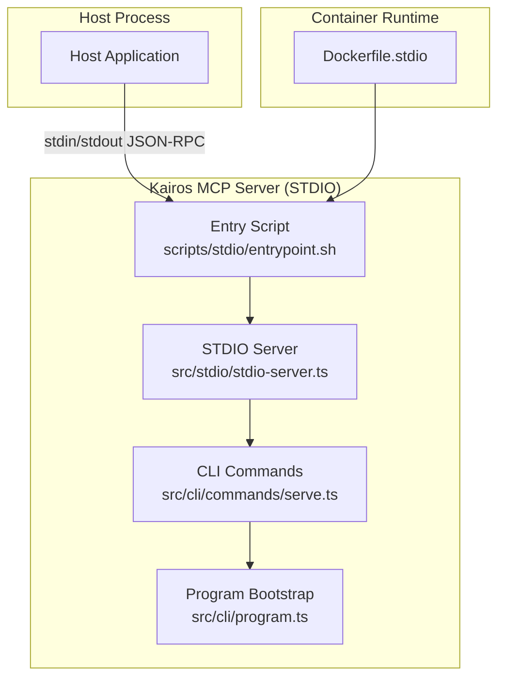
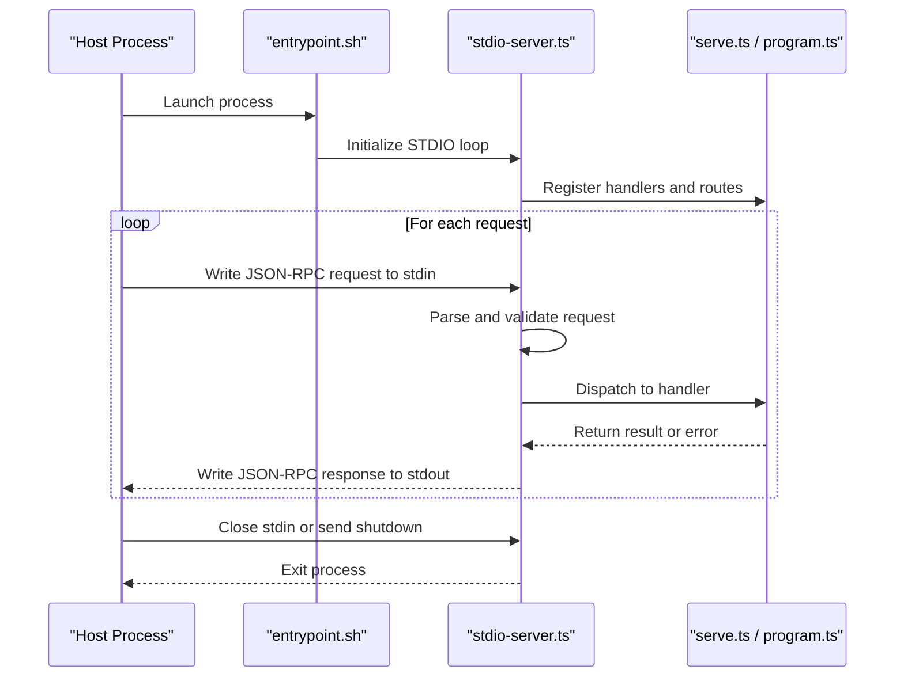

# STDIO Interface

<cite>
**Referenced Files in This Document**
- [stdio-server.ts](file://src/stdio/stdio-server.ts)
- [entrypoint.sh](file://scripts/stdio/entrypoint.sh)
- [Dockerfile.stdio](file://Dockerfile.stdio)
- [mcp-client-connection.test.ts](file://tests/integration/mcp-client-connection.test.ts)
- [http-mcp-concurrency.test.ts](file://tests/integration/http-mcp-concurrency.test.ts)
- [serve.ts](file://src/cli/commands/serve.ts)
- [program.ts](file://src/cli/program.ts)
</cite>

## Table of Contents
1. [Introduction](#introduction)
2. [Project Structure](#project-structure)
3. [Core Components](#core-components)
4. [Architecture Overview](#architecture-overview)
5. [Detailed Component Analysis](#detailed-component-analysis)
6. [Dependency Analysis](#dependency-analysis)
7. [Performance Considerations](#performance-considerations)
8. [Troubleshooting Guide](#troubleshooting-guide)
9. [Conclusion](#conclusion)
10. [Appendices](#appendices)

## Introduction
This document describes the STDIO interface for programmatic access to Kairos MCP functionality. It explains how a host process communicates with the Kairos MCP server over standard input and output using JSON-RPC messages, including message formats, serialization, lifecycle management, error handling, timeouts, and resource cleanup. It also covers supported operations, method signatures, return value structures, concurrency behavior, debugging techniques, and implementation examples across multiple programming languages.

## Project Structure
The STDIO capability is implemented as a dedicated server module that reads JSON-RPC requests from stdin and writes responses to stdout. A small shell entrypoint is provided to launch the server in containerized environments, and integration tests validate client connectivity and behavior.



**Diagram sources**
- [stdio-server.ts](file://src/stdio/stdio-server.ts)
- [entrypoint.sh](file://scripts/stdio/entrypoint.sh)
- [Dockerfile.stdio](file://Dockerfile.stdio)
- [serve.ts](file://src/cli/commands/serve.ts)
- [program.ts](file://src/cli/program.ts)

**Section sources**
- [stdio-server.ts](file://src/stdio/stdio-server.ts)
- [entrypoint.sh](file://scripts/stdio/entrypoint.sh)
- [Dockerfile.stdio](file://Dockerfile.stdio)
- [serve.ts](file://src/cli/commands/serve.ts)
- [program.ts](file://src/cli/program.ts)

## Core Components
- STDIO Server: Reads newline-delimited JSON-RPC messages from stdin, parses them, dispatches to internal handlers, and writes JSON-RPC responses to stdout.
- Entry Script: Provides a minimal bootstrap to start the STDIO server within containers or when invoked directly.
- CLI Integration: The serve command exposes the STDIO mode via the CLI, which wires into the program bootstrap.

Key responsibilities:
- Message framing: One JSON object per line on stdin; one JSON object per response on stdout.
- Serialization: JSON-encoded JSON-RPC 2.0 payloads.
- Lifecycle: Start on process initialization, run until EOF or explicit shutdown signal, then exit cleanly.
- Error handling: Map internal errors to JSON-RPC error objects with codes and messages.
- Concurrency: Handle concurrent requests safely by serializing or using controlled parallelism depending on operation type.

**Section sources**
- [stdio-server.ts](file://src/stdio/stdio-server.ts)
- [entrypoint.sh](file://scripts/stdio/entrypoint.sh)
- [serve.ts](file://src/cli/commands/serve.ts)
- [program.ts](file://src/cli/program.ts)

## Architecture Overview
The STDIO interface follows a request-response model over stdin/stdout. Each request is a complete JSON-RPC message, and each response is a complete JSON-RPC message. The server maintains no persistent network connections; it relies on the host process to manage process lifetime.



**Diagram sources**
- [stdio-server.ts](file://src/stdio/stdio-server.ts)
- [entrypoint.sh](file://scripts/stdio/entrypoint.sh)
- [serve.ts](file://src/cli/commands/serve.ts)
- [program.ts](file://src/cli/program.ts)

## Detailed Component Analysis

### STDIO Protocol Specification
- Transport: Standard input and output streams.
- Framing: Each message is a single line terminated by a newline character.
- Encoding: UTF-8 text representing a JSON object.
- Schema: JSON-RPC 2.0 compliant messages.
- Content-Type: Not applicable (text-based protocol).
- Character set: UTF-8.
- End-of-stream: Host closes stdin to signal graceful shutdown; server exits after flushing pending responses.

Message format:
- Request: JSON object with fields id, jsonrpc, method, params.
- Response: JSON object with fields id, jsonrpc, result or error.
- Notification: JSON object with jsonrpc and method (no id).

Error structure:
- error.code: Numeric code indicating failure category.
- error.message: Human-readable description.
- error.data: Optional structured details.

Supported methods:
- The exact list of available methods is determined at runtime by the server’s handler registry. Clients should call the appropriate discovery method if provided by the server. If not, consult the server documentation or inspect the tool listing endpoint exposed by the server.

Return values:
- Responses follow the JSON-RPC result envelope. The shape of result depends on the specific method invoked.

Timeouts:
- Timeouts are typically managed by the host process around I/O operations. The server may enforce its own per-request timeouts internally; clients should implement their own timeout logic around read/write calls.

Concurrency:
- The server processes requests concurrently where safe. Long-running operations may be queued or limited based on internal configuration. Clients should handle partial failures and retries as needed.

**Section sources**
- [stdio-server.ts](file://src/stdio/stdio-server.ts)

### Process Lifecycle Management
- Startup:
  - The entry script initializes the environment and starts the STDIO server.
  - The server registers handlers and begins reading from stdin.
- Running:
  - The server continuously reads lines from stdin, parses JSON-RPC messages, and writes responses to stdout.
- Shutdown:
  - Graceful shutdown occurs when stdin is closed or when the host sends a termination signal.
  - The server flushes any buffered output and exits with an appropriate status code.

Best practices:
- Ensure the host process keeps stdin open while communicating.
- Avoid writing to stderr unless necessary; use it only for diagnostics.
- Implement backpressure handling in the host to prevent overwhelming the server.

**Section sources**
- [entrypoint.sh](file://scripts/stdio/entrypoint.sh)
- [stdio-server.ts](file://src/stdio/stdio-server.ts)

### Connection Establishment
- No handshake is required beyond sending valid JSON-RPC requests.
- The first meaningful request can be a discovery or ping method if supported.
- The server responds immediately upon receiving a well-formed request.

Connection validation:
- Validate that each line is a valid JSON object.
- Confirm presence of required fields according to JSON-RPC 2.0.
- Reject malformed messages with appropriate error responses.

**Section sources**
- [stdio-server.ts](file://src/stdio/stdio-server.ts)

### Supported Operations and Method Signatures
- Discoverable methods:
  - Use the server’s discovery mechanism (if provided) to enumerate available tools and resources.
- Tool invocation:
  - Call the relevant method name with parameters defined by the tool schema.
- Resource access:
  - Read resources via resource-related methods if exposed.

Note: The precise method names and parameter shapes are defined by the server’s handler registry. Consult the server documentation or use discovery endpoints to obtain accurate schemas.

**Section sources**
- [stdio-server.ts](file://src/stdio/stdio-server.ts)

### Error Handling and Timeout Management
- Error categories:
  - Invalid request format.
  - Unknown method.
  - Validation errors in parameters.
  - Internal server errors.
- Timeout strategy:
  - Host-level timeouts around I/O operations.
  - Server-level timeouts for long-running tasks.
- Retry policy:
  - Idempotent operations can be retried safely.
  - Non-idempotent operations require careful retry strategies.

Resource cleanup:
- Release temporary files and locks promptly.
- Close database connections and external resources on shutdown.

**Section sources**
- [stdio-server.ts](file://src/stdio/stdio-server.ts)

### Implementation Examples

#### Python Example
- Use subprocess to spawn the server process.
- Write JSON-RPC requests to stdin and read responses from stdout.
- Implement timeouts using threading or asyncio.

```python
import subprocess
import json
import sys

proc = subprocess.Popen(
    ["node", "dist/stdio-server.js"],
    stdin=subprocess.PIPE,
    stdout=subprocess.PIPE,
    text=True
)

def send_request(method, params=None):
    req = {"jsonrpc": "2.0", "method": method, "params": params or {}, "id": 1}
    proc.stdin.write(json.dumps(req) + "\n")
    proc.stdin.flush()
    resp_line = proc.stdout.readline()
    return json.loads(resp_line)

result = send_request("listTools")
print(result)
```

Notes:
- Replace the executable path with the actual STDIO server binary or entrypoint.
- Add error handling and timeouts as needed.

**Section sources**
- [stdio-server.ts](file://src/stdio/stdio-server.ts)
- [entrypoint.sh](file://scripts/stdio/entrypoint.sh)

#### Node.js Example
- Use child_process.spawn to create the server process.
- Pipe JSON-RPC messages between parent and child.
- Manage lifecycle and cleanup.

```javascript
const { spawn } = require("child_process");

const server = spawn("node", ["dist/stdio-server.js"]);

function sendRequest(method, params) {
  const req = { jsonrpc: "2.0", method, params: params || {}, id: 1 };
  server.stdin.write(JSON.stringify(req) + "\n");
  return new Promise((resolve, reject) => {
    const onData = (chunk) => {
      const line = chunk.toString().trim();
      if (!line) return;
      const resp = JSON.parse(line);
      server.stdout.removeListener("data", onData);
      resolve(resp);
    };
    server.stdout.on("data", onData);
  });
}

sendRequest("listTools").then(console.log);
```

Notes:
- Ensure proper error handling and process termination.
- Use async patterns for robustness.

**Section sources**
- [stdio-server.ts](file://src/stdio/stdio-server.ts)
- [entrypoint.sh](file://scripts/stdio/entrypoint.sh)

#### Go Example
- Use os/exec to start the server.
- Write and read JSON-RPC messages via io.Pipe.
- Implement context-based timeouts.

```go
package main

import (
	"bufio"
	"encoding/json"
	"fmt"
	"os"
	"os/exec"
)

type Request struct {
	JSONRPC string      `json:"jsonrpc"`
	Method  string      `json:"method"`
	Params  interface{} `json:"params,omitempty"`
	ID      int         `json:"id"`
}

func main() {
	cmd := exec.Command("node", "dist/stdio-server.js")
	stdin, _ := cmd.StdinPipe()
	stdout, _ := cmd.StdoutPipe()
	cmd.Start()

	req := Request{JSONRPC: "2.0", Method: "listTools", ID: 1}
	json.NewEncoder(stdin).Encode(req)

	scanner := bufio.NewScanner(stdout)
	for scanner.Scan() {
		var resp map[string]interface{}
		json.Unmarshal(scanner.Bytes(), &resp)
		fmt.Println(resp)
		break
	}
	cmd.Wait()
}
```

Notes:
- Add context cancellation and error handling.
- Ensure proper cleanup of pipes and process.

**Section sources**
- [stdio-server.ts](file://src/stdio/stdio-server.ts)
- [entrypoint.sh](file://scripts/stdio/entrypoint.sh)

### Debugging Techniques
- Enable verbose logging in the server if supported.
- Capture stdin/stdout traffic using tools like tee or process substitution.
- Inspect error codes and messages returned by the server.
- Use structured logs to correlate requests and responses.
- Validate JSON-RPC messages with a linter or schema validator.

**Section sources**
- [stdio-server.ts](file://src/stdio/stdio-server.ts)

## Dependency Analysis
The STDIO server depends on the CLI commands and program bootstrap to register handlers and provide functionality. The entrypoint script provides a thin wrapper for containerized execution.


**Diagram sources**
- [entrypoint.sh](file://scripts/stdio/entrypoint.sh)
- [stdio-server.ts](file://src/stdio/stdio-server.ts)
- [serve.ts](file://src/cli/commands/serve.ts)
- [program.ts](file://src/cli/program.ts)

**Section sources**
- [stdio-server.ts](file://src/stdio/stdio-server.ts)
- [entrypoint.sh](file://scripts/stdio/entrypoint.sh)
- [serve.ts](file://src/cli/commands/serve.ts)
- [program.ts](file://src/cli/program.ts)

## Performance Considerations
- Minimize serialization overhead by batching requests where possible.
- Use non-blocking I/O in the host process to avoid stalls.
- Monitor memory usage and CPU utilization during long sessions.
- Tune concurrency limits based on workload characteristics.
- Avoid excessive logging in production to reduce I/O pressure.

[No sources needed since this section provides general guidance]

## Troubleshooting Guide
Common issues:
- Malformed JSON-RPC messages: Validate request structure before sending.
- Unknown method errors: Check the server’s method registry or discovery output.
- Timeout errors: Increase host-side timeouts or optimize server-side processing.
- Resource leaks: Ensure all handles and connections are closed properly.

Diagnostic steps:
- Log raw request/response pairs.
- Verify process health and resource usage.
- Reproduce issues with minimal test cases.
- Review server logs for stack traces and error details.

**Section sources**
- [stdio-server.ts](file://src/stdio/stdio-server.ts)

## Conclusion
The STDIO interface provides a simple, language-agnostic way to interact with Kairos MCP. By adhering to the JSON-RPC 2.0 specification over stdin/stdout, clients can reliably invoke server capabilities with predictable error handling and lifecycle management. Following the best practices outlined here will help ensure robust, high-performance integrations across diverse environments.

[No sources needed since this section summarizes without analyzing specific files]

## Appendices

### Integration Tests Reference
Integration tests demonstrate client connectivity and behavior patterns that can guide implementation.

**Section sources**
- [mcp-client-connection.test.ts](file://tests/integration/mcp-client-connection.test.ts)
- [http-mcp-concurrency.test.ts](file://tests/integration/http-mcp-concurrency.test.ts)