# Architecture & Design

<cite>
**Referenced Files in This Document**
- [package.json](file://package.json)
- [src/index.ts](file://src/index.ts)
- [src/bootstrap.ts](file://src/bootstrap.ts)
- [src/server.ts](file://src/server.ts)
- [src/http/http-server.ts](file://src/http/http-server.ts)
- [src/http/http-api-routes.ts](file://src/http/http-api-routes.ts)
- [src/http/http-mcp-handler.ts](file://src/http/http-mcp-handler.ts)
- [src/http/http-auth-middleware.ts](file://src/http/http-auth-middleware.ts)
- [src/config.ts](file://src/config.ts)
- [src/services/memory/store.ts](file://src/services/memory/store.ts)
- [src/services/qdrant/service.ts](file://src/services/qdrant/service.ts)
- [src/services/redis-cache.ts](file://src/services/redis-cache.ts)
- [src/ui/main.tsx](file://src/ui/main.tsx)
- [src/cli/index.ts](file://src/cli/index.ts)
- [compose.yaml](file://compose.yaml)
</cite>

## Table of Contents
1. [Introduction](#introduction)
2. [Project Structure](#project-structure)
3. [Core Components](#core-components)
4. [Architecture Overview](#architecture-overview)
5. [Detailed Component Analysis](#detailed-component-analysis)
6. [Dependency Analysis](#dependency-analysis)
7. [Performance Considerations](#performance-considerations)
8. [Troubleshooting Guide](#troubleshooting-guide)
9. [Conclusion](#conclusion)
10. [Appendices](#appendices)

## Introduction
This document describes the KAIROS MCP system architecture, focusing on the layered design with an HTTP server, business logic services, and data layer integration. It explains component interactions among MCP protocol handlers, REST API endpoints, the React UI, and the CLI interface. It also documents technical decisions around the Express-based HTTP server, Qdrant vector database integration, and the optional Redis cache layer. System boundaries, data flows, and integration patterns with external services like Keycloak and embedding providers are covered, along with scalability considerations, deployment topology options, and infrastructure requirements. Finally, it outlines the technology stack, third-party dependencies, and a version compatibility matrix.

## Project Structure
The system is organized into distinct layers:
- Application entrypoint and lifecycle orchestration
- HTTP server and routing
- Authentication and authorization middleware
- MCP protocol handler and UI integration
- Business logic services (memory, Qdrant, Redis cache)
- Frontend (React SPA) and CLI
- Configuration and environment management
- Deployment and infrastructure (Compose)

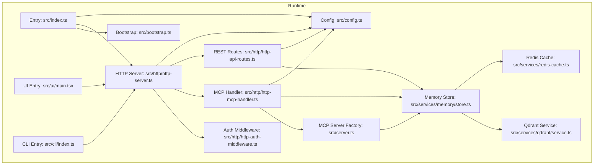

**Diagram sources**
- [src/index.ts:1-139](file://src/index.ts#L1-L139)
- [src/bootstrap.ts:1-55](file://src/bootstrap.ts#L1-L55)
- [src/http/http-server.ts:1-59](file://src/http/http-server.ts#L1-L59)
- [src/http/http-mcp-handler.ts:1-344](file://src/http/http-mcp-handler.ts#L1-L344)
- [src/http/http-api-routes.ts:1-36](file://src/http/http-api-routes.ts#L1-L36)
- [src/http/http-auth-middleware.ts:1-316](file://src/http/http-auth-middleware.ts#L1-L316)
- [src/server.ts:1-194](file://src/server.ts#L1-L194)
- [src/services/memory/store.ts:1-152](file://src/services/memory/store.ts#L1-L152)
- [src/services/qdrant/service.ts:1-152](file://src/services/qdrant/service.ts#L1-L152)
- [src/services/redis-cache.ts:1-243](file://src/services/redis-cache.ts#L1-L243)
- [src/ui/main.tsx:1-20](file://src/ui/main.tsx#L1-L20)
- [src/cli/index.ts:1-11](file://src/cli/index.ts#L1-L11)
- [src/config.ts:1-330](file://src/config.ts#L1-L330)

**Section sources**
- [src/index.ts:1-139](file://src/index.ts#L1-L139)
- [src/http/http-server.ts:1-59](file://src/http/http-server.ts#L1-L59)
- [src/config.ts:1-330](file://src/config.ts#L1-L330)

## Core Components
- HTTP server and transport: Express-based server with middleware, health checks, and route registration.
- MCP protocol handler: Per-request MCP server instantiation with concurrency control and error mapping.
- REST API endpoints: Tools for activation, forwarding, training, reward, tuning, deletion, export, and spaces.
- Authentication and authorization: Session-based and Bearer token validation with Keycloak integration.
- Memory and data layer: Qdrant-backed memory store with adapter and artifact handling; optional Redis cache.
- UI and CLI: React SPA and CLI client communicating with the REST and MCP endpoints.
- Configuration: Centralized environment parsing and validation.

**Section sources**
- [src/http/http-server.ts:1-59](file://src/http/http-server.ts#L1-L59)
- [src/http/http-mcp-handler.ts:1-344](file://src/http/http-mcp-handler.ts#L1-L344)
- [src/http/http-api-routes.ts:1-36](file://src/http/http-api-routes.ts#L1-L36)
- [src/http/http-auth-middleware.ts:1-316](file://src/http/http-auth-middleware.ts#L1-L316)
- [src/services/memory/store.ts:1-152](file://src/services/memory/store.ts#L1-L152)
- [src/services/qdrant/service.ts:1-152](file://src/services/qdrant/service.ts#L1-L152)
- [src/services/redis-cache.ts:1-243](file://src/services/redis-cache.ts#L1-L243)
- [src/ui/main.tsx:1-20](file://src/ui/main.tsx#L1-L20)
- [src/cli/index.ts:1-11](file://src/cli/index.ts#L1-L11)
- [src/config.ts:1-330](file://src/config.ts#L1-L330)

## Architecture Overview
KAIROS operates as a layered system:
- Transport layer: HTTP transport with Express, serving both REST and MCP over JSON-RPC.
- Protocol layer: MCP server factory registers tools and UI resources, enabling agent automation with persistent memory and deterministic workflows.
- Business logic layer: Tools orchestrate activation, forwarding, training, reward, tuning, deletion, export, and spaces.
- Data layer: Qdrant vector database for semantic search and memory persistence; optional Redis cache for search and memory results.
- Integration layer: Keycloak for OIDC-based authentication; embedding provider configuration for vector embeddings.
- Presentation layer: React UI and CLI client.

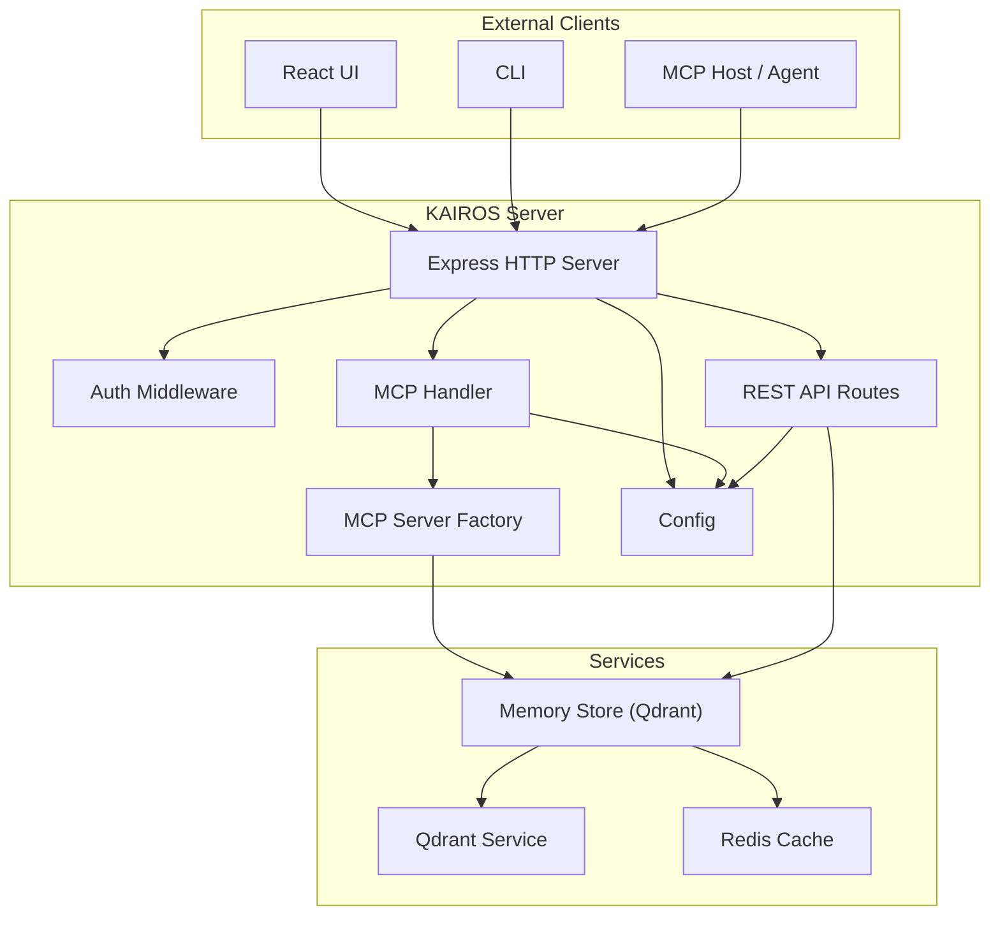

**Diagram sources**
- [src/http/http-server.ts:1-59](file://src/http/http-server.ts#L1-L59)
- [src/http/http-mcp-handler.ts:1-344](file://src/http/http-mcp-handler.ts#L1-L344)
- [src/http/http-api-routes.ts:1-36](file://src/http/http-api-routes.ts#L1-L36)
- [src/http/http-auth-middleware.ts:1-316](file://src/http/http-auth-middleware.ts#L1-L316)
- [src/server.ts:1-194](file://src/server.ts#L1-L194)
- [src/services/memory/store.ts:1-152](file://src/services/memory/store.ts#L1-L152)
- [src/services/qdrant/service.ts:1-152](file://src/services/qdrant/service.ts#L1-L152)
- [src/services/redis-cache.ts:1-243](file://src/services/redis-cache.ts#L1-L243)
- [src/config.ts:1-330](file://src/config.ts#L1-L330)

## Detailed Component Analysis

### HTTP Server and Routing
- Express server initialization, middleware installation, and route registration.
- Health, well-known, auth callback, MCP CORS, MCP handler, REST API routes, UI static assets, and error handlers.
- Port configuration and startup orchestration.

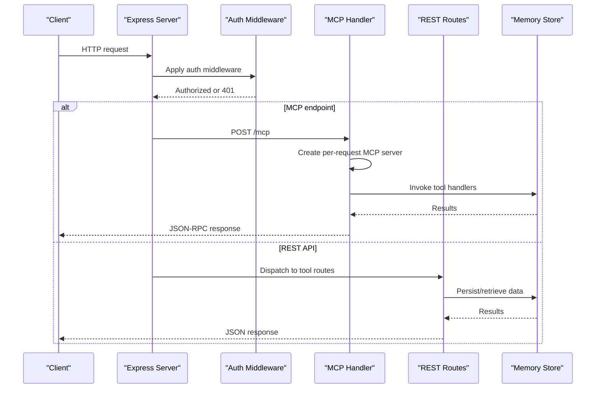

**Diagram sources**
- [src/http/http-server.ts:1-59](file://src/http/http-server.ts#L1-L59)
- [src/http/http-mcp-handler.ts:1-344](file://src/http/http-mcp-handler.ts#L1-L344)
- [src/http/http-api-routes.ts:1-36](file://src/http/http-api-routes.ts#L1-L36)
- [src/services/memory/store.ts:1-152](file://src/services/memory/store.ts#L1-L152)

**Section sources**
- [src/http/http-server.ts:1-59](file://src/http/http-server.ts#L1-L59)
- [src/config.ts:224-226](file://src/config.ts#L224-L226)

### MCP Protocol Handler
- Per-request MCP server creation to support concurrency.
- Authentication resolution via session or Bearer token validation.
- Backpressure control with concurrent request limits and graceful timeouts.
- Error mapping to standardized JSON-RPC error responses.

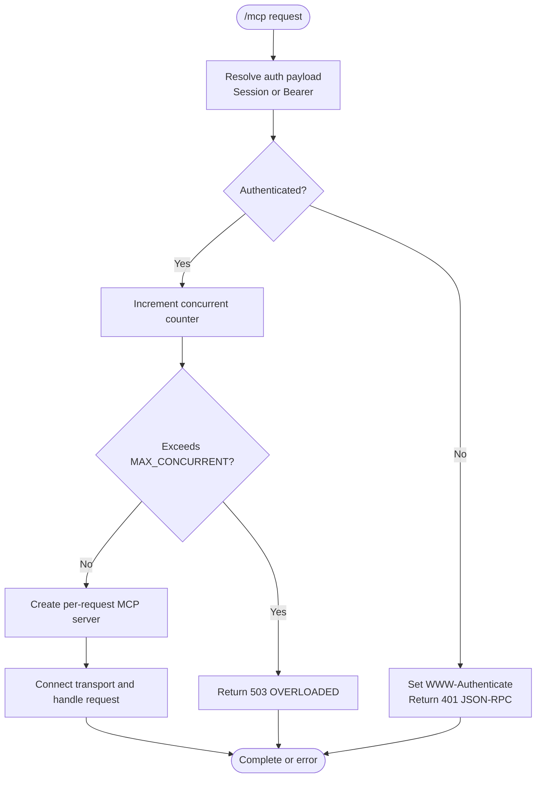

**Diagram sources**
- [src/http/http-mcp-handler.ts:1-344](file://src/http/http-mcp-handler.ts#L1-L344)
- [src/http/http-auth-middleware.ts:1-316](file://src/http/http-auth-middleware.ts#L1-L316)
- [src/config.ts:256-256](file://src/config.ts#L256-L256)

**Section sources**
- [src/http/http-mcp-handler.ts:1-344](file://src/http/http-mcp-handler.ts#L1-L344)
- [src/http/http-auth-middleware.ts:1-316](file://src/http/http-auth-middleware.ts#L1-L316)

### REST API Endpoints
- Tool endpoints: activate, forward, train (raw and JSON), reward, tune, delete, export, spaces, dump, update, snapshot.
- Shared dependencies: memory store and Qdrant service.
- Auth enforced for protected paths; UI resources and capabilities exposed separately.

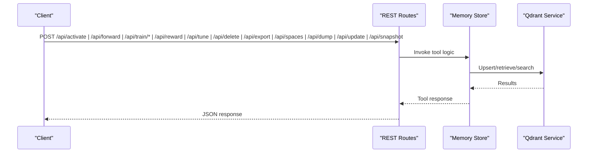

**Diagram sources**
- [src/http/http-api-routes.ts:1-36](file://src/http/http-api-routes.ts#L1-L36)
- [src/services/memory/store.ts:1-152](file://src/services/memory/store.ts#L1-L152)
- [src/services/qdrant/service.ts:1-152](file://src/services/qdrant/service.ts#L1-L152)

**Section sources**
- [src/http/http-api-routes.ts:1-36](file://src/http/http-api-routes.ts#L1-L36)

### Authentication and Authorization
- Session-based auth for browsers; Bearer token validation for non-browser clients.
- Keycloak OIDC integration with configurable issuers and audiences.
- Allowlist-based group filtering and space scoping.
- Proper WWW-Authenticate headers and JSON error responses.

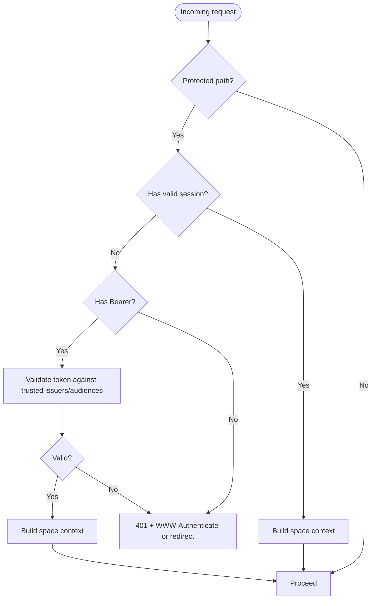

**Diagram sources**
- [src/http/http-auth-middleware.ts:1-316](file://src/http/http-auth-middleware.ts#L1-L316)
- [src/config.ts:113-144](file://src/config.ts#L113-L144)

**Section sources**
- [src/http/http-auth-middleware.ts:1-316](file://src/http/http-auth-middleware.ts#L1-L316)
- [src/config.ts:113-144](file://src/config.ts#L113-L144)

### Memory Store and Qdrant Integration
- Qdrant client initialization with API key support and collection alias resolution.
- Health checking with timeout protection and race handling.
- Methods for storing adapters/artifacts, retrieving memories, and semantic search.
- Adapter and artifact handling abstractions.

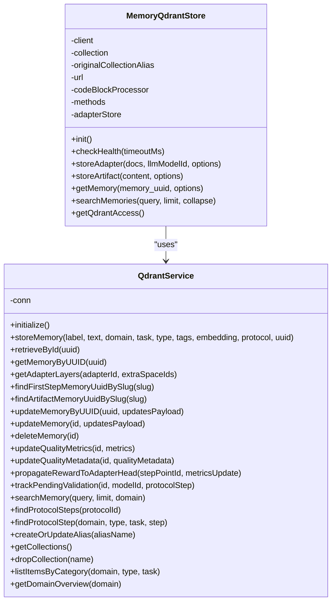

**Diagram sources**
- [src/services/memory/store.ts:1-152](file://src/services/memory/store.ts#L1-L152)
- [src/services/qdrant/service.ts:1-152](file://src/services/qdrant/service.ts#L1-L152)

**Section sources**
- [src/services/memory/store.ts:1-152](file://src/services/memory/store.ts#L1-L152)
- [src/services/qdrant/service.ts:1-152](file://src/services/qdrant/service.ts#L1-L152)

### Redis Cache Layer
- Search result caching with TTL and invalidation channels.
- Memory resource caching with global keys.
- Stats counters for hits/misses.
- Aggressive invalidation on write operations to maintain consistency.

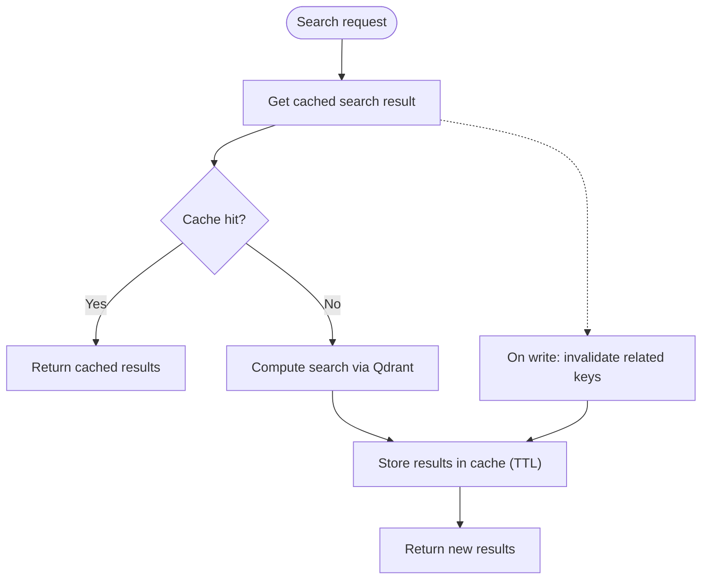

**Diagram sources**
- [src/services/redis-cache.ts:1-243](file://src/services/redis-cache.ts#L1-L243)

**Section sources**
- [src/services/redis-cache.ts:1-243](file://src/services/redis-cache.ts#L1-L243)

### UI and CLI Integration
- React UI initializes QueryClient and theme provider, consuming REST and MCP endpoints.
- CLI provides commands to interact with the REST API and serves the MCP server locally.

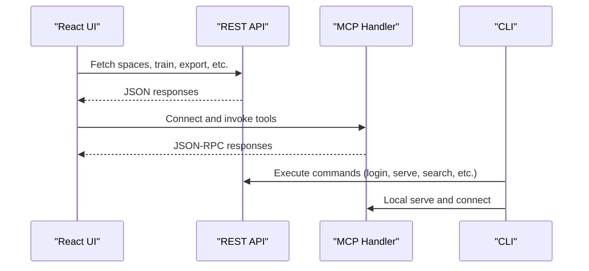

**Diagram sources**
- [src/ui/main.tsx:1-20](file://src/ui/main.tsx#L1-L20)
- [src/cli/index.ts:1-11](file://src/cli/index.ts#L1-L11)
- [src/http/http-mcp-handler.ts:1-344](file://src/http/http-mcp-handler.ts#L1-L344)
- [src/http/http-api-routes.ts:1-36](file://src/http/http-api-routes.ts#L1-L36)

**Section sources**
- [src/ui/main.tsx:1-20](file://src/ui/main.tsx#L1-L20)
- [src/cli/index.ts:1-11](file://src/cli/index.ts#L1-L11)

## Dependency Analysis
- Express and middleware stack form the HTTP foundation.
- MCP SDK drives protocol handling and UI capability exposure.
- Qdrant JS client and service encapsulate vector operations.
- Redis client and cache service provide optional caching.
- React Query powers UI data fetching; CLI uses programmatic command definitions.

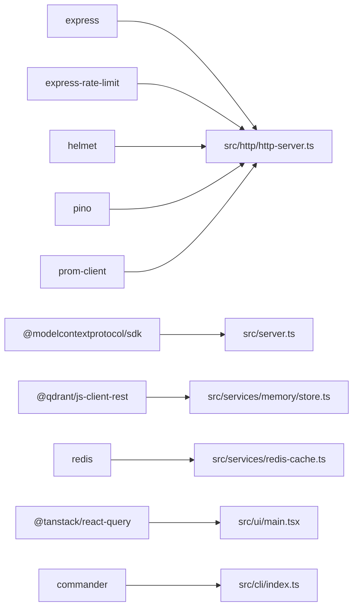

**Diagram sources**
- [package.json:117-148](file://package.json#L117-L148)
- [src/http/http-server.ts:1-59](file://src/http/http-server.ts#L1-L59)
- [src/server.ts:1-194](file://src/server.ts#L1-L194)
- [src/services/memory/store.ts:1-152](file://src/services/memory/store.ts#L1-L152)
- [src/services/redis-cache.ts:1-243](file://src/services/redis-cache.ts#L1-L243)
- [src/ui/main.tsx:1-20](file://src/ui/main.tsx#L1-L20)
- [src/cli/index.ts:1-11](file://src/cli/index.ts#L1-L11)

**Section sources**
- [package.json:117-148](file://package.json#L117-L148)

## Performance Considerations
- Concurrency control: MCP handler tracks concurrent requests and rejects overloads with 503 responses.
- Timeouts: MCP requests log warnings near typical client timeouts; transport closes on response finish.
- Caching: Redis cache reduces repeated search work; invalidation ensures consistency.
- Health checks: Qdrant readiness is probed before initialization to avoid startup flakiness.
- Rate limiting: HTTP and MCP rate limits configurable via environment variables.
- Metrics: Dedicated metrics server exposes Prometheus endpoints for observability.

[No sources needed since this section provides general guidance]

## Troubleshooting Guide
- Startup failures: Fatal errors during boot are logged and cause non-zero exit; check Qdrant availability and embedding dimension probing.
- MCP overload: 503 responses indicate concurrent limits exceeded; reduce client concurrency or increase limits.
- Authentication issues: 401 responses with WWW-Authenticate or redirect; verify session validity, Bearer token configuration, and Keycloak settings.
- Qdrant connectivity: Health checks with timeouts; ensure URL, API key, and collection alias are correct.
- Cache invalidation: Use cache invalidation APIs to refresh stale results after writes.

**Section sources**
- [src/index.ts:74-134](file://src/index.ts#L74-L134)
- [src/http/http-mcp-handler.ts:176-200](file://src/http/http-mcp-handler.ts#L176-L200)
- [src/http/http-auth-middleware.ts:284-313](file://src/http/http-auth-middleware.ts#L284-L313)
- [src/services/memory/store.ts:59-121](file://src/services/memory/store.ts#L59-L121)
- [src/services/redis-cache.ts:72-112](file://src/services/redis-cache.ts#L72-L112)

## Conclusion
KAIROS MCP is designed as a layered, transportable system centered on HTTP and the Model Context Protocol. The Express server integrates authentication, MCP handling, and REST endpoints, while Qdrant provides robust vector memory and search. The optional Redis cache improves performance for read-heavy workloads. The React UI and CLI offer complementary access patterns. The architecture emphasizes modularity, scalability, and operational observability, with clear separation of concerns across transport, protocol, business logic, and data layers.

[No sources needed since this section summarizes without analyzing specific files]

## Appendices

### Technology Stack and Third-Party Dependencies
- Runtime and framework: Node.js, Express, MCP SDK
- Vector database: Qdrant (JS client)
- Caching: Redis
- Frontend: React, React Query
- CLI: Commander
- Observability: Prometheus client, Pino logging
- Security: Helmet, OIDC Bearer validation

**Section sources**
- [package.json:117-148](file://package.json#L117-L148)

### Version Compatibility Matrix
- Node.js: Engine requirement indicates minimum version for runtime compatibility.
- MCP SDK: Specific SDK version is used for protocol handling and UI capability exposure.
- Qdrant client: REST client version aligns with Qdrant service integration.
- Redis client: Client version supports cache operations.

**Section sources**
- [package.json:184-193](file://package.json#L184-L193)
- [package.json:119-119](file://package.json#L119-L119)
- [package.json:121-121](file://package.json#L121-L121)
- [package.json:145-145](file://package.json#L145-L145)

### Deployment Topology Options and Infrastructure Requirements
- Docker Compose profiles:
  - Mini: Qdrant + application only.
  - Fullstack: Qdrant, Redis-compatible store, Postgres, Keycloak.
- Ports:
  - Application HTTP port and metrics port configurable via environment.
- Environment variables:
  - Qdrant URL and API key, collection alias, Redis URL/password, Keycloak OIDC settings, embedding provider configuration, rate limits, and search tunables.

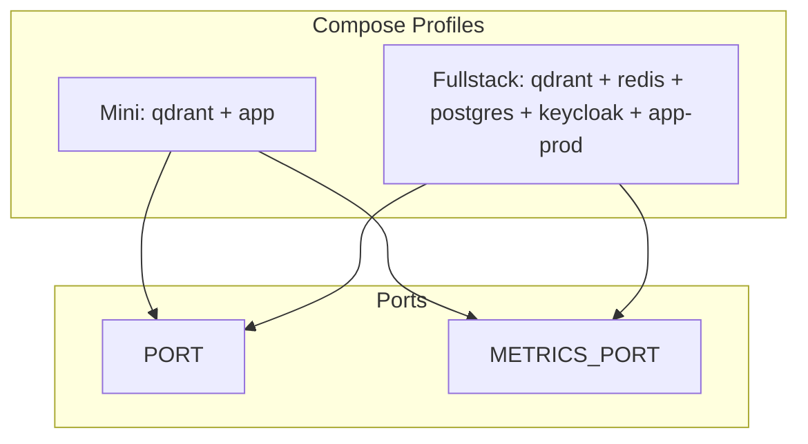

**Diagram sources**
- [compose.yaml:10-183](file://compose.yaml#L10-L183)
- [src/config.ts:224-256](file://src/config.ts#L224-L256)

**Section sources**
- [compose.yaml:10-183](file://compose.yaml#L10-L183)
- [src/config.ts:224-256](file://src/config.ts#L224-L256)