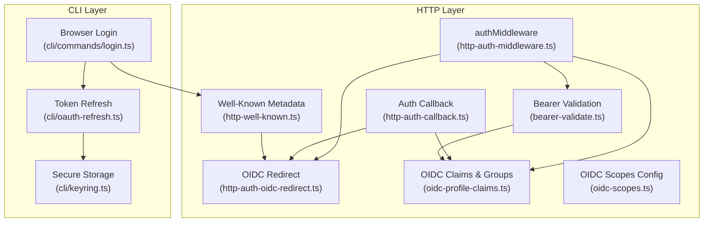
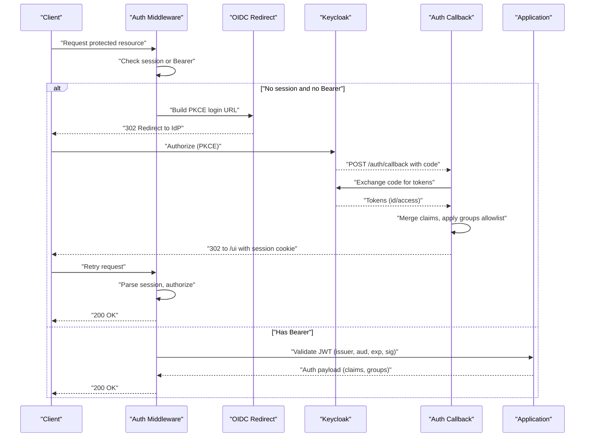
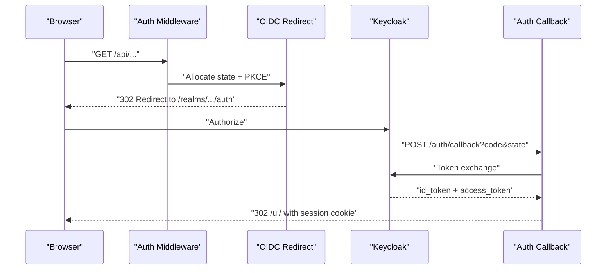
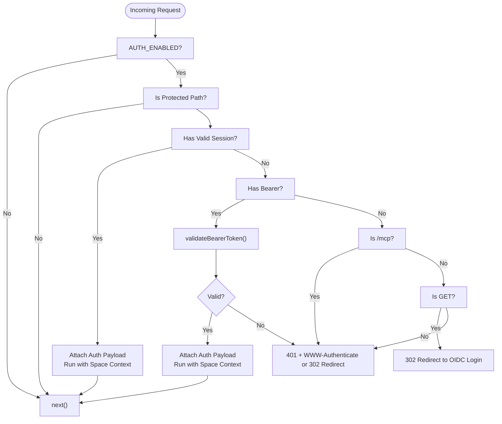
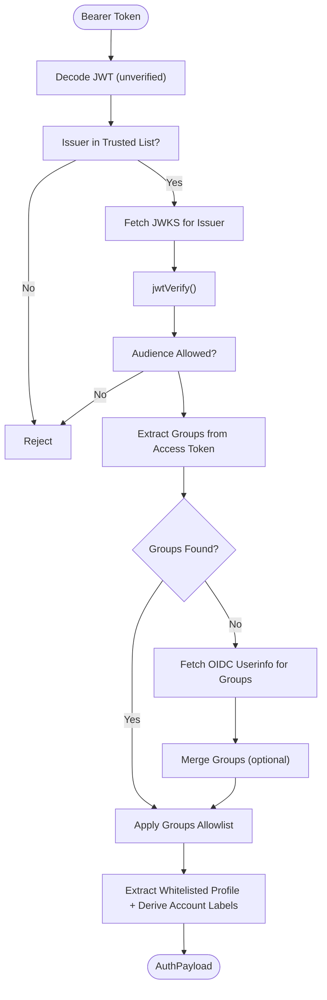
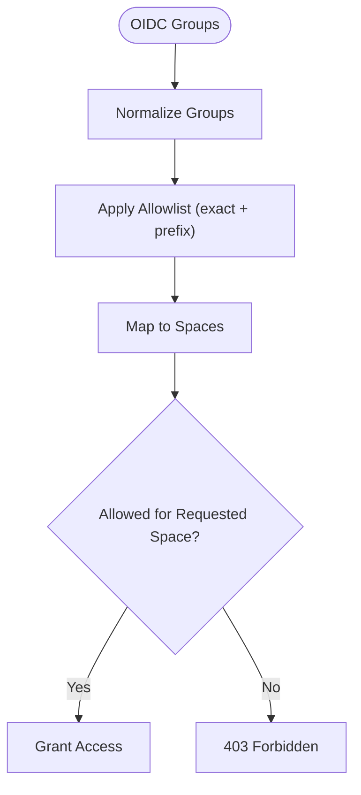
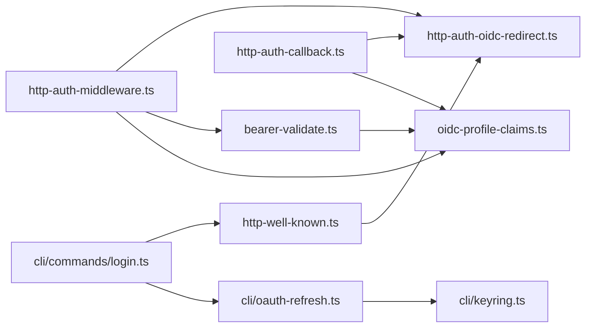

# Authentication Services Architecture

<cite>
**Referenced Files in This Document**
- [src/http/http-auth-middleware.ts](file://src/http/http-auth-middleware.ts)
- [src/http/http-auth-oidc-redirect.ts](file://src/http/http-auth-oidc-redirect.ts)
- [src/http/http-auth-callback.ts](file://src/http/http-auth-callback.ts)
- [src/http/bearer-validate.ts](file://src/http/bearer-validate.ts)
- [src/http/oidc-profile-claims.ts](file://src/http/oidc-profile-claims.ts)
- [src/http/oidc-scopes.ts](file://src/http/oidc-scopes.ts)
- [src/http/http-well-known.ts](file://src/http/http-well-known.ts)
- [src/cli/commands/login.ts](file://src/cli/commands/login.ts)
- [src/cli/oauth-refresh.ts](file://src/cli/oauth-refresh.ts)
- [src/cli/keyring.ts](file://src/cli/keyring.ts)
- [docs/CLI.md](file://docs/CLI.md)
- [docs/architecture/auth-overview.md](file://docs/architecture/auth-overview.md)
</cite>

## Table of Contents
1. [Introduction](#introduction)
2. [Project Structure](#project-structure)
3. [Core Components](#core-components)
4. [Architecture Overview](#architecture-overview)
5. [Detailed Component Analysis](#detailed-component-analysis)
6. [Dependency Analysis](#dependency-analysis)
7. [Performance Considerations](#performance-considerations)
8. [Troubleshooting Guide](#troubleshooting-guide)
9. [Conclusion](#conclusion)

## Introduction
This document describes the authentication services architecture for KAIROS MCP, focusing on OIDC-based authentication with Keycloak as the Identity Provider. It covers the browser-initiated PKCE flow, callback handling, token validation, middleware protection of HTTP endpoints, bearer token validation, profile claims extraction, session management, scope-based and group-based authorization, and CLI integration with secure credential storage via OS keyrings.

## Project Structure
The authentication layer spans HTTP middleware and handlers for browser flows, JWT validation utilities, OIDC profile and group processing, well-known metadata endpoints, and CLI components for login, token refresh, and secure storage.



**Diagram sources**
- [src/http/http-auth-middleware.ts:167-313](file://src/http/http-auth-middleware.ts#L167-L313)
- [src/http/http-auth-oidc-redirect.ts:66-87](file://src/http/http-auth-oidc-redirect.ts#L66-L87)
- [src/http/http-auth-callback.ts:122-231](file://src/http/http-auth-callback.ts#L122-L231)
- [src/http/http-well-known.ts:56-92](file://src/http/http-well-known.ts#L56-L92)
- [src/http/bearer-validate.ts:120-208](file://src/http/bearer-validate.ts#L120-L208)
- [src/http/oidc-profile-claims.ts:192-256](file://src/http/oidc-profile-claims.ts#L192-L256)
- [src/http/oidc-scopes.ts:1-31](file://src/http/oidc-scopes.ts#L1-L31)
- [src/cli/commands/login.ts:69-196](file://src/cli/commands/login.ts#L69-L196)
- [src/cli/oauth-refresh.ts:62-86](file://src/cli/oauth-refresh.ts#L62-L86)
- [src/cli/keyring.ts:50-120](file://src/cli/keyring.ts#L50-L120)

**Section sources**
- [src/http/http-auth-middleware.ts:1-316](file://src/http/http-auth-middleware.ts#L1-L316)
- [src/http/http-auth-oidc-redirect.ts:1-101](file://src/http/http-auth-oidc-redirect.ts#L1-L101)
- [src/http/http-auth-callback.ts:1-233](file://src/http/http-auth-callback.ts#L1-L233)
- [src/http/bearer-validate.ts:1-209](file://src/http/bearer-validate.ts#L1-L209)
- [src/http/oidc-profile-claims.ts:1-288](file://src/http/oidc-profile-claims.ts#L1-L288)
- [src/http/oidc-scopes.ts:1-31](file://src/http/oidc-scopes.ts#L1-L31)
- [src/http/http-well-known.ts:1-221](file://src/http/http-well-known.ts#L1-L221)
- [src/cli/commands/login.ts:1-229](file://src/cli/commands/login.ts#L1-L229)
- [src/cli/oauth-refresh.ts:1-101](file://src/cli/oauth-refresh.ts#L1-L101)
- [src/cli/keyring.ts:1-121](file://src/cli/keyring.ts#L1-L121)

## Core Components
- OIDC Redirect and PKCE state management for browser login.
- Auth callback handler that exchanges authorization code for tokens, merges claims, applies group allowlists, and sets a signed session cookie.
- Middleware that protects endpoints by requiring either a valid session or a Bearer token, with configurable modes.
- Bearer token validation that verifies issuer, audience, expiration, and signature using JWKS; enriches payload with profile claims and groups.
- OIDC profile claims extraction and group allowlisting to derive spaces and enforce access policies.
- Well-known endpoints exposing protected resource metadata and authorization server metadata for discovery.
- CLI login with PKCE and token refresh, plus secure keyring-backed storage for tokens and refresh tokens.

**Section sources**
- [src/http/http-auth-oidc-redirect.ts:28-87](file://src/http/http-auth-oidc-redirect.ts#L28-L87)
- [src/http/http-auth-callback.ts:122-231](file://src/http/http-auth-callback.ts#L122-L231)
- [src/http/http-auth-middleware.ts:167-313](file://src/http/http-auth-middleware.ts#L167-L313)
- [src/http/bearer-validate.ts:120-208](file://src/http/bearer-validate.ts#L120-L208)
- [src/http/oidc-profile-claims.ts:192-287](file://src/http/oidc-profile-claims.ts#L192-L287)
- [src/http/http-well-known.ts:31-92](file://src/http/http-well-known.ts#L31-L92)
- [src/cli/commands/login.ts:69-196](file://src/cli/commands/login.ts#L69-L196)
- [src/cli/oauth-refresh.ts:62-100](file://src/cli/oauth-refresh.ts#L62-L100)
- [src/cli/keyring.ts:50-120](file://src/cli/keyring.ts#L50-L120)

## Architecture Overview
The system integrates Keycloak OIDC with two complementary authentication paths:
- Browser PKCE flow for interactive login, handled by redirect generation, callback exchange, and session cookie creation.
- Bearer token validation for programmatic clients, validating tokens against trusted issuers and audiences and extracting enriched profile and group claims.



**Diagram sources**
- [src/http/http-auth-middleware.ts:167-313](file://src/http/http-auth-middleware.ts#L167-L313)
- [src/http/http-auth-oidc-redirect.ts:66-87](file://src/http/http-auth-oidc-redirect.ts#L66-L87)
- [src/http/http-auth-callback.ts:122-231](file://src/http/http-auth-callback.ts#L122-L231)
- [src/http/bearer-validate.ts:120-208](file://src/http/bearer-validate.ts#L120-L208)

## Detailed Component Analysis

### OIDC Browser Flow and Session Management
- PKCE state allocation and storage with pruning ensures replay protection.
- Authorization URL builds include state, code challenge, and prompt parameters.
- Callback validates state, exchanges code for tokens, decodes payloads, merges claims, applies group allowlist, computes session TTL from token lifetimes, signs a session cookie, and redirects to the UI.
- Session cookie is HttpOnly, SameSite lax, and secured when callbacks are HTTPS; includes an optional id_token hint for RP-initiated logout.



**Diagram sources**
- [src/http/http-auth-oidc-redirect.ts:66-87](file://src/http/http-auth-oidc-redirect.ts#L66-L87)
- [src/http/http-auth-callback.ts:122-231](file://src/http/http-auth-callback.ts#L122-L231)

**Section sources**
- [src/http/http-auth-oidc-redirect.ts:17-87](file://src/http/http-auth-oidc-redirect.ts#L17-L87)
- [src/http/http-auth-callback.ts:34-231](file://src/http/http-auth-callback.ts#L34-L231)

### Middleware Pattern for Endpoint Protection
- Protects /api, /api/*, /mcp, /ui, and /ui/* paths when enabled.
- Allows requests with valid session or Bearer token; otherwise redirects browsers to login or returns 401 with WWW-Authenticate for MCP clients.
- Enriches request context with space-aware context derived from allowed groups and optional explicit space selection.



**Diagram sources**
- [src/http/http-auth-middleware.ts:167-313](file://src/http/http-auth-middleware.ts#L167-L313)

**Section sources**
- [src/http/http-auth-middleware.ts:167-313](file://src/http/http-auth-middleware.ts#L167-L313)

### Bearer Token Validation and Profile Claims Extraction
- Validates issuer against trusted list, audience against allowed list, expiration, and signature via JWKS.
- Supports fetching groups from OIDC userinfo when access token lacks groups, with optional merging behavior.
- Extracts whitelisted profile claims and derives account kind/label from identity provider.
- Produces an enriched AuthPayload used downstream for space resolution and authorization.



**Diagram sources**
- [src/http/bearer-validate.ts:120-208](file://src/http/bearer-validate.ts#L120-L208)
- [src/http/oidc-profile-claims.ts:192-287](file://src/http/oidc-profile-claims.ts#L192-L287)

**Section sources**
- [src/http/bearer-validate.ts:120-208](file://src/http/bearer-validate.ts#L120-L208)
- [src/http/oidc-profile-claims.ts:192-287](file://src/http/oidc-profile-claims.ts#L192-L287)

### Scope-Based Authorization and Group-Based Access Control
- Supported scopes include openid, profile, email, kairos-groups, offline_access, with parsing and defaults.
- Group allowlist filters JWT groups into allowed paths; supports exact matches and prefix-based inclusion.
- Middleware enforces space boundaries based on allowed groups and optional explicit space query parameters.



**Diagram sources**
- [src/http/oidc-scopes.ts:1-31](file://src/http/oidc-scopes.ts#L1-L31)
- [src/http/oidc-profile-claims.ts:119-153](file://src/http/oidc-profile-claims.ts#L119-L153)
- [src/http/http-auth-middleware.ts:194-214](file://src/http/http-auth-middleware.ts#L194-L214)

**Section sources**
- [src/http/oidc-scopes.ts:1-31](file://src/http/oidc-scopes.ts#L1-L31)
- [src/http/oidc-profile-claims.ts:119-153](file://src/http/oidc-profile-claims.ts#L119-L153)
- [src/http/http-auth-middleware.ts:194-214](file://src/http/http-auth-middleware.ts#L194-L214)

### Integration Between Keycloak OIDC Provider and Local Token Refresh Mechanisms
- Well-known endpoints expose protected resource metadata and authorization server metadata, enabling clients to discover endpoints and perform DCR when needed.
- CLI performs PKCE login and stores tokens; refreshes access tokens using refresh_token grant against discovered token endpoint; stores refreshed tokens and optionally rotates refresh tokens.
- Secure storage uses OS keyring when available, with config-file fallback; supports distinct accounts for access and refresh tokens.

```mermaid
sequenceDiagram
participant CLI as "CLI"
participant WK as "Well-Known"
participant IdP as "Keycloak"
participant Store as "Keyring/File"
CLI->>WK : "GET /.well-known/oauth-protected-resource"
WK-->>CLI : "authorization_endpoint, token_endpoint"
CLI->>IdP : "PKCE Authorization"
IdP-->>CLI : "authorization_code"
CLI->>IdP : "POST token_endpoint (authorization_code)"
IdP-->>CLI : "access_token (+refresh_token?)"
CLI->>Store : "Persist tokens"
Note over CLI,Store : "Keyring preferred; file fallback"
CLI->>IdP : "POST token_endpoint (refresh_token)"
IdP-->>CLI : "New access_token (+rotated refresh_token?)"
CLI->>Store : "Update tokens"
```

**Diagram sources**
- [src/http/http-well-known.ts:31-92](file://src/http/http-well-known.ts#L31-L92)
- [src/cli/commands/login.ts:69-196](file://src/cli/commands/login.ts#L69-L196)
- [src/cli/oauth-refresh.ts:62-100](file://src/cli/oauth-refresh.ts#L62-L100)
- [src/cli/keyring.ts:50-120](file://src/cli/keyring.ts#L50-L120)

**Section sources**
- [src/http/http-well-known.ts:31-92](file://src/http/http-well-known.ts#L31-L92)
- [src/cli/commands/login.ts:69-196](file://src/cli/commands/login.ts#L69-L196)
- [src/cli/oauth-refresh.ts:62-100](file://src/cli/oauth-refresh.ts#L62-L100)
- [src/cli/keyring.ts:50-120](file://src/cli/keyring.ts#L50-L120)
- [docs/CLI.md:113-160](file://docs/CLI.md#L113-L160)
- [docs/architecture/auth-overview.md:77-93](file://docs/architecture/auth-overview.md#L77-L93)

## Dependency Analysis
The authentication subsystem exhibits clear separation of concerns:
- HTTP middleware depends on OIDC redirect utilities, bearer validator, and profile claims processing.
- Auth callback depends on OIDC redirect utilities and profile claims processing.
- Bearer validator depends on profile claims processing and JWKS retrieval.
- Well-known endpoints depend on configuration and proxy upstream Keycloak metadata.
- CLI login and refresh depend on well-known metadata and secure storage.



**Diagram sources**
- [src/http/http-auth-middleware.ts:1-316](file://src/http/http-auth-middleware.ts#L1-L316)
- [src/http/http-auth-oidc-redirect.ts:1-101](file://src/http/http-auth-oidc-redirect.ts#L1-L101)
- [src/http/http-auth-callback.ts:1-233](file://src/http/http-auth-callback.ts#L1-L233)
- [src/http/bearer-validate.ts:1-209](file://src/http/bearer-validate.ts#L1-L209)
- [src/http/oidc-profile-claims.ts:1-288](file://src/http/oidc-profile-claims.ts#L1-L288)
- [src/http/http-well-known.ts:1-221](file://src/http/http-well-known.ts#L1-L221)
- [src/cli/commands/login.ts:1-229](file://src/cli/commands/login.ts#L1-L229)
- [src/cli/oauth-refresh.ts:1-101](file://src/cli/oauth-refresh.ts#L1-L101)
- [src/cli/keyring.ts:1-121](file://src/cli/keyring.ts#L1-L121)

**Section sources**
- [src/http/http-auth-middleware.ts:1-316](file://src/http/http-auth-middleware.ts#L1-L316)
- [src/http/http-auth-oidc-redirect.ts:1-101](file://src/http/http-auth-oidc-redirect.ts#L1-L101)
- [src/http/http-auth-callback.ts:1-233](file://src/http/http-auth-callback.ts#L1-L233)
- [src/http/bearer-validate.ts:1-209](file://src/http/bearer-validate.ts#L1-L209)
- [src/http/oidc-profile-claims.ts:1-288](file://src/http/oidc-profile-claims.ts#L1-L288)
- [src/http/http-well-known.ts:1-221](file://src/http/http-well-known.ts#L1-L221)
- [src/cli/commands/login.ts:1-229](file://src/cli/commands/login.ts#L1-L229)
- [src/cli/oauth-refresh.ts:1-101](file://src/cli/oauth-refresh.ts#L1-L101)
- [src/cli/keyring.ts:1-121](file://src/cli/keyring.ts#L1-L121)

## Performance Considerations
- JWKS caching reduces repeated remote fetches for the same issuer.
- Session TTL computation balances token lifetime with a small safety margin to minimize 401 occurrences.
- Well-known metadata caching avoids frequent upstream Keycloak queries.
- userinfo group fetching is opportunistic and bounded by timeouts; failures do not block authentication.

[No sources needed since this section provides general guidance]

## Troubleshooting Guide
Common issues and diagnostics:
- Missing or invalid PKCE state during callback leads to state mismatch errors; ensure state store retention and cleanup are functioning.
- Token exchange failures indicate misconfiguration of client credentials or redirect URI; verify Keycloak client settings.
- Bearer token validation failures can stem from untrusted issuer, incorrect audience, expired token, or signature verification errors; confirm trust anchors and audience lists.
- Group-based access denials often result from groups not present in the access token or userinfo; ensure Keycloak Group Membership mapper is configured appropriately.
- CLI login failures typically relate to unreachable well-known endpoints or port binding conflicts; confirm network connectivity and port availability.

**Section sources**
- [src/http/http-auth-callback.ts:130-142](file://src/http/http-auth-callback.ts#L130-L142)
- [src/http/bearer-validate.ts:127-150](file://src/http/bearer-validate.ts#L127-L150)
- [src/cli/commands/login.ts:164-171](file://src/cli/commands/login.ts#L164-L171)

## Conclusion
The authentication services layer integrates Keycloak OIDC with robust browser PKCE flows and Bearer token validation. It enforces scope-based and group-based access control, manages sessions securely, and provides discovery endpoints for clients. The CLI complements the server-side flow with PKCE login, refresh token handling, and secure keyring-backed storage, ensuring a cohesive and resilient authentication experience across MCP hosts and development workflows.