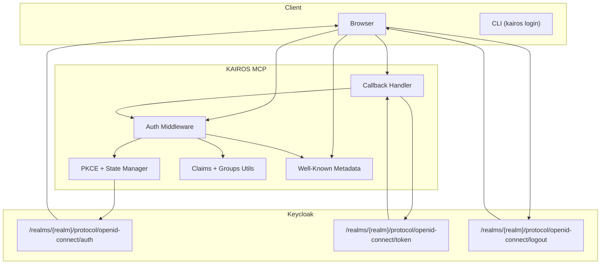
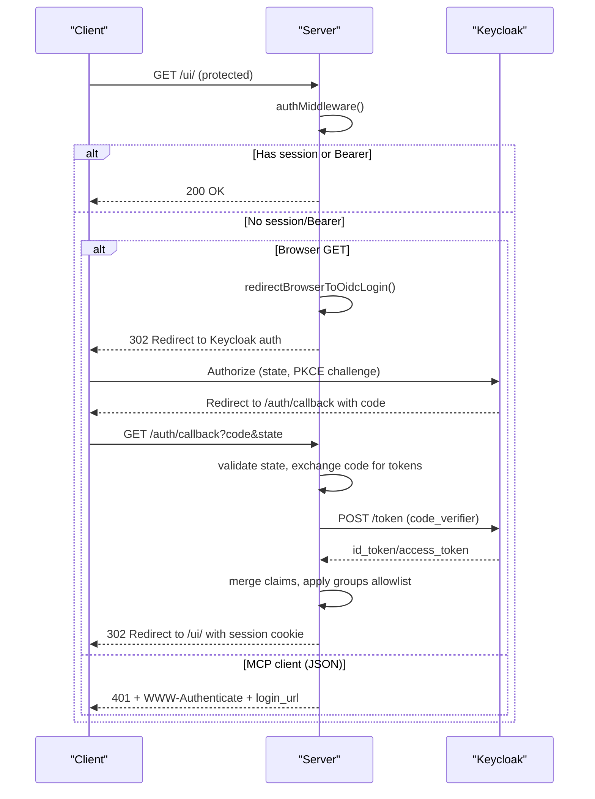
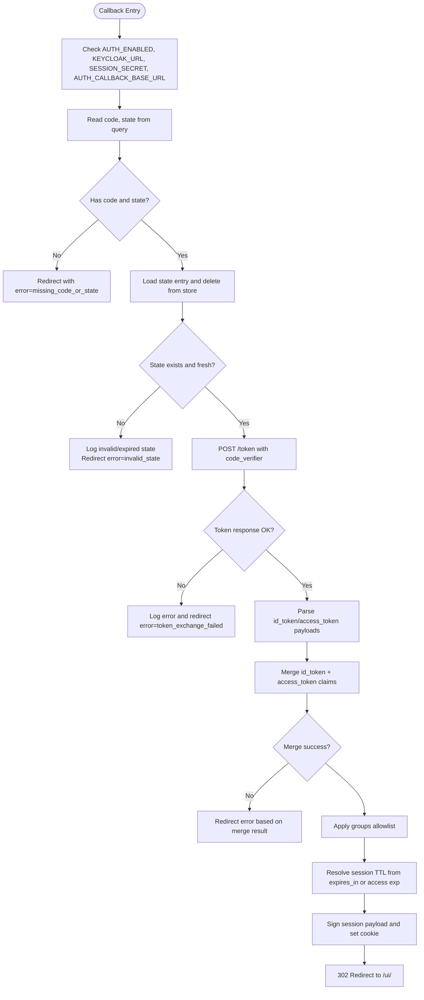
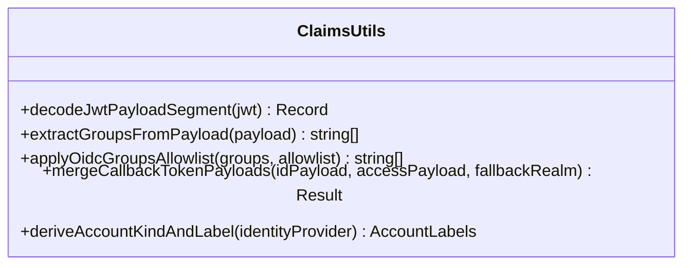
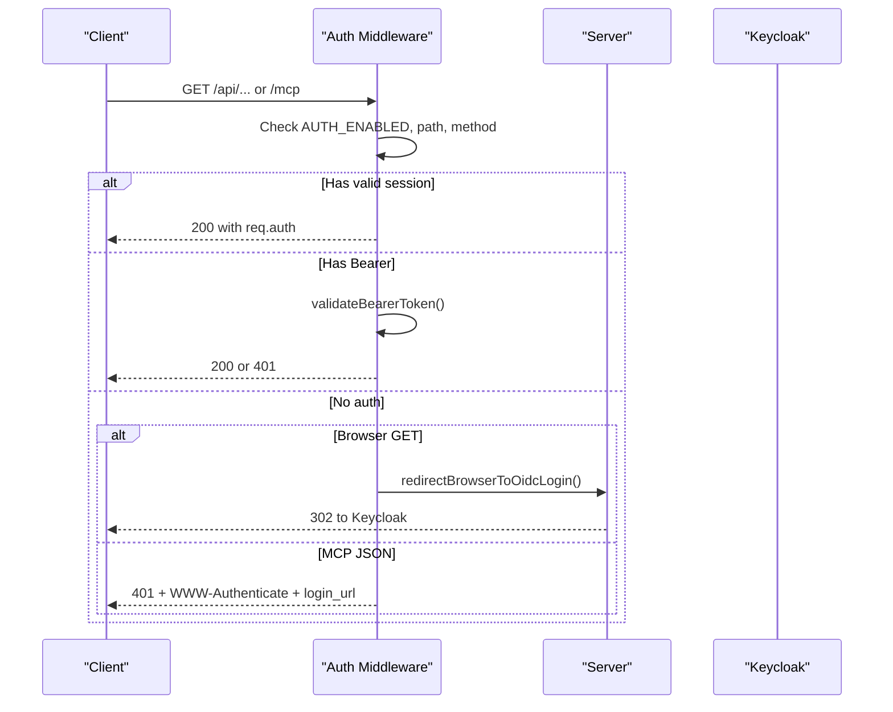
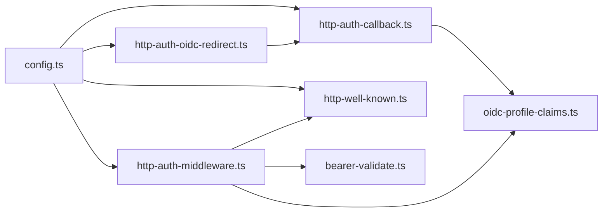

# OIDC Authentication Flow

<cite>
**Referenced Files in This Document**
- [src/http/http-auth-oidc-redirect.ts](file://src/http/http-auth-oidc-redirect.ts)
- [src/http/http-auth-callback.ts](file://src/http/http-auth-callback.ts)
- [src/http/http-auth-middleware.ts](file://src/http/http-auth-middleware.ts)
- [src/http/oidc-profile-claims.ts](file://src/http/oidc-profile-claims.ts)
- [src/http/oidc-scopes.ts](file://src/http/oidc-scopes.ts)
- [src/config.ts](file://src/config.ts)
- [src/http/http-well-known.ts](file://src/http/http-well-known.ts)
- [src/http/bearer-validate.ts](file://src/http/bearer-validate.ts)
- [src/http/http-api-me.ts](file://src/http/http-api-me.ts)
- [src/cli/commands/login.ts](file://src/cli/commands/login.ts)
- [scripts/deploy-configure-keycloak-realms.py](file://scripts/deploy-configure-keycloak-realms.py)
</cite>

## Table of Contents
1. [Introduction](#introduction)
2. [Project Structure](#project-structure)
3. [Core Components](#core-components)
4. [Architecture Overview](#architecture-overview)
5. [Detailed Component Analysis](#detailed-component-analysis)
6. [Dependency Analysis](#dependency-analysis)
7. [Performance Considerations](#performance-considerations)
8. [Troubleshooting Guide](#troubleshooting-guide)
9. [Conclusion](#conclusion)

## Introduction
This document explains the OAuth2/OIDC authentication flow in KAIROS MCP, covering the complete handshake from the initial browser request through Keycloak redirect to callback handling. It details login URL generation, state parameter management, PKCE implementation, callback processing, profile claims extraction, scope validation, group-based access control, session cookie creation, id_token storage for RP-initiated logout, and security considerations such as CSRF protection via state management.

## Project Structure
The OIDC flow spans several modules:
- HTTP endpoints for login initiation, callback handling, and logout
- Middleware enforcing authentication and deriving authorization context
- Utilities for PKCE state management, JWT payload decoding, and group filtering
- Configuration for Keycloak endpoints, scopes, and allowlists
- Well-known metadata endpoints for client discovery
- CLI login flow for browser-based PKCE

**Diagram sources**
- [src/http/http-auth-oidc-redirect.ts:28-87](file://src/http/http-auth-oidc-redirect.ts#L28-L87)
- [src/http/http-auth-callback.ts:122-231](file://src/http/http-auth-callback.ts#L122-L231)
- [src/http/http-auth-middleware.ts:167-313](file://src/http/http-auth-middleware.ts#L167-L313)
- [src/http/oidc-profile-claims.ts:200-256](file://src/http/oidc-profile-claims.ts#L200-L256)
- [src/http/http-well-known.ts:31-54](file://src/http/http-well-known.ts#L31-L54)

**Section sources**
- [src/http/http-auth-oidc-redirect.ts:1-101](file://src/http/http-auth-oidc-redirect.ts#L1-L101)
- [src/http/http-auth-callback.ts:1-233](file://src/http/http-auth-callback.ts#L1-L233)
- [src/http/http-auth-middleware.ts:1-316](file://src/http/http-auth-middleware.ts#L1-L316)
- [src/http/oidc-profile-claims.ts:1-288](file://src/http/oidc-profile-claims.ts#L1-L288)
- [src/http/oidc-scopes.ts:1-31](file://src/http/oidc-scopes.ts#L1-L31)
- [src/config.ts:113-163](file://src/config.ts#L113-L163)
- [src/http/http-well-known.ts:1-221](file://src/http/http-well-known.ts#L1-L221)

## Core Components
- PKCE and state manager: generates state and code_verifier, builds authorization URL, and stores state for CSRF protection.
- Callback handler: validates state, exchanges authorization code for tokens, merges claims, applies group allowlist, and sets session cookie.
- Auth middleware: enforces auth for protected paths, supports session and Bearer JWT validation, and derives space context.
- Claims and groups utilities: decodes JWT payloads, merges id_token and access_token claims, extracts groups, and applies allowlist filtering.
- Well-known metadata: exposes protected resource and AS metadata for client discovery and DCR.
- Configuration: defines Keycloak endpoints, scopes, allowlists, and session parameters.

**Section sources**
- [src/http/http-auth-oidc-redirect.ts:10-101](file://src/http/http-auth-oidc-redirect.ts#L10-L101)
- [src/http/http-auth-callback.ts:34-231](file://src/http/http-auth-callback.ts#L34-L231)
- [src/http/http-auth-middleware.ts:167-313](file://src/http/http-auth-middleware.ts#L167-L313)
- [src/http/oidc-profile-claims.ts:57-256](file://src/http/oidc-profile-claims.ts#L57-L256)
- [src/http/http-well-known.ts:31-92](file://src/http/http-well-known.ts#L31-L92)
- [src/config.ts:113-163](file://src/config.ts#L113-L163)

## Architecture Overview
The OIDC flow integrates browser and server components with Keycloak as the Identity Provider. The server manages PKCE state, validates callbacks, and stores a signed session cookie containing whitelisted claims and groups. The middleware enforces authentication and authorization across protected routes.

**Diagram sources**
- [src/http/http-auth-middleware.ts:167-313](file://src/http/http-auth-middleware.ts#L167-L313)
- [src/http/http-auth-oidc-redirect.ts:66-87](file://src/http/http-auth-oidc-redirect.ts#L66-L87)
- [src/http/http-auth-callback.ts:122-231](file://src/http/http-auth-callback.ts#L122-L231)

## Detailed Component Analysis

### PKCE and State Management
- Generates cryptographically random state and code_verifier.
- Computes code_challenge using SHA-256 and S256.
- Stores state with createdAt timestamp and prunes expired entries.
- Builds authorization URL with client_id, redirect_uri, response_type=code, scope, state, code_challenge, and prompt=login.
- Provides helpers to return login URL for JSON responses and safe creation that never throws.

Security considerations:
- State TTL prevents replay after 10 minutes.
- PKCE ensures token binding to the original authorization request.
- Redirect URI is constructed from AUTH_CALLBACK_BASE_URL to avoid wildcard mismatches.

**Section sources**
- [src/http/http-auth-oidc-redirect.ts:8-26](file://src/http/http-auth-oidc-redirect.ts#L8-L26)
- [src/http/http-auth-oidc-redirect.ts:28-45](file://src/http/http-auth-oidc-redirect.ts#L28-L45)
- [src/http/http-auth-oidc-redirect.ts:66-87](file://src/http/http-auth-oidc-redirect.ts#L66-L87)
- [src/http/http-auth-oidc-redirect.ts:89-101](file://src/http/http-auth-oidc-redirect.ts#L89-L101)

### Callback Processing and Token Exchange
- Validates presence of code and state; rejects if missing or state not found/expired.
- Exchanges authorization code for tokens using code_verifier against Keycloak token endpoint.
- Parses JWT payloads from id_token and access_token, merges claims, and validates sub consistency.
- Applies OIDC groups allowlist to filtered groups.
- Resolves session Max-Age from expires_in or access_token exp, with fallback to SESSION_MAX_AGE_SEC.
- Signs session cookie with SESSION_SECRET and sets HttpOnly/Lax cookie with SameSite and optional Secure flag.
- Stores id_token in the session cookie for RP-initiated logout (id_token_hint).

**Diagram sources**
- [src/http/http-auth-callback.ts:122-231](file://src/http/http-auth-callback.ts#L122-L231)

**Section sources**
- [src/http/http-auth-callback.ts:122-231](file://src/http/http-auth-callback.ts#L122-L231)

### Profile Claims Extraction and Group Allowlist
- Decodes JWT payload segments from compact serialization.
- Extracts whitelisted profile fields (preferred_username, name, given_name, family_name, email, email_verified, identity_provider).
- Merges id_token and access_token payloads with precedence rules and validates subject consistency.
- Normalizes groups from arrays or JSON strings, supports exact and prefix allowlist matching (case-insensitive for paths).
- Derives account kind and label from identity_provider.

**Diagram sources**
- [src/http/oidc-profile-claims.ts:57-256](file://src/http/oidc-profile-claims.ts#L57-L256)

**Section sources**
- [src/http/oidc-profile-claims.ts:57-256](file://src/http/oidc-profile-claims.ts#L57-L256)

### Auth Middleware and Protected Routes
- Enforces auth for /api, /api/*, /mcp, /ui, and /ui/*.
- Supports two auth modes:
  - Session: verifies signed cookie and whitelisted claims.
  - Bearer: validates JWT against JWKS with issuer/audience checks.
- For browser GET requests to protected paths, redirects to Keycloak login; for MCP client JSON requests, returns 401 with WWW-Authenticate and login_url.
- Applies space context and group-based access control for allowed spaces.

**Diagram sources**
- [src/http/http-auth-middleware.ts:167-313](file://src/http/http-auth-middleware.ts#L167-L313)
- [src/http/http-auth-oidc-redirect.ts:66-77](file://src/http/http-auth-oidc-redirect.ts#L66-L77)

**Section sources**
- [src/http/http-auth-middleware.ts:167-313](file://src/http/http-auth-middleware.ts#L167-L313)

### RP-Initiated Logout and Session Cookie Handling
- RP logout URL builder constructs post_logout_redirect_uri and optional id_token_hint.
- Logout endpoint clears session cookie, optionally retrieves id_token_hint from session, and redirects to Keycloak logout.
- Post-logout resume path (/auth/continue-signin) restarts login automatically.
- Session cookie is HttpOnly and carries signed payload with exp and optional id_token for RP logout.

**Section sources**
- [src/http/http-auth-oidc-redirect.ts:47-63](file://src/http/http-auth-oidc-redirect.ts#L47-L63)
- [src/http/http-auth-callback.ts:99-120](file://src/http/http-auth-callback.ts#L99-L120)
- [src/http/http-auth-middleware.ts:81-88](file://src/http/http-auth-middleware.ts#L81-L88)

### Well-Known Metadata and Scope Validation
- Exposes protected resource metadata and authorization server metadata proxies.
- Advertises supported scopes including openid, profile, email, kairos-groups, offline_access.
- Supports client ID metadata documents and preserves registration_endpoint for DCR.

**Section sources**
- [src/http/http-well-known.ts:31-92](file://src/http/http-well-known.ts#L31-L92)
- [src/http/oidc-scopes.ts:1-31](file://src/http/oidc-scopes.ts#L1-L31)
- [src/config.ts:130-137](file://src/config.ts#L130-L137)

### Bearer Token Validation and Userinfo Groups
- Validates JWT signatures via JWKS, checks issuer and audience, and enforces expiration.
- When access token lacks groups, fetches groups from OIDC userinfo using the same Bearer token.
- Merges userinfo groups with access token groups when configured.

**Section sources**
- [src/http/bearer-validate.ts:120-208](file://src/http/bearer-validate.ts#L120-L208)

### CLI Browser Login (PKCE)
- Implements browser-based PKCE login for the CLI with local HTTP server for callback handling.
- Generates state, code_verifier, and code_challenge; opens Keycloak authorization URL.
- Exchanges code for tokens and stores bearer token locally.

**Section sources**
- [src/cli/commands/login.ts:69-196](file://src/cli/commands/login.ts#L69-L196)

### Keycloak Client Configuration Notes
- Redirect URIs and post-logout redirect URIs are managed during deployment to ensure they match AUTH_CALLBACK_BASE_URL.
- Web origins are expanded accordingly for development environments.

**Section sources**
- [scripts/deploy-configure-keycloak-realms.py:168-202](file://scripts/deploy-configure-keycloak-realms.py#L168-L202)

## Dependency Analysis
The OIDC flow depends on configuration values, PKCE utilities, callback handlers, middleware, and claims processing. Well-known endpoints depend on configuration and Keycloak metadata.

**Diagram sources**
- [src/config.ts:113-163](file://src/config.ts#L113-L163)
- [src/http/http-auth-oidc-redirect.ts:1-101](file://src/http/http-auth-oidc-redirect.ts#L1-L101)
- [src/http/http-auth-callback.ts:1-233](file://src/http/http-auth-callback.ts#L1-L233)
- [src/http/http-auth-middleware.ts:1-316](file://src/http/http-auth-middleware.ts#L1-L316)
- [src/http/oidc-profile-claims.ts:1-288](file://src/http/oidc-profile-claims.ts#L1-L288)
- [src/http/bearer-validate.ts:1-209](file://src/http/bearer-validate.ts#L1-L209)
- [src/http/http-well-known.ts:1-221](file://src/http/http-well-known.ts#L1-L221)

**Section sources**
- [src/config.ts:113-163](file://src/config.ts#L113-L163)
- [src/http/http-auth-oidc-redirect.ts:1-101](file://src/http/http-auth-oidc-redirect.ts#L1-L101)
- [src/http/http-auth-callback.ts:1-233](file://src/http/http-auth-callback.ts#L1-L233)
- [src/http/http-auth-middleware.ts:1-316](file://src/http/http-auth-middleware.ts#L1-L316)
- [src/http/oidc-profile-claims.ts:1-288](file://src/http/oidc-profile-claims.ts#L1-L288)
- [src/http/bearer-validate.ts:1-209](file://src/http/bearer-validate.ts#L1-L209)
- [src/http/http-well-known.ts:1-221](file://src/http/http-well-known.ts#L1-L221)

## Performance Considerations
- State store pruning prevents unbounded growth; entries expire after 10 minutes.
- JWKS caching reduces repeated remote fetches for token validation.
- Session TTL resolution prefers token lifetimes to minimize re-auth frequency.
- Well-known metadata is cached to avoid per-request upstream fetches.

[No sources needed since this section provides general guidance]

## Troubleshooting Guide
Common issues and resolutions:
- Missing or invalid state: Ensure AUTH_CALLBACK_BASE_URL is set and matches Keycloak client redirect URIs; state must be present and fresh.
- Token exchange failures: Verify KEYCLOAK_URL/KEYCLOAK_INTERNAL_URL and realm configuration; check network connectivity and timeouts.
- Invalid or missing tokens in callback response: Confirm Keycloak client credentials and scopes; ensure redirect_uri matches AUTH_CALLBACK_BASE_URL.
- Bearer token validation errors: Check AUTH_TRUSTED_ISSUERS and AUTH_ALLOWED_AUDIENCES; ensure issuer base URL normalization for Docker deployments.
- Session cookie not set: Confirm SESSION_SECRET is configured and HTTPS usage for Secure flag when applicable.

**Section sources**
- [src/http/http-auth-callback.ts:122-231](file://src/http/http-auth-callback.ts#L122-L231)
- [src/http/http-auth-middleware.ts:225-282](file://src/http/http-auth-middleware.ts#L225-L282)
- [src/http/bearer-validate.ts:120-150](file://src/http/bearer-validate.ts#L120-L150)
- [src/config.ts:229-241](file://src/config.ts#L229-L241)

## Conclusion
KAIROS MCP implements a robust OAuth2/OIDC flow with PKCE, state-based CSRF protection, and secure session management. The design supports both browser and Bearer JWT authentication, enforces group-based access control, and integrates with Keycloak through well-known metadata and RP-initiated logout. Proper configuration of Keycloak clients and server-side environment variables is essential for a secure and reliable authentication experience.