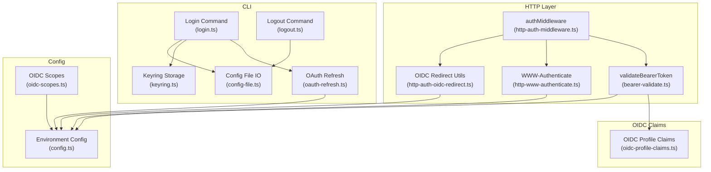
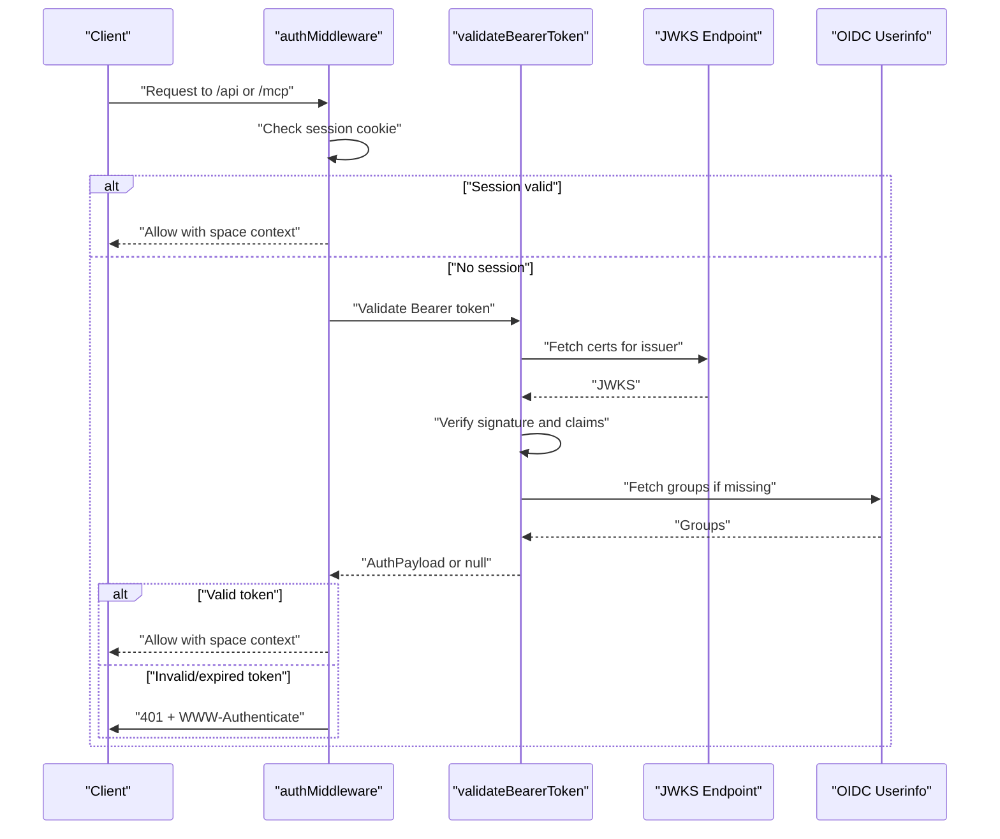
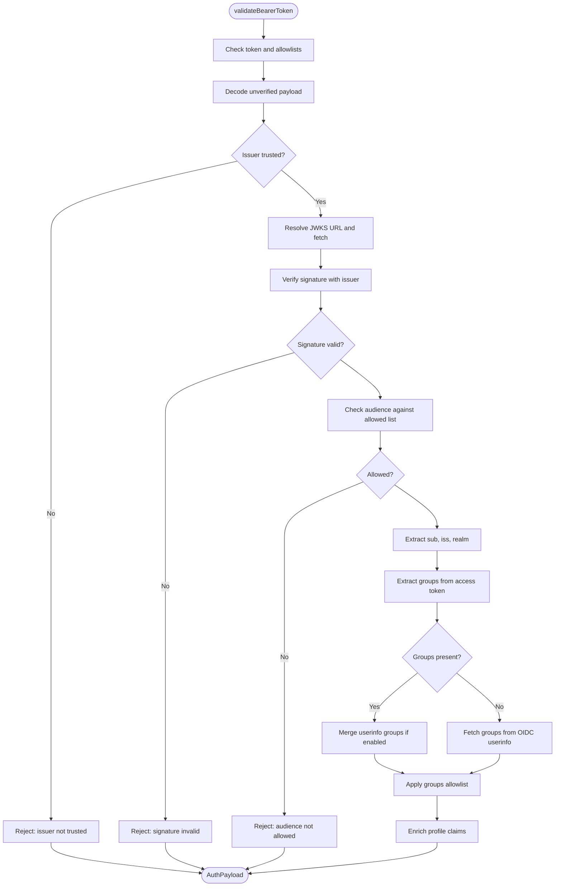
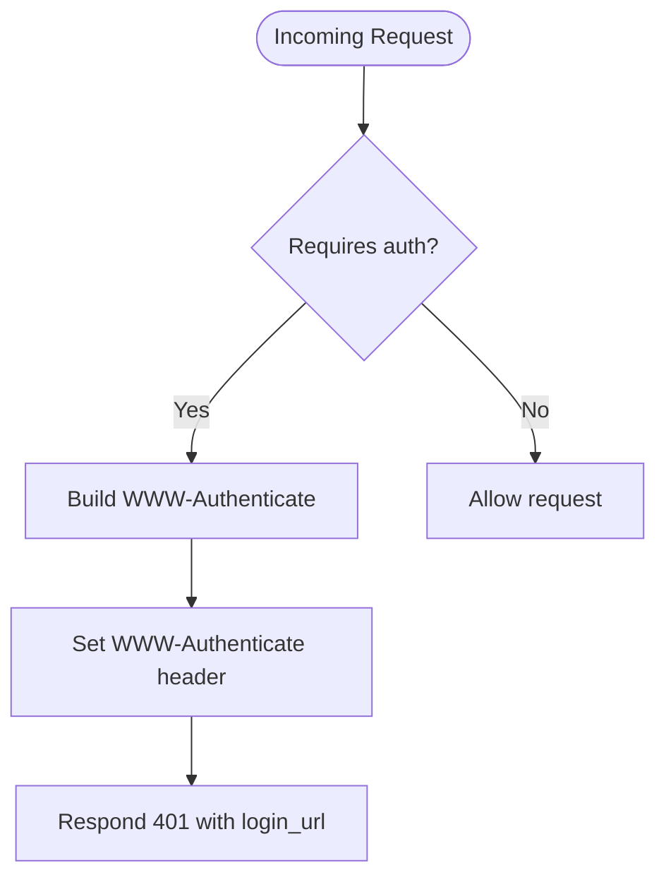
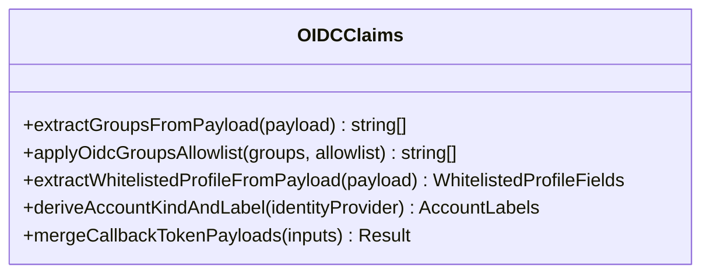
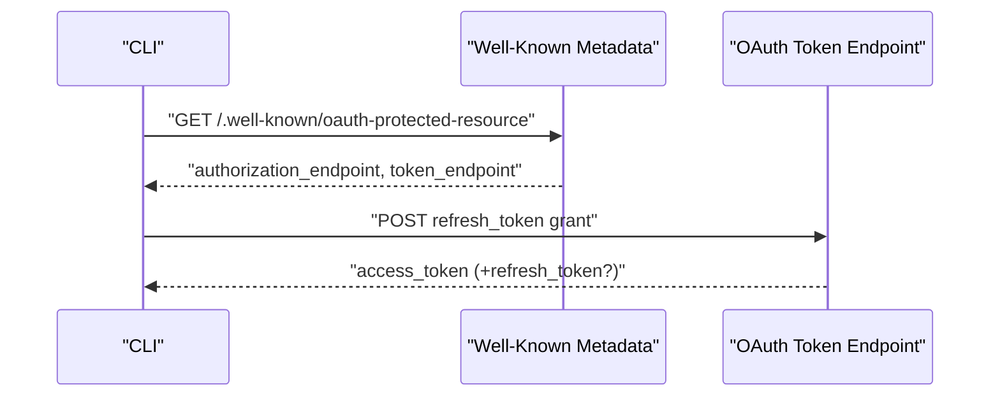
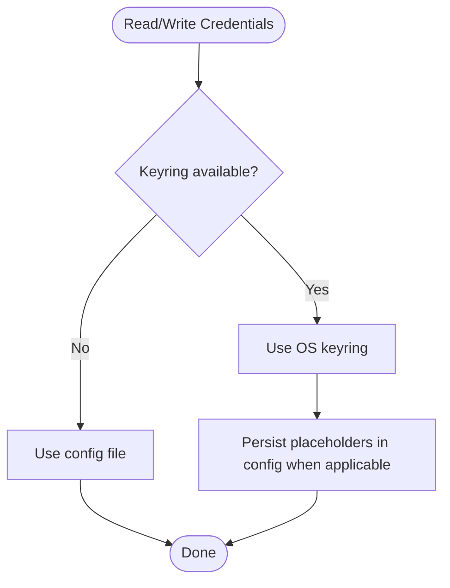
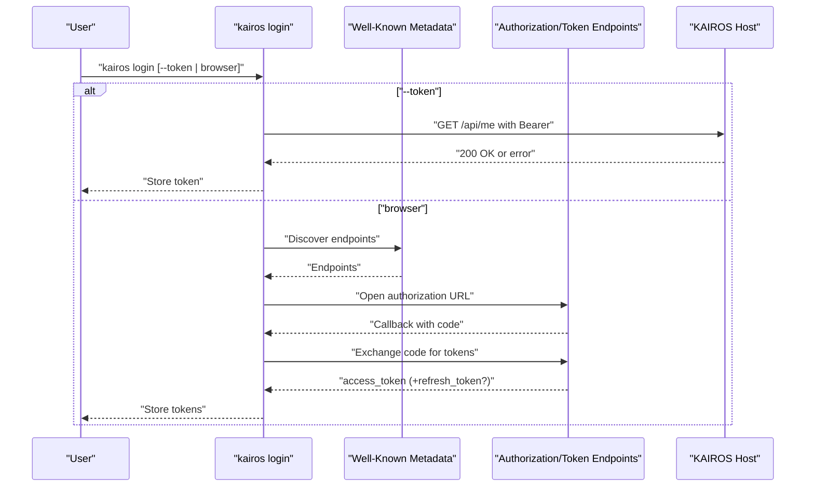
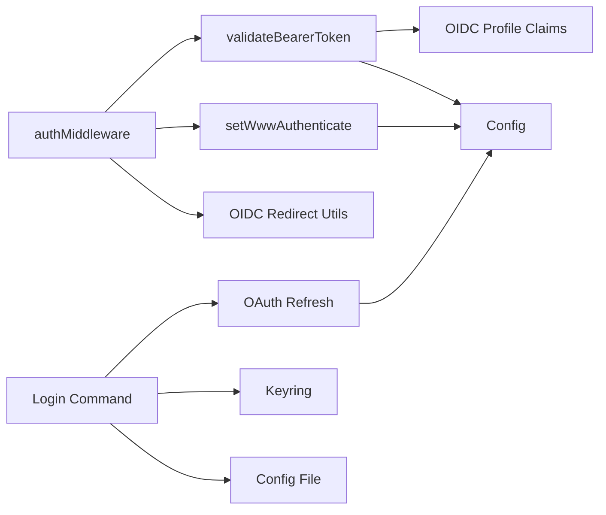

# Token Validation & Security

<cite>
**Referenced Files in This Document**
- [bearer-validate.ts](file://src/http/bearer-validate.ts)
- [http-auth-middleware.ts](file://src/http/http-auth-middleware.ts)
- [http-www-authenticate.ts](file://src/http/http-www-authenticate.ts)
- [oidc-profile-claims.ts](file://src/http/oidc-profile-claims.ts)
- [config.ts](file://src/config.ts)
- [oauth-refresh.ts](file://src/cli/oauth-refresh.ts)
- [keyring.ts](file://src/cli/keyring.ts)
- [login.ts](file://src/cli/commands/login.ts)
- [logout.ts](file://src/cli/commands/logout.ts)
- [config-file.ts](file://src/cli/config-file.ts)
- [http-auth-oidc-redirect.ts](file://src/http/http-auth-oidc-redirect.ts)
- [oidc-scopes.ts](file://src/http/oidc-scopes.ts)
- [structured-logger.ts](file://src/utils/structured-logger.ts)
- [auth-overview.md](file://docs/architecture/auth-overview.md)
</cite>

## Table of Contents
1. [Introduction](#introduction)
2. [Project Structure](#project-structure)
3. [Core Components](#core-components)
4. [Architecture Overview](#architecture-overview)
5. [Detailed Component Analysis](#detailed-component-analysis)
6. [Dependency Analysis](#dependency-analysis)
7. [Performance Considerations](#performance-considerations)
8. [Troubleshooting Guide](#troubleshooting-guide)
9. [Conclusion](#conclusion)

## Introduction
This document explains token validation and security mechanisms in KAIROS MCP with a focus on:
- Bearer token validation: issuer verification, audience checking, expiration validation, and signature verification
- WWW-Authenticate header generation for proper HTTP authentication challenges
- OAuth refresh token handling and secure credential storage using OS keyrings
- CLI authentication integration and token lifecycle
- JWT token structure validation, claim verification, and error handling
- Security best practices for token storage, transmission, and rotation
- Integration between session-based and bearer token authentication modes

## Project Structure
Security-related functionality spans HTTP middleware, OIDC utilities, CLI credential management, and configuration. The most relevant modules are:
- HTTP authentication middleware and bearer validator
- OIDC profile claims and JWKS resolution
- WWW-Authenticate header builder
- CLI OAuth refresh and keyring-backed storage
- Configuration for trusted issuers, audiences, and scopes

**Diagram sources**
- [http-auth-middleware.ts:167-313](file://src/http/http-auth-middleware.ts#L167-L313)
- [bearer-validate.ts:120-208](file://src/http/bearer-validate.ts#L120-L208)
- [http-www-authenticate.ts:18-47](file://src/http/http-www-authenticate.ts#L18-L47)
- [http-auth-oidc-redirect.ts:28-87](file://src/http/http-auth-oidc-redirect.ts#L28-L87)
- [oidc-profile-claims.ts:56-95](file://src/http/oidc-profile-claims.ts#L56-L95)
- [login.ts:69-196](file://src/cli/commands/login.ts#L69-L196)
- [logout.ts:10-19](file://src/cli/commands/logout.ts#L10-L19)
- [oauth-refresh.ts:26-86](file://src/cli/oauth-refresh.ts#L26-L86)
- [keyring.ts:50-87](file://src/cli/keyring.ts#L50-L87)
- [config-file.ts:77-188](file://src/cli/config-file.ts#L77-L188)
- [config.ts:113-171](file://src/config.ts#L113-L171)
- [oidc-scopes.ts:1-31](file://src/http/oidc-scopes.ts#L1-L31)

**Section sources**
- [http-auth-middleware.ts:167-313](file://src/http/http-auth-middleware.ts#L167-L313)
- [bearer-validate.ts:120-208](file://src/http/bearer-validate.ts#L120-L208)
- [http-www-authenticate.ts:18-47](file://src/http/http-www-authenticate.ts#L18-L47)
- [oidc-profile-claims.ts:56-95](file://src/http/oidc-profile-claims.ts#L56-L95)
- [login.ts:69-196](file://src/cli/commands/login.ts#L69-L196)
- [oauth-refresh.ts:26-86](file://src/cli/oauth-refresh.ts#L26-L86)
- [keyring.ts:50-87](file://src/cli/keyring.ts#L50-L87)
- [config-file.ts:77-188](file://src/cli/config-file.ts#L77-L188)
- [config.ts:113-171](file://src/config.ts#L113-L171)
- [oidc-scopes.ts:1-31](file://src/http/oidc-scopes.ts#L1-L31)

## Core Components
- Bearer token validation pipeline:
  - Decode JWT payload without verification
  - Verify issuer against trusted list
  - Fetch JWKS and verify signature
  - Verify audience against allowed list
  - Extract groups from access token, nested id_token, or OIDC userinfo
  - Apply groups allowlist and enrich profile claims
  - Produce AuthPayload for downstream use
- WWW-Authenticate header builder:
  - Builds Bearer challenge with realm, resource metadata, authorization URI, and scope
  - Adds error and error_description when needed
- OIDC profile and groups:
  - Extract groups from various claim forms
  - Normalize and filter groups via allowlist
  - Enrich AuthPayload with whitelisted profile fields
- CLI authentication:
  - Discover OAuth endpoints from well-known metadata
  - PKCE login flow and token exchange
  - Refresh token exchange
  - Secure storage via OS keyring with config-file fallback
- Configuration:
  - Trusted issuers and audiences
  - OIDC scopes and mode flags
  - Session and token lifetimes

**Section sources**
- [bearer-validate.ts:120-208](file://src/http/bearer-validate.ts#L120-L208)
- [http-www-authenticate.ts:18-47](file://src/http/http-www-authenticate.ts#L18-L47)
- [oidc-profile-claims.ts:78-153](file://src/http/oidc-profile-claims.ts#L78-L153)
- [login.ts:69-196](file://src/cli/commands/login.ts#L69-L196)
- [oauth-refresh.ts:26-86](file://src/cli/oauth-refresh.ts#L26-L86)
- [keyring.ts:50-87](file://src/cli/keyring.ts#L50-L87)
- [config.ts:113-171](file://src/config.ts#L113-L171)

## Architecture Overview
The authentication system integrates session-based and bearer token authentication. Requests to protected paths are handled by a central middleware that:
- Checks for a valid session cookie
- If absent, validates a Bearer token when configured
- Generates proper WWW-Authenticate challenges for 401 responses
- Enforces space scoping and group-based permissions

**Diagram sources**
- [http-auth-middleware.ts:225-282](file://src/http/http-auth-middleware.ts#L225-L282)
- [bearer-validate.ts:120-208](file://src/http/bearer-validate.ts#L120-L208)
- [http-www-authenticate.ts:44-47](file://src/http/http-www-authenticate.ts#L44-L47)

**Section sources**
- [http-auth-middleware.ts:167-313](file://src/http/http-auth-middleware.ts#L167-L313)
- [bearer-validate.ts:120-208](file://src/http/bearer-validate.ts#L120-L208)
- [http-www-authenticate.ts:18-47](file://src/http/http-www-authenticate.ts#L18-L47)

## Detailed Component Analysis

### Bearer Token Validation Pipeline
- Issuer verification:
  - Decode unverified payload to extract issuer
  - Reject if issuer is missing or not in trusted list
- Signature verification:
  - Resolve JWKS URL for issuer (supports internal host override)
  - Fetch JWKS and verify JWT signature with issuer constraint
- Audience validation:
  - Accept configured allowed audiences
  - Special-case Keycloak realm tokens with empty or "account" audience
- Claim extraction and enrichment:
  - Extract subject and issuer
  - Derive realm from issuer
  - Extract groups from access token, nested id_token, or OIDC userinfo
  - Merge groups from userinfo when configured
  - Apply groups allowlist
  - Enrich with whitelisted profile claims
- Output:
  - AuthPayload suitable for downstream authorization and space scoping

**Diagram sources**
- [bearer-validate.ts:120-208](file://src/http/bearer-validate.ts#L120-L208)
- [oidc-profile-claims.ts:78-153](file://src/http/oidc-profile-claims.ts#L78-L153)

**Section sources**
- [bearer-validate.ts:120-208](file://src/http/bearer-validate.ts#L120-L208)
- [oidc-profile-claims.ts:78-153](file://src/http/oidc-profile-claims.ts#L78-L153)

### WWW-Authenticate Header Generation
- Builds a Bearer challenge with:
  - realm="mcp"
  - resource_metadata pointing to OAuth protected resource metadata
  - authorization_uri for IdP discovery
  - scope list from supported OIDC scopes
- Adds error and error_description when rejecting Bearer tokens
- Sets the WWW-Authenticate header on 401 responses

**Diagram sources**
- [http-www-authenticate.ts:18-47](file://src/http/http-www-authenticate.ts#L18-L47)
- [http-auth-middleware.ts:240-279](file://src/http/http-auth-middleware.ts#L240-L279)

**Section sources**
- [http-www-authenticate.ts:18-47](file://src/http/http-www-authenticate.ts#L18-L47)
- [http-auth-middleware.ts:240-279](file://src/http/http-auth-middleware.ts#L240-L279)

### OIDC Profile Claims and Groups Allowlist
- Groups extraction supports arrays, single strings, and JSON-encoded strings
- Normalizes group paths and applies allowlist filtering (exact match or prefix)
- Whitelists profile claims and derives account kind/label from identity provider
- Merges callback payloads from id_token and access_token with precedence rules

**Diagram sources**
- [oidc-profile-claims.ts:78-256](file://src/http/oidc-profile-claims.ts#L78-L256)

**Section sources**
- [oidc-profile-claims.ts:78-256](file://src/http/oidc-profile-claims.ts#L78-L256)

### OAuth Refresh Token Handling and JWT Expiration
- Discovers OAuth endpoints from well-known metadata
- Exchanges refresh_token for new access token (and possibly a rotated refresh_token)
- Computes seconds until JWT exp claim for proactive refresh decisions

**Diagram sources**
- [oauth-refresh.ts:26-86](file://src/cli/oauth-refresh.ts#L26-L86)

**Section sources**
- [oauth-refresh.ts:26-86](file://src/cli/oauth-refresh.ts#L26-L86)

### Secure Credential Storage Using OS Keyrings
- OS-native keyring used when available; falls back to config file
- Stores bearer and refresh tokens separately with distinct accounts
- Provides availability detection and robust error handling
- CLI config file supports multiple environments and keychain placeholders

**Diagram sources**
- [keyring.ts:50-87](file://src/cli/keyring.ts#L50-L87)
- [config-file.ts:77-188](file://src/cli/config-file.ts#L77-L188)

**Section sources**
- [keyring.ts:50-87](file://src/cli/keyring.ts#L50-L87)
- [config-file.ts:77-188](file://src/cli/config-file.ts#L77-L188)

### CLI Authentication Integration
- Browser PKCE login:
  - Resolves OAuth endpoints, generates PKCE challenge, and opens IdP authorization URL
  - Listens on localhost for callback, exchanges authorization code for tokens
  - Persists tokens via keyring/config
- Token validation:
  - Validates stored token via GET /api/me
- Logout:
  - Clears stored bearer token for current environment

**Diagram sources**
- [login.ts:69-196](file://src/cli/commands/login.ts#L69-L196)
- [oauth-refresh.ts:26-86](file://src/cli/oauth-refresh.ts#L26-L86)

**Section sources**
- [login.ts:69-196](file://src/cli/commands/login.ts#L69-L196)
- [logout.ts:10-19](file://src/cli/commands/logout.ts#L10-L19)
- [oauth-refresh.ts:26-86](file://src/cli/oauth-refresh.ts#L26-L86)

### Configuration and Mode Flags
- Trusted issuers and audiences:
  - Trusted issuers expanded to include localhost ↔ 127.0.0.1 aliases
  - Allowed audiences include server/client IDs plus "account" for Keycloak realms
- OIDC scopes:
  - Supported scopes parsed from environment with defaults
- Auth mode and session:
  - AUTH_MODE controls whether Bearer tokens are validated
  - Session cookie and max age configurable

**Section sources**
- [config.ts:284-323](file://src/config.ts#L284-L323)
- [config.ts:139-171](file://src/config.ts#L139-L171)
- [oidc-scopes.ts:1-31](file://src/http/oidc-scopes.ts#L1-L31)

## Dependency Analysis
- authMiddleware depends on:
  - validateBearerToken for Bearer validation
  - setWwwAuthenticate for 401 challenges
  - OIDC redirect utilities for browser flows
- validateBearerToken depends on:
  - OIDC profile claims for group extraction and enrichment
  - Config for issuer/audience allowlists and flags
- CLI login depends on:
  - OAuth refresh utilities for endpoint discovery and token exchange
  - Keyring for secure storage
  - Config file for environment persistence

**Diagram sources**
- [http-auth-middleware.ts:26-29](file://src/http/http-auth-middleware.ts#L26-L29)
- [bearer-validate.ts:5-20](file://src/http/bearer-validate.ts#L5-L20)
- [config.ts:113-171](file://src/config.ts#L113-L171)
- [login.ts:21-22](file://src/cli/commands/login.ts#L21-L22)
- [oauth-refresh.ts:26-51](file://src/cli/oauth-refresh.ts#L26-L51)
- [keyring.ts:50-87](file://src/cli/keyring.ts#L50-L87)
- [config-file.ts:77-188](file://src/cli/config-file.ts#L77-L188)
- [http-www-authenticate.ts:18-47](file://src/http/http-www-authenticate.ts#L18-L47)

**Section sources**
- [http-auth-middleware.ts:26-29](file://src/http/http-auth-middleware.ts#L26-L29)
- [bearer-validate.ts:5-20](file://src/http/bearer-validate.ts#L5-L20)
- [config.ts:113-171](file://src/config.ts#L113-L171)
- [login.ts:21-22](file://src/cli/commands/login.ts#L21-L22)
- [oauth-refresh.ts:26-51](file://src/cli/oauth-refresh.ts#L26-L51)
- [keyring.ts:50-87](file://src/cli/keyring.ts#L50-L87)
- [config-file.ts:77-188](file://src/cli/config-file.ts#L77-L188)
- [http-www-authenticate.ts:18-47](file://src/http/http-www-authenticate.ts#L18-L47)

## Performance Considerations
- JWKS caching:
  - Remote JWK Set is cached per issuer to avoid repeated network fetches
- Network timeouts:
  - OIDC userinfo fetch uses a bounded timeout to prevent slow down
- Logging overhead:
  - Optional trace-level logs for auth events; enable with environment flags for diagnostics
- Rate limiting:
  - Dedicated auth rate limits to mitigate brute-force attempts

**Section sources**
- [bearer-validate.ts:41-109](file://src/http/bearer-validate.ts#L41-L109)
- [bearer-validate.ts:79-99](file://src/http/bearer-validate.ts#L79-L99)
- [config.ts:104-107](file://src/config.ts#L104-L107)
- [structured-logger.ts:208-226](file://src/utils/structured-logger.ts#L208-L226)

## Troubleshooting Guide
- 401 Unauthorized with WWW-Authenticate:
  - Indicates missing or invalid credentials; clients should trigger OAuth login
  - Error and error_description included to guide clients to clear cached tokens
- Bearer token rejected:
  - Issuer not trusted: verify AUTH_TRUSTED_ISSUERS and mode flags
  - Audience not allowed: verify AUTH_ALLOWED_AUDIENCES
  - Signature verification failed: check JWKS reachability and issuer configuration
- Session vs Bearer confusion:
  - AUTH_MODE determines whether Bearer tokens are validated
  - Protected paths require either a valid session or a validated Bearer token
- CLI token issues:
  - Validate token via GET /api/me
  - Re-login using browser PKCE or --token
  - Clear stored credentials with logout

**Section sources**
- [http-www-authenticate.ts:18-47](file://src/http/http-www-authenticate.ts#L18-L47)
- [http-auth-middleware.ts:225-282](file://src/http/http-auth-middleware.ts#L225-L282)
- [login.ts:39-61](file://src/cli/commands/login.ts#L39-L61)
- [logout.ts:10-19](file://src/cli/commands/logout.ts#L10-L19)

## Conclusion
KAIROS MCP implements a robust, standards-based authentication system:
- Bearer tokens are validated with strict issuer, audience, and signature checks
- Groups and profile claims are extracted and filtered to enforce least-privilege access
- WWW-Authenticate ensures compliant HTTP challenges for clients
- CLI integrates OAuth PKCE and refresh flows with secure OS keyring-backed storage
- Configuration supports flexible OIDC deployments and operational tuning

Operational best practices:
- Align session and token lifetimes with IdP policies
- Use groups allowlists to constrain space membership
- Prefer OS keyrings for credential storage; monitor fallback to config files
- Enable trace logging only during diagnostics to minimize risk and overhead