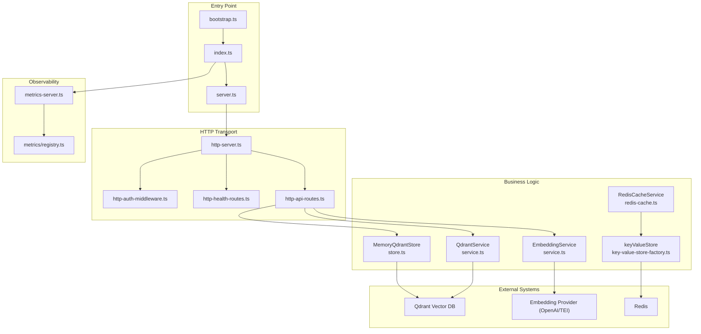
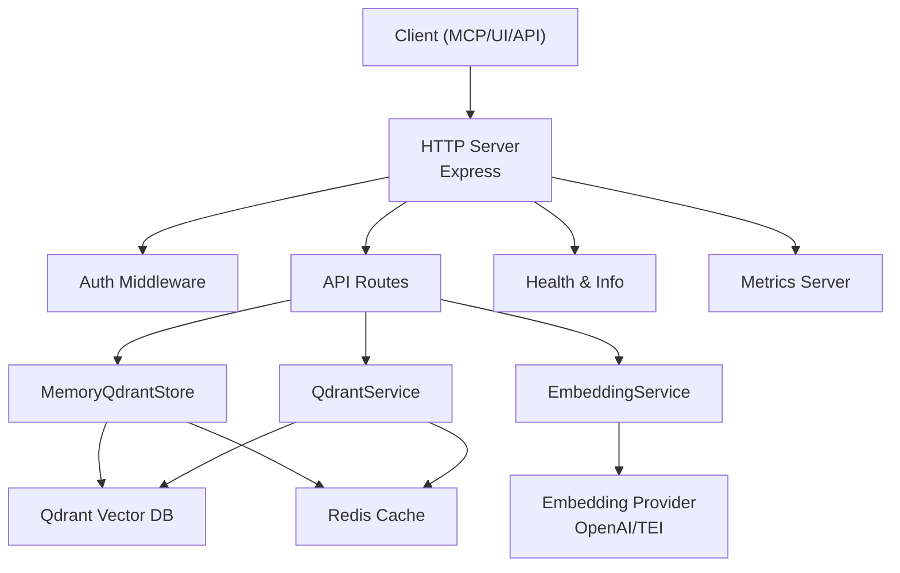
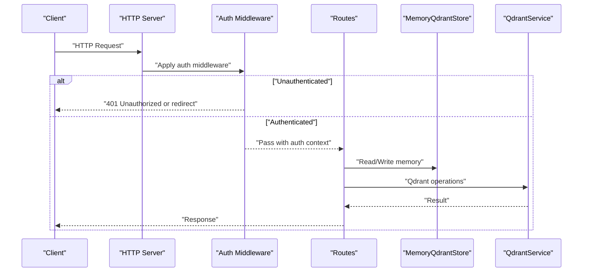
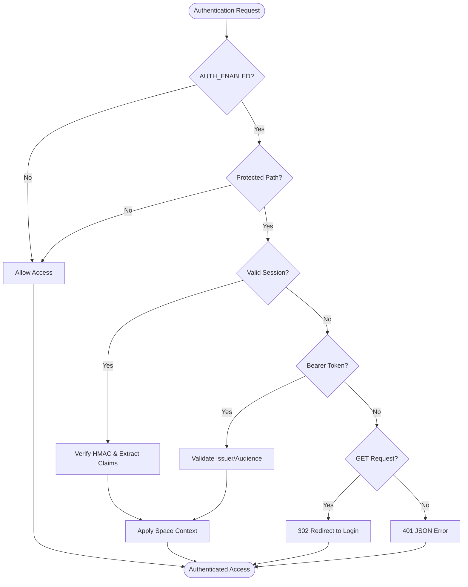
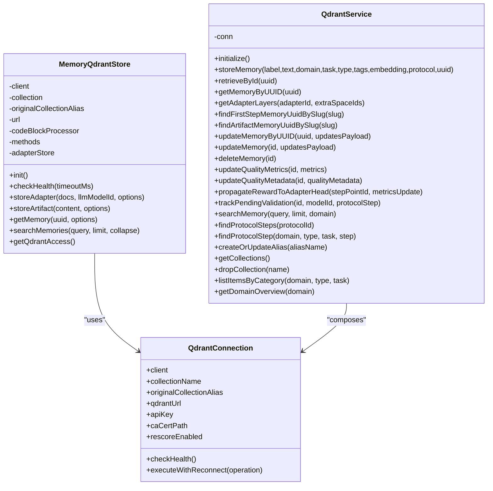
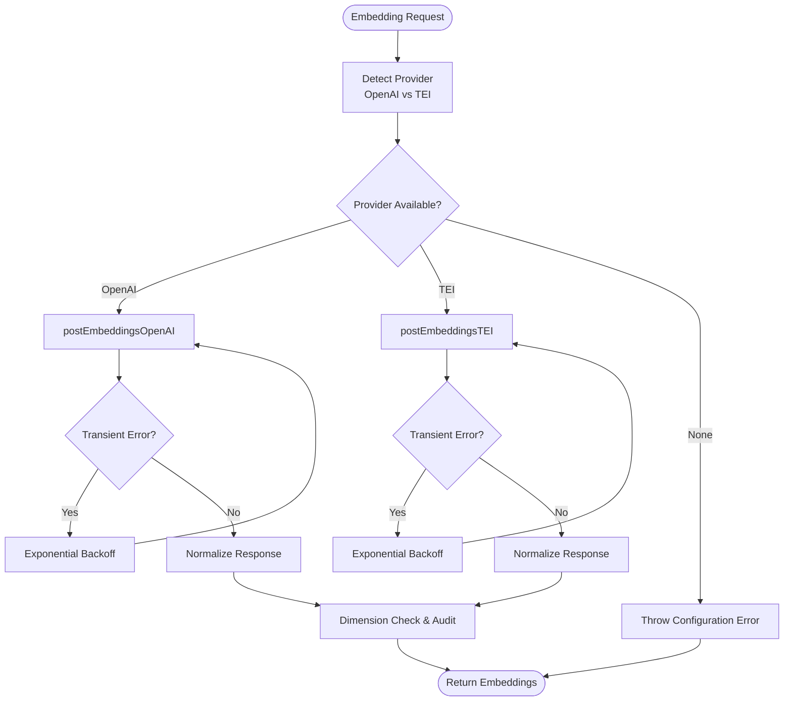
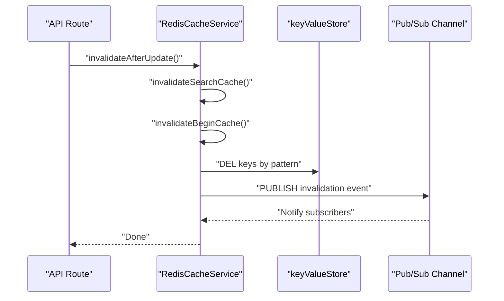
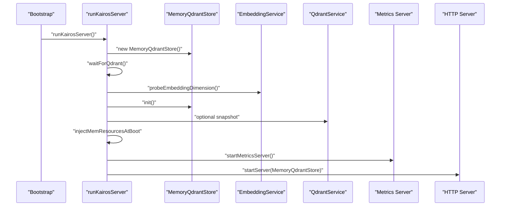
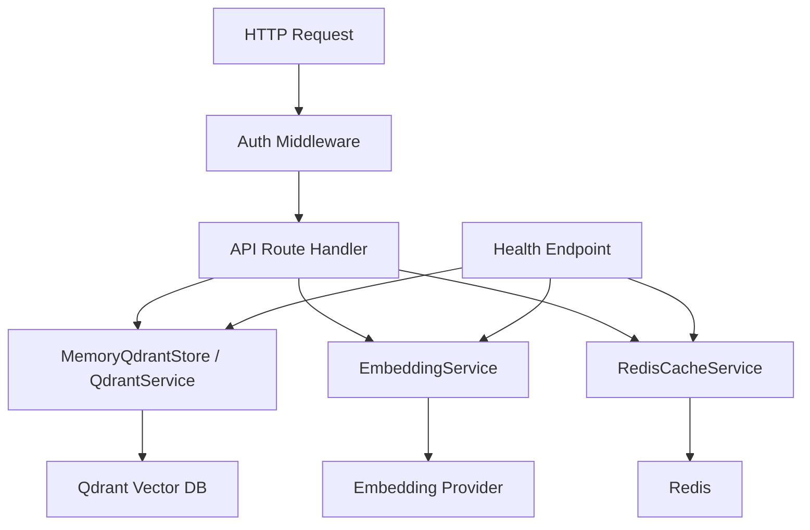
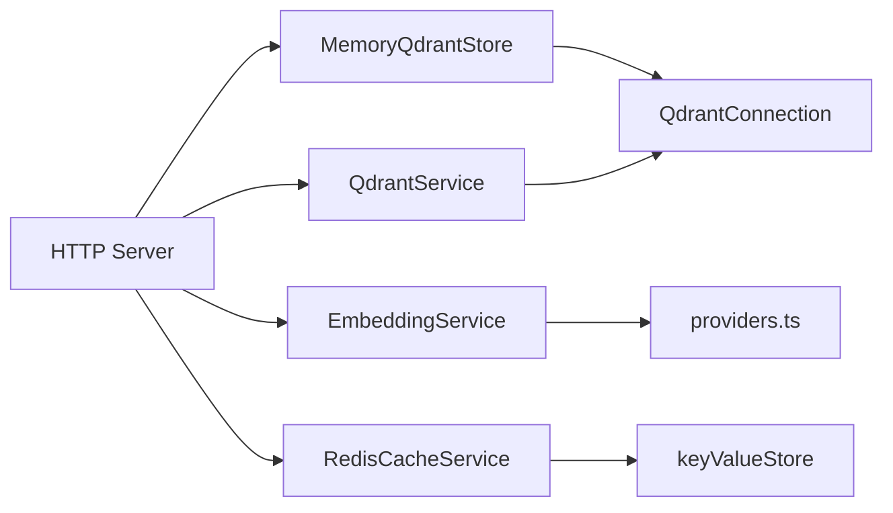

# Core Services Architecture

<cite>
**Referenced Files in This Document**
- [src/index.ts](file://src/index.ts)
- [src/bootstrap.ts](file://src/bootstrap.ts)
- [src/server.ts](file://src/server.ts)
- [src/http/http-server.ts](file://src/http/http-server.ts)
- [src/http/http-auth-middleware.ts](file://src/http/http-auth-middleware.ts)
- [src/http/http-api-routes.ts](file://src/http/http-api-routes.ts)
- [src/http/http-health-routes.ts](file://src/http/http-health-routes.ts)
- [src/config.ts](file://src/config.ts)
- [src/services/memory/store.ts](file://src/services/memory/store.ts)
- [src/services/qdrant/service.ts](file://src/services/qdrant/service.ts)
- [src/services/qdrant/connection.ts](file://src/services/qdrant/connection.ts)
- [src/services/embedding/service.ts](file://src/services/embedding/service.ts)
- [src/services/redis-cache.ts](file://src/services/redis-cache.ts)
- [src/services/key-value-store-factory.ts](file://src/services/key-value-store-factory.ts)
- [src/metrics-server.ts](file://src/metrics-server.ts)
- [src/services/metrics/registry.ts](file://src/services/metrics/registry.ts)
</cite>

## Update Summary
**Changes Made**
- Added comprehensive authentication architecture documentation covering OIDC integration, Bearer token validation, and session management
- Enhanced embedding services documentation with provider abstraction and health monitoring
- Expanded memory management documentation with Qdrant integration patterns
- Updated service initialization patterns and dependency injection architecture
- Added detailed configuration management across environments
- Enhanced Redis cache layer documentation with invalidation strategies
- Improved metrics and health monitoring documentation

## Table of Contents
1. [Introduction](#introduction)
2. [Project Structure](#project-structure)
3. [Core Components](#core-components)
4. [Architecture Overview](#architecture-overview)
5. [Detailed Component Analysis](#detailed-component-analysis)
6. [Dependency Analysis](#dependency-analysis)
7. [Performance Considerations](#performance-considerations)
8. [Troubleshooting Guide](#troubleshooting-guide)
9. [Conclusion](#conclusion)
10. [Appendices](#appendices)

## Introduction
This document describes the KAIROS MCP core services layer architecture. It explains how the HTTP server integrates with business logic services, including memory management, embedding services, and authentication middleware. It documents the Qdrant vector database integration pattern, Redis cache layer architecture, and embedding provider abstraction. It also covers service initialization order, dependency injection patterns, inter-service communication, data flow from HTTP endpoints to data stores, health monitoring, error propagation, graceful degradation strategies, configuration management across environments, and service scaling considerations.

## Project Structure
The core services layer is organized around a layered architecture:
- Entry point and orchestration: bootstrap and server initialization
- HTTP transport: Express-based server with middleware and routes
- Business logic services: memory store, Qdrant service, embedding service, Redis cache
- Metrics and health: dedicated metrics server and health endpoints
- Configuration: centralized environment variable parsing and defaults

**Diagram sources**
- [src/bootstrap.ts:1-55](file://src/bootstrap.ts#L1-L55)
- [src/index.ts:74-134](file://src/index.ts#L74-L134)
- [src/server.ts:125-194](file://src/server.ts#L125-L194)
- [src/http/http-server.ts:22-59](file://src/http/http-server.ts#L22-L59)
- [src/http/http-auth-middleware.ts:168-326](file://src/http/http-auth-middleware.ts#L168-L326)
- [src/http/http-health-routes.ts:13-116](file://src/http/http-health-routes.ts#L13-L116)
- [src/http/http-api-routes.ts:22-36](file://src/http/http-api-routes.ts#L22-L36)
- [src/services/memory/store.ts:20-152](file://src/services/memory/store.ts#L20-L152)
- [src/services/qdrant/service.ts:16-152](file://src/services/qdrant/service.ts#L16-L152)
- [src/services/embedding/service.ts:38-293](file://src/services/embedding/service.ts#L38-L293)
- [src/services/redis-cache.ts:21-243](file://src/services/redis-cache.ts#L21-L243)
- [src/services/key-value-store-factory.ts:12-20](file://src/services/key-value-store-factory.ts#L12-L20)
- [src/metrics-server.ts:19-45](file://src/metrics-server.ts#L19-L45)
- [src/services/metrics/registry.ts:11-23](file://src/services/metrics/registry.ts#L11-L23)

**Section sources**
- [src/bootstrap.ts:1-55](file://src/bootstrap.ts#L1-L55)
- [src/index.ts:74-134](file://src/index.ts#L74-L134)
- [src/server.ts:125-194](file://src/server.ts#L125-L194)
- [src/http/http-server.ts:22-59](file://src/http/http-server.ts#L22-L59)

## Core Components
- Bootstrap and initialization
  - Global error handlers installed early to capture import-time failures
  - Application bootstraps Qdrant connectivity, embedding dimension probing, memory store initialization, optional snapshot, embedded resource injection, metrics server, and HTTP server startup
- HTTP server
  - Express app configured with middleware and routes
  - Authentication middleware validates sessions or Bearer tokens
  - Health endpoints expose service readiness and dependency status
  - API routes delegate to business logic services
- Memory and Qdrant integration
  - MemoryQdrantStore encapsulates Qdrant client, collection resolution, and memory operations
  - QdrantService composes connection and exposes higher-level operations
  - QdrantConnection manages client lifecycle, health checks, and reconnect logic
- Embedding service
  - EmbeddingService abstracts provider selection (OpenAI or TEI) and batch/individual embedding generation
  - Providers module implements retry logic, error classification, and audit logging
- Redis cache layer
  - RedisCacheService provides search result caching, memory caching, and invalidation via pub/sub
  - Key-value store factory selects Redis or in-memory backend based on configuration
- Metrics and health
  - Dedicated metrics server exposes Prometheus-compatible /metrics
  - Health endpoints report dependency status and service metadata

**Section sources**
- [src/index.ts:74-134](file://src/index.ts#L74-L134)
- [src/server.ts:125-194](file://src/server.ts#L125-L194)
- [src/http/http-server.ts:22-59](file://src/http/http-server.ts#L22-L59)
- [src/services/memory/store.ts:20-152](file://src/services/memory/store.ts#L20-L152)
- [src/services/qdrant/service.ts:16-152](file://src/services/qdrant/service.ts#L16-L152)
- [src/services/qdrant/connection.ts:11-131](file://src/services/qdrant/connection.ts#L11-L131)
- [src/services/embedding/service.ts:38-293](file://src/services/embedding/service.ts#L38-L293)
- [src/services/embedding/providers.ts:251-280](file://src/services/embedding/providers.ts#L251-L280)
- [src/services/redis-cache.ts:21-243](file://src/services/redis-cache.ts#L21-L243)
- [src/services/key-value-store-factory.ts:12-20](file://src/services/key-value-store-factory.ts#L12-L20)
- [src/metrics-server.ts:19-45](file://src/metrics-server.ts#L19-L45)
- [src/http/http-health-routes.ts:13-116](file://src/http/http-health-routes.ts#L13-L116)

## Architecture Overview
The system follows a layered architecture:
- Presentation layer: HTTP server with routing and middleware
- Application layer: business logic services and orchestration
- Data access layer: Qdrant vector store and Redis cache
- Observability layer: metrics and health endpoints

**Diagram sources**
- [src/http/http-server.ts:22-59](file://src/http/http-server.ts#L22-L59)
- [src/http/http-auth-middleware.ts:168-326](file://src/http/http-auth-middleware.ts#L168-L326)
- [src/http/http-api-routes.ts:22-36](file://src/http/http-api-routes.ts#L22-L36)
- [src/services/memory/store.ts:20-152](file://src/services/memory/store.ts#L20-L152)
- [src/services/qdrant/service.ts:16-152](file://src/services/qdrant/service.ts#L16-L152)
- [src/services/embedding/service.ts:38-293](file://src/services/embedding/service.ts#L38-L293)
- [src/http/http-health-routes.ts:13-116](file://src/http/http-health-routes.ts#L13-L116)
- [src/metrics-server.ts:19-45](file://src/metrics-server.ts#L19-L45)

## Detailed Component Analysis

### HTTP Server and Authentication Middleware
- HTTP server initialization registers middleware and routes in a specific order to ensure discovery endpoints remain accessible without authentication.
- Authentication middleware supports:
  - Session-based auth with OIDC cookies
  - Bearer token validation when configured with trusted issuers and audiences
  - Space scoping and group filtering for authorized access
- Health routes provide dependency readiness checks for Qdrant, Redis, and embedding provider.

**Diagram sources**
- [src/http/http-server.ts:22-59](file://src/http/http-server.ts#L22-L59)
- [src/http/http-auth-middleware.ts:168-326](file://src/http/http-auth-middleware.ts#L168-L326)
- [src/http/http-api-routes.ts:22-36](file://src/http/http-api-routes.ts#L22-L36)
- [src/http/http-health-routes.ts:13-116](file://src/http/http-health-routes.ts#L13-L116)

**Section sources**
- [src/http/http-server.ts:22-59](file://src/http/http-server.ts#L22-L59)
- [src/http/http-auth-middleware.ts:168-326](file://src/http/http-auth-middleware.ts#L168-L326)
- [src/http/http-health-routes.ts:13-116](file://src/http/http-health-routes.ts#L13-L116)

### Authentication Architecture
The authentication system implements a comprehensive OIDC-based security model:

- **Session Management**: Secure session cookies with HMAC verification, configurable expiration, and group filtering
- **Bearer Token Validation**: Optional OIDC Bearer token validation with issuer/audience verification
- **Multi-factor Authentication Support**: Integration with Keycloak for enterprise SSO
- **Space Scoping**: Fine-grained access control based on user groups and space permissions
- **Fallback Mechanisms**: Graceful degradation when authentication systems are unavailable

**Diagram sources**
- [src/http/http-auth-middleware.ts:168-326](file://src/http/http-auth-middleware.ts#L168-L326)
- [src/config.ts:113-241](file://src/config.ts#L113-L241)

**Section sources**
- [src/http/http-auth-middleware.ts:168-326](file://src/http/http-auth-middleware.ts#L168-L326)
- [src/config.ts:113-241](file://src/config.ts#L113-L241)

### Memory Management and Qdrant Integration
- MemoryQdrantStore encapsulates:
  - Qdrant client creation with optional API key and TLS configuration
  - Collection alias resolution and initialization
  - Memory operations (store, retrieve, search) via adapter and methods
  - Health checks with timeout protection
- QdrantService composes QdrantConnection and exposes:
  - Memory store/upsert/retrieve/update/delete
  - Resource upsert and protocol step queries
  - Quality metrics and reward propagation
- QdrantConnection provides:
  - Client initialization with TLS and CA cert handling
  - Health checks and exponential backoff reconnection
  - Operation wrapper to handle transient failures gracefully

**Diagram sources**
- [src/services/memory/store.ts:20-152](file://src/services/memory/store.ts#L20-L152)
- [src/services/qdrant/service.ts:16-152](file://src/services/qdrant/service.ts#L16-L152)
- [src/services/qdrant/connection.ts:11-131](file://src/services/qdrant/connection.ts#L11-L131)

**Section sources**
- [src/services/memory/store.ts:20-152](file://src/services/memory/store.ts#L20-L152)
- [src/services/qdrant/service.ts:16-152](file://src/services/qdrant/service.ts#L16-L152)
- [src/services/qdrant/connection.ts:11-131](file://src/services/qdrant/connection.ts#L11-L131)

### Embedding Provider Abstraction
- EmbeddingService:
  - Selects provider based on environment configuration (OpenAI or TEI) with fallback logic
  - Generates single and batch embeddings with anomaly detection and audit logging
  - Tracks metrics for requests, duration, errors, vector sizes, and batch sizes
- Providers module:
  - Implements retry logic for transient network errors and HTTP statuses
  - Normalizes provider responses and extracts embedding dimensions
  - Audits provider calls with tenant and request context

**Diagram sources**
- [src/services/embedding/service.ts:38-293](file://src/services/embedding/service.ts#L38-L293)
- [src/services/embedding/providers.ts:251-280](file://src/services/embedding/providers.ts#L251-L280)

**Section sources**
- [src/services/embedding/service.ts:38-293](file://src/services/embedding/service.ts#L38-L293)
- [src/services/embedding/providers.ts:251-280](file://src/services/embedding/providers.ts#L251-L280)

### Redis Cache Layer Architecture
- RedisCacheService:
  - Provides search result caching with TTL and invalidation via pub/sub channels
  - Caches memory resources globally with no TTL
  - Maintains hit/miss counters and supports targeted invalidation (search, memory, begin/activate)
- Key-value store factory:
  - Chooses RedisService when KEY_VALUE_STORE_URL/REDIS_URL is set, otherwise in-memory store
- Interactions:
  - Cache invalidation is published on a channel and can trigger downstream invalidations
  - Memory cache keys are global; search cache keys are scoped by space via key prefixing

**Diagram sources**
- [src/services/redis-cache.ts:21-243](file://src/services/redis-cache.ts#L21-L243)
- [src/services/key-value-store-factory.ts:12-20](file://src/services/key-value-store-factory.ts#L12-L20)

**Section sources**
- [src/services/redis-cache.ts:21-243](file://src/services/redis-cache.ts#L21-L243)
- [src/services/key-value-store-factory.ts:12-20](file://src/services/key-value-store-factory.ts#L12-L20)

### Service Initialization Order and Dependency Injection
- Initialization sequence:
  - Install global error handlers and Qdrant fetch compatibility
  - Wait for Qdrant availability with retries
  - Probe embedding dimension and initialize memory store
  - Trigger optional Qdrant snapshot on startup
  - Inject embedded memory resources into Qdrant
  - Start metrics server on separate port
  - Start HTTP server with injected MemoryQdrantStore
- Dependency injection:
  - MemoryQdrantStore instantiated once and passed to HTTP routes and MCP server
  - QdrantService composed with QdrantConnection and passed to routes
  - EmbeddingService singleton used across components
  - Redis cache service depends on keyValueStore (Redis or in-memory)

**Diagram sources**
- [src/bootstrap.ts:37-55](file://src/bootstrap.ts#L37-L55)
- [src/index.ts:74-134](file://src/index.ts#L74-L134)
- [src/server.ts:125-194](file://src/server.ts#L125-L194)
- [src/services/memory/store.ts:55-57](file://src/services/memory/store.ts#L55-L57)
- [src/services/embedding/service.ts:289-293](file://src/services/embedding/service.ts#L289-L293)
- [src/metrics-server.ts:19-45](file://src/metrics-server.ts#L19-L45)
- [src/http/http-server.ts:50-59](file://src/http/http-server.ts#L50-L59)

**Section sources**
- [src/index.ts:74-134](file://src/index.ts#L74-L134)
- [src/bootstrap.ts:37-55](file://src/bootstrap.ts#L37-L55)
- [src/server.ts:125-194](file://src/server.ts#L125-L194)

### Inter-Service Communication Patterns
- HTTP routes depend on MemoryQdrantStore and QdrantService for persistence and retrieval
- EmbeddingService is used for training and similarity computations
- RedisCacheService coordinates cache invalidation across services
- QdrantService encapsulates QdrantConnection to centralize resilience and reconnect logic

**Section sources**
- [src/http/http-api-routes.ts:22-36](file://src/http/http-api-routes.ts#L22-L36)
- [src/services/qdrant/service.ts:16-152](file://src/services/qdrant/service.ts#L16-L152)
- [src/services/redis-cache.ts:21-243](file://src/services/redis-cache.ts#L21-L243)

### Data Flow: HTTP Endpoints to Data Stores
- Request processing pipeline:
  - Auth middleware validates session or Bearer token
  - API routes parse inputs and delegate to business logic
  - Memory operations use MemoryQdrantStore; Qdrant operations use QdrantService
  - EmbeddingService generates vectors for training and search
  - RedisCacheService reads/writes cached results and publishes invalidations
  - Health endpoints aggregate dependency status

**Diagram sources**
- [src/http/http-auth-middleware.ts:168-326](file://src/http/http-auth-middleware.ts#L168-L326)
- [src/http/http-api-routes.ts:22-36](file://src/http/http-api-routes.ts#L22-L36)
- [src/services/memory/store.ts:20-152](file://src/services/memory/store.ts#L20-L152)
- [src/services/qdrant/service.ts:16-152](file://src/services/qdrant/service.ts#L16-L152)
- [src/services/embedding/service.ts:38-293](file://src/services/embedding/service.ts#L38-L293)
- [src/services/redis-cache.ts:21-243](file://src/services/redis-cache.ts#L21-L243)
- [src/http/http-health-routes.ts:13-116](file://src/http/http-health-routes.ts#L13-L116)

## Dependency Analysis
- Coupling and cohesion:
  - MemoryQdrantStore and QdrantService are tightly coupled to QdrantConnection for resilience and reconnect logic
  - EmbeddingService depends on providers module for external calls and metrics for observability
  - RedisCacheService depends on keyValueStore abstraction to switch between Redis and in-memory backends
- External dependencies:
  - Qdrant JS client for vector operations
  - Express for HTTP transport
  - Prom-client for metrics
- Potential circular dependencies:
  - None observed; services are composed rather than imported mutually

**Diagram sources**
- [src/services/embedding/service.ts:38-293](file://src/services/embedding/service.ts#L38-L293)
- [src/services/embedding/providers.ts:251-280](file://src/services/embedding/providers.ts#L251-L280)
- [src/services/memory/store.ts:20-152](file://src/services/memory/store.ts#L20-L152)
- [src/services/qdrant/connection.ts:11-131](file://src/services/qdrant/connection.ts#L11-L131)
- [src/services/qdrant/service.ts:16-152](file://src/services/qdrant/service.ts#L16-L152)
- [src/services/redis-cache.ts:21-243](file://src/services/redis-cache.ts#L21-L243)
- [src/services/key-value-store-factory.ts:12-20](file://src/services/key-value-store-factory.ts#L12-L20)
- [src/http/http-server.ts:22-59](file://src/http/http-server.ts#L22-L59)

**Section sources**
- [src/services/memory/store.ts:20-152](file://src/services/memory/store.ts#L20-L152)
- [src/services/qdrant/service.ts:16-152](file://src/services/qdrant/service.ts#L16-L152)
- [src/services/embedding/service.ts:38-293](file://src/services/embedding/service.ts#L38-L293)
- [src/services/redis-cache.ts:21-243](file://src/services/redis-cache.ts#L21-L243)
- [src/services/key-value-store-factory.ts:12-20](file://src/services/key-value-store-factory.ts#L12-L20)
- [src/http/http-server.ts:22-59](file://src/http/http-server.ts#L22-L59)

## Performance Considerations
- Concurrency and timeouts:
  - Embedding provider calls use bounded retries and timeouts to avoid blocking
  - Health checks bound embedding provider checks to keep /health responsive
- Caching:
  - Redis cache reduces repeated search workloads; invalidation ensures freshness
  - Memory cache for resources persists across requests without TTL
- Vector operations:
  - QdrantConnection implements exponential backoff reconnection to recover from transient failures
- Metrics:
  - Prometheus metrics enable capacity planning and alerting on latency and error rates

## Troubleshooting Guide
- Startup failures:
  - Bootstrap installs global error handlers to capture import-time exceptions and exit with non-zero code
  - runKairosServer logs fatal errors and exits with non-zero code
- Qdrant unavailability:
  - waitForQdrant retries until healthy or timeout
  - QdrantConnection executesWithReconnect attempts reconnection with exponential backoff
- Embedding provider issues:
  - EmbeddingService audits provider calls and detects dimension mismatches
  - Providers module retries on transient network errors and HTTP statuses
- Cache invalidation:
  - RedisCacheService publishes invalidation events; verify pub/sub subscribers are active
- Health monitoring:
  - /health aggregates dependency status; embedding health checks are bounded to avoid blocking
  - Metrics server exposes /metrics for Prometheus scraping

**Section sources**
- [src/bootstrap.ts:37-55](file://src/bootstrap.ts#L37-L55)
- [src/index.ts:122-134](file://src/index.ts#L122-L134)
- [src/server.ts:125-194](file://src/server.ts#L125-L194)
- [src/services/qdrant/connection.ts:76-131](file://src/services/qdrant/connection.ts#L76-L131)
- [src/services/embedding/providers.ts:31-47](file://src/services/embedding/providers.ts#L31-L47)
- [src/services/redis-cache.ts:114-125](file://src/services/redis-cache.ts#L114-L125)
- [src/http/http-health-routes.ts:13-116](file://src/http/http-health-routes.ts#L13-L116)
- [src/metrics-server.ts:19-45](file://src/metrics-server.ts#L19-L45)

## Conclusion
The KAIROS MCP core services layer implements a clean separation of concerns with robust error handling, graceful degradation, and strong observability. The HTTP server delegates to specialized services for memory, embeddings, and caching, while Qdrant and Redis provide scalable persistence. Centralized configuration enables environment-specific behavior, and the metrics server isolates operational monitoring. Together, these patterns support reliable scaling and maintainability.

## Appendices

### Configuration Management Across Environments
- Environment variables are parsed centrally with defaults and validation
- Key areas:
  - Transport and ports (HTTP and metrics)
  - Authentication (Keycloak OIDC, Bearer token validation)
  - Qdrant (URL, API key, collection alias, rescore, snapshot)
  - Embedding (provider selection, model, dimensions, latency thresholds)
  - Redis (URL, prefix, cache TTL)
  - Rate limiting and search tuning

**Section sources**
- [src/config.ts:18-330](file://src/config.ts#L18-L330)

### Service Scaling Considerations
- Horizontal scaling:
  - Redis cache requires a shared backend for distributed invalidation
  - Qdrant is stateful; scale horizontally with managed instances and consistent collection aliases
- Vertical scaling:
  - Increase embedding provider throughput or provision multiple replicas
  - Tune search parameters and overfetch factors for performance
- Observability:
  - Use dedicated metrics server for Prometheus scraping without impacting application performance
  - Monitor embedding provider latencies and error rates to drive autoscaling decisions