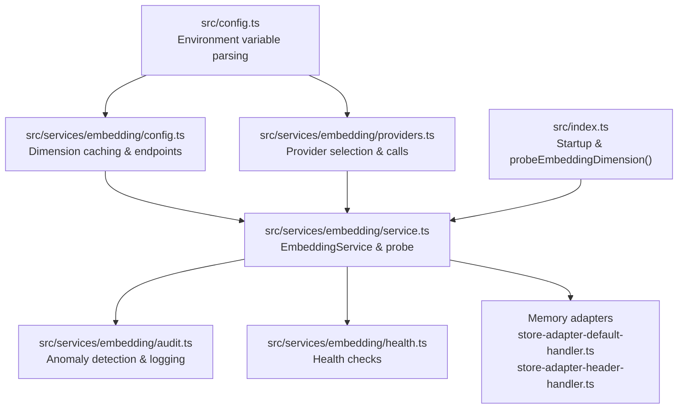
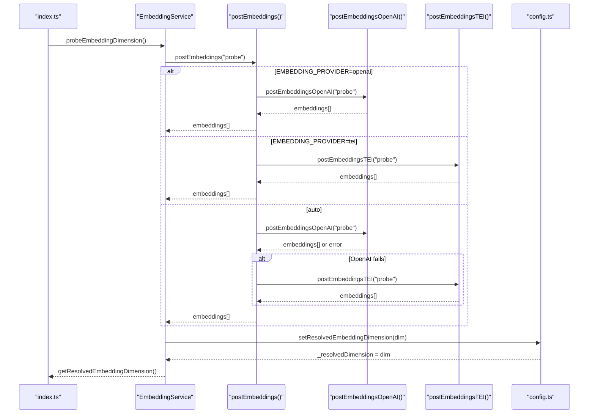
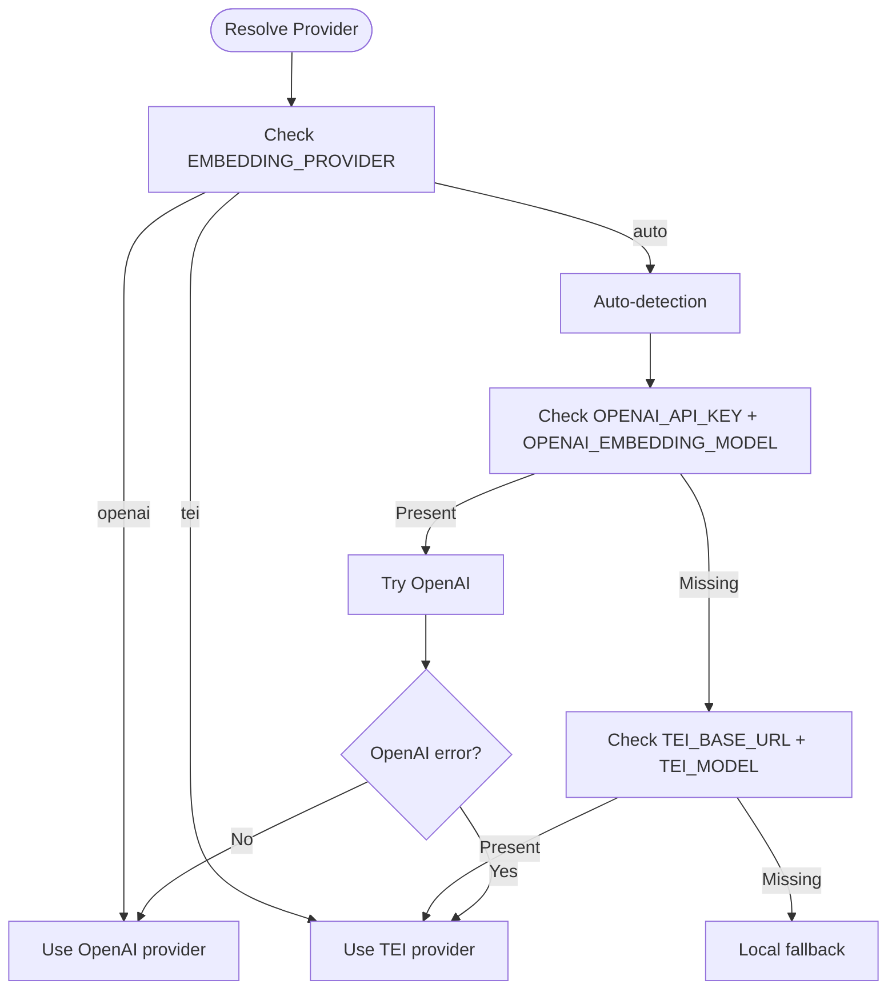
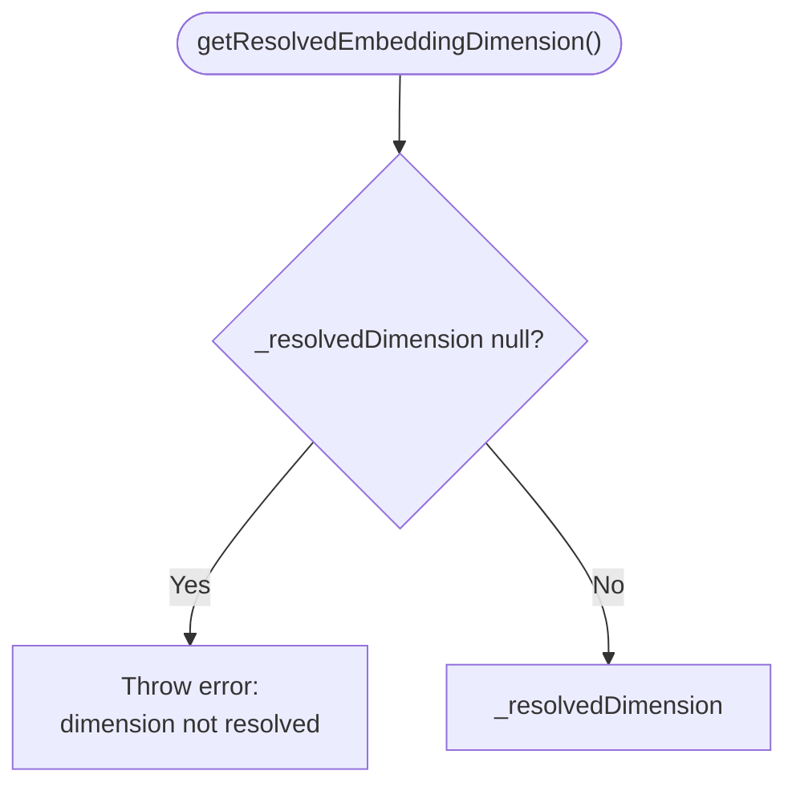
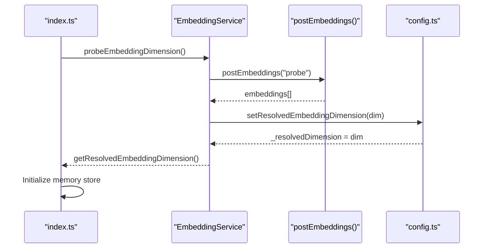
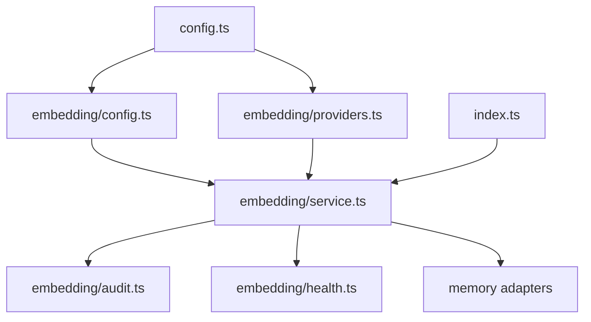

# Embedding Configuration Management

<cite>
**Referenced Files in This Document**
- [src/config.ts](file://src/config.ts)
- [src/services/embedding/config.ts](file://src/services/embedding/config.ts)
- [src/services/embedding/service.ts](file://src/services/embedding/service.ts)
- [src/services/embedding/providers.ts](file://src/services/embedding/providers.ts)
- [src/services/embedding/health.ts](file://src/services/embedding/health.ts)
- [src/services/embedding/audit.ts](file://src/services/embedding/audit.ts)
- [src/services/embedding/types.ts](file://src/services/embedding/types.ts)
- [src/index.ts](file://src/index.ts)
- [src/services/memory/store-adapter-default-handler.ts](file://src/services/memory/store-adapter-default-handler.ts)
- [src/services/memory/store-adapter-header-handler.ts](file://src/services/memory/store-adapter-header-handler.ts)
</cite>

## Table of Contents
1. [Introduction](#introduction)
2. [Project Structure](#project-structure)
3. [Core Components](#core-components)
4. [Architecture Overview](#architecture-overview)
5. [Detailed Component Analysis](#detailed-component-analysis)
6. [Dependency Analysis](#dependency-analysis)
7. [Performance Considerations](#performance-considerations)
8. [Troubleshooting Guide](#troubleshooting-guide)
9. [Conclusion](#conclusion)

## Introduction
This document explains the embedding configuration management system used to ensure consistent vector dimensions and reliable provider selection across the application. It covers how embedding dimensions are resolved at startup, how provider preferences are determined, and how configuration precedence and environment variables are handled. It also documents the getResolvedEmbeddingDimension() function, configuration validation, dimension probing during startup, and the relationship between configuration and embedding service initialization. Finally, it addresses configuration hot-reloading limitations, validation errors, and troubleshooting common configuration issues.

## Project Structure
The embedding configuration system spans several modules:
- Centralized environment variable parsing in the main configuration module
- Embedding-specific configuration and dimension caching
- Provider selection and embedding generation
- Health checks and audit logging
- Startup initialization that probes embedding dimensions before memory store initialization

**Diagram sources**
- [src/config.ts:67-74](file://src/config.ts#L67-L74)
- [src/services/embedding/config.ts:12-36](file://src/services/embedding/config.ts#L12-L36)
- [src/services/embedding/providers.ts:251-278](file://src/services/embedding/providers.ts#L251-L278)
- [src/services/embedding/service.ts:38-292](file://src/services/embedding/service.ts#L38-L292)
- [src/services/embedding/audit.ts:94-157](file://src/services/embedding/audit.ts#L94-L157)
- [src/services/embedding/health.ts:16-119](file://src/services/embedding/health.ts#L16-L119)
- [src/index.ts:89-90](file://src/index.ts#L89-L90)
- [src/services/memory/store-adapter-default-handler.ts:108-142](file://src/services/memory/store-adapter-default-handler.ts#L108-L142)
- [src/services/memory/store-adapter-header-handler.ts:53-77](file://src/services/memory/store-adapter-header-handler.ts#L53-L77)

**Section sources**
- [src/config.ts:67-74](file://src/config.ts#L67-L74)
- [src/services/embedding/config.ts:12-36](file://src/services/embedding/config.ts#L12-L36)
- [src/services/embedding/providers.ts:251-278](file://src/services/embedding/providers.ts#L251-L278)
- [src/services/embedding/service.ts:38-292](file://src/services/embedding/service.ts#L38-L292)
- [src/services/embedding/audit.ts:94-157](file://src/services/embedding/audit.ts#L94-L157)
- [src/services/embedding/health.ts:16-119](file://src/services/embedding/health.ts#L16-L119)
- [src/index.ts:89-90](file://src/index.ts#L89-L90)
- [src/services/memory/store-adapter-default-handler.ts:108-142](file://src/services/memory/store-adapter-default-handler.ts#L108-L142)
- [src/services/memory/store-adapter-header-handler.ts:53-77](file://src/services/memory/store-adapter-header-handler.ts#L53-L77)

## Core Components
- Environment variable parsing and defaults:
  - OPENAI_API_URL, OPENAI_API_KEY, OPENAI_EMBEDDING_MODEL
  - EMBEDDING_PROVIDER ('auto' | 'openai' | 'tei')
  - TEI_BASE_URL, TEI_MODEL, TEI_API_KEY
  - EMBEDDING_LATENCY_WARN_MS, EMBEDDING_NORM_MIN, EMBEDDING_NORM_MAX
- Embedding configuration and dimension caching:
  - Runtime cache for resolved embedding dimension
  - Functions to set and retrieve the resolved dimension
- Provider selection and embedding generation:
  - EmbeddingService with provider preference resolution
  - postEmbeddings() orchestrating OpenAI and TEI calls
  - Health checks and audit logging
- Startup initialization:
  - probeEmbeddingDimension() called at startup before memory store initialization

**Section sources**
- [src/config.ts:67-74](file://src/config.ts#L67-L74)
- [src/services/embedding/config.ts:12-36](file://src/services/embedding/config.ts#L12-L36)
- [src/services/embedding/service.ts:38-292](file://src/services/embedding/service.ts#L38-L292)
- [src/services/embedding/providers.ts:251-278](file://src/services/embedding/providers.ts#L251-L278)
- [src/services/embedding/health.ts:16-119](file://src/services/embedding/health.ts#L16-L119)
- [src/index.ts:89-90](file://src/index.ts#L89-L90)

## Architecture Overview
The embedding configuration system follows a layered approach:
- Configuration layer: centralizes environment variable parsing and defaults
- Embedding configuration layer: manages dimension caching and provider endpoints
- Service layer: encapsulates embedding generation, provider selection, and validation
- Initialization layer: ensures dimension probing occurs before memory store initialization

**Diagram sources**
- [src/index.ts:89-90](file://src/index.ts#L89-L90)
- [src/services/embedding/service.ts:288-292](file://src/services/embedding/service.ts#L288-L292)
- [src/services/embedding/providers.ts:251-278](file://src/services/embedding/providers.ts#L251-L278)
- [src/services/embedding/providers.ts:77-175](file://src/services/embedding/providers.ts#L77-L175)
- [src/services/embedding/providers.ts:177-249](file://src/services/embedding/providers.ts#L177-L249)
- [src/services/embedding/config.ts:12-31](file://src/services/embedding/config.ts#L12-L31)

## Detailed Component Analysis

### Configuration Resolution Process
The system resolves embedding configuration through a deterministic precedence:
- Explicit provider preference via EMBEDDING_PROVIDER
- Automatic detection based on available environment variables
- Fallback provider selection

**Diagram sources**
- [src/services/embedding/service.ts:258-265](file://src/services/embedding/service.ts#L258-L265)
- [src/services/embedding/providers.ts:251-278](file://src/services/embedding/providers.ts#L251-L278)

**Section sources**
- [src/services/embedding/service.ts:258-265](file://src/services/embedding/service.ts#L258-L265)
- [src/services/embedding/providers.ts:251-278](file://src/services/embedding/providers.ts#L251-L278)

### getResolvedEmbeddingDimension() Function
The getResolvedEmbeddingDimension() function enforces consistent vector sizes:
- Caches the resolved dimension after the first successful embedding call
- Validates subsequent calls against the cached dimension
- Throws if called before dimension resolution

**Diagram sources**
- [src/services/embedding/config.ts:24-31](file://src/services/embedding/config.ts#L24-L31)

**Section sources**
- [src/services/embedding/config.ts:12-36](file://src/services/embedding/config.ts#L12-L36)
- [src/services/embedding/config.ts:24-31](file://src/services/embedding/config.ts#L24-L31)

### Configuration Precedence Rules and Environment Variables
Configuration precedence and defaults:
- EMBEDDING_PROVIDER: 'auto' by default; overrides automatic selection
- OPENAI_EMBEDDING_MODEL: defaults to 'text-embedding-3-small'
- TEI_MODEL: defaults to 'Alibaba-NLP/gte-large-en-v1.5'
- OPENAI_API_URL: defaults to 'https://api.openai.com' (trailing slash stripped)
- TEI_BASE_URL: empty by default; endpoint constructed from base URL
- Validation behavior:
  - Missing OPENAI_API_KEY logs a debug message indicating OpenAI usage will be disabled
  - Missing required variables for selected provider cause immediate errors

**Section sources**
- [src/config.ts:67-74](file://src/config.ts#L67-L74)
- [src/services/embedding/config.ts:38-40](file://src/services/embedding/config.ts#L38-L40)

### Default Value Resolution
Default values are resolved in the centralized configuration module:
- OPENAI_EMBEDDING_MODEL: 'text-embedding-3-small'
- OPENAI_API_URL: 'https://api.openai.com' (normalized)
- EMBEDDING_PROVIDER: 'auto'
- TEI_MODEL: 'Alibaba-NLP/gte-large-en-v1.5'
- TEI_BASE_URL: empty string
- TEI_API_KEY: empty string

**Section sources**
- [src/config.ts:67-74](file://src/config.ts#L67-L74)

### Configuration Validation
Validation occurs at multiple levels:
- Provider selection validation:
  - OpenAI requires OPENAI_API_KEY and OPENAI_EMBEDDING_MODEL
  - TEI requires TEI_BASE_URL and TEI_MODEL
- Dimension validation:
  - EmbeddingService validates returned embeddings against the resolved dimension
  - Anomaly detection records warnings and errors for unusual norms and dimension mismatches
- Health check validation:
  - runEmbeddingHealthCheck() verifies provider availability and returns appropriate status messages

**Section sources**
- [src/services/embedding/providers.ts:77-175](file://src/services/embedding/providers.ts#L77-L175)
- [src/services/embedding/providers.ts:177-249](file://src/services/embedding/providers.ts#L177-L249)
- [src/services/embedding/audit.ts:94-157](file://src/services/embedding/audit.ts#L94-L157)
- [src/services/embedding/health.ts:16-119](file://src/services/embedding/health.ts#L16-L119)

### Dimension Probing During Startup
The system probes the embedding dimension at startup:
- probeEmbeddingDimension() performs a minimal embedding call
- Sets the resolved dimension via setResolvedEmbeddingDimension()
- Ensures getResolvedEmbeddingDimension() returns a valid dimension before memory store initialization

**Diagram sources**
- [src/index.ts:89-90](file://src/index.ts#L89-L90)
- [src/services/embedding/service.ts:288-292](file://src/services/embedding/service.ts#L288-L292)
- [src/services/embedding/providers.ts:251-278](file://src/services/embedding/providers.ts#L251-L278)
- [src/services/embedding/config.ts:12-31](file://src/services/embedding/config.ts#L12-L31)

**Section sources**
- [src/index.ts:89-90](file://src/index.ts#L89-L90)
- [src/services/embedding/service.ts:288-292](file://src/services/embedding/service.ts#L288-L292)

### Relationship Between Configuration and Embedding Service Initialization
Embedding service initialization depends on resolved dimensions:
- EmbeddingService.getProvider() selects provider based on configuration
- EmbeddingService.getConfig() returns current configuration including resolved dimension
- Memory adapters rely on getEmbeddingDimension() to validate vector sizes during batch operations

**Section sources**
- [src/services/embedding/service.ts:258-283](file://src/services/embedding/service.ts#L258-L283)
- [src/services/embedding/service.ts:108-127](file://src/services/embedding/service.ts#L108-L127)
- [src/services/embedding/service.ts:196-220](file://src/services/embedding/service.ts#L196-L220)
- [src/services/memory/store-adapter-default-handler.ts:108-142](file://src/services/memory/store-adapter-default-handler.ts#L108-L142)
- [src/services/memory/store-adapter-header-handler.ts:53-77](file://src/services/memory/store-adapter-header-handler.ts#L53-L77)

### Configuration Hot-Reloading
The embedding configuration system does not support hot-reloading:
- Configuration is parsed at module import time
- The resolved embedding dimension is cached and immutable after first resolution
- Changes to environment variables require restarting the application to take effect

**Section sources**
- [src/services/embedding/config.ts:12-31](file://src/services/embedding/config.ts#L12-L31)
- [src/services/embedding/providers.ts:251-278](file://src/services/embedding/providers.ts#L251-L278)

## Dependency Analysis
The embedding configuration system exhibits clear separation of concerns:
- Configuration module provides environment variables and defaults
- Embedding configuration module caches resolved dimensions
- Provider module handles external API calls and shape extraction
- Service module orchestrates embedding generation and validation
- Health module validates provider availability
- Audit module detects anomalies and logs events
- Startup module coordinates initialization order

**Diagram sources**
- [src/config.ts:67-74](file://src/config.ts#L67-L74)
- [src/services/embedding/config.ts:12-36](file://src/services/embedding/config.ts#L12-L36)
- [src/services/embedding/providers.ts:251-278](file://src/services/embedding/providers.ts#L251-L278)
- [src/services/embedding/service.ts:38-292](file://src/services/embedding/service.ts#L38-L292)
- [src/services/embedding/audit.ts:94-157](file://src/services/embedding/audit.ts#L94-L157)
- [src/services/embedding/health.ts:16-119](file://src/services/embedding/health.ts#L16-L119)
- [src/index.ts:89-90](file://src/index.ts#L89-L90)
- [src/services/memory/store-adapter-default-handler.ts:108-142](file://src/services/memory/store-adapter-default-handler.ts#L108-L142)
- [src/services/memory/store-adapter-header-handler.ts:53-77](file://src/services/memory/store-adapter-header-handler.ts#L53-L77)

**Section sources**
- [src/config.ts:67-74](file://src/config.ts#L67-L74)
- [src/services/embedding/config.ts:12-36](file://src/services/embedding/config.ts#L12-L36)
- [src/services/embedding/providers.ts:251-278](file://src/services/embedding/providers.ts#L251-L278)
- [src/services/embedding/service.ts:38-292](file://src/services/embedding/service.ts#L38-L292)
- [src/services/embedding/audit.ts:94-157](file://src/services/embedding/audit.ts#L94-L157)
- [src/services/embedding/health.ts:16-119](file://src/services/embedding/health.ts#L16-L119)
- [src/index.ts:89-90](file://src/index.ts#L89-L90)
- [src/services/memory/store-adapter-default-handler.ts:108-142](file://src/services/memory/store-adapter-default-handler.ts#L108-L142)
- [src/services/memory/store-adapter-header-handler.ts:53-77](file://src/services/memory/store-adapter-header-handler.ts#L53-L77)

## Performance Considerations
- Dimension probing occurs once at startup, minimizing overhead
- Provider selection prefers OpenAI when both providers are configured, reducing ambiguity
- Retry logic for transient network errors improves reliability
- Vector size metrics track memory usage per embedding for observability

## Troubleshooting Guide
Common configuration issues and resolutions:
- Missing OPENAI_API_KEY:
  - Symptom: Debug message indicates OpenAI usage will be disabled
  - Resolution: Set OPENAI_API_KEY and OPENAI_EMBEDDING_MODEL
- Provider misconfiguration:
  - Symptom: Errors indicating missing required variables for selected provider
  - Resolution: Ensure EMBEDDING_PROVIDER matches available environment variables
- Dimension mismatch:
  - Symptom: Errors about embedding dimension mismatch
  - Resolution: Verify model compatibility and ensure consistent provider/model selection
- Health check failures:
  - Symptom: Non-operational provider status
  - Resolution: Check network connectivity, authentication, and rate limits

**Section sources**
- [src/services/embedding/config.ts:38-40](file://src/services/embedding/config.ts#L38-L40)
- [src/services/embedding/providers.ts:77-175](file://src/services/embedding/providers.ts#L77-L175)
- [src/services/embedding/providers.ts:177-249](file://src/services/embedding/providers.ts#L177-L249)
- [src/services/embedding/health.ts:16-119](file://src/services/embedding/health.ts#L16-L119)

## Conclusion
The embedding configuration management system provides a robust foundation for consistent vector dimensions and reliable provider selection. By resolving configuration at startup, validating provider capabilities, and enforcing dimension consistency, the system ensures predictable behavior across embedding-dependent components. While hot-reloading is not supported, the centralized configuration and health monitoring mechanisms facilitate reliable operation and effective troubleshooting.