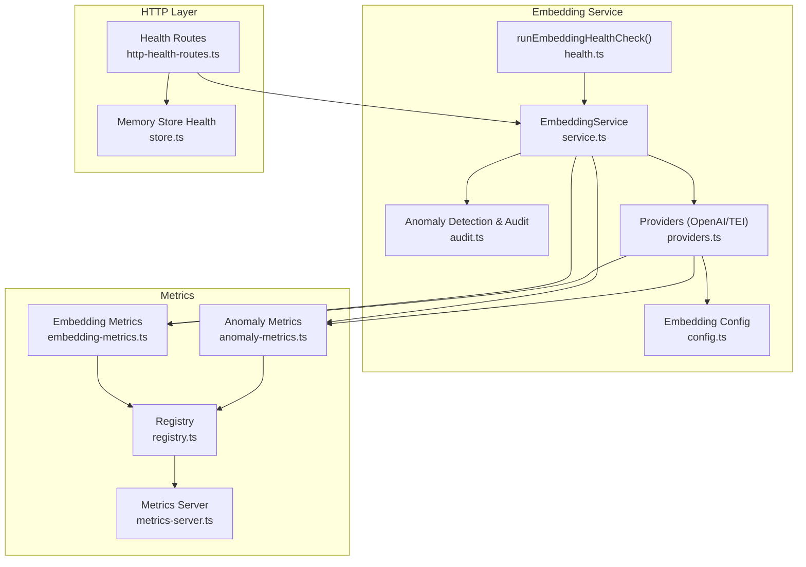
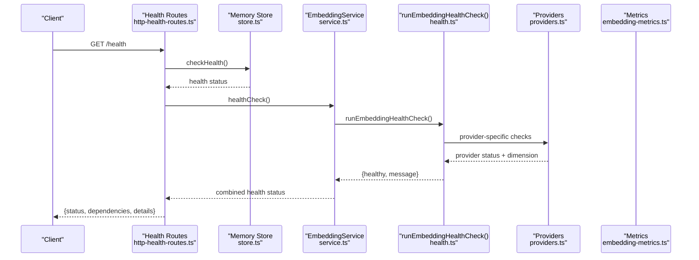
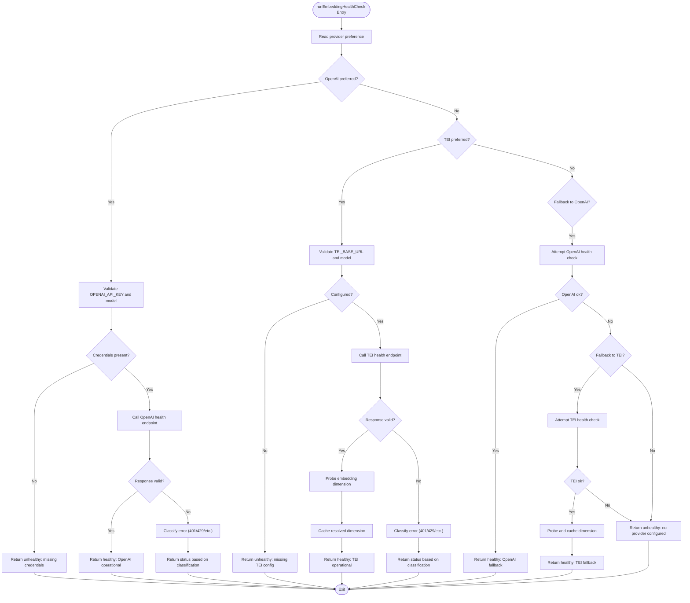
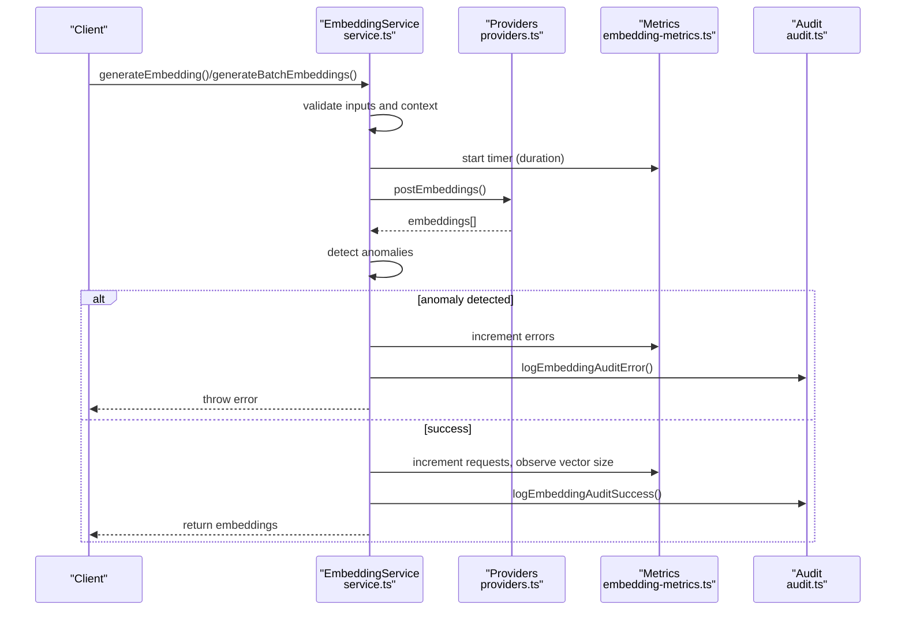
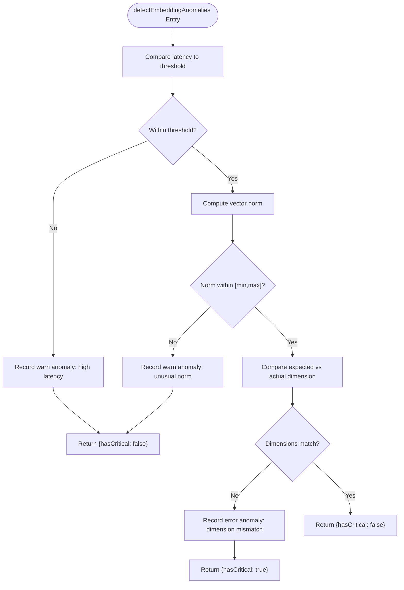
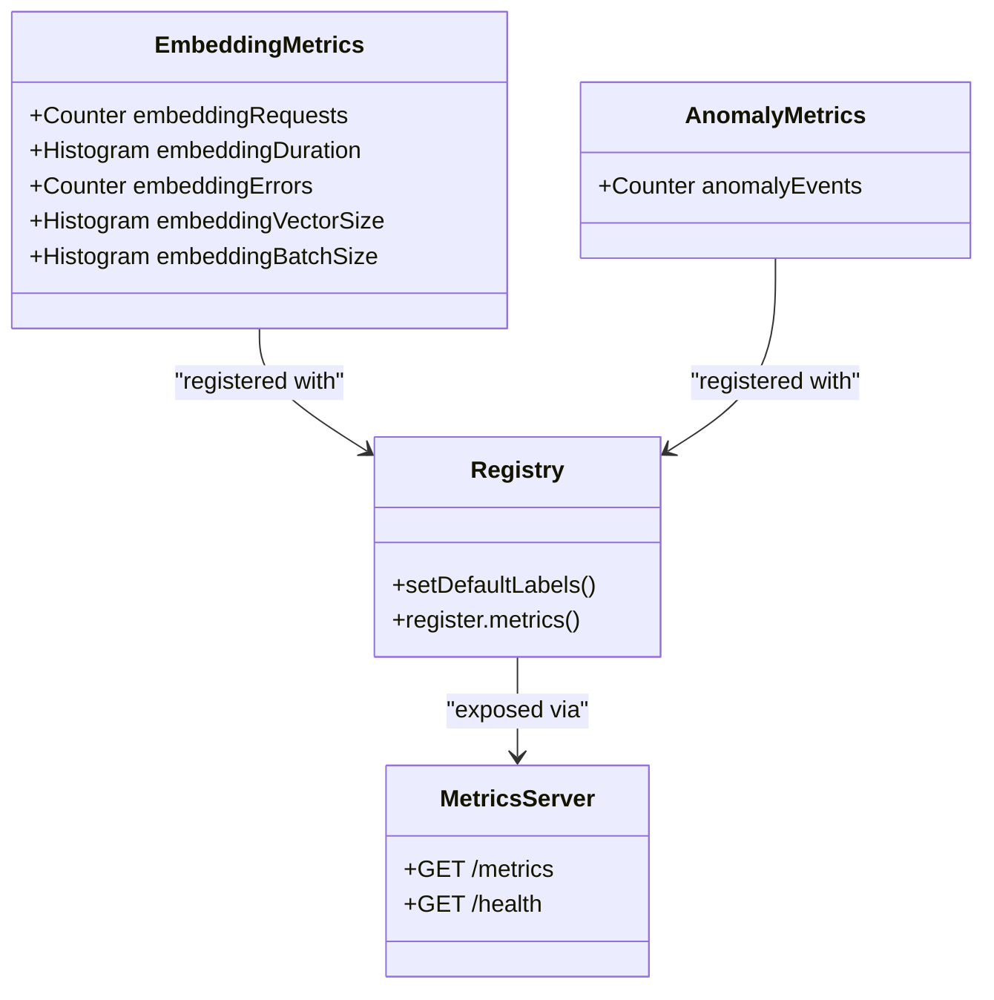
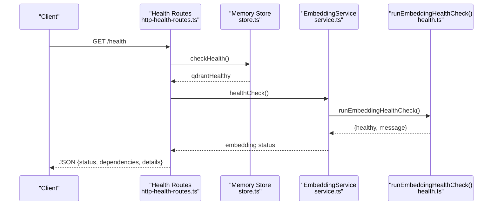
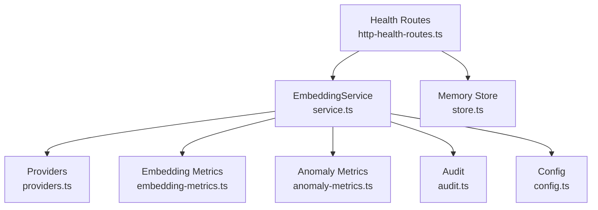

# Embedding Health Monitoring

<cite>
**Referenced Files in This Document**
- [health.ts](file://src/services/embedding/health.ts)
- [service.ts](file://src/services/embedding/service.ts)
- [providers.ts](file://src/services/embedding/providers.ts)
- [config.ts](file://src/services/embedding/config.ts)
- [audit.ts](file://src/services/embedding/audit.ts)
- [embedding-metrics.ts](file://src/services/metrics/embedding-metrics.ts)
- [anomaly-metrics.ts](file://src/services/metrics/anomaly-metrics.ts)
- [registry.ts](file://src/services/metrics/registry.ts)
- [http-health-routes.ts](file://src/http/http-health-routes.ts)
- [metrics-server.ts](file://src/metrics-server.ts)
- [config.ts](file://src/config.ts)
- [store.ts](file://src/services/memory/store.ts)
</cite>

## Table of Contents
1. [Introduction](#introduction)
2. [Project Structure](#project-structure)
3. [Core Components](#core-components)
4. [Architecture Overview](#architecture-overview)
5. [Detailed Component Analysis](#detailed-component-analysis)
6. [Dependency Analysis](#dependency-analysis)
7. [Performance Considerations](#performance-considerations)
8. [Troubleshooting Guide](#troubleshooting-guide)
9. [Conclusion](#conclusion)

## Introduction
This document provides comprehensive guidance for embedding service health monitoring and observability. It focuses on the runEmbeddingHealthCheck() function, its health assessment covering provider connectivity, authentication status, and embedding dimension validation. It also explains integration with Prometheus metrics for embedding requests, duration, errors, and vector size tracking, along with anomaly detection for embedding dimension mismatches and performance issues. The document covers health check scheduling, alerting thresholds, remediation procedures, dashboard integration, metric interpretation, and troubleshooting failed health checks.

## Project Structure
The embedding health monitoring system spans several modules:
- Health assessment and provider selection logic
- Embedding generation with metrics and anomaly detection
- Provider-specific implementations (OpenAI and TEI)
- Metrics exposure via a dedicated Prometheus endpoint
- Health route integration and dependency checks

**Diagram sources**
- [health.ts:16-119](file://src/services/embedding/health.ts#L16-L119)
- [service.ts:38-286](file://src/services/embedding/service.ts#L38-L286)
- [providers.ts:251-280](file://src/services/embedding/providers.ts#L251-L280)
- [config.ts:12-36](file://src/services/embedding/config.ts#L12-L36)
- [audit.ts:94-157](file://src/services/embedding/audit.ts#L94-L157)
- [embedding-metrics.ts:11-47](file://src/services/metrics/embedding-metrics.ts#L11-L47)
- [anomaly-metrics.ts:4-9](file://src/services/metrics/anomaly-metrics.ts#L4-L9)
- [registry.ts:11-22](file://src/services/metrics/registry.ts#L11-L22)
- [metrics-server.ts:19-43](file://src/metrics-server.ts#L19-L43)
- [http-health-routes.ts:13-89](file://src/http/http-health-routes.ts#L13-L89)
- [store.ts:59-101](file://src/services/memory/store.ts#L59-L101)

**Section sources**
- [health.ts:16-119](file://src/services/embedding/health.ts#L16-L119)
- [service.ts:38-286](file://src/services/embedding/service.ts#L38-L286)
- [providers.ts:251-280](file://src/services/embedding/providers.ts#L251-L280)
- [embedding-metrics.ts:11-47](file://src/services/metrics/embedding-metrics.ts#L11-L47)
- [anomaly-metrics.ts:4-9](file://src/services/metrics/anomaly-metrics.ts#L4-L9)
- [registry.ts:11-22](file://src/services/metrics/registry.ts#L11-L22)
- [http-health-routes.ts:13-89](file://src/http/http-health-routes.ts#L13-L89)
- [metrics-server.ts:19-43](file://src/metrics-server.ts#L19-L43)
- [store.ts:59-101](file://src/services/memory/store.ts#L59-L101)

## Core Components
- runEmbeddingHealthCheck(): Comprehensive health assessment for embedding providers, validating configuration, connectivity, authentication, and dimension consistency.
- EmbeddingService: Orchestrates embedding generation, metrics emission, anomaly detection, and audit logging.
- Providers: OpenAI and TEI implementations with retry logic, error handling, and dimension probing.
- Metrics: Prometheus counters and histograms for requests, duration, errors, vector sizes, and batch sizes.
- Anomaly Detection: Heuristic checks for latency, vector norms, and dimension mismatches.
- Health Routes: Aggregates health status across dependencies and embedding provider.

**Section sources**
- [health.ts:16-119](file://src/services/embedding/health.ts#L16-L119)
- [service.ts:38-286](file://src/services/embedding/service.ts#L38-L286)
- [providers.ts:77-280](file://src/services/embedding/providers.ts#L77-L280)
- [embedding-metrics.ts:11-47](file://src/services/metrics/embedding-metrics.ts#L11-L47)
- [anomaly-metrics.ts:4-9](file://src/services/metrics/anomaly-metrics.ts#L4-L9)
- [http-health-routes.ts:13-89](file://src/http/http-health-routes.ts#L13-L89)

## Architecture Overview
The embedding health monitoring architecture integrates health checks, metrics collection, and anomaly detection across provider selection and embedding generation.

**Diagram sources**
- [http-health-routes.ts:15-89](file://src/http/http-health-routes.ts#L15-L89)
- [store.ts:59-101](file://src/services/memory/store.ts#L59-L101)
- [service.ts:254-256](file://src/services/embedding/service.ts#L254-L256)
- [health.ts:16-119](file://src/services/embedding/health.ts#L16-L119)
- [providers.ts:251-280](file://src/services/embedding/providers.ts#L251-L280)

## Detailed Component Analysis

### runEmbeddingHealthCheck() Function
The runEmbeddingHealthCheck() function performs a comprehensive health assessment:
- Provider preference evaluation (OpenAI vs TEI)
- Authentication validation (API keys and model configuration)
- Connectivity verification via provider endpoints
- Dimension probing and caching for consistency
- Graceful handling of rate limits and transient errors

Key behaviors:
- Validates required environment variables for each provider
- Attempts provider-specific health checks with robust error classification
- Falls back to alternative providers when possible
- Probes embedding dimension on successful provider responses
- Returns structured health status and messages for downstream consumption

**Diagram sources**
- [health.ts:16-119](file://src/services/embedding/health.ts#L16-L119)

**Section sources**
- [health.ts:16-119](file://src/services/embedding/health.ts#L16-L119)

### Embedding Generation and Metrics
The EmbeddingService orchestrates embedding generation, metrics emission, and anomaly detection:
- Generates single and batch embeddings with dimension validation
- Emits Prometheus metrics for requests, duration, errors, vector sizes, and batch sizes
- Detects anomalies (latency, vector norms, dimension mismatches)
- Logs audit events for successes and failures

**Diagram sources**
- [service.ts:47-221](file://src/services/embedding/service.ts#L47-L221)
- [providers.ts:251-280](file://src/services/embedding/providers.ts#L251-L280)
- [embedding-metrics.ts:11-47](file://src/services/metrics/embedding-metrics.ts#L11-L47)
- [audit.ts:60-92](file://src/services/embedding/audit.ts#L60-L92)

**Section sources**
- [service.ts:47-221](file://src/services/embedding/service.ts#L47-L221)
- [providers.ts:77-280](file://src/services/embedding/providers.ts#L77-L280)
- [embedding-metrics.ts:11-47](file://src/services/metrics/embedding-metrics.ts#L11-L47)
- [audit.ts:60-157](file://src/services/embedding/audit.ts#L60-L157)

### Anomaly Detection System
The anomaly detection system monitors:
- Latency thresholds (EMBEDDING_LATENCY_WARN_MS)
- Vector norm ranges (EMBEDDING_NORM_MIN, EMBEDDING_NORM_MAX)
- Dimension mismatches between expected and actual embedding dimensions
- Search-related anomalies (zero results, low scores)

**Diagram sources**
- [audit.ts:94-157](file://src/services/embedding/audit.ts#L94-L157)
- [config.ts:75-77](file://src/config.ts#L75-L77)

**Section sources**
- [audit.ts:94-157](file://src/services/embedding/audit.ts#L94-L157)
- [config.ts:75-77](file://src/config.ts#L75-L77)

### Prometheus Metrics Integration
The embedding service emits metrics via Prometheus:
- kairos_embedding_requests_total: Total embedding requests with labels (provider, status, tenant_id)
- kairos_embedding_duration_seconds: Duration histogram with labels (provider, tenant_id)
- kairos_embedding_errors_total: Error counts with labels (provider, status, tenant_id)
- kairos_embedding_vector_size_bytes: Vector size histogram with labels (provider, tenant_id)
- kairos_embedding_batch_size: Batch size histogram with label (tenant_id)
- kairos_anomaly_events_total: Anomaly events with labels (type, severity, tenant_id)

Metrics are registered with default labels (service, kairos_version, instance) and exposed via a dedicated metrics server on a separate port.

**Diagram sources**
- [embedding-metrics.ts:11-47](file://src/services/metrics/embedding-metrics.ts#L11-L47)
- [anomaly-metrics.ts:4-9](file://src/services/metrics/anomaly-metrics.ts#L4-L9)
- [registry.ts:11-22](file://src/services/metrics/registry.ts#L11-L22)
- [metrics-server.ts:19-43](file://src/metrics-server.ts#L19-L43)

**Section sources**
- [embedding-metrics.ts:11-47](file://src/services/metrics/embedding-metrics.ts#L11-L47)
- [anomaly-metrics.ts:4-9](file://src/services/metrics/anomaly-metrics.ts#L4-L9)
- [registry.ts:11-22](file://src/services/metrics/registry.ts#L11-L22)
- [metrics-server.ts:19-43](file://src/metrics-server.ts#L19-L43)

### Health Route Integration
The health route aggregates:
- Qdrant health status
- Redis availability (if configured)
- Embedding provider health (with timeout protection)
- Detailed information for authenticated requests

**Diagram sources**
- [http-health-routes.ts:15-89](file://src/http/http-health-routes.ts#L15-L89)
- [store.ts:59-101](file://src/services/memory/store.ts#L59-L101)
- [service.ts:254-256](file://src/services/embedding/service.ts#L254-L256)
- [health.ts:16-119](file://src/services/embedding/health.ts#L16-L119)

**Section sources**
- [http-health-routes.ts:15-89](file://src/http/http-health-routes.ts#L15-L89)
- [store.ts:59-101](file://src/services/memory/store.ts#L59-L101)
- [service.ts:254-256](file://src/services/embedding/service.ts#L254-L256)
- [health.ts:16-119](file://src/services/embedding/health.ts#L16-L119)

## Dependency Analysis
- EmbeddingService depends on:
  - Providers for OpenAI and TEI
  - Metrics modules for emitting counters and histograms
  - Audit module for anomaly recording and structured logging
  - Configuration for provider preferences and thresholds
- Health routes depend on:
  - EmbeddingService for provider health status
  - Memory store for Qdrant health
  - Redis availability for cache health (conditional)

**Diagram sources**
- [service.ts:15-36](file://src/services/embedding/service.ts#L15-L36)
- [providers.ts:1-12](file://src/services/embedding/providers.ts#L1-L12)
- [embedding-metrics.ts:1-5](file://src/services/metrics/embedding-metrics.ts#L1-L5)
- [anomaly-metrics.ts:1-9](file://src/services/metrics/anomaly-metrics.ts#L1-L9)
- [audit.ts:1-8](file://src/services/embedding/audit.ts#L1-L8)
- [config.ts:1-4](file://src/services/embedding/config.ts#L1-L4)
- [http-health-routes.ts:1-6](file://src/http/http-health-routes.ts#L1-L6)
- [store.ts:1-10](file://src/services/memory/store.ts#L1-L10)

**Section sources**
- [service.ts:15-36](file://src/services/embedding/service.ts#L15-L36)
- [providers.ts:1-12](file://src/services/embedding/providers.ts#L1-L12)
- [embedding-metrics.ts:1-5](file://src/services/metrics/embedding-metrics.ts#L1-L5)
- [anomaly-metrics.ts:1-9](file://src/services/metrics/anomaly-metrics.ts#L1-L9)
- [audit.ts:1-8](file://src/services/embedding/audit.ts#L1-L8)
- [config.ts:1-4](file://src/services/embedding/config.ts#L1-L4)
- [http-health-routes.ts:1-6](file://src/http/http-health-routes.ts#L1-L6)
- [store.ts:1-10](file://src/services/memory/store.ts#L1-L10)

## Performance Considerations
- Embedding dimension probing occurs once and is cached; ensure probeEmbeddingDimension() runs at startup before dependent operations.
- Retry logic for transient network errors and provider HTTP status codes reduces flaky failures.
- Histogram bucketing for duration and vector size enables efficient percentile calculations.
- Dedicated metrics server isolates Prometheus scraping from application traffic.

[No sources needed since this section provides general guidance]

## Troubleshooting Guide

### Health Check Failures
Common causes and remedies:
- Missing credentials: Ensure OPENAI_API_KEY and OPENAI_EMBEDDING_MODEL for OpenAI, or TEI_BASE_URL and TEI_MODEL for TEI.
- Authentication failures: Verify API keys and permissions; check for 401 responses.
- Rate limiting: Expect 429 responses; implement backoff and consider provider fallback.
- Provider connectivity: Confirm endpoint reachability and network configuration.
- Dimension mismatch: Validate model compatibility; re-probe dimension after configuration changes.

**Section sources**
- [health.ts:20-114](file://src/services/embedding/health.ts#L20-L114)
- [providers.ts:116-143](file://src/services/embedding/providers.ts#L116-L143)
- [config.ts:16-31](file://src/services/embedding/config.ts#L16-L31)

### Metric Interpretation
- kairos_embedding_requests_total: Monitor request volume and success/error ratios by provider.
- kairos_embedding_duration_seconds: Track latency distributions; investigate spikes above EMBEDDING_LATENCY_WARN_MS.
- kairos_embedding_errors_total: Identify provider-specific or configuration-related failures.
- kairos_embedding_vector_size_bytes: Validate vector sizes align with model expectations.
- kairos_embedding_batch_size: Observe batching patterns and throughput.

**Section sources**
- [embedding-metrics.ts:11-47](file://src/services/metrics/embedding-metrics.ts#L11-L47)
- [config.ts:75-77](file://src/config.ts#L75-L77)

### Alerting Thresholds
- Latency: Use EMBEDDING_LATENCY_WARN_MS to trigger warnings for slow responses.
- Anomalies: Monitor kairos_anomaly_events_total for unusual norms and dimension mismatches.
- Health: Combine embedding provider health with Qdrant and Redis status for overall service health.

**Section sources**
- [audit.ts:105-154](file://src/services/embedding/audit.ts#L105-L154)
- [http-health-routes.ts:49-54](file://src/http/http-health-routes.ts#L49-L54)

### Remediation Procedures
- Validate environment variables and provider endpoints.
- Re-run dimension probe after configuration changes.
- Inspect audit logs for detailed error contexts.
- Scale or replace failing providers; monitor fallback behavior.
- Review Prometheus alerts and dashboards for sustained issues.

**Section sources**
- [health.ts:16-119](file://src/services/embedding/health.ts#L16-L119)
- [audit.ts:32-58](file://src/services/embedding/audit.ts#L32-L58)
- [http-health-routes.ts:23-44](file://src/http/http-health-routes.ts#L23-L44)

## Conclusion
The embedding health monitoring system provides robust provider health checks, comprehensive metrics emission, and anomaly detection. By leveraging runEmbeddingHealthCheck(), structured metrics, and audit logging, operators can maintain reliable embedding pipelines, quickly diagnose issues, and ensure consistent performance across OpenAI and TEI providers.