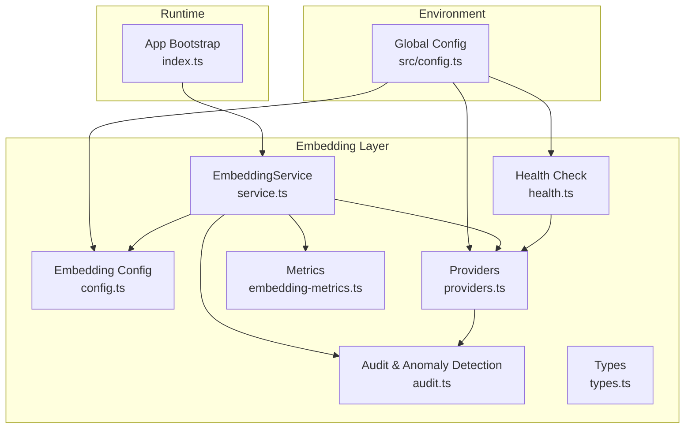
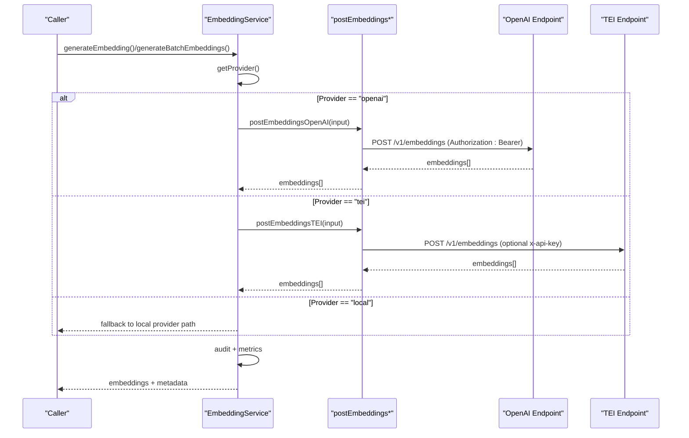
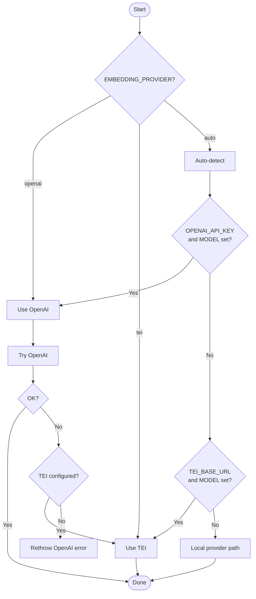
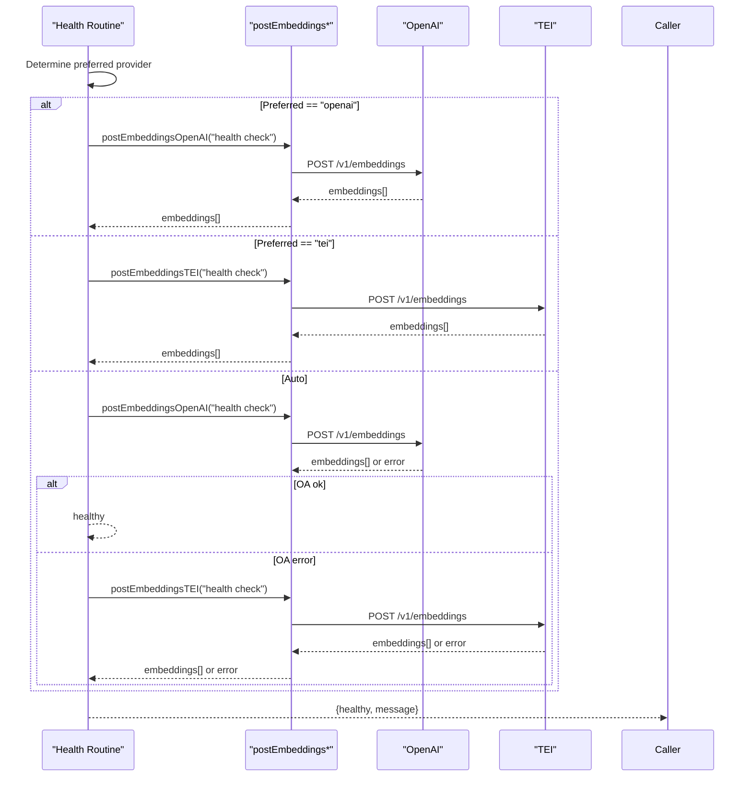
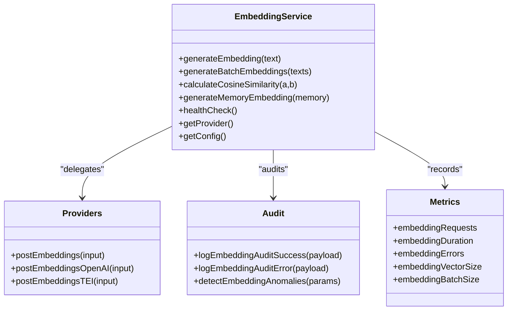
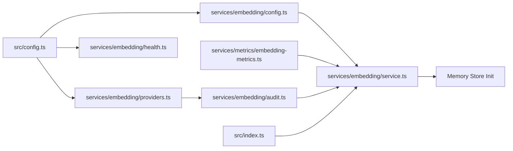

# Embedding Provider Abstraction

<cite>
**Referenced Files in This Document**
- [providers.ts](file://src/services/embedding/providers.ts)
- [config.ts](file://src/services/embedding/config.ts)
- [service.ts](file://src/services/embedding/service.ts)
- [health.ts](file://src/services/embedding/health.ts)
- [audit.ts](file://src/services/embedding/audit.ts)
- [types.ts](file://src/services/embedding/types.ts)
- [bm25-tokenizer.ts](file://src/services/embedding/bm25-tokenizer.ts)
- [embedding-metrics.ts](file://src/services/metrics/embedding-metrics.ts)
- [config.ts](file://src/config.ts)
- [index.ts](file://src/index.ts)
- [README.md](file://README.md)
</cite>

## Table of Contents
1. [Introduction](#introduction)
2. [Project Structure](#project-structure)
3. [Core Components](#core-components)
4. [Architecture Overview](#architecture-overview)
5. [Detailed Component Analysis](#detailed-component-analysis)
6. [Dependency Analysis](#dependency-analysis)
7. [Performance Considerations](#performance-considerations)
8. [Troubleshooting Guide](#troubleshooting-guide)
9. [Conclusion](#conclusion)
10. [Appendices](#appendices)

## Introduction
This document explains the embedding provider abstraction layer that enables pluggable embedding generation across OpenAI, Text Embeddings Inference (TEI), and a local provider path. It covers provider selection logic, environment-driven detection, configuration requirements, authentication, endpoint configuration, health checking, rate limiting, fallback behavior, and the impact of provider choice on embedding dimensions and performance. It also documents cost considerations and operational best practices.

## Project Structure
The embedding subsystem is organized around a small set of focused modules:
- Provider implementations and selection logic
- Configuration and dimension caching
- Service orchestration and metrics
- Health checking and auditing
- Supporting utilities for sparse tokenization and metrics

**Diagram sources**
- [service.ts:38-284](file://src/services/embedding/service.ts#L38-L284)
- [config.ts:1-40](file://src/services/embedding/config.ts#L1-L40)
- [providers.ts:251-278](file://src/services/embedding/providers.ts#L251-L278)
- [health.ts:16-119](file://src/services/embedding/health.ts#L16-L119)
- [audit.ts:94-157](file://src/services/embedding/audit.ts#L94-L157)
- [embedding-metrics.ts:11-47](file://src/services/metrics/embedding-metrics.ts#L11-L47)
- [config.ts:67-74](file://src/config.ts#L67-L74)
- [index.ts:89-90](file://src/index.ts#L89-L90)

**Section sources**
- [service.ts:1-37](file://src/services/embedding/service.ts#L1-L37)
- [config.ts:1-40](file://src/services/embedding/config.ts#L1-L40)
- [providers.ts:251-278](file://src/services/embedding/providers.ts#L251-L278)
- [health.ts:16-119](file://src/services/embedding/health.ts#L16-L119)
- [audit.ts:94-157](file://src/services/embedding/audit.ts#L94-L157)
- [embedding-metrics.ts:11-47](file://src/services/metrics/embedding-metrics.ts#L11-L47)
- [config.ts:67-74](file://src/config.ts#L67-L74)
- [index.ts:89-90](file://src/index.ts#L89-L90)

## Core Components
- Provider selection and dispatch:
  - Explicit preference via EMBEDDING_PROVIDER ('auto' | 'openai' | 'tei')
  - Auto-detection: prefer OpenAI if both OPENAI_API_KEY and OPENAI_EMBEDDING_MODEL are set; otherwise TEI if TEI_BASE_URL and TEI_MODEL are set; otherwise local provider path
  - Fallback: when auto-selected OpenAI fails, attempt TEI if configured
- Provider implementations:
  - OpenAI: sends Authorization header with Bearer token; endpoint constructed from OPENAI_API_URL and model from OPENAI_EMBEDDING_MODEL
  - TEI: sends Content-Type JSON; optional x-api-key header if TEI_API_KEY is set; endpoint constructed from TEI_BASE_URL or TEI_EMBEDDING_ENDPOINT
- Dimension resolution and validation:
  - First successful embedding determines output dimension; subsequent calls assert consistent dimension
  - Startup probe ensures dimension is resolved before memory store initialization
- Health checking:
  - Dedicated health routine validates provider readiness and reports status and messages
- Auditing and anomaly detection:
  - Logs structured audit events for successes and errors
  - Detects anomalies such as high latency, unusual vector norms, and dimension mismatches
- Metrics:
  - Tracks request counts, durations, error counts, vector sizes, and batch sizes

**Section sources**
- [providers.ts:251-278](file://src/services/embedding/providers.ts#L251-L278)
- [service.ts:258-283](file://src/services/embedding/service.ts#L258-L283)
- [config.ts:12-36](file://src/services/embedding/config.ts#L12-L36)
- [health.ts:16-119](file://src/services/embedding/health.ts#L16-L119)
- [audit.ts:94-157](file://src/services/embedding/audit.ts#L94-L157)
- [embedding-metrics.ts:11-47](file://src/services/metrics/embedding-metrics.ts#L11-L47)

## Architecture Overview
The embedding subsystem composes a provider-agnostic service that delegates to provider-specific implementations. The service orchestrates configuration, health checks, auditing, and metrics, while providers handle transport and authentication.

**Diagram sources**
- [service.ts:47-221](file://src/services/embedding/service.ts#L47-L221)
- [providers.ts:77-175](file://src/services/embedding/providers.ts#L77-L175)
- [providers.ts:177-249](file://src/services/embedding/providers.ts#L177-L249)
- [config.ts:5](file://src/services/embedding/config.ts#L5)
- [config.ts:8-10](file://src/services/embedding/config.ts#L8-L10)

## Detailed Component Analysis

### Provider Selection Logic
- Preference:
  - EMBEDDING_PROVIDER='openai' forces OpenAI
  - EMBEDDING_PROVIDER='tei' forces TEI
  - EMBEDDING_PROVIDER='auto' enables auto-detection
- Auto-detection:
  - If OPENAI_API_KEY and OPENAI_EMBEDDING_MODEL are set, use OpenAI
  - Else if TEI_BASE_URL and TEI_MODEL are set, use TEI
  - Else fallback to local provider path
- Fallback behavior:
  - When auto-selected OpenAI fails, attempt TEI if configured; otherwise rethrow original error

**Diagram sources**
- [providers.ts:251-278](file://src/services/embedding/providers.ts#L251-L278)
- [service.ts:258-265](file://src/services/embedding/service.ts#L258-L265)

**Section sources**
- [providers.ts:251-278](file://src/services/embedding/providers.ts#L251-L278)
- [service.ts:258-265](file://src/services/embedding/service.ts#L258-L265)

### Provider-Specific Configuration and Authentication
- OpenAI
  - Required: OPENAI_API_KEY, OPENAI_EMBEDDING_MODEL
  - Endpoint: OPENAI_API_URL + '/v1/embeddings'
  - Authentication: Authorization: Bearer <OPENAI_API_KEY>
  - Behavior: Retries on transient network errors and specific HTTP statuses; parses JSON; audits and logs errors; records dimension on first successful call
- TEI
  - Required: TEI_BASE_URL, TEI_MODEL
  - Optional: TEI_API_KEY (x-api-key header)
  - Endpoint: TEI_BASE_URL or TEI_EMBEDDING_ENDPOINT (constructed similarly to OpenAI)
  - Behavior: Robust response shape extraction across different server variants; retries on transient network errors; audits and logs errors; records dimension on first successful call
- Local Provider Path
  - Used when neither OpenAI nor TEI is configured; the service returns a local provider designation for routing

**Section sources**
- [config.ts:5](file://src/services/embedding/config.ts#L5)
- [config.ts:8-10](file://src/services/embedding/config.ts#L8-L10)
- [providers.ts:77-175](file://src/services/embedding/providers.ts#L77-L175)
- [providers.ts:177-249](file://src/services/embedding/providers.ts#L177-L249)
- [config.ts:67-74](file://src/config.ts#L67-L74)

### Endpoint Configuration and Environment Variables
- OpenAI
  - OPENAI_API_URL: base URL for OpenAI API (no trailing slash)
  - OPENAI_API_KEY: secret key
  - OPENAI_EMBEDDING_MODEL: model identifier
- TEI
  - TEI_BASE_URL: base URL for TEI server
  - TEI_MODEL: model identifier
  - TEI_API_KEY: optional API key for TEI
- Provider Preference
  - EMBEDDING_PROVIDER: 'auto' | 'openai' | 'tei'

**Section sources**
- [config.ts:67-74](file://src/config.ts#L67-L74)
- [config.ts:71](file://src/config.ts#L71)
- [config.ts:5](file://src/services/embedding/config.ts#L5)
- [config.ts:8-10](file://src/services/embedding/config.ts#L8-L10)

### Health Checking
- Dedicated health routine evaluates provider readiness:
  - If EMBEDDING_PROVIDER is 'openai' or 'tei', validates that required variables are set and performs a small embedding request
  - If 'auto', tries OpenAI first; on failure, attempts TEI if configured
  - Returns structured status and message indicating operational state and any throttling (rate limit) conditions

**Diagram sources**
- [health.ts:16-119](file://src/services/embedding/health.ts#L16-L119)
- [providers.ts:77-175](file://src/services/embedding/providers.ts#L77-L175)
- [providers.ts:177-249](file://src/services/embedding/providers.ts#L177-L249)

**Section sources**
- [health.ts:16-119](file://src/services/embedding/health.ts#L16-L119)

### Retry and Backoff Behavior
- Network-level retries:
  - Retries on transient conditions such as fetch failures, timeouts, connection resets, DNS failures
  - Exponential backoff with bounded jitter across configured attempts
- Provider-level retries:
  - OpenAI: retries on HTTP 429, 502, 503, 504; parses JSON and handles non-JSON bodies; audits and logs errors
- Purpose:
  - Improve resilience against temporary network or upstream issues

**Section sources**
- [providers.ts:7-47](file://src/services/embedding/providers.ts#L7-L47)
- [providers.ts:26-29](file://src/services/embedding/providers.ts#L26-L29)
- [providers.ts:92-175](file://src/services/embedding/providers.ts#L92-L175)

### Audit, Anomaly Detection, and Metrics
- Audit logging:
  - Structured events capture provider, model, input counts, character lengths, output dimensions, latency, and error messages
- Anomaly detection:
  - Flags high latency, unusual vector norms, and dimension mismatches
- Metrics:
  - Counters and histograms track embedding requests, durations, errors, vector sizes, and batch sizes

**Diagram sources**
- [service.ts:38-284](file://src/services/embedding/service.ts#L38-L284)
- [providers.ts:251-278](file://src/services/embedding/providers.ts#L251-L278)
- [audit.ts:60-92](file://src/services/embedding/audit.ts#L60-L92)
- [embedding-metrics.ts:11-47](file://src/services/metrics/embedding-metrics.ts#L11-L47)

**Section sources**
- [audit.ts:60-92](file://src/services/embedding/audit.ts#L60-L92)
- [audit.ts:94-157](file://src/services/embedding/audit.ts#L94-L157)
- [embedding-metrics.ts:11-47](file://src/services/metrics/embedding-metrics.ts#L11-L47)

### Impact on Dimensions and Performance
- Dimension resolution:
  - First successful embedding sets the resolved dimension; subsequent calls validate consistency
  - Startup probe ensures dimension is known before memory store initialization
- Performance:
  - Vector size tracked in bytes (float32 assumption)
  - Batch size histogram supports throughput analysis
  - Latency histogram bucketed for performance profiling

**Section sources**
- [config.ts:12-36](file://src/services/embedding/config.ts#L12-L36)
- [index.ts:89-90](file://src/index.ts#L89-L90)
- [embedding-metrics.ts:33-47](file://src/services/metrics/embedding-metrics.ts#L33-L47)

### Rate Limiting Considerations
- OpenAI:
  - HTTP 429 handled as retriable condition; service logs and surfaces rate limit errors
- TEI:
  - HTTP 429 treated as retriable; service logs and surfaces rate limit errors
- Health check:
  - Distinguishes rate-limited vs. unreachable states

**Section sources**
- [providers.ts:26-29](file://src/services/embedding/providers.ts#L26-L29)
- [providers.ts:133-142](file://src/services/embedding/providers.ts#L133-L142)
- [providers.ts:212-215](file://src/services/embedding/providers.ts#L212-L215)
- [health.ts:29-46](file://src/services/embedding/health.ts#L29-L46)

### Cost Implications
- OpenAI:
  - Costs depend on selected model and consumed tokens; cost estimation placeholder in service
- TEI:
  - Self-hosted; costs primarily relate to compute and infrastructure
- Recommendation:
  - Monitor token usage and model selection; consider cost-aware model choices and batching strategies

**Section sources**
- [service.ts:249-252](file://src/services/embedding/service.ts#L249-L252)

### Provider Switching Scenarios and Examples
- Switch from OpenAI to TEI:
  - Set EMBEDDING_PROVIDER='tei' or unset OPENAI_API_KEY and OPENAI_EMBEDDING_MODEL; ensure TEI_BASE_URL and TEI_MODEL are set
- Auto-switch on failure:
  - With EMBEDDING_PROVIDER='auto', if OpenAI fails, the system attempts TEI if configured
- Local fallback:
  - If neither provider is configured, the service returns a local provider designation for routing

**Section sources**
- [providers.ts:251-278](file://src/services/embedding/providers.ts#L251-L278)
- [service.ts:258-265](file://src/services/embedding/service.ts#L258-L265)

### Sparse Tokenization (BM25-style)
- Utility for converting text to sparse vectors suitable for BM25-like retrieval
- Produces indices and values for Qdrant sparse vector search

**Section sources**
- [bm25-tokenizer.ts:1-57](file://src/services/embedding/bm25-tokenizer.ts#L1-L57)

## Dependency Analysis
The embedding subsystem exhibits clear separation of concerns:
- Global configuration supplies environment variables to providers and config
- Service depends on providers, config, metrics, and audit
- Health routines depend on providers and environment
- Index coordinates startup probe and memory store initialization

**Diagram sources**
- [config.ts:67-74](file://src/config.ts#L67-L74)
- [config.ts:5](file://src/services/embedding/config.ts#L5)
- [providers.ts:251-278](file://src/services/embedding/providers.ts#L251-L278)
- [health.ts:16-119](file://src/services/embedding/health.ts#L16-L119)
- [audit.ts:60-92](file://src/services/embedding/audit.ts#L60-L92)
- [embedding-metrics.ts:11-47](file://src/services/metrics/embedding-metrics.ts#L11-L47)
- [index.ts:89-90](file://src/index.ts#L89-L90)

**Section sources**
- [config.ts:67-74](file://src/config.ts#L67-L74)
- [config.ts:5](file://src/services/embedding/config.ts#L5)
- [providers.ts:251-278](file://src/services/embedding/providers.ts#L251-L278)
- [health.ts:16-119](file://src/services/embedding/health.ts#L16-L119)
- [audit.ts:60-92](file://src/services/embedding/audit.ts#L60-L92)
- [embedding-metrics.ts:11-47](file://src/services/metrics/embedding-metrics.ts#L11-L47)
- [index.ts:89-90](file://src/index.ts#L89-L90)

## Performance Considerations
- Dimension consistency:
  - Ensure startup probe resolves dimension before memory store initialization to avoid runtime errors
- Batch processing:
  - Use batch APIs to reduce overhead; monitor batch size distribution
- Vector size:
  - Track vector sizes to estimate storage and network bandwidth needs
- Latency:
  - Monitor embedding duration histograms to identify slow providers or models
- Resilience:
  - Rely on built-in retries for transient failures; consider external retry/backoff policies for downstream consumers

[No sources needed since this section provides general guidance]

## Troubleshooting Guide
- No provider configured:
  - Ensure OPENAI_API_KEY + OPENAI_EMBEDDING_MODEL or TEI_BASE_URL + TEI_MODEL is set
- Authentication failures:
  - OpenAI: 401 indicates incorrect or missing OPENAI_API_KEY
  - TEI: 401 indicates missing or incorrect TEI_API_KEY
- Rate limiting:
  - Both providers return 429; health check distinguishes throttled vs. unreachable
- Unexpected response shapes:
  - Providers attempt to normalize various server response formats; failures indicate misconfiguration or incompatible server
- Dimension mismatch:
  - After startup probe, subsequent calls validate dimension; mismatch indicates provider change or model switch without re-probing

**Section sources**
- [providers.ts:78-80](file://src/services/embedding/providers.ts#L78-L80)
- [providers.ts:129-142](file://src/services/embedding/providers.ts#L129-L142)
- [providers.ts:209-215](file://src/services/embedding/providers.ts#L209-L215)
- [config.ts:24-31](file://src/services/embedding/config.ts#L24-L31)
- [health.ts:29-46](file://src/services/embedding/health.ts#L29-L46)

## Conclusion
The embedding provider abstraction cleanly separates provider selection, transport, and authentication from service orchestration, auditing, and metrics. It supports robust auto-detection, graceful fallback, and strong observability. Correctly configuring environment variables and leveraging health checks and anomaly detection ensures reliable operation across OpenAI and TEI deployments.

[No sources needed since this section summarizes without analyzing specific files]

## Appendices

### Environment Variables Reference
- OPENAI_API_KEY: OpenAI secret key
- OPENAI_API_URL: Base URL for OpenAI API (no trailing slash)
- OPENAI_EMBEDDING_MODEL: Model identifier for embeddings
- TEI_BASE_URL: Base URL for TEI server
- TEI_MODEL: Model identifier for TEI
- TEI_API_KEY: Optional API key for TEI
- EMBEDDING_PROVIDER: 'auto' | 'openai' | 'tei'
- EMBEDDING_LATENCY_WARN_MS: Threshold for embedding latency warnings
- EMBEDDING_NORM_MIN/MAX: Expected range for vector norms
- SEARCH_SCORE_WARN_THRESHOLD: Threshold for low search scores

**Section sources**
- [config.ts:67-74](file://src/config.ts#L67-L74)
- [config.ts:75-83](file://src/config.ts#L75-L83)

### Startup and Initialization
- The application probes embedding dimension at startup and initializes the memory store afterward to ensure consistent vector dimensions.

**Section sources**
- [index.ts:89-90](file://src/index.ts#L89-L90)

### Provider Configuration Examples
- OpenAI:
  - Set OPENAI_API_KEY and OPENAI_EMBEDDING_MODEL; optionally OPENAI_API_URL for Azure or custom endpoints
- TEI:
  - Set TEI_BASE_URL and TEI_MODEL; optionally TEI_API_KEY for protected endpoints
- Auto:
  - Leave EMBEDDING_PROVIDER unset or set to 'auto'; the system prefers OpenAI if available, otherwise TEI

**Section sources**
- [config.ts:67-74](file://src/config.ts#L67-L74)
- [config.ts:71](file://src/config.ts#L71)
- [providers.ts:251-278](file://src/services/embedding/providers.ts#L251-L278)