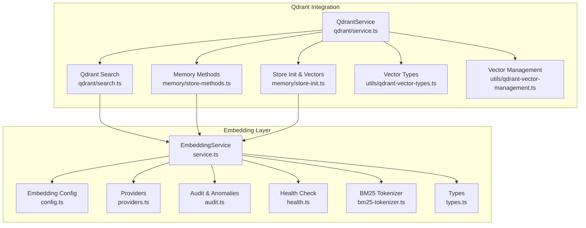
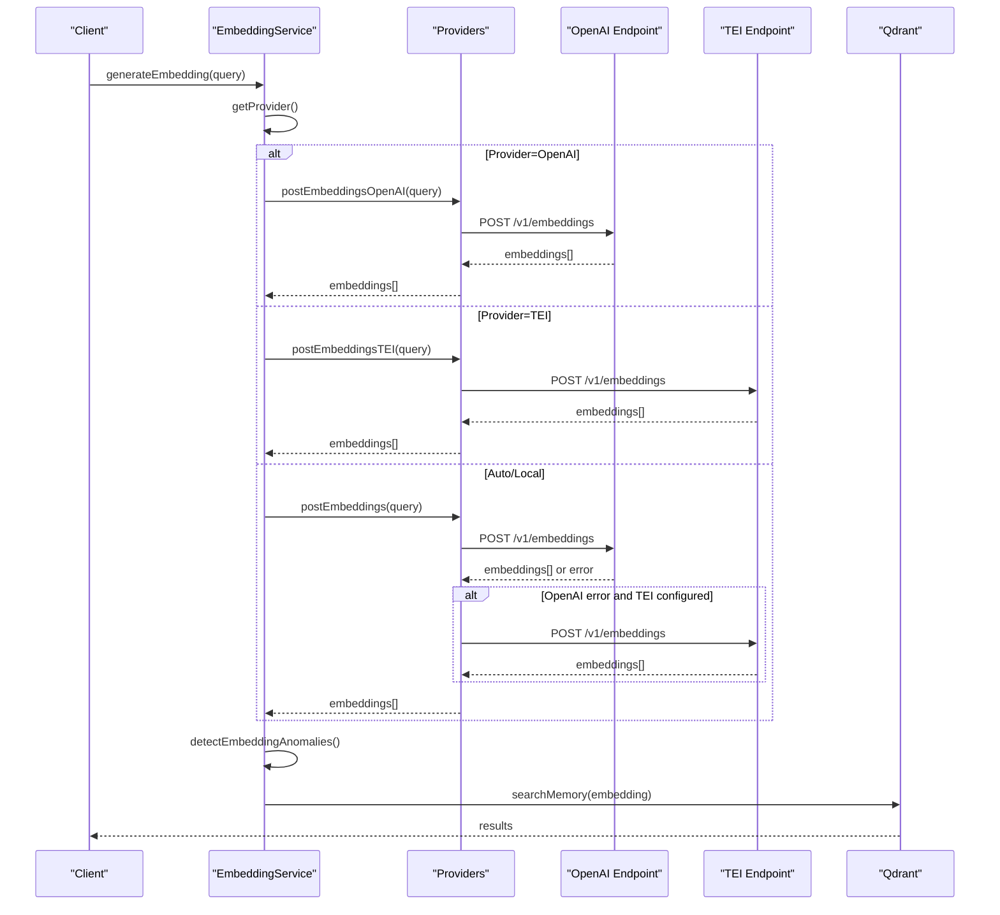
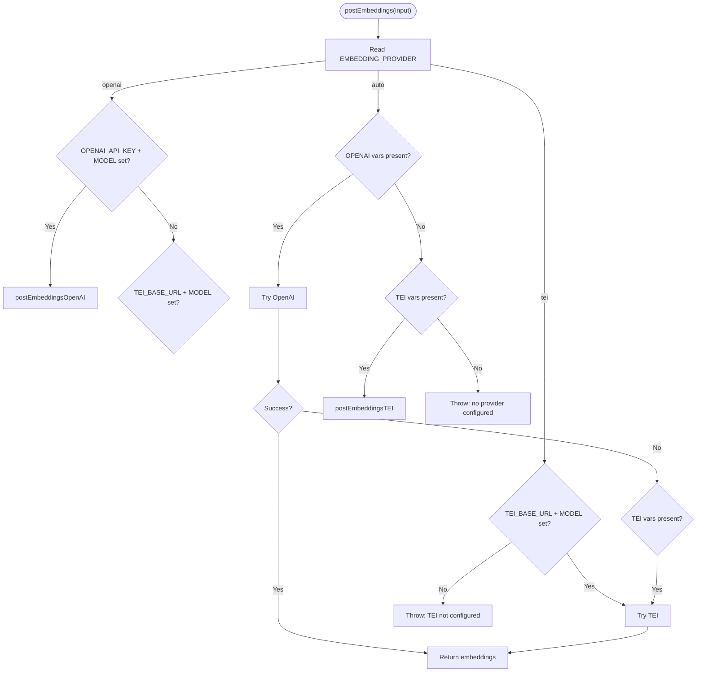
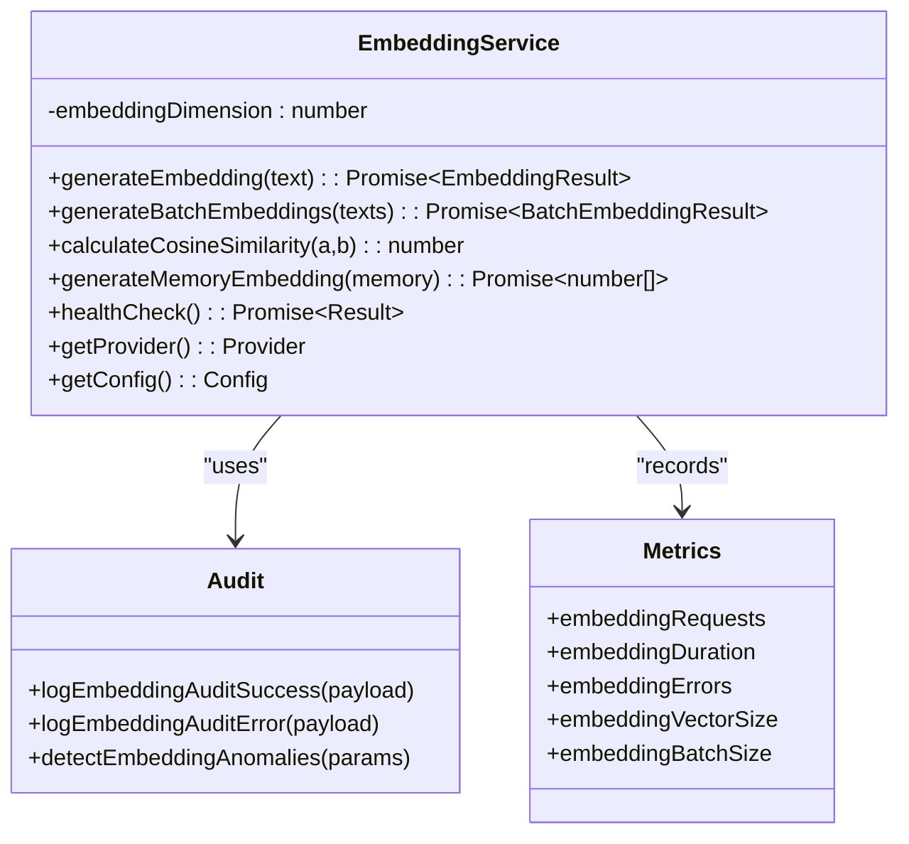
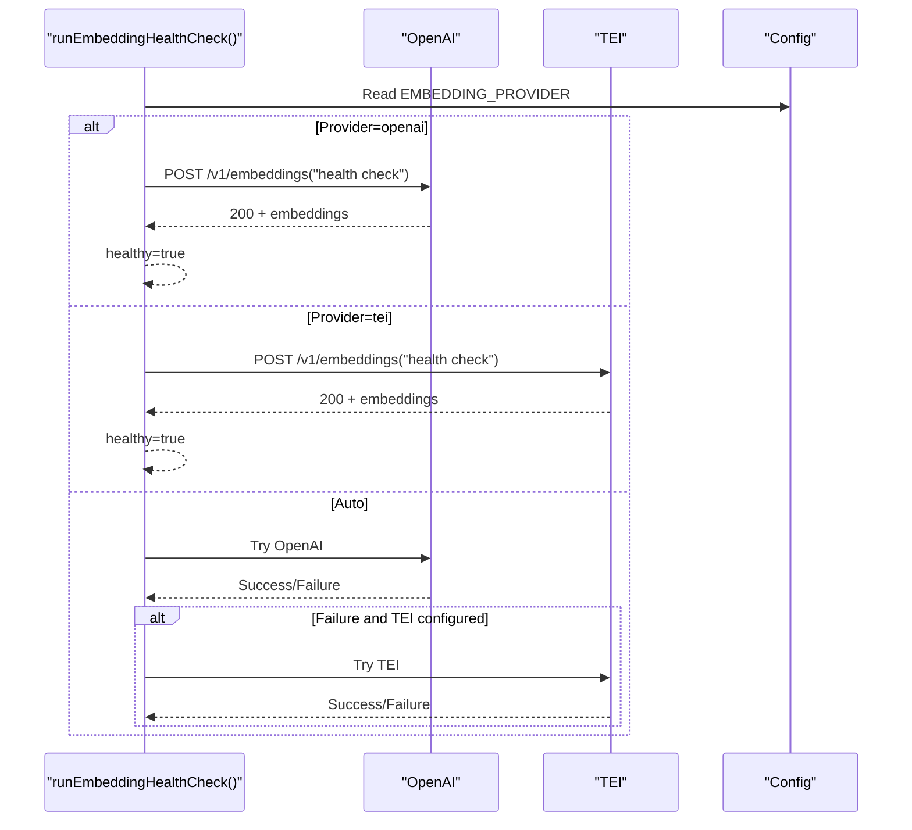
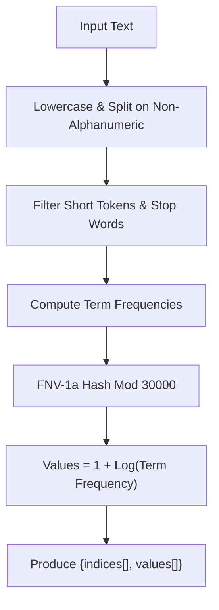
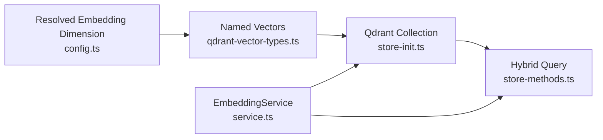
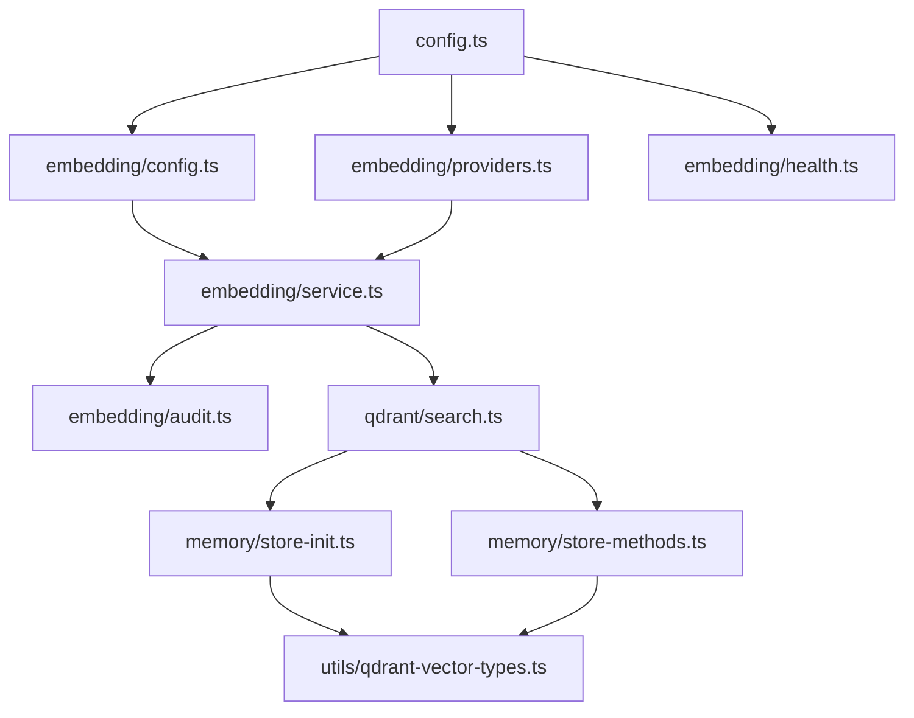

# Embedding Services Architecture

<cite>
**Referenced Files in This Document**
- [service.ts](file://src/services/embedding/service.ts)
- [providers.ts](file://src/services/embedding/providers.ts)
- [config.ts](file://src/services/embedding/config.ts)
- [types.ts](file://src/services/embedding/types.ts)
- [health.ts](file://src/services/embedding/health.ts)
- [bm25-tokenizer.ts](file://src/services/embedding/bm25-tokenizer.ts)
- [audit.ts](file://src/services/embedding/audit.ts)
- [config.ts](file://src/config.ts)
- [service.ts](file://src/services/qdrant/service.ts)
- [search.ts](file://src/services/qdrant/search.ts)
- [store-methods.ts](file://src/services/memory/store-methods.ts)
- [store-init.ts](file://src/services/memory/store-init.ts)
- [qdrant-vector-types.ts](file://src/utils/qdrant-vector-types.ts)
- [qdrant-vector-management.ts](file://src/utils/qdrant-vector-management.ts)
- [http-health-routes.ts](file://src/http/http-health-routes.ts)
</cite>

## Table of Contents
1. [Introduction](#introduction)
2. [Project Structure](#project-structure)
3. [Core Components](#core-components)
4. [Architecture Overview](#architecture-overview)
5. [Detailed Component Analysis](#detailed-component-analysis)
6. [Dependency Analysis](#dependency-analysis)
7. [Performance Considerations](#performance-considerations)
8. [Troubleshooting Guide](#troubleshooting-guide)
9. [Conclusion](#conclusion)

## Introduction
This document describes the KAIROS MCP embedding services layer, focusing on the provider abstraction supporting multiple backends (OpenAI, TEI), initialization and provider selection logic, health monitoring, hybrid search with BM25 tokenization, audit trails, configuration management, error handling and fallbacks, caching and batching, and the relationship between embedding models and Qdrant vector storage.

## Project Structure
The embedding subsystem is organized around a cohesive set of modules:
- Provider abstraction and selection logic
- Health checks and anomaly detection
- BM25 tokenizer for sparse vectors
- Audit logging and metrics
- Integration with Qdrant vector storage and hybrid search

**Diagram sources**
- [service.ts:38-284](file://src/services/embedding/service.ts#L38-L284)
- [providers.ts:251-278](file://src/services/embedding/providers.ts#L251-L278)
- [config.ts:12-36](file://src/services/embedding/config.ts#L12-L36)
- [audit.ts:60-157](file://src/services/embedding/audit.ts#L60-L157)
- [health.ts:16-119](file://src/services/embedding/health.ts#L16-L119)
- [bm25-tokenizer.ts:37-56](file://src/services/embedding/bm25-tokenizer.ts#L37-L56)
- [types.ts:1-17](file://src/services/embedding/types.ts#L1-L17)
- [service.ts:16-152](file://src/services/qdrant/service.ts#L16-L152)
- [search.ts:11-82](file://src/services/qdrant/search.ts#L11-L82)
- [store-methods.ts:150-231](file://src/services/memory/store-methods.ts#L150-L231)
- [store-init.ts:1-28](file://src/services/memory/store-init.ts#L1-L28)
- [qdrant-vector-types.ts:8-35](file://src/utils/qdrant-vector-types.ts#L8-L35)
- [qdrant-vector-management.ts:126-202](file://src/utils/qdrant-vector-management.ts#L126-L202)

**Section sources**
- [service.ts:1-293](file://src/services/embedding/service.ts#L1-L293)
- [providers.ts:1-280](file://src/services/embedding/providers.ts#L1-L280)
- [config.ts:1-40](file://src/services/embedding/config.ts#L1-L40)
- [audit.ts:1-197](file://src/services/embedding/audit.ts#L1-L197)
- [health.ts:1-121](file://src/services/embedding/health.ts#L1-L121)
- [bm25-tokenizer.ts:1-57](file://src/services/embedding/bm25-tokenizer.ts#L1-L57)
- [types.ts:1-17](file://src/services/embedding/types.ts#L1-L17)
- [service.ts:1-152](file://src/services/qdrant/service.ts#L1-L152)
- [search.ts:1-82](file://src/services/qdrant/search.ts#L1-L82)
- [store-methods.ts:150-231](file://src/services/memory/store-methods.ts#L150-L231)
- [store-init.ts:1-28](file://src/services/memory/store-init.ts#L1-L28)
- [qdrant-vector-types.ts:1-57](file://src/utils/qdrant-vector-types.ts#L1-L57)
- [qdrant-vector-management.ts:1-301](file://src/utils/qdrant-vector-management.ts#L1-L301)

## Core Components
- EmbeddingService: orchestrates embedding generation, batch processing, cosine similarity, memory embedding composition, health checks, provider selection, and configuration exposure. It integrates metrics, audit logs, and anomaly detection.
- Providers: encapsulate OpenAI and TEI embedding endpoints, including retry logic, transient error handling, and response normalization.
- Config: manages runtime dimension resolution and endpoint construction for embedding providers.
- Health: performs provider-specific health checks and reports operational status.
- Audit: records embedding operations and detects anomalies (latency, vector norms, dimension mismatches).
- BM25 Tokenizer: converts text to sparse vectors for hybrid search with Qdrant.
- Qdrant Integration: initializes collections with named vectors, executes hybrid queries combining dense and sparse signals, and manages vector migrations.

**Section sources**
- [service.ts:38-284](file://src/services/embedding/service.ts#L38-L284)
- [providers.ts:77-278](file://src/services/embedding/providers.ts#L77-L278)
- [config.ts:12-36](file://src/services/embedding/config.ts#L12-L36)
- [health.ts:16-119](file://src/services/embedding/health.ts#L16-L119)
- [audit.ts:60-157](file://src/services/embedding/audit.ts#L60-L157)
- [bm25-tokenizer.ts:37-56](file://src/services/embedding/bm25-tokenizer.ts#L37-L56)
- [service.ts:16-152](file://src/services/qdrant/service.ts#L16-L152)

## Architecture Overview
The embedding layer follows a provider abstraction pattern with explicit selection logic and robust fallbacks. Embeddings are consumed by Qdrant for hybrid search, leveraging both dense vector similarity and BM25 sparse vector matching.

**Diagram sources**
- [service.ts:47-127](file://src/services/embedding/service.ts#L47-L127)
- [providers.ts:251-278](file://src/services/embedding/providers.ts#L251-L278)
- [providers.ts:77-175](file://src/services/embedding/providers.ts#L77-L175)
- [providers.ts:177-249](file://src/services/embedding/providers.ts#L177-L249)
- [search.ts:11-82](file://src/services/qdrant/search.ts#L11-L82)

## Detailed Component Analysis

### Provider Abstraction and Selection
- Explicit preference via environment variable selects OpenAI or TEI.
- Auto-detection prefers OpenAI when credentials are present; falls back to TEI if configured.
- Local fallback is available when neither provider is configured.
- Both providers implement retry logic for transient network errors and specific HTTP statuses.

**Diagram sources**
- [providers.ts:251-278](file://src/services/embedding/providers.ts#L251-L278)
- [service.ts:258-265](file://src/services/embedding/service.ts#L258-L265)

**Section sources**
- [service.ts:258-265](file://src/services/embedding/service.ts#L258-L265)
- [providers.ts:251-278](file://src/services/embedding/providers.ts#L251-L278)

### EmbeddingService: Initialization, Metrics, and Audit
- Dimension probing ensures consistent vector sizes across requests.
- Metrics capture request counts, durations, errors, vector sizes, and batch sizes.
- Audit logs success and error events with tenant/request identifiers.
- Anomaly detection flags high latency, unusual vector norms, and dimension mismatches.

**Diagram sources**
- [service.ts:38-284](file://src/services/embedding/service.ts#L38-L284)
- [audit.ts:60-157](file://src/services/embedding/audit.ts#L60-L157)

**Section sources**
- [service.ts:38-127](file://src/services/embedding/service.ts#L38-L127)
- [audit.ts:60-157](file://src/services/embedding/audit.ts#L60-L157)

### Health Monitoring Mechanisms
- Provider-specific health checks validate endpoint reachability and basic response shape.
- OpenAI and TEI health checks handle authentication failures, rate limits, and generic errors.
- The HTTP health route aggregates Qdrant, Redis/cache, and embedding provider health.

**Diagram sources**
- [health.ts:16-119](file://src/services/embedding/health.ts#L16-L119)
- [http-health-routes.ts:46-78](file://src/http/http-health-routes.ts#L46-L78)

**Section sources**
- [health.ts:16-119](file://src/services/embedding/health.ts#L16-L119)
- [http-health-routes.ts:46-78](file://src/http/http-health-routes.ts#L46-L78)

### BM25 Tokenizer Integration for Hybrid Search
- Tokenizer converts text to sparse vectors with indices and values suitable for Qdrant sparse vector search.
- Stop words are removed, tokens are lowercased, hashed via FNV-1a modulo 30000, and values use sublinear term frequency.
- Hybrid search combines dense vectors (using the embedding dimension) with BM25 sparse vectors and full-text fields.

**Diagram sources**
- [bm25-tokenizer.ts:37-56](file://src/services/embedding/bm25-tokenizer.ts#L37-L56)

**Section sources**
- [bm25-tokenizer.ts:1-57](file://src/services/embedding/bm25-tokenizer.ts#L1-L57)
- [store-methods.ts:150-231](file://src/services/memory/store-methods.ts#L150-L231)

### Audit Trail System for Embedding Operations
- Structured audit logs capture provider, model, input/output characteristics, latency, and error messages.
- Anomaly detection emits warnings or errors for high latency, unusual vector norms, and dimension mismatches.
- Metrics track embedding usage and performance.

**Section sources**
- [audit.ts:60-157](file://src/services/embedding/audit.ts#L60-L157)

### Configuration Management for Providers
- Environment-driven configuration supports OpenAI and TEI backends.
- Provider selection logic respects explicit preferences and auto-detection rules.
- Endpoint construction and dimension caching are handled centrally.

**Section sources**
- [config.ts:67-74](file://src/config.ts#L67-L74)
- [config.ts:5-10](file://src/services/embedding/config.ts#L5-L10)
- [service.ts:267-283](file://src/services/embedding/service.ts#L267-L283)

### Error Handling Strategies and Fallback Mechanisms
- Retries for transient network errors and specific HTTP statuses (rate limits, gateway timeouts).
- Fallback from OpenAI to TEI when configured and when OpenAI fails.
- Comprehensive error propagation with structured logging and metrics.

**Section sources**
- [providers.ts:14-47](file://src/services/embedding/providers.ts#L14-L47)
- [providers.ts:263-272](file://src/services/embedding/providers.ts#L263-L272)

### Embedding Caching, Batch Processing, and Performance Optimization
- Batch embedding reduces overhead by sending multiple texts in a single request.
- Metrics track batch sizes and vector sizes to optimize memory usage.
- Hybrid search leverages precomputed named vectors and sparse BM25 vectors to improve recall and precision.

**Section sources**
- [service.ts:129-221](file://src/services/embedding/service.ts#L129-L221)
- [service.ts:223-234](file://src/services/embedding/service.ts#L223-L234)
- [store-methods.ts:150-231](file://src/services/memory/store-methods.ts#L150-L231)

### Relationship Between Embedding Models and Qdrant Vector Storage
- Named vectors in Qdrant use the resolved embedding dimension for primary, adapter title, and activation pattern vectors.
- Vector management utilities add, migrate, and remove named vectors safely across collections.
- Hybrid search queries combine dense vectors with BM25 sparse vectors and full-text fields.

**Diagram sources**
- [config.ts:24-36](file://src/services/embedding/config.ts#L24-L36)
- [qdrant-vector-types.ts:8-35](file://src/utils/qdrant-vector-types.ts#L8-L35)
- [store-init.ts:1-28](file://src/services/memory/store-init.ts#L1-L28)
- [store-methods.ts:150-231](file://src/services/memory/store-methods.ts#L150-L231)
- [service.ts:38-127](file://src/services/embedding/service.ts#L38-L127)

**Section sources**
- [qdrant-vector-types.ts:8-35](file://src/utils/qdrant-vector-types.ts#L8-L35)
- [qdrant-vector-management.ts:126-202](file://src/utils/qdrant-vector-management.ts#L126-L202)
- [store-methods.ts:150-231](file://src/services/memory/store-methods.ts#L150-L231)

## Dependency Analysis
The embedding layer depends on configuration, metrics, tenant context, and audit/logging utilities. Qdrant integration depends on embedding dimensions and vector naming conventions.

**Diagram sources**
- [config.ts:67-74](file://src/config.ts#L67-L74)
- [config.ts:1-40](file://src/services/embedding/config.ts#L1-L40)
- [providers.ts:1-280](file://src/services/embedding/providers.ts#L1-L280)
- [health.ts:1-121](file://src/services/embedding/health.ts#L1-L121)
- [service.ts:1-293](file://src/services/embedding/service.ts#L1-L293)
- [audit.ts:1-197](file://src/services/embedding/audit.ts#L1-L197)
- [search.ts:1-82](file://src/services/qdrant/search.ts#L1-L82)
- [store-init.ts:1-28](file://src/services/memory/store-init.ts#L1-L28)
- [store-methods.ts:150-231](file://src/services/memory/store-methods.ts#L150-L231)
- [qdrant-vector-types.ts:1-57](file://src/utils/qdrant-vector-types.ts#L1-L57)

**Section sources**
- [config.ts:67-74](file://src/config.ts#L67-L74)
- [service.ts:1-293](file://src/services/embedding/service.ts#L1-L293)
- [providers.ts:1-280](file://src/services/embedding/providers.ts#L1-L280)
- [health.ts:1-121](file://src/services/embedding/health.ts#L1-L121)
- [audit.ts:1-197](file://src/services/embedding/audit.ts#L1-L197)
- [search.ts:1-82](file://src/services/qdrant/search.ts#L1-L82)
- [store-init.ts:1-28](file://src/services/memory/store-init.ts#L1-L28)
- [store-methods.ts:150-231](file://src/services/memory/store-methods.ts#L150-L231)
- [qdrant-vector-types.ts:1-57](file://src/utils/qdrant-vector-types.ts#L1-L57)

## Performance Considerations
- Prefer batch embedding for throughput improvements.
- Monitor embedding vector sizes and adjust models accordingly.
- Use hybrid search to balance dense and sparse retrieval for better recall.
- Leverage Qdrant’s named vectors and rescore parameters for efficient similarity search.
- Apply anomaly detection thresholds to proactively identify performance regressions.

## Troubleshooting Guide
- Provider selection: verify environment variables for the chosen provider and fallback behavior.
- Health checks: review provider health endpoints and error messages for authentication, rate limits, or connectivity issues.
- Dimension mismatches: ensure a single embedding dimension is resolved at startup and used consistently across Qdrant vectors.
- Audit logs: inspect structured audit events for anomalies and error traces.
- Hybrid search: confirm BM25 sparse vector configuration and full-text indexing in Qdrant.

**Section sources**
- [health.ts:16-119](file://src/services/embedding/health.ts#L16-L119)
- [audit.ts:104-157](file://src/services/embedding/audit.ts#L104-L157)
- [store-init.ts:157-169](file://src/services/memory/store-init.ts#L157-L169)
- [http-health-routes.ts:46-78](file://src/http/http-health-routes.ts#L46-L78)

## Conclusion
The embedding services layer provides a robust, configurable, and observable foundation for vector embeddings across multiple providers. Its integration with Qdrant enables hybrid search strategies, while comprehensive health monitoring, audit logging, and anomaly detection ensure reliability and operability in production environments.