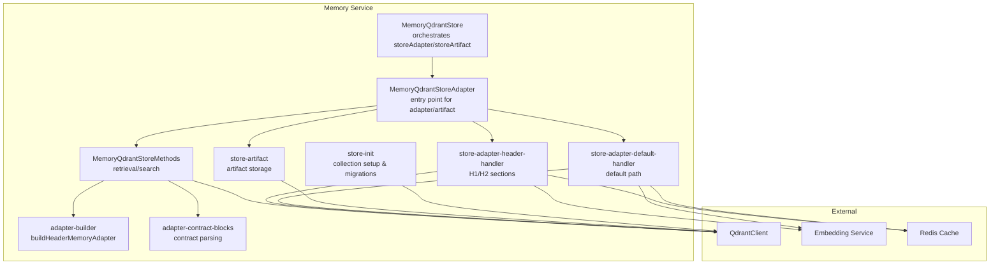
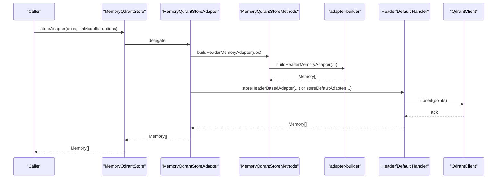
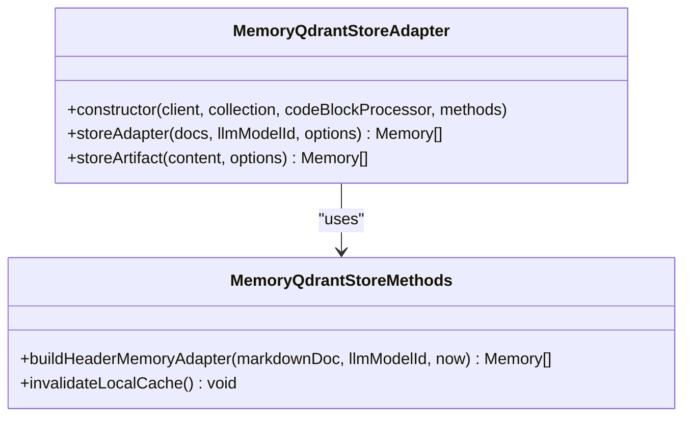
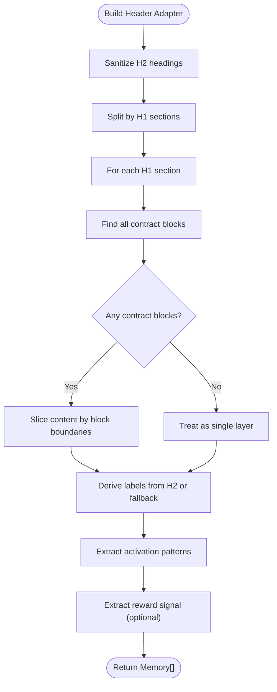
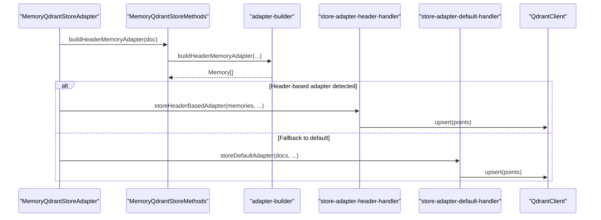
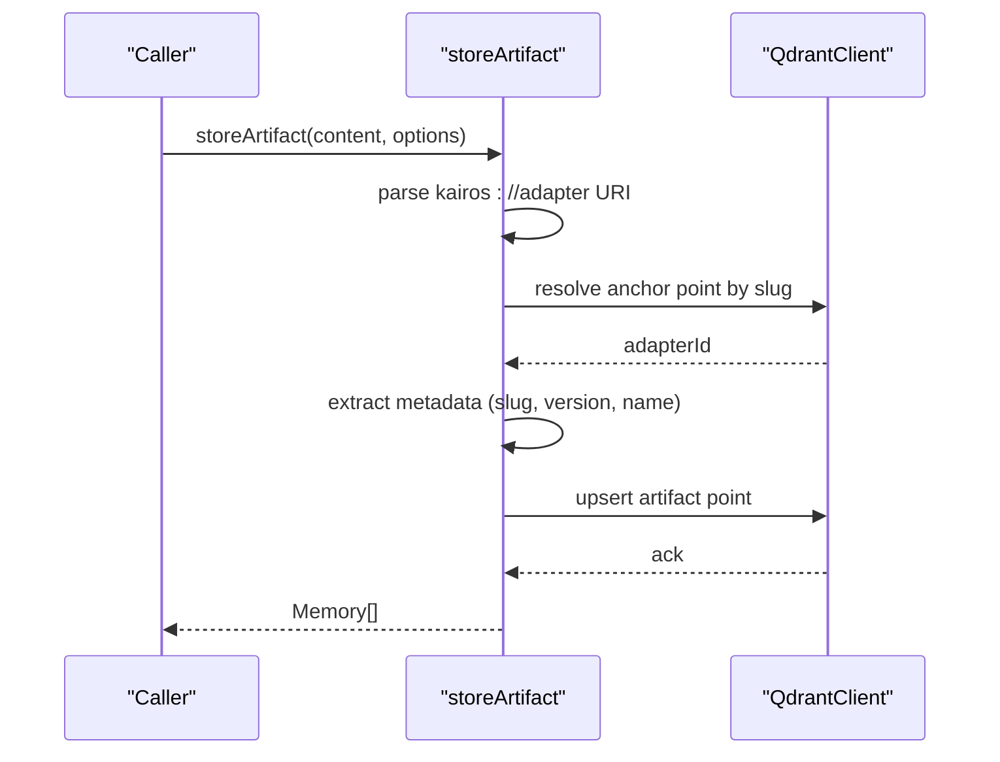
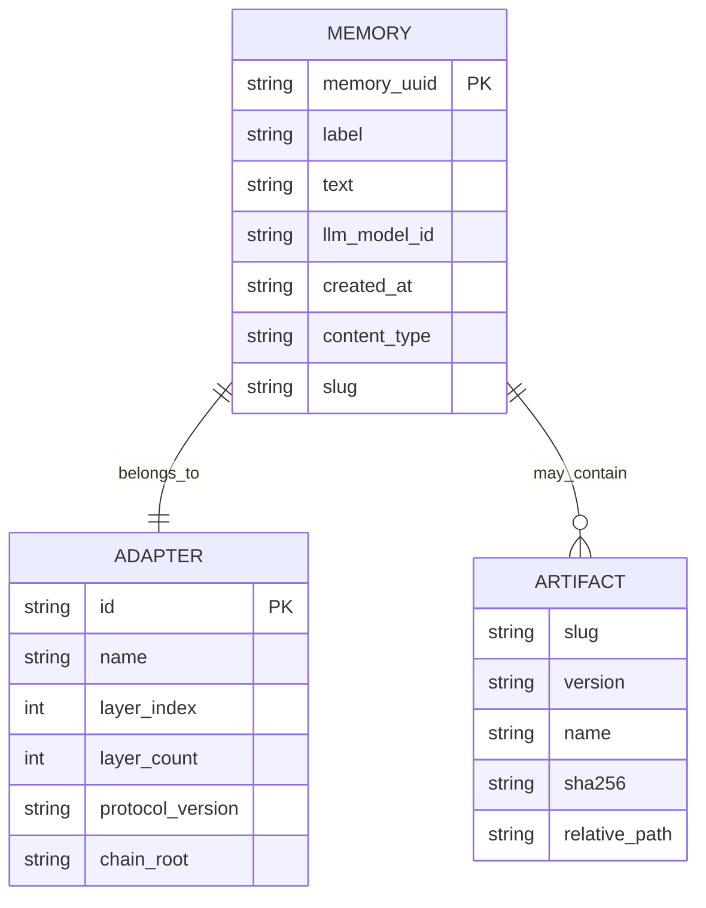
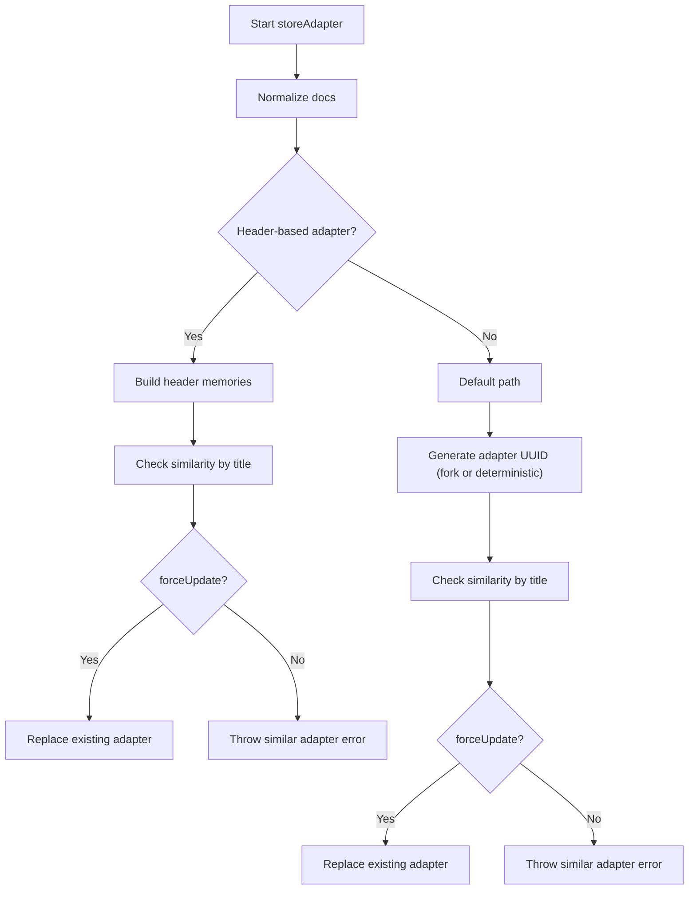
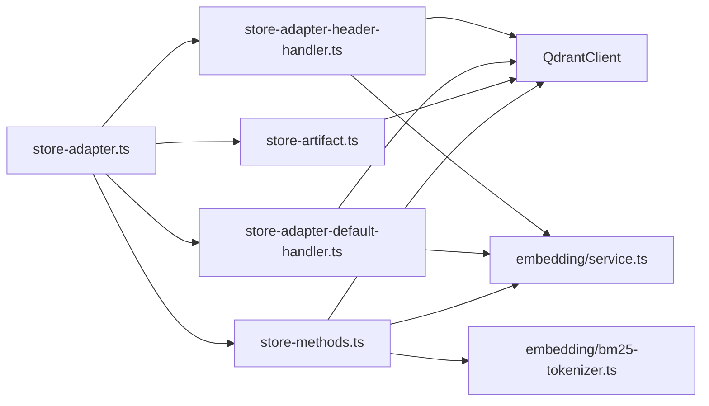

# Adapter Pattern Implementation

<cite>
**Referenced Files in This Document**
- [store.ts](file://src/services/memory/store.ts)
- [store-adapter.ts](file://src/services/memory/store-adapter.ts)
- [adapter-builder.ts](file://src/services/memory/adapter-builder.ts)
- [adapter-contract-blocks.ts](file://src/services/memory/adapter-contract-blocks.ts)
- [store-adapter-header-handler.ts](file://src/services/memory/store-adapter-header-handler.ts)
- [store-adapter-default-handler.ts](file://src/services/memory/store-adapter-default-handler.ts)
- [store-artifact.ts](file://src/services/memory/store-artifact.ts)
- [store-methods.ts](file://src/services/memory/store-methods.ts)
- [store-init.ts](file://src/services/memory/store-init.ts)
- [memory.ts](file://src/types/memory.ts)
- [memory-store-utils.ts](file://src/utils/memory-store-utils.ts)
</cite>

## Table of Contents
1. [Introduction](#introduction)
2. [Project Structure](#project-structure)
3. [Core Components](#core-components)
4. [Architecture Overview](#architecture-overview)
5. [Detailed Component Analysis](#detailed-component-analysis)
6. [Dependency Analysis](#dependency-analysis)
7. [Performance Considerations](#performance-considerations)
8. [Troubleshooting Guide](#troubleshooting-guide)
9. [Conclusion](#conclusion)

## Introduction
This document explains the adapter pattern implementation for memory management, focusing on how MemoryQdrantStoreAdapter normalizes and stores diverse content types (adapters and artifacts) into Qdrant. It covers:
- How adapters are built from markdown content using the adapter pattern
- Contract block parsing and inference contracts
- Content preprocessing and vectorization workflows
- Relationship between adapters and memory UUIDs
- Fork operations for adapter updates and force update mechanisms
- Examples of custom adapter implementations and integration patterns

## Project Structure
The adapter pattern lives within the memory service and integrates with Qdrant for persistence and retrieval. Key modules:
- Store orchestration and initialization
- Adapter builders and handlers
- Artifact storage and resolution
- Methods for retrieval and hybrid search
- Type definitions for adapter metadata and contracts

**Diagram sources**
- [store.ts:20-53](file://src/services/memory/store.ts#L20-L53)
- [store-adapter.ts:35-41](file://src/services/memory/store-adapter.ts#L35-L41)
- [adapter-builder.ts:212-257](file://src/services/memory/adapter-builder.ts#L212-L257)
- [adapter-contract-blocks.ts:51-116](file://src/services/memory/adapter-contract-blocks.ts#L51-L116)
- [store-adapter-header-handler.ts:30-39](file://src/services/memory/store-adapter-header-handler.ts#L30-L39)
- [store-adapter-default-handler.ts:34-46](file://src/services/memory/store-adapter-default-handler.ts#L34-L46)
- [store-artifact.ts:168-300](file://src/services/memory/store-artifact.ts#L168-L300)
- [store-init.ts:171-348](file://src/services/memory/store-init.ts#L171-L348)

**Section sources**
- [store.ts:20-53](file://src/services/memory/store.ts#L20-L53)
- [store-init.ts:171-348](file://src/services/memory/store-init.ts#L171-L348)

## Core Components
- MemoryQdrantStoreAdapter: Central orchestrator that decides between header-based and default adapter storage, and delegates artifact storage.
- Adapter builders and handlers: Build adapter memories from markdown and persist them via header or default handlers.
- Contract parsing: Detects inference contracts embedded in fenced code blocks and cleans content accordingly.
- Artifact storage: Stores external artifacts linked to an adapter chain using a stable adapter identifier.
- Store methods: Provides retrieval and hybrid search capabilities backed by Qdrant.

**Section sources**
- [store-adapter.ts:35-154](file://src/services/memory/store-adapter.ts#L35-L154)
- [adapter-builder.ts:212-257](file://src/services/memory/adapter-builder.ts#L212-L257)
- [adapter-contract-blocks.ts:51-116](file://src/services/memory/adapter-contract-blocks.ts#L51-L116)
- [store-adapter-header-handler.ts:30-204](file://src/services/memory/store-adapter-header-handler.ts#L30-L204)
- [store-adapter-default-handler.ts:34-257](file://src/services/memory/store-adapter-default-handler.ts#L34-L257)
- [store-artifact.ts:168-300](file://src/services/memory/store-artifact.ts#L168-L300)
- [store-methods.ts:25-298](file://src/services/memory/store-methods.ts#L25-L298)

## Architecture Overview
The adapter pattern is implemented through a clear separation of concerns:
- Orchestration: MemoryQdrantStoreAdapter decides the storage path and options.
- Building: adapter-builder transforms markdown into layered memories with optional inference contracts.
- Storing: Handlers persist memories with vectors and metadata; artifacts are attached to an adapter chain.
- Retrieving: Store methods expose retrieval and hybrid search using dense and sparse vectors.

**Diagram sources**
- [store.ts:123-129](file://src/services/memory/store.ts#L123-L129)
- [store-adapter.ts:43-148](file://src/services/memory/store-adapter.ts#L43-L148)
- [store-methods.ts:294-296](file://src/services/memory/store-methods.ts#L294-L296)
- [adapter-builder.ts:212-257](file://src/services/memory/adapter-builder.ts#L212-L257)
- [store-adapter-header-handler.ts:30-204](file://src/services/memory/store-adapter-header-handler.ts#L30-L204)
- [store-adapter-default-handler.ts:34-257](file://src/services/memory/store-adapter-default-handler.ts#L34-L257)

## Detailed Component Analysis

### MemoryQdrantStoreAdapter
Responsibilities:
- Normalizes input markdown documents
- Parses frontmatter and resolves protocol slug candidates
- Builds header-based adapters or falls back to default adapter storage
- Enforces similarity checks and duplicate handling
- Delegates artifact storage to dedicated handler

Key behaviors:
- Accepts forceUpdate and forkNewAdapter options to control replacement and UUID generation
- Uses protocolVersion to annotate adapter payloads
- Integrates with helpers for slug allocation and duplicate handling

**Diagram sources**
- [store-adapter.ts:35-41](file://src/services/memory/store-adapter.ts#L35-L41)
- [store-methods.ts:294-296](file://src/services/memory/store-methods.ts#L294-L296)

**Section sources**
- [store-adapter.ts:43-148](file://src/services/memory/store-adapter.ts#L43-L148)

### Adapter Builder and Contract Blocks
The builder converts markdown into layered memories:
- Sanitizes H2 headings to maintain stable layer ordering
- Splits content into segments using contract blocks
- Extracts activation patterns and optional reward signal
- Generates labels and tags for each layer

Contract parsing:
- Detects fenced JSON blocks with a contract definition
- Rejects plain fenced blocks that look like JSON but are not tagged as JSON
- Cleans content by removing trailing contract blocks

**Diagram sources**
- [adapter-builder.ts:13-21](file://src/services/memory/adapter-builder.ts#L13-L21)
- [adapter-builder.ts:75-210](file://src/services/memory/adapter-builder.ts#L75-L210)
- [adapter-contract-blocks.ts:51-116](file://src/services/memory/adapter-contract-blocks.ts#L51-L116)

**Section sources**
- [adapter-builder.ts:212-257](file://src/services/memory/adapter-builder.ts#L212-L257)
- [adapter-contract-blocks.ts:51-116](file://src/services/memory/adapter-contract-blocks.ts#L51-L116)

### Header-Based vs Default Adapter Storage
- Header-based path: Uses adapter layers derived from H1/H2 sections and contract blocks
- Default path: Treats each document as a single memory and generates a label from the first meaningful line

Both paths:
- Generate dense vectors for primary, title, and activation pattern fields
- Tokenize sparse BM25 text
- Persist to Qdrant with adapter metadata and slug
- Invalidate caches and update metrics

**Diagram sources**
- [store-adapter.ts:69-144](file://src/services/memory/store-adapter.ts#L69-L144)
- [store-adapter-header-handler.ts:30-204](file://src/services/memory/store-adapter-header-handler.ts#L30-L204)
- [store-adapter-default-handler.ts:34-257](file://src/services/memory/store-adapter-default-handler.ts#L34-L257)

**Section sources**
- [store-adapter-header-handler.ts:30-204](file://src/services/memory/store-adapter-header-handler.ts#L30-L204)
- [store-adapter-default-handler.ts:34-257](file://src/services/memory/store-adapter-default-handler.ts#L34-L257)

### Artifact Storage and Adapter Chain Resolution
Artifacts are stored under a specific adapter chain identified by:
- Adapter slug (anchor point layer_index=1)
- Adapter URI (kairos://adapter/{slug|uuid})
- Existing adapter name resolution when UUID is provided

Storage logic:
- Validates MIME type against allowed artifact types
- Computes SHA-256 of content
- Resolves existing artifact by name or slug
- Upserts with zero vectors for dense fields and BM25 for sparse text
- Attaches adapter metadata and optional relative path

**Diagram sources**
- [store-artifact.ts:168-300](file://src/services/memory/store-artifact.ts#L168-L300)

**Section sources**
- [store-artifact.ts:168-300](file://src/services/memory/store-artifact.ts#L168-L300)

### Relationship Between Adapters and Memory UUIDs
- Each memory has a unique memory_uuid
- Adapter metadata includes id, name, layer_index, and layer_count
- When forking, a new adapter UUID is generated; otherwise, a deterministic UUID is derived from the adapter label
- Artifact storage links to the adapter chain via adapterId

**Diagram sources**
- [memory.ts:1-125](file://src/types/memory.ts#L1-L125)

**Section sources**
- [memory.ts:1-125](file://src/types/memory.ts#L1-L125)

### Fork Operations and Force Updates
- forkNewAdapter: When true, generates a new adapter UUID instead of deriving from the label
- forceUpdate: Allows replacing existing adapters or artifacts when duplicates are detected
- Similarity guard: Prevents accidental duplication by checking adapter title similarity before training

**Diagram sources**
- [store-adapter.ts:43-148](file://src/services/memory/store-adapter.ts#L43-L148)
- [store-adapter-default-handler.ts:61-62](file://src/services/memory/store-adapter-default-handler.ts#L61-L62)
- [store-adapter-header-handler.ts:47](file://src/services/memory/store-adapter-header-handler.ts#L47)

**Section sources**
- [store-adapter.ts:18-23](file://src/services/memory/store-adapter.ts#L18-L23)
- [store-adapter-default-handler.ts:61-62](file://src/services/memory/store-adapter-default-handler.ts#L61-L62)
- [store-adapter-header-handler.ts:47](file://src/services/memory/store-adapter-header-handler.ts#L47)

### Contract Validation and Content Preprocessing
- Contract validation: Ensures fenced JSON blocks contain a valid contract object; rejects plain fenced blocks that look like JSON but are not tagged as JSON
- Content preprocessing: Removes trailing contract blocks from text; sanitizes H2 headings; extracts activation patterns and optional reward signal
- Tagging and labeling: Generates tags and labels for improved search and retrieval

**Section sources**
- [adapter-contract-blocks.ts:25-45](file://src/services/memory/adapter-contract-blocks.ts#L25-L45)
- [adapter-contract-blocks.ts:79-89](file://src/services/memory/adapter-contract-blocks.ts#L79-L89)
- [adapter-builder.ts:13-21](file://src/services/memory/adapter-builder.ts#L13-L21)
- [adapter-builder.ts:33-68](file://src/services/memory/adapter-builder.ts#L33-L68)
- [memory-store-utils.ts:62-94](file://src/utils/memory-store-utils.ts#L62-L94)

### Integration Patterns with the Broader Memory Management System
- Initialization: Ensures collection exists, adds named vectors, migrates data, and sets up BM25 and full-text indexes
- Retrieval: Provides getMemory and getMemoryFresh with space filtering and cache invalidation
- Search: Hybrid dense + activation-focused dense + BM25 search with fusion and payload-based boosts
- Metrics: Tracks memory store operations and adapter sizes

**Section sources**
- [store-init.ts:171-348](file://src/services/memory/store-init.ts#L171-L348)
- [store-methods.ts:46-97](file://src/services/memory/store-methods.ts#L46-L97)
- [store-methods.ts:99-264](file://src/services/memory/store-methods.ts#L99-L264)

## Dependency Analysis
- MemoryQdrantStoreAdapter depends on:
  - MemoryQdrantStoreMethods for building header memories
  - Header and default handlers for persistence
  - Helpers for slug allocation and duplicate handling
- Handlers depend on:
  - Embedding service for dense vectors
  - BM25 tokenizer for sparse vectors
  - QdrantClient for upsert
  - Redis cache for invalidation
- Store methods depend on:
  - QdrantClient for retrieval and hybrid search
  - Embedding service and BM25 tokenizer for queries
  - Space filters and tenant context for access control

**Diagram sources**
- [store-adapter.ts:1-16](file://src/services/memory/store-adapter.ts#L1-L16)
- [store-adapter-header-handler.ts:1-25](file://src/services/memory/store-adapter-header-handler.ts#L1-L25)
- [store-adapter-default-handler.ts:1-29](file://src/services/memory/store-adapter-default-handler.ts#L1-L29)
- [store-artifact.ts:1-18](file://src/services/memory/store-artifact.ts#L1-L18)
- [store-methods.ts:1-18](file://src/services/memory/store-methods.ts#L1-L18)

**Section sources**
- [store-adapter.ts:1-16](file://src/services/memory/store-adapter.ts#L1-L16)
- [store-adapter-header-handler.ts:1-25](file://src/services/memory/store-adapter-header-handler.ts#L1-L25)
- [store-adapter-default-handler.ts:1-29](file://src/services/memory/store-adapter-default-handler.ts#L1-L29)
- [store-artifact.ts:1-18](file://src/services/memory/store-artifact.ts#L1-L18)
- [store-methods.ts:1-18](file://src/services/memory/store-methods.ts#L1-L18)

## Performance Considerations
- Vectorization batching: Dense embeddings are computed in batches to minimize latency
- Sparse vector fallback: If BM25 is unsupported, handlers retry without sparse vectors
- Cache invalidation: Redis cache and local cache are invalidated after upsert to ensure freshness
- Hybrid search: Prefetches multiple dense legs and BM25 legs, then fuses results for accurate ranking

[No sources needed since this section provides general guidance]

## Troubleshooting Guide
Common issues and resolutions:
- Duplicate adapter title: Similarity guard detects near-duplicate titles; use force_update to replace or adjust the adapter title
- Protected space write: Attempts to modify protected spaces are blocked; verify space permissions
- Slug conflicts: Author-supplied slugs must be unique; auto-slug suffixing is attempted up to a configured limit
- Vector configuration errors: If upsert fails due to vector or sparse vector configuration, handlers automatically retry without BM25
- Health check timeouts: Store.checkHealth provides a timeout-based health probe for Qdrant connectivity

**Section sources**
- [store-adapter-default-handler.ts:216-232](file://src/services/memory/store-adapter-default-handler.ts#L216-L232)
- [store-adapter-header-handler.ts:166-182](file://src/services/memory/store-adapter-header-handler.ts#L166-L182)
- [store-artifact.ts:260-272](file://src/services/memory/store-artifact.ts#L260-L272)
- [store.ts:59-121](file://src/services/memory/store.ts#L59-L121)

## Conclusion
The adapter pattern in memory management is implemented through a robust pipeline:
- Clear separation between building, storing, and retrieving
- Strong validation of contracts and content preprocessing
- Flexible adapter and artifact storage with fork and force update controls
- Comprehensive integration with Qdrant, embedding, and caching layers

This design enables scalable, consistent storage of structured knowledge adapters and artifacts while maintaining strong guarantees around uniqueness, permissions, and search quality.