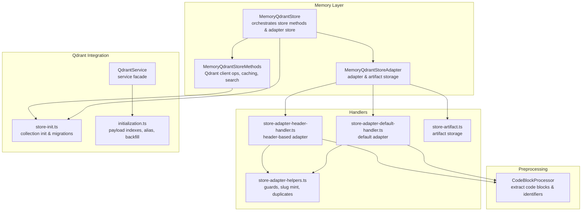
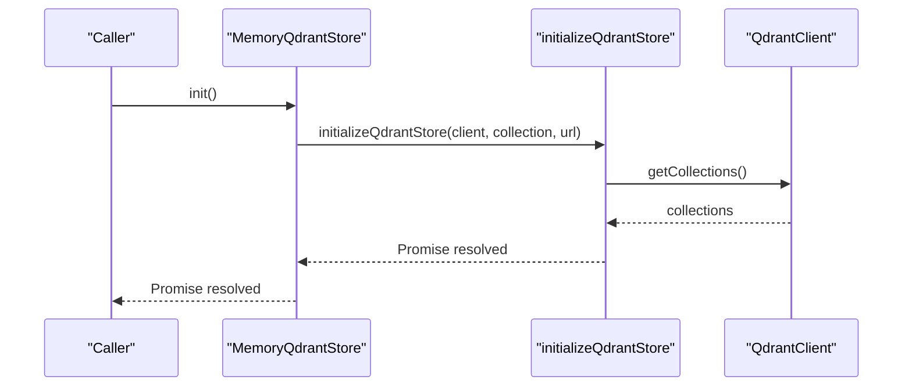
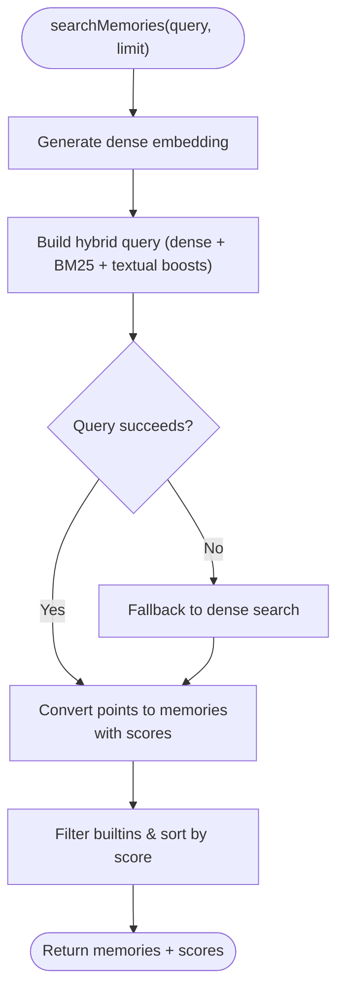
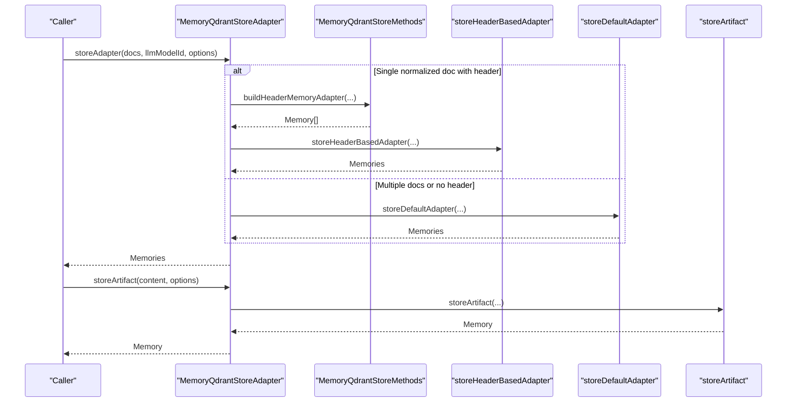
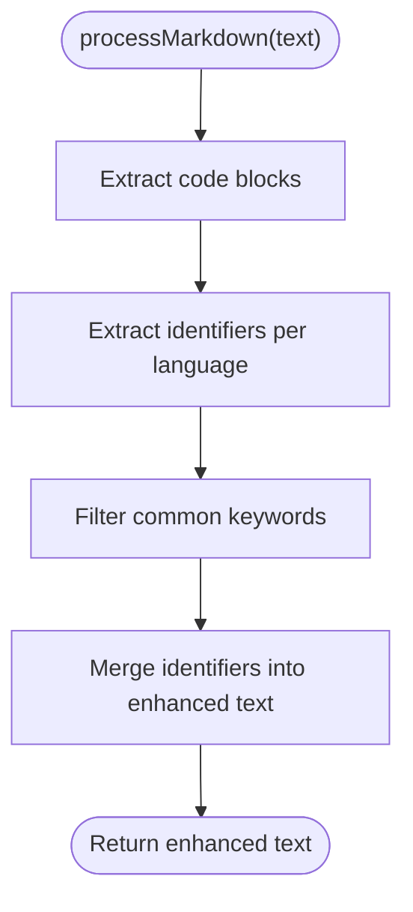
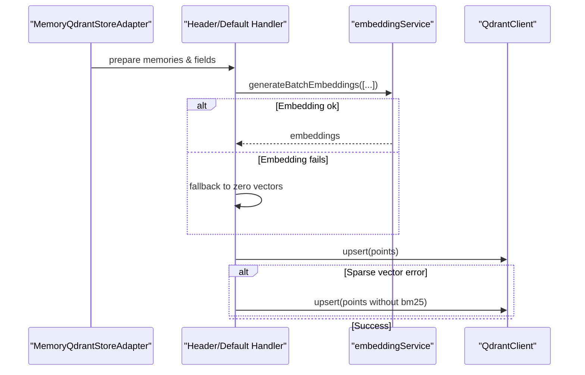
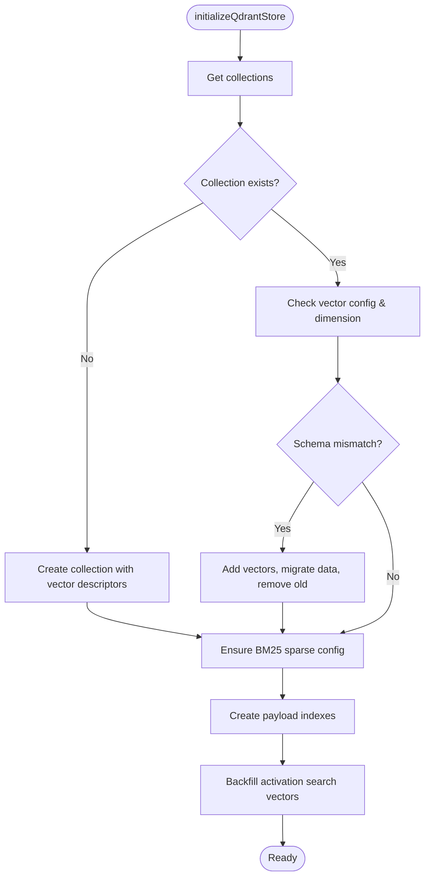
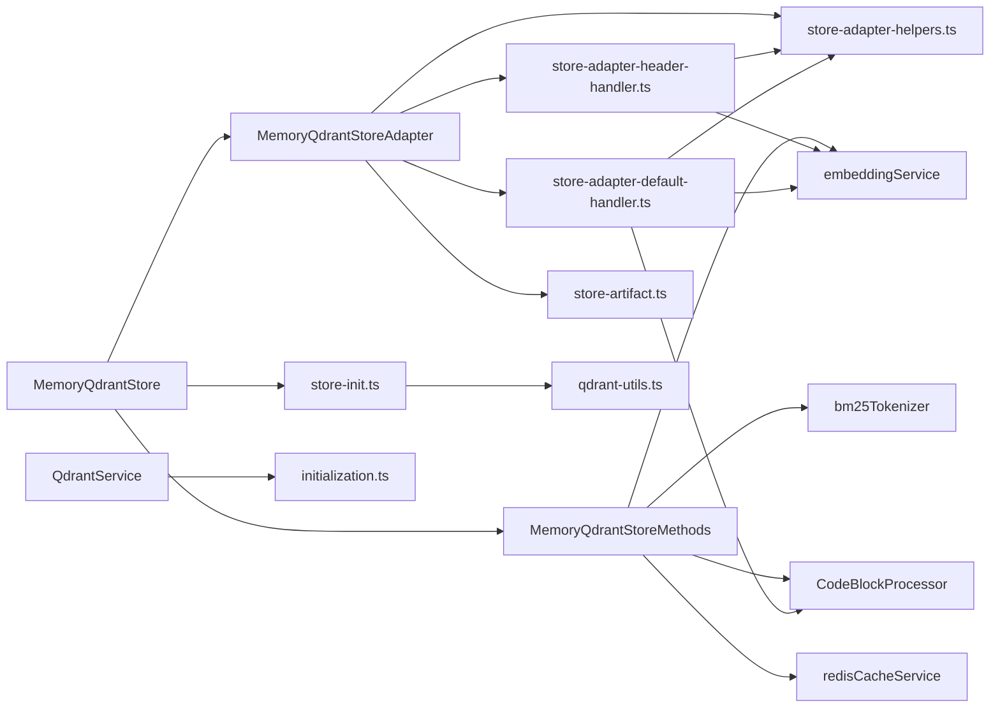

# Memory Management Architecture

<cite>
**Referenced Files in This Document**
- [src/services/memory/store.ts](file://src/services/memory/store.ts)
- [src/services/memory/store-methods.ts](file://src/services/memory/store-methods.ts)
- [src/services/memory/store-adapter.ts](file://src/services/memory/store-adapter.ts)
- [src/services/memory/store-adapter-header-handler.ts](file://src/services/memory/store-adapter-header-handler.ts)
- [src/services/memory/store-adapter-default-handler.ts](file://src/services/memory/store-adapter-default-handler.ts)
- [src/services/memory/store-adapter-helpers.ts](file://src/services/memory/store-adapter-helpers.ts)
- [src/services/memory/store-artifact.ts](file://src/services/memory/store-artifact.ts)
- [src/services/code-block-processor.ts](file://src/services/code-block-processor.ts)
- [src/services/qdrant/service.ts](file://src/services/qdrant/service.ts)
- [src/services/qdrant/initialization.ts](file://src/services/qdrant/initialization.ts)
- [src/services/memory/store-init.ts](file://src/services/memory/store-init.ts)
- [src/utils/qdrant-utils.ts](file://src/utils/qdrant-utils.ts)
</cite>

## Update Summary
**Changes Made**
- Comprehensive update to reflect the complete memory management architecture implementation
- Added detailed coverage of Qdrant integration layer with vector management and migration
- Enhanced adapter pattern documentation covering both header-based and default storage approaches
- Expanded content preprocessing pipeline with CodeBlockProcessor integration
- Documented collection management, health monitoring, and error handling strategies
- Added relationship mapping between memory UUIDs and Qdrant point IDs
- Included practical examples and troubleshooting guidance

## Table of Contents
1. [Introduction](#introduction)
2. [Project Structure](#project-structure)
3. [Core Components](#core-components)
4. [Architecture Overview](#architecture-overview)
5. [Detailed Component Analysis](#detailed-component-analysis)
6. [Dependency Analysis](#dependency-analysis)
7. [Performance Considerations](#performance-considerations)
8. [Troubleshooting Guide](#troubleshooting-guide)
9. [Conclusion](#conclusion)

## Introduction
This document describes the KAIROS MCP memory management architecture with a focus on how MemoryQdrantStore orchestrates Qdrant client operations, memory storage methods, and adapter patterns. It explains the integration of CodeBlockProcessor for content preprocessing, collection alias resolution, and health monitoring. It also documents the separation of concerns among store methods, adapter store, and initialization logic, and provides data flow diagrams showing how raw content becomes stored memories with embeddings. Finally, it covers collection management, health check mechanisms, error handling strategies, the adapter pattern for different content types, and the relationship between memory UUIDs and Qdrant point IDs.

## Project Structure
The memory subsystem is organized into layered modules:
- Memory orchestration: MemoryQdrantStore exposes high-level APIs for initialization, health checks, adapter storage, artifact storage, and retrieval/search.
- Storage methods: MemoryQdrantStoreMethods encapsulates Qdrant client interactions, caching, search, and conversion from Qdrant points to Memory objects.
- Adapter store: MemoryQdrantStoreAdapter coordinates adapter creation and artifact storage, delegating to specialized handlers.
- Handlers: Header-based and default adapter handlers implement different ingestion strategies and vectorization flows.
- Utilities: CodeBlockProcessor enriches content with code identifiers; helpers enforce similarity guards and slug allocation; initialization manages collection lifecycle and vector schema migrations.



**Diagram sources**
- [src/services/memory/store.ts:20-53](file://src/services/memory/store.ts#L20-L53)
- [src/services/memory/store-methods.ts:25-38](file://src/services/memory/store-methods.ts#L25-L38)
- [src/services/memory/store-adapter.ts:35-41](file://src/services/memory/store-adapter.ts#L35-L41)
- [src/services/memory/store-adapter-header-handler.ts:30-39](file://src/services/memory/store-adapter-header-handler.ts#L30-L39)
- [src/services/memory/store-adapter-default-handler.ts:34-46](file://src/services/memory/store-adapter-default-handler.ts#L34-L46)
- [src/services/memory/store-adapter-helpers.ts:52-93](file://src/services/memory/store-adapter-helpers.ts#L52-L93)
- [src/services/memory/store-artifact.ts:168-173](file://src/services/memory/store-artifact.ts#L168-L173)
- [src/services/code-block-processor.ts:18-189](file://src/services/code-block-processor.ts#L18-L189)
- [src/services/memory/store-init.ts:171-348](file://src/services/memory/store-init.ts#L171-L348)
- [src/services/qdrant/service.ts:16-49](file://src/services/qdrant/service.ts#L16-L49)
- [src/services/qdrant/initialization.ts:12-92](file://src/services/qdrant/initialization.ts#L12-L92)

**Section sources**
- [src/services/memory/store.ts:1-152](file://src/services/memory/store.ts#L1-L152)
- [src/services/memory/store-methods.ts:1-298](file://src/services/memory/store-methods.ts#L1-L298)
- [src/services/memory/store-adapter.ts:1-154](file://src/services/memory/store-adapter.ts#L1-L154)
- [src/services/memory/store-adapter-header-handler.ts:1-204](file://src/services/memory/store-adapter-header-handler.ts#L1-L204)
- [src/services/memory/store-adapter-default-handler.ts:1-257](file://src/services/memory/store-adapter-default-handler.ts#L1-L257)
- [src/services/memory/store-adapter-helpers.ts:1-255](file://src/services/memory/store-adapter-helpers.ts#L1-L255)
- [src/services/memory/store-artifact.ts:1-301](file://src/services/memory/store-artifact.ts#L1-L301)
- [src/services/code-block-processor.ts:1-204](file://src/services/code-block-processor.ts#L1-L204)
- [src/services/qdrant/service.ts:1-152](file://src/services/qdrant/service.ts#L1-L152)
- [src/services/qdrant/initialization.ts:1-183](file://src/services/qdrant/initialization.ts#L1-L183)
- [src/services/memory/store-init.ts:1-348](file://src/services/memory/store-init.ts#L1-L348)
- [src/utils/qdrant-utils.ts:1-4](file://src/utils/qdrant-utils.ts#L1-L4)

## Core Components
- MemoryQdrantStore: Central orchestrator that constructs the Qdrant client, resolves collection aliases, initializes the store, performs health checks, and delegates to store methods and adapter store.
- MemoryQdrantStoreMethods: Encapsulates Qdrant operations, local caching, hybrid search with dense and BM25 vectors, and conversion from Qdrant points to Memory objects.
- MemoryQdrantStoreAdapter: Coordinates adapter and artifact storage, normalizes input, parses frontmatter, and delegates to handler modules.
- Handler Modules: Header-based and default adapter handlers implement vectorization strategies, payload construction, and upsert logic with fallbacks for sparse vector configurations.
- CodeBlockProcessor: Extracts code blocks and identifiers from markdown to enhance searchability and integrates them into the stored text.
- Qdrant Integration: Initialization and migration logic ensure proper vector schema, payload indexes, alias management, and backfills missing metadata.

**Section sources**
- [src/services/memory/store.ts:20-152](file://src/services/memory/store.ts#L20-L152)
- [src/services/memory/store-methods.ts:25-298](file://src/services/memory/store-methods.ts#L25-L298)
- [src/services/memory/store-adapter.ts:35-154](file://src/services/memory/store-adapter.ts#L35-L154)
- [src/services/memory/store-adapter-header-handler.ts:30-204](file://src/services/memory/store-adapter-header-handler.ts#L30-L204)
- [src/services/memory/store-adapter-default-handler.ts:34-257](file://src/services/memory/store-adapter-default-handler.ts#L34-L257)
- [src/services/code-block-processor.ts:18-204](file://src/services/code-block-processor.ts#L18-L204)
- [src/services/memory/store-init.ts:171-348](file://src/services/memory/store-init.ts#L171-L348)

## Architecture Overview
The architecture follows a layered pattern:
- Orchestration Layer: MemoryQdrantStore composes dependencies and exposes top-level APIs.
- Domain Services Layer: Methods and adapters encapsulate business logic for retrieval, search, and storage.
- Persistence Layer: Qdrant client operations with robust initialization, migrations, and payload indexing.
- Preprocessing Layer: CodeBlockProcessor augments content for improved semantic coverage.

```mermaid
classDiagram
class MemoryQdrantStore {
- client : QdrantClient
- collection : string
- originalCollectionAlias : string
- url : string
- codeBlockProcessor : CodeBlockProcessor
- methods : MemoryQdrantStoreMethods
- adapterStore : MemoryQdrantStoreAdapter
+ init() : Promise<void>
+ checkHealth(timeoutMs) : Promise<boolean>
+ storeAdapter(docs, llmModelId, options) : Promise<Memory[]>
+ storeArtifact(content, options) : Promise<Memory[]>
+ getMemory(memory_uuid, options) : Promise<Memory|null>
+ searchMemories(query, limit, collapse) : Promise<{memories, scores}>
+ getQdrantAccess() : {client, collection}
}
class MemoryQdrantStoreMethods {
- client : QdrantClient
- collection : string
- cache : Map
- cacheLoaded : boolean
- url : string
- codeBlockProcessor : CodeBlockProcessor
+ invalidateLocalCache() : void
+ getMemory(memory_uuid) : Promise<Memory|null>
+ getMemoryFresh(memory_uuid) : Promise<Memory|null>
+ searchMemories(query, limit, collapse) : Promise<{memories, scores}>
+ searchAdapterTitlesBySimilarity(query, limit) : Promise<{memories, scores}>
+ vectorSearch(query, limit) : Promise<{memories, scores}>
+ pointToMemory(point) : Memory
+ buildHeaderMemoryAdapter(markdownDoc, llmModelId, now) : Memory[]
}
class MemoryQdrantStoreAdapter {
+ storeAdapter(docs, llmModelId, options) : Promise<Memory[]>
+ storeArtifact(content, options) : Promise<Memory[]>
}
MemoryQdrantStore --> MemoryQdrantStoreMethods : "uses"
MemoryQdrantStore --> MemoryQdrantStoreAdapter : "uses"
MemoryQdrantStoreAdapter --> MemoryQdrantStoreMethods : "uses"
```

**Diagram sources**
- [src/services/memory/store.ts:20-53](file://src/services/memory/store.ts#L20-L53)
- [src/services/memory/store-methods.ts:25-38](file://src/services/memory/store-methods.ts#L25-L38)
- [src/services/memory/store-adapter.ts:35-41](file://src/services/memory/store-adapter.ts#L35-L41)

## Detailed Component Analysis

### MemoryQdrantStore: Orchestration and Health Monitoring
- Construction: Initializes Qdrant client with URL and optional API key, resolves collection alias, instantiates CodeBlockProcessor, and composes methods and adapter store.
- Initialization: Delegates to store initialization logic to ensure collection existence, vector schema, BM25 configuration, payload indexes, and backfills.
- Health Monitoring: Performs a race between a collection inspection and a timeout to determine liveness, logging warnings on failure and suppressing unhandled rejections.
- Public APIs: Exposes storeAdapter, storeArtifact, getMemory, searchMemories, and direct access to Qdrant client and collection.



**Diagram sources**
- [src/services/memory/store.ts:55-57](file://src/services/memory/store.ts#L55-L57)
- [src/services/memory/store-init.ts:171-348](file://src/services/memory/store-init.ts#L171-L348)

**Section sources**
- [src/services/memory/store.ts:29-121](file://src/services/memory/store.ts#L29-L121)

### MemoryQdrantStoreMethods: Retrieval, Caching, and Hybrid Search
- Local Caching: Maintains an in-memory cache keyed by memory_uuid, with invalidation to force fresh reads.
- Retrieval: Validates space permissions and converts Qdrant points to Memory objects.
- Search: Generates dense embeddings, builds hybrid queries combining dense vectors, BM25 sparse vectors, and textual boosts, with fallback to dense search on failure.
- Vectorization: Uses embedding service dimension to select vector names and applies BM25 tokenization for sparse components.



**Diagram sources**
- [src/services/memory/store-methods.ts:99-264](file://src/services/memory/store-methods.ts#L99-L264)

**Section sources**
- [src/services/memory/store-methods.ts:46-97](file://src/services/memory/store-methods.ts#L46-L97)
- [src/services/memory/store-methods.ts:126-264](file://src/services/memory/store-methods.ts#L126-L264)

### MemoryQdrantStoreAdapter: Adapter Pattern and Content Normalization
- Normalization: Normalizes markdown blobs and parses frontmatter for single-document ingestion.
- Header-based Adapter: Attempts to split content into H1/H2 layers, validates and derives adapter metadata, and delegates to header handler.
- Default Adapter: Processes multiple documents, generates labels and tags, and delegates to default handler.
- Artifact Storage: Parses adapter URIs, resolves chain adapter IDs, and stores artifacts with metadata and zeroed dense vectors plus BM25.



**Diagram sources**
- [src/services/memory/store-adapter.ts:43-152](file://src/services/memory/store-adapter.ts#L43-L152)
- [src/services/memory/store-adapter-header-handler.ts:30-204](file://src/services/memory/store-adapter-header-handler.ts#L30-L204)
- [src/services/memory/store-adapter-default-handler.ts:34-257](file://src/services/memory/store-adapter-default-handler.ts#L34-L257)
- [src/services/memory/store-artifact.ts:168-301](file://src/services/memory/store-artifact.ts#L168-L301)

**Section sources**
- [src/services/memory/store-adapter.ts:43-152](file://src/services/memory/store-adapter.ts#L43-L152)

### CodeBlockProcessor: Content Preprocessing for Enhanced Searchability
- Extraction: Identifies fenced code blocks and language-specific identifiers.
- Identifier Filtering: Applies language-specific regex patterns and filters common keywords.
- Enhancement: Appends extracted identifiers to the end of the text to improve embedding and BM25 indexing.



**Diagram sources**
- [src/services/code-block-processor.ts:181-204](file://src/services/code-block-processor.ts#L181-L204)

**Section sources**
- [src/services/code-block-processor.ts:22-204](file://src/services/code-block-processor.ts#L22-L204)

### Handler Modules: Vectorization and Payload Construction
- Header-based Adapter Handler: Builds activation search fields, computes dense vectors for primary, title, and activation patterns, handles embedding failures by zeroing vectors, and retries without BM25 if sparse vector configuration is missing.
- Default Adapter Handler: Processes multiple documents, enhances text with code identifiers, computes activation-aware vectors, and applies similar fallback and retry logic.
- Helpers: Enforces similarity guard by title, allocates unique slugs, and handles duplicate adapters with protection against protected spaces.



**Diagram sources**
- [src/services/memory/store-adapter-header-handler.ts:62-89](file://src/services/memory/store-adapter-header-handler.ts#L62-L89)
- [src/services/memory/store-adapter-default-handler.ts:113-142](file://src/services/memory/store-adapter-default-handler.ts#L113-L142)
- [src/services/memory/store-adapter-header-handler.ts:167-182](file://src/services/memory/store-adapter-header-handler.ts#L167-L182)
- [src/services/memory/store-adapter-default-handler.ts:217-232](file://src/services/memory/store-adapter-default-handler.ts#L217-L232)

**Section sources**
- [src/services/memory/store-adapter-header-handler.ts:30-204](file://src/services/memory/store-adapter-header-handler.ts#L30-L204)
- [src/services/memory/store-adapter-default-handler.ts:34-257](file://src/services/memory/store-adapter-default-handler.ts#L34-L257)
- [src/services/memory/store-adapter-helpers.ts:112-172](file://src/services/memory/store-adapter-helpers.ts#L112-L172)

### Collection Management and Health Monitoring
- Alias Resolution: MemoryQdrantStore resolves collection alias to the actual collection name before constructing the client.
- Initialization: Ensures collection existence, validates/updates vector schema, adds named vectors, migrates data, ensures BM25 configuration, creates full-text indexes, and backfills activation search vectors.
- Payload Indexes: Creates indexes for space scoping, adapter metadata, and textual fields to optimize queries.
- Health Monitoring: Provides a health check that races a collection inspection against a timeout, logs warnings on failure, and suppresses unhandled rejections.



**Diagram sources**
- [src/services/memory/store-init.ts:171-348](file://src/services/memory/store-init.ts#L171-L348)
- [src/services/qdrant/initialization.ts:12-92](file://src/services/qdrant/initialization.ts#L12-L92)

**Section sources**
- [src/services/memory/store.ts:44-48](file://src/services/memory/store.ts#L44-L48)
- [src/services/memory/store-init.ts:171-348](file://src/services/memory/store-init.ts#L171-L348)
- [src/services/qdrant/initialization.ts:49-78](file://src/services/qdrant/initialization.ts#L49-L78)
- [src/services/qdrant/service.ts:16-49](file://src/services/qdrant/service.ts#L16-L49)

### Relationship Between Memory UUIDs and Qdrant Point IDs
- Identity: Memory memory_uuid is used as the Qdrant point ID for upsert operations, enabling direct retrieval by UUID.
- Resolution: Adapter handlers construct points with id set to memory_uuid, ensuring alignment between KAIROS memory identity and Qdrant persistence.
- Artifact Attachment: Artifact storage resolves adapter references and assigns memory_uuid to the artifact point, maintaining consistent identity across layers.

**Section sources**
- [src/services/memory/store-adapter-header-handler.ts:115-155](file://src/services/memory/store-adapter-header-handler.ts#L115-L155)
- [src/services/memory/store-adapter-default-handler.ts:166-205](file://src/services/memory/store-adapter-default-handler.ts#L166-L205)
- [src/services/memory/store-artifact.ts:217-258](file://src/services/memory/store-artifact.ts#L217-L258)

## Dependency Analysis
The following diagram highlights key dependencies among core modules:



**Diagram sources**
- [src/services/memory/store.ts:20-53](file://src/services/memory/store.ts#L20-L53)
- [src/services/memory/store-methods.ts:25-38](file://src/services/memory/store-methods.ts#L25-L38)
- [src/services/memory/store-adapter.ts:35-41](file://src/services/memory/store-adapter.ts#L35-L41)
- [src/services/memory/store-adapter-header-handler.ts:30-39](file://src/services/memory/store-adapter-header-handler.ts#L30-L39)
- [src/services/memory/store-adapter-default-handler.ts:34-46](file://src/services/memory/store-adapter-default-handler.ts#L34-L46)
- [src/services/memory/store-adapter-helpers.ts:52-93](file://src/services/memory/store-adapter-helpers.ts#L52-L93)
- [src/services/memory/store-artifact.ts:168-173](file://src/services/memory/store-artifact.ts#L168-L173)
- [src/services/memory/store-init.ts:171-348](file://src/services/memory/store-init.ts#L171-L348)
- [src/utils/qdrant-utils.ts:1-4](file://src/utils/qdrant-utils.ts#L1-L4)
- [src/services/qdrant/service.ts:16-49](file://src/services/qdrant/service.ts#L16-L49)
- [src/services/qdrant/initialization.ts:12-92](file://src/services/qdrant/initialization.ts#L12-L92)

**Section sources**
- [src/services/memory/store.ts:1-152](file://src/services/memory/store.ts#L1-L152)
- [src/services/memory/store-methods.ts:1-298](file://src/services/memory/store-methods.ts#L1-L298)
- [src/services/memory/store-adapter.ts:1-154](file://src/services/memory/store-adapter.ts#L1-L154)
- [src/services/memory/store-adapter-header-handler.ts:1-204](file://src/services/memory/store-adapter-header-handler.ts#L1-L204)
- [src/services/memory/store-adapter-default-handler.ts:1-257](file://src/services/memory/store-adapter-default-handler.ts#L1-L257)
- [src/services/memory/store-adapter-helpers.ts:1-255](file://src/services/memory/store-adapter-helpers.ts#L1-L255)
- [src/services/memory/store-artifact.ts:1-301](file://src/services/memory/store-artifact.ts#L1-L301)
- [src/services/memory/store-init.ts:1-348](file://src/services/memory/store-init.ts#L1-L348)
- [src/utils/qdrant-utils.ts:1-4](file://src/utils/qdrant-utils.ts#L1-L4)
- [src/services/qdrant/service.ts:1-152](file://src/services/qdrant/service.ts#L1-L152)
- [src/services/qdrant/initialization.ts:1-183](file://src/services/qdrant/initialization.ts#L1-L183)

## Performance Considerations
- Hybrid Search: Dense vectors combined with BM25 and textual boosts reduce latency by keeping ranking in Qdrant; fallback to dense search mitigates runtime errors.
- Batch Embeddings: Handlers compute embeddings in batches for header/default adapters to minimize external calls.
- Caching: Local in-memory cache reduces repeated retrievals; Redis cache stores search results for query keys.
- Vector Schema Evolution: Migration logic preserves required vectors and removes obsolete ones, minimizing downtime and ensuring optimal performance.
- Payload Indexes: Creation of indexes on space_id, adapter metadata, and textual fields improves query performance.

## Troubleshooting Guide
- Health Check Failures: MemoryQdrantStore health check logs warnings and returns false on timeout or error; ensure Qdrant connectivity and API key configuration.
- Sparse Vector Errors: If upsert fails due to sparse vector configuration, handlers automatically retry without BM25; verify collection sparse vector settings.
- Duplicate Adapter Errors: Similarity guard and duplicate handling throw specific errors; adjust force_update or choose a distinct adapter title.
- Slug Allocation Exhaustion: Automatic slug suffixing attempts are bounded; review author-supplied slugs or increase attempts.
- Protected Space Writes: Attempts to modify protected entries are blocked; verify space permissions and ownership.
- Embedding Shape Mismatch: On embedding failures, handlers fall back to zero vectors; investigate embedding service configuration and dimensions.

**Section sources**
- [src/services/memory/store.ts:59-121](file://src/services/memory/store.ts#L59-L121)
- [src/services/memory/store-adapter-header-handler.ts:167-182](file://src/services/memory/store-adapter-header-handler.ts#L167-L182)
- [src/services/memory/store-adapter-default-handler.ts:217-232](file://src/services/memory/store-adapter-default-handler.ts#L217-L232)
- [src/services/memory/store-adapter-helpers.ts:112-172](file://src/services/memory/store-adapter-helpers.ts#L112-L172)
- [src/services/memory/store-adapter-helpers.ts:201-254](file://src/services/memory/store-adapter-helpers.ts#L201-L254)

## Conclusion
The KAIROS MCP memory management system employs a clean layered architecture centered on MemoryQdrantStore. It separates orchestration, domain logic, and persistence concerns while integrating robust initialization, health monitoring, and error-handling strategies. The adapter pattern supports both header-based and default ingestion workflows, enriched by CodeBlockProcessor to improve semantic coverage. Collection management ensures schema compatibility and optimal query performance, while the relationship between memory UUIDs and Qdrant point IDs enables seamless identity alignment across layers.