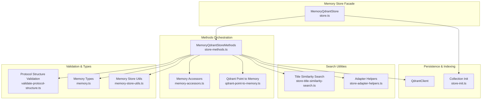
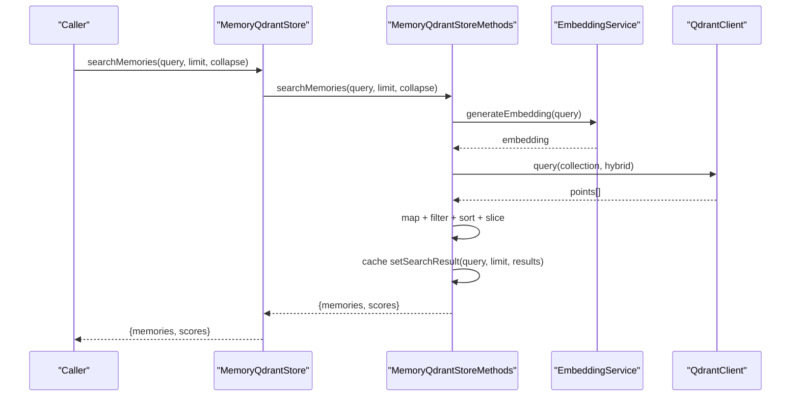
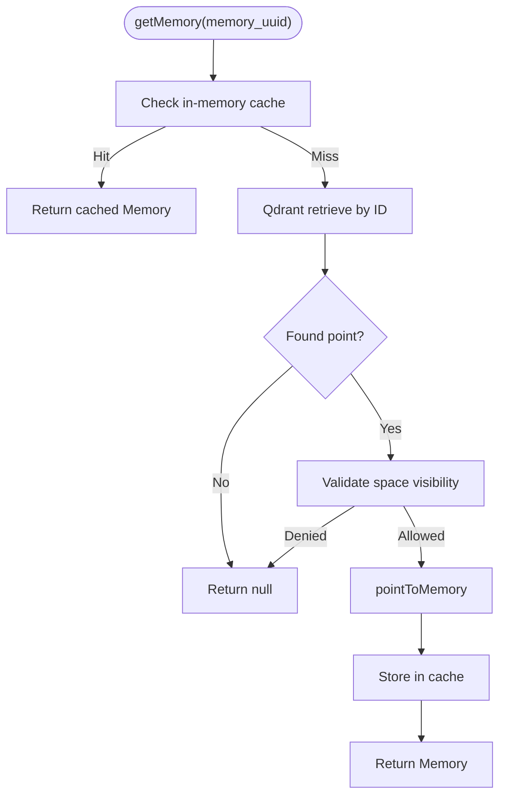
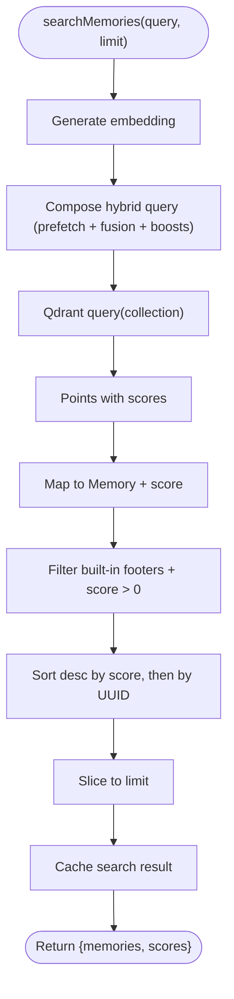
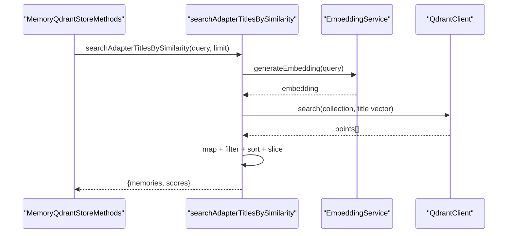
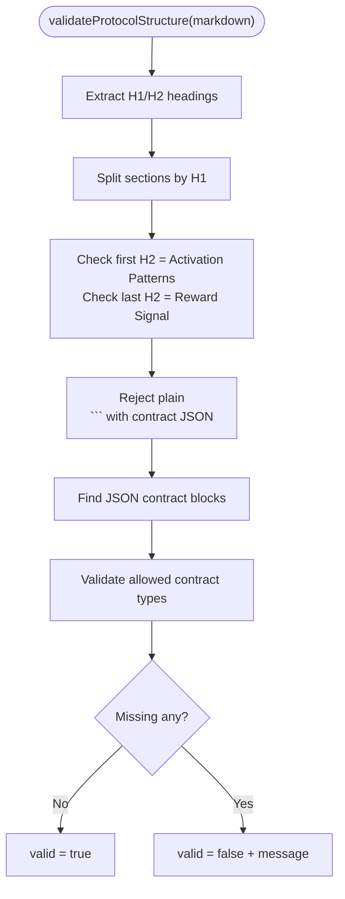
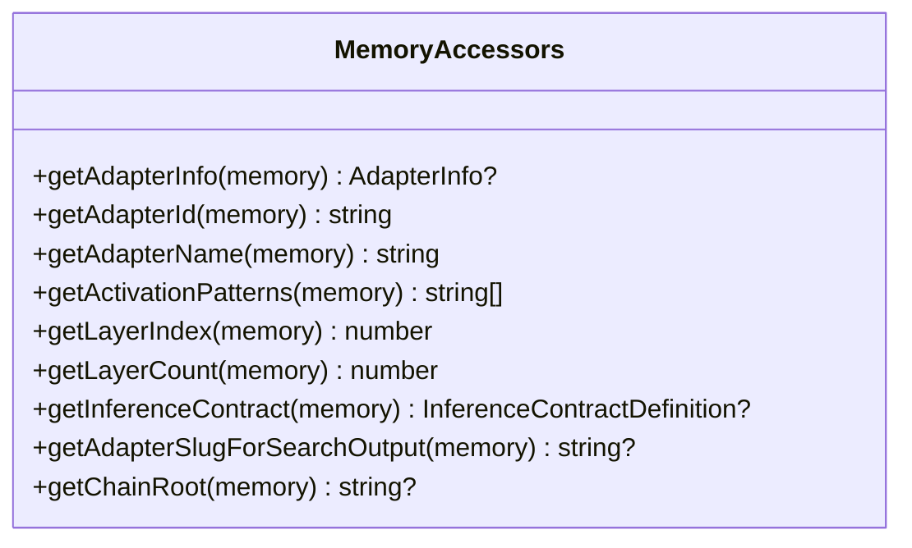
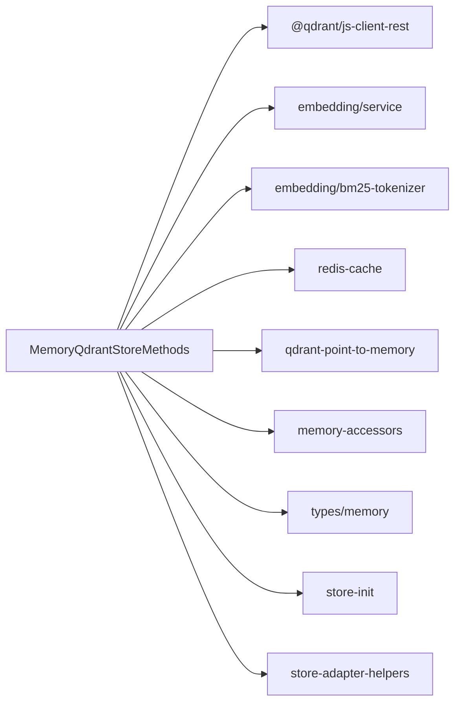

# Memory Storage Methods

<cite>
**Referenced Files in This Document**
- [store-methods.ts](file://src/services/memory/store-methods.ts)
- [store.ts](file://src/services/memory/store.ts)
- [store-title-similarity-search.ts](file://src/services/memory/store-title-similarity-search.ts)
- [qdrant-point-to-memory.ts](file://src/services/memory/qdrant-point-to-memory.ts)
- [memory-accessors.ts](file://src/services/memory/memory-accessors.ts)
- [validate-protocol-structure.ts](file://src/services/memory/validate-protocol-structure.ts)
- [store-init.ts](file://src/services/memory/store-init.ts)
- [memory.ts](file://src/types/memory.ts)
- [store-adapter-helpers.ts](file://src/services/memory/store-adapter-helpers.ts)
- [memory-store-utils.ts](file://src/utils/memory-store-utils.ts)
- [memory-metrics.ts](file://src/services/metrics/memory-metrics.ts)
</cite>

## Table of Contents
1. [Introduction](#introduction)
2. [Project Structure](#project-structure)
3. [Core Components](#core-components)
4. [Architecture Overview](#architecture-overview)
5. [Detailed Component Analysis](#detailed-component-analysis)
6. [Dependency Analysis](#dependency-analysis)
7. [Performance Considerations](#performance-considerations)
8. [Troubleshooting Guide](#troubleshooting-guide)
9. [Conclusion](#conclusion)

## Introduction
This document explains the memory storage methods component responsible for orchestrating CRUD operations, search functionality, and memory retrieval patterns against Qdrant. It focuses on the MemoryQdrantStoreMethods class and its role in:
- Retrieving individual memories with fresh vs cached data handling
- Performing hybrid similarity search with dense vectors, BM25, and textual boosts
- Executing title-based similarity search for adapter discovery
- Validating protocol structure and accessor utilities for memory metadata
- Supporting method chaining and robust error handling patterns
- Providing performance guidance for large-scale memory operations

## Project Structure
The memory storage stack is organized around a thin orchestration class (MemoryQdrantStoreMethods) backed by Qdrant, embedding services, and utility modules. The higher-level MemoryQdrantStore exposes a clean facade for consumers.



**Diagram sources**
- [store.ts:20-152](file://src/services/memory/store.ts#L20-L152)
- [store-methods.ts:25-298](file://src/services/memory/store-methods.ts#L25-L298)
- [store-title-similarity-search.ts:9-60](file://src/services/memory/store-title-similarity-search.ts#L9-L60)
- [qdrant-point-to-memory.ts:10-101](file://src/services/memory/qdrant-point-to-memory.ts#L10-L101)
- [memory-accessors.ts:3-42](file://src/services/memory/memory-accessors.ts#L3-L42)
- [store-init.ts:171-348](file://src/services/memory/store-init.ts#L171-L348)
- [validate-protocol-structure.ts:113-187](file://src/services/memory/validate-protocol-structure.ts#L113-L187)
- [memory.ts:99-125](file://src/types/memory.ts#L99-L125)
- [memory-store-utils.ts:6-94](file://src/utils/memory-store-utils.ts#L6-L94)
- [store-adapter-helpers.ts:112-172](file://src/services/memory/store-adapter-helpers.ts#L112-L172)

**Section sources**
- [store.ts:20-152](file://src/services/memory/store.ts#L20-L152)
- [store-methods.ts:25-298](file://src/services/memory/store-methods.ts#L25-L298)

## Core Components
- MemoryQdrantStoreMethods: Central orchestrator for memory retrieval, hybrid search, and title similarity search. Manages an in-process cache and delegates mapping to typed Memory objects.
- MemoryQdrantStore: Public facade exposing getMemory, searchMemories, and adapter/artifact storage operations.
- Title Similarity Search: Dedicated utility for adapter title similarity using a specialized vector.
- Qdrant Point to Memory Mapper: Converts Qdrant points to strongly-typed Memory objects with adapter and inference contract normalization.
- Memory Accessors: Pure getters for adapter info, activation patterns, layer indices, and slugs.
- Protocol Structure Validator: Validates adapter markdown structure prior to training.
- Store Initialization: Ensures collection existence, vector configuration, BM25 sparse vectors, and full-text indexes.

**Section sources**
- [store-methods.ts:25-298](file://src/services/memory/store-methods.ts#L25-L298)
- [store.ts:20-152](file://src/services/memory/store.ts#L20-L152)
- [store-title-similarity-search.ts:9-60](file://src/services/memory/store-title-similarity-search.ts#L9-L60)
- [qdrant-point-to-memory.ts:10-101](file://src/services/memory/qdrant-point-to-memory.ts#L10-L101)
- [memory-accessors.ts:3-42](file://src/services/memory/memory-accessors.ts#L3-L42)
- [validate-protocol-structure.ts:113-187](file://src/services/memory/validate-protocol-structure.ts#L113-L187)
- [store-init.ts:171-348](file://src/services/memory/store-init.ts#L171-L348)

## Architecture Overview
The MemoryQdrantStoreMethods class encapsulates the logic for:
- getMemory: returns cached memory if available; otherwise fetches from Qdrant and caches.
- getMemoryFresh: bypasses in-process cache to ensure freshest data after updates.
- searchMemories: performs hybrid dense/BM25 search, applies textual boosts, and caches results.
- searchAdapterTitlesBySimilarity: specialized similarity search over adapter titles using a dedicated vector.
- pointToMemory: maps Qdrant points to Memory with robust payload normalization.

```mermaid
classDiagram
class MemoryQdrantStoreMethods {
-client
-collection
-cache
-cacheLoaded
-url
-codeBlockProcessor
+invalidateLocalCache()
+getMemory(memory_uuid) Memory|null
+getMemoryFresh(memory_uuid) Memory|null
+searchMemories(query, limit, collapse) {memories,scores}
+searchAdapterTitlesBySimilarity(query, limit) {memories,scores}
-vectorSearch(query, limit) {memories,scores}
-pointToMemory(point) Memory
+buildHeaderMemoryAdapter(markdownDoc, llmModelId, now) Memory[]
}
class MemoryQdrantStore {
-client
-collection
-methods
-adapterStore
+getMemory(uuid, options) Memory|null
+searchMemories(query, limit, collapse) {memories,scores}
+getQdrantAccess() {client,collection}
}
class Memory {
+memory_uuid
+space_id
+label
+slug
+tags
+text
+llm_model_id
+created_at
+content_type
+artifact
+adapter
+inference_contract
}
MemoryQdrantStore --> MemoryQdrantStoreMethods : "uses"
MemoryQdrantStoreMethods --> Memory : "produces"
```

**Diagram sources**
- [store-methods.ts:25-298](file://src/services/memory/store-methods.ts#L25-L298)
- [store.ts:20-152](file://src/services/memory/store.ts#L20-L152)
- [memory.ts:99-125](file://src/types/memory.ts#L99-L125)

## Detailed Component Analysis

### MemoryQdrantStoreMethods: Retrieval and Search Orchestration
- In-memory cache: Maintains a Map keyed by memory_uuid with lazy loading and explicit invalidation.
- Fresh vs cached retrieval:
  - getMemory: checks cache first; if absent, queries Qdrant, validates space permissions, maps to Memory, and caches.
  - getMemoryFresh: bypasses cache and queries Qdrant directly.
- Hybrid search:
  - searchMemories: generates embeddings, composes a multi-leg hybrid query (dense primary/title/activation vectors plus BM25), applies textual boosts, filters built-in footers, sorts by score, and caches results.
  - vectorSearch: central implementation of hybrid search with fallback to dense search on failure.
- Title-based similarity search:
  - searchAdapterTitlesBySimilarity: computes embedding for the query, uses a dedicated title vector, applies space filtering, excludes built-in protocols, and returns top-k sorted by score.
- Mapping and accessors:
  - pointToMemory: robustly maps Qdrant points to Memory with adapter and inference contract normalization.
  - buildHeaderMemoryAdapter: builds Memory entries from markdown headers and metadata.



**Diagram sources**
- [store.ts:142-144](file://src/services/memory/store.ts#L142-L144)
- [store-methods.ts:99-109](file://src/services/memory/store-methods.ts#L99-L109)
- [store-methods.ts:126-264](file://src/services/memory/store-methods.ts#L126-L264)

**Section sources**
- [store-methods.ts:46-97](file://src/services/memory/store-methods.ts#L46-L97)
- [store-methods.ts:99-119](file://src/services/memory/store-methods.ts#L99-L119)
- [store-methods.ts:126-264](file://src/services/memory/store-methods.ts#L126-L264)

### getMemory and getMemoryFresh: Fresh vs Cached Data Handling
- getMemory:
  - Returns cached value if present.
  - Queries Qdrant by ID with payload inclusion and vector exclusion.
  - Validates space visibility against tenant context.
  - Maps to Memory and caches result.
- getMemoryFresh:
  - Skips cache and queries Qdrant directly.
  - Applies the same visibility and mapping logic.



**Diagram sources**
- [store-methods.ts:46-78](file://src/services/memory/store-methods.ts#L46-L78)

**Section sources**
- [store-methods.ts:46-78](file://src/services/memory/store-methods.ts#L46-L78)
- [store-methods.ts:81-97](file://src/services/memory/store-methods.ts#L81-L97)

### searchMemories: Hybrid Similarity Scoring
- Dense vectors: primary, title, and activation pattern vectors.
- Sparse vectors: BM25 indices computed from tokenized query.
- Fusion: reciprocal rank fusion across multiple prefetch legs.
- Textual boosts: adapter name, activation patterns, label, and tags.
- Filtering: space scope, layer index, and exclusion of built-in footer protocols.
- Sorting and slicing: by score descending, then by UUID tie-breaker.



**Diagram sources**
- [store-methods.ts:126-264](file://src/services/memory/store-methods.ts#L126-L264)

**Section sources**
- [store-methods.ts:126-264](file://src/services/memory/store-methods.ts#L126-L264)

### searchAdapterTitlesBySimilarity: Title-Based Similarity Search
- Computes embedding for the query string.
- Uses a dedicated title vector configured in Qdrant.
- Applies space filtering and excludes built-in protocols.
- Sorts by score and slices to limit.



**Diagram sources**
- [store-methods.ts:111-119](file://src/services/memory/store-methods.ts#L111-L119)
- [store-title-similarity-search.ts:9-60](file://src/services/memory/store-title-similarity-search.ts#L9-L60)

**Section sources**
- [store-methods.ts:111-119](file://src/services/memory/store-methods.ts#L111-L119)
- [store-title-similarity-search.ts:9-60](file://src/services/memory/store-title-similarity-search.ts#L9-L60)

### Memory Validation Patterns and Protocol Structure Validation
- Protocol structure validation ensures required sections and contract blocks, rejects mixed fences, and validates contract types.
- Used during adapter storage to prevent malformed adapters from entering the index.



**Diagram sources**
- [validate-protocol-structure.ts:113-187](file://src/services/memory/validate-protocol-structure.ts#L113-L187)

**Section sources**
- [validate-protocol-structure.ts:113-187](file://src/services/memory/validate-protocol-structure.ts#L113-L187)

### Accessor Methods for Different Memory Types
- Adapter info: id, name, activation patterns, layer index/count, chain root.
- Inference contract: type, required flag, and provider-specific fields.
- Slugs and labels: normalized for search output and chain roots.



**Diagram sources**
- [memory-accessors.ts:3-42](file://src/services/memory/memory-accessors.ts#L3-L42)

**Section sources**
- [memory-accessors.ts:3-42](file://src/services/memory/memory-accessors.ts#L3-L42)

### Method Chaining Examples
- Retrieval:
  - store.getMemory(uuid) returns a Memory or null.
  - store.getMemory(uuid, { fresh: true }) ensures a fresh fetch bypassing cache.
- Search:
  - store.searchMemories(query, limit) returns { memories, scores } suitable for UI rendering or downstream processing.
- Adapter storage:
  - store.storeAdapter(docs, llmModelId, { forceUpdate, protocolVersion, forkNewAdapter }) returns stored Memory entries.

These patterns enable fluent, declarative usage while keeping internal caching and validation transparent.

**Section sources**
- [store.ts:135-144](file://src/services/memory/store.ts#L135-L144)
- [store.ts:123-133](file://src/services/memory/store.ts#L123-L133)

## Dependency Analysis
- Internal dependencies:
  - MemoryQdrantStoreMethods depends on QdrantClient, embedding service, BM25 tokenizer, Redis cache service, and vector type utilities.
  - Mapping relies on qdrant-point-to-memory and memory-accessors.
  - Initialization ensures vector descriptors, BM25 sparse vectors, and full-text indexes.
- External dependencies:
  - Qdrant JS client for REST operations.
  - Embedding service for dense vector generation.
  - Redis cache service for search result caching and invalidation.



**Diagram sources**
- [store-methods.ts:1-24](file://src/services/memory/store-methods.ts#L1-L24)
- [store-init.ts:1-17](file://src/services/memory/store-init.ts#L1-L17)

**Section sources**
- [store-methods.ts:1-24](file://src/services/memory/store-methods.ts#L1-L24)
- [store-init.ts:1-17](file://src/services/memory/store-init.ts#L1-L17)

## Performance Considerations
- Caching:
  - In-process cache reduces repeated Qdrant retrievals for getMemory; use getMemoryFresh when immediate consistency is required.
  - Search results are cached to avoid recomputation of hybrid queries.
- Vector and index configuration:
  - Named vectors and BM25 sparse vectors are ensured during initialization; migrations preserve data and optimize hybrid search.
  - Full-text indexes on adapter_name_text, label_text, activation_patterns_text, and tags_text improve textual boosting performance.
- Hybrid query tuning:
  - Prefetch limits and fusion weights balance recall and latency.
  - Quantization rescore improves accuracy without increasing cost.
- Batch and pagination:
  - Scroll-based backfills and migrations process data in batches to avoid timeouts and excessive memory usage.
- Metrics:
  - Histograms track storage duration and adapter sizes to monitor performance trends.

[No sources needed since this section provides general guidance]

## Troubleshooting Guide
- Health checks:
  - MemoryQdrantStore.checkHealth provides a race-based timeout mechanism to detect connectivity issues.
- Error handling patterns:
  - Duplicate adapters and protected spaces trigger specific errors with structured payloads for UI guidance.
  - Similar adapter detection prevents accidental duplication by threshold-based similarity search.
  - Slug allocation handles collisions for author-supplied and auto-generated slugs.
- Logging and observability:
  - Structured logs capture collection resolution, vector configuration, and migration steps.
  - Metrics counters and histograms expose operation totals and durations.

**Section sources**
- [store.ts:59-121](file://src/services/memory/store.ts#L59-L121)
- [store-adapter-helpers.ts:52-93](file://src/services/memory/store-adapter-helpers.ts#L52-L93)
- [store-adapter-helpers.ts:112-172](file://src/services/memory/store-adapter-helpers.ts#L112-L172)
- [store-adapter-helpers.ts:201-254](file://src/services/memory/store-adapter-helpers.ts#L201-L254)
- [memory-store-utils.ts:6-23](file://src/utils/memory-store-utils.ts#L6-L23)
- [memory-store-utils.ts:30-72](file://src/utils/memory-store-utils.ts#L30-L72)
- [memory-store-utils.ts:74-94](file://src/utils/memory-store-utils.ts#L74-L94)
- [memory-metrics.ts:11-32](file://src/services/metrics/memory-metrics.ts#L11-L32)

## Conclusion
MemoryQdrantStoreMethods provides a robust, high-performance foundation for memory retrieval and search. Its hybrid search strategy, strong typing, and validation pipeline ensure reliable and scalable operations. By leveraging caching, proper indexing, and structured error handling, the system supports both interactive and batch workloads efficiently.