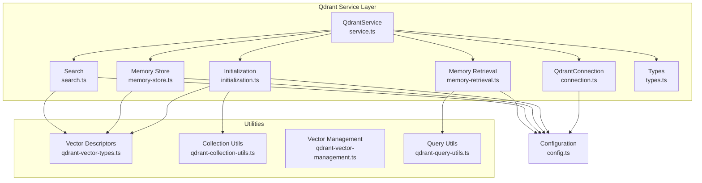
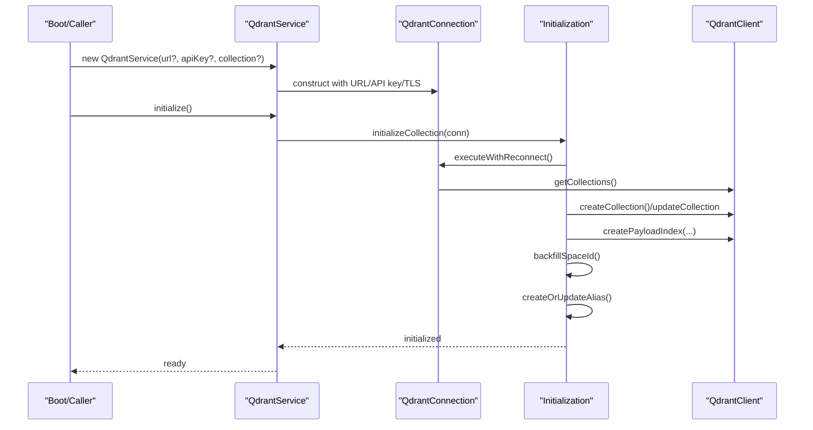
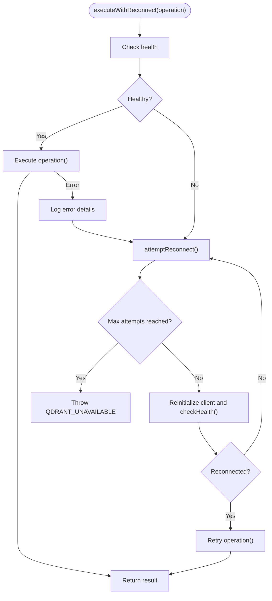
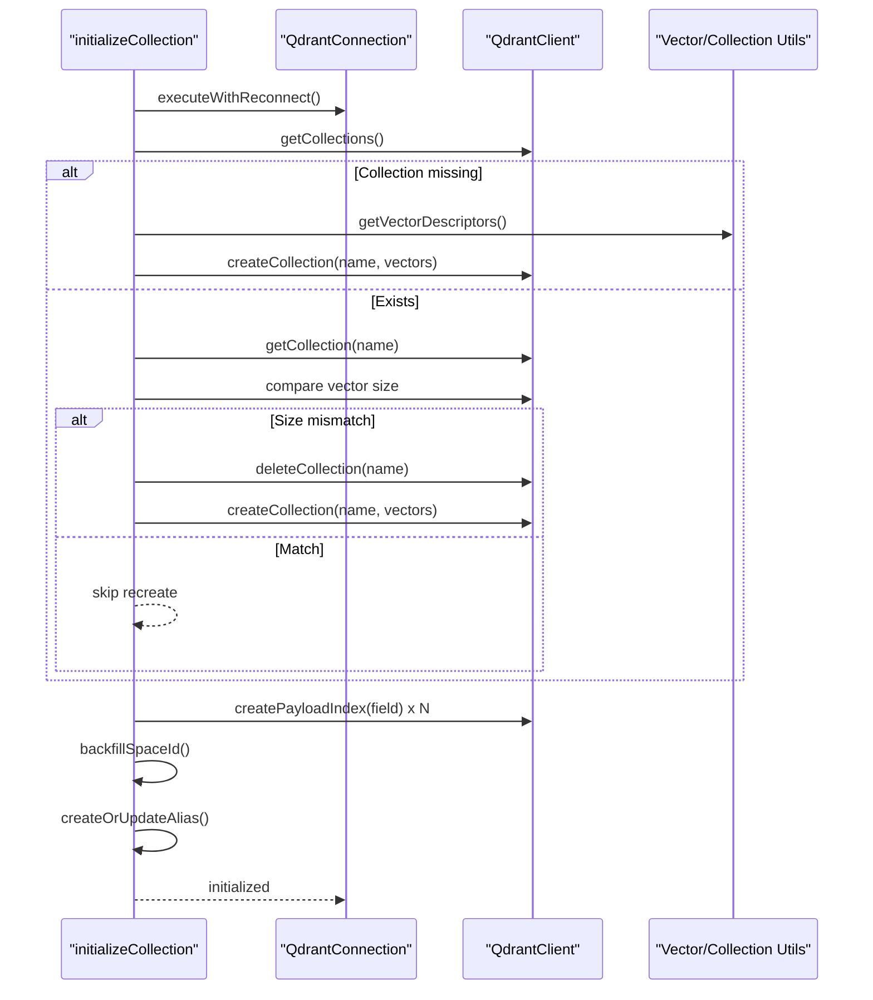
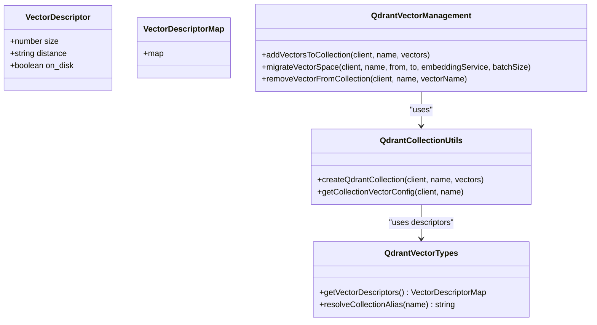
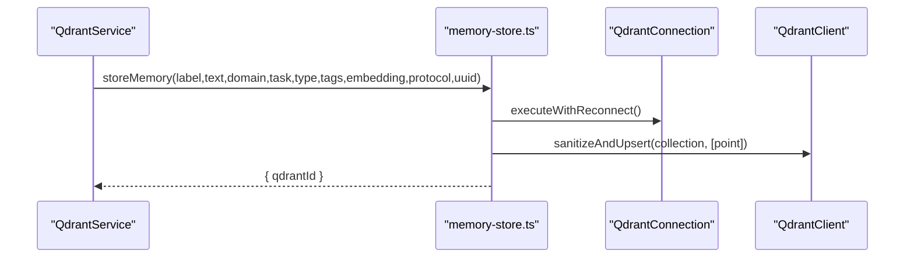
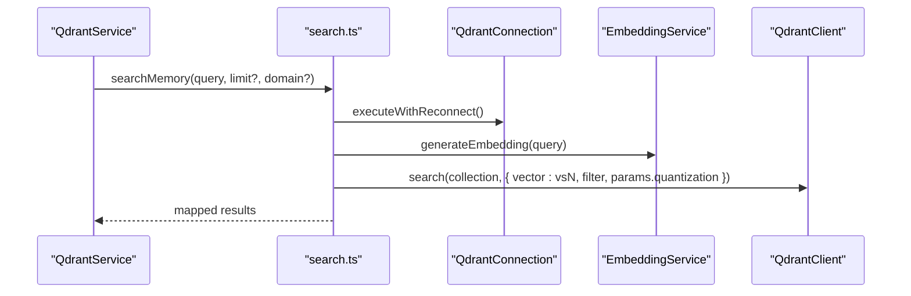
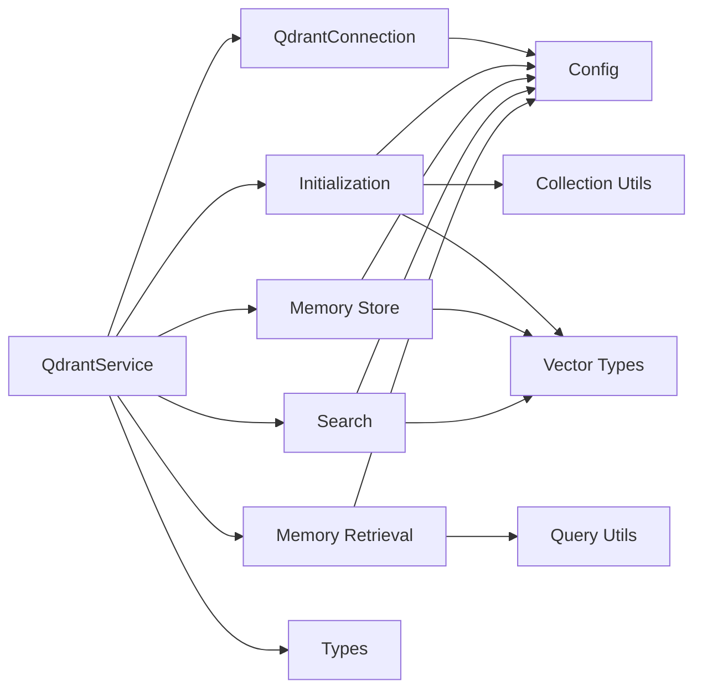

# Qdrant Integration Layer

<cite>
**Referenced Files in This Document**
- [service.ts](file://src/services/qdrant/service.ts)
- [connection.ts](file://src/services/qdrant/connection.ts)
- [initialization.ts](file://src/services/qdrant/initialization.ts)
- [index.ts](file://src/services/qdrant/index.ts)
- [config.ts](file://src/config.ts)
- [qdrant-vector-types.ts](file://src/utils/qdrant-vector-types.ts)
- [qdrant-collection-utils.ts](file://src/utils/qdrant-collection-utils.ts)
- [qdrant-vector-management.ts](file://src/utils/qdrant-vector-management.ts)
- [qdrant-query-utils.ts](file://src/utils/qdrant-query-utils.ts)
- [memory-store.ts](file://src/services/qdrant/memory-store.ts)
- [memory-retrieval.ts](file://src/services/qdrant/memory-retrieval.ts)
- [search.ts](file://src/services/qdrant/search.ts)
- [types.ts](file://src/services/qdrant/types.ts)
</cite>

## Table of Contents
1. [Introduction](#introduction)
2. [Project Structure](#project-structure)
3. [Core Components](#core-components)
4. [Architecture Overview](#architecture-overview)
5. [Detailed Component Analysis](#detailed-component-analysis)
6. [Dependency Analysis](#dependency-analysis)
7. [Performance Considerations](#performance-considerations)
8. [Troubleshooting Guide](#troubleshooting-guide)
9. [Conclusion](#conclusion)

## Introduction
This document explains the Qdrant integration layer in KAIROS MCP. It covers how the QdrantClient is configured with API key support, URL resolution, and collection alias management. It documents the initialization process including collection creation, vector size configuration, and distance metric settings. It also describes connection management patterns, health checks, error handling strategies, and provides examples of direct client access for boot injection scenarios. Finally, it addresses collection lifecycle management, resource cleanup, and performance optimization techniques.

## Project Structure
The Qdrant integration is organized around a service facade that composes a connection manager and specialized modules for initialization, storage, retrieval, search, and utilities. Environment-driven configuration supplies URLs, API keys, and collection names. Vector configuration is derived from the embedding dimension and applied consistently across initialization and runtime operations.

**Diagram sources**
- [service.ts:16-151](file://src/services/qdrant/service.ts#L16-L151)
- [connection.ts:11-131](file://src/services/qdrant/connection.ts#L11-L131)
- [initialization.ts:12-92](file://src/services/qdrant/initialization.ts#L12-L92)
- [memory-store.ts:14-126](file://src/services/qdrant/memory-store.ts#L14-L126)
- [memory-retrieval.ts:25-102](file://src/services/qdrant/memory-retrieval.ts#L25-L102)
- [search.ts:11-82](file://src/services/qdrant/search.ts#L11-L82)
- [types.ts:1-39](file://src/services/qdrant/types.ts#L1-L39)
- [qdrant-vector-types.ts:28-57](file://src/utils/qdrant-vector-types.ts#L28-L57)
- [qdrant-collection-utils.ts:7-39](file://src/utils/qdrant-collection-utils.ts#L7-L39)
- [qdrant-vector-management.ts:13-114](file://src/utils/qdrant-vector-management.ts#L13-L114)
- [qdrant-query-utils.ts:8-23](file://src/utils/qdrant-query-utils.ts#L8-L23)
- [config.ts:87-282](file://src/config.ts#L87-L282)

**Section sources**
- [service.ts:16-151](file://src/services/qdrant/service.ts#L16-L151)
- [connection.ts:11-131](file://src/services/qdrant/connection.ts#L11-L131)
- [initialization.ts:12-92](file://src/services/qdrant/initialization.ts#L12-L92)
- [config.ts:87-282](file://src/config.ts#L87-L282)

## Core Components
- QdrantService: Facade exposing initialization, memory store/retrieve/search, alias management, and listing/dropping collections. It delegates operations to specialized modules and exposes safe getters for client, collection name, URL, and API key.
- QdrantConnection: Encapsulates QdrantClient construction with API key and TLS options, health checks, and automatic reconnection with exponential backoff. Provides executeWithReconnect to wrap operations resiliently.
- Initialization: Creates or validates the collection, ensures payload indexes, backfills space_id, and manages aliases.
- Utilities: Vector descriptors, collection creation, vector management (add/migrate/remove), and query helpers.

**Section sources**
- [service.ts:16-151](file://src/services/qdrant/service.ts#L16-L151)
- [connection.ts:11-131](file://src/services/qdrant/connection.ts#L11-L131)
- [initialization.ts:12-92](file://src/services/qdrant/initialization.ts#L12-L92)
- [qdrant-vector-types.ts:28-57](file://src/utils/qdrant-vector-types.ts#L28-L57)
- [qdrant-collection-utils.ts:7-39](file://src/utils/qdrant-collection-utils.ts#L7-L39)
- [qdrant-vector-management.ts:13-114](file://src/utils/qdrant-vector-management.ts#L13-L114)

## Architecture Overview
The integration follows a layered pattern:
- Configuration layer resolves environment variables for URL, API key, collection name, and optional alias resolution.
- Connection layer builds the QdrantClient with TLS and API key support, performs health checks, and retries on failure.
- Service layer orchestrates initialization, storage, retrieval, and search, delegating to utilities for vector and collection management.
- Utilities centralize vector naming, collection creation, and vector lifecycle operations.

**Diagram sources**
- [service.ts:47-49](file://src/services/qdrant/service.ts#L47-L49)
- [initialization.ts:12-92](file://src/services/qdrant/initialization.ts#L12-L92)
- [connection.ts:98-131](file://src/services/qdrant/connection.ts#L98-L131)
- [qdrant-collection-utils.ts:7-39](file://src/utils/qdrant-collection-utils.ts#L7-L39)

## Detailed Component Analysis

### QdrantService
- Responsibilities:
  - Construct QdrantConnection with URL, API key, collection alias, and optional CA cert path.
  - Expose safe getters for client, collection name, URL, and API key.
  - Initialize collection, manage aliases, list/drop collections.
  - Delegate memory store, retrieval, search, updates, and quality/routing operations to specialized modules.
- Key behaviors:
  - Delegates all operations to modules via QdrantConnection.executeWithReconnect for resilience.
  - Provides createOrUpdateAlias and getCollections/dropCollection for lifecycle management.

**Section sources**
- [service.ts:16-151](file://src/services/qdrant/service.ts#L16-L151)

### QdrantConnection
- Client configuration:
  - URL and API key are passed to QdrantClient constructor.
  - For HTTPS, supports custom CA certificate via file path and enables rejectUnauthorized.
- Health checks:
  - checkHealth calls getCollections and toggles internal isHealthy flag.
- Reconnection:
  - executeWithReconnect wraps operations, logs failures, attempts exponential backoff reconnection, and throws KairosError on persistent failure.
- Resilience:
  - Tracks reconnect attempts and delays, resets counters on success.

**Diagram sources**
- [connection.ts:98-131](file://src/services/qdrant/connection.ts#L98-L131)

**Section sources**
- [connection.ts:11-131](file://src/services/qdrant/connection.ts#L11-L131)

### Initialization and Collection Lifecycle
- initializeCollection:
  - Validates health, checks collection existence, computes vector size from descriptors, creates collection if missing, verifies/updates vector config, creates payload indexes, backfills space_id, and optionally creates alias.
- createOrUpdateAlias:
  - Attempts multiple REST endpoints to create/update alias for compatibility across Qdrant versions.
- backfillSpaceId:
  - Scrolls points and upserts missing space_id in batches.
- getCollections/dropCollection:
  - Lists and drops collections with resilient execution.

**Diagram sources**
- [initialization.ts:12-92](file://src/services/qdrant/initialization.ts#L12-L92)
- [qdrant-collection-utils.ts:7-39](file://src/utils/qdrant-collection-utils.ts#L7-L39)
- [qdrant-vector-types.ts:28-35](file://src/utils/qdrant-vector-types.ts#L28-L35)

**Section sources**
- [initialization.ts:12-92](file://src/services/qdrant/initialization.ts#L12-L92)

### Vector Configuration and Management
- Vector descriptors:
  - Derived from embedding dimension; primary and named vectors for adapter title and activation patterns.
  - Supports alias resolution for collection names via resolveCollectionAlias.
- Collection creation:
  - createQdrantCollection accepts named vectors and sparse vectors configuration.
- Vector lifecycle:
  - addVectorsToCollection merges new vectors and safely migrates if updateCollection is unsupported.
  - migrateVectorSpace scrolls points, regenerates embeddings, and upserts into target vector.
  - removeVectorFromCollection rebuilds collection without the named vector (placeholder due to Qdrant limitations).

**Diagram sources**
- [qdrant-vector-types.ts:5-35](file://src/utils/qdrant-vector-types.ts#L5-L35)
- [qdrant-collection-utils.ts:7-39](file://src/utils/qdrant-collection-utils.ts#L7-L39)
- [qdrant-vector-management.ts:13-114](file://src/utils/qdrant-vector-management.ts#L13-L114)

**Section sources**
- [qdrant-vector-types.ts:28-57](file://src/utils/qdrant-vector-types.ts#L28-L57)
- [qdrant-collection-utils.ts:7-39](file://src/utils/qdrant-collection-utils.ts#L7-L39)
- [qdrant-vector-management.ts:13-114](file://src/utils/qdrant-vector-management.ts#L13-L114)

### Memory Store and Retrieval
- storeMemory:
  - Generates deterministic Qdrant IDs from URIs, constructs payload with quality metrics, and sanitizes/upserts points.
  - Invalidates caches and records metrics.
- retrieveById/getMemoryByUUID:
  - Enforces space-based access control, paginates with scroll, sorts adapter layers, and resolves slugs deterministically.
- Slug resolution:
  - findFirstStepMemoryUuidBySlug and findArtifactMemoryUuidBySlug handle ambiguity by precedence and disambiguation notes.

**Diagram sources**
- [memory-store.ts:14-126](file://src/services/qdrant/memory-store.ts#L14-L126)
- [connection.ts:98-131](file://src/services/qdrant/connection.ts#L98-L131)

**Section sources**
- [memory-store.ts:14-126](file://src/services/qdrant/memory-store.ts#L14-L126)
- [memory-retrieval.ts:25-102](file://src/services/qdrant/memory-retrieval.ts#L25-L102)
- [memory-retrieval.ts:152-200](file://src/services/qdrant/memory-retrieval.ts#L152-L200)
- [memory-retrieval.ts:228-301](file://src/services/qdrant/memory-retrieval.ts#L228-L301)
- [memory-retrieval.ts:303-340](file://src/services/qdrant/memory-retrieval.ts#L303-L340)

### Search
- searchMemory:
  - Generates query embedding, builds filters for tenant and domain, executes vector search against named vector, and maps results to standardized shape.
  - Records metrics and handles errors.

**Diagram sources**
- [search.ts:11-82](file://src/services/qdrant/search.ts#L11-L82)
- [connection.ts:98-131](file://src/services/qdrant/connection.ts#L98-L131)

**Section sources**
- [search.ts:11-82](file://src/services/qdrant/search.ts#L11-L82)

### Types and Aliasing
- UpsertResourceItem/UpsertResourceResult define resource upsert shapes.
- resolveCollectionAlias supports stable 'current' alias resolution via environment variables.

**Section sources**
- [types.ts:1-39](file://src/services/qdrant/types.ts#L1-L39)
- [qdrant-vector-types.ts:50-57](file://src/utils/qdrant-vector-types.ts#L50-L57)

## Dependency Analysis
- QdrantService depends on QdrantConnection and specialized modules for initialization, storage, retrieval, search, and listing.
- QdrantConnection depends on configuration for URL, API key, and TLS settings, and uses the QdrantClient REST SDK.
- Initialization depends on vector descriptors and collection utilities.
- Memory store/retrieval/search depend on tenant context, space filters, and vector naming conventions.
- Vector management utilities depend on collection utilities and embedding service for migrations.

**Diagram sources**
- [service.ts:1-151](file://src/services/qdrant/service.ts#L1-L151)
- [connection.ts:1-131](file://src/services/qdrant/connection.ts#L1-L131)
- [initialization.ts:1-92](file://src/services/qdrant/initialization.ts#L1-L92)
- [memory-store.ts:1-126](file://src/services/qdrant/memory-store.ts#L1-L126)
- [memory-retrieval.ts:1-340](file://src/services/qdrant/memory-retrieval.ts#L1-L340)
- [search.ts:1-82](file://src/services/qdrant/search.ts#L1-L82)
- [qdrant-vector-types.ts:1-57](file://src/utils/qdrant-vector-types.ts#L1-L57)
- [qdrant-collection-utils.ts:1-65](file://src/utils/qdrant-collection-utils.ts#L1-L65)
- [qdrant-query-utils.ts:1-23](file://src/utils/qdrant-query-utils.ts#L1-L23)
- [config.ts:87-282](file://src/config.ts#L87-L282)

**Section sources**
- [service.ts:1-151](file://src/services/qdrant/service.ts#L1-L151)
- [connection.ts:1-131](file://src/services/qdrant/connection.ts#L1-L131)
- [initialization.ts:1-92](file://src/services/qdrant/initialization.ts#L1-L92)
- [config.ts:87-282](file://src/config.ts#L87-L282)

## Performance Considerations
- Vector sizing and distance:
  - Vector descriptors specify Cosine distance and on_disk flags to optimize storage and scoring.
- Quantization:
  - Collections enable scalar quantization for memory efficiency.
- Rescoring:
  - Search params include quantization rescoring toggle controlled by environment.
- Pagination and batching:
  - Initialization backfills and vector management use batched scroll and upsert to avoid memory pressure.
- Metrics:
  - Dedicated metrics record operation counts and durations for Qdrant operations.

[No sources needed since this section provides general guidance]

## Troubleshooting Guide
- Health and connectivity:
  - Use checkHealth to verify collection availability; failures trigger reconnection attempts with exponential backoff.
- TLS and CA certificates:
  - For HTTPS, ensure QDRANT_CA_CERT_PATH points to a readable certificate file or rely on system CAs.
- API key authentication:
  - Provide QDRANT_API_KEY; it is automatically attached to client requests and alias creation attempts.
- Alias creation:
  - The system tries multiple endpoints to create/update alias; if all fail, manual alias creation is recommended.
- Vector configuration mismatches:
  - If vector size changes, initialization recreates the collection; for unsupported updates, vector management utilities provide safe migration paths.
- Error handling:
  - Operations throw KairosError with specific codes for unavailability and operation failures; logs include error details and timestamps.

**Section sources**
- [connection.ts:63-131](file://src/services/qdrant/connection.ts#L63-L131)
- [initialization.ts:98-125](file://src/services/qdrant/initialization.ts#L98-L125)
- [initialization.ts:177-183](file://src/services/qdrant/initialization.ts#L177-L183)
- [qdrant-vector-management.ts:28-114](file://src/utils/qdrant-vector-management.ts#L28-L114)

## Conclusion
The Qdrant integration layer in KAIROS MCP provides a robust, resilient, and configurable vector database interface. It supports secure connections with API keys and TLS, manages collection lifecycle with automatic initialization and aliasing, and offers efficient storage, retrieval, and search primitives. The design emphasizes safety through health checks, reconnection, and batched operations, while enabling flexible vector configuration and migration strategies.