# Service Initialization & Lifecycle

<cite>
**Referenced Files in This Document**
- [bootstrap.ts](file://src/bootstrap.ts)
- [index.ts](file://src/index.ts)
- [server.ts](file://src/server.ts)
- [config.ts](file://src/config.ts)
- [http-server.ts](file://src/http/http-server.ts)
- [http-server-startup.ts](file://src/http/http-server-startup.ts)
- [http-health-routes.ts](file://src/http/http-health-routes.ts)
- [metrics-server.ts](file://src/metrics-server.ts)
- [structured-logger.ts](file://src/utils/structured-logger.ts)
- [global-error-handlers.ts](file://src/utils/global-error-handlers.ts)
- [store.ts](file://src/services/memory/store.ts)
- [service.ts](file://src/services/qdrant/service.ts)
- [service.ts](file://src/services/embedding/service.ts)
- [mem-resources-boot.ts](file://src/resources/mem-resources-boot.ts)
</cite>

## Table of Contents
1. [Introduction](#introduction)
2. [Project Structure](#project-structure)
3. [Core Components](#core-components)
4. [Architecture Overview](#architecture-overview)
5. [Detailed Component Analysis](#detailed-component-analysis)
6. [Dependency Analysis](#dependency-analysis)
7. [Performance Considerations](#performance-considerations)
8. [Troubleshooting Guide](#troubleshooting-guide)
9. [Conclusion](#conclusion)

## Introduction
This document explains the KAIROS MCP service initialization and lifecycle management. It covers the bootstrap sequence from application startup to HTTP server boot, dependency injection patterns, service registration order, circular dependency prevention, environment configuration loading, health check coordination, graceful shutdown procedures, startup sequence diagrams, error handling during startup, service health monitoring, recovery mechanisms, metrics initialization, logging configuration, and operational readiness checks.

## Project Structure
The service follows a layered structure:
- Bootstrap layer initializes global error handlers and delegates to the main entrypoint.
- Application layer orchestrates environment loading, dependency initialization, and server startup.
- HTTP layer composes middleware, routes, and the MCP handler.
- Services layer encapsulates Qdrant, embedding, and memory stores.
- Utilities layer provides logging, metrics, and configuration.

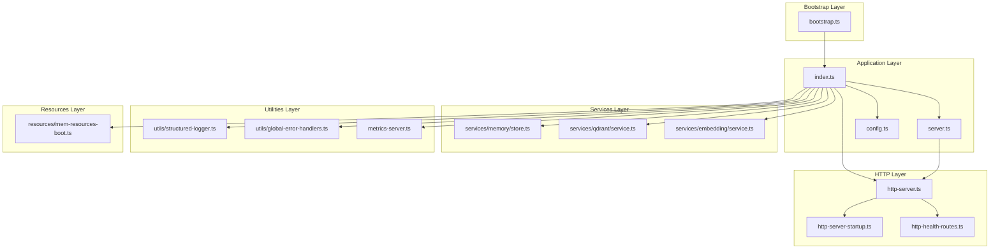

**Diagram sources**
- [bootstrap.ts:1-55](file://src/bootstrap.ts#L1-L55)
- [index.ts:1-139](file://src/index.ts#L1-L139)
- [server.ts:1-194](file://src/server.ts#L1-L194)
- [http-server.ts:1-59](file://src/http/http-server.ts#L1-L59)
- [http-server-startup.ts:1-28](file://src/http/http-server-startup.ts#L1-L28)
- [http-health-routes.ts:1-116](file://src/http/http-health-routes.ts#L1-L116)
- [metrics-server.ts:1-45](file://src/metrics-server.ts#L1-L45)
- [structured-logger.ts:1-346](file://src/utils/structured-logger.ts#L1-L346)
- [global-error-handlers.ts:1-62](file://src/utils/global-error-handlers.ts#L1-L62)
- [store.ts:1-152](file://src/services/memory/store.ts#L1-L152)
- [service.ts:1-152](file://src/services/qdrant/service.ts#L1-L152)
- [service.ts:1-293](file://src/services/embedding/service.ts#L1-L293)
- [mem-resources-boot.ts:1-137](file://src/resources/mem-resources-boot.ts#L1-L137)

**Section sources**
- [bootstrap.ts:1-55](file://src/bootstrap.ts#L1-L55)
- [index.ts:1-139](file://src/index.ts#L1-L139)
- [http-server.ts:1-59](file://src/http/http-server.ts#L1-L59)

## Core Components
- Bootstrap: Installs process-level error handlers and dynamically imports the main entrypoint to run the server.
- Application Orchestrator: Loads configuration, waits for Qdrant readiness, initializes memory store, probes embedding dimension, injects embedded resources, starts metrics server, and boots the HTTP server.
- HTTP Server: Composes middleware, routes, MCP handler, and error handlers; starts the HTTP server with robust error handling.
- Services: Qdrant service abstraction, embedding service, and memory store with health checks.
- Utilities: Structured logging with audit support, global error handlers, and a dedicated metrics server.

**Section sources**
- [bootstrap.ts:37-55](file://src/bootstrap.ts#L37-L55)
- [index.ts:74-134](file://src/index.ts#L74-L134)
- [http-server.ts:22-58](file://src/http/http-server.ts#L22-L58)
- [store.ts:59-121](file://src/services/memory/store.ts#L59-L121)
- [service.ts:1-152](file://src/services/qdrant/service.ts#L1-L152)
- [service.ts:1-293](file://src/services/embedding/service.ts#L1-L293)
- [structured-logger.ts:144-178](file://src/utils/structured-logger.ts#L144-L178)
- [global-error-handlers.ts:11-61](file://src/utils/global-error-handlers.ts#L11-L61)
- [metrics-server.ts:19-43](file://src/metrics-server.ts#L19-L43)

## Architecture Overview
The system initializes in a deterministic order:
1. Bootstrap installs global error handlers and invokes the main entrypoint.
2. The application loads configuration, probes embedding dimension, initializes the memory store, optionally triggers a snapshot, injects embedded resources, and starts the metrics server.
3. The HTTP server is started with middleware and routes.
4. Health checks coordinate Qdrant, Redis, and embedding provider readiness.
5. Metrics are exposed on a dedicated port for Prometheus scraping.

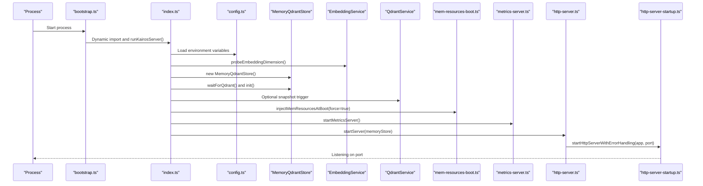

**Diagram sources**
- [bootstrap.ts:53-54](file://src/bootstrap.ts#L53-L54)
- [index.ts:74-134](file://src/index.ts#L74-L134)
- [config.ts:276-282](file://src/config.ts#L276-L282)
- [store.ts:55-57](file://src/services/memory/store.ts#L55-L57)
- [service.ts:288-292](file://src/services/embedding/service.ts#L288-L292)
- [mem-resources-boot.ts:10-137](file://src/resources/mem-resources-boot.ts#L10-L137)
- [metrics-server.ts:19-43](file://src/metrics-server.ts#L19-L43)
- [http-server.ts:50-58](file://src/http/http-server.ts#L50-L58)
- [http-server-startup.ts:10-28](file://src/http/http-server-startup.ts#L10-L28)

## Detailed Component Analysis

### Bootstrap and Global Error Handling
- Installs uncaught exception and unhandled rejection handlers early to capture import-time errors.
- Delegates to the main entrypoint to run the server.

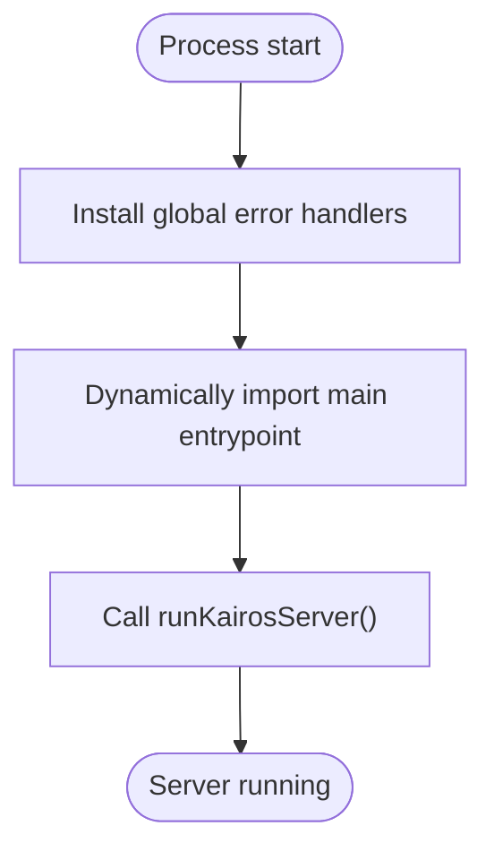

**Diagram sources**
- [bootstrap.ts:37-55](file://src/bootstrap.ts#L37-L55)

**Section sources**
- [bootstrap.ts:37-55](file://src/bootstrap.ts#L37-L55)
- [global-error-handlers.ts:11-61](file://src/utils/global-error-handlers.ts#L11-L61)

### Application Startup Orchestration
- Installs Qdrant fetch compatibility and global error handlers.
- Logs artifact directory hints.
- Creates the memory store and waits for Qdrant readiness with retries.
- Probes embedding dimension and logs it.
- Initializes the memory store and optionally triggers a snapshot.
- Injects embedded resources into Qdrant with force override.
- Starts the metrics server on a separate port.
- Boots the HTTP server.

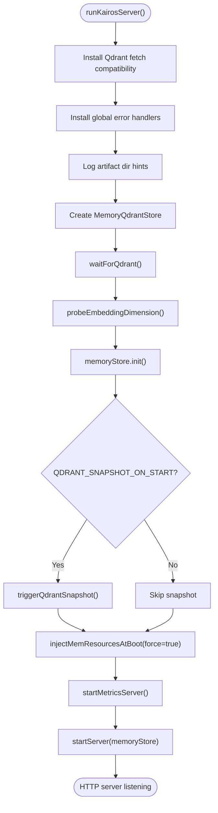

**Diagram sources**
- [index.ts:74-134](file://src/index.ts#L74-L134)
- [store.ts:59-121](file://src/services/memory/store.ts#L59-L121)
- [service.ts:288-292](file://src/services/embedding/service.ts#L288-L292)
- [mem-resources-boot.ts:10-137](file://src/resources/mem-resources-boot.ts#L10-L137)
- [metrics-server.ts:19-43](file://src/metrics-server.ts#L19-L43)
- [http-server.ts:50-58](file://src/http/http-server.ts#L50-L58)

**Section sources**
- [index.ts:74-134](file://src/index.ts#L74-L134)

### HTTP Server Composition and Startup
- Builds an Express app and registers middleware and routes in a specific order.
- Starts the HTTP server with robust error handling for port conflicts and other errors.

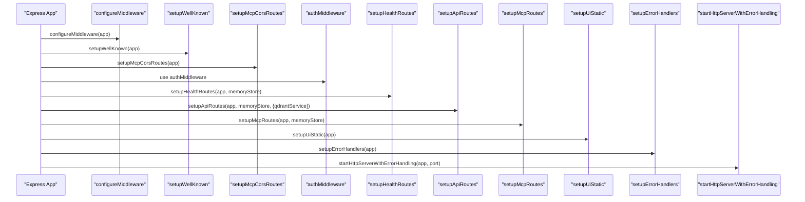

**Diagram sources**
- [http-server.ts:22-47](file://src/http/http-server.ts#L22-L47)
- [http-server-startup.ts:10-28](file://src/http/http-server-startup.ts#L10-L28)

**Section sources**
- [http-server.ts:22-58](file://src/http/http-server.ts#L22-L58)
- [http-server-startup.ts:10-28](file://src/http/http-server-startup.ts#L10-L28)

### Health Check Coordination
- The health endpoint validates Qdrant availability, optional Redis connectivity, and embedding provider health.
- It returns a 200 OK when all critical dependencies are healthy, otherwise 503 Service Unavailable.

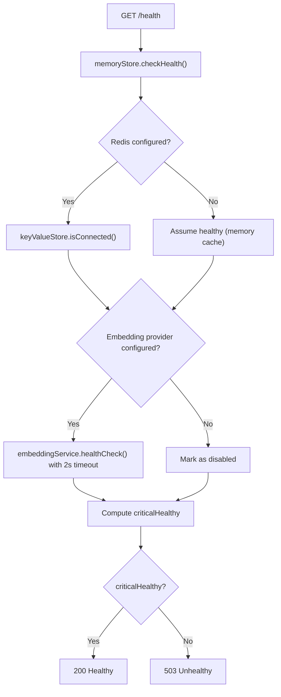

**Diagram sources**
- [http-health-routes.ts:13-89](file://src/http/http-health-routes.ts#L13-L89)
- [store.ts:59-121](file://src/services/memory/store.ts#L59-L121)
- [service.ts:254-256](file://src/services/embedding/service.ts#L254-L256)

**Section sources**
- [http-health-routes.ts:13-89](file://src/http/http-health-routes.ts#L13-L89)

### Metrics Initialization and Exposure
- A dedicated metrics server exposes the /metrics endpoint for Prometheus scraping.
- System metrics are imported to ensure they are registered at startup.

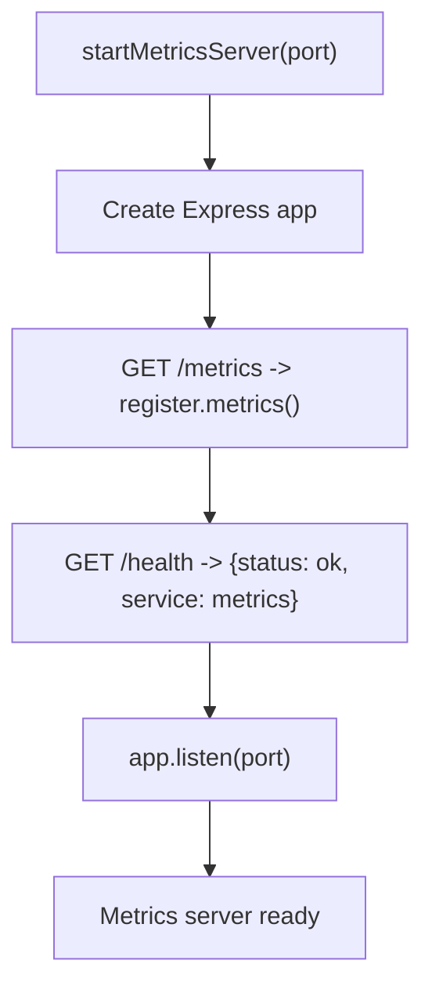

**Diagram sources**
- [metrics-server.ts:19-43](file://src/metrics-server.ts#L19-L43)

**Section sources**
- [metrics-server.ts:19-43](file://src/metrics-server.ts#L19-L43)

### Logging Configuration and Audit
- Structured logging integrates with Pino and supports audit logging to a file stream.
- HTTP access logging captures request metadata and response outcomes.
- Audit writes are sanitized and bounded to prevent log injection and excessive sizes.

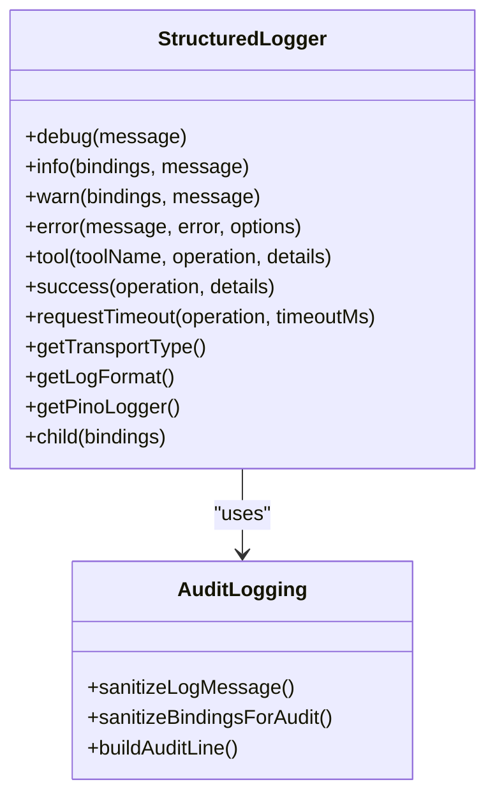

**Diagram sources**
- [structured-logger.ts:144-178](file://src/utils/structured-logger.ts#L144-L178)
- [structured-logger.ts:116-142](file://src/utils/structured-logger.ts#L116-L142)

**Section sources**
- [structured-logger.ts:144-178](file://src/utils/structured-logger.ts#L144-L178)
- [structured-logger.ts:116-142](file://src/utils/structured-logger.ts#L116-L142)

### Environment Configuration Loading
- Centralized environment parsing with required and optional variables.
- Validates authentication configuration when enabled.
- Provides typed getters for Qdrant URL, collection, and other settings.

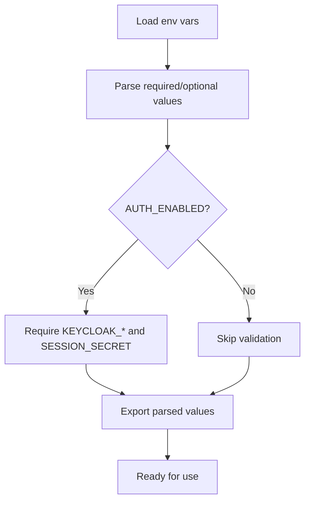

**Diagram sources**
- [config.ts:18-50](file://src/config.ts#L18-L50)
- [config.ts:229-241](file://src/config.ts#L229-L241)
- [config.ts:276-282](file://src/config.ts#L276-L282)

**Section sources**
- [config.ts:18-50](file://src/config.ts#L18-L50)
- [config.ts:229-241](file://src/config.ts#L229-L241)
- [config.ts:276-282](file://src/config.ts#L276-L282)

### Service Registration Order and Dependency Injection
- The MCP server is created and configured with tools and UI resources.
- Tools are registered in a specific order to ensure dependencies are satisfied.
- Resources and prompts are registered after tool registration.

```mermaid
sequenceDiagram
participant Server as "createServer()"
participant Tools as "register*Tool(...)"
participant UI as "register*UiResources(...)"
participant Docs as "registerDocsResources(...)"
participant Prompts as "registerPromptResources(...)"
Server->>Tools : registerActivateTool(...)
Server->>Tools : registerForwardTool(...)
Server->>Tools : registerTrainTool(...)
Server->>Tools : registerRewardTool(...)
Server->>Tools : registerTuneTool(...)
Server->>Tools : registerDeleteTool(...)
Server->>Tools : registerExportTool(...)
Server->>Tools : registerSpacesTool(...)
Server->>Server : installStrictToolsListHandler()
Server->>UI : registerSpacesUiResources(...)
Server->>UI : registerForwardUiResources(...)
Server->>UI : registerActivateUiResources(...)
Server->>Docs : bootstrapEmptyResourceHandlers(...)
Server->>Docs : registerDocsResources(...)
Server->>Prompts : registerPromptResources(...)
```

**Diagram sources**
- [server.ts:125-193](file://src/server.ts#L125-L193)

**Section sources**
- [server.ts:125-193](file://src/server.ts#L125-L193)

### Circular Dependency Prevention
- Services are constructed with explicit dependencies passed as parameters.
- The memory store holds references to the Qdrant client and methods, avoiding direct circular imports.
- The embedding service and Qdrant service are instantiated independently and reused via singletons.

**Section sources**
- [store.ts:29-53](file://src/services/memory/store.ts#L29-L53)
- [service.ts:16-49](file://src/services/qdrant/service.ts#L16-L49)
- [service.ts:38-45](file://src/services/embedding/service.ts#L38-L45)

### Graceful Shutdown Procedures
- The HTTP server listens for errors and exits the process on port conflicts or other fatal errors.
- Global error handlers mark non-zero exit codes to signal supervisors of failures.
- The metrics server runs independently and does not block application shutdown.

**Section sources**
- [http-server-startup.ts:17-25](file://src/http/http-server-startup.ts#L17-L25)
- [global-error-handlers.ts:15-28](file://src/utils/global-error-handlers.ts#L15-L28)
- [metrics-server.ts:39-42](file://src/metrics-server.ts#L39-L42)

## Dependency Analysis
The following diagram shows key dependencies among core modules:

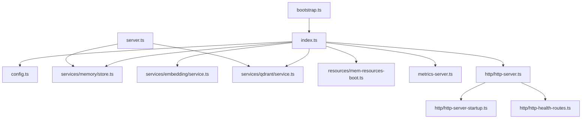

**Diagram sources**
- [index.ts:13-27](file://src/index.ts#L13-L27)
- [http-server.ts:6-19](file://src/http/http-server.ts#L6-L19)
- [server.ts:8-40](file://src/server.ts#L8-L40)
- [bootstrap.ts:53-54](file://src/bootstrap.ts#L53-L54)

**Section sources**
- [index.ts:13-27](file://src/index.ts#L13-L27)
- [http-server.ts:6-19](file://src/http/http-server.ts#L6-L19)
- [server.ts:8-40](file://src/server.ts#L8-L40)
- [bootstrap.ts:53-54](file://src/bootstrap.ts#L53-L54)

## Performance Considerations
- Health checks bound embedding provider checks to a short timeout to keep /health responsive.
- Metrics server runs on a separate port to avoid impacting application performance.
- Embedding dimension probing occurs at startup to cache the resolved dimension and reduce runtime overhead.
- Qdrant health checks use timeouts to prevent long blocking during readiness.

[No sources needed since this section provides general guidance]

## Troubleshooting Guide
- Fatal startup errors: The application logs a fatal error and sets a non-zero exit code to signal failure to supervisors.
- Port conflicts: The HTTP server detects port-in-use errors and exits with a clear message.
- Global errors: Uncaught exceptions and unhandled rejections are captured and logged; the process exit code is set accordingly.
- Health endpoint: Use /health to verify Qdrant, Redis, and embedding provider status; it returns 200 when healthy, 503 otherwise.
- Metrics endpoint: Use /metrics on the metrics server port for Prometheus scraping.

**Section sources**
- [index.ts:122-133](file://src/index.ts#L122-L133)
- [http-server-startup.ts:17-25](file://src/http/http-server-startup.ts#L17-L25)
- [global-error-handlers.ts:15-28](file://src/utils/global-error-handlers.ts#L15-L28)
- [http-health-routes.ts:13-89](file://src/http/http-health-routes.ts#L13-L89)
- [metrics-server.ts:23-32](file://src/metrics-server.ts#L23-L32)

## Conclusion
KAIROS MCP implements a robust initialization and lifecycle management strategy. The bootstrap layer ensures global error handling is installed early, the application orchestrator coordinates environment loading, dependency initialization, and server startup, and the HTTP layer composes middleware and routes with health checks and error handling. Dedicated metrics exposure, structured logging, and health coordination provide operational visibility and reliability. The design prevents circular dependencies through explicit dependency passing and centralized configuration.