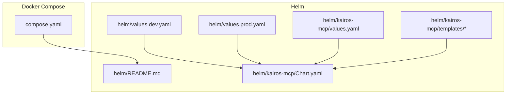
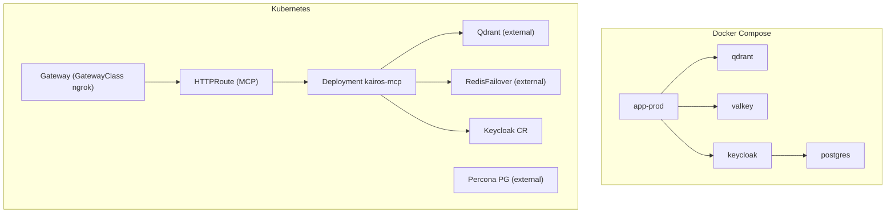
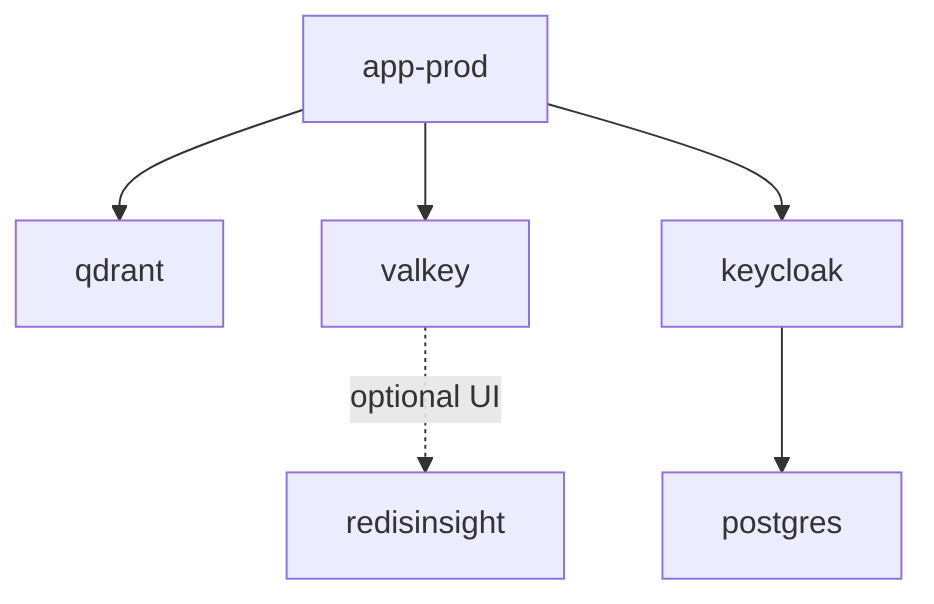
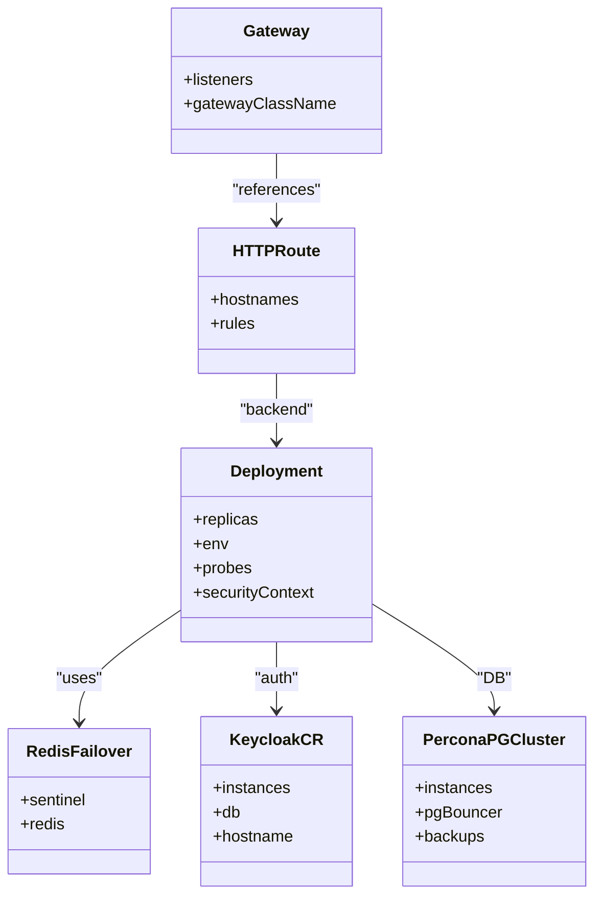
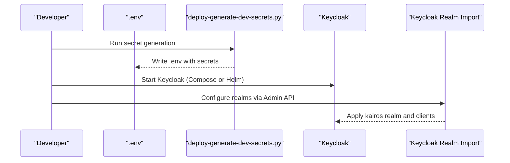
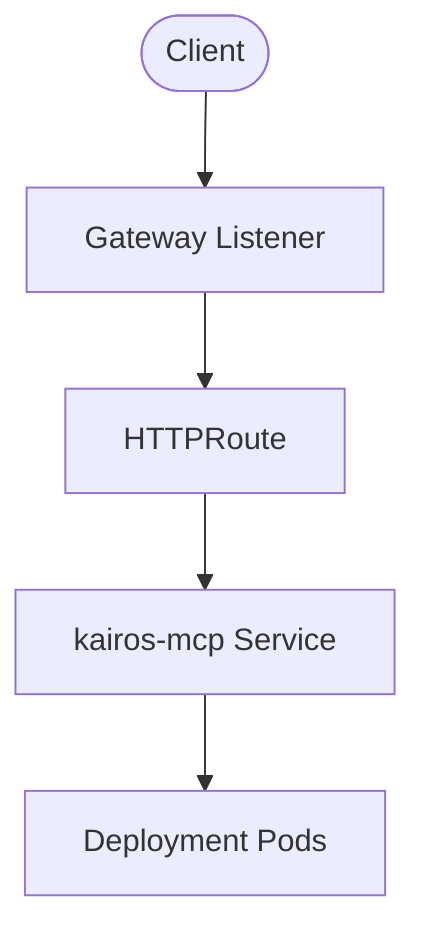
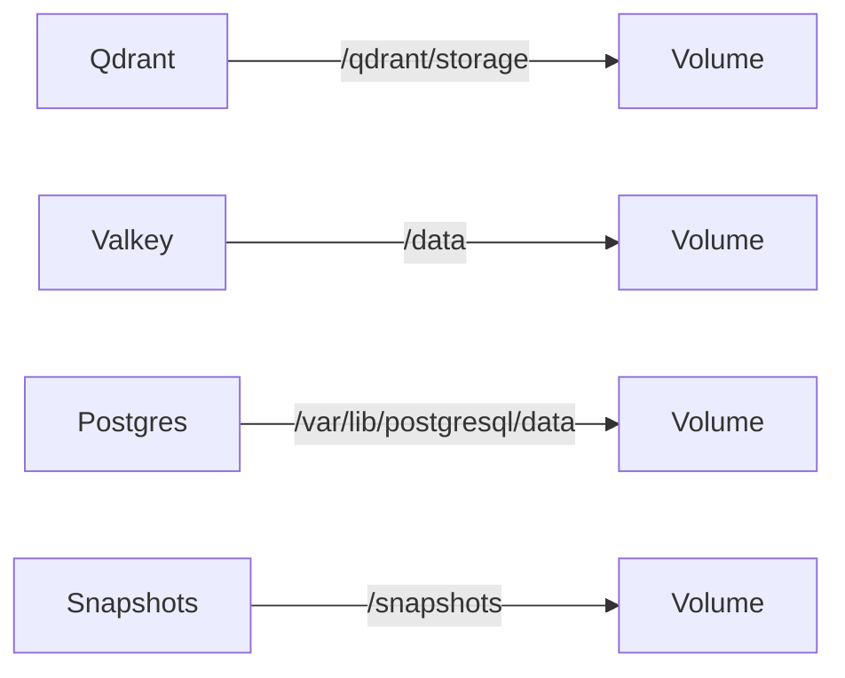
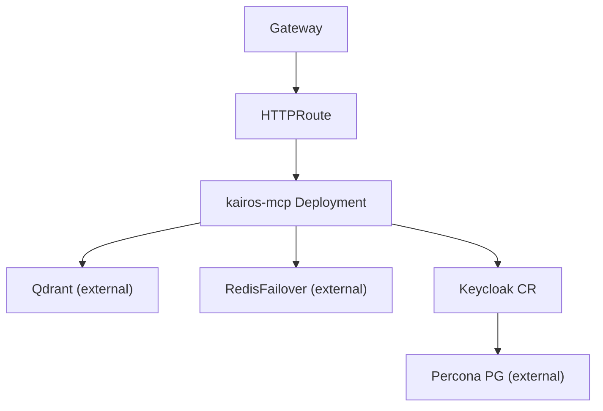

# Deployment & Infrastructure

<cite>
**Referenced Files in This Document**
- [compose.yaml](file://compose.yaml)
- [helm/README.md](file://helm/README.md)
- [helm/values.dev.yaml](file://helm/values.dev.yaml)
- [helm/values.prod.yaml](file://helm/values.prod.yaml)
- [helm/kairos-mcp/Chart.yaml](file://helm/kairos-mcp/Chart.yaml)
- [helm/kairos-mcp/values.yaml](file://helm/kairos-mcp/values.yaml)
- [helm/kairos-mcp/templates/kairos-mcp-deployment.yaml](file://helm/kairos-mcp/templates/kairos-mcp-deployment.yaml)
- [helm/kairos-mcp/templates/gateway.yaml](file://helm/kairos-mcp/templates/gateway.yaml)
- [helm/kairos-mcp/templates/httproute-mcp.yaml](file://helm/kairos-mcp/templates/httproute-mcp.yaml)
- [helm/kairos-mcp/templates/redis-failover-cr.yaml](file://helm/kairos-mcp/templates/redis-failover-cr.yaml)
- [helm/kairos-mcp/templates/keycloak-cr.yaml](file://helm/kairos-mcp/templates/keycloak-cr.yaml)
- [helm/kairos-mcp/templates/postgres-cluster-cr.yaml](file://helm/kairos-mcp/templates/postgres-cluster-cr.yaml)
- [helm/kairos-mcp/files/kairos-realm.json](file://helm/kairos-mcp/files/kairos-realm.json)
- [scripts/deploy-generate-dev-secrets.py](file://scripts/deploy-generate-dev-secrets.py)
- [scripts/deploy-configure-keycloak-realms.py](file://scripts/deploy-configure-keycloak-realms.py)
- [docs/install/docker-compose-full-stack.md](file://docs/install/docker-compose-full-stack.md)
</cite>

## Table of Contents
1. [Introduction](#introduction)
2. [Project Structure](#project-structure)
3. [Core Components](#core-components)
4. [Architecture Overview](#architecture-overview)
5. [Detailed Component Analysis](#detailed-component-analysis)
6. [Dependency Analysis](#dependency-analysis)
7. [Performance Considerations](#performance-considerations)
8. [Troubleshooting Guide](#troubleshooting-guide)
9. [Conclusion](#conclusion)
10. [Appendices](#appendices)

## Introduction
This document describes the KAIROS MCP deployment infrastructure across containerized environments. It covers:
- Docker Compose single-node development to fullstack local topology
- Kubernetes Helm chart for production-scale deployments
- Infrastructure components: Qdrant vector database, Redis/Valkey cache, Keycloak identity provider, and optional NGINX-style gateway via Kubernetes Gateway API
- Deployment topology progression from development to production
- Scaling, load balancing, high availability, and secrets management
- Provisioning automation and environment-specific configuration

## Project Structure
The deployment assets are organized into two primary paths:
- Docker Compose: a single compose file defines services and profiles for quick local setups
- Helm: a layered approach with operator bootstrapping, infrastructure bootstrap, and the application chart

**Diagram sources**
- [compose.yaml:1-183](file://compose.yaml#L1-L183)
- [helm/README.md:1-18](file://helm/README.md#L1-L18)
- [helm/values.dev.yaml:1-83](file://helm/values.dev.yaml#L1-L83)
- [helm/values.prod.yaml:1-94](file://helm/values.prod.yaml#L1-L94)
- [helm/kairos-mcp/Chart.yaml:1-23](file://helm/kairos-mcp/Chart.yaml#L1-L23)
- [helm/kairos-mcp/values.yaml:1-279](file://helm/kairos-mcp/values.yaml#L1-L279)
- [helm/kairos-mcp/templates/kairos-mcp-deployment.yaml:1-174](file://helm/kairos-mcp/templates/kairos-mcp-deployment.yaml#L1-L174)

**Section sources**
- [compose.yaml:1-183](file://compose.yaml#L1-L183)
- [helm/README.md:1-18](file://helm/README.md#L1-L18)
- [helm/kairos-mcp/Chart.yaml:1-23](file://helm/kairos-mcp/Chart.yaml#L1-L23)

## Core Components
- Application service: runs the KAIROS MCP server with health checks and environment-driven configuration
- Vector database: Qdrant with persistent storage and snapshot support
- Cache: Valkey (Redis-compatible) with password protection and optional UI
- Identity provider: Keycloak with Postgres backing store and realm configuration
- Gateway: Kubernetes Gateway API with optional TLS termination and route definitions
- Embedded model runtime: optional Ollama for local embeddings

These components are orchestrated via Compose profiles and Helm values, enabling flexible topologies from single-node development to production-grade HA deployments.

**Section sources**
- [compose.yaml:10-183](file://compose.yaml#L10-L183)
- [helm/kairos-mcp/values.yaml:39-279](file://helm/kairos-mcp/values.yaml#L39-L279)
- [helm/kairos-mcp/templates/kairos-mcp-deployment.yaml:68-173](file://helm/kairos-mcp/templates/kairos-mcp-deployment.yaml#L68-L173)

## Architecture Overview
The deployment architecture supports two primary modes:
- Docker Compose: single-node development with optional fullstack services
- Kubernetes Helm: production-grade with operators, managed infrastructure, and Gateway API routing

**Diagram sources**
- [compose.yaml:10-183](file://compose.yaml#L10-L183)
- [helm/kairos-mcp/templates/gateway.yaml:1-48](file://helm/kairos-mcp/templates/gateway.yaml#L1-L48)
- [helm/kairos-mcp/templates/httproute-mcp.yaml:1-37](file://helm/kairos-mcp/templates/httproute-mcp.yaml#L1-L37)
- [helm/kairos-mcp/templates/kairos-mcp-deployment.yaml:68-173](file://helm/kairos-mcp/templates/kairos-mcp-deployment.yaml#L68-L173)
- [helm/kairos-mcp/templates/redis-failover-cr.yaml:1-19](file://helm/kairos-mcp/templates/redis-failover-cr.yaml#L1-L19)
- [helm/kairos-mcp/templates/keycloak-cr.yaml:1-106](file://helm/kairos-mcp/templates/keycloak-cr.yaml#L1-L106)
- [helm/kairos-mcp/templates/postgres-cluster-cr.yaml:1-47](file://helm/kairos-mcp/templates/postgres-cluster-cr.yaml#L1-L47)

## Detailed Component Analysis

### Docker Compose Topology
- Profiles:
  - Mini: app + Qdrant only
  - Fullstack: app + Qdrant + Valkey + Keycloak + Postgres
  - Optional UI: Redis Insight for Valkey
- Networking:
  - Bridge network for service discovery by service name
- Persistence:
  - Named volumes for Qdrant, Valkey, Postgres, and snapshots
- Authentication:
  - Keycloak admin bootstrap and Postgres backing store
- Health checks:
  - Qdrant, Valkey, Postgres, and app-prod health probes

**Diagram sources**
- [compose.yaml:10-183](file://compose.yaml#L10-L183)

**Section sources**
- [compose.yaml:10-183](file://compose.yaml#L10-L183)
- [docs/install/docker-compose-full-stack.md:1-90](file://docs/install/docker-compose-full-stack.md#L1-L90)

### Kubernetes Helm Chart
- Chart metadata and dependencies:
  - Application chart with Qdrant and Valkey dependencies
- Values:
  - Global, HA, app, gateway, qdrant, redis, keycloak, postgres, monitoring, and embedding configuration
- Templates:
  - Deployment with probes, anti-affinity, and environment variables
  - Gateway and HTTPRoute for ingress
  - RedisFailover, Keycloak CR, and PostgresCluster CR
- Secrets and embedding:
  - Session secret via existing secret; embedding API key via secret reference

**Diagram sources**
- [helm/kairos-mcp/values.yaml:39-279](file://helm/kairos-mcp/values.yaml#L39-L279)
- [helm/kairos-mcp/templates/kairos-mcp-deployment.yaml:1-174](file://helm/kairos-mcp/templates/kairos-mcp-deployment.yaml#L1-L174)
- [helm/kairos-mcp/templates/gateway.yaml:1-48](file://helm/kairos-mcp/templates/gateway.yaml#L1-L48)
- [helm/kairos-mcp/templates/httproute-mcp.yaml:1-37](file://helm/kairos-mcp/templates/httproute-mcp.yaml#L1-L37)
- [helm/kairos-mcp/templates/redis-failover-cr.yaml:1-19](file://helm/kairos-mcp/templates/redis-failover-cr.yaml#L1-L19)
- [helm/kairos-mcp/templates/keycloak-cr.yaml:1-106](file://helm/kairos-mcp/templates/keycloak-cr.yaml#L1-L106)
- [helm/kairos-mcp/templates/postgres-cluster-cr.yaml:1-47](file://helm/kairos-mcp/templates/postgres-cluster-cr.yaml#L1-L47)

**Section sources**
- [helm/kairos-mcp/Chart.yaml:1-23](file://helm/kairos-mcp/Chart.yaml#L1-L23)
- [helm/kairos-mcp/values.yaml:1-279](file://helm/kairos-mcp/values.yaml#L1-L279)
- [helm/kairos-mcp/templates/kairos-mcp-deployment.yaml:1-174](file://helm/kairos-mcp/templates/kairos-mcp-deployment.yaml#L1-L174)
- [helm/kairos-mcp/templates/gateway.yaml:1-48](file://helm/kairos-mcp/templates/gateway.yaml#L1-L48)
- [helm/kairos-mcp/templates/httproute-mcp.yaml:1-37](file://helm/kairos-mcp/templates/httproute-mcp.yaml#L1-L37)
- [helm/kairos-mcp/templates/redis-failover-cr.yaml:1-19](file://helm/kairos-mcp/templates/redis-failover-cr.yaml#L1-L19)
- [helm/kairos-mcp/templates/keycloak-cr.yaml:1-106](file://helm/kairos-mcp/templates/keycloak-cr.yaml#L1-L106)
- [helm/kairos-mcp/templates/postgres-cluster-cr.yaml:1-47](file://helm/kairos-mcp/templates/postgres-cluster-cr.yaml#L1-L47)

### Authentication and Realm Management
- Keycloak CR provisions the identity provider with hostname, DB, and proxy settings
- Realm JSON defines groups, client scopes, and clients; includes OIDC group membership mapper
- Automation scripts generate secrets and configure realms via Admin API

**Diagram sources**
- [scripts/deploy-generate-dev-secrets.py:126-181](file://scripts/deploy-generate-dev-secrets.py#L126-L181)
- [scripts/deploy-configure-keycloak-realms.py:235-313](file://scripts/deploy-configure-keycloak-realms.py#L235-L313)
- [helm/kairos-mcp/files/kairos-realm.json:1-216](file://helm/kairos-mcp/files/kairos-realm.json#L1-L216)

**Section sources**
- [scripts/deploy-generate-dev-secrets.py:1-181](file://scripts/deploy-generate-dev-secrets.py#L1-L181)
- [scripts/deploy-configure-keycloak-realms.py:1-800](file://scripts/deploy-configure-keycloak-realms.py#L1-L800)
- [helm/kairos-mcp/files/kairos-realm.json:1-216](file://helm/kairos-mcp/files/kairos-realm.json#L1-L216)

### Network and Routing
- Docker Compose:
  - Services exposed on localhost with optional UI for Valkey
- Kubernetes:
  - Gateway with HTTP/HTTPS listeners and TLS termination
  - HTTPRoute for MCP path and Keycloak path
  - ReferenceGrant for cross-namespace references

**Diagram sources**
- [helm/kairos-mcp/templates/gateway.yaml:1-48](file://helm/kairos-mcp/templates/gateway.yaml#L1-L48)
- [helm/kairos-mcp/templates/httproute-mcp.yaml:1-37](file://helm/kairos-mcp/templates/httproute-mcp.yaml#L1-L37)

**Section sources**
- [helm/kairos-mcp/templates/gateway.yaml:1-48](file://helm/kairos-mcp/templates/gateway.yaml#L1-L48)
- [helm/kairos-mcp/templates/httproute-mcp.yaml:1-37](file://helm/kairos-mcp/templates/httproute-mcp.yaml#L1-L37)

### Data Persistence Patterns
- Qdrant:
  - Persistent volume mounted under /qdrant/storage
  - Snapshot directory for backups
- Valkey:
  - Persistent volume mounted under /data
  - Password-protected via environment variable
- Postgres:
  - Persistent volume under /var/lib/postgresql/data
- Helm:
  - External managed clusters for Qdrant, Redis, Keycloak, and Postgres

**Diagram sources**
- [compose.yaml:59-104](file://compose.yaml#L59-L104)
- [helm/kairos-mcp/templates/kairos-mcp-deployment.yaml:167-173](file://helm/kairos-mcp/templates/kairos-mcp-deployment.yaml#L167-L173)

**Section sources**
- [compose.yaml:59-104](file://compose.yaml#L59-L104)
- [helm/kairos-mcp/templates/kairos-mcp-deployment.yaml:167-173](file://helm/kairos-mcp/templates/kairos-mcp-deployment.yaml#L167-L173)

## Dependency Analysis
- Compose:
  - app-prod depends on qdrant; valkey and keycloak are optional via profiles
- Helm:
  - Deployment depends on external Qdrant, RedisFailover, Keycloak CR, and PostgresCluster CR
  - Gateway and HTTPRoute define ingress dependencies
- Secrets and embedding:
  - Session secret and embedding API key are configured via values and templates

**Diagram sources**
- [helm/kairos-mcp/values.yaml:123-244](file://helm/kairos-mcp/values.yaml#L123-L244)
- [helm/kairos-mcp/templates/kairos-mcp-deployment.yaml:68-173](file://helm/kairos-mcp/templates/kairos-mcp-deployment.yaml#L68-L173)
- [helm/kairos-mcp/templates/gateway.yaml:1-48](file://helm/kairos-mcp/templates/gateway.yaml#L1-L48)
- [helm/kairos-mcp/templates/httproute-mcp.yaml:1-37](file://helm/kairos-mcp/templates/httproute-mcp.yaml#L1-L37)

**Section sources**
- [helm/kairos-mcp/values.yaml:123-244](file://helm/kairos-mcp/values.yaml#L123-L244)
- [helm/kairos-mcp/templates/kairos-mcp-deployment.yaml:68-173](file://helm/kairos-mcp/templates/kairos-mcp-deployment.yaml#L68-L173)

## Performance Considerations
- Horizontal scaling:
  - Kubernetes: replica count and HPA for app and Qdrant
  - Anti-affinity to spread pods across nodes
- Resource management:
  - CPU/memory requests/limits for app
  - VPA for automatic tuning (disabled by default)
- Storage sizing:
  - Postgres and backups sized via values
  - Qdrant memory tuned via environment variables
- Caching:
  - Valkey with LRU eviction and persistence

[No sources needed since this section provides general guidance]

## Troubleshooting Guide
- Health checks:
  - Qdrant, Valkey, Postgres, and app-prod include health probes
- Logs and readiness:
  - Startup/liveness/readiness probes configured in Deployment
- Secrets validation:
  - Use secret generation script to verify required keys
- Keycloak realm configuration:
  - Realm setup via Admin API with idempotent updates

**Section sources**
- [compose.yaml:74-104](file://compose.yaml#L74-L104)
- [helm/kairos-mcp/templates/kairos-mcp-deployment.yaml:146-166](file://helm/kairos-mcp/templates/kairos-mcp-deployment.yaml#L146-L166)
- [scripts/deploy-generate-dev-secrets.py:126-181](file://scripts/deploy-generate-dev-secrets.py#L126-L181)
- [scripts/deploy-configure-keycloak-realms.py:235-313](file://scripts/deploy-configure-keycloak-realms.py#L235-L313)

## Conclusion
KAIROS MCP provides a pragmatic deployment story spanning local development and production-scale Kubernetes. Docker Compose offers a fast path for iteration, while the Helm chart delivers HA, observability, and managed infrastructure through operators. With clear separation of concerns—application, vector DB, cache, identity, and gateway—the platform supports scalable, secure, and maintainable operations.

[No sources needed since this section summarizes without analyzing specific files]

## Appendices

### Environment-specific Configurations
- Docker Compose:
  - Profile-based enablement of Valkey, Keycloak, and UI
  - Environment variables for secrets and ports
- Kubernetes:
  - Values overlays for dev and prod
  - Gateway hostname and TLS configuration
  - Embedding backend and session secret references

**Section sources**
- [compose.yaml:10-183](file://compose.yaml#L10-L183)
- [helm/values.dev.yaml:1-83](file://helm/values.dev.yaml#L1-L83)
- [helm/values.prod.yaml:1-94](file://helm/values.prod.yaml#L1-L94)
- [helm/kairos-mcp/values.yaml:39-279](file://helm/kairos-mcp/values.yaml#L39-L279)

### Secrets Management
- Generation:
  - Automated secret generation with placeholder replacement
- Injection:
  - Existing secret for session secret and embedding API key
- Validation:
  - Script verifies presence of required keys

**Section sources**
- [scripts/deploy-generate-dev-secrets.py:126-181](file://scripts/deploy-generate-dev-secrets.py#L126-L181)
- [helm/kairos-mcp/templates/kairos-mcp-deployment.yaml:132-140](file://helm/kairos-mcp/templates/kairos-mcp-deployment.yaml#L132-L140)

### Infrastructure Provisioning Automation
- Operators:
  - Install via Kustomize manifests for Keycloak, Redis, Postgres, and ngrok Gateway
- Helm:
  - Chart dependencies and templates for managed infrastructure
- Scripts:
  - Realm import and admin token flows

**Section sources**
- [helm/README.md:1-18](file://helm/README.md#L1-L18)
- [helm/kairos-mcp/Chart.yaml:14-23](file://helm/kairos-mcp/Chart.yaml#L14-L23)
- [scripts/deploy-configure-keycloak-realms.py:235-313](file://scripts/deploy-configure-keycloak-realms.py#L235-L313)