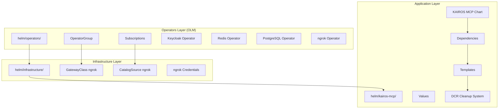
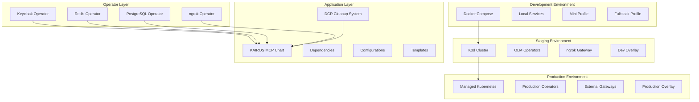
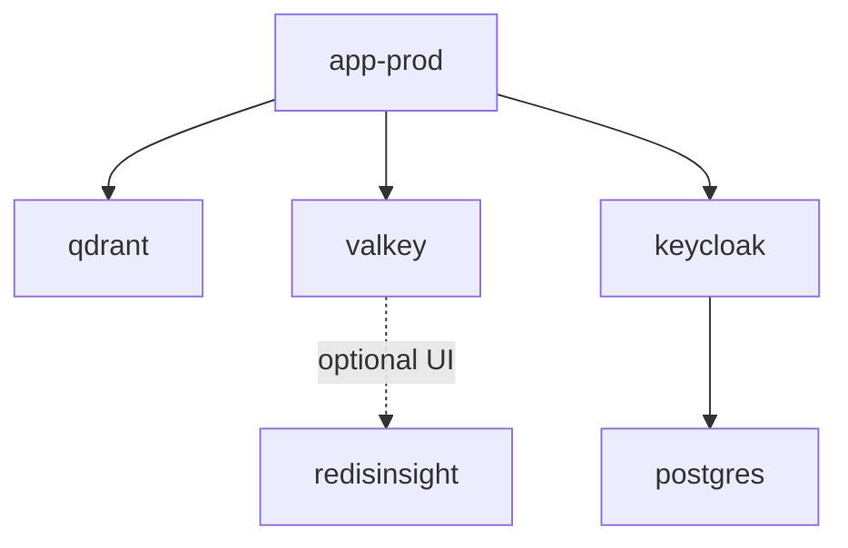
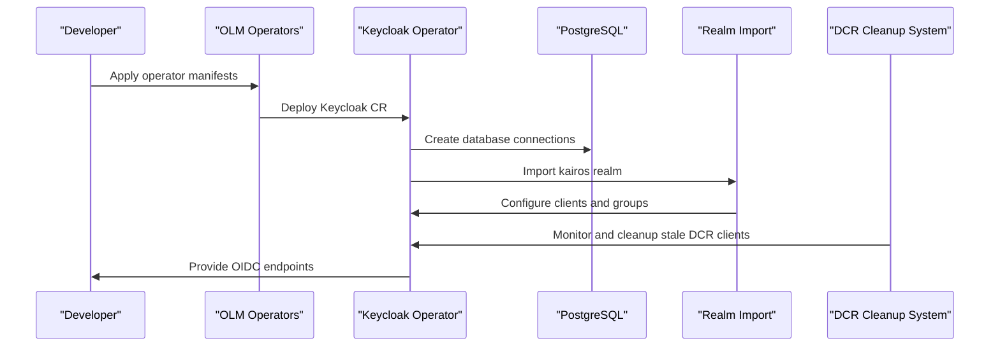
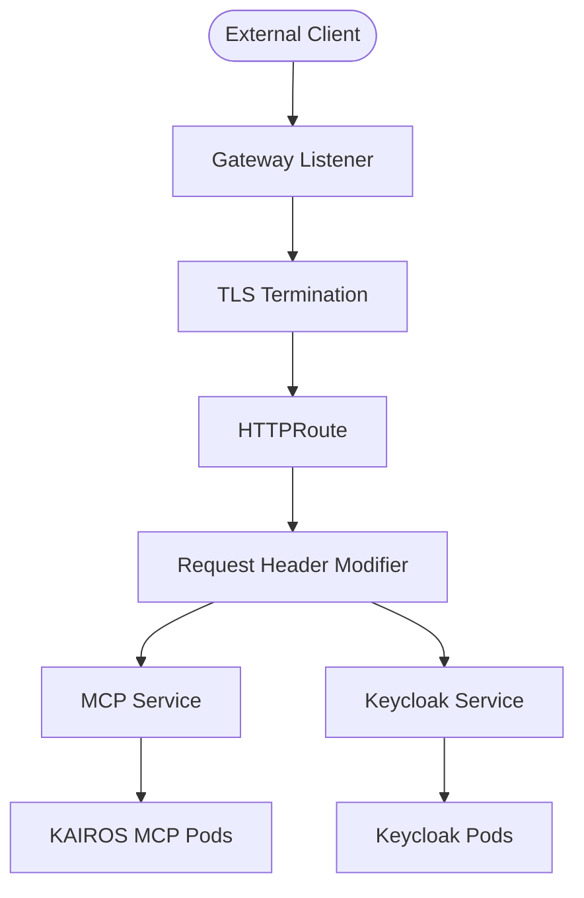
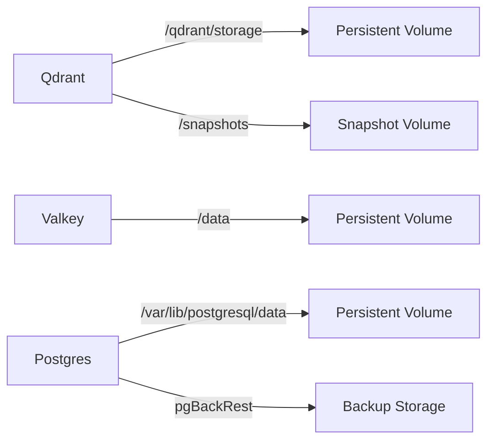
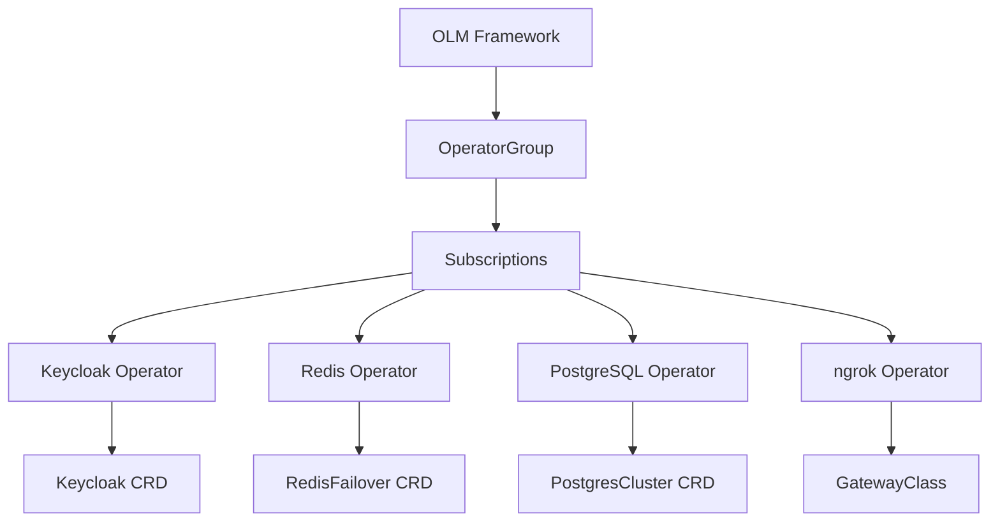
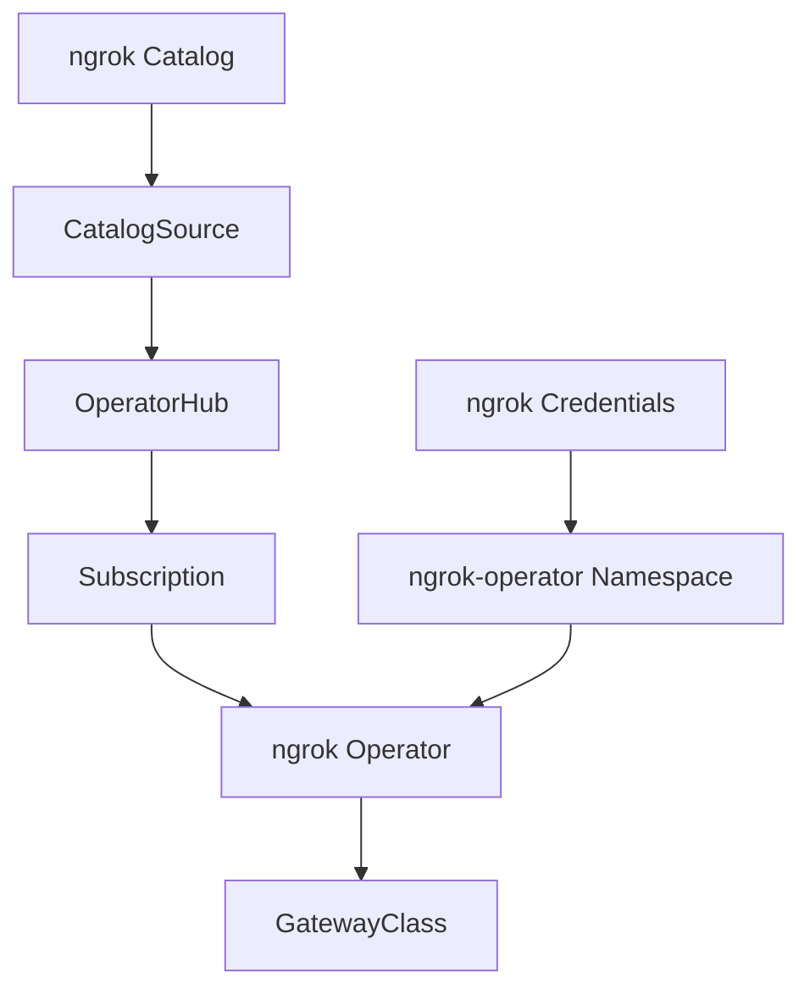
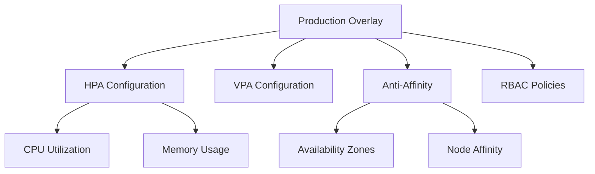
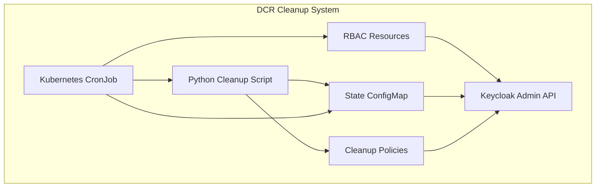

# Deployment & Infrastructure

<cite>
**Referenced Files in This Document**
- [compose.yaml](file://compose.yaml)
- [helm/README.md](file://helm/README.md)
- [helm/values.dev.yaml](file://helm/values.dev.yaml)
- [helm/values.prod.yaml](file://helm/values.prod.yaml)
- [helm/kairos-mcp/Chart.yaml](file://helm/kairos-mcp/Chart.yaml)
- [helm/kairos-mcp/values.yaml](file://helm/kairos-mcp/values.yaml)
- [helm/kairos-mcp/templates/kairos-mcp-deployment.yaml](file://helm/kairos-mcp/templates/kairos-mcp-deployment.yaml)
- [helm/kairos-mcp/templates/gateway.yaml](file://helm/kairos-mcp/templates/gateway.yaml)
- [helm/kairos-mcp/templates/httproute-mcp.yaml](file://helm/kairos-mcp/templates/httproute-mcp.yaml)
- [helm/kairos-mcp/templates/httproute-keycloak.yaml](file://helm/kairos-mcp/templates/httproute-keycloak.yaml)
- [helm/kairos-mcp/templates/httproute-keycloak-admin-redirect.yaml](file://helm/kairos-mcp/templates/httproute-keycloak-admin-redirect.yaml)
- [helm/kairos-mcp/templates/gateway-referencegrant-keycloak.yaml](file://helm/kairos-mcp/templates/gateway-referencegrant-keycloak.yaml)
- [helm/kairos-mcp/templates/gateway-certificate.yaml](file://helm/kairos-mcp/templates/gateway-certificate.yaml)
- [helm/kairos-mcp/templates/_helpers.tpl](file://helm/kairos-mcp/templates/_helpers.tpl)
- [helm/infrastructure/gatewayclass-ngrok.yaml](file://helm/infrastructure/gatewayclass-ngrok.yaml)
- [helm/infrastructure/subscription-ngrok-operator.yaml](file://helm/infrastructure/subscription-ngrok-operator.yaml)
- [helm/kairos-mcp/templates/redis-failover-cr.yaml](file://helm/kairos-mcp/templates/redis-failover-cr.yaml)
- [helm/kairos-mcp/templates/keycloak-cr.yaml](file://helm/kairos-mcp/templates/keycloak-cr.yaml)
- [helm/kairos-mcp/templates/postgres-cluster-cr.yaml](file://helm/kairos-mcp/templates/postgres-cluster-cr.yaml)
- [helm/kairos-mcp/files/kairos-realm.json](file://helm/kairos-mcp/files/kairos-realm.json)
- [helm/operators/README.md](file://helm/operators/README.md)
- [helm/operators/kustomization.yaml](file://helm/operators/kustomization.yaml)
- [helm/infrastructure/README.md](file://helm/infrastructure/README.md)
- [helm/infrastructure/kustomization.yaml](file://helm/infrastructure/kustomization.yaml)
- [scripts/deploy-generate-dev-secrets.py](file://scripts/deploy-generate-dev-secrets.py)
- [scripts/deploy-configure-keycloak-realms.py](file://scripts/deploy-configure-keycloak-realms.py)
- [docs/install/docker-compose-full-stack.md](file://docs/install/docker-compose-full-stack.md)
- [helm/kairos-mcp/files/keycloak-dcr-cleanup.py](file://helm/kairos-mcp/files/keycloak-dcr-cleanup.py)
- [helm/kairos-mcp/templates/keycloak-dcr-cleanup-cronjob.yaml](file://helm/kairos-mcp/templates/keycloak-dcr-cleanup-cronjob.yaml)
- [helm/kairos-mcp/templates/keycloak-dcr-cleanup-rbac.yaml](file://helm/kairos-mcp/templates/keycloak-dcr-cleanup-rbac.yaml)
- [helm/kairos-mcp/templates/keycloak-dcr-cleanup-script-configmap.yaml](file://helm/kairos-mcp/templates/keycloak-dcr-cleanup-script-configmap.yaml)
- [helm/kairos-mcp/templates/keycloak-dcr-cleanup-state-configmap.yaml](file://helm/kairos-mcp/templates/keycloak-dcr-cleanup-state-configmap.yaml)
</cite>

## Update Summary
**Changes Made**
- Added comprehensive DCR (Dynamic Client Registration) cleanup system with Python-based CronJob
- Enhanced Keycloak realm management with improved client lifecycle cleanup policies
- Implemented state tracking, dry-run capabilities, and configurable cleanup policies for different realms
- Updated authentication and realm management section to include DCR cleanup automation
- Added new section covering DCR cleanup system architecture and operational procedures

## Table of Contents
1. [Introduction](#introduction)
2. [Project Structure](#project-structure)
3. [Core Components](#core-components)
4. [Architecture Overview](#architecture-overview)
5. [Detailed Component Analysis](#detailed-component-analysis)
6. [Operator Management](#operator-management)
7. [Infrastructure Provisioning](#infrastructure-provisioning)
8. [Production Deployment Strategies](#production-deployment-strategies)
9. [Scaling and High Availability](#scaling-and-high-availability)
10. [Security and Compliance](#security-and-compliance)
11. [Monitoring and Observability](#monitoring-and-observability)
12. [DCR Cleanup System](#dcr-cleanup-system)
13. [Troubleshooting Guide](#troubleshooting-guide)
14. [Conclusion](#conclusion)
15. [Appendices](#appendices)

## Introduction
This document describes the KAIROS MCP deployment infrastructure across containerized environments with comprehensive coverage of Helm charts, Kubernetes operators, and production deployment strategies. It covers:
- Docker Compose single-node development to fullstack local topology
- Kubernetes Helm chart for production-scale deployments with operator-managed infrastructure
- Comprehensive operator management using OLM (Operator Lifecycle Manager)
- Infrastructure provisioning with ngrok GatewayClass and cluster prerequisites
- Multi-layered deployment architecture supporting development, staging, and production environments
- Advanced scaling strategies, high availability configurations, and secrets management
- End-to-end provisioning automation and environment-specific configuration management
- **New**: Automated DCR (Dynamic Client Registration) cleanup system with state tracking and configurable policies

## Project Structure
The deployment assets are organized into a three-tier architecture with clear separation of concerns:
- **Operators Layer**: OLM-managed operators for Redis, Keycloak, PostgreSQL, and ngrok Gateway
- **Infrastructure Layer**: Cluster infrastructure bootstrap with GatewayClass and ngrok operator
- **Application Layer**: KAIROS MCP Helm chart with comprehensive dependency management

**Diagram sources**
- [helm/README.md:1-18](file://helm/README.md#L1-L18)
- [helm/operators/kustomization.yaml:1-10](file://helm/operators/kustomization.yaml#L1-L10)
- [helm/infrastructure/kustomization.yaml:1-10](file://helm/infrastructure/kustomization.yaml#L1-L10)
- [helm/kairos-mcp/Chart.yaml:1-23](file://helm/kairos-mcp/Chart.yaml#L1-L23)

**Section sources**
- [helm/README.md:1-18](file://helm/README.md#L1-L18)
- [helm/operators/README.md:1-41](file://helm/operators/README.md#L1-L41)
- [helm/infrastructure/README.md:1-38](file://helm/infrastructure/README.md#L1-L38)

## Core Components
The deployment architecture consists of four primary layers with specialized components:

### Application Services
- **KAIROS MCP Server**: Containerized application with enhanced security contexts, health checks, environment-driven configuration, and embedded model runtime support
- **Vector Database**: Qdrant with persistent storage, snapshot support, and horizontal scaling capabilities
- **Cache Layer**: Redis/Valkey with password protection, failover clustering, and optional UI management

### Identity and Access Management
- **Keycloak Identity Provider**: Operator-managed with Postgres backing store, realm configuration, and OIDC integration
- **Authentication Backend**: Session management with configurable group-based access control
- **Realm Management**: Automated realm import with client registration and policy enforcement
- **DCR Cleanup System**: Automated cleanup of stale Dynamic Client Registration clients with state tracking

### Infrastructure Services
- **Gateway Management**: Kubernetes Gateway API with ngrok integration for external access and enhanced security controls
- **Database Services**: Percona PostgreSQL with high availability, backups, and connection pooling
- **Monitoring Stack**: Prometheus Operator integration with ServiceMonitors and alerting rules

### Operator Ecosystem
- **OLM Framework**: Automated operator lifecycle management with version control and dependency resolution
- **Cluster Operators**: RedisFailover, Keycloak, Percona PostgreSQL, and ngrok operators
- **Infrastructure Prerequisites**: GatewayClass and catalog sources for cloud-native networking

**Section sources**
- [helm/kairos-mcp/values.yaml:39-279](file://helm/kairos-mcp/values.yaml#L39-L279)
- [helm/kairos-mcp/templates/kairos-mcp-deployment.yaml:68-173](file://helm/kairos-mcp/templates/kairos-mcp-deployment.yaml#L68-L173)
- [helm/operators/README.md:1-41](file://helm/operators/README.md#L1-L41)

## Architecture Overview
The deployment architecture supports a multi-environment strategy with clear separation between development, staging, and production deployments:

**Diagram sources**
- [helm/values.dev.yaml:1-83](file://helm/values.dev.yaml#L1-L83)
- [helm/values.prod.yaml:1-94](file://helm/values.prod.yaml#L1-L94)
- [helm/kairos-mcp/Chart.yaml:14-23](file://helm/kairos-mcp/Chart.yaml#L14-L23)

**Section sources**
- [helm/values.dev.yaml:1-83](file://helm/values.dev.yaml#L1-L83)
- [helm/values.prod.yaml:1-94](file://helm/values.prod.yaml#L1-L94)
- [helm/kairos-mcp/Chart.yaml:14-23](file://helm/kairos-mcp/Chart.yaml#L14-L23)

## Detailed Component Analysis

### Docker Compose Topology
The Docker Compose setup provides flexible deployment profiles for local development:

#### Mini Profile
- **Components**: Application server with Qdrant vector database only
- **Use Case**: Lightweight development and testing scenarios
- **Networking**: Minimal service dependencies with internal communication

#### Fullstack Profile
- **Components**: Complete stack including Valkey cache, Keycloak identity provider, and Postgres database
- **Use Case**: Feature development and integration testing
- **Persistence**: Named volumes for all stateful components
- **Health Checks**: Comprehensive monitoring of all services

**Diagram sources**
- [compose.yaml:10-183](file://compose.yaml#L10-L183)

**Section sources**
- [compose.yaml:10-183](file://compose.yaml#L10-L183)
- [docs/install/docker-compose-full-stack.md:1-90](file://docs/install/docker-compose-full-stack.md#L1-L90)

### Kubernetes Helm Chart Architecture
The Helm chart implements a comprehensive production-ready deployment with advanced features:

#### Chart Dependencies
- **Qdrant Helm Chart**: Managed vector database with horizontal scaling
- **Valkey Helm Chart**: Redis-compatible caching with persistence
- **Custom Resources**: Operator-managed infrastructure components

#### Configuration Management
- **Environment Overlays**: Separate configurations for development and production
- **Template System**: Dynamic resource generation based on values with enhanced security contexts
- **Security Context**: Pod security policies with seccomp profiles and runtime defaults

#### Resource Templates
- **Deployment**: Application server with enhanced security contexts and probes
- **Service**: Load balancing and network exposure
- **Ingress**: Gateway API integration for external access with improved HTTPRoute configurations
- **RBAC**: Role-based access control for operators

**Section sources**
- [helm/kairos-mcp/Chart.yaml:1-23](file://helm/kairos-mcp/Chart.yaml#L1-L23)
- [helm/kairos-mcp/values.yaml:1-279](file://helm/kairos-mcp/values.yaml#L1-L279)
- [helm/kairos-mcp/templates/kairos-mcp-deployment.yaml:1-174](file://helm/kairos-mcp/templates/kairos-mcp-deployment.yaml#L1-L174)

### Authentication and Realm Management
The authentication system leverages Keycloak with automated realm management and enhanced client lifecycle cleanup:

#### Keycloak Operator Integration
- **Custom Resource Definition**: Operator-managed Keycloak instances
- **Database Integration**: PostgreSQL backing store with connection management
- **Realm Import**: Automated realm configuration with client registration

#### OIDC Configuration
- **Client Registration**: Dynamic client creation for MCP and CLI applications
- **Group Mapping**: Hierarchical group structure for access control
- **Token Management**: Session tokens with configurable expiration

#### Enhanced Client Lifecycle Management
- **DCR Cleanup Automation**: Automated removal of stale Dynamic Client Registration clients
- **State Tracking**: Persistent state management for cleanup operations
- **Policy Configuration**: Configurable cleanup policies per realm and client type
- **Dry-Run Support**: Safe testing of cleanup operations before execution

**Diagram sources**
- [helm/kairos-mcp/templates/keycloak-cr.yaml:1-106](file://helm/kairos-mcp/templates/keycloak-cr.yaml#L1-L106)
- [helm/kairos-mcp/templates/postgres-cluster-cr.yaml:1-47](file://helm/kairos-mcp/templates/postgres-cluster-cr.yaml#L1-L47)
- [helm/kairos-mcp/files/kairos-realm.json:1-216](file://helm/kairos-mcp/files/kairos-realm.json#L1-L216)
- [helm/kairos-mcp/templates/keycloak-dcr-cleanup-cronjob.yaml:1-100](file://helm/kairos-mcp/templates/keycloak-dcr-cleanup-cronjob.yaml#L1-L100)

**Section sources**
- [helm/kairos-mcp/templates/keycloak-cr.yaml:1-106](file://helm/kairos-mcp/templates/keycloak-cr.yaml#L1-L106)
- [helm/kairos-mcp/templates/postgres-cluster-cr.yaml:1-47](file://helm/kairos-mcp/templates/postgres-cluster-cr.yaml#L1-L47)
- [helm/kairos-mcp/files/kairos-realm.json:1-216](file://helm/kairos-mcp/files/kairos-realm.json#L1-L216)
- [helm/kairos-mcp/templates/keycloak-dcr-cleanup-cronjob.yaml:1-100](file://helm/kairos-mcp/templates/keycloak-dcr-cleanup-cronjob.yaml#L1-L100)

### Network and Routing Architecture
The networking layer implements modern Kubernetes ingress patterns with enhanced security and compliance:

#### Gateway API Implementation
- **Gateway Resource**: Centralized ingress controller with multiple listeners and enhanced TLS configuration
- **HTTPRoute Resources**: Path-based routing with standardized header modifications and request filtering
- **TLS Termination**: Certificate management with cert-manager integration and improved security contexts
- **Cross-Namespace Access**: Reference Grants for secure service exposure between namespaces

#### Route Configuration
- **MCP Endpoint**: Root path routing to application service with enhanced security headers
- **Keycloak Endpoint**: Subpath routing with admin lockdown and redirect handling
- **Security Headers**: Standardized X-Forwarded-* headers for proper upstream handling

**Diagram sources**
- [helm/kairos-mcp/templates/gateway.yaml:1-45](file://helm/kairos-mcp/templates/gateway.yaml#L1-L45)
- [helm/kairos-mcp/templates/httproute-mcp.yaml:1-41](file://helm/kairos-mcp/templates/httproute-mcp.yaml#L1-L41)
- [helm/kairos-mcp/templates/gateway-referencegrant-keycloak.yaml:1-21](file://helm/kairos-mcp/templates/gateway-referencegrant-keycloak.yaml#L1-L21)

**Section sources**
- [helm/kairos-mcp/templates/gateway.yaml:1-45](file://helm/kairos-mcp/templates/gateway.yaml#L1-L45)
- [helm/kairos-mcp/templates/httproute-mcp.yaml:1-41](file://helm/kairos-mcp/templates/httproute-mcp.yaml#L1-L41)
- [helm/kairos-mcp/templates/httproute-keycloak.yaml:1-49](file://helm/kairos-mcp/templates/httproute-keycloak.yaml#L1-L49)
- [helm/kairos-mcp/templates/httproute-keycloak-admin-redirect.yaml:1-41](file://helm/kairos-mcp/templates/httproute-keycloak-admin-redirect.yaml#L1-L41)
- [helm/kairos-mcp/templates/gateway-referencegrant-keycloak.yaml:1-21](file://helm/kairos-mcp/templates/gateway-referencegrant-keycloak.yaml#L1-L21)

### Data Persistence Patterns
The persistence layer implements robust data management strategies:

#### Volume Management
- **Qdrant Storage**: Persistent volumes with snapshot directories
- **Cache Persistence**: Redis data with password protection
- **Database Storage**: PostgreSQL with configurable storage sizes

#### Backup Strategies
- **PostgreSQL Backups**: Automated pgBackRest integration
- **Qdrant Snapshots**: Application-level snapshot management
- **Cross-Platform Backups**: Multiple backup destinations

**Diagram sources**
- [compose.yaml:59-104](file://compose.yaml#L59-L104)
- [helm/kairos-mcp/templates/kairos-mcp-deployment.yaml:167-173](file://helm/kairos-mcp/templates/kairos-mcp-deployment.yaml#L167-L173)

**Section sources**
- [compose.yaml:59-104](file://compose.yaml#L59-L104)
- [helm/kairos-mcp/templates/kairos-mcp-deployment.yaml:167-173](file://helm/kairos-mcp/templates/kairos-mcp-deployment.yaml#L167-L173)

## Operator Management
The OLM-based operator management system provides automated lifecycle management for infrastructure components:

### Operator Installation Process
- **Prerequisite Setup**: OLM installation and configuration
- **OperatorGroup Creation**: Namespace scoping for operator management
- **Subscription Management**: Automated operator installation and updates

### Supported Operators
- **Keycloak Operator**: Full lifecycle management of Keycloak instances
- **Redis Operator**: RedisFailover cluster management with failover
- **PostgreSQL Operator**: Percona PostgreSQL cluster with high availability
- **ngrok Operator**: Cloud-native ingress with dynamic tunneling

**Diagram sources**
- [helm/operators/kustomization.yaml:1-10](file://helm/operators/kustomization.yaml#L1-L10)
- [helm/infrastructure/kustomization.yaml:1-10](file://helm/infrastructure/kustomization.yaml#L1-L10)

**Section sources**
- [helm/operators/README.md:1-41](file://helm/operators/README.md#L1-L41)
- [helm/operators/kustomization.yaml:1-10](file://helm/operators/kustomization.yaml#L1-L10)

### Operator Verification and Troubleshooting
- **Installation Verification**: CRD existence and CSV status checking
- **Catalog Validation**: Package manifest verification
- **Namespace Scoping**: OperatorGroup target namespace configuration

**Section sources**
- [helm/operators/README.md:26-41](file://helm/operators/README.md#L26-L41)

## Infrastructure Provisioning
The infrastructure layer provides cloud-native networking and cluster prerequisites:

### ngrok Gateway Integration
- **GatewayClass Configuration**: ngrok operator integration for dynamic ingress with enhanced controller support
- **Catalog Management**: Custom OCI catalog for operator distribution
- **Credential Management**: Secure credential handling for ngrok API access

### Cluster Prerequisites
- **OLM Installation**: Operator Lifecycle Manager setup and configuration
- **Catalog Sources**: Custom operator catalogs for enterprise environments
- **Network Policies**: Ingress controller and service mesh integration

**Diagram sources**
- [helm/infrastructure/README.md:20-38](file://helm/infrastructure/README.md#L20-L38)
- [helm/infrastructure/kustomization.yaml:1-10](file://helm/infrastructure/kustomization.yaml#L1-L10)

**Section sources**
- [helm/infrastructure/README.md:1-38](file://helm/infrastructure/README.md#L1-L38)
- [helm/infrastructure/kustomization.yaml:1-10](file://helm/infrastructure/kustomization.yaml#L1-L10)

### Infrastructure Automation
- **Kustomize Manifests**: Declarative infrastructure management
- **Automated Provisioning**: Scripted deployment workflows
- **Environment Configuration**: Multi-environment setup management

**Section sources**
- [helm/infrastructure/README.md:14-18](file://helm/infrastructure/README.md#L14-L18)

## Production Deployment Strategies
The production deployment strategy emphasizes scalability, reliability, and operational excellence:

### Environment Overlays
- **Development Overlay**: Local development with minimal resources
- **Staging Overlay**: Pre-production testing with realistic configurations
- **Production Overlay**: Enterprise-grade deployment with high availability

### Resource Management
- **Horizontal Pod Autoscaling**: CPU and memory-based scaling policies
- **Vertical Pod Autoscaling**: Automatic resource optimization
- **Resource Quotas**: Namespace-level resource management

### High Availability Configuration
- **Multi-AZ Deployment**: Spread across availability zones
- **Pod Disruption Budgets**: Guaranteed minimum availability during maintenance
- **Health Monitoring**: Comprehensive health checks and alerting

**Diagram sources**
- [helm/values.prod.yaml:37-47](file://helm/values.prod.yaml#L37-L47)
- [helm/kairos-mcp/values.yaml:78-87](file://helm/kairos-mcp/values.yaml#L78-L87)

**Section sources**
- [helm/values.prod.yaml:1-94](file://helm/values.prod.yaml#L1-L94)
- [helm/kairos-mcp/values.yaml:19-38](file://helm/kairos-mcp/values.yaml#L19-L38)

### Security Hardening
- **Pod Security Standards**: Runtime security policies with enhanced seccomp profiles
- **Network Policies**: Service mesh integration and traffic control
- **Secret Management**: Encrypted secret storage and rotation

**Section sources**
- [helm/kairos-mcp/templates/kairos-mcp-deployment.yaml:72-82](file://helm/kairos-mcp/templates/kairos-mcp-deployment.yaml#L72-L82)

## Scaling and High Availability
The deployment architecture supports comprehensive scaling and high availability strategies:

### Horizontal Scaling
- **Application Scaling**: Replica-based scaling with HPA integration
- **Database Scaling**: PostgreSQL cluster with multiple instances
- **Cache Scaling**: Redis cluster with automatic failover

### Load Balancing Strategies
- **Service Mesh Integration**: Istio or Linkerd for advanced traffic management
- **Ingress Controller**: NGINX or Traefik for external traffic
- **CDN Integration**: Edge caching and global load distribution

### Disaster Recovery
- **Multi-Region Deployment**: Geographic redundancy and failover
- **Backup Automation**: Scheduled backups with retention policies
- **Disaster Recovery Testing**: Regular DR drills and validation

**Section sources**
- [helm/kairos-mcp/values.yaml:123-244](file://helm/kairos-mcp/values.yaml#L123-L244)
- [helm/values.prod.yaml:37-47](file://helm/values.prod.yaml#L37-L47)

## Security and Compliance
The deployment architecture incorporates comprehensive security measures with enhanced PodSecurityAdmission compliance:

### Enhanced Security Contexts
- **Runtime Security**: Seccomp profile with RuntimeDefault for enhanced container security
- **Privilege Escalation**: Disabled privilege escalation with comprehensive capability drops
- **Root Filesystem**: Read-only root filesystem with non-root user execution

### Identity and Access Control
- **OIDC Integration**: OpenID Connect with group-based authorization
- **RBAC Policies**: Role-based access control for Kubernetes resources
- **Audit Logging**: Comprehensive audit trails for compliance

### Data Protection
- **Encryption at Rest**: Database and storage encryption
- **Network Encryption**: TLS termination and certificate management
- **Secret Management**: Encrypted secret storage and rotation

### Compliance Framework
- **SOC 2 Compliance**: Operational security and availability
- **GDPR Alignment**: Data protection and privacy controls
- **Audit Trails**: Comprehensive logging and monitoring

**Section sources**
- [helm/kairos-mcp/files/kairos-realm.json:14-25](file://helm/kairos-mcp/files/kairos-realm.json#L14-L25)
- [helm/kairos-mcp/templates/keycloak-admin-authz-policy.yaml:1-100](file://helm/kairos-mcp/templates/keycloak-admin-authz-policy.yaml#L1-L100)
- [helm/kairos-mcp/templates/kairos-mcp-deployment.yaml:72-82](file://helm/kairos-mcp/templates/kairos-mcp-deployment.yaml#L72-L82)

## Monitoring and Observability
The monitoring stack provides comprehensive visibility into system performance:

### Metrics Collection
- **Prometheus Integration**: ServiceMonitor resources for metric scraping
- **Application Metrics**: Custom metrics for embedding and search performance
- **Infrastructure Metrics**: Database and cache performance monitoring

### Alerting and Notifications
- **AlertManager Integration**: Automated alerting and notification
- **SLA Monitoring**: Service level agreement tracking and reporting
- **Incident Response**: Integrated incident management workflows

### Log Management
- **Centralized Logging**: Structured logging with log aggregation
- **Search and Analytics**: Log search capabilities with analytics
- **Compliance Logging**: Audit logs for regulatory compliance

**Section sources**
- [helm/kairos-mcp/templates/app-servicemonitor.yaml:1-23](file://helm/kairos-mcp/templates/app-servicemonitor.yaml#L1-L23)
- [helm/kairos-mcp/templates/prometheusrule.yaml:1-56](file://helm/kairos-mcp/templates/prometheusrule.yaml#L1-L56)

## DCR Cleanup System
**New Section** - The DCR (Dynamic Client Registration) cleanup system provides automated management of stale client registrations in Keycloak:

### System Architecture
The DCR cleanup system consists of several integrated components working together to maintain Keycloak realm hygiene:

#### Python-Based Cleanup Script
- **Core Logic**: Python script implementing comprehensive client cleanup algorithms
- **State Tracking**: Persistent state management for cleanup operations
- **Dry-Run Mode**: Safe testing capability before executing cleanup actions
- **Configurable Policies**: Realm-specific cleanup policies and thresholds

#### Kubernetes CronJob Integration
- **Scheduled Execution**: Automated cleanup runs based on configurable schedules
- **RBAC Permissions**: Proper role-based access control for Keycloak administration
- **Resource Management**: Controlled resource allocation for cleanup operations
- **Failure Handling**: Robust error handling and retry mechanisms

#### Configuration Management
- **Script ConfigMap**: Centralized script distribution and versioning
- **State ConfigMap**: Persistent state tracking across cleanup cycles
- **RBAC Resources**: Dedicated permissions for cleanup operations
- **Cleanup Policies**: Configurable thresholds and exclusion rules

**Diagram sources**
- [helm/kairos-mcp/files/keycloak-dcr-cleanup.py:1-200](file://helm/kairos-mcp/files/keycloak-dcr-cleanup.py#L1-L200)
- [helm/kairos-mcp/templates/keycloak-dcr-cleanup-cronjob.yaml:1-100](file://helm/kairos-mcp/templates/keycloak-dcr-cleanup-cronjob.yaml#L1-L100)
- [helm/kairos-mcp/templates/keycloak-dcr-cleanup-rbac.yaml:1-80](file://helm/kairos-mcp/templates/keycloak-dcr-cleanup-rbac.yaml#L1-L80)
- [helm/kairos-mcp/templates/keycloak-dcr-cleanup-state-configmap.yaml:1-60](file://helm/kairos-mcp/templates/keycloak-dcr-cleanup-state-configmap.yaml#L1-L60)

### Cleanup Operations
The system performs comprehensive cleanup operations on Dynamic Client Registration clients:

#### Client Discovery and Classification
- **Realm Scanning**: Automated scanning of configured realms for DCR clients
- **Client Classification**: Categorization of clients based on registration age and activity
- **Exclusion Filtering**: Application of exclusion rules for protected clients
- **State Comparison**: Comparison with previous cleanup states for change detection

#### Cleanup Execution
- **Age-Based Cleanup**: Removal of clients exceeding configured age thresholds
- **Activity-Based Cleanup**: Elimination of inactive or unused clients
- **Protected Client Preservation**: Exclusion of clients configured as protected
- **Batch Processing**: Efficient processing of multiple clients in batches

#### State Management
- **Progress Tracking**: Detailed tracking of cleanup progress and completion status
- **Error Logging**: Comprehensive logging of cleanup errors and failures
- **State Persistence**: Persistent state storage for operation continuity
- **Audit Trail**: Complete audit trail of all cleanup activities

### Configuration and Policies
The DCR cleanup system supports extensive configuration options:

#### Realm Configuration
- **Realm Selection**: Configurable list of realms to monitor and clean
- **Per-Realm Policies**: Individual policy settings for each realm
- **Client Type Filtering**: Differentiation between static and dynamic clients
- **Cleanup Thresholds**: Configurable age and activity thresholds

#### Cleanup Policies
- **Age-Based Policies**: Time-based cleanup triggers for client age thresholds
- **Activity-Based Policies**: Inactivity-based cleanup for unused clients
- **Protected Client Lists**: Configurable lists of clients to never delete
- **Exclusion Patterns**: Pattern-based exclusion of clients from cleanup

#### Operational Settings
- **Dry-Run Mode**: Safe testing mode for policy validation
- **Logging Levels**: Configurable verbosity for cleanup operations
- **Execution Schedules**: Flexible scheduling for cleanup operations
- **Resource Limits**: Controlled resource usage for cleanup jobs

**Section sources**
- [helm/kairos-mcp/files/keycloak-dcr-cleanup.py:1-200](file://helm/kairos-mcp/files/keycloak-dcr-cleanup.py#L1-L200)
- [helm/kairos-mcp/templates/keycloak-dcr-cleanup-cronjob.yaml:1-100](file://helm/kairos-mcp/templates/keycloak-dcr-cleanup-cronjob.yaml#L1-L100)
- [helm/kairos-mcp/templates/keycloak-dcr-cleanup-rbac.yaml:1-80](file://helm/kairos-mcp/templates/keycloak-dcr-cleanup-rbac.yaml#L1-L80)
- [helm/kairos-mcp/templates/keycloak-dcr-cleanup-script-configmap.yaml:1-80](file://helm/kairos-mcp/templates/keycloak-dcr-cleanup-script-configmap.yaml#L1-L80)
- [helm/kairos-mcp/templates/keycloak-dcr-cleanup-state-configmap.yaml:1-60](file://helm/kairos-mcp/templates/keycloak-dcr-cleanup-state-configmap.yaml#L1-L60)
- [helm/kairos-mcp/values.yaml:219-279](file://helm/kairos-mcp/values.yaml#L219-L279)

## Troubleshooting Guide
Comprehensive troubleshooting procedures for all deployment scenarios:

### Health Check Procedures
- **Application Health**: Liveness and readiness probe validation with enhanced security contexts
- **Database Connectivity**: Connection pool and query performance monitoring
- **Service Dependencies**: Inter-service dependency validation

### Common Issues and Resolutions
- **Operator Installation Failures**: OLM catalog and subscription troubleshooting
- **Gateway Configuration Errors**: Ingress controller and route validation with improved group specifications
- **Authentication Failures**: OIDC configuration and realm import issues
- **DCR Cleanup Failures**: Python script execution and Keycloak API connectivity issues

### Diagnostic Tools
- **Log Analysis**: Centralized log collection and analysis
- **Performance Profiling**: Application and database performance analysis
- **Network Diagnostics**: Connectivity and routing troubleshooting
- **Cleanup System Diagnostics**: DCR cleanup job execution and state tracking analysis

**Section sources**
- [compose.yaml:74-104](file://compose.yaml#L74-L104)
- [helm/kairos-mcp/templates/kairos-mcp-deployment.yaml:146-166](file://helm/kairos-mcp/templates/kairos-mcp-deployment.yaml#L146-L166)

## Conclusion
KAIROS MCP provides a comprehensive deployment solution spanning local development and enterprise production environments. The multi-layered architecture with OLM-managed operators, Kubernetes-native infrastructure, and production-grade Helm charts enables scalable, secure, and maintainable operations. The enhanced Gateway API implementations with improved HTTPRoute configurations, strengthened security contexts with PodSecurityAdmission compliance, and refined cross-namespace access controls create a robust and secure deployment ecosystem suitable for organizations of all sizes.

**New additions** to this infrastructure include the comprehensive DCR (Dynamic Client Registration) cleanup system, which provides automated management of stale client registrations in Keycloak realms. This system ensures proper client lifecycle management, maintains realm hygiene, and prevents client sprawl through configurable policies and state tracking mechanisms.

## Appendices

### Environment-specific Configurations
- **Docker Compose Profiles**: Mini and fullstack configurations for local development
- **Helm Value Overlays**: Development and production environment configurations
- **Operator Scoping**: Namespace-based operator management and resource isolation

**Section sources**
- [compose.yaml:10-183](file://compose.yaml#L10-L183)
- [helm/values.dev.yaml:1-83](file://helm/values.dev.yaml#L1-L83)
- [helm/values.prod.yaml:1-94](file://helm/values.prod.yaml#L1-L94)

### Secrets Management
- **Automated Secret Generation**: Script-based secret creation and validation
- **Operator Secret Handling**: Secure secret injection for managed services
- **Rotation Strategies**: Automated secret rotation and lifecycle management

**Section sources**
- [scripts/deploy-generate-dev-secrets.py:126-181](file://scripts/deploy-generate-dev-secrets.py#L126-L181)
- [helm/kairos-mcp/templates/kairos-mcp-deployment.yaml:132-140](file://helm/kairos-mcp/templates/kairos-mcp-deployment.yaml#L132-L140)

### Infrastructure Provisioning Automation
- **OLM Installation**: Automated operator lifecycle management
- **ngrok Integration**: Cloud-native ingress controller setup
- **Cluster Bootstrap**: Automated infrastructure provisioning workflows

**Section sources**
- [helm/README.md:1-18](file://helm/README.md#L1-L18)
- [helm/operators/README.md:14-18](file://helm/operators/README.md#L14-L18)
- [helm/infrastructure/README.md:14-18](file://helm/infrastructure/README.md#L14-L18)

### Deployment Playbooks
- **Development Setup**: Local environment provisioning and configuration
- **Staging Deployment**: Pre-production environment deployment strategies
- **Production Rollout**: Zero-downtime deployment and rollback procedures

**Section sources**
- [helm/README.md:9-18](file://helm/README.md#L9-L18)
- [helm/values.dev.yaml:3-8](file://helm/values.dev.yaml#L3-L8)
- [helm/values.prod.yaml:7-8](file://helm/values.prod.yaml#L7-L8)

### DCR Cleanup System Administration
- **System Installation**: Deployment and configuration of the DCR cleanup system
- **Policy Configuration**: Setting up cleanup policies and realm-specific rules
- **Monitoring and Maintenance**: Ongoing monitoring and maintenance of cleanup operations
- **Troubleshooting**: Diagnosing and resolving cleanup system issues

**Section sources**
- [helm/kairos-mcp/files/keycloak-dcr-cleanup.py:1-200](file://helm/kairos-mcp/files/keycloak-dcr-cleanup.py#L1-L200)
- [helm/kairos-mcp/templates/keycloak-dcr-cleanup-cronjob.yaml:1-100](file://helm/kairos-mcp/templates/keycloak-dcr-cleanup-cronjob.yaml#L1-L100)
- [helm/kairos-mcp/templates/keycloak-dcr-cleanup-rbac.yaml:1-80](file://helm/kairos-mcp/templates/keycloak-dcr-cleanup-rbac.yaml#L1-L80)
- [helm/kairos-mcp/templates/keycloak-dcr-cleanup-script-configmap.yaml:1-80](file://helm/kairos-mcp/templates/keycloak-dcr-cleanup-script-configmap.yaml#L1-L80)
- [helm/kairos-mcp/templates/keycloak-dcr-cleanup-state-configmap.yaml:1-60](file://helm/kairos-mcp/templates/keycloak-dcr-cleanup-state-configmap.yaml#L1-L60)