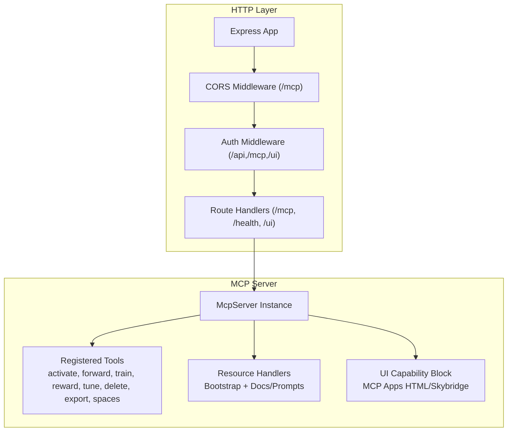
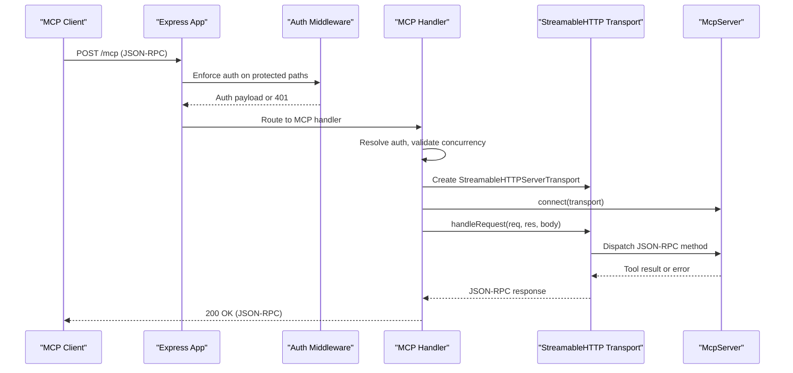
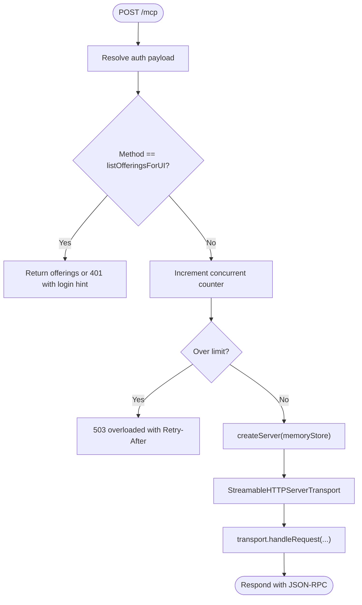
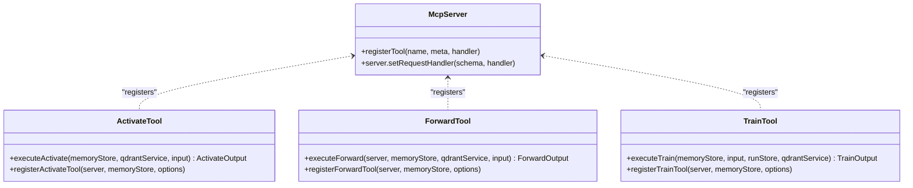
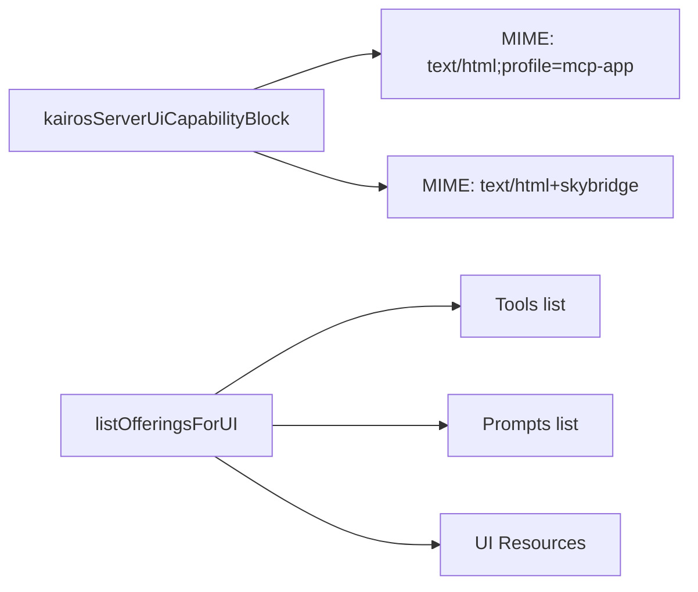
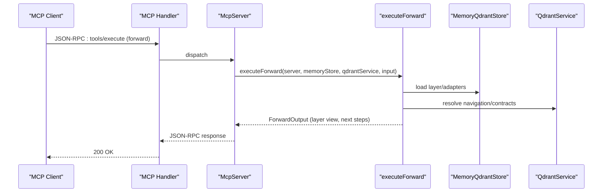
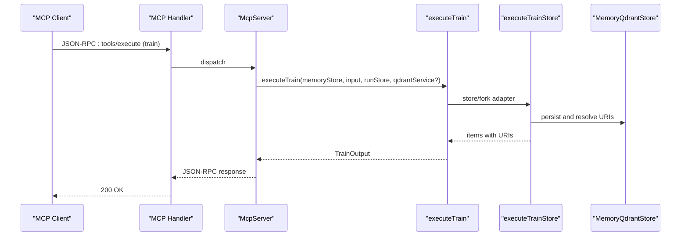
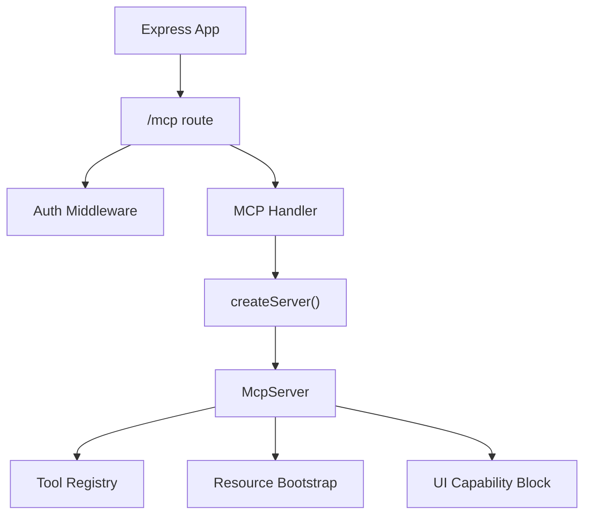

# MCP Protocol Architecture

<cite>
**Referenced Files in This Document**
- [src/server.ts](file://src/server.ts)
- [src/http/http-mcp-handler.ts](file://src/http/http-mcp-handler.ts)
- [src/http/http-auth-middleware.ts](file://src/http/http-auth-middleware.ts)
- [src/http/http-mcp-cors.ts](file://src/http/http-mcp-cors.ts)
- [src/http/mcp-ui-offerings-auth-jsonrpc.ts](file://src/http/mcp-ui-offerings-auth-jsonrpc.ts)
- [src/mcp-apps/kairos-server-ui-capability.ts](file://src/mcp-apps/kairos-server-ui-capability.ts)
- [src/mcp-apps/list-offerings-for-ui.ts](file://src/mcp-apps/list-offerings-for-ui.ts)
- [src/mcp-apps/kairos-ui-constants.ts](file://src/mcp-apps/kairos-ui-constants.ts)
- [src/mcp-apps/register-activate-ui-resources.ts](file://src/mcp-apps/register-activate-ui-resources.ts)
- [src/mcp-apps/register-forward-ui-resources.ts](file://src/mcp-apps/register-forward-ui-resources.ts)
- [src/mcp-apps/register-spaces-ui-resources.ts](file://src/mcp-apps/register-spaces-ui-resources.ts)
- [src/tools/activate.ts](file://src/tools/activate.ts)
- [src/tools/forward.ts](file://src/tools/forward.ts)
- [src/tools/train.ts](file://src/tools/train.ts)
- [src/resources/resource-bootstrap.ts](file://src/resources/resource-bootstrap.ts)
- [src/http/http-error-handlers.ts](file://src/http/http-error-handlers.ts)
</cite>

## Update Summary
**Changes Made**
- Enhanced MCP protocol architecture documentation with comprehensive coverage of protocol tools
- Added detailed UI integration documentation for MCP Apps and Skybridge profiles
- Expanded technical specifications for tool registration, resource management, and authentication flows
- Updated architecture diagrams to reflect the complete MCP server implementation
- Added protocol versioning and backward compatibility mechanisms
- Documented extension mechanisms for UI capability blocks and resource offerings

## Table of Contents
1. [Introduction](#introduction)
2. [Project Structure](#project-structure)
3. [Core Components](#core-components)
4. [Architecture Overview](#architecture-overview)
5. [Detailed Component Analysis](#detailed-component-analysis)
6. [Dependency Analysis](#dependency-analysis)
7. [Performance Considerations](#performance-considerations)
8. [Troubleshooting Guide](#troubleshooting-guide)
9. [Conclusion](#conclusion)

## Introduction
This document describes the KAIROS Model Context Protocol (MCP) implementation over HTTP transport. It explains how the MCP server is constructed, how tools are registered and invoked, how resources and UI capabilities are exposed, and how authentication and authorization are enforced. It also documents message flows, error handling, state management, protocol versioning, backward compatibility, and extension mechanisms.

## Project Structure
The MCP server is implemented as an Express application with dedicated routes and middleware. The server composes an MCP-compatible toolset and UI resources, registers them with the MCP SDK, and exposes them via an HTTP transport.



**Diagram sources**
- [src/http/http-mcp-cors.ts:3-28](file://src/http/http-mcp-cors.ts#L3-L28)
- [src/http/http-auth-middleware.ts:167-313](file://src/http/http-auth-middleware.ts#L167-L313)
- [src/http/http-mcp-handler.ts:128-344](file://src/http/http-mcp-handler.ts#L128-L344)
- [src/server.ts:124-193](file://src/server.ts#L124-L193)

**Section sources**
- [src/server.ts:124-193](file://src/server.ts#L124-L193)
- [src/http/http-mcp-handler.ts:128-344](file://src/http/http-mcp-handler.ts#L128-L344)
- [src/http/http-auth-middleware.ts:167-313](file://src/http/http-auth-middleware.ts#L167-L313)
- [src/http/http-mcp-cors.ts:3-28](file://src/http/http-mcp-cors.ts#L3-L28)

## Core Components
- HTTP transport and request lifecycle: The MCP endpoint accepts POST requests, validates authentication, enforces concurrency limits, and delegates to an MCP server instance per request.
- Authentication and authorization: Session-based and Bearer token validation with OIDC integration; enforcement on protected paths including /mcp.
- Tool registration: Tools are registered with strict input/output schemas and optional UI metadata for MCP Apps.
- UI capability extensions: The server advertises support for MCP Apps HTML and Skybridge profiles and exposes UI resources for tools.
- Resource management: Resource handlers are bootstrapped to ensure MCP resource APIs are available even without public resources.

**Section sources**
- [src/http/http-mcp-handler.ts:128-344](file://src/http/http-mcp-handler.ts#L128-L344)
- [src/http/http-auth-middleware.ts:167-313](file://src/http/http-auth-middleware.ts#L167-L313)
- [src/server.ts:124-193](file://src/server.ts#L124-L193)
- [src/mcp-apps/kairos-server-ui-capability.ts:7-13](file://src/mcp-apps/kairos-server-ui-capability.ts#L7-L13)
- [src/resources/resource-bootstrap.ts:8-44](file://src/resources/resource-bootstrap.ts#L8-L44)

## Architecture Overview
The MCP server architecture integrates the MCP SDK with an Express application. Requests are authenticated, optionally authorized, and routed to an MCP server instance that handles tool invocations and resource/UI queries.



**Diagram sources**
- [src/http/http-mcp-handler.ts:128-344](file://src/http/http-mcp-handler.ts#L128-L344)
- [src/http/http-auth-middleware.ts:167-313](file://src/http/http-auth-middleware.ts#L167-L313)

## Detailed Component Analysis

### HTTP Transport and Request Lifecycle
- Endpoint: POST /mcp
- Concurrency control: Tracks in-flight requests and rejects with 503 when exceeding configured limits.
- Authentication resolution: Supports session or Bearer token validation; logs and sanitizes errors.
- Request logging: Emits structured logs for request start/completion/cancel/close with timing.
- Special handling: listOfferingsForUI is handled locally to return proper auth-related responses.



**Diagram sources**
- [src/http/http-mcp-handler.ts:128-344](file://src/http/http-mcp-handler.ts#L128-L344)

**Section sources**
- [src/http/http-mcp-handler.ts:128-344](file://src/http/http-mcp-handler.ts#L128-L344)

### Authentication and Authorization
- Protected paths: /api, /api/*, /mcp, /ui, /ui/*
- Modes:
  - Session cookie: Verified HMAC and claims; sets req.auth and space context.
  - Bearer token: Validated against trusted issuers and audiences when enabled.
- Behavior:
  - GET /mcp returns 401 with WWW-Authenticate to inform clients to connect.
  - Other methods return 401 JSON with login_url when applicable.
  - OIDC redirect for browser GET requests (non-/mcp).


**Diagram sources**
- [src/http/http-auth-middleware.ts:167-313](file://src/http/http-auth-middleware.ts#L167-L313)

**Section sources**
- [src/http/http-auth-middleware.ts:167-313](file://src/http/http-auth-middleware.ts#L167-L313)

### Tool Registration and Execution
- Tool registry: Centralized list defines tool metadata and schemas.
- Registration: Tools are registered with input/output schemas and optional UI metadata.
- Execution:
  - activate: Searches adapters and returns ranked choices with next actions and optional artifacts.
  - forward: Executes a forward pass over adapter layers, manages proof-of-work challenges, and transitions between layers.
  - train: Stores or forks adapters, normalizes inputs, and returns stored items with URIs.



**Diagram sources**
- [src/server.ts:42-108](file://src/server.ts#L42-L108)
- [src/tools/activate.ts:236-284](file://src/tools/activate.ts#L236-L284)
- [src/tools/forward.ts:93-318](file://src/tools/forward.ts#L93-L318)
- [src/tools/train.ts:240-346](file://src/tools/train.ts#L240-L346)

**Section sources**
- [src/server.ts:42-108](file://src/server.ts#L42-L108)
- [src/tools/activate.ts:208-234](file://src/tools/activate.ts#L208-L234)
- [src/tools/forward.ts:93-318](file://src/tools/forward.ts#L93-L318)
- [src/tools/train.ts:134-238](file://src/tools/train.ts#L134-L238)

### UI Capability Extensions (MCP Apps)
- Capability block: Declares support for MCP Apps HTML and Skybridge MIME types.
- Offerings: listOfferingsForUI returns tools, prompts, and UI resources with metadata for hosts implementing SEP-1865.
- Constants: Defines URIs and MIME types for activate, forward, and spaces widgets.



**Diagram sources**
- [src/mcp-apps/kairos-server-ui-capability.ts:7-13](file://src/mcp-apps/kairos-server-ui-capability.ts#L7-L13)
- [src/mcp-apps/list-offerings-for-ui.ts:162-179](file://src/mcp-apps/list-offerings-for-ui.ts#L162-L179)
- [src/mcp-apps/kairos-ui-constants.ts:7-68](file://src/mcp-apps/kairos-ui-constants.ts#L7-L68)

**Section sources**
- [src/mcp-apps/kairos-server-ui-capability.ts:7-13](file://src/mcp-apps/kairos-server-ui-capability.ts#L7-L13)
- [src/mcp-apps/list-offerings-for-ui.ts:162-179](file://src/mcp-apps/list-offerings-for-ui.ts#L162-L179)
- [src/mcp-apps/kairos-ui-constants.ts:7-68](file://src/mcp-apps/kairos-ui-constants.ts#L7-L68)

### Resource Management Patterns
- Bootstrap: Ensures resource handlers are installed even when no resources are registered.
- Docs and prompts: Registered from embedded resources.
- Templates: Resource templates are bootstrapped similarly to keep resource/template endpoints available.

**Section sources**
- [src/resources/resource-bootstrap.ts:8-44](file://src/resources/resource-bootstrap.ts#L8-L44)
- [src/server.ts:155-161](file://src/server.ts#L155-L161)

### Message Flow: activate Tool
```mermaid
sequenceDiagram
participant Client as "MCP Client"
participant Handler as "MCP Handler"
participant Server as "McpServer"
participant Activate as "executeActivate"
participant Search as "executeSearch"
participant Output as "ActivateOutput"
Client->>Handler : JSON-RPC : tools/execute (activate)
Handler->>Server : dispatch
Server->>Activate : executeActivate(...)
Activate->>Search : executeSearch(...)
Search-->>Activate : choices, scores
Activate-->>Output : structured choices + next actions
Output-->>Server : result
Server-->>Handler : JSON-RPC response
Handler-->>Client : 200 OK
```

**Diagram sources**
- [src/http/http-mcp-handler.ts:286-304](file://src/http/http-mcp-handler.ts#L286-L304)
- [src/tools/activate.ts:208-234](file://src/tools/activate.ts#L208-L234)

**Section sources**
- [src/tools/activate.ts:208-234](file://src/tools/activate.ts#L208-L234)

### Message Flow: forward Tool


**Diagram sources**
- [src/http/http-mcp-handler.ts:286-304](file://src/http/http-mcp-handler.ts#L286-L304)
- [src/tools/forward.ts:93-318](file://src/tools/forward.ts#L93-L318)

**Section sources**
- [src/tools/forward.ts:93-318](file://src/tools/forward.ts#L93-L318)

### Message Flow: train Tool


**Diagram sources**
- [src/http/http-mcp-handler.ts:286-304](file://src/http/http-mcp-handler.ts#L286-L304)
- [src/tools/train.ts:134-238](file://src/tools/train.ts#L134-L238)

**Section sources**
- [src/tools/train.ts:134-238](file://src/tools/train.ts#L134-L238)

### Error Handling and State Management
- Request lifecycle events:
  - Close: Logs client cancellations and long-lived closures.
  - Finish: Logs completion and duration.
  - Timeout: Warns around 25s for long-running requests.
- Error mapping:
  - KairosError is sanitized and mapped to JSON-RPC with helpful messages and retry hints.
  - Generic errors are mapped to SERVER_ERROR with safe details.
- Concurrency:
  - Tracks in-flight requests and rejects with 503 when limits are exceeded.
- CORS:
  - Exposes WWW-Authenticate header and allows MCP-Protocol-Version header.

**Section sources**
- [src/http/http-mcp-handler.ts:34-41](file://src/http/http-mcp-handler.ts#L34-L41)
- [src/http/http-mcp-handler.ts:87-118](file://src/http/http-mcp-handler.ts#L87-L118)
- [src/http/http-mcp-handler.ts:176-200](file://src/http/http-mcp-handler.ts#L176-L200)
- [src/http/http-mcp-cors.ts:3-28](file://src/http/http-mcp-cors.ts#L3-L28)

### Protocol Versioning, Backward Compatibility, and Extensions
- Versioning:
  - Server identifies itself with a build version during initialization.
- Backward compatibility:
  - Strict tool schemas are advertised via tools/list override to ensure clients receive precise schemas.
- Extensions:
  - MCP Apps UI capability block advertises supported MIME types for UI resources.
  - listOfferingsForUI provides tool and UI resource offerings for hosts implementing SEP-1865.

**Section sources**
- [src/server.ts:125-139](file://src/server.ts#L125-L139)
- [src/server.ts:110-122](file://src/server.ts#L110-L122)
- [src/mcp-apps/kairos-server-ui-capability.ts:7-13](file://src/mcp-apps/kairos-server-ui-capability.ts#L7-L13)
- [src/mcp-apps/list-offerings-for-ui.ts:162-179](file://src/mcp-apps/list-offerings-for-ui.ts#L162-L179)

### Integration Between MCP Tools and Application Architecture
- Tenant and space context: Authenticated requests establish a space context used by tools for scoping operations.
- Metrics: Tool calls, durations, and sizes are tracked for observability.
- Artifacts and exports: Tools integrate with artifact catalogs and capability generation for downloads.

**Section sources**
- [src/http/http-auth-middleware.ts:191-215](file://src/http/http-auth-middleware.ts#L191-L215)
- [src/tools/activate.ts:6-7](file://src/tools/activate.ts#L6-L7)
- [src/tools/train.ts:21](file://src/tools/train.ts#L21-L21)

## Dependency Analysis


**Diagram sources**
- [src/http/http-mcp-handler.ts:128-344](file://src/http/http-mcp-handler.ts#L128-L344)
- [src/server.ts:124-193](file://src/server.ts#L124-L193)

**Section sources**
- [src/http/http-mcp-handler.ts:128-344](file://src/http/http-mcp-handler.ts#L128-L344)
- [src/server.ts:124-193](file://src/server.ts#L124-L193)

## Performance Considerations
- Concurrency limiting: Prevents overload by rejecting requests when concurrent limits are exceeded.
- Request timeouts: Logs warnings around 25s to detect slow operations.
- Logging levels: Structured logs include request IDs and durations for diagnostics.
- Resource availability: Bootstrapping ensures resource endpoints remain responsive even without registered resources.

## Troubleshooting Guide
- 401 Unauthorized on /mcp:
  - Ensure a valid session or Bearer token is provided; the server returns WWW-Authenticate and login_url when available.
- 503 Overloaded:
  - Reduce concurrent requests or wait for Retry-After seconds.
- Method Not Allowed:
  - Use POST /mcp; GET is rejected.
- CORS issues:
  - Verify Access-Control-Allow-Origin and exposed headers including WWW-Authenticate.

**Section sources**
- [src/http/http-auth-middleware.ts:292-313](file://src/http/http-auth-middleware.ts#L292-L313)
- [src/http/http-mcp-handler.ts:176-200](file://src/http/http-mcp-handler.ts#L176-L200)
- [src/http/http-error-handlers.ts:42-47](file://src/http/http-error-handlers.ts#L42-L47)
- [src/http/http-mcp-cors.ts:3-28](file://src/http/http-mcp-cors.ts#L3-L28)

## Conclusion
The KAIROS MCP implementation provides a robust, authenticated, and extensible HTTP transport for the Model Context Protocol. Tools are strictly typed and integrated with UI capability extensions for modern chat hosts. The architecture emphasizes observability, backward compatibility, and clear error handling, enabling reliable integration with diverse MCP clients.