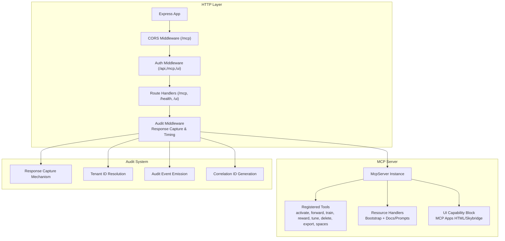
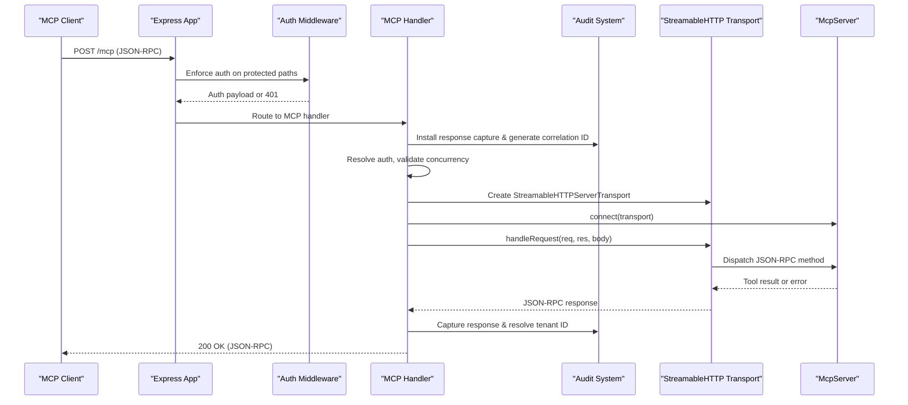
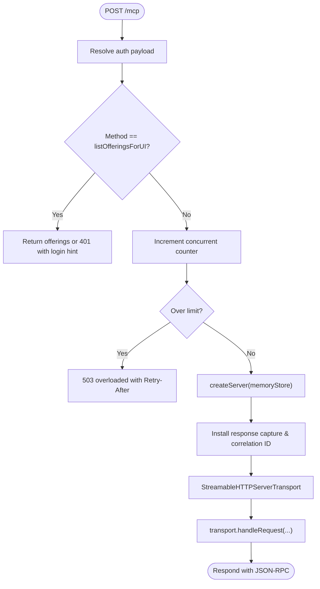
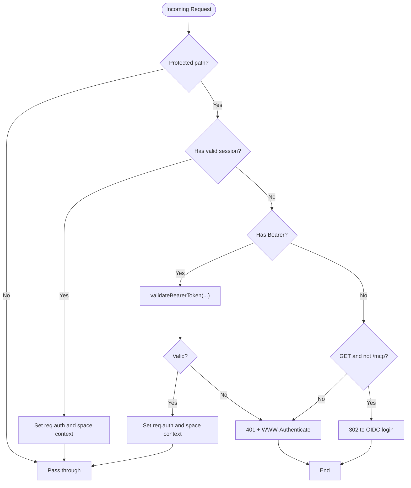
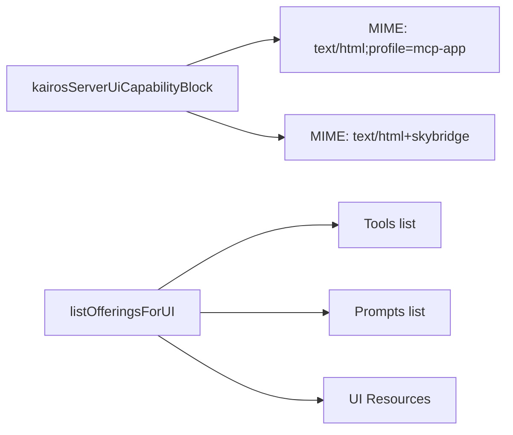
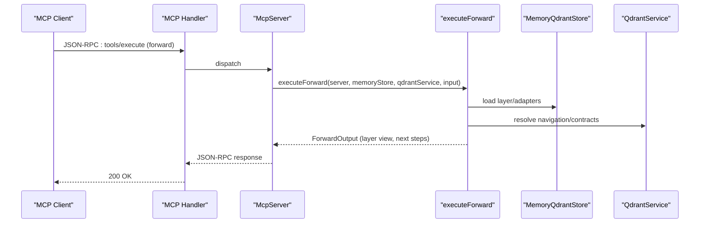
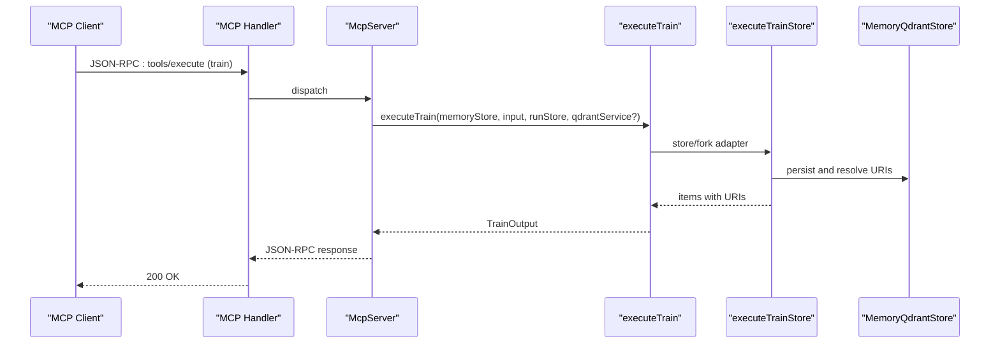
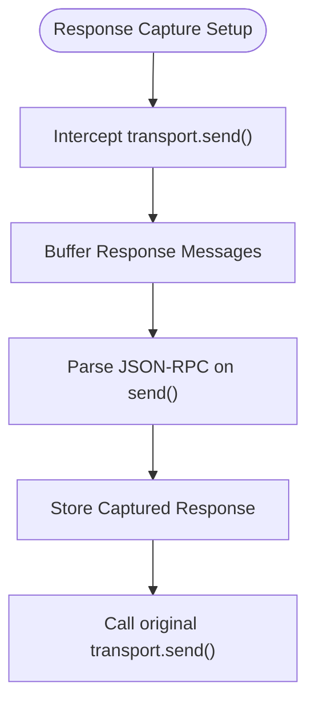
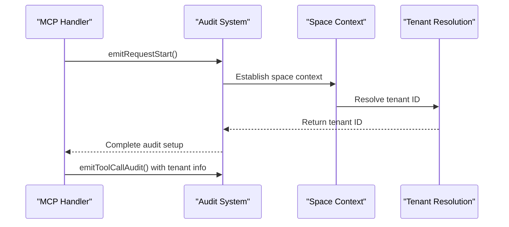
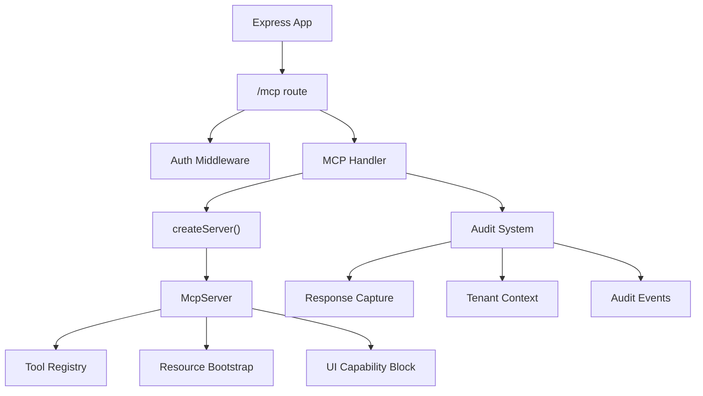

# MCP Protocol Architecture

<cite>
**Referenced Files in This Document**
- [src/server.ts](file://src/server.ts)
- [src/http/http-mcp-handler.ts](file://src/http/http-mcp-handler.ts)
- [src/http/http-auth-middleware.ts](file://src/http/http-auth-middleware.ts)
- [src/http/http-mcp-cors.ts](file://src/http/http-mcp-cors.ts)
- [src/http/mcp-audit-emit.ts](file://src/http/mcp-audit-emit.ts)
- [src/http/mcp-ui-offerings-auth-jsonrpc.ts](file://src/http/mcp-ui-offerings-auth-jsonrpc.ts)
- [src/mcp-apps/kairos-server-ui-capability.ts](file://src/mcp-apps/kairos-server-ui-capability.ts)
- [src/mcp-apps/list-offerings-for-ui.ts](file://src/mcp-apps/list-offerings-for-ui.ts)
- [src/mcp-apps/kairos-ui-constants.ts](file://src/mcp-apps/kairos-ui-constants.ts)
- [src/mcp-apps/register-activate-ui-resources.ts](file://src/mcp-apps/register-activate-ui-resources.ts)
- [src/mcp-apps/register-forward-ui-resources.ts](file://src/mcp-apps/register-forward-ui-resources.ts)
- [src/mcp-apps/register-spaces-ui-resources.ts](file://src/mcp-apps/register-spaces-ui-resources.ts)
- [src/tools/activate.ts](file://src/tools/activate.ts)
- [src/tools/forward.ts](file://src/tools/forward.ts)
- [src/tools/train.ts](file://src/tools/train.ts)
- [src/resources/resource-bootstrap.ts](file://src/resources/resource-bootstrap.ts)
- [src/http/http-error-handlers.ts](file://src/http/http-error-handlers.ts)
- [src/utils/tenant-context.ts](file://src/utils/tenant-context.ts)
- [src/utils/audit-mcp-summary.ts](file://src/utils/audit-mcp-summary.ts)
- [src/utils/structured-logger.ts](file://src/utils/structured-logger.ts)
- [docs/security/audit-log.md](file://docs/security/audit-log.md)
- [scripts/journey-export.mjs](file://scripts/journey-export.mjs)
</cite>

## Update Summary
**Changes Made**
- Enhanced MCP audit event system with corrected response capture mechanism for detailed logging
- Improved audit event timing with better tenant ID resolution within space context
- Updated MCP HTTP handler with enhanced response capture and audit event coordination
- Added comprehensive audit logging infrastructure for MCP protocol operations
- Integrated stream-level response capture approach for optimized request lifecycle management
- Enhanced tenant context handling within space context for improved operational visibility

## Table of Contents
1. [Introduction](#introduction)
2. [Project Structure](#project-structure)
3. [Core Components](#core-components)
4. [Architecture Overview](#architecture-overview)
5. [Detailed Component Analysis](#detailed-component-analysis)
6. [Audit and Monitoring System](#audit-and-monitoring-system)
7. [Dependency Analysis](#dependency-analysis)
8. [Performance Considerations](#performance-considerations)
9. [Troubleshooting Guide](#troubleshooting-guide)
10. [Conclusion](#conclusion)

## Introduction
This document describes the KAIROS Model Context Protocol (MCP) implementation over HTTP transport. It explains how the MCP server is constructed, how tools are registered and invoked, how resources and UI capabilities are exposed, and how authentication and authorization are enforced. The architecture now includes comprehensive audit logging with enhanced response capture mechanisms, improved tenant ID resolution within space context, and coordinated audit event timing for operational visibility.

## Project Structure
The MCP server is implemented as an Express application with dedicated routes and middleware. The server composes an MCP-compatible toolset and UI resources, registers them with the MCP SDK, and exposes them via an HTTP transport. A sophisticated audit system captures detailed request/response information with proper tenant context resolution.



**Diagram sources**
- [src/http/http-mcp-handler.ts:124-344](file://src/http/http-mcp-handler.ts#L124-L344)
- [src/http/mcp-audit-emit.ts:23-43](file://src/http/mcp-audit-emit.ts#L23-L43)
- [src/http/http-auth-middleware.ts:167-313](file://src/http/http-auth-middleware.ts#L167-L313)
- [src/server.ts:124-193](file://src/server.ts#L124-L193)

**Section sources**
- [src/server.ts:124-193](file://src/server.ts#L124-L193)
- [src/http/http-mcp-handler.ts:124-344](file://src/http/http-mcp-handler.ts#L124-L344)
- [src/http/http-auth-middleware.ts:167-313](file://src/http/http-auth-middleware.ts#L167-L313)
- [src/http/http-mcp-cors.ts:3-28](file://src/http/http-mcp-cors.ts#L3-L28)
- [src/http/mcp-audit-emit.ts:17-48](file://src/http/mcp-audit-emit.ts#L17-L48)

## Core Components
- HTTP transport and request lifecycle: The MCP endpoint accepts POST requests, validates authentication, enforces concurrency limits, and delegates to an MCP server instance per request with enhanced audit capabilities.
- Authentication and authorization: Session-based and Bearer token validation with OIDC integration; enforcement on protected paths including /mcp.
- Tool registration: Tools are registered with strict input/output schemas and optional UI metadata for MCP Apps.
- UI capability extensions: The server advertises support for MCP Apps HTML and Skybridge profiles and exposes UI resources for tools.
- Resource management: Resource handlers are bootstrapped to ensure MCP resource APIs are available even without public resources.
- **Enhanced Audit System**: Comprehensive response capture mechanism, improved tenant ID resolution within space context, and coordinated audit event timing for operational visibility.

**Section sources**
- [src/http/http-mcp-handler.ts:124-344](file://src/http/http-mcp-handler.ts#L124-L344)
- [src/http/http-auth-middleware.ts:167-313](file://src/http/http-auth-middleware.ts#L167-L313)
- [src/server.ts:124-193](file://src/server.ts#L124-L193)
- [src/mcp-apps/kairos-server-ui-capability.ts:7-13](file://src/mcp-apps/kairos-server-ui-capability.ts#L7-L13)
- [src/resources/resource-bootstrap.ts:8-44](file://src/resources/resource-bootstrap.ts#L8-L44)
- [src/http/mcp-audit-emit.ts:17-48](file://src/http/mcp-audit-emit.ts#L17-L48)

## Architecture Overview
The MCP server architecture integrates the MCP SDK with an Express application and enhanced audit capabilities. Requests are authenticated, optionally authorized, routed to an MCP server instance, and monitored with comprehensive audit logging that captures response details and resolves tenant context.



**Diagram sources**
- [src/http/http-mcp-handler.ts:124-344](file://src/http/http-mcp-handler.ts#L124-L344)
- [src/http/http-auth-middleware.ts:167-313](file://src/http/http-auth-middleware.ts#L167-L313)
- [src/http/mcp-audit-emit.ts:23-43](file://src/http/mcp-audit-emit.ts#L23-L43)

## Detailed Component Analysis

### HTTP Transport and Request Lifecycle
- Endpoint: POST /mcp
- Concurrency control: Tracks in-flight requests and rejects with 503 when exceeding configured limits.
- Authentication resolution: Supports session or Bearer token validation; logs and sanitizes errors.
- Request logging: Emits structured logs for request start/completion/cancel/close with timing.
- **Enhanced Audit Integration**: Response capture mechanism intercepts stream-level responses for detailed logging.
- Special handling: listOfferingsForUI is handled locally to return proper auth-related responses.



**Diagram sources**
- [src/http/http-mcp-handler.ts:124-344](file://src/http/http-mcp-handler.ts#L124-L344)
- [src/http/mcp-audit-emit.ts:23-43](file://src/http/mcp-audit-emit.ts#L23-L43)

**Section sources**
- [src/http/http-mcp-handler.ts:124-344](file://src/http/http-mcp-handler.ts#L124-L344)
- [src/http/mcp-audit-emit.ts:23-43](file://src/http/mcp-audit-emit.ts#L23-L43)

### Authentication and Authorization
- Protected paths: /api, /api/*, /mcp, /ui, /ui/*
- Modes:
  - Session cookie: Verified HMAC and claims; sets req.auth and space context.
  - Bearer token: Validated against trusted issuers and audiences when enabled.
- Behavior:
  - GET /mcp returns 401 with WWW-Authenticate to inform clients to connect.
  - Other methods return 401 JSON with login_url when applicable.
  - OIDC redirect for browser GET requests (non-/mcp).



**Diagram sources**
- [src/http/http-auth-middleware.ts:167-313](file://src/http/http-auth-middleware.ts#L167-L313)

**Section sources**
- [src/http/http-auth-middleware.ts:167-313](file://src/http/http-auth-middleware.ts#L167-L313)

### Tool Registration and Execution
- Tool registry: Centralized list defines tool metadata and schemas.
- Registration: Tools are registered with input/output schemas and optional UI metadata.
- Execution:
  - activate: Searches adapters and returns ranked choices with next actions and optional artifacts.
  - forward: Executes a forward pass over adapter layers, manages proof-of-work challenges, and transitions between layers.
  - train: Stores or forks adapters, normalizes inputs, and returns stored items with URIs.


**Diagram sources**
- [src/server.ts:42-108](file://src/server.ts#L42-L108)
- [src/tools/activate.ts:236-284](file://src/tools/activate.ts#L236-L284)
- [src/tools/forward.ts:93-318](file://src/tools/forward.ts#L93-L318)
- [src/tools/train.ts:240-346](file://src/tools/train.ts#L240-L346)

**Section sources**
- [src/server.ts:42-108](file://src/server.ts#L42-L108)
- [src/tools/activate.ts:208-234](file://src/tools/activate.ts#L208-L234)
- [src/tools/forward.ts:93-318](file://src/tools/forward.ts#L93-L318)
- [src/tools/train.ts:134-238](file://src/tools/train.ts#L134-L238)

### UI Capability Extensions (MCP Apps)
- Capability block: Declares support for MCP Apps HTML and Skybridge MIME types.
- Offerings: listOfferingsForUI returns tools, prompts, and UI resources with metadata for hosts implementing SEP-1865.
- Constants: Defines URIs and MIME types for activate, forward, and spaces widgets.



**Diagram sources**
- [src/mcp-apps/kairos-server-ui-capability.ts:7-13](file://src/mcp-apps/kairos-server-ui-capability.ts#L7-L13)
- [src/mcp-apps/list-offerings-for-ui.ts:162-179](file://src/mcp-apps/list-offerings-for-ui.ts#L162-L179)
- [src/mcp-apps/kairos-ui-constants.ts:7-68](file://src/mcp-apps/kairos-ui-constants.ts#L7-L68)

**Section sources**
- [src/mcp-apps/kairos-server-ui-capability.ts:7-13](file://src/mcp-apps/kairos-server-ui-capability.ts#L7-L13)
- [src/mcp-apps/list-offerings-for-ui.ts:162-179](file://src/mcp-apps/list-offerings-for-ui.ts#L162-L179)
- [src/mcp-apps/kairos-ui-constants.ts:7-68](file://src/mcp-apps/kairos-ui-constants.ts#L7-L68)

### Resource Management Patterns
- Bootstrap: Ensures resource handlers are installed even when no resources are registered.
- Docs and prompts: Registered from embedded resources.
- Templates: Resource templates are bootstrapped similarly to keep resource/template endpoints available.

**Section sources**
- [src/resources/resource-bootstrap.ts:8-44](file://src/resources/resource-bootstrap.ts#L8-L44)
- [src/server.ts:155-161](file://src/server.ts#L155-L161)

### Message Flow: activate Tool
```mermaid
sequenceDiagram
participant Client as "MCP Client"
participant Handler as "MCP Handler"
participant Server as "McpServer"
participant Activate as "executeActivate"
participant Search as "executeSearch"
participant Output as "ActivateOutput"
Client->>Handler : JSON-RPC : tools/execute (activate)
Handler->>Server : dispatch
Server->>Activate : executeActivate(...)
Activate->>Search : executeSearch(...)
Search-->>Activate : choices, scores
Activate-->>Output : structured choices + next actions
Output-->>Server : result
Server-->>Handler : JSON-RPC response
Handler-->>Client : 200 OK
```

**Diagram sources**
- [src/http/http-mcp-handler.ts:286-304](file://src/http/http-mcp-handler.ts#L286-L304)
- [src/tools/activate.ts:208-234](file://src/tools/activate.ts#L208-L234)

**Section sources**
- [src/tools/activate.ts:208-234](file://src/tools/activate.ts#L208-L234)

### Message Flow: forward Tool


**Diagram sources**
- [src/http/http-mcp-handler.ts:286-304](file://src/http/http-mcp-handler.ts#L286-L304)
- [src/tools/forward.ts:93-318](file://src/tools/forward.ts#L93-L318)

**Section sources**
- [src/tools/forward.ts:93-318](file://src/tools/forward.ts#L93-L318)

### Message Flow: train Tool


**Diagram sources**
- [src/http/http-mcp-handler.ts:286-304](file://src/http/http-mcp-handler.ts#L286-L304)
- [src/tools/train.ts:134-238](file://src/tools/train.ts#L134-L238)

**Section sources**
- [src/tools/train.ts:134-238](file://src/tools/train.ts#L134-L238)

### Error Handling and State Management
- Request lifecycle events:
  - Close: Logs client cancellations and long-lived closures.
  - Finish: Logs completion and duration.
  - Timeout: Warns around 25s for long-running requests.
- Error mapping:
  - KairosError is sanitized and mapped to JSON-RPC with helpful messages and retry hints.
  - Generic errors are mapped to SERVER_ERROR with safe details.
- Concurrency:
  - Tracks in-flight requests and rejects with 503 when limits are exceeded.
- CORS:
  - Exposes WWW-Authenticate header and allows MCP-Protocol-Version header.

**Section sources**
- [src/http/http-mcp-handler.ts:34-41](file://src/http/http-mcp-handler.ts#L34-L41)
- [src/http/http-mcp-handler.ts:87-118](file://src/http/http-mcp-handler.ts#L87-L118)
- [src/http/http-mcp-handler.ts:176-200](file://src/http/http-mcp-handler.ts#L176-L200)
- [src/http/http-mcp-cors.ts:3-28](file://src/http/http-mcp-cors.ts#L3-L28)

### Protocol Versioning, Backward Compatibility, and Extensions
- Versioning:
  - Server identifies itself with a build version during initialization.
- Backward compatibility:
  - Strict tool schemas are advertised via tools/list override to ensure clients receive precise schemas.
- Extensions:
  - MCP Apps UI capability block advertises supported MIME types for UI resources.
  - listOfferingsForUI provides tool and UI resource offerings for hosts implementing SEP-1865.

**Section sources**
- [src/server.ts:125-139](file://src/server.ts#L125-L139)
- [src/server.ts:110-122](file://src/server.ts#L110-L122)
- [src/mcp-apps/kairos-server-ui-capability.ts:7-13](file://src/mcp-apps/kairos-server-ui-capability.ts#L7-L13)
- [src/mcp-apps/list-offerings-for-ui.ts:162-179](file://src/mcp-apps/list-offerings-for-ui.ts#L162-L179)

### Integration Between MCP Tools and Application Architecture
- Tenant and space context: Authenticated requests establish a space context used by tools for scoping operations.
- Metrics: Tool calls, durations, and sizes are tracked for observability.
- Artifacts and exports: Tools integrate with artifact catalogs and capability generation for downloads.

**Section sources**
- [src/http/http-auth-middleware.ts:191-215](file://src/http/http-auth-middleware.ts#L191-L215)
- [src/tools/activate.ts:6-7](file://src/tools/activate.ts#L6-L7)
- [src/tools/train.ts:21](file://src/tools/train.ts#L21-L21)

## Audit and Monitoring System

### Enhanced Response Capture Mechanism
The MCP audit system now includes a sophisticated response capture mechanism that intercepts stream-level responses for detailed logging. This mechanism captures JSON-RPC responses at the transport level, allowing for comprehensive audit logging with configurable detail levels.

**Updated** Enhanced with stream-level response capture that intercepts transport.send() calls rather than Express response methods, ensuring proper JSON-RPC response capture for audit level 3. This change addresses architectural differences between Express and the MCP SDK's StreamableHTTPServerTransport.



**Diagram sources**
- [src/http/mcp-audit-emit.ts:24-37](file://src/http/mcp-audit-emit.ts#L24-L37)

### Improved Audit Event Timing
Audit events are now emitted with precise timing and improved tenant ID resolution. The system captures audit context within the space context, ensuring tenant information is available when tools are executed.

**Updated** Enhanced with improved tenant ID resolution within space context, ensuring accurate attribution of MCP operations to the correct tenant through the space context storage mechanism.



**Diagram sources**
- [src/http/mcp-audit-emit.ts:50-63](file://src/http/mcp-audit-emit.ts#L50-L63)
- [src/http/http-mcp-handler.ts:296-308](file://src/http/http-mcp-handler.ts#L296-L308)

### Tenant ID Resolution Within Space Context
The audit system now properly resolves tenant IDs within the space context, ensuring accurate attribution of MCP operations to the correct tenant. This enhancement improves the reliability of audit trails and operational monitoring.

**Updated** Integrated with the space context system that uses AsyncLocalStorage to maintain tenant context across asynchronous operations, providing consistent tenant identification throughout the request lifecycle.

**Section sources**
- [src/http/mcp-audit-emit.ts:17-48](file://src/http/mcp-audit-emit.ts#L17-L48)
- [src/http/http-mcp-handler.ts:296-308](file://src/http/http-mcp-handler.ts#L296-L308)
- [src/utils/tenant-context.ts:86-100](file://src/utils/tenant-context.ts#L86-L100)
- [src/utils/tenant-context.ts:245-298](file://src/utils/tenant-context.ts#L245-L298)

### Audit Logging Specification
The audit system follows a comprehensive specification for MCP protocol operations with configurable verbosity levels and standardized event formats.

**Updated** Enhanced with detailed audit logging specification covering MCP event names, correlation models, and JSONL format examples for operational investigations.

**Section sources**
- [docs/security/audit-log.md:105-137](file://docs/security/audit-log.md#L105-L137)
- [scripts/journey-export.mjs:114-200](file://scripts/journey-export.mjs#L114-L200)

### Audit Data Sanitization and Security
The audit system implements comprehensive data sanitization to protect sensitive information while maintaining audit utility.

**Updated** Enhanced with advanced sanitization policies including secret pattern redaction, size limits, and depth constraints for both request and response data.

**Section sources**
- [src/utils/audit-mcp-summary.ts:16-79](file://src/utils/audit-mcp-summary.ts#L16-L79)
- [src/utils/structured-logger.ts:55-142](file://src/utils/structured-logger.ts#L55-L142)

## Dependency Analysis


**Diagram sources**
- [src/http/http-mcp-handler.ts:124-344](file://src/http/http-mcp-handler.ts#L124-L344)
- [src/server.ts:124-193](file://src/server.ts#L124-L193)
- [src/http/mcp-audit-emit.ts:17-48](file://src/http/mcp-audit-emit.ts#L17-L48)

**Section sources**
- [src/http/http-mcp-handler.ts:124-344](file://src/http/http-mcp-handler.ts#L124-L344)
- [src/server.ts:124-193](file://src/server.ts#L124-L193)
- [src/http/mcp-audit-emit.ts:17-48](file://src/http/mcp-audit-emit.ts#L17-L48)

## Performance Considerations
- Concurrency limiting: Prevents overload by rejecting requests when concurrent limits are exceeded.
- Request timeouts: Logs warnings around 25s to detect slow operations.
- Logging levels: Structured logs include request IDs and durations for diagnostics.
- Resource availability: Bootstrapping ensures resource endpoints remain responsive even without registered resources.
- **Audit overhead**: Response capture adds minimal performance overhead while providing comprehensive audit capabilities.
- **Tenant resolution**: Efficient tenant ID resolution within space context minimizes performance impact.

## Troubleshooting Guide
- 401 Unauthorized on /mcp:
  - Ensure a valid session or Bearer token is provided; the server returns WWW-Authenticate and login_url when available.
- 503 Overloaded:
  - Reduce concurrent requests or wait for Retry-After seconds.
- Method Not Allowed:
  - Use POST /mcp; GET is rejected.
- CORS issues:
  - Verify Access-Control-Allow-Origin and exposed headers including WWW-Authenticate.
- **Audit logging issues**:
  - Check AUDIT_LOG_LEVEL configuration for appropriate verbosity.
  - Verify response capture is properly installed for detailed logging.
  - Ensure tenant context is established before audit events are emitted.

**Section sources**
- [src/http/http-auth-middleware.ts:292-313](file://src/http/http-auth-middleware.ts#L292-L313)
- [src/http/http-mcp-handler.ts:176-200](file://src/http/http-mcp-handler.ts#L176-L200)
- [src/http/http-error-handlers.ts:42-47](file://src/http/http-error-handlers.ts#L42-L47)
- [src/http/http-mcp-cors.ts:3-28](file://src/http/http-mcp-cors.ts#L3-L28)
- [src/http/mcp-audit-emit.ts:17-48](file://src/http/mcp-audit-emit.ts#L17-L48)

## Conclusion
The KAIROS MCP implementation provides a robust, authenticated, and extensible HTTP transport for the Model Context Protocol with comprehensive audit capabilities. The enhanced audit system includes sophisticated response capture mechanisms, improved tenant ID resolution within space context, and coordinated audit event timing for operational visibility. Tools are strictly typed and integrated with UI capability extensions for modern chat hosts. The architecture emphasizes observability, backward compatibility, and clear error handling, enabling reliable integration with diverse MCP clients while maintaining detailed operational insights.