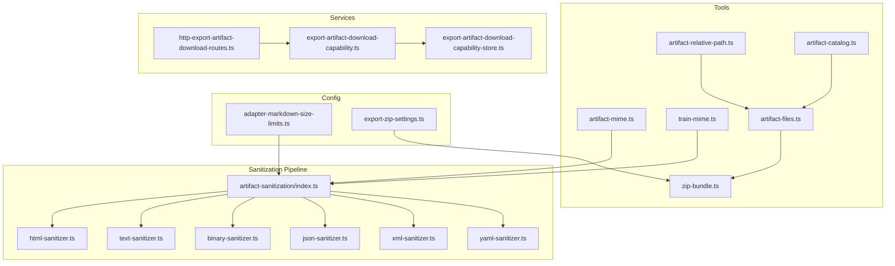
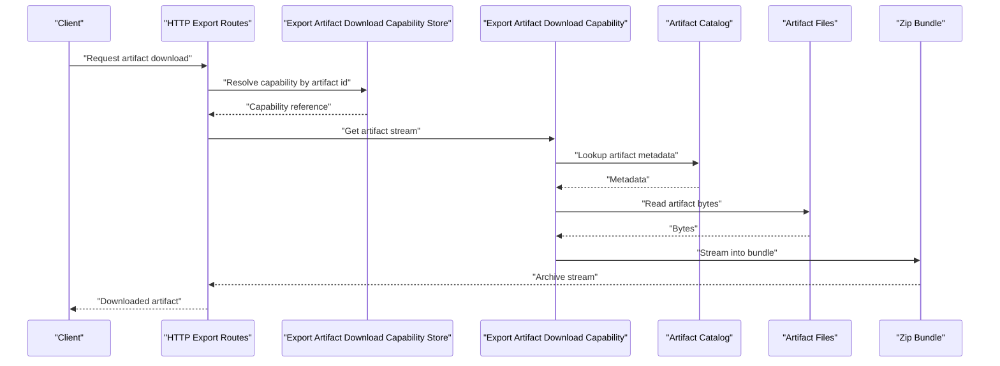
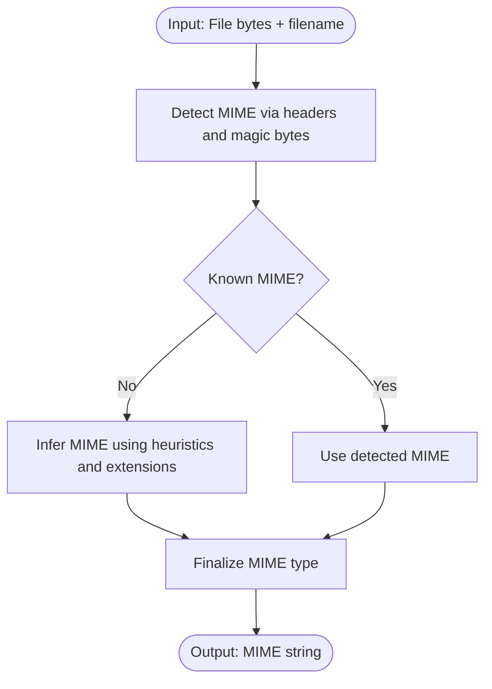
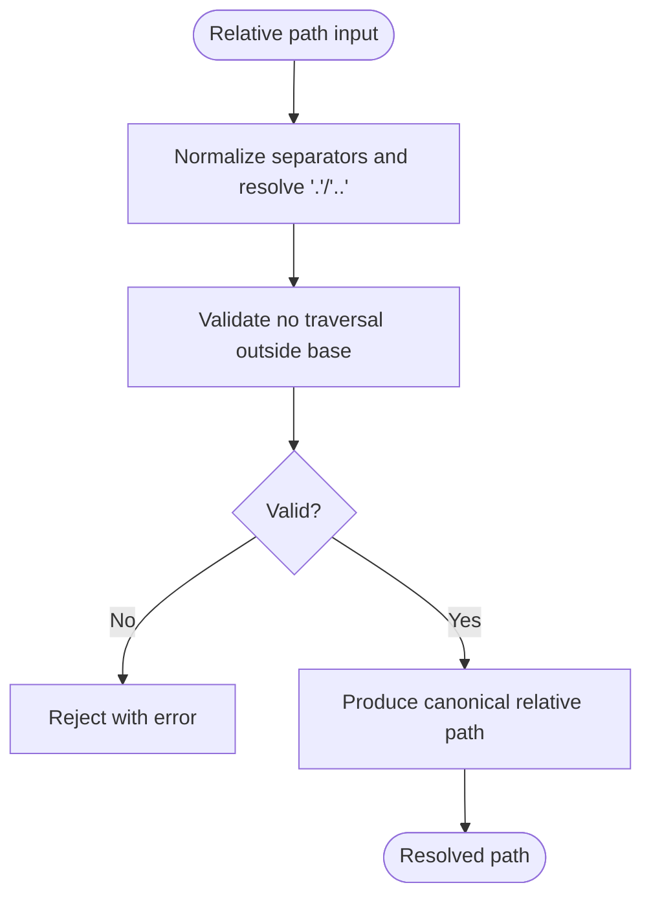
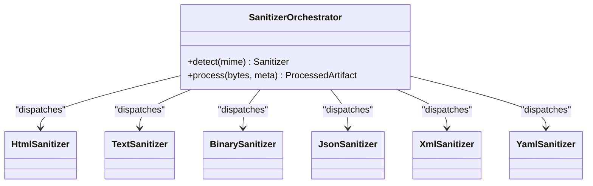
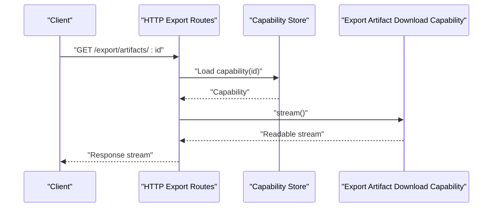
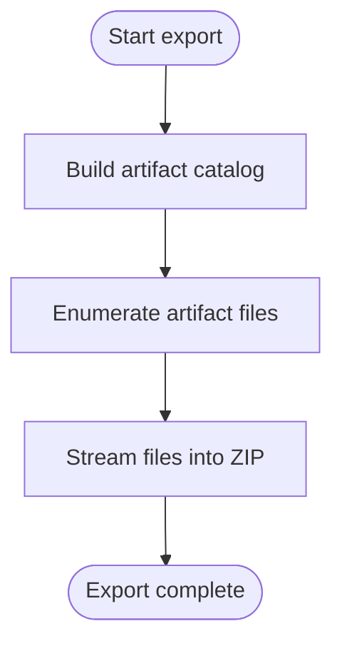
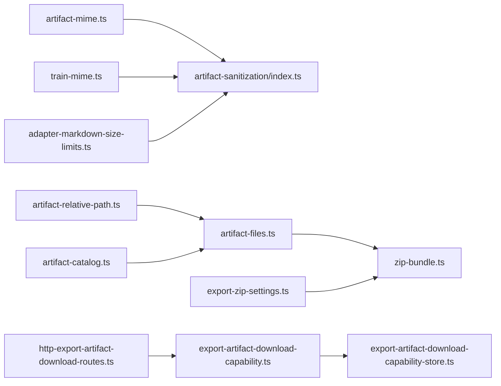

# Artifact Formats and Processing

<cite>
**Referenced Files in This Document**
- [artifact-mime.ts](file://src/tools/artifact-mime.ts)
- [train-mime.ts](file://src/tools/train-mime.ts)
- [artifact-relative-path.ts](file://src/tools/artifact-relative-path.ts)
- [artifact-sanitization/index.ts](file://src/tools/skill-export/artifact-sanitization/index.ts)
- [artifact-sanitization/html-sanitizer.ts](file://src/tools/skill-export/artifact-sanitization/html-sanitizer.ts)
- [artifact-sanitization/text-sanitizer.ts](file://src/tools/skill-export/artifact-sanitization/text-sanitizer.ts)
- [artifact-sanitization/binary-sanitizer.ts](file://src/tools/skill-export/artifact-sanitization/binary-sanitizer.ts)
- [artifact-sanitization/json-sanitizer.ts](file://src/tools/skill-export/artifact-sanitization/json-sanitizer.ts)
- [artifact-sanitization/xml-sanitizer.ts](file://src/tools/skill-export/artifact-sanitization/xml-sanitizer.ts)
- [artifact-sanitization/yaml-sanitizer.ts](file://src/tools/skill-export/artifact-sanitization/yaml-sanitizer.ts)
- [export-artifact-download-capability.ts](file://src/services/export-artifact-download-capability.ts)
- [export-artifact-download-capability-store.ts](file://src/services/export-artifact-download-capability-store.ts)
- [http-export-artifact-download-routes.ts](file://src/http/http-export-artifact-download-routes.ts)
- [artifact-catalog.ts](file://src/tools/artifact-catalog.ts)
- [artifact-files.ts](file://src/tools/skill-export/artifact-files.ts)
- [zip-bundle.ts](file://src/tools/skill-export/zip-bundle.ts)
- [validate-adapter-markdown-size.ts](file://src/services/memory/validate-adapter-markdown-size.ts)
- [adapter-markdown-size-limits.ts](file://src/config/adapter-markdown-size-limits.ts)
- [export-zip-settings.ts](file://src/config/export-zip-settings.ts)
- [mime-fixture-export-api.test.ts](file://tests/integration/mime-fixture-export-api.test.ts)
- [mime-fixture-export-cli.test.ts](file://tests/integration/mime-fixture-export-cli.test.ts)
- [mime-fixture-export-mcp.test.ts](file://tests/integration/mime-fixture-export-mcp.test.ts)
- [mime-artifact-fixture-contract.test.ts](file://tests/unit/mime-artifact-fixture-contract.test.ts)
- [train-artifact-mime-inference.test.ts](file://tests/unit/train-artifact-mime-inference.test.ts)
- [artifact-relative-path.test.ts](file://tests/unit/artifact-relative-path.test.ts)
</cite>

## Table of Contents
1. [Introduction](#introduction)
2. [Project Structure](#project-structure)
3. [Core Components](#core-components)
4. [Architecture Overview](#architecture-overview)
5. [Detailed Component Analysis](#detailed-component-analysis)
6. [Dependency Analysis](#dependency-analysis)
7. [Performance Considerations](#performance-considerations)
8. [Troubleshooting Guide](#troubleshooting-guide)
9. [Conclusion](#conclusion)
10. [Appendices](#appendices)

## Introduction
This document explains how Kairos MCP supports artifact formats and processes them through validation, sanitization, and optimization stages. It covers supported file types (text, code, binary, structured data), MIME type detection and inference for unknown types, the relative path system used to organize artifacts within skill bundles, configuration options for processing rules and size limits, and extension points for adding custom format processors.

## Project Structure
Artifact-related functionality is primarily implemented under:
- Tools layer: MIME detection, relative paths, export helpers, and cataloging
- Services layer: Export capability stores and HTTP routes for artifact downloads
- Sanitization pipeline: Format-specific sanitizers for HTML, text, JSON, XML, YAML, and binary
- Configuration: Size limits and export settings
- Tests: Integration and unit tests validating MIME handling, relative paths, and export behavior

**Diagram sources**
- [artifact-mime.ts](file://src/tools/artifact-mime.ts)
- [train-mime.ts](file://src/tools/train-mime.ts)
- [artifact-relative-path.ts](file://src/tools/artifact-relative-path.ts)
- [artifact-catalog.ts](file://src/tools/artifact-catalog.ts)
- [artifact-files.ts](file://src/tools/skill-export/artifact-files.ts)
- [zip-bundle.ts](file://src/tools/skill-export/zip-bundle.ts)
- [artifact-sanitization/index.ts](file://src/tools/skill-export/artifact-sanitization/index.ts)
- [artifact-sanitization/html-sanitizer.ts](file://src/tools/skill-export/artifact-sanitization/html-sanitizer.ts)
- [artifact-sanitization/text-sanitizer.ts](file://src/tools/skill-export/artifact-sanitization/text-sanitizer.ts)
- [artifact-sanitization/binary-sanitizer.ts](file://src/tools/skill-export/artifact-sanitization/binary-sanitizer.ts)
- [artifact-sanitization/json-sanitizer.ts](file://src/tools/skill-export/artifact-sanitization/json-sanitizer.ts)
- [artifact-sanitization/xml-sanitizer.ts](file://src/tools/skill-export/artifact-sanitization/xml-sanitizer.ts)
- [artifact-sanitization/yaml-sanitizer.ts](file://src/tools/skill-export/artifact-sanitization/yaml-sanitizer.ts)
- [export-artifact-download-capability.ts](file://src/services/export-artifact-download-capability.ts)
- [export-artifact-download-capability-store.ts](file://src/services/export-artifact-download-capability-store.ts)
- [http-export-artifact-download-routes.ts](file://src/http/http-export-artifact-download-routes.ts)
- [adapter-markdown-size-limits.ts](file://src/config/adapter-markdown-size-limits.ts)
- [export-zip-settings.ts](file://src/config/export-zip-settings.ts)

**Section sources**
- [artifact-mime.ts](file://src/tools/artifact-mime.ts)
- [train-mime.ts](file://src/tools/train-mime.ts)
- [artifact-relative-path.ts](file://src/tools/artifact-relative-path.ts)
- [artifact-catalog.ts](file://src/tools/artifact-catalog.ts)
- [artifact-files.ts](file://src/tools/skill-export/artifact-files.ts)
- [zip-bundle.ts](file://src/tools/skill-export/zip-bundle.ts)
- [artifact-sanitization/index.ts](file://src/tools/skill-export/artifact-sanitization/index.ts)
- [export-artifact-download-capability.ts](file://src/services/export-artifact-download-capability.ts)
- [export-artifact-download-capability-store.ts](file://src/services/export-artifact-download-capability-store.ts)
- [http-export-artifact-download-routes.ts](file://src/http/http-export-artifact-download-routes.ts)
- [adapter-markdown-size-limits.ts](file://src/config/adapter-markdown-size-limits.ts)
- [export-zip-settings.ts](file://src/config/export-zip-settings.ts)

## Core Components
- MIME detection and inference
  - General-purpose MIME detection for artifacts
  - Training-time MIME inference for unknown types
- Relative path system
  - Canonicalization and resolution of artifact paths within skill bundles
- Sanitization pipeline
  - Central orchestrator dispatching to format-specific sanitizers
  - Supported sanitizers: HTML, text, binary, JSON, XML, YAML
- Export capabilities
  - Capability store and HTTP routes for artifact download during exports
- Cataloging and bundling
  - Artifact cataloging, file enumeration, and ZIP bundle creation

Key responsibilities:
- Determine content type safely and consistently across tools and services
- Normalize and validate artifact paths for reliable referencing
- Transform artifacts through a secure, configurable pipeline
- Provide stable download endpoints for exported artifacts

**Section sources**
- [artifact-mime.ts](file://src/tools/artifact-mime.ts)
- [train-mime.ts](file://src/tools/train-mime.ts)
- [artifact-relative-path.ts](file://src/tools/artifact-relative-path.ts)
- [artifact-sanitization/index.ts](file://src/tools/skill-export/artifact-sanitization/index.ts)
- [artifact-sanitization/html-sanitizer.ts](file://src/tools/skill-export/artifact-sanitization/html-sanitizer.ts)
- [artifact-sanitization/text-sanitizer.ts](file://src/tools/skill-export/artifact-sanitization/text-sanitizer.ts)
- [artifact-sanitization/binary-sanitizer.ts](file://src/tools/skill-export/artifact-sanitization/binary-sanitizer.ts)
- [artifact-sanitization/json-sanitizer.ts](file://src/tools/skill-export/artifact-sanitization/json-sanitizer.ts)
- [artifact-sanitization/xml-sanitizer.ts](file://src/tools/skill-export/artifact-sanitization/xml-sanitizer.ts)
- [artifact-sanitization/yaml-sanitizer.ts](file://src/tools/skill-export/artifact-sanitization/yaml-sanitizer.ts)
- [export-artifact-download-capability.ts](file://src/services/export-artifact-download-capability.ts)
- [export-artifact-download-capability-store.ts](file://src/services/export-artifact-download-capability-store.ts)
- [http-export-artifact-download-routes.ts](file://src/http/http-export-artifact-download-routes.ts)
- [artifact-catalog.ts](file://src/tools/artifact-catalog.ts)
- [artifact-files.ts](file://src/tools/skill-export/artifact-files.ts)
- [zip-bundle.ts](file://src/tools/skill-export/zip-bundle.ts)

## Architecture Overview
The artifact processing architecture follows a layered approach:
- Detection layer: Determines MIME type from content or metadata
- Path normalization layer: Resolves relative paths within skill bundles
- Transformation layer: Applies sanitization and optional optimizations
- Export layer: Persists processed artifacts and exposes download endpoints

**Diagram sources**
- [http-export-artifact-download-routes.ts](file://src/http/http-export-artifact-download-routes.ts)
- [export-artifact-download-capability-store.ts](file://src/services/export-artifact-download-capability-store.ts)
- [export-artifact-download-capability.ts](file://src/services/export-artifact-download-capability.ts)
- [artifact-catalog.ts](file://src/tools/artifact-catalog.ts)
- [artifact-files.ts](file://src/tools/skill-export/artifact-files.ts)
- [zip-bundle.ts](file://src/tools/skill-export/zip-bundle.ts)

## Detailed Component Analysis

### MIME Type Detection and Inference
Kairos provides two complementary mechanisms:
- Artifact MIME detection for general use
- Training-time MIME inference tailored for training pipelines

These components ensure consistent content-type identification across tools and services, including fallbacks for unknown types.

**Diagram sources**
- [artifact-mime.ts](file://src/tools/artifact-mime.ts)
- [train-mime.ts](file://src/tools/train-mime.ts)

**Section sources**
- [artifact-mime.ts](file://src/tools/artifact-mime.ts)
- [train-mime.ts](file://src/tools/train-mime.ts)
- [mime-fixture-export-api.test.ts](file://tests/integration/mime-fixture-export-api.test.ts)
- [mime-fixture-export-cli.test.ts](file://tests/integration/mime-fixture-export-cli.test.ts)
- [mime-fixture-export-mcp.test.ts](file://tests/integration/mime-fixture-export-mcp.test.ts)
- [mime-artifact-fixture-contract.test.ts](file://tests/unit/mime-artifact-fixture-contract.test.ts)
- [train-artifact-mime-inference.test.ts](file://tests/unit/train-artifact-mime-inference.test.ts)

### Relative Path System for Artifacts
The relative path system ensures deterministic organization and referencing of files within skill bundles. It normalizes paths, resolves dot segments, and validates traversal constraints to prevent directory escape.

**Diagram sources**
- [artifact-relative-path.ts](file://src/tools/artifact-relative-path.ts)

**Section sources**
- [artifact-relative-path.ts](file://src/tools/artifact-relative-path.ts)
- [artifact-relative-path.test.ts](file://tests/unit/artifact-relative-path.test.ts)

### Sanitization Pipeline
The central orchestrator selects a sanitizer based on MIME type and applies transformation steps. Supported sanitizers include:
- HTML: Strip dangerous elements and attributes
- Text: Normalize encoding and remove unsafe control characters
- Binary: Enforce size limits and structural checks
- JSON: Parse and re-serialize to normalize structure
- XML: Validate and sanitize markup
- YAML: Parse and re-serialize to normalize structure

**Diagram sources**
- [artifact-sanitization/index.ts](file://src/tools/skill-export/artifact-sanitization/index.ts)
- [artifact-sanitization/html-sanitizer.ts](file://src/tools/skill-export/artifact-sanitization/html-sanitizer.ts)
- [artifact-sanitization/text-sanitizer.ts](file://src/tools/skill-export/artifact-sanitization/text-sanitizer.ts)
- [artifact-sanitization/binary-sanitizer.ts](file://src/tools/skill-export/artifact-sanitization/binary-sanitizer.ts)
- [artifact-sanitization/json-sanitizer.ts](file://src/tools/skill-export/artifact-sanitization/json-sanitizer.ts)
- [artifact-sanitization/xml-sanitizer.ts](file://src/tools/skill-export/artifact-sanitization/xml-sanitizer.ts)
- [artifact-sanitization/yaml-sanitizer.ts](file://src/tools/skill-export/artifact-sanitization/yaml-sanitizer.ts)

**Section sources**
- [artifact-sanitization/index.ts](file://src/tools/skill-export/artifact-sanitization/index.ts)
- [artifact-sanitization/html-sanitizer.ts](file://src/tools/skill-export/artifact-sanitization/html-sanitizer.ts)
- [artifact-sanitization/text-sanitizer.ts](file://src/tools/skill-export/artifact-sanitization/text-sanitizer.ts)
- [artifact-sanitization/binary-sanitizer.ts](file://src/tools/skill-export/artifact-sanitization/binary-sanitizer.ts)
- [artifact-sanitization/json-sanitizer.ts](file://src/tools/skill-export/artifact-sanitization/json-sanitizer.ts)
- [artifact-sanitization/xml-sanitizer.ts](file://src/tools/skill-export/artifact-sanitization/xml-sanitizer.ts)
- [artifact-sanitization/yaml-sanitizer.ts](file://src/tools/skill-export/artifact-sanitization/yaml-sanitizer.ts)

### Export Artifact Download Capability
The capability abstraction encapsulates artifact retrieval and streaming logic, backed by a capability store and exposed via HTTP routes.

**Diagram sources**
- [http-export-artifact-download-routes.ts](file://src/http/http-export-artifact-download-routes.ts)
- [export-artifact-download-capability-store.ts](file://src/services/export-artifact-download-capability-store.ts)
- [export-artifact-download-capability.ts](file://src/services/export-artifact-download-capability.ts)

**Section sources**
- [http-export-artifact-download-routes.ts](file://src/http/http-export-artifact-download-routes.ts)
- [export-artifact-download-capability-store.ts](file://src/services/export-artifact-download-capability-store.ts)
- [export-artifact-download-capability.ts](file://src/services/export-artifact-download-capability.ts)

### Artifact Cataloging and Bundling
Artifacts are cataloged, enumerated, and packaged into ZIP bundles for export. The catalog maintains metadata and references, while the bundler streams files efficiently.

**Diagram sources**
- [artifact-catalog.ts](file://src/tools/artifact-catalog.ts)
- [artifact-files.ts](file://src/tools/skill-export/artifact-files.ts)
- [zip-bundle.ts](file://src/tools/skill-export/zip-bundle.ts)

**Section sources**
- [artifact-catalog.ts](file://src/tools/artifact-catalog.ts)
- [artifact-files.ts](file://src/tools/skill-export/artifact-files.ts)
- [zip-bundle.ts](file://src/tools/skill-export/zip-bundle.ts)

## Dependency Analysis
The following diagram shows key dependencies between artifact processing modules:

**Diagram sources**
- [artifact-mime.ts](file://src/tools/artifact-mime.ts)
- [train-mime.ts](file://src/tools/train-mime.ts)
- [artifact-sanitization/index.ts](file://src/tools/skill-export/artifact-sanitization/index.ts)
- [artifact-relative-path.ts](file://src/tools/artifact-relative-path.ts)
- [artifact-files.ts](file://src/tools/skill-export/artifact-files.ts)
- [artifact-catalog.ts](file://src/tools/artifact-catalog.ts)
- [zip-bundle.ts](file://src/tools/skill-export/zip-bundle.ts)
- [export-artifact-download-capability.ts](file://src/services/export-artifact-download-capability.ts)
- [export-artifact-download-capability-store.ts](file://src/services/export-artifact-download-capability-store.ts)
- [http-export-artifact-download-routes.ts](file://src/http/http-export-artifact-download-routes.ts)
- [adapter-markdown-size-limits.ts](file://src/config/adapter-markdown-size-limits.ts)
- [export-zip-settings.ts](file://src/config/export-zip-settings.ts)

**Section sources**
- [artifact-mime.ts](file://src/tools/artifact-mime.ts)
- [train-mime.ts](file://src/tools/train-mime.ts)
- [artifact-sanitization/index.ts](file://src/tools/skill-export/artifact-sanitization/index.ts)
- [artifact-relative-path.ts](file://src/tools/artifact-relative-path.ts)
- [artifact-files.ts](file://src/tools/skill-export/artifact-files.ts)
- [artifact-catalog.ts](file://src/tools/artifact-catalog.ts)
- [zip-bundle.ts](file://src/tools/skill-export/zip-bundle.ts)
- [export-artifact-download-capability.ts](file://src/services/export-artifact-download-capability.ts)
- [export-artifact-download-capability-store.ts](file://src/services/export-artifact-download-capability-store.ts)
- [http-export-artifact-download-routes.ts](file://src/http/http-export-artifact-download-routes.ts)
- [adapter-markdown-size-limits.ts](file://src/config/adapter-markdown-size-limits.ts)
- [export-zip-settings.ts](file://src/config/export-zip-settings.ts)

## Performance Considerations
- Streaming: Prefer streaming over buffering for large artifacts to reduce memory pressure
- Early validation: Apply size and structural checks before heavy transformations
- Caching: Cache MIME detection results when appropriate to avoid repeated analysis
- Parallelism: Process independent artifacts concurrently where safe
- Compression: Use efficient compression strategies for ZIP bundles

[No sources needed since this section provides general guidance]

## Troubleshooting Guide
Common issues and resolutions:
- MIME mismatch: Verify detection logic and test fixtures; check integration tests for MIME fixture coverage
- Path traversal errors: Ensure relative path normalization rejects '..' escapes
- Sanitization failures: Inspect sanitizer logs and adjust allowed tags/attributes for HTML/XML/YAML/JSON
- Export download errors: Confirm capability store entries and route mappings

Relevant tests:
- MIME fixture export across API, CLI, and MCP
- Unit contract tests for MIME fixtures
- Training-time MIME inference tests
- Relative path normalization tests

**Section sources**
- [mime-fixture-export-api.test.ts](file://tests/integration/mime-fixture-export-api.test.ts)
- [mime-fixture-export-cli.test.ts](file://tests/integration/mime-fixture-export-cli.test.ts)
- [mime-fixture-export-mcp.test.ts](file://tests/integration/mime-fixture-export-mcp.test.ts)
- [mime-artifact-fixture-contract.test.ts](file://tests/unit/mime-artifact-fixture-contract.test.ts)
- [train-artifact-mime-inference.test.ts](file://tests/unit/train-artifact-mime-inference.test.ts)
- [artifact-relative-path.test.ts](file://tests/unit/artifact-relative-path.test.ts)

## Conclusion
Kairos MCP implements a robust artifact format support system with reliable MIME detection, secure sanitization, normalized relative paths, and efficient export capabilities. The modular design enables easy extension for new formats and fine-grained configuration of processing rules and limits.

[No sources needed since this section summarizes without analyzing specific files]

## Appendices

### Supported Formats and Processing Rules
- Text and code: Normalized encoding, control character filtering, size limits
- Structured data: JSON, XML, YAML parsed and re-serialized for normalization and safety
- Binary: Structural checks and size enforcement
- HTML: Dangerous element and attribute stripping

Configuration highlights:
- Markdown size limits for adapters
- Export ZIP settings for bundle behavior

**Section sources**
- [adapter-markdown-size-limits.ts](file://src/config/adapter-markdown-size-limits.ts)
- [export-zip-settings.ts](file://src/config/export-zip-settings.ts)
- [validate-adapter-markdown-size.ts](file://src/services/memory/validate-adapter-markdown-size.ts)

### Extension Points for Custom Format Processors
To add a new format processor:
- Implement a sanitizer module that adheres to the orchestrator’s interface
- Register the sanitizer in the orchestrator’s MIME-to-sanitizer mapping
- Add tests covering detection, sanitization, and edge cases
- Update configuration if size limits or encoding rules are format-specific

**Section sources**
- [artifact-sanitization/index.ts](file://src/tools/skill-export/artifact-sanitization/index.ts)
- [artifact-sanitization/html-sanitizer.ts](file://src/tools/skill-export/artifact-sanitization/html-sanitizer.ts)
- [artifact-sanitization/text-sanitizer.ts](file://src/tools/skill-export/artifact-sanitization/text-sanitizer.ts)
- [artifact-sanitization/binary-sanitizer.ts](file://src/tools/skill-export/artifact-sanitization/binary-sanitizer.ts)
- [artifact-sanitization/json-sanitizer.ts](file://src/tools/skill-export/artifact-sanitization/json-sanitizer.ts)
- [artifact-sanitization/xml-sanitizer.ts](file://src/tools/skill-export/artifact-sanitization/xml-sanitizer.ts)
- [artifact-sanitization/yaml-sanitizer.ts](file://src/tools/skill-export/artifact-sanitization/yaml-sanitizer.ts)