# Artifact Management

<cite>
**Referenced Files in This Document**
- [artifacts.md](file://docs/architecture/artifacts.md)
- [artifact-metadata.ts](file://src/services/memory/artifact-metadata.ts)
- [store-artifact.ts](file://src/services/memory/store-artifact.ts)
- [store-adapter.ts](file://src/services/memory/store-adapter.ts)
- [artifact-sanitization/index.ts](file://src/tools/skill-export/artifact-sanitization/index.ts)
- [sha256.ts](file://src/tools/skill-export/sha256.ts)
- [zip-bundle.ts](file://src/tools/skill-export/zip-bundle.ts)
- [export.ts](file://src/tools/export.ts)
- [export-download-capability.ts](file://src/services/export-download-capability.ts)
- [http-export-artifact-download-routes.ts](file://src/http/http-export-artifact-download-routes.ts)
- [config.ts](file://src/config.ts)
- [key-value-store-factory.ts](file://src/services/key-value-store-factory.ts)
- [redis-cache.ts](file://src/services/redis-cache.ts)
- [qdrant-memory-store.ts](file://src/services/qdrant/memory-store.ts)
- [memory-store.ts](file://src/services/memory-store.ts)
- [artifact-catalog.ts](file://src/tools/artifact-catalog.ts)
- [artifact-relative-path.ts](file://src/tools/artifact-relative-path.ts)
- [artifact-mime.ts](file://src/tools/artifact-mime.ts)
- [train-artifact-adapter-uri.ts](file://src/tools/train-artifact-adapter-uri.ts)
- [validate-protocol-structure.ts](file://src/services/memory/validate-protocol-structure.ts)
- [mcp-contract-match.ts](file://src/tools/mcp-contract-match.ts)
</cite>

## Table of Contents
1. [Introduction](#introduction)
2. [Project Structure](#project-structure)
3. [Core Components](#core-components)
4. [Architecture Overview](#architecture-overview)
5. [Detailed Component Analysis](#detailed-component-analysis)
6. [Dependency Analysis](#dependency-analysis)
7. [Performance Considerations](#performance-considerations)
8. [Troubleshooting Guide](#troubleshooting-guide)
9. [Conclusion](#conclusion)
10. [Appendices](#appendices)

## Introduction
This document explains the artifact management system within Kairos MCP. It covers multi-format file handling, content transformation pipelines, metadata extraction, storage strategies, versioning integration, lifecycle management, export/import workflows, sanitization and security scanning, configuration options for storage backends and compression, access controls, schema contracts and validation, and performance considerations for large files and concurrent access.

## Project Structure
Artifact-related functionality spans several layers:
- HTTP routes for artifact downloads and exports
- Export pipeline utilities (ZIP bundling, checksums, sanitization)
- Memory store abstractions and Qdrant-backed persistence
- Configuration and key-value stores for runtime settings
- Contract matching and schema validation for artifacts

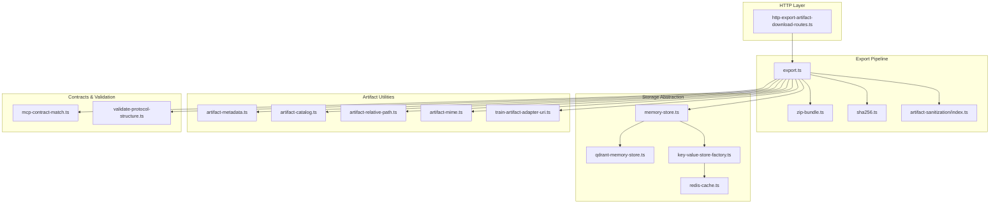

**Diagram sources**
- [http-export-artifact-download-routes.ts](file://src/http/http-export-artifact-download-routes.ts)
- [export.ts](file://src/tools/export.ts)
- [zip-bundle.ts](file://src/tools/skill-export/zip-bundle.ts)
- [sha256.ts](file://src/tools/skill-export/sha256.ts)
- [artifact-sanitization/index.ts](file://src/tools/skill-export/artifact-sanitization/index.ts)
- [memory-store.ts](file://src/services/memory-store.ts)
- [qdrant-memory-store.ts](file://src/services/qdrant/memory-store.ts)
- [key-value-store-factory.ts](file://src/services/key-value-store-factory.ts)
- [redis-cache.ts](file://src/services/redis-cache.ts)
- [artifact-metadata.ts](file://src/services/memory/artifact-metadata.ts)
- [artifact-catalog.ts](file://src/tools/artifact-catalog.ts)
- [artifact-relative-path.ts](file://src/tools/artifact-relative-path.ts)
- [artifact-mime.ts](file://src/tools/artifact-mime.ts)
- [train-artifact-adapter-uri.ts](file://src/tools/train-artifact-adapter-uri.ts)
- [mcp-contract-match.ts](file://src/tools/mcp-contract-match.ts)
- [validate-protocol-structure.ts](file://src/services/memory/validate-protocol-structure.ts)

**Section sources**
- [artifacts.md](file://docs/architecture/artifacts.md)

## Core Components
- Artifact metadata extraction and normalization
- Storage adapters for memory and vector search backends
- Export pipeline with ZIP packaging and integrity checks
- Sanitization and security scanning for exported artifacts
- Contract-based validation and schema enforcement
- HTTP endpoints for artifact download and export

Key responsibilities:
- Identify supported formats and MIME types
- Compute checksums and build catalogs
- Apply sanitization rules before export
- Persist artifacts and associated metadata
- Provide secure, authenticated download links

**Section sources**
- [artifact-metadata.ts](file://src/services/memory/artifact-metadata.ts)
- [store-adapter.ts](file://src/services/memory/store-adapter.ts)
- [store-artifact.ts](file://src/services/memory/store-artifact.ts)
- [export.ts](file://src/tools/export.ts)
- [zip-bundle.ts](file://src/tools/skill-export/zip-bundle.ts)
- [sha256.ts](file://src/tools/skill-export/sha256.ts)
- [artifact-sanitization/index.ts](file://src/tools/skill-export/artifact-sanitization/index.ts)
- [artifact-catalog.ts](file://src/tools/artifact-catalog.ts)
- [artifact-relative-path.ts](file://src/tools/artifact-relative-path.ts)
- [artifact-mime.ts](file://src/tools/artifact-mime.ts)
- [train-artifact-adapter-uri.ts](file://src/tools/train-artifact-adapter-uri.ts)
- [mcp-contract-match.ts](file://src/tools/mcp-contract-match.ts)
- [validate-protocol-structure.ts](file://src/services/memory/validate-protocol-structure.ts)

## Architecture Overview
The artifact system integrates HTTP endpoints with an export pipeline that reads from storage adapters, applies transformations, and produces downloadable bundles. Metadata is extracted and persisted alongside artifacts. Contracts define schemas and validation rules enforced during processing.

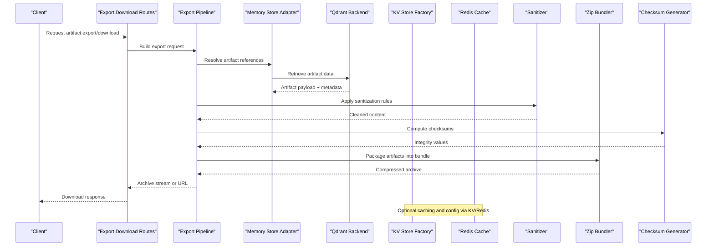

**Diagram sources**
- [http-export-artifact-download-routes.ts](file://src/http/http-export-artifact-download-routes.ts)
- [export.ts](file://src/tools/export.ts)
- [store-adapter.ts](file://src/services/memory/store-adapter.ts)
- [qdrant-memory-store.ts](file://src/services/qdrant/memory-store.ts)
- [key-value-store-factory.ts](file://src/services/key-value-store-factory.ts)
- [redis-cache.ts](file://src/services/redis-cache.ts)
- [artifact-sanitization/index.ts](file://src/tools/skill-export/artifact-sanitization/index.ts)
- [zip-bundle.ts](file://src/tools/skill-export/zip-bundle.ts)
- [sha256.ts](file://src/tools/skill-export/sha256.ts)

## Detailed Component Analysis

### Multi-Format File Handling and Content Transformation
Supported formats are inferred via MIME detection and adapter URIs. The pipeline normalizes inputs, extracts text and structured content, and prepares assets for downstream use (e.g., training, export).

- MIME inference and mapping
- Relative path resolution for cross-references
- Adapter URI normalization for training and export
- Catalog generation for asset indexing

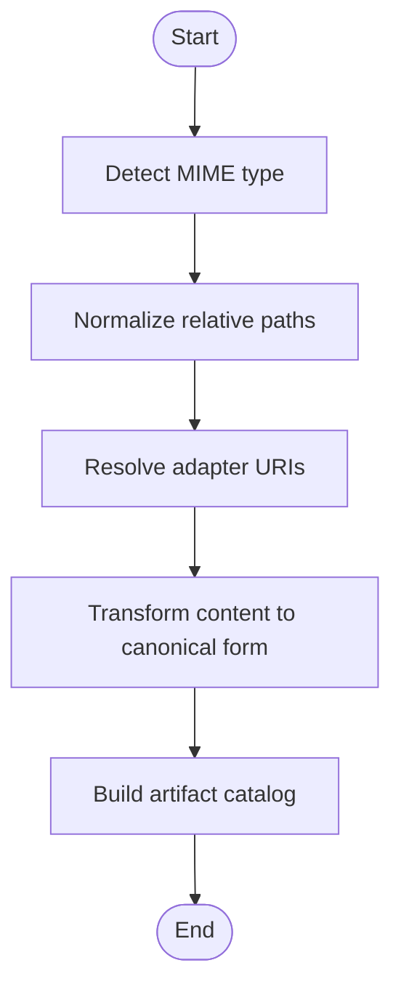

**Diagram sources**
- [artifact-mime.ts](file://src/tools/artifact-mime.ts)
- [artifact-relative-path.ts](file://src/tools/artifact-relative-path.ts)
- [train-artifact-adapter-uri.ts](file://src/tools/train-artifact-adapter-uri.ts)
- [artifact-catalog.ts](file://src/tools/artifact-catalog.ts)

**Section sources**
- [artifact-mime.ts](file://src/tools/artifact-mime.ts)
- [artifact-relative-path.ts](file://src/tools/artifact-relative-path.ts)
- [train-artifact-adapter-uri.ts](file://src/tools/train-artifact-adapter-uri.ts)
- [artifact-catalog.ts](file://src/tools/artifact-catalog.ts)

### Metadata Extraction and Version Control Integration
Metadata extraction includes titles, descriptions, tags, and provenance. Version control integration is achieved through stable identifiers and checksums, enabling reproducible exports and diffs across environments.

- Extract and normalize artifact metadata
- Generate deterministic checksums for integrity
- Maintain catalogs linking artifacts to versions

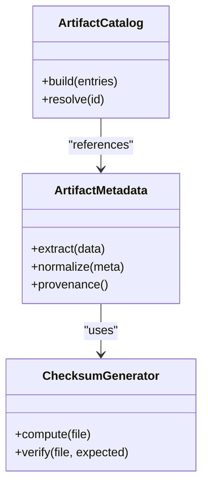

**Diagram sources**
- [artifact-metadata.ts](file://src/services/memory/artifact-metadata.ts)
- [sha256.ts](file://src/tools/skill-export/sha256.ts)
- [artifact-catalog.ts](file://src/tools/artifact-catalog.ts)

**Section sources**
- [artifact-metadata.ts](file://src/services/memory/artifact-metadata.ts)
- [sha256.ts](file://src/tools/skill-export/sha256.ts)
- [artifact-catalog.ts](file://src/tools/artifact-catalog.ts)

### Artifact Storage Strategies
Storage is abstracted via a memory store adapter backed by Qdrant for vector search and persistence. Key-value stores manage runtime configuration and caches.

- Memory store adapter interface
- Qdrant-backed implementation for retrieval and updates
- Key-value factory for environment-specific backends
- Redis cache for performance-sensitive lookups

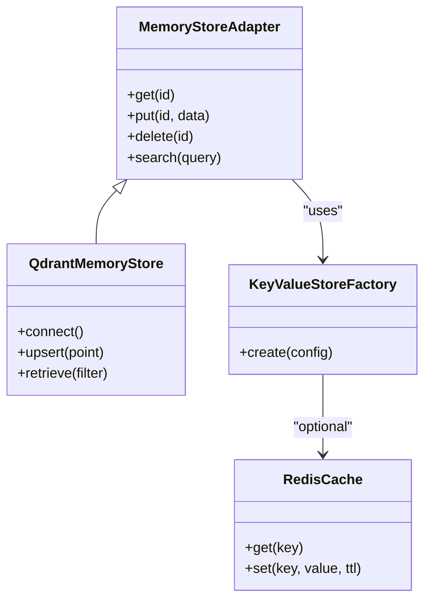

**Diagram sources**
- [store-adapter.ts](file://src/services/memory/store-adapter.ts)
- [store-artifact.ts](file://src/services/memory/store-artifact.ts)
- [qdrant-memory-store.ts](file://src/services/qdrant/memory-store.ts)
- [key-value-store-factory.ts](file://src/services/key-value-store-factory.ts)
- [redis-cache.ts](file://src/services/redis-cache.ts)

**Section sources**
- [store-adapter.ts](file://src/services/memory/store-adapter.ts)
- [store-artifact.ts](file://src/services/memory/store-artifact.ts)
- [qdrant-memory-store.ts](file://src/services/qdrant/memory-store.ts)
- [key-value-store-factory.ts](file://src/services/key-value-store-factory.ts)
- [redis-cache.ts](file://src/services/redis-cache.ts)

### Lifecycle Management
Lifecycle operations include creation, update, deletion, and archival. Access controls ensure only authorized users can modify artifacts.

- Create and update artifacts with validated payloads
- Delete artifacts and clean up references
- Enforce write guards for protected spaces

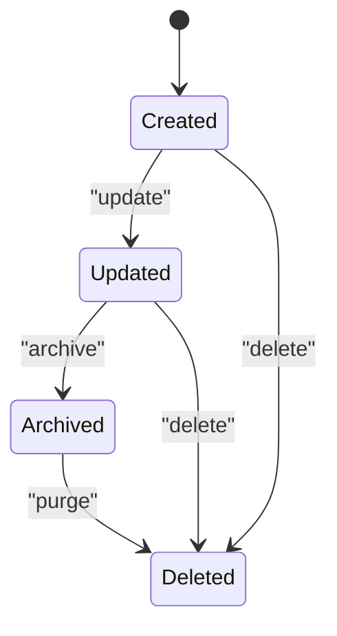

[No sources needed since this diagram shows conceptual workflow, not actual code structure]

**Section sources**
- [store-artifact.ts](file://src/services/memory/store-artifact.ts)
- [protected-space-write-guard.ts](file://src/utils/protected-space-write-guard.ts)

### Export/Import System and Migration
Exports produce compressed archives with checksums and catalogs for migration between environments. Import pathways reconstruct artifacts using catalogs and integrity verification.

- Build export bundles with ZIP compression
- Generate SHA-256 sums for all entries
- Provide HTTP endpoints for artifact downloads
- Support parity specifications for consistent exports

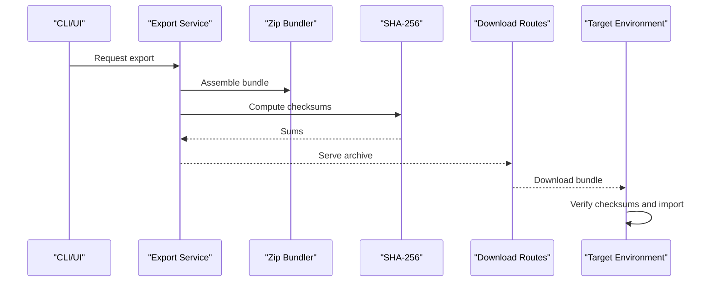

**Diagram sources**
- [export.ts](file://src/tools/export.ts)
- [zip-bundle.ts](file://src/tools/skill-export/zip-bundle.ts)
- [sha256.ts](file://src/tools/skill-export/sha256.ts)
- [http-export-artifact-download-routes.ts](file://src/http/http-export-artifact-download-routes.ts)
- [export-download-capability.ts](file://src/services/export-download-capability.ts)

**Section sources**
- [export.ts](file://src/tools/export.ts)
- [zip-bundle.ts](file://src/tools/skill-export/zip-bundle.ts)
- [sha256.ts](file://src/tools/skill-export/sha256.ts)
- [http-export-artifact-download-routes.ts](file://src/http/http-export-artifact-download-routes.ts)
- [export-download-capability.ts](file://src/services/export-download-capability.ts)

### Sanitization and Security Scanning
Before export, artifacts pass through sanitization to remove unsafe content and enforce policies. Security scanning ensures compliance with organizational standards.

- Strip dangerous patterns and scripts
- Validate allowed content types
- Integrate with external scanners if configured

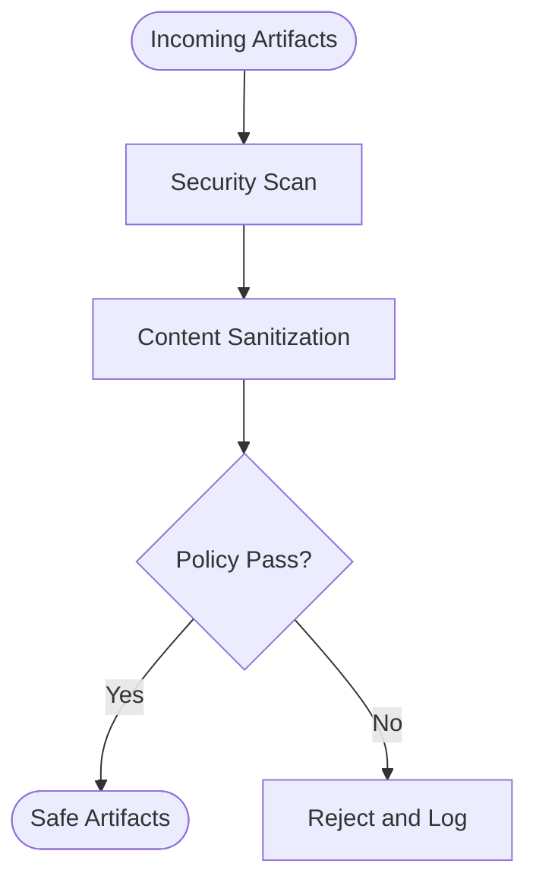

**Diagram sources**
- [artifact-sanitization/index.ts](file://src/tools/skill-export/artifact-sanitization/index.ts)

**Section sources**
- [artifact-sanitization/index.ts](file://src/tools/skill-export/artifact-sanitization/index.ts)

### Contract System and Schema Validation
Contracts define artifact schemas and validation rules. Matching logic enforces compatibility between tool inputs and artifact outputs. Protocol structure validation ensures consistency across the system.

- Define contracts for tools and artifacts
- Match inputs against schemas
- Validate protocol structures

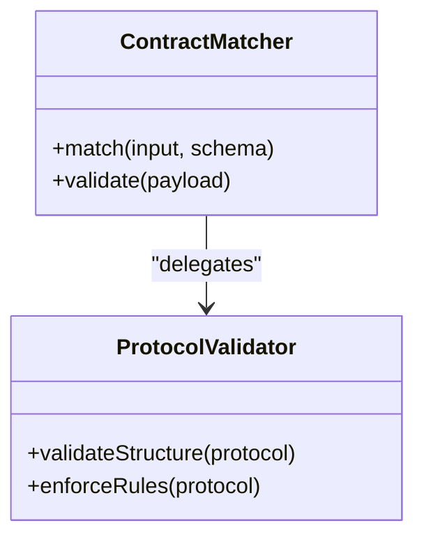

**Diagram sources**
- [mcp-contract-match.ts](file://src/tools/mcp-contract-match.ts)
- [validate-protocol-structure.ts](file://src/services/memory/validate-protocol-structure.ts)

**Section sources**
- [mcp-contract-match.ts](file://src/tools/mcp-contract-match.ts)
- [validate-protocol-structure.ts](file://src/services/memory/validate-protocol-structure.ts)

### Configuration Options
Configuration controls storage backends, compression settings, and access controls.

- Storage backend selection (local, cloud, vector DB)
- Compression parameters for exports
- Access control policies per space or tenant

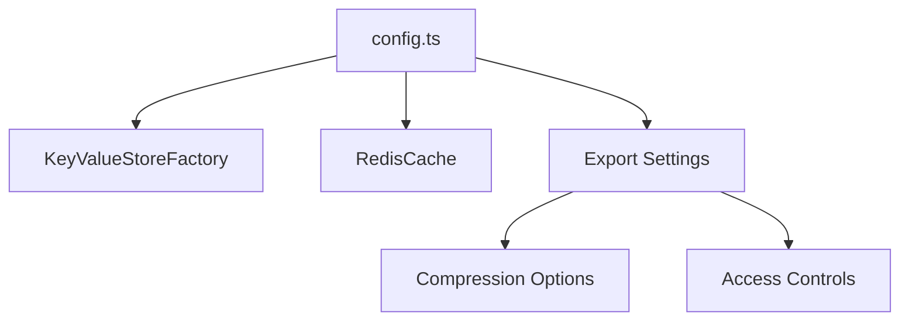

**Diagram sources**
- [config.ts](file://src/config.ts)
- [key-value-store-factory.ts](file://src/services/key-value-store-factory.ts)
- [redis-cache.ts](file://src/services/redis-cache.ts)

**Section sources**
- [config.ts](file://src/config.ts)
- [key-value-store-factory.ts](file://src/services/key-value-store-factory.ts)
- [redis-cache.ts](file://src/services/redis-cache.ts)

## Dependency Analysis
The artifact system depends on HTTP routing, export utilities, storage adapters, and contract validation modules.

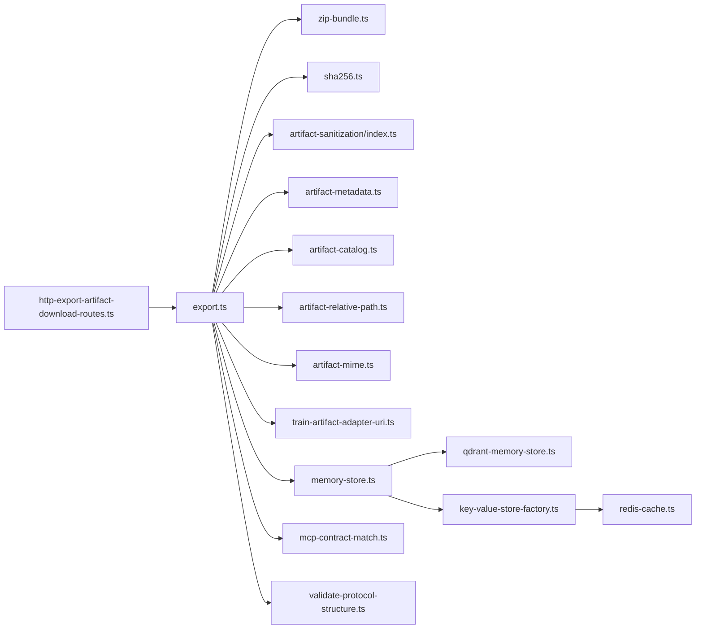

**Diagram sources**
- [http-export-artifact-download-routes.ts](file://src/http/http-export-artifact-download-routes.ts)
- [export.ts](file://src/tools/export.ts)
- [zip-bundle.ts](file://src/tools/skill-export/zip-bundle.ts)
- [sha256.ts](file://src/tools/skill-export/sha256.ts)
- [artifact-sanitization/index.ts](file://src/tools/skill-export/artifact-sanitization/index.ts)
- [artifact-metadata.ts](file://src/services/memory/artifact-metadata.ts)
- [artifact-catalog.ts](file://src/tools/artifact-catalog.ts)
- [artifact-relative-path.ts](file://src/tools/artifact-relative-path.ts)
- [artifact-mime.ts](file://src/tools/artifact-mime.ts)
- [train-artifact-adapter-uri.ts](file://src/tools/train-artifact-adapter-uri.ts)
- [memory-store.ts](file://src/services/memory-store.ts)
- [qdrant-memory-store.ts](file://src/services/qdrant/memory-store.ts)
- [key-value-store-factory.ts](file://src/services/key-value-store-factory.ts)
- [redis-cache.ts](file://src/services/redis-cache.ts)
- [mcp-contract-match.ts](file://src/tools/mcp-contract-match.ts)
- [validate-protocol-structure.ts](file://src/services/memory/validate-protocol-structure.ts)

**Section sources**
- [http-export-artifact-download-routes.ts](file://src/http/http-export-artifact-download-routes.ts)
- [export.ts](file://src/tools/export.ts)
- [memory-store.ts](file://src/services/memory-store.ts)
- [qdrant-memory-store.ts](file://src/services/qdrant/memory-store.ts)
- [key-value-store-factory.ts](file://src/services/key-value-store-factory.ts)
- [redis-cache.ts](file://src/services/redis-cache.ts)
- [mcp-contract-match.ts](file://src/tools/mcp-contract-match.ts)
- [validate-protocol-structure.ts](file://src/services/memory/validate-protocol-structure.ts)

## Performance Considerations
- Use streaming for large artifact downloads to reduce memory pressure
- Enable compression selectively based on content type and size thresholds
- Cache frequently accessed metadata and catalogs in Redis
- Batch operations when updating multiple artifacts
- Limit concurrency for heavy transformations; leverage queues where appropriate
- Optimize vector queries with targeted filters and precomputed embeddings

[No sources needed since this section provides general guidance]

## Troubleshooting Guide
Common issues and resolutions:
- Export failures due to missing dependencies: verify catalogs and relative paths
- Integrity mismatches: recompute checksums and compare with stored sums
- Sanitization rejections: review policy rules and adjust allowed content types
- Storage errors: check Qdrant connectivity and key-value store availability
- Access denied: confirm user permissions and space write guards

**Section sources**
- [artifact-catalog.ts](file://src/tools/artifact-catalog.ts)
- [sha256.ts](file://src/tools/skill-export/sha256.ts)
- [artifact-sanitization/index.ts](file://src/tools/skill-export/artifact-sanitization/index.ts)
- [qdrant-memory-store.ts](file://src/services/qdrant/memory-store.ts)
- [key-value-store-factory.ts](file://src/services/key-value-store-factory.ts)
- [protected-space-write-guard.ts](file://src/utils/protected-space-write-guard.ts)

## Conclusion
Kairos MCP’s artifact management system provides robust multi-format handling, secure export/import pipelines, and flexible storage backends. With strong contract validation, metadata extraction, and performance-oriented design, it supports scalable and reliable artifact lifecycle operations across environments.

[No sources needed since this section summarizes without analyzing specific files]

## Appendices
- Refer to architecture documentation for high-level context and diagrams
- Review test suites for usage examples and edge cases
- Consult configuration guides for deployment-specific tuning

[No sources needed since this section provides general guidance]