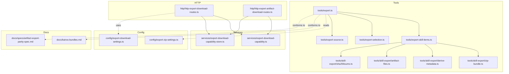
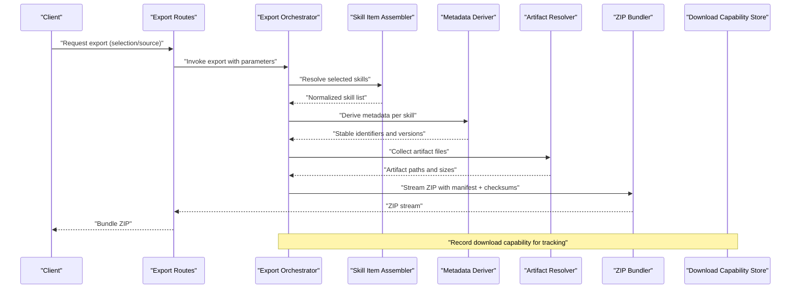
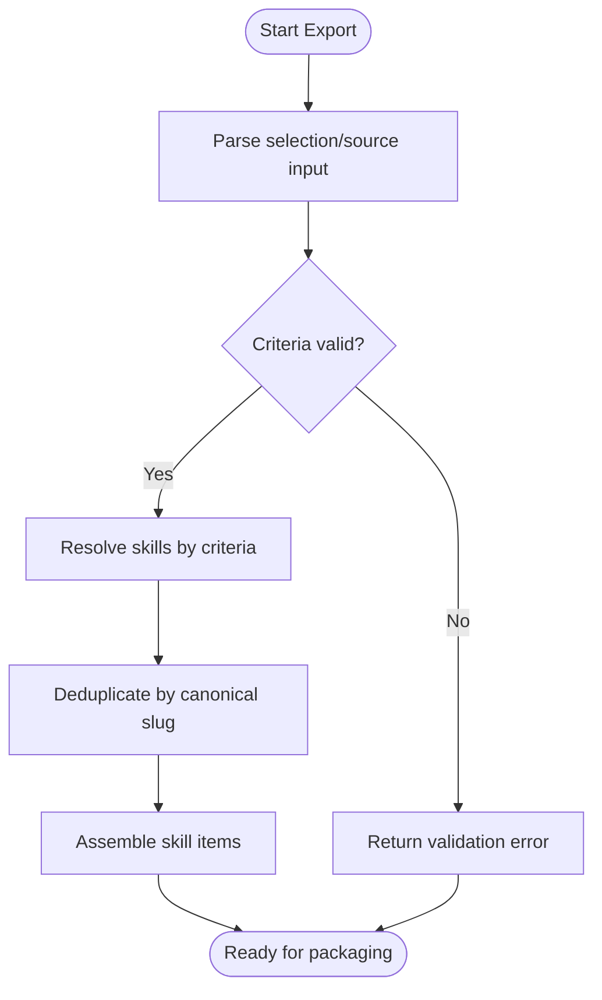
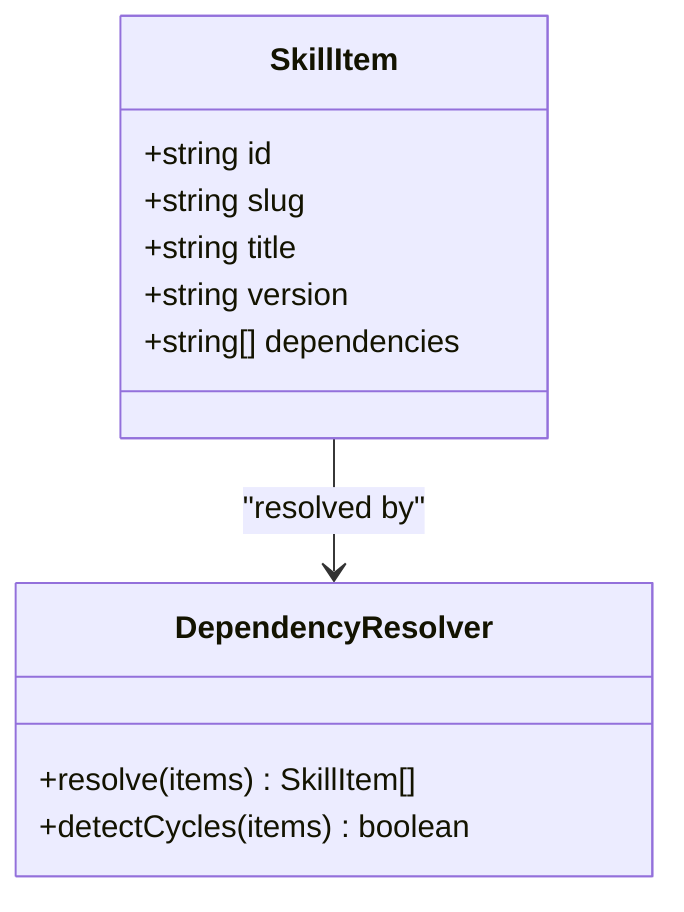
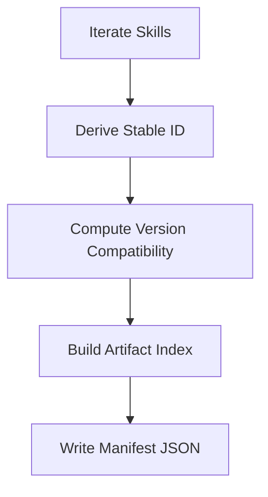
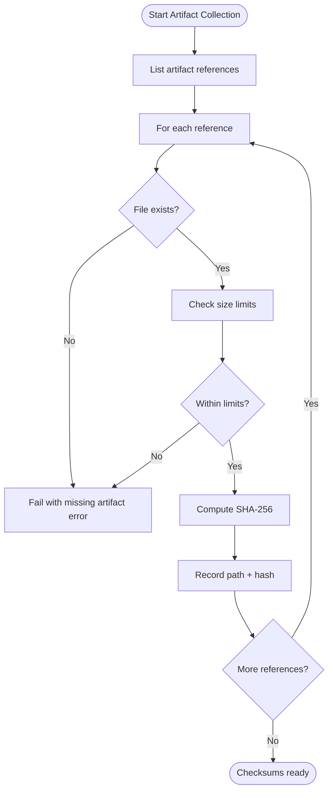
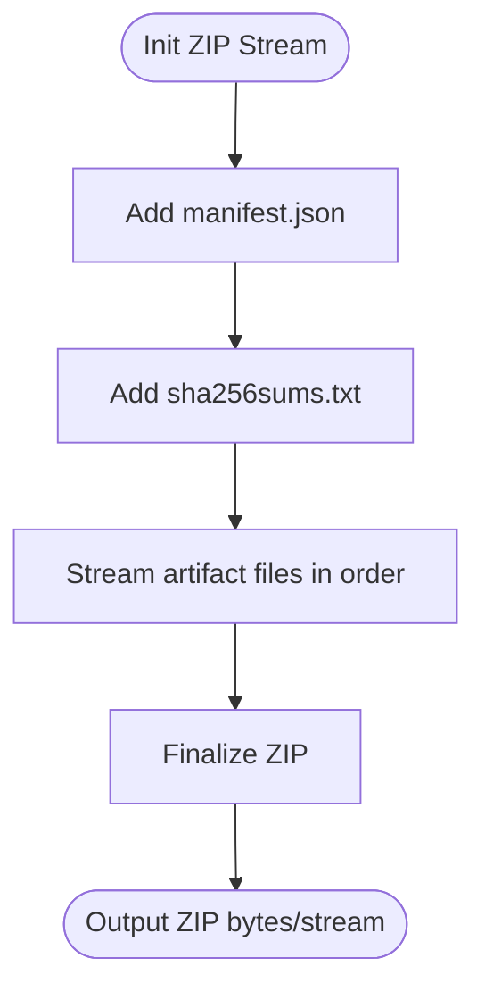
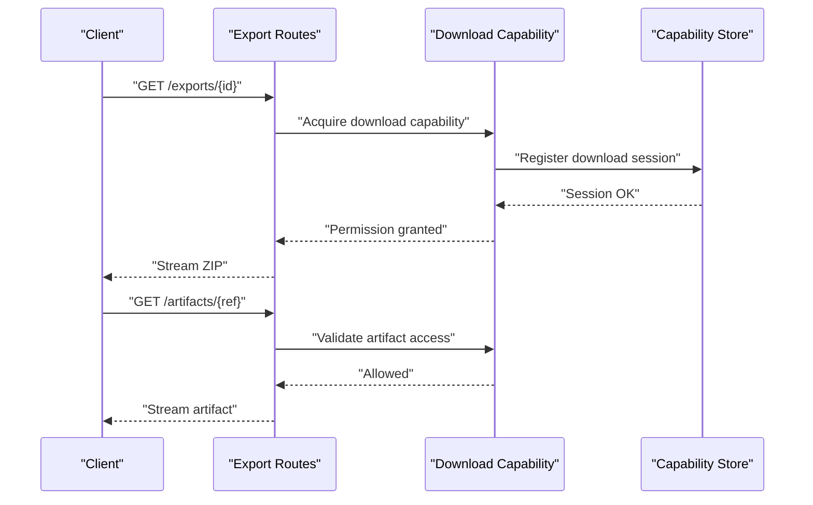
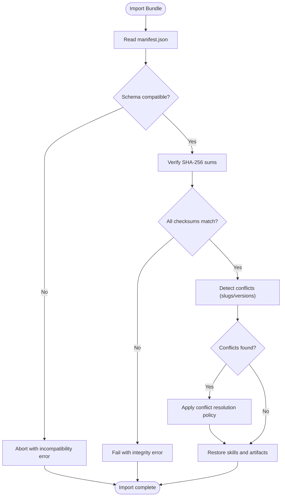
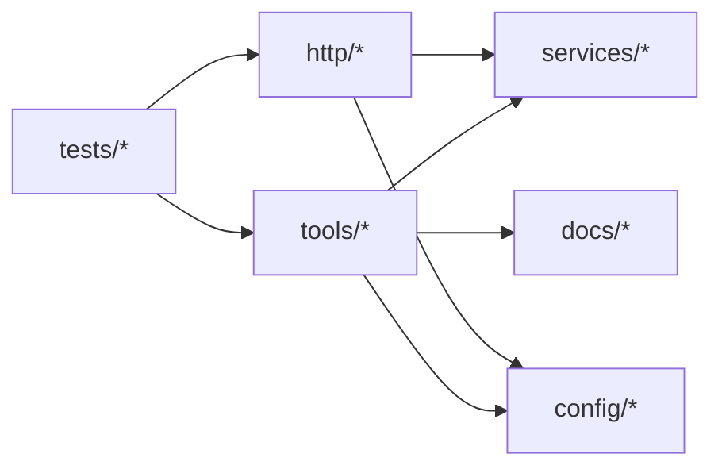

# Export and Import System

<cite>
**Referenced Files in This Document**
- [export.ts](file://src/tools/export.ts)
- [export-skill-items.ts](file://src/tools/export-skill-items.ts)
- [zip-bundle.ts](file://src/tools/skill-export/zip-bundle.ts)
- [derive-metadata.ts](file://src/tools/skill-export/derive-metadata.ts)
- [artifact-files.ts](file://src/tools/skill-export/artifact-files.ts)
- [sha256sums.ts](file://src/tools/skill-export/sha256sums.ts)
- [export-selection.ts](file://src/tools/export-selection.ts)
- [export-source.ts](file://src/tools/export-source.ts)
- [export-download-capability.ts](file://src/services/export-download-capability.ts)
- [export-download-capability-store.ts](file://src/services/export-download-capability-store.ts)
- [http-export-artifact-download-routes.ts](file://src/http/http-export-artifact-download-routes.ts)
- [http-export-download-routes.ts](file://src/http/http-export-download-routes.ts)
- [export-zip-settings.ts](file://src/config/export-zip-settings.ts)
- [export-download-settings.ts](file://src/config/export-download-settings.ts)
- [kairos-bundles.md](file://docs/kairos-bundles.md)
- [artifact-export-parity-spec.md](file://docs/specs/artifact-export-parity-spec.md)
- [cli-export-selection.test.ts](file://tests/integration/cli-export-selection.test.ts)
- [skill-export-multi.test.ts](file://tests/integration/skill-export-multi.test.ts)
- [skill-export-shared.ts](file://tests/integration/skill-export-shared.ts)
- [zip-parser-roundtrip.test.ts](file://tests/unit/zip-parser-roundtrip.test.ts)
- [skill-export-sha256sums.test.ts](file://tests/unit/skill-export-sha256sums.test.ts)
</cite>

## Table of Contents
1. [Introduction](#introduction)
2. [Project Structure](#project-structure)
3. [Core Components](#core-components)
4. [Architecture Overview](#architecture-overview)
5. [Detailed Component Analysis](#detailed-component-analysis)
6. [Dependency Analysis](#dependency-analysis)
7. [Performance Considerations](#performance-considerations)
8. [Troubleshooting Guide](#troubleshooting-guide)
9. [Conclusion](#conclusion)
10. [Appendices](#appendices)

## Introduction
This document describes the export and import system for Kairos MCP skills and artifacts. It explains how portable bundles are created (ZIP packaging, metadata serialization, dependency resolution), how they are validated and restored on import with integrity checks and conflict resolution, and the bundle structure specification including manifest files, artifact organization, and version compatibility matrices. It also covers batch exports, selective export by criteria, migration utilities across bundle formats, and backward compatibility considerations.

## Project Structure
The export/import functionality spans tools, services, HTTP routes, configuration, documentation, and tests:
- Tools orchestrate selection, assembly, and packaging of skill items into ZIP bundles.
- Services provide capability stores and download endpoints for artifacts.
- HTTP routes expose download endpoints for exported bundles and their artifacts.
- Configuration defines ZIP and download behavior.
- Documentation specifies bundle format and parity requirements.
- Tests validate end-to-end flows, multi-skill exports, and ZIP parsing round-trips.

**Diagram sources**
- [export.ts](file://src/tools/export.ts)
- [export-skill-items.ts](file://src/tools/export-skill-items.ts)
- [zip-bundle.ts](file://src/tools/skill-export/zip-bundle.ts)
- [derive-metadata.ts](file://src/tools/skill-export/derive-metadata.ts)
- [artifact-files.ts](file://src/tools/skill-export/artifact-files.ts)
- [sha256sums.ts](file://src/tools/skill-export/sha256sums.ts)
- [export-selection.ts](file://src/tools/export-selection.ts)
- [export-source.ts](file://src/tools/export-source.ts)
- [export-download-capability.ts](file://src/services/export-download-capability.ts)
- [export-download-capability-store.ts](file://src/services/export-download-capability-store.ts)
- [http-export-download-routes.ts](file://src/http/http-export-download-routes.ts)
- [http-export-artifact-download-routes.ts](file://src/http/http-export-artifact-download-routes.ts)
- [export-zip-settings.ts](file://src/config/export-zip-settings.ts)
- [export-download-settings.ts](file://src/config/export-download-settings.ts)
- [kairos-bundles.md](file://docs/kairos-bundles.md)
- [artifact-export-parity-spec.md](file://docs/specs/artifact-export-parity-spec.md)

**Section sources**
- [export.ts](file://src/tools/export.ts)
- [export-skill-items.ts](file://src/tools/export-skill-items.ts)
- [zip-bundle.ts](file://src/tools/skill-export/zip-bundle.ts)
- [derive-metadata.ts](file://src/tools/skill-export/derive-metadata.ts)
- [artifact-files.ts](file://src/tools/skill-export/artifact-files.ts)
- [sha256sums.ts](file://src/tools/skill-export/sha256sums.ts)
- [export-selection.ts](file://src/tools/export-selection.ts)
- [export-source.ts](file://src/tools/export-source.ts)
- [export-download-capability.ts](file://src/services/export-download-capability.ts)
- [export-download-capability-store.ts](file://src/services/export-download-capability-store.ts)
- [http-export-download-routes.ts](file://src/http/http-export-download-routes.ts)
- [http-export-artifact-download-routes.ts](file://src/http/http-export-artifact-download-routes.ts)
- [export-zip-settings.ts](file://src/config/export-zip-settings.ts)
- [export-download-settings.ts](file://src/config/export-download-settings.ts)
- [kairos-bundles.md](file://docs/kairos-bundles.md)
- [artifact-export-parity-spec.md](file://docs/specs/artifact-export-parity-spec.md)

## Core Components
- Export orchestrator: coordinates selection, item assembly, metadata derivation, artifact collection, checksum generation, and ZIP packaging.
- Skill item assembler: builds normalized skill entries, resolves dependencies, and prepares artifact references.
- ZIP bundler: streams and writes a deterministic ZIP archive with consistent ordering and compression settings.
- Metadata derivator: computes stable identifiers, versions, and provenance fields for each skill and artifact.
- Artifact file resolver: maps logical artifact URIs to physical files and enforces size/type constraints.
- Checksum generator: produces SHA-256 sums for all included files and records them in a manifest.
- Download capability store: tracks active downloads and manages concurrent access to exported content.
- HTTP download routes: serve bundle ZIPs and individual artifacts with proper headers and caching.
- Configuration: controls ZIP behavior (compression, max sizes) and download behavior (timeouts, concurrency).

Key responsibilities and interactions are illustrated below.

**Section sources**
- [export.ts](file://src/tools/export.ts)
- [export-skill-items.ts](file://src/tools/export-skill-items.ts)
- [zip-bundle.ts](file://src/tools/skill-export/zip-bundle.ts)
- [derive-metadata.ts](file://src/tools/skill-export/derive-metadata.ts)
- [artifact-files.ts](file://src/tools/skill-export/artifact-files.ts)
- [sha256sums.ts](file://src/tools/skill-export/sha256sums.ts)
- [export-download-capability.ts](file://src/services/export-download-capability.ts)
- [export-download-capability-store.ts](file://src/services/export-download-capability-store.ts)
- [http-export-download-routes.ts](file://src/http/http-export-download-routes.ts)
- [http-export-artifact-download-routes.ts](file://src/http/http-export-artifact-download-routes.ts)
- [export-zip-settings.ts](file://src/config/export-zip-settings.ts)
- [export-download-settings.ts](file://src/config/export-download-settings.ts)

## Architecture Overview
The export pipeline is a layered flow from selection to packaging and serving. The import path validates and restores bundles using manifests and checksums.

**Diagram sources**
- [http-export-download-routes.ts](file://src/http/http-export-download-routes.ts)
- [export.ts](file://src/tools/export.ts)
- [export-skill-items.ts](file://src/tools/export-skill-items.ts)
- [derive-metadata.ts](file://src/tools/skill-export/derive-metadata.ts)
- [artifact-files.ts](file://src/tools/skill-export/artifact-files.ts)
- [zip-bundle.ts](file://src/tools/skill-export/zip-bundle.ts)
- [export-download-capability-store.ts](file://src/services/export-download-capability-store.ts)

## Detailed Component Analysis

### Export Orchestration and Selection
- Entry points accept selection criteria or source definitions to determine which skills to include.
- Supports batch operations by aggregating multiple selections and deduplicating by canonical slug.
- Applies filters such as space scoping, tags, and version ranges before assembling items.

**Diagram sources**
- [export-selection.ts](file://src/tools/export-selection.ts)
- [export-source.ts](file://src/tools/export-source.ts)
- [export.ts](file://src/tools/export.ts)

**Section sources**
- [export-selection.ts](file://src/tools/export-selection.ts)
- [export-source.ts](file://src/tools/export-source.ts)
- [export.ts](file://src/tools/export.ts)

### Skill Item Assembly and Dependency Resolution
- Normalizes each skill entry with stable identifiers, titles, and version metadata.
- Resolves direct and transitive dependencies among skills within the bundle scope.
- Ensures no circular dependencies; reports conflicts when cycles are detected.

**Diagram sources**
- [export-skill-items.ts](file://src/tools/export-skill-items.ts)

**Section sources**
- [export-skill-items.ts](file://src/tools/export-skill-items.ts)

### Metadata Derivation and Manifest Generation
- Produces deterministic metadata for each skill and artifact, including semantic versioning and provenance.
- Generates a top-level manifest describing bundle contents, schema version, and compatibility matrix.
- Records artifact relative paths and MIME types inferred from content.

**Diagram sources**
- [derive-metadata.ts](file://src/tools/skill-export/derive-metadata.ts)

**Section sources**
- [derive-metadata.ts](file://src/tools/skill-export/derive-metadata.ts)

### Artifact Collection and Integrity Checks
- Maps logical artifact URIs to physical files, enforcing allowed types and maximum sizes.
- Computes SHA-256 checksums for every included file and records them in a checksums manifest.
- Validates that all referenced artifacts exist and are readable prior to packaging.

**Diagram sources**
- [artifact-files.ts](file://src/tools/skill-export/artifact-files.ts)
- [sha256sums.ts](file://src/tools/skill-export/sha256sums.ts)

**Section sources**
- [artifact-files.ts](file://src/tools/skill-export/artifact-files.ts)
- [sha256sums.ts](file://src/tools/skill-export/sha256sums.ts)

### ZIP Packaging and Deterministic Ordering
- Streams artifacts and manifests into a ZIP archive with consistent entry ordering to ensure reproducible outputs.
- Applies compression settings defined by configuration and respects maximum payload sizes.
- Includes both the manifest and checksums at well-known locations inside the bundle.

**Diagram sources**
- [zip-bundle.ts](file://src/tools/skill-export/zip-bundle.ts)
- [export-zip-settings.ts](file://src/config/export-zip-settings.ts)

**Section sources**
- [zip-bundle.ts](file://src/tools/skill-export/zip-bundle.ts)
- [export-zip-settings.ts](file://src/config/export-zip-settings.ts)

### Download Capabilities and HTTP Serving
- Tracks active export downloads via a capability store to coordinate concurrent access and resource usage.
- Exposes HTTP endpoints to serve bundle ZIPs and individual artifacts with appropriate headers and caching.
- Enforces download timeouts and rate limiting based on configuration.

**Diagram sources**
- [http-export-download-routes.ts](file://src/http/http-export-download-routes.ts)
- [http-export-artifact-download-routes.ts](file://src/http/http-export-artifact-download-routes.ts)
- [export-download-capability.ts](file://src/services/export-download-capability.ts)
- [export-download-capability-store.ts](file://src/services/export-download-capability-store.ts)
- [export-download-settings.ts](file://src/config/export-download-settings.ts)

**Section sources**
- [http-export-download-routes.ts](file://src/http/http-export-download-routes.ts)
- [http-export-artifact-download-routes.ts](file://src/http/http-export-artifact-download-routes.ts)
- [export-download-capability.ts](file://src/services/export-download-capability.ts)
- [export-download-capability-store.ts](file://src/services/export-download-capability-store.ts)
- [export-download-settings.ts](file://src/config/export-download-settings.ts)

### Bundle Structure Specification
- Top-level manifest: declares bundle schema version, compatible skill versions, and includes a table of contents with artifact indices.
- Artifact organization: artifacts are stored under a dedicated directory with stable relative paths derived from logical URIs.
- Version compatibility matrix: maps bundle schema version to supported skill and artifact versions, enabling safe upgrades and downgrades.
- Checksums: a separate file lists SHA-256 hashes for all included artifacts to support integrity verification during import.

For authoritative details, see the bundle specification documents.

**Section sources**
- [kairos-bundles.md](file://docs/kairos-bundles.md)
- [artifact-export-parity-spec.md](file://docs/specs/artifact-export-parity-spec.md)

### Import Process: Validation and Restoration
- Reads the manifest and checksums to verify bundle integrity and schema compatibility.
- Reconstructs artifact references and validates presence and sizes against recorded values.
- Detects conflicts (e.g., duplicate slugs or incompatible versions) and applies resolution strategies such as overwrite, skip, or abort.
- Restores skills and artifacts into the target environment while preserving provenance and metadata.

[No diagram sources needed since this diagram shows conceptual workflow, not actual code structure]

### Batch Export Operations
- Aggregates multiple selections into a single export job, deduplicating by canonical slug.
- Supports parallel processing where possible, with backpressure control to avoid memory spikes.
- Provides progress reporting and partial failure handling to continue exporting remaining items.

**Section sources**
- [export-selection.ts](file://src/tools/export-selection.ts)
- [export.ts](file://src/tools/export.ts)

### Selective Export Based on Criteria
- Filters by space, tags, version ranges, and other attributes defined in selection inputs.
- Allows exclusion patterns and prioritization rules to shape the final set of skills.
- Integrates with source definitions to pull from remote or local repositories consistently.

**Section sources**
- [export-selection.ts](file://src/tools/export-selection.ts)
- [export-source.ts](file://src/tools/export-source.ts)

### Migration Utilities and Backward Compatibility
- Supports reading older bundle schemas and mapping them to current structures during import.
- Provides upgrade helpers to normalize deprecated fields and update compatibility matrices.
- Maintains backward compatibility by validating minimum required fields and gracefully degrading features when necessary.

**Section sources**
- [kairos-bundles.md](file://docs/kairos-bundles.md)
- [artifact-export-parity-spec.md](file://docs/specs/artifact-export-parity-spec.md)

## Dependency Analysis
The export/import subsystem exhibits clear layering:
- Tools depend on services for capability management and on configuration for behavior tuning.
- HTTP routes depend on tools and services to fulfill requests.
- Tests validate cross-cutting concerns like ZIP parsing and checksum correctness.

**Diagram sources**
- [export.ts](file://src/tools/export.ts)
- [export-skill-items.ts](file://src/tools/export-skill-items.ts)
- [zip-bundle.ts](file://src/tools/skill-export/zip-bundle.ts)
- [export-download-capability.ts](file://src/services/export-download-capability.ts)
- [export-download-capability-store.ts](file://src/services/export-download-capability-store.ts)
- [http-export-download-routes.ts](file://src/http/http-export-download-routes.ts)
- [http-export-artifact-download-routes.ts](file://src/http/http-export-artifact-download-routes.ts)
- [export-zip-settings.ts](file://src/config/export-zip-settings.ts)
- [export-download-settings.ts](file://src/config/export-download-settings.ts)
- [kairos-bundles.md](file://docs/kairos-bundles.md)
- [artifact-export-parity-spec.md](file://docs/specs/artifact-export-parity-spec.md)
- [cli-export-selection.test.ts](file://tests/integration/cli-export-selection.test.ts)
- [skill-export-multi.test.ts](file://tests/integration/skill-export-multi.test.ts)
- [skill-export-shared.ts](file://tests/integration/skill-export-shared.ts)
- [zip-parser-roundtrip.test.ts](file://tests/unit/zip-parser-roundtrip.test.ts)
- [skill-export-sha256sums.test.ts](file://tests/unit/skill-export-sha256sums.test.ts)

**Section sources**
- [export.ts](file://src/tools/export.ts)
- [export-skill-items.ts](file://src/tools/export-skill-items.ts)
- [zip-bundle.ts](file://src/tools/skill-export/zip-bundle.ts)
- [export-download-capability.ts](file://src/services/export-download-capability.ts)
- [export-download-capability-store.ts](file://src/services/export-download-capability-store.ts)
- [http-export-download-routes.ts](file://src/http/http-export-download-routes.ts)
- [http-export-artifact-download-routes.ts](file://src/http/http-export-artifact-download-routes.ts)
- [export-zip-settings.ts](file://src/config/export-zip-settings.ts)
- [export-download-settings.ts](file://src/config/export-download-settings.ts)
- [kairos-bundles.md](file://docs/kairos-bundles.md)
- [artifact-export-parity-spec.md](file://docs/specs/artifact-export-parity-spec.md)
- [cli-export-selection.test.ts](file://tests/integration/cli-export-selection.test.ts)
- [skill-export-multi.test.ts](file://tests/integration/skill-export-multi.test.ts)
- [skill-export-shared.ts](file://tests/integration/skill-export-shared.ts)
- [zip-parser-roundtrip.test.ts](file://tests/unit/zip-parser-roundtrip.test.ts)
- [skill-export-sha256sums.test.ts](file://tests/unit/skill-export-sha256sums.test.ts)

## Performance Considerations
- Use streaming ZIP creation to minimize memory footprint during large exports.
- Parallelize artifact hashing and file reads with bounded concurrency to balance throughput and I/O contention.
- Cache capability store lookups for repeated artifact downloads within the same session.
- Apply compression levels tuned for CPU vs. size trade-offs based on deployment context.

[No sources needed since this section provides general guidance]

## Troubleshooting Guide
Common issues and diagnostics:
- Missing artifacts: ensure all referenced files exist and are accessible; check artifact path normalization.
- Integrity failures: recompute SHA-256 sums and compare against the checksums manifest; investigate tampering or incomplete transfers.
- Conflict resolution: review policies for duplicate slugs and incompatible versions; choose overwrite, skip, or abort accordingly.
- ZIP parsing errors: validate entry ordering and compression settings; confirm the bundle adheres to the documented structure.

Relevant tests can help reproduce and diagnose problems:
- CLI export selection behavior and edge cases.
- Multi-skill export scenarios and shared fixtures.
- ZIP parser round-trip consistency.
- SHA-256 sums generation and verification.

**Section sources**
- [cli-export-selection.test.ts](file://tests/integration/cli-export-selection.test.ts)
- [skill-export-multi.test.ts](file://tests/integration/skill-export-multi.test.ts)
- [skill-export-shared.ts](file://tests/integration/skill-export-shared.ts)
- [zip-parser-roundtrip.test.ts](file://tests/unit/zip-parser-roundtrip.test.ts)
- [skill-export-sha256sums.test.ts](file://tests/unit/skill-export-sha256sums.test.ts)

## Conclusion
The Kairos MCP export and import system provides a robust, verifiable, and configurable pipeline for packaging skills and artifacts into portable bundles. It emphasizes deterministic outputs, integrity verification, and clear compatibility matrices to support safe migrations and backward compatibility. With comprehensive tests and well-defined specifications, it enables reliable batch and selective exports, as well as resilient imports with conflict resolution.

[No sources needed since this section summarizes without analyzing specific files]

## Appendices

### API and CLI Usage References
- CLI commands and options for export and import are implemented in the CLI module and integrated with the export tools.
- HTTP endpoints for downloading bundles and artifacts are exposed through dedicated routes.

**Section sources**
- [http-export-download-routes.ts](file://src/http/http-export-download-routes.ts)
- [http-export-artifact-download-routes.ts](file://src/http/http-export-artifact-download-routes.ts)
- [export.ts](file://src/tools/export.ts)