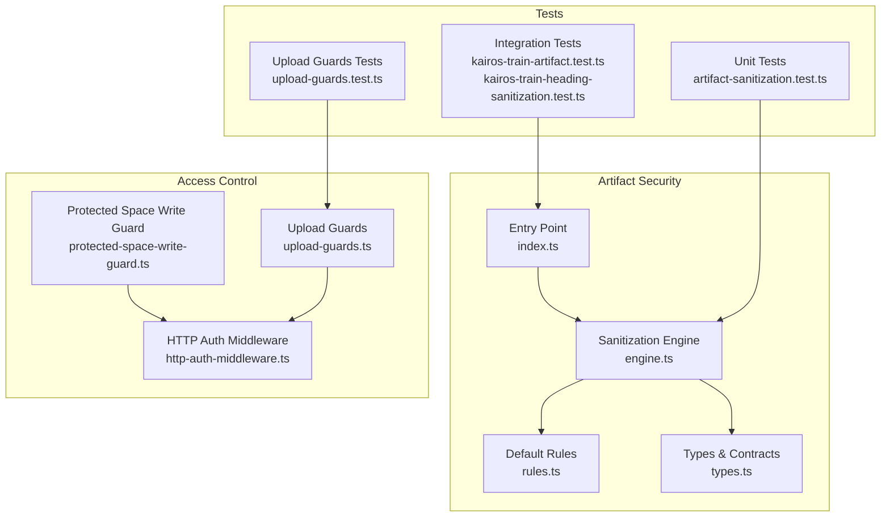
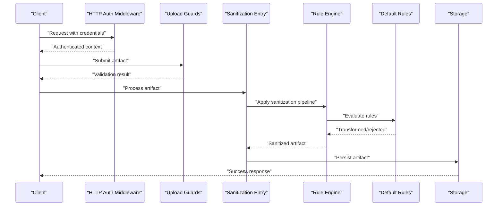
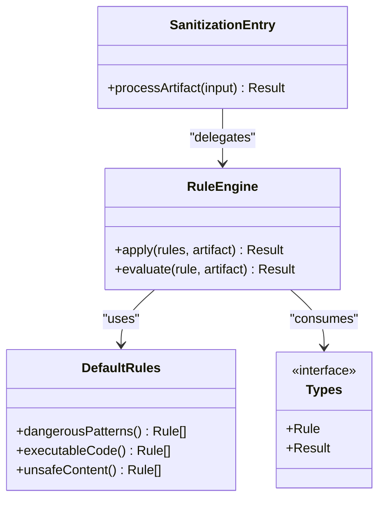
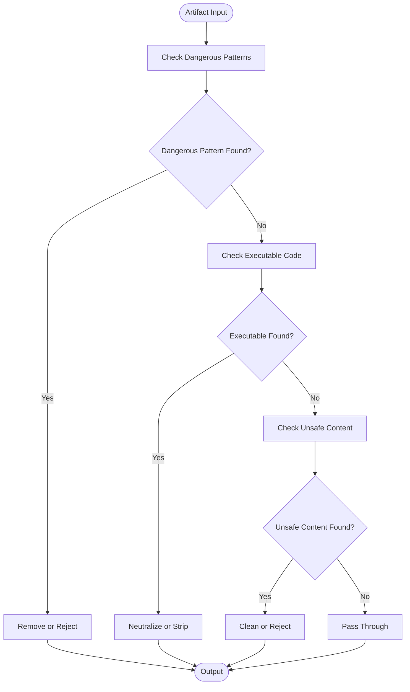
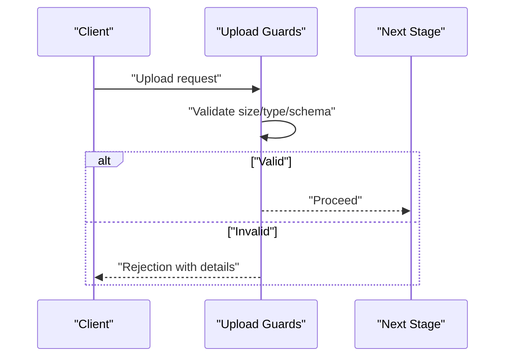
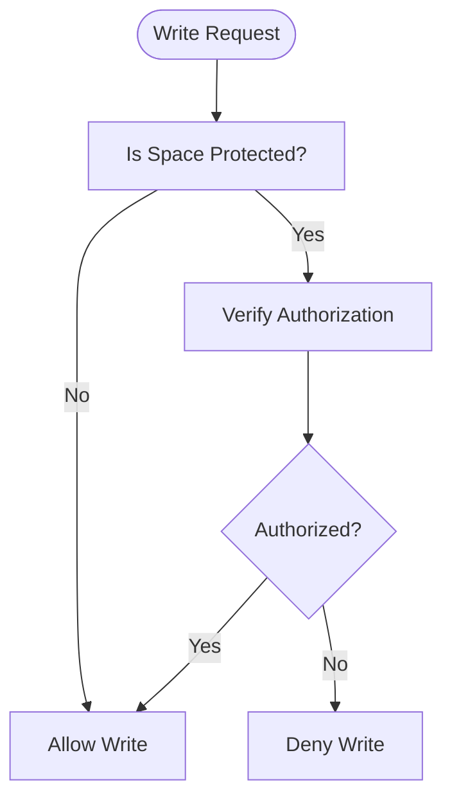
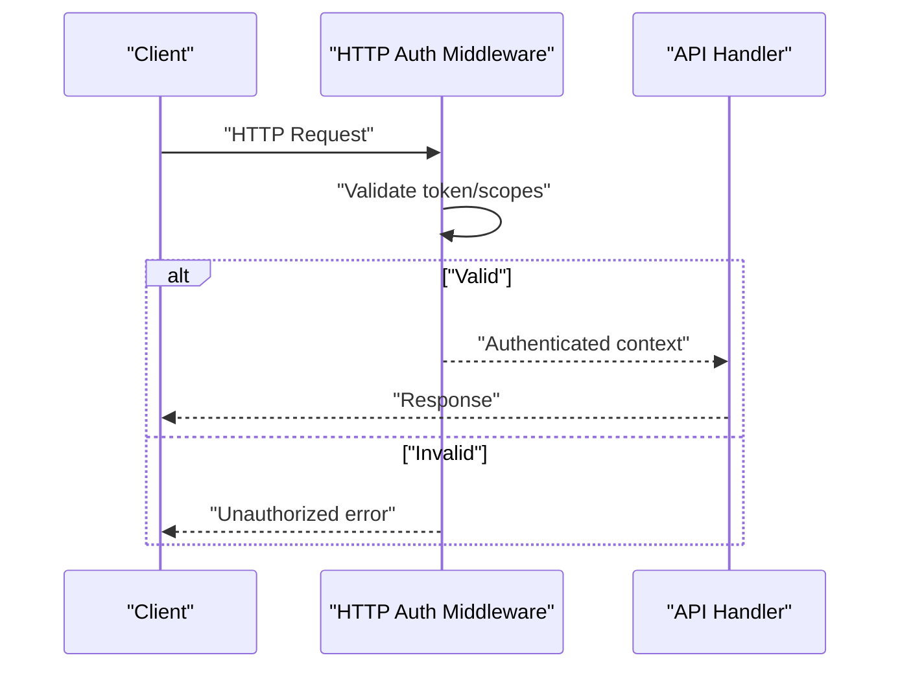
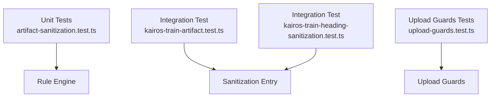
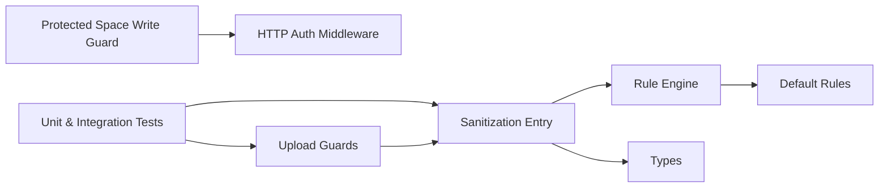

# Security and Sanitization

<cite>
**Referenced Files in This Document**
- [artifact-sanitization/index.ts](file://src/tools/skill-export/artifact-sanitization/index.ts)
- [artifact-sanitization/rules.ts](file://src/tools/skill-export/artifact-sanitization/rules.ts)
- [artifact-sanitization/engine.ts](file://src/tools/skill-export/artifact-sanitization/engine.ts)
- [artifact-sanitization/types.ts](file://src/tools/skill-export/artifact-sanitization/types.ts)
- [protected-space-write-guard.ts](file://src/utils/protected-space-write-guard.ts)
- [http-auth-middleware.ts](file://src/http/http-auth-middleware.ts)
- [upload-guards.ts](file://src/cli/upload-guards.ts)
- [kairos-train-artifact.test.ts](file://tests/integration/kairos-train-artifact.test.ts)
- [kairos-heading-sanitization.test.ts](file://tests/integration/kairos-train-heading-sanitization.test.ts)
- [artifact-sanitization.test.ts](file://tests/unit/artifact-sanitization.test.ts)
- [upload-guards.test.ts](file://tests/unit/upload-guards.test.ts)
</cite>

## Table of Contents
1. [Introduction](#introduction)
2. [Project Structure](#project-structure)
3. [Core Components](#core-components)
4. [Architecture Overview](#architecture-overview)
5. [Detailed Component Analysis](#detailed-component-analysis)
6. [Dependency Analysis](#dependency-analysis)
7. [Performance Considerations](#performance-considerations)
8. [Troubleshooting Guide](#troubleshooting-guide)
9. [Conclusion](#conclusion)
10. [Appendices](#appendices)

## Introduction
This document explains the artifact security and sanitization mechanisms in Kairos MCP. It covers the multi-layered scanning pipeline (malware detection, malicious code analysis, content validation), default sanitization rules for removing dangerous patterns and executable content, the rule engine architecture for custom policies, access control for protected spaces, write guards against unauthorized modifications, best practices for artifact handling, vulnerability assessment procedures, and compliance considerations for enterprise deployments.

## Project Structure
Security-related functionality is primarily implemented under:
- Artifact sanitization rule engine and defaults
- Upload-time guards and validation
- Protected space write guard
- HTTP authentication middleware that enforces access controls
- Tests validating behavior across unit and integration layers

**Diagram sources**
- [artifact-sanitization/index.ts](file://src/tools/skill-export/artifact-sanitization/index.ts)
- [artifact-sanitization/engine.ts](file://src/tools/skill-export/artifact-sanitization/engine.ts)
- [artifact-sanitization/rules.ts](file://src/tools/skill-export/artifact-sanitization/rules.ts)
- [artifact-sanitization/types.ts](file://src/tools/skill-export/artifact-sanitization/types.ts)
- [protected-space-write-guard.ts](file://src/utils/protected-space-write-guard.ts)
- [http-auth-middleware.ts](file://src/http/http-auth-middleware.ts)
- [upload-guards.ts](file://src/cli/upload-guards.ts)
- [artifact-sanitization.test.ts](file://tests/unit/artifact-sanitization.test.ts)
- [kairos-train-artifact.test.ts](file://tests/integration/kairos-train-artifact.test.ts)
- [kairos-train-heading-sanitization.test.ts](file://tests/integration/kairos-train-heading-sanitization.test.ts)
- [upload-guards.test.ts](file://tests/unit/upload-guards.test.ts)

**Section sources**
- [artifact-sanitization/index.ts](file://src/tools/skill-export/artifact-sanitization/index.ts)
- [artifact-sanitization/engine.ts](file://src/tools/skill-export/artifact-sanitization/engine.ts)
- [artifact-sanitization/rules.ts](file://src/tools/skill-export/artifact-sanitization/rules.ts)
- [artifact-sanitization/types.ts](file://src/tools/skill-export/artifact-sanitization/types.ts)
- [protected-space-write-guard.ts](file://src/utils/protected-space-write-guard.ts)
- [http-auth-middleware.ts](file://src/http/http-auth-middleware.ts)
- [upload-guards.ts](file://src/cli/upload-guards.ts)
- [artifact-sanitization.test.ts](file://tests/unit/artifact-sanitization.test.ts)
- [kairos-train-artifact.test.ts](file://tests/integration/kairos-train-artifact.test.ts)
- [kairos-train-heading-sanitization.test.ts](file://tests/integration/kairos-train-heading-sanitization.test.ts)
- [upload-guards.test.ts](file://tests/unit/upload-guards.test.ts)

## Core Components
- Sanitization entry point: orchestrates artifact processing and delegates to the rule engine.
- Rule engine: applies a chain of rules to transform or reject artifacts based on policy.
- Default rules: implement built-in sanitization for dangerous patterns, executable content, and unsafe constructs.
- Types: define contracts for rule definitions, results, and configuration.
- Upload guards: enforce pre-upload checks and constraints before artifacts enter the system.
- Protected space write guard: prevents unauthorized writes to protected spaces.
- HTTP auth middleware: validates requests and scopes to ensure only authorized operations proceed.

Key responsibilities:
- Enforce safe-by-default artifact ingestion.
- Provide extensibility via a rule engine for custom policies.
- Ensure access control boundaries at API and storage layers.

**Section sources**
- [artifact-sanitization/index.ts](file://src/tools/skill-export/artifact-sanitization/index.ts)
- [artifact-sanitization/engine.ts](file://src/tools/skill-export/artifact-sanitization/engine.ts)
- [artifact-sanitization/rules.ts](file://src/tools/skill-export/artifact-sanitization/rules.ts)
- [artifact-sanitization/types.ts](file://src/tools/skill-export/artifact-sanitization/types.ts)
- [upload-guards.ts](file://src/cli/upload-guards.ts)
- [protected-space-write-guard.ts](file://src/utils/protected-space-write-guard.ts)
- [http-auth-middleware.ts](file://src/http/http-auth-middleware.ts)

## Architecture Overview
The artifact security pipeline integrates multiple layers:
- Pre-ingestion validation and upload guards
- Content scanning and sanitization via the rule engine
- Access control enforcement through HTTP middleware and protected space guards
- Auditability and test coverage across unit and integration tests

**Diagram sources**
- [http-auth-middleware.ts](file://src/http/http-auth-middleware.ts)
- [upload-guards.ts](file://src/cli/upload-guards.ts)
- [artifact-sanitization/index.ts](file://src/tools/skill-export/artifact-sanitization/index.ts)
- [artifact-sanitization/engine.ts](file://src/tools/skill-export/artifact-sanitization/engine.ts)
- [artifact-sanitization/rules.ts](file://src/tools/skill-export/artifact-sanitization/rules.ts)

## Detailed Component Analysis

### Sanitization Rule Engine
The rule engine provides a composable pipeline for applying security policies to artifacts. It supports:
- Sequential rule evaluation
- Early termination on rejection
- Transformation of artifact content while preserving metadata
- Extensible rule interface for custom implementations

**Diagram sources**
- [artifact-sanitization/index.ts](file://src/tools/skill-export/artifact-sanitization/index.ts)
- [artifact-sanitization/engine.ts](file://src/tools/skill-export/artifact-sanitization/engine.ts)
- [artifact-sanitization/rules.ts](file://src/tools/skill-export/artifact-sanitization/rules.ts)
- [artifact-sanitization/types.ts](file://src/tools/skill-export/artifact-sanitization/types.ts)

**Section sources**
- [artifact-sanitization/index.ts](file://src/tools/skill-export/artifact-sanitization/index.ts)
- [artifact-sanitization/engine.ts](file://src/tools/skill-export/artifact-sanitization/engine.ts)
- [artifact-sanitization/rules.ts](file://src/tools/skill-export/artifact-sanitization/rules.ts)
- [artifact-sanitization/types.ts](file://src/tools/skill-export/artifact-sanitization/types.ts)

### Default Sanitization Rules
Built-in rules target common threat vectors:
- Dangerous patterns: regex-based detection of known risky constructs
- Executable code: removal or neutralization of scripts and binaries
- Unsafe content: stripping potentially harmful markup or payloads

These rules are designed to be safe-by-default and can be extended by custom policies.

**Diagram sources**
- [artifact-sanitization/rules.ts](file://src/tools/skill-export/artifact-sanitization/rules.ts)

**Section sources**
- [artifact-sanitization/rules.ts](file://src/tools/skill-export/artifact-sanitization/rules.ts)

### Upload-Time Guards
Upload guards enforce pre-processing checks such as size limits, allowed MIME types, and structural validations before artifacts reach the sanitization pipeline. They provide an early defense layer to reduce risk exposure.

**Diagram sources**
- [upload-guards.ts](file://src/cli/upload-guards.ts)

**Section sources**
- [upload-guards.ts](file://src/cli/upload-guards.ts)

### Protected Space Write Guard
Protected spaces restrict write operations to authorized users or roles. The write guard intercepts mutation requests and verifies permissions before allowing changes.

**Diagram sources**
- [protected-space-write-guard.ts](file://src/utils/protected-space-write-guard.ts)

**Section sources**
- [protected-space-write-guard.ts](file://src/utils/protected-space-write-guard.ts)

### HTTP Authentication Middleware
Authentication middleware validates bearer tokens and OIDC claims, ensuring subsequent handlers operate within a verified user context. It also enforces scope checks relevant to artifact operations.

**Diagram sources**
- [http-auth-middleware.ts](file://src/http/http-auth-middleware.ts)

**Section sources**
- [http-auth-middleware.ts](file://src/http/http-auth-middleware.ts)

### Testing and Validation
- Unit tests validate rule application, transformation outcomes, and edge cases.
- Integration tests verify end-to-end flows including training artifacts and heading sanitization.
- Upload guard tests confirm pre-validation behaviors and error paths.

**Diagram sources**
- [artifact-sanitization.test.ts](file://tests/unit/artifact-sanitization.test.ts)
- [kairos-train-artifact.test.ts](file://tests/integration/kairos-train-artifact.test.ts)
- [kairos-train-heading-sanitization.test.ts](file://tests/integration/kairos-train-heading-sanitization.test.ts)
- [upload-guards.test.ts](file://tests/unit/upload-guards.test.ts)

**Section sources**
- [artifact-sanitization.test.ts](file://tests/unit/artifact-sanitization.test.ts)
- [kairos-train-artifact.test.ts](file://tests/integration/kairos-train-artifact.test.ts)
- [kairos-train-heading-sanitization.test.ts](file://tests/integration/kairos-train-heading-sanitization.test.ts)
- [upload-guards.test.ts](file://tests/unit/upload-guards.test.ts)

## Dependency Analysis
The security components exhibit clear separation of concerns:
- Sanitization entry depends on the rule engine and default rules.
- Upload guards operate independently but feed into the sanitization pipeline.
- Protected space write guard relies on authentication context provided by HTTP middleware.
- Tests depend on implementation modules to assert correctness.

**Diagram sources**
- [artifact-sanitization/index.ts](file://src/tools/skill-export/artifact-sanitization/index.ts)
- [artifact-sanitization/engine.ts](file://src/tools/skill-export/artifact-sanitization/engine.ts)
- [artifact-sanitization/rules.ts](file://src/tools/skill-export/artifact-sanitization/rules.ts)
- [artifact-sanitization/types.ts](file://src/tools/skill-export/artifact-sanitization/types.ts)
- [upload-guards.ts](file://src/cli/upload-guards.ts)
- [protected-space-write-guard.ts](file://src/utils/protected-space-write-guard.ts)
- [http-auth-middleware.ts](file://src/http/http-auth-middleware.ts)

**Section sources**
- [artifact-sanitization/index.ts](file://src/tools/skill-export/artifact-sanitization/index.ts)
- [artifact-sanitization/engine.ts](file://src/tools/skill-export/artifact-sanitization/engine.ts)
- [artifact-sanitization/rules.ts](file://src/tools/skill-export/artifact-sanitization/rules.ts)
- [artifact-sanitization/types.ts](file://src/tools/skill-export/artifact-sanitization/types.ts)
- [upload-guards.ts](file://src/cli/upload-guards.ts)
- [protected-space-write-guard.ts](file://src/utils/protected-space-write-guard.ts)
- [http-auth-middleware.ts](file://src/http/http-auth-middleware.ts)

## Performance Considerations
- Rule evaluation should be efficient; prefer fast-path checks and avoid heavy transformations unless necessary.
- Batch processing may benefit from parallelizing independent artifact scans where safe.
- Early rejection via upload guards reduces downstream load.
- Cache frequently used rule configurations to minimize overhead.

[No sources needed since this section provides general guidance]

## Troubleshooting Guide
Common issues and resolutions:
- Rejected uploads due to size or type: review upload guard constraints and adjust client payloads accordingly.
- Artifacts sanitized unexpectedly: inspect default rules and consider adding exceptions or custom rules if legitimate content is flagged.
- Unauthorized write attempts: verify user roles and protected space permissions; ensure authentication headers are correct.
- Inconsistent behavior across environments: check rule engine configuration and environment-specific settings.

**Section sources**
- [upload-guards.ts](file://src/cli/upload-guards.ts)
- [artifact-sanitization/rules.ts](file://src/tools/skill-export/artifact-sanitization/rules.ts)
- [protected-space-write-guard.ts](file://src/utils/protected-space-write-guard.ts)
- [http-auth-middleware.ts](file://src/http/http-auth-middleware.ts)

## Conclusion
Kairos MCP implements a robust, layered approach to artifact security and sanitization. The rule engine centralizes policy enforcement, default rules provide strong baseline protections, and access controls safeguard protected spaces. Comprehensive testing ensures reliability, while extensibility allows organizations to tailor policies to their needs. Following the recommended best practices and compliance guidelines will help maintain secure and compliant artifact handling in enterprise environments.

[No sources needed since this section summarizes without analyzing specific files]

## Appendices

### Security Best Practices
- Validate inputs early using upload guards.
- Keep default rules up to date and monitor false positives.
- Restrict write access to protected spaces and audit changes.
- Use least-privilege principles for service accounts and tokens.
- Regularly assess vulnerabilities and update dependencies.

[No sources needed since this section provides general guidance]

### Compliance Requirements for Enterprise Deployments
- Enforce authentication and authorization consistently across all endpoints.
- Maintain audit logs for sensitive operations.
- Implement data retention and deletion policies aligned with organizational standards.
- Conduct periodic security reviews and penetration testing.
- Document and approve custom sanitization rules and policies.

[No sources needed since this section provides general guidance]