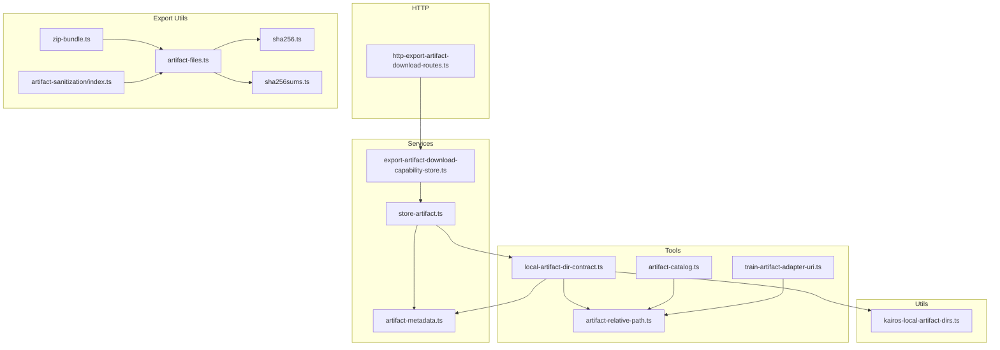
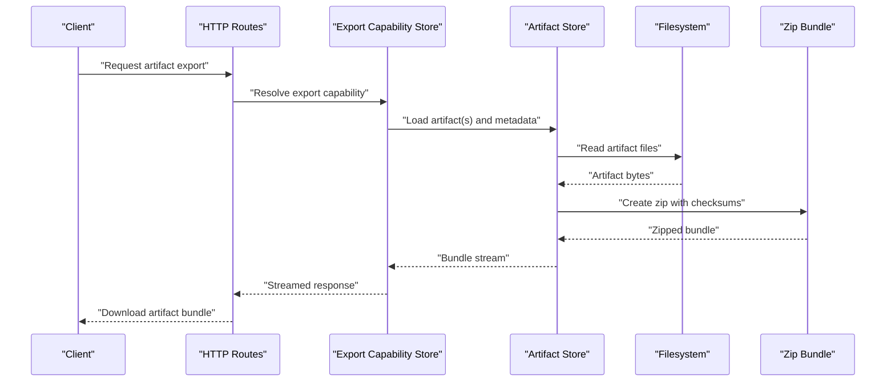
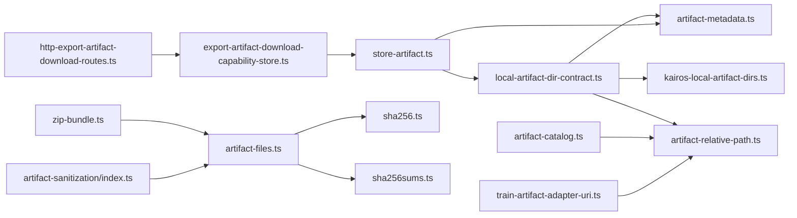

# Storage and Versioning

<cite>
**Referenced Files in This Document**
- [local-artifact-dir-contract.ts](file://src/tools/local-artifact-dir-contract.ts)
- [artifact-metadata.ts](file://src/services/memory/artifact-metadata.ts)
- [store-artifact.ts](file://src/services/memory/store-artifact.ts)
- [kairos-local-artifact-dirs.ts](file://src/utils/kairos-local-artifact-dirs.ts)
- [artifact-relative-path.ts](file://src/tools/artifact-relative-path.ts)
- [sha256.ts](file://src/tools/skill-export/sha256.ts)
- [sha256sums.ts](file://src/tools/skill-export/sha256sums.ts)
- [export-artifact-download-capability-store.ts](file://src/services/export-artifact-download-capability-store.ts)
- [http-export-artifact-download-routes.ts](file://src/http/http-export-artifact-download-routes.ts)
- [artifact-catalog.ts](file://src/tools/artifact-catalog.ts)
- [train-artifact-adapter-uri.ts](file://src/tools/train-artifact-adapter-uri.ts)
- [artifact-sanitization/index.ts](file://src/tools/skill-export/artifact-sanitization/index.ts)
- [artifact-files.ts](file://src/tools/skill-export/artifact-files.ts)
- [zip-bundle.ts](file://src/tools/skill-export/zip-bundle.ts)
- [artifact-fixture-cleanup.test.ts](file://tests/unit/artifact-fixture-cleanup.test.ts)
- [artifact-metadata.test.ts](file://tests/unit/artifact-metadata.test.ts)
- [artifact-relative-path.test.ts](file://tests/unit/artifact-relative-path.test.ts)
- [mime-artifact-fixture-contract.test.ts](file://tests/unit/mime-artifact-fixture-contract.test.ts)
</cite>

## Table of Contents
1. [Introduction](#introduction)
2. [Project Structure](#project-structure)
3. [Core Components](#core-components)
4. [Architecture Overview](#architecture-overview)
5. [Detailed Component Analysis](#detailed-component-analysis)
6. [Dependency Analysis](#dependency-analysis)
7. [Performance Considerations](#performance-considerations)
8. [Troubleshooting Guide](#troubleshooting-guide)
9. [Conclusion](#conclusion)
10. [Appendices](#appendices)

## Introduction
This document explains artifact storage strategies and versioning systems in Kairos MCP. It focuses on the local artifact directory contract, how artifacts are organized on disk with metadata tracking, the artifact metadata schema (including creation timestamps, modification history, checksums, and relationship mappings), and patterns for integrating version control to track changes over time. It also covers storage backend configurations for different environments (local filesystem, cloud storage, distributed storage), best practices for lifecycle management, cleanup policies, and optimization techniques.

## Project Structure
Kairos organizes artifact-related logic across several modules:
- Local artifact directory contract and path resolution utilities
- Artifact metadata definition and validation
- Store operations for persisting artifacts and their metadata
- Export and download capabilities that package artifacts into bundles
- Tests validating contracts, paths, and metadata behavior

**Diagram sources**
- [local-artifact-dir-contract.ts](file://src/tools/local-artifact-dir-contract.ts)
- [artifact-relative-path.ts](file://src/tools/artifact-relative-path.ts)
- [artifact-metadata.ts](file://src/services/memory/artifact-metadata.ts)
- [store-artifact.ts](file://src/services/memory/store-artifact.ts)
- [kairos-local-artifact-dirs.ts](file://src/utils/kairos-local-artifact-dirs.ts)
- [export-artifact-download-capability-store.ts](file://src/services/export-artifact-download-capability-store.ts)
- [http-export-artifact-download-routes.ts](file://src/http/http-export-artifact-download-routes.ts)
- [sha256.ts](file://src/tools/skill-export/sha256.ts)
- [sha256sums.ts](file://src/tools/skill-export/sha256sums.ts)
- [artifact-files.ts](file://src/tools/skill-export/artifact-files.ts)
- [zip-bundle.ts](file://src/tools/skill-export/zip-bundle.ts)
- [artifact-sanitization/index.ts](file://src/tools/skill-export/artifact-sanitization/index.ts)
- [artifact-catalog.ts](file://src/tools/artifact-catalog.ts)
- [train-artifact-adapter-uri.ts](file://src/tools/train-artifact-adapter-uri.ts)

**Section sources**
- [local-artifact-dir-contract.ts](file://src/tools/local-artifact-dir-contract.ts)
- [artifact-metadata.ts](file://src/services/memory/artifact-metadata.ts)
- [store-artifact.ts](file://src/services/memory/store-artifact.ts)
- [kairos-local-artifact-dirs.ts](file://src/utils/kairos-local-artifact-dirs.ts)
- [artifact-relative-path.ts](file://src/tools/artifact-relative-path.ts)
- [export-artifact-download-capability-store.ts](file://src/services/export-artifact-download-capability-store.ts)
- [http-export-artifact-download-routes.ts](file://src/http/http-export-artifact-download-routes.ts)
- [sha256.ts](file://src/tools/skill-export/sha256.ts)
- [sha256sums.ts](file://src/tools/skill-export/sha256sums.ts)
- [artifact-files.ts](file://src/tools/skill-export/artifact-files.ts)
- [zip-bundle.ts](file://src/tools/skill-export/zip-bundle.ts)
- [artifact-sanitization/index.ts](file://src/tools/skill-export/artifact-sanitization/index.ts)
- [artifact-catalog.ts](file://src/tools/artifact-catalog.ts)
- [train-artifact-adapter-uri.ts](file://src/tools/train-artifact-adapter-uri.ts)

## Core Components
- Local artifact directory contract: Defines where artifacts live on disk, naming conventions, and how directories map to logical artifacts.
- Artifact metadata: Schema describing artifact identity, timestamps, relationships, and integrity information.
- Store operations: Methods to create, update, read, and delete artifacts and associated metadata.
- Path resolution: Utilities to compute relative paths and URIs for artifacts consistently across components.
- Export and download: Capabilities to bundle artifacts, compute checksums, and serve them via HTTP.

Key responsibilities:
- Enforce a stable on-disk layout and naming scheme.
- Maintain rich metadata for each artifact including integrity and provenance.
- Provide consistent APIs for reading/writing artifacts and their metadata.
- Support export/download workflows that preserve integrity and relationships.

**Section sources**
- [local-artifact-dir-contract.ts](file://src/tools/local-artifact-dir-contract.ts)
- [artifact-metadata.ts](file://src/services/memory/artifact-metadata.ts)
- [store-artifact.ts](file://src/services/memory/store-artifact.ts)
- [artifact-relative-path.ts](file://src/tools/artifact-relative-path.ts)
- [export-artifact-download-capability-store.ts](file://src/services/export-artifact-download-capability-store.ts)
- [http-export-artifact-download-routes.ts](file://src/http/http-export-artifact-download-routes.ts)

## Architecture Overview
The artifact system is centered around a local directory contract backed by file I/O and metadata records. Export/download flows package artifacts into zipped bundles with checksums and manifest files.

**Diagram sources**
- [http-export-artifact-download-routes.ts](file://src/http/http-export-artifact-download-routes.ts)
- [export-artifact-download-capability-store.ts](file://src/services/export-artifact-download-capability-store.ts)
- [store-artifact.ts](file://src/services/memory/store-artifact.ts)
- [zip-bundle.ts](file://src/tools/skill-export/zip-bundle.ts)
- [sha256.ts](file://src/tools/skill-export/sha256.ts)
- [sha256sums.ts](file://src/tools/skill-export/sha256sums.ts)

## Detailed Component Analysis

### Local Artifact Directory Contract
Responsibilities:
- Define the root location for artifacts per environment or user context.
- Specify directory structure and naming conventions for artifact folders and files.
- Provide helpers to resolve absolute and relative paths deterministically.

Design highlights:
- Centralized configuration for artifact roots ensures consistency across services.
- Path resolution utilities prevent duplication and ensure canonical references.

Best practices:
- Keep artifact roots isolated per tenant/user to avoid cross-contamination.
- Use stable identifiers in folder names to support immutability and deduplication.

**Section sources**
- [local-artifact-dir-contract.ts](file://src/tools/local-artifact-dir-contract.ts)
- [kairos-local-artifact-dirs.ts](file://src/utils/kairos-local-artifact-dirs.ts)
- [artifact-relative-path.ts](file://src/tools/artifact-relative-path.ts)

### Artifact Metadata Schema
Responsibilities:
- Capture artifact identity, creation/modification timestamps, and change history.
- Record checksums for integrity verification.
- Map relationships between artifacts (e.g., parent-child, dependencies).

Schema elements typically include:
- Identifier and version fields
- Creation timestamp and last modified timestamp
- Modification history entries (who/what changed and when)
- Checksums (e.g., SHA-256) for content integrity
- Relationship mappings (links to related artifacts)

Validation:
- Ensure required fields are present and well-formed.
- Validate timestamp ordering and uniqueness constraints.
- Verify checksums match actual content when needed.

**Section sources**
- [artifact-metadata.ts](file://src/services/memory/artifact-metadata.ts)
- [artifact-metadata.test.ts](file://tests/unit/artifact-metadata.test.ts)

### Artifact Store Operations
Responsibilities:
- Create, update, read, and delete artifacts and their metadata.
- Coordinate file writes and metadata persistence atomically where possible.
- Enforce directory contract and path rules during mutations.

Operational flow:
- On write: validate inputs, compute checksums, write files, update metadata.
- On read: resolve paths, load metadata, verify integrity if requested.
- On delete: remove files and metadata, handle partial failures gracefully.

**Section sources**
- [store-artifact.ts](file://src/services/memory/store-artifact.ts)
- [artifact-relative-path.ts](file://src/tools/artifact-relative-path.ts)

### Path Resolution and Cataloging
Responsibilities:
- Compute relative paths and URIs for artifacts consistently.
- Build catalogs listing available artifacts and their metadata.

Benefits:
- Enables deterministic referencing across tools and services.
- Supports efficient discovery and indexing for search/export features.

**Section sources**
- [artifact-relative-path.ts](file://src/tools/artifact-relative-path.ts)
- [artifact-catalog.ts](file://src/tools/artifact-catalog.ts)
- [train-artifact-adapter-uri.ts](file://src/tools/train-artifact-adapter-uri.ts)

### Export and Download Workflows
Responsibilities:
- Package selected artifacts into a zip bundle.
- Generate checksums and manifests for integrity verification.
- Stream responses efficiently for large artifacts.

Process overview:
- Resolve artifacts and metadata.
- Sanitize and prepare files for packaging.
- Compute checksums and build zip archive.
- Serve via HTTP with appropriate headers.

**Section sources**
- [export-artifact-download-capability-store.ts](file://src/services/export-artifact-download-capability-store.ts)
- [http-export-artifact-download-routes.ts](file://src/http/http-export-artifact-download-routes.ts)
- [artifact-files.ts](file://src/tools/skill-export/artifact-files.ts)
- [sha256.ts](file://src/tools/skill-export/sha256.ts)
- [sha256sums.ts](file://src/tools/skill-export/sha256sums.ts)
- [zip-bundle.ts](file://src/tools/skill-export/zip-bundle.ts)
- [artifact-sanitization/index.ts](file://src/tools/skill-export/artifact-sanitization/index.ts)

### Version Control Integration Patterns
Patterns:
- Treat each artifact version as immutable; append new versions rather than mutating existing ones.
- Use semantic versioning or monotonically increasing sequence numbers for artifact versions.
- Record version metadata (timestamps, author, commit hash) alongside artifact files.
- Integrate with external VCS by tagging releases and linking commit hashes to artifact versions.

Lifecycle considerations:
- Retain historical versions for auditability and rollback.
- Implement pruning policies based on age, size, or usage metrics.
- Ensure checksums remain stable for a given version to support caching and deduplication.

[No sources needed since this section provides general guidance]

### Storage Backend Configurations
Local filesystem:
- Configure artifact root directories per environment/user.
- Ensure adequate permissions and disk quotas.

Cloud storage:
- Map logical artifact IDs to object keys.
- Use server-side encryption and access controls.
- Enable versioning at the bucket/object level where supported.

Distributed storage:
- Employ consistent hashing for sharding and replication.
- Use content-addressable storage to deduplicate identical artifacts.
- Implement eventual consistency handling and conflict resolution.

Configuration tips:
- Centralize backend selection and credentials.
- Provide fallbacks and health checks for availability.
- Monitor throughput and latency to tune chunk sizes and concurrency.

[No sources needed since this section provides general guidance]

### Best Practices for Lifecycle Management
- Immutability: Never overwrite existing artifact versions; always create new versions.
- Integrity: Always compute and store checksums; verify on reads and downloads.
- Relationships: Maintain explicit links between artifacts to support dependency graphs.
- Cleanup: Periodically prune unused or expired artifacts based on retention policies.
- Observability: Log key operations (create, update, delete, export) with contextual metadata.

[No sources needed since this section provides general guidance]

## Dependency Analysis
The following diagram shows core dependencies among artifact-related modules.

**Diagram sources**
- [local-artifact-dir-contract.ts](file://src/tools/local-artifact-dir-contract.ts)
- [kairos-local-artifact-dirs.ts](file://src/utils/kairos-local-artifact-dirs.ts)
- [artifact-relative-path.ts](file://src/tools/artifact-relative-path.ts)
- [artifact-metadata.ts](file://src/services/memory/artifact-metadata.ts)
- [store-artifact.ts](file://src/services/memory/store-artifact.ts)
- [artifact-catalog.ts](file://src/tools/artifact-catalog.ts)
- [train-artifact-adapter-uri.ts](file://src/tools/train-artifact-adapter-uri.ts)
- [http-export-artifact-download-routes.ts](file://src/http/http-export-artifact-download-routes.ts)
- [export-artifact-download-capability-store.ts](file://src/services/export-artifact-download-capability-store.ts)
- [artifact-files.ts](file://src/tools/skill-export/artifact-files.ts)
- [sha256.ts](file://src/tools/skill-export/sha256.ts)
- [sha256sums.ts](file://src/tools/skill-export/sha256sums.ts)
- [zip-bundle.ts](file://src/tools/skill-export/zip-bundle.ts)
- [artifact-sanitization/index.ts](file://src/tools/skill-export/artifact-sanitization/index.ts)

**Section sources**
- [local-artifact-dir-contract.ts](file://src/tools/local-artifact-dir-contract.ts)
- [artifact-metadata.ts](file://src/services/memory/artifact-metadata.ts)
- [store-artifact.ts](file://src/services/memory/store-artifact.ts)
- [artifact-relative-path.ts](file://src/tools/artifact-relative-path.ts)
- [export-artifact-download-capability-store.ts](file://src/services/export-artifact-download-capability-store.ts)
- [http-export-artifact-download-routes.ts](file://src/http/http-export-artifact-download-routes.ts)
- [artifact-files.ts](file://src/tools/skill-export/artifact-files.ts)
- [sha256.ts](file://src/tools/skill-export/sha256.ts)
- [sha256sums.ts](file://src/tools/skill-export/sha256sums.ts)
- [zip-bundle.ts](file://src/tools/skill-export/zip-bundle.ts)
- [artifact-sanitization/index.ts](file://src/tools/skill-export/artifact-sanitization/index.ts)
- [artifact-catalog.ts](file://src/tools/artifact-catalog.ts)
- [train-artifact-adapter-uri.ts](file://src/tools/train-artifact-adapter-uri.ts)

## Performance Considerations
- Streaming exports: Stream large artifacts to reduce memory pressure.
- Chunked uploads/downloads: Split large payloads to improve resilience and parallelism.
- Deduplication: Content-addressable storage avoids storing duplicates.
- Caching: Cache metadata and frequently accessed artifacts in memory or Redis.
- Concurrency limits: Throttle concurrent I/O operations to protect disk and network resources.
- Indexing: Maintain lightweight indexes for fast catalog queries.

[No sources needed since this section provides general guidance]

## Troubleshooting Guide
Common issues and resolutions:
- Missing artifact files: Verify directory contract compliance and path resolution logic.
- Checksum mismatches: Recompute checksums and compare against stored values; investigate corruption or incomplete writes.
- Permission errors: Ensure correct ownership and ACLs on artifact directories.
- Disk space exhaustion: Monitor usage and implement automated cleanup policies.
- Export failures: Inspect sanitization steps and zip bundling logs for errors.

Relevant tests:
- Fixture cleanup routines validate deletion and cleanup behaviors.
- Metadata validation tests confirm schema correctness and edge cases.
- Relative path tests ensure consistent path computations.
- MIME fixture contract tests validate artifact type handling.

**Section sources**
- [artifact-fixture-cleanup.test.ts](file://tests/unit/artifact-fixture-cleanup.test.ts)
- [artifact-metadata.test.ts](file://tests/unit/artifact-metadata.test.ts)
- [artifact-relative-path.test.ts](file://tests/unit/artifact-relative-path.test.ts)
- [mime-artifact-fixture-contract.test.ts](file://tests/unit/mime-artifact-fixture-contract.test.ts)

## Conclusion
Kairos MCP’s artifact system enforces a clear local directory contract, robust metadata tracking, and reliable export/download workflows. By adopting immutability, strong integrity checks, and thoughtful versioning strategies, teams can maintain high-quality, auditable artifact lifecycles. Extending to cloud and distributed backends follows similar principles with additional attention to security, scalability, and consistency.

[No sources needed since this section summarizes without analyzing specific files]

## Appendices

### Appendix A: Artifact Metadata Fields Reference
- Identifier: Unique ID for the artifact
- Version: Semantic or numeric version string
- Created At: Timestamp of initial creation
- Modified At: Timestamp of last modification
- Modification History: Ordered list of changes with actor and reason
- Checksums: SHA-256 or other algorithm digests for integrity
- Relationships: Links to parent, child, or dependent artifacts
- MIME Type: Inferred or declared content type
- Size: File size in bytes
- Tags: Optional labels for categorization

[No sources needed since this section provides general guidance]

### Appendix B: Cleanup Policies
- Age-based pruning: Remove artifacts older than a threshold
- Usage-based pruning: Drop artifacts not accessed within a window
- Size-based pruning: Enforce quota limits per tenant/user
- Policy enforcement: Scheduled jobs to apply cleanup rules safely

[No sources needed since this section provides general guidance]