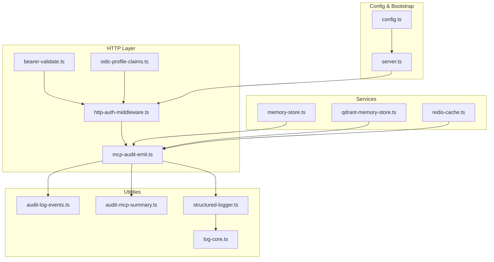
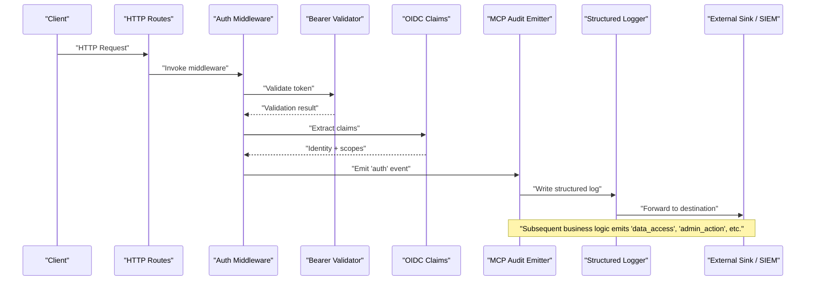
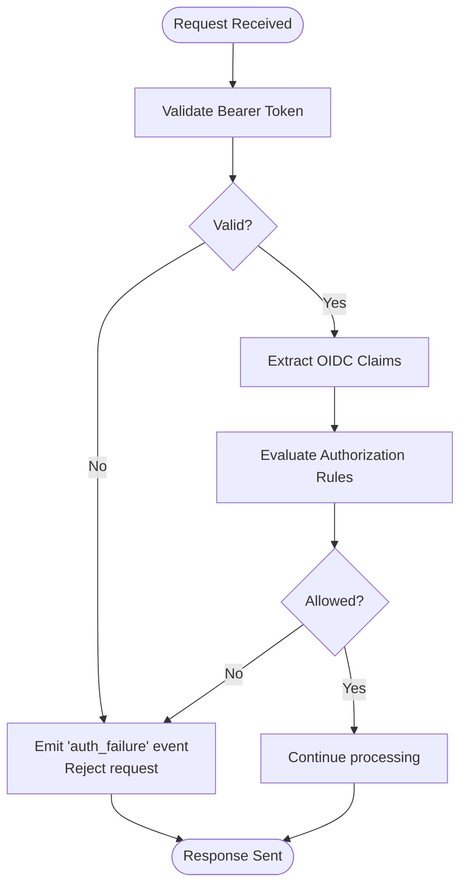
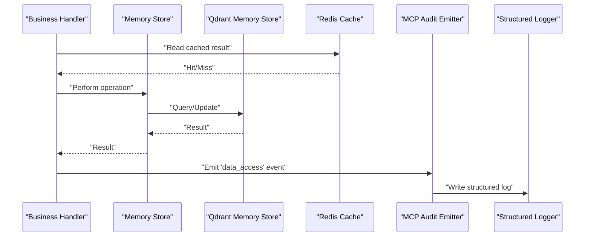
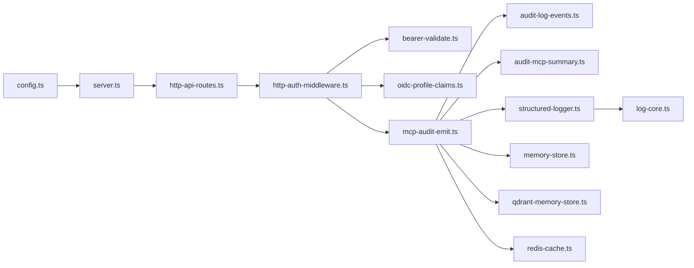

# Audit Logging and Compliance

<cite>
**Referenced Files in This Document**
- [audit-log.md](file://docs/security/audit-log.md)
- [mcp-audit-emit.ts](file://src/http/mcp-audit-emit.ts)
- [audit-log-events.ts](file://src/utils/audit-log-events.ts)
- [audit-mcp-summary.ts](file://src/utils/audit-mcp-summary.ts)
- [structured-logger.ts](file://src/utils/structured-logger.ts)
- [http-auth-middleware.ts](file://src/http/http-auth-middleware.ts)
- [oidc-profile-claims.ts](file://src/http/oidc-profile-claims.ts)
- [bearer-validate.ts](file://src/http/bearer-validate.ts)
- [log-core.ts](file://src/utils/log-core.ts)
- [global-error-handlers.ts](file://src/utils/global-error-handlers.ts)
- [http-api-routes.ts](file://src/http/http-api-routes.ts)
- [memory-store.ts](file://src/services/memory-store.ts)
- [qdrant-memory-store.ts](file://src/services/qdrant/memory-store.ts)
- [redis-cache.ts](file://src/services/redis-cache.ts)
- [config.ts](file://src/config.ts)
- [server.ts](file://src/server.ts)
</cite>

## Table of Contents
1. [Introduction](#introduction)
2. [Project Structure](#project-structure)
3. [Core Components](#core-components)
4. [Architecture Overview](#architecture-overview)
5. [Detailed Component Analysis](#detailed-component-analysis)
6. [Dependency Analysis](#dependency-analysis)
7. [Performance Considerations](#performance-considerations)
8. [Troubleshooting Guide](#troubleshooting-guide)
9. [Conclusion](#conclusion)
10. [Appendices](#appendices)

## Introduction
This document explains the audit logging and compliance features in Kairos MCP. It covers the structured audit event system for authentication, authorization decisions, data access patterns, and administrative actions. It also describes the audit log format, event categorization, metadata enrichment for forensic analysis, compliance reporting capabilities, retention policies, secure storage, configuration examples for destinations, filtering rules, alerting thresholds, SIEM integration, aggregation pipelines, privacy considerations, anonymization techniques, and regulatory alignment with frameworks such as GDPR and SOC 2.

## Project Structure
Audit-related functionality spans HTTP middleware, utilities, services, and documentation:
- Documentation: security guidance and audit overview
- HTTP layer: middleware that enriches context and emits audit events
- Utilities: event definitions, MCP summary helpers, structured logger, and core logging
- Services: memory and cache stores used by audited operations
- Configuration and server bootstrap: wiring of logging and audit behavior

**Diagram sources**
- [http-auth-middleware.ts](file://src/http/http-auth-middleware.ts)
- [bearer-validate.ts](file://src/http/bearer-validate.ts)
- [oidc-profile-claims.ts](file://src/http/oidc-profile-claims.ts)
- [mcp-audit-emit.ts](file://src/http/mcp-audit-emit.ts)
- [audit-log-events.ts](file://src/utils/audit-log-events.ts)
- [audit-mcp-summary.ts](file://src/utils/audit-mcp-summary.ts)
- [structured-logger.ts](file://src/utils/structured-logger.ts)
- [log-core.ts](file://src/utils/log-core.ts)
- [memory-store.ts](file://src/services/memory-store.ts)
- [qdrant-memory-store.ts](file://src/services/qdrant/memory-store.ts)
- [redis-cache.ts](file://src/services/redis-cache.ts)
- [config.ts](file://src/config.ts)
- [server.ts](file://src/server.ts)

**Section sources**
- [audit-log.md](file://docs/security/audit-log.md)
- [mcp-audit-emit.ts](file://src/http/mcp-audit-emit.ts)
- [audit-log-events.ts](file://src/utils/audit-log-events.ts)
- [audit-mcp-summary.ts](file://src/utils/audit-mcp-summary.ts)
- [structured-logger.ts](file://src/utils/structured-logger.ts)
- [log-core.ts](file://src/utils/log-core.ts)
- [http-auth-middleware.ts](file://src/http/http-auth-middleware.ts)
- [bearer-validate.ts](file://src/http/bearer-validate.ts)
- [oidc-profile-claims.ts](file://src/http/oidc-profile-claims.ts)
- [memory-store.ts](file://src/services/memory-store.ts)
- [qdrant-memory-store.ts](file://src/services/qdrant/memory-store.ts)
- [redis-cache.ts](file://src/services/redis-cache.ts)
- [config.ts](file://src/config.ts)
- [server.ts](file://src/server.ts)

## Core Components
- Structured Logger and Log Core: Provide a consistent JSON-based logging interface and low-level transport to stdout or configured sinks.
- Audit Event Definitions: Centralized catalog of event types and schemas for consistent categorization across the application.
- MCP Audit Emitter: Emits standardized audit events around MCP tool invocations and related flows.
- Authentication Middleware: Enriches request context (user identity, scopes, tenant) and triggers auth/authz audit events.
- OIDC Profile Claims: Extracts stable identifiers and attributes for audit correlation.
- Memory and Cache Stores: Audited data access points for reads/writes and caching behaviors.
- Configuration and Server Bootstrap: Initialize logging, configure destinations, and wire audit emission into request lifecycle.

Key responsibilities:
- Ensure every sensitive action produces an immutable, timestamped, structured record.
- Enrich records with user, session, resource, and outcome metadata.
- Support filtering, sampling, and redaction before emission.
- Integrate with external sinks for centralized collection and long-term retention.

**Section sources**
- [structured-logger.ts](file://src/utils/structured-logger.ts)
- [log-core.ts](file://src/utils/log-core.ts)
- [audit-log-events.ts](file://src/utils/audit-log-events.ts)
- [mcp-audit-emit.ts](file://src/http/mcp-audit-emit.ts)
- [http-auth-middleware.ts](file://src/http/http-auth-middleware.ts)
- [oidc-profile-claims.ts](file://src/http/oidc-profile-claims.ts)
- [memory-store.ts](file://src/services/memory-store.ts)
- [qdrant-memory-store.ts](file://src/services/qdrant/memory-store.ts)
- [redis-cache.ts](file://src/services/redis-cache.ts)
- [config.ts](file://src/config.ts)
- [server.ts](file://src/server.ts)

## Architecture Overview
The audit architecture follows a layered approach:
- Ingress and Auth: Requests enter via HTTP routes; bearer validation and OIDC profile extraction establish identity and scope.
- Context Enrichment: Middleware attaches user, tenant, and correlation IDs to the request context.
- Audit Emission: The MCP audit emitter writes structured events at key decision points (auth, authz, data access, admin).
- Logging Pipeline: Structured logger formats and forwards logs to configured destinations (stdout, files, network sinks).
- Storage and Retention: Logs are forwarded to external systems (e.g., SIEM, log aggregators) where retention and archival policies apply.

**Diagram sources**
- [http-api-routes.ts](file://src/http/http-api-routes.ts)
- [http-auth-middleware.ts](file://src/http/http-auth-middleware.ts)
- [bearer-validate.ts](file://src/http/bearer-validate.ts)
- [oidc-profile-claims.ts](file://src/http/oidc-profile-claims.ts)
- [mcp-audit-emit.ts](file://src/http/mcp-audit-emit.ts)
- [structured-logger.ts](file://src/utils/structured-logger.ts)

## Detailed Component Analysis

### Authentication and Authorization Events
- Purpose: Record login attempts, token validation outcomes, and authorization decisions tied to resources and scopes.
- Enrichment: User ID, issuer, scopes, client IP, user agent, tenant, correlation ID, and decision outcome.
- Flow:
  - Bearer validation checks token validity and extracts principal.
  - OIDC profile claims provide stable identifiers and attributes.
  - Middleware emits auth/authz events with contextual metadata.

**Diagram sources**
- [bearer-validate.ts](file://src/http/bearer-validate.ts)
- [oidc-profile-claims.ts](file://src/http/oidc-profile-claims.ts)
- [http-auth-middleware.ts](file://src/http/http-auth-middleware.ts)
- [mcp-audit-emit.ts](file://src/http/mcp-audit-emit.ts)

**Section sources**
- [bearer-validate.ts](file://src/http/bearer-validate.ts)
- [oidc-profile-claims.ts](file://src/http/oidc-profile-claims.ts)
- [http-auth-middleware.ts](file://src/http/http-auth-middleware.ts)
- [mcp-audit-emit.ts](file://src/http/mcp-audit-emit.ts)

### Data Access Patterns
- Purpose: Capture read/write operations on memory and vector stores, including query parameters, affected resources, and outcomes.
- Enrichment: Resource identifiers, operation type, space/context, result size, latency, and error codes when applicable.
- Integration Points:
  - Memory store wrappers emit events around CRUD operations.
  - Qdrant-backed memory store emits events for vector operations.
  - Redis cache emits events for cache hits/misses and invalidations.

**Diagram sources**
- [memory-store.ts](file://src/services/memory-store.ts)
- [qdrant-memory-store.ts](file://src/services/qdrant/memory-store.ts)
- [redis-cache.ts](file://src/services/redis-cache.ts)
- [mcp-audit-emit.ts](file://src/http/mcp-audit-emit.ts)
- [structured-logger.ts](file://src/utils/structured-logger.ts)

**Section sources**
- [memory-store.ts](file://src/services/memory-store.ts)
- [qdrant-memory-store.ts](file://src/services/qdrant/memory-store.ts)
- [redis-cache.ts](file://src/services/redis-cache.ts)
- [mcp-audit-emit.ts](file://src/http/mcp-audit-emit.ts)

### Administrative Actions
- Purpose: Track privileged operations such as configuration changes, user management, and system maintenance tasks.
- Enrichment: Admin identity, target entity, change details (sanitized), approval references, and outcome.
- Notes: Ensure only necessary fields are recorded; avoid logging secrets or PII.

**Section sources**
- [mcp-audit-emit.ts](file://src/http/mcp-audit-emit.ts)
- [audit-log-events.ts](file://src/utils/audit-log-events.ts)

### MCP Tool Invocation Summary
- Purpose: Summarize MCP tool calls for audit trails, capturing inputs (sanitized), outputs (sanitized), duration, and status.
- Enrichment: Tool name, version, caller identity, correlation ID, and failure reasons.

**Section sources**
- [audit-mcp-summary.ts](file://src/utils/audit-mcp-summary.ts)
- [mcp-audit-emit.ts](file://src/http/mcp-audit-emit.ts)

### Structured Logger and Log Core
- Purpose: Provide a consistent, schema-driven logging interface and transport mechanism.
- Responsibilities:
  - Format events as structured JSON.
  - Apply filters and redactions before emission.
  - Forward to configured sinks (stdout, files, network endpoints).

**Section sources**
- [structured-logger.ts](file://src/utils/structured-logger.ts)
- [log-core.ts](file://src/utils/log-core.ts)

### Global Error Handling and Audit
- Purpose: Ensure errors during audit emission do not disrupt primary operations while still recording failures.
- Behavior:
  - Catch and log audit emission errors without propagating to callers.
  - Include minimal diagnostic metadata for troubleshooting.

**Section sources**
- [global-error-handlers.ts](file://src/utils/global-error-handlers.ts)

## Dependency Analysis
The audit subsystem depends on:
- HTTP routing and middleware for request context and lifecycle hooks.
- OIDC and bearer validation for identity and scope resolution.
- Services for data access auditing.
- Configuration and server bootstrap for initialization and sink wiring.

**Diagram sources**
- [config.ts](file://src/config.ts)
- [server.ts](file://src/server.ts)
- [http-api-routes.ts](file://src/http/http-api-routes.ts)
- [http-auth-middleware.ts](file://src/http/http-auth-middleware.ts)
- [bearer-validate.ts](file://src/http/bearer-validate.ts)
- [oidc-profile-claims.ts](file://src/http/oidc-profile-claims.ts)
- [mcp-audit-emit.ts](file://src/http/mcp-audit-emit.ts)
- [audit-log-events.ts](file://src/utils/audit-log-events.ts)
- [audit-mcp-summary.ts](file://src/utils/audit-mcp-summary.ts)
- [structured-logger.ts](file://src/utils/structured-logger.ts)
- [log-core.ts](file://src/utils/log-core.ts)
- [memory-store.ts](file://src/services/memory-store.ts)
- [qdrant-memory-store.ts](file://src/services/qdrant/memory-store.ts)
- [redis-cache.ts](file://src/services/redis-cache.ts)

**Section sources**
- [config.ts](file://src/config.ts)
- [server.ts](file://src/server.ts)
- [http-api-routes.ts](file://src/http/http-api-routes.ts)
- [http-auth-middleware.ts](file://src/http/http-auth-middleware.ts)
- [bearer-validate.ts](file://src/http/bearer-validate.ts)
- [oidc-profile-claims.ts](file://src/http/oidc-profile-claims.ts)
- [mcp-audit-emit.ts](file://src/http/mcp-audit-emit.ts)
- [audit-log-events.ts](file://src/utils/audit-log-events.ts)
- [audit-mcp-summary.ts](file://src/utils/audit-mcp-summary.ts)
- [structured-logger.ts](file://src/utils/structured-logger.ts)
- [log-core.ts](file://src/utils/log-core.ts)
- [memory-store.ts](file://src/services/memory-store.ts)
- [qdrant-memory-store.ts](file://src/services/qdrant/memory-store.ts)
- [redis-cache.ts](file://src/services/redis-cache.ts)

## Performance Considerations
- Asynchronous Emission: Emit audit events asynchronously to minimize request latency.
- Sampling and Filtering: Configure sampling rates for high-volume events and filter out noisy or non-sensitive operations.
- Redaction at Source: Sanitize inputs/outputs early to reduce payload size and protect sensitive data.
- Batched Writes: Where supported, batch log entries to external sinks to reduce overhead.
- Backpressure Handling: Implement queueing and backpressure controls to prevent log storms from impacting service stability.

[No sources needed since this section provides general guidance]

## Troubleshooting Guide
Common issues and resolutions:
- Missing Identity Metadata: Verify OIDC claims extraction and bearer validation paths; ensure correlation IDs propagate through middleware.
- Audit Events Not Appearing: Check structured logger configuration and sink connectivity; inspect global error handlers for silent failures.
- Excessive Log Volume: Adjust filtering rules and sampling thresholds; refine event categories to focus on high-value signals.
- Sensitive Data Leakage: Review input/output sanitization in MCP summaries and audit emitters; enforce field-level redaction policies.

Operational checks:
- Confirm destinations are reachable and authenticated.
- Validate retention policies align with compliance requirements.
- Monitor metrics around audit emission success/failure rates.

**Section sources**
- [global-error-handlers.ts](file://src/utils/global-error-handlers.ts)
- [structured-logger.ts](file://src/utils/structured-logger.ts)
- [log-core.ts](file://src/utils/log-core.ts)
- [audit-mcp-summary.ts](file://src/utils/audit-mcp-summary.ts)
- [mcp-audit-emit.ts](file://src/http/mcp-audit-emit.ts)

## Conclusion
Kairos MCP implements a comprehensive audit logging and compliance framework centered on structured events emitted across authentication, authorization, data access, and administrative operations. By leveraging consistent metadata enrichment, robust filtering and redaction, and integration with external sinks, the system supports forensic analysis, compliance reporting, and operational observability while maintaining performance and privacy.

[No sources needed since this section summarizes without analyzing specific files]

## Appendices

### Audit Log Format and Event Categorization
- Event Categories:
  - Authentication: login attempts, token validation, session lifecycle.
  - Authorization: access decisions per resource and scope.
  - Data Access: reads/writes to memory and vector stores, cache interactions.
  - Administrative Actions: privileged operations and configuration changes.
- Common Fields:
  - Timestamp, event type, correlation ID, user identity, tenant, resource identifiers, outcome, latency, error codes.
- Enrichment Strategy:
  - Stable identifiers from OIDC claims.
  - Request-scoped metadata propagated via middleware.
  - Sanitized payloads to exclude sensitive content.

**Section sources**
- [audit-log-events.ts](file://src/utils/audit-log-events.ts)
- [oidc-profile-claims.ts](file://src/http/oidc-profile-claims.ts)
- [http-auth-middleware.ts](file://src/http/http-auth-middleware.ts)
- [audit-mcp-summary.ts](file://src/utils/audit-mcp-summary.ts)

### Compliance Reporting Capabilities
- Report Generation: Aggregate structured events to produce compliance reports aligned with internal policies and external frameworks.
- Evidence Collection: Export filtered event sets for audits, including timestamps, identities, and outcomes.
- Policy Enforcement: Map audit events to control objectives for SOC 2 and similar frameworks.

**Section sources**
- [audit-log.md](file://docs/security/audit-log.md)
- [mcp-audit-emit.ts](file://src/http/mcp-audit-emit.ts)

### Log Retention Policies and Secure Storage
- Retention: Define time-based and lifecycle policies for short-term and long-term storage.
- Secure Storage: Encrypt logs at rest and in transit; restrict access via IAM and least privilege.
- Immutability: Prevent tampering by using append-only storage and integrity checks.

**Section sources**
- [structured-logger.ts](file://src/utils/structured-logger.ts)
- [log-core.ts](file://src/utils/log-core.ts)

### Configuration Examples
- Destinations:
  - Configure stdout, file, and network sinks via environment variables or config files.
- Filtering Rules:
  - Enable/disable event categories; set sampling rates per category.
- Alerting Thresholds:
  - Define thresholds for failed auth attempts, unauthorized access spikes, and anomalous data access patterns.

**Section sources**
- [config.ts](file://src/config.ts)
- [server.ts](file://src/server.ts)
- [structured-logger.ts](file://src/utils/structured-logger.ts)

### SIEM Integration and Aggregation Pipelines
- Integration Points:
  - Forward structured logs to SIEM collectors (e.g., syslog, HTTP endpoints).
  - Use standard formats compatible with common SIEM parsers.
- Aggregation:
  - Normalize fields for correlation across systems.
  - Deduplicate and enrich with threat intelligence feeds as needed.

**Section sources**
- [structured-logger.ts](file://src/utils/structured-logger.ts)
- [log-core.ts](file://src/utils/log-core.ts)

### Privacy Considerations and Anonymization
- Sensitive Data Minimization:
  - Avoid logging PII, secrets, tokens, or full payloads.
- Anonymization Techniques:
  - Hash or pseudonymize user identifiers where appropriate.
  - Mask or truncate sensitive fields before emission.
- Regulatory Alignment:
  - Align practices with GDPR principles (data minimization, purpose limitation).
  - Ensure audit trails support SOC 2 controls (security, availability, confidentiality).

**Section sources**
- [audit-mcp-summary.ts](file://src/utils/audit-mcp-summary.ts)
- [audit-log-events.ts](file://src/utils/audit-log-events.ts)
- [audit-log.md](file://docs/security/audit-log.md)