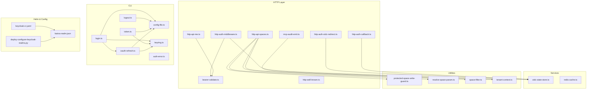
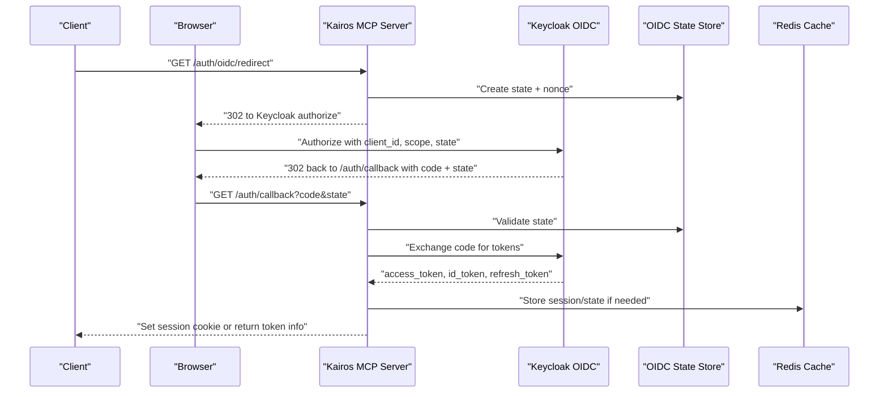
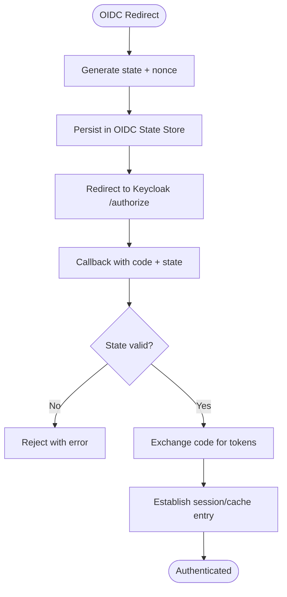
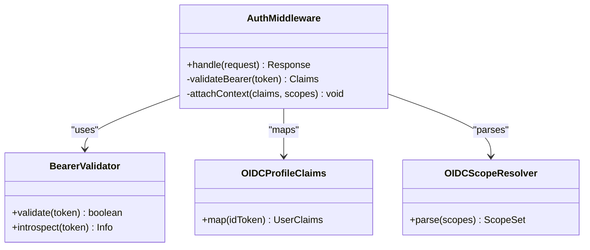
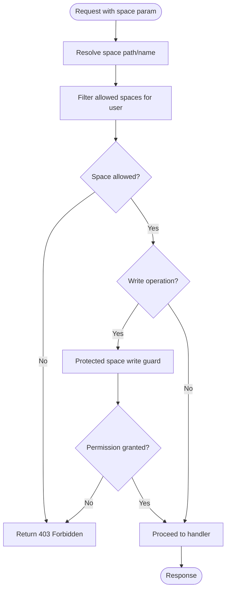
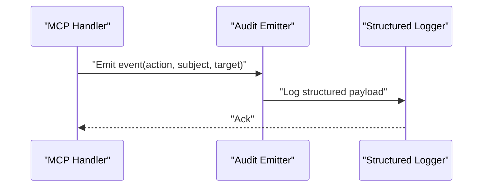
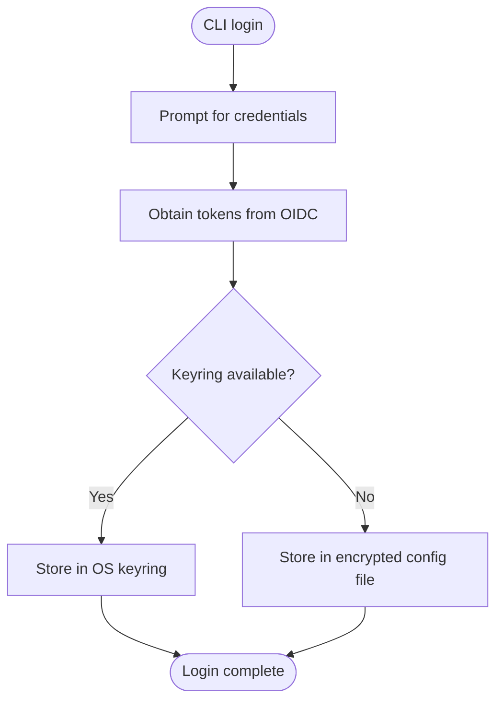
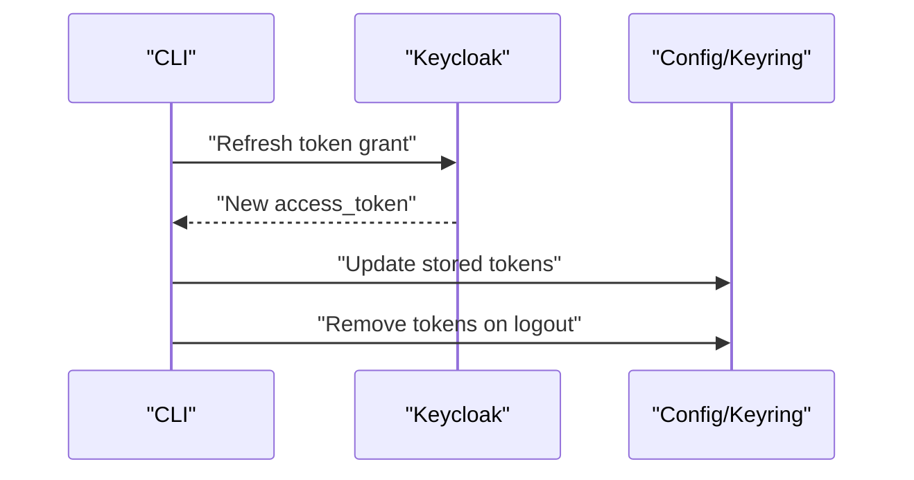
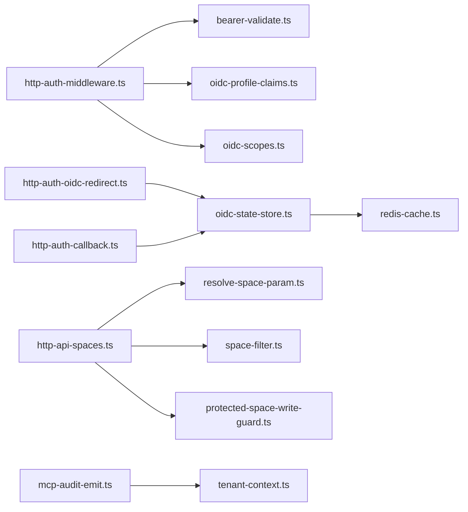

# Authentication and Security

<cite>
**Referenced Files in This Document**
- [auth-overview.md](file://docs/architecture/auth-overview.md)
- [audit-log.md](file://docs/security/audit-log.md)
- [http-auth-middleware.ts](file://src/http/http-auth-middleware.ts)
- [bearer-validate.ts](file://src/http/bearer-validate.ts)
- [http-auth-callback.ts](file://src/http/http-auth-callback.ts)
- [http-auth-oidc-redirect.ts](file://src/http/http-auth-oidc-redirect.ts)
- [oidc-profile-claims.ts](file://src/http/oidc-profile-claims.ts)
- [oidc-scopes.ts](file://src/http/oidc-scopes.ts)
- [oidc-state-store.ts](file://src/services/oidc-state-store.ts)
- [redis-cache.ts](file://src/services/redis-cache.ts)
- [mcp-audit-emit.ts](file://src/http/mcp-audit-emit.ts)
- [protected-space-write-guard.ts](file://src/utils/protected-space-write-guard.ts)
- [resolve-space-param.ts](file://src/utils/resolve-space-param.ts)
- [space-filter.ts](file://src/utils/space-filter.ts)
- [tenant-context.ts](file://src/utils/tenant-context.ts)
- [http-api-spaces.ts](file://src/http/http-api-spaces.ts)
- [http-api-me.ts](file://src/http/http-api-me.ts)
- [http-well-known.ts](file://src/http/http-well-known.ts)
- [keycloak-cr.yaml](file://helm/kairos-mcp/templates/keycloak-cr.yaml)
- [kairos-realm.json](file://helm/kairos-mcp/files/kairos-realm.json)
- [deploy-configure-keycloak-realms.py](file://scripts/deploy-configure-keycloak-realms.py)
- [oauth-refresh.ts](file://src/cli/oauth-refresh.ts)
- [login.ts](file://src/cli/commands/login.ts)
- [logout.ts](file://src/cli/commands/logout.ts)
- [token.ts](file://src/cli/commands/token.ts)
- [auth-error.ts](file://src/cli/auth-error.ts)
- [config-file.ts](file://src/cli/config-file.ts)
- [keyring.ts](file://src/cli/keyring.ts)
- [threat-model.md](file://docs/security/threat-model.md)
- [incident-runbook.md](file://docs/security/incident-runbook.md)
</cite>

## Table of Contents
1. [Introduction](#introduction)
2. [Project Structure](#project-structure)
3. [Core Components](#core-components)
4. [Architecture Overview](#architecture-overview)
5. [Detailed Component Analysis](#detailed-component-analysis)
6. [Dependency Analysis](#dependency-analysis)
7. [Performance Considerations](#performance-considerations)
8. [Troubleshooting Guide](#troubleshooting-guide)
9. [Conclusion](#conclusion)
10. [Appendices](#appendices)

## Introduction
This document explains Kairos MCP authentication and security features with a focus on OpenID Connect (OIDC) integration via Keycloak, bearer token validation, session management, secure credential handling, space-based authorization, audit logging, OAuth flows, token refresh, logout procedures, and production security best practices. It is intended for operators, developers, and security reviewers to understand how identity, access control, and auditing are implemented end-to-end.

## Project Structure
The authentication and security implementation spans HTTP middleware, OIDC handlers, services, utilities, CLI commands, Helm templates, and documentation:

- HTTP layer: OIDC redirect/callback, bearer validation, auth middleware, well-known endpoints, spaces API, me endpoint, audit emission
- Services: OIDC state store, Redis-backed cache
- Utilities: Space resolution, filtering, protected write guard, tenant context
- CLI: Login, logout, token management, OAuth refresh, error handling, config and keyring
- Helm: Keycloak CR, realm import, deployment scripts
- Docs: Architecture overview, audit log, threat model, incident runbook

**Diagram sources**
- [http-auth-middleware.ts](file://src/http/http-auth-middleware.ts)
- [bearer-validate.ts](file://src/http/bearer-validate.ts)
- [http-auth-oidc-redirect.ts](file://src/http/http-auth-oidc-redirect.ts)
- [http-auth-callback.ts](file://src/http/http-auth-callback.ts)
- [http-well-known.ts](file://src/http/http-well-known.ts)
- [http-api-spaces.ts](file://src/http/http-api-spaces.ts)
- [http-api-me.ts](file://src/http/http-api-me.ts)
- [mcp-audit-emit.ts](file://src/http/mcp-audit-emit.ts)
- [oidc-state-store.ts](file://src/services/oidc-state-store.ts)
- [redis-cache.ts](file://src/services/redis-cache.ts)
- [protected-space-write-guard.ts](file://src/utils/protected-space-write-guard.ts)
- [resolve-space-param.ts](file://src/utils/resolve-space-param.ts)
- [space-filter.ts](file://src/utils/space-filter.ts)
- [tenant-context.ts](file://src/utils/tenant-context.ts)
- [login.ts](file://src/cli/commands/login.ts)
- [logout.ts](file://src/cli/commands/logout.ts)
- [token.ts](file://src/cli/commands/token.ts)
- [oauth-refresh.ts](file://src/cli/oauth-refresh.ts)
- [auth-error.ts](file://src/cli/auth-error.ts)
- [config-file.ts](file://src/cli/config-file.ts)
- [keyring.ts](file://src/cli/keyring.ts)
- [keycloak-cr.yaml](file://helm/kairos-mcp/templates/keycloak-cr.yaml)
- [kairos-realm.json](file://helm/kairos-mcp/files/kairos-realm.json)
- [deploy-configure-keycloak-realms.py](file://scripts/deploy-configure-keycloak-realms.py)

**Section sources**
- [auth-overview.md](file://docs/architecture/auth-overview.md)

## Core Components
- OIDC Integration: Redirect and callback handlers orchestrate the Authorization Code flow with Keycloak, using an OIDC state store for CSRF protection and transient state.
- Bearer Token Validation: Middleware validates incoming tokens and enriches request context with user claims and scopes.
- Session Management: OIDC state and optional server-side sessions are managed via the OIDC state store and Redis-backed cache.
- Space-Based Authorization: Fine-grained permissions are enforced per space using guards, parameter resolution, and filters.
- Audit Logging: MCP operations emit structured audit events for compliance and monitoring.
- CLI Auth Flows: Login, logout, token introspection, and refresh are supported with secure storage options.

**Section sources**
- [http-auth-oidc-redirect.ts](file://src/http/http-auth-oidc-redirect.ts)
- [http-auth-callback.ts](file://src/http/http-auth-callback.ts)
- [bearer-validate.ts](file://src/http/bearer-validate.ts)
- [oidc-state-store.ts](file://src/services/oidc-state-store.ts)
- [redis-cache.ts](file://src/services/redis-cache.ts)
- [protected-space-write-guard.ts](file://src/utils/protected-space-write-guard.ts)
- [resolve-space-param.ts](file://src/utils/resolve-space-param.ts)
- [space-filter.ts](file://src/utils/space-filter.ts)
- [mcp-audit-emit.ts](file://src/http/mcp-audit-emit.ts)
- [login.ts](file://src/cli/commands/login.ts)
- [logout.ts](file://src/cli/commands/logout.ts)
- [token.ts](file://src/cli/commands/token.ts)
- [oauth-refresh.ts](file://src/cli/oauth-refresh.ts)

## Architecture Overview
Kairos MCP integrates with Keycloak as the OIDC provider. Clients authenticate via browser or CLI, obtain tokens, and call APIs protected by bearer validation. Access decisions are scoped to spaces, and all sensitive operations are audited.

**Diagram sources**
- [http-auth-oidc-redirect.ts](file://src/http/http-auth-oidc-redirect.ts)
- [http-auth-callback.ts](file://src/http/http-auth-callback.ts)
- [oidc-state-store.ts](file://src/services/oidc-state-store.ts)
- [redis-cache.ts](file://src/services/redis-cache.ts)

## Detailed Component Analysis

### OIDC Integration with Keycloak
- Redirect handler initiates the Authorization Code flow, generating a cryptographically random state and nonce, persisted in the OIDC state store.
- Callback handler validates the state, exchanges the authorization code for tokens, and establishes a server-side session or returns tokens depending on client type.
- Well-known endpoints expose OIDC discovery metadata for clients.

**Diagram sources**
- [http-auth-oidc-redirect.ts](file://src/http/http-auth-oidc-redirect.ts)
- [http-auth-callback.ts](file://src/http/http-auth-callback.ts)
- [oidc-state-store.ts](file://src/services/oidc-state-store.ts)
- [http-well-known.ts](file://src/http/http-well-known.ts)

**Section sources**
- [http-auth-oidc-redirect.ts](file://src/http/http-auth-oidc-redirect.ts)
- [http-auth-callback.ts](file://src/http/http-auth-callback.ts)
- [oidc-state-store.ts](file://src/services/oidc-state-store.ts)
- [http-well-known.ts](file://src/http/http-well-known.ts)

### Bearer Token Validation and Request Context
- The auth middleware intercepts requests, extracts the bearer token from the Authorization header, validates it against the configured OIDC provider, and attaches user profile claims and scopes to the request context.
- Profile claims mapping ensures consistent user attributes across the application.
- Scopes are validated to enforce fine-grained access where applicable.

**Diagram sources**
- [http-auth-middleware.ts](file://src/http/http-auth-middleware.ts)
- [bearer-validate.ts](file://src/http/bearer-validate.ts)
- [oidc-profile-claims.ts](file://src/http/oidc-profile-claims.ts)
- [oidc-scopes.ts](file://src/http/oidc-scopes.ts)

**Section sources**
- [http-auth-middleware.ts](file://src/http/http-auth-middleware.ts)
- [bearer-validate.ts](file://src/http/bearer-validate.ts)
- [oidc-profile-claims.ts](file://src/http/oidc-profile-claims.ts)
- [oidc-scopes.ts](file://src/http/oidc-scopes.ts)

### Space-Based Authorization Model
- Space parameters are resolved from request inputs or headers, then filtered according to user roles and memberships.
- Protected write operations are guarded by a dedicated guard that checks permissions before mutating resources.
- The spaces API enforces read/write boundaries per space and exposes capabilities accordingly.

**Diagram sources**
- [resolve-space-param.ts](file://src/utils/resolve-space-param.ts)
- [space-filter.ts](file://src/utils/space-filter.ts)
- [protected-space-write-guard.ts](file://src/utils/protected-space-write-guard.ts)
- [http-api-spaces.ts](file://src/http/http-api-spaces.ts)

**Section sources**
- [resolve-space-param.ts](file://src/utils/resolve-space-param.ts)
- [space-filter.ts](file://src/utils/space-filter.ts)
- [protected-space-write-guard.ts](file://src/utils/protected-space-write-guard.ts)
- [http-api-spaces.ts](file://src/http/http-api-spaces.ts)

### Audit Logging for Compliance and Monitoring
- MCP operations emit structured audit events including actor identity, action, resource scope, and outcome.
- Audit events are emitted through a centralized emitter and can be integrated with external logging systems.

**Diagram sources**
- [mcp-audit-emit.ts](file://src/http/mcp-audit-emit.ts)

**Section sources**
- [mcp-audit-emit.ts](file://src/http/mcp-audit-emit.ts)
- [audit-log.md](file://docs/security/audit-log.md)

### Secure Credential Handling and Storage
- CLI login stores tokens securely using platform keyring when available; otherwise falls back to encrypted file storage.
- Configuration files manage OIDC settings and environment-specific overrides.
- Errors during auth flows are surfaced consistently to guide remediation.

**Diagram sources**
- [login.ts](file://src/cli/commands/login.ts)
- [config-file.ts](file://src/cli/config-file.ts)
- [keyring.ts](file://src/cli/keyring.ts)
- [auth-error.ts](file://src/cli/auth-error.ts)

**Section sources**
- [login.ts](file://src/cli/commands/login.ts)
- [config-file.ts](file://src/cli/config-file.ts)
- [keyring.ts](file://src/cli/keyring.ts)
- [auth-error.ts](file://src/cli/auth-error.ts)

### OAuth Flows, Token Refresh, and Logout
- Authorization Code Flow: Browser-based login redirects to Keycloak and returns to the callback endpoint.
- Token Refresh: CLI supports refreshing expired tokens using stored refresh tokens.
- Logout: Clears local tokens and optionally invalidates server-side sessions.

**Diagram sources**
- [oauth-refresh.ts](file://src/cli/oauth-refresh.ts)
- [logout.ts](file://src/cli/commands/logout.ts)
- [token.ts](file://src/cli/commands/token.ts)
- [config-file.ts](file://src/cli/config-file.ts)
- [keyring.ts](file://src/cli/keyring.ts)

**Section sources**
- [oauth-refresh.ts](file://src/cli/oauth-refresh.ts)
- [logout.ts](file://src/cli/commands/logout.ts)
- [token.ts](file://src/cli/commands/token.ts)
- [config-file.ts](file://src/cli/config-file.ts)
- [keyring.ts](file://src/cli/keyring.ts)

### Me Endpoint and Identity Exposure
- The me endpoint returns authenticated user profile information based on validated bearer tokens, enabling UI and clients to display current identity.

**Section sources**
- [http-api-me.ts](file://src/http/http-api-me.ts)
- [bearer-validate.ts](file://src/http/bearer-validate.ts)

## Dependency Analysis
Authentication components depend on OIDC provider configuration, persistent state for CSRF and sessions, and Redis for caching. Authorization depends on space resolution and filtering utilities. Audit logging depends on structured logging infrastructure.

**Diagram sources**
- [http-auth-middleware.ts](file://src/http/http-auth-middleware.ts)
- [bearer-validate.ts](file://src/http/bearer-validate.ts)
- [oidc-profile-claims.ts](file://src/http/oidc-profile-claims.ts)
- [oidc-scopes.ts](file://src/http/oidc-scopes.ts)
- [http-auth-oidc-redirect.ts](file://src/http/http-auth-oidc-redirect.ts)
- [http-auth-callback.ts](file://src/http/http-auth-callback.ts)
- [oidc-state-store.ts](file://src/services/oidc-state-store.ts)
- [redis-cache.ts](file://src/services/redis-cache.ts)
- [http-api-spaces.ts](file://src/http/http-api-spaces.ts)
- [resolve-space-param.ts](file://src/utils/resolve-space-param.ts)
- [space-filter.ts](file://src/utils/space-filter.ts)
- [protected-space-write-guard.ts](file://src/utils/protected-space-write-guard.ts)
- [mcp-audit-emit.ts](file://src/http/mcp-audit-emit.ts)
- [tenant-context.ts](file://src/utils/tenant-context.ts)

**Section sources**
- [http-auth-middleware.ts](file://src/http/http-auth-middleware.ts)
- [bearer-validate.ts](file://src/http/bearer-validate.ts)
- [oidc-profile-claims.ts](file://src/http/oidc-profile-claims.ts)
- [oidc-scopes.ts](file://src/http/oidc-scopes.ts)
- [http-auth-oidc-redirect.ts](file://src/http/http-auth-oidc-redirect.ts)
- [http-auth-callback.ts](file://src/http/http-auth-callback.ts)
- [oidc-state-store.ts](file://src/services/oidc-state-store.ts)
- [redis-cache.ts](file://src/services/redis-cache.ts)
- [http-api-spaces.ts](file://src/http/http-api-spaces.ts)
- [resolve-space-param.ts](file://src/utils/resolve-space-param.ts)
- [space-filter.ts](file://src/utils/space-filter.ts)
- [protected-space-write-guard.ts](file://src/utils/protected-space-write-guard.ts)
- [mcp-audit-emit.ts](file://src/http/mcp-audit-emit.ts)
- [tenant-context.ts](file://src/utils/tenant-context.ts)

## Performance Considerations
- Token validation should leverage cached JWKS and introspection results where possible to reduce latency.
- OIDC state and sessions should use efficient Redis-backed storage with appropriate TTL alignment to session lifetimes.
- Space filtering and permission checks should be optimized to avoid unnecessary database calls; consider caching role-permission mappings.
- Audit events should be batched or asynchronously written to prevent blocking request paths.

[No sources needed since this section provides general guidance]

## Troubleshooting Guide
- OIDC Redirect Failures: Verify state nonce validity and Keycloak connectivity; check OIDC state store persistence.
- Bearer Token Errors: Inspect token format, expiration, and issuer; ensure middleware is correctly extracting Authorization headers.
- Space Permission Denied: Confirm user roles and memberships; validate space resolution and filter logic.
- CLI Login Issues: Check keyring availability and fallback storage encryption; review error messages for specific failure reasons.
- Audit Logs Missing: Ensure audit emitter is initialized and structured logger is configured.

**Section sources**
- [oidc-state-store.ts](file://src/services/oidc-state-store.ts)
- [bearer-validate.ts](file://src/http/bearer-validate.ts)
- [space-filter.ts](file://src/utils/space-filter.ts)
- [auth-error.ts](file://src/cli/auth-error.ts)
- [mcp-audit-emit.ts](file://src/http/mcp-audit-emit.ts)

## Conclusion
Kairos MCP implements a robust authentication and security model centered on OIDC with Keycloak, strict bearer token validation, space-based authorization, and comprehensive audit logging. By following the recommended production practices and leveraging the documented flows, operators can deploy a secure, compliant system with clear visibility into identity and access events.

[No sources needed since this section summarizes without analyzing specific files]

## Appendices

### Production Security Best Practices
- Use HTTPS everywhere and enforce TLS termination at the gateway.
- Configure Keycloak with strong policies: short-lived tokens, rotation, and least-privilege clients.
- Store secrets in a vault; avoid embedding credentials in images or configs.
- Enable network segmentation between Kairos MCP, Keycloak, Redis, and databases.
- Rotate keys and secrets regularly; monitor for anomalies and enforce alerting.
- Apply rate limiting and request size limits to mitigate abuse.
- Regularly review audit logs and perform security audits.

[No sources needed since this section provides general guidance]

### Keycloak Configuration References
- Keycloak Custom Resource and realm import are defined in Helm templates and JSON files.
- Deployment scripts assist in configuring realms and users for development and production.

**Section sources**
- [keycloak-cr.yaml](file://helm/kairos-mcp/templates/keycloak-cr.yaml)
- [kairos-realm.json](file://helm/kairos-mcp/files/kairos-realm.json)
- [deploy-configure-keycloak-realms.py](file://scripts/deploy-configure-keycloak-realms.py)

### Threat Model and Incident Response
- Refer to the threat model for identified risks and mitigations.
- Follow the incident runbook for response procedures and escalation paths.

**Section sources**
- [threat-model.md](file://docs/security/threat-model.md)
- [incident-runbook.md](file://docs/security/incident-runbook.md)