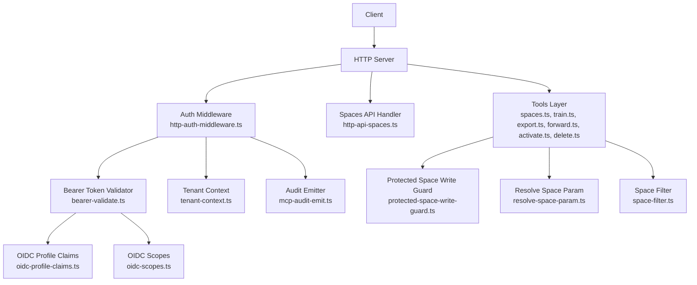
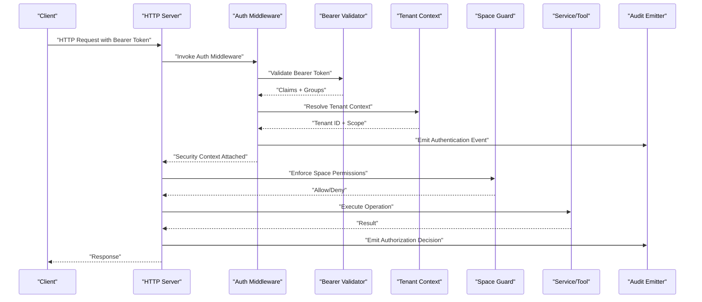
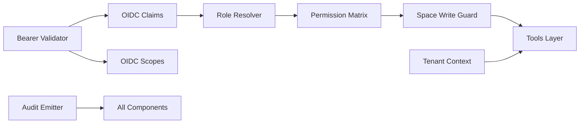

# Authorization and Access Control

<cite>
**Referenced Files in This Document**
- [auth-overview.md](file://docs/architecture/auth-overview.md)
- [http-auth-middleware.ts](file://src/http/http-auth-middleware.ts)
- [bearer-validate.ts](file://src/http/bearer-validate.ts)
- [oidc-profile-claims.ts](file://src/http/oidc-profile-claims.ts)
- [oidc-scopes.ts](file://src/http/oidc-scopes.ts)
- [tenant-context.ts](file://src/utils/tenant-context.ts)
- [protected-space-write-guard.ts](file://src/utils/protected-space-write-guard.ts)
- [resolve-space-param.ts](file://src/utils/resolve-space-param.ts)
- [space-filter.ts](file://src/utils/space-filter.ts)
- [mcp-audit-emit.ts](file://src/http/mcp-audit-emit.ts)
- [audit-log-events.ts](file://src/utils/audit-log-events.ts)
- [http-api-spaces.ts](file://src/http/http-api-spaces.ts)
- [spaces.ts](file://src/tools/spaces.ts)
- [train.ts](file://src/tools/train.ts)
- [export.ts](file://src/tools/export.ts)
- [forward.ts](file://src/tools/forward.ts)
- [activate.ts](file://src/tools/activate.ts)
- [delete.ts](file://src/tools/delete.ts)
- [kairos-search-access.test.ts](file://tests/integration/kairos-search-access.test.ts)
- [kairos-train-access.test.ts](file://tests/integration/kairos-train-access.test.ts)
- [kairos-search-forbidden-behavior.test.ts](file://tests/integration/kairos-search-forbidden-behavior.test.ts)
- [bearer-validate-group-fallback.test.ts](file://tests/unit/bearer-validate-group-fallback.test.ts)
- [tenant-context-auth.test.ts](file://tests/unit/tenant-context-auth.test.ts)
- [tenant-context-noauth.test.ts](file://tests/unit/tenant-context-noauth.test.ts)
- [tenant-context-search-scope.test.ts](file://tests/unit/tenant-context-search-scope.test.ts)
</cite>

## Table of Contents
1. [Introduction](#introduction)
2. [Project Structure](#project-structure)
3. [Core Components](#core-components)
4. [Architecture Overview](#architecture-overview)
5. [Detailed Component Analysis](#detailed-component-analysis)
6. [Dependency Analysis](#dependency-analysis)
7. [Performance Considerations](#performance-considerations)
8. [Troubleshooting Guide](#troubleshooting-guide)
9. [Conclusion](#conclusion)
10. [Appendices](#appendices)

## Introduction
This document explains the authorization and access control system for Kairos MCP. It focuses on:
- Space-based authorization model with fine-grained permissions for resources and operations
- Bearer token validation and role-based access control (RBAC)
- Permission inheritance patterns across spaces and tenants
- Tenant isolation mechanisms and multi-tenancy security boundaries
- Resource-level permissions for memory operations, workflow execution, and artifact management
- Configuration examples for roles, permissions, and access policies
- Authorization middleware implementation, permission checking patterns, and security context propagation
- Common authorization scenarios, privilege escalation prevention, and audit trail generation

The goal is to provide both a conceptual overview and code-level guidance for implementing secure, auditable access decisions across HTTP and MCP interfaces.

## Project Structure
Authorization-related functionality spans HTTP middleware, OIDC integration, tenant context utilities, space guards, and tool-level checks. The following diagram maps key components and their relationships.

**Diagram sources**
- [http-auth-middleware.ts](file://src/http/http-auth-middleware.ts)
- [bearer-validate.ts](file://src/http/bearer-validate.ts)
- [oidc-profile-claims.ts](file://src/http/oidc-profile-claims.ts)
- [oidc-scopes.ts](file://src/http/oidc-scopes.ts)
- [tenant-context.ts](file://src/utils/tenant-context.ts)
- [mcp-audit-emit.ts](file://src/http/mcp-audit-emit.ts)
- [http-api-spaces.ts](file://src/http/http-api-spaces.ts)
- [spaces.ts](file://src/tools/spaces.ts)
- [train.ts](file://src/tools/train.ts)
- [export.ts](file://src/tools/export.ts)
- [forward.ts](file://src/tools/forward.ts)
- [activate.ts](file://src/tools/activate.ts)
- [delete.ts](file://src/tools/delete.ts)
- [protected-space-write-guard.ts](file://src/utils/protected-space-write-guard.ts)
- [resolve-space-param.ts](file://src/utils/resolve-space-param.ts)
- [space-filter.ts](file://src/utils/space-filter.ts)

**Section sources**
- [auth-overview.md](file://docs/architecture/auth-overview.md)

## Core Components
- Bearer token validation: Validates tokens from HTTP requests and extracts claims used for authorization decisions.
- OIDC profile claims and scopes: Normalizes user identity and group membership; maps scopes to capabilities.
- Tenant context: Establishes tenant isolation and propagates tenant identity through request processing.
- Space-based authorization: Enforces resource-level permissions using space identifiers and operation types.
- Protected write guard: Centralized enforcement for write operations on protected spaces.
- Audit emission: Records authorization decisions and relevant context for auditing.

Key responsibilities:
- Validate bearer tokens and extract identity/group information
- Determine effective permissions based on roles, groups, and space membership
- Enforce tenant isolation and scope-limited visibility
- Emit audit events for access decisions and sensitive operations

**Section sources**
- [bearer-validate.ts](file://src/http/bearer-validate.ts)
- [oidc-profile-claims.ts](file://src/http/oidc-profile-claims.ts)
- [oidc-scopes.ts](file://src/http/oidc-scopes.ts)
- [tenant-context.ts](file://src/utils/tenant-context.ts)
- [protected-space-write-guard.ts](file://src/utils/protected-space-write-guard.ts)
- [mcp-audit-emit.ts](file://src/http/mcp-audit-emit.ts)

## Architecture Overview
The authorization architecture integrates OIDC-based authentication with RBAC and space-scoped permissions. Requests flow through an auth middleware that validates tokens, resolves tenant context, and attaches a security context to the request. Downstream handlers and tools enforce resource-level permissions before executing operations.

**Diagram sources**
- [http-auth-middleware.ts](file://src/http/http-auth-middleware.ts)
- [bearer-validate.ts](file://src/http/bearer-validate.ts)
- [tenant-context.ts](file://src/utils/tenant-context.ts)
- [protected-space-write-guard.ts](file://src/utils/protected-space-write-guard.ts)
- [mcp-audit-emit.ts](file://src/http/mcp-audit-emit.ts)

## Detailed Component Analysis

### Bearer Token Validation and RBAC
- Validates bearer tokens and decodes claims for identity and group membership.
- Maps OIDC groups to internal roles and permissions.
- Supports fallback behavior when groups are missing or malformed.
- Integrates with OIDC scopes to restrict capabilities.

Implementation highlights:
- Token parsing and signature verification
- Group-to-role mapping and permission resolution
- Scope enforcement for read/write operations
- Fallback handling for incomplete claims

**Section sources**
- [bearer-validate.ts](file://src/http/bearer-validate.ts)
- [oidc-profile-claims.ts](file://src/http/oidc-profile-claims.ts)
- [oidc-scopes.ts](file://src/http/oidc-scopes.ts)
- [bearer-validate-group-fallback.test.ts](file://tests/unit/bearer-validate-group-fallback.test.ts)

### Tenant Isolation and Multi-Tenancy
- Establishes tenant identity per request using OIDC claims and configuration.
- Propagates tenant context through middleware and downstream services.
- Enforces tenant-scoped visibility for search and listing operations.
- Prevents cross-tenant data leakage by scoping queries and filters.

Patterns:
- Tenant extraction from claims and environment
- Context propagation via request-local storage or explicit parameters
- Query-time tenant filtering at storage layer

**Section sources**
- [tenant-context.ts](file://src/utils/tenant-context.ts)
- [tenant-context-auth.test.ts](file://tests/unit/tenant-context-auth.test.ts)
- [tenant-context-noauth.test.ts](file://tests/unit/tenant-context-noauth.test.ts)
- [tenant-context-search-scope.test.ts](file://tests/unit/tenant-context-search-scope.test.ts)

### Space-Based Authorization Model
- Resources are organized into spaces; permissions are scoped to space identifiers.
- Operations include read, write, execute, and administrative actions.
- Inheritance allows parent spaces to grant permissions inherited by child spaces.
- Fine-grained controls enable per-resource restrictions within a space.

Key behaviors:
- Space resolution from request parameters
- Permission checks against user roles and group memberships
- Inheritance evaluation for nested spaces
- Deny-by-default policy for unlisted operations

**Section sources**
- [resolve-space-param.ts](file://src/utils/resolve-space-param.ts)
- [space-filter.ts](file://src/utils/space-filter.ts)
- [kairos-search-access.test.ts](file://tests/integration/kairos-search-access.test.ts)
- [kairos-train-access.test.ts](file://tests/integration/kairos-train-access.test.ts)
- [kairos-search-forbidden-behavior.test.ts](file://tests/integration/kairos-search-forbidden-behavior.test.ts)

### Protected Space Write Guard
- Centralized enforcement for write operations on protected spaces.
- Validates user permissions before allowing modifications.
- Emits audit events for successful and denied writes.
- Provides consistent error responses for unauthorized attempts.

Flow:
- Extract target space and operation type
- Check user roles/groups against space policy
- Allow or deny based on permission matrix
- Record decision in audit log

**Section sources**
- [protected-space-write-guard.ts](file://src/utils/protected-space-write-guard.ts)
- [mcp-audit-emit.ts](file://src/http/mcp-audit-emit.ts)

### Tool-Level Permission Checks
Tools implement resource-level permissions for specific operations:
- Memory operations: Read/write access to memory entries within a space
- Workflow execution: Execute permissions for activation and forwarding
- Artifact management: Export and download permissions tied to space membership

Examples:
- Spaces tool enforces list/read permissions
- Train tool enforces write permissions for training artifacts
- Export tool enforces read/export permissions for artifacts
- Forward and Activate tools enforce execution permissions
- Delete tool enforces destructive action permissions

**Section sources**
- [spaces.ts](file://src/tools/spaces.ts)
- [train.ts](file://src/tools/train.ts)
- [export.ts](file://src/tools/export.ts)
- [forward.ts](file://src/tools/forward.ts)
- [activate.ts](file://src/tools/activate.ts)
- [delete.ts](file://src/tools/delete.ts)

### Authorization Middleware Implementation
Middleware coordinates authentication, tenant resolution, and permission checks:
- Validates bearer tokens and extracts claims
- Resolves tenant context and applies scope limits
- Attaches security context to request for downstream use
- Emits audit events for authentication outcomes

Integration points:
- HTTP routes wrap handlers with middleware
- MCP endpoints receive equivalent checks via JSON-RPC wrappers
- Consistent error handling for unauthorized and forbidden states

**Section sources**
- [http-auth-middleware.ts](file://src/http/http-auth-middleware.ts)
- [mcp-audit-emit.ts](file://src/http/mcp-audit-emit.ts)

### Security Context Propagation
Security context includes:
- User identity and groups
- Effective roles and permissions
- Tenant identifier and scope
- Request correlation IDs for audit trails

Propagation methods:
- Attach context to request objects
- Pass context explicitly to service functions
- Use local storage for async call chains where appropriate

**Section sources**
- [tenant-context.ts](file://src/utils/tenant-context.ts)
- [bearer-validate.ts](file://src/http/bearer-validate.ts)

### Permission Checking Patterns
Common patterns:
- Explicit allow lists for sensitive operations
- Role-based matrices mapped to operations
- Group inheritance for hierarchical permissions
- Deny overrides for critical resources

Best practices:
- Fail closed by default
- Log all decisions with sufficient detail
- Avoid caching sensitive permission results without invalidation

**Section sources**
- [protected-space-write-guard.ts](file://src/utils/protected-space-write-guard.ts)
- [oidc-profile-claims.ts](file://src/http/oidc-profile-claims.ts)

### Audit Trail Generation
Audit events capture:
- Authentication outcomes
- Authorization decisions (allow/deny)
- Target resources and operations
- User identity and tenant context
- Outcome reasons and error codes

Event schema and emission:
- Structured event payloads
- Correlation IDs linking related events
- Retention and indexing strategies for analysis

**Section sources**
- [mcp-audit-emit.ts](file://src/http/mcp-audit-emit.ts)
- [audit-log-events.ts](file://src/utils/audit-log-events.ts)

## Dependency Analysis
The authorization subsystem depends on OIDC providers, tenant context utilities, and space policy evaluators. The following diagram shows core dependencies and interactions.

**Diagram sources**
- [bearer-validate.ts](file://src/http/bearer-validate.ts)
- [oidc-profile-claims.ts](file://src/http/oidc-profile-claims.ts)
- [oidc-scopes.ts](file://src/http/oidc-scopes.ts)
- [protected-space-write-guard.ts](file://src/utils/protected-space-write-guard.ts)
- [tenant-context.ts](file://src/utils/tenant-context.ts)
- [mcp-audit-emit.ts](file://src/http/mcp-audit-emit.ts)

**Section sources**
- [bearer-validate.ts](file://src/http/bearer-validate.ts)
- [oidc-profile-claims.ts](file://src/http/oidc-profile-claims.ts)
- [oidc-scopes.ts](file://src/http/oidc-scopes.ts)
- [protected-space-write-guard.ts](file://src/utils/protected-space-write-guard.ts)
- [tenant-context.ts](file://src/utils/tenant-context.ts)
- [mcp-audit-emit.ts](file://src/http/mcp-audit-emit.ts)

## Performance Considerations
- Minimize token validation overhead by caching validated claims where safe.
- Avoid repeated permission lookups by memoizing role-to-permission mappings per request.
- Apply tenant scoping early to reduce query sizes and improve retrieval performance.
- Batch audit emissions to reduce I/O pressure while preserving event ordering.

[No sources needed since this section provides general guidance]

## Troubleshooting Guide
Common issues and resolutions:
- Missing groups in bearer token: Ensure OIDC provider emits required groups; verify fallback behavior.
- Cross-tenant data exposure: Confirm tenant context propagation and query-time filtering.
- Unauthorized write attempts: Review space policy and group membership; check deny overrides.
- Audit gaps: Verify audit emitter initialization and event payload completeness.

Diagnostic steps:
- Inspect bearer token claims and scopes
- Validate tenant context values in request logs
- Review space parameter resolution and inheritance rules
- Examine audit events for denied decisions and reasons

**Section sources**
- [bearer-validate-group-fallback.test.ts](file://tests/unit/bearer-validate-group-fallback.test.ts)
- [tenant-context-auth.test.ts](file://tests/unit/tenant-context-auth.test.ts)
- [tenant-context-noauth.test.ts](file://tests/unit/tenant-context-noauth.test.ts)
- [tenant-context-search-scope.test.ts](file://tests/unit/tenant-context-search-scope.test.ts)
- [kairos-search-forbidden-behavior.test.ts](file://tests/integration/kairos-search-forbidden-behavior.test.ts)

## Conclusion
Kairos MCP implements a robust authorization framework combining bearer token validation, RBAC, and space-based permissions with strong tenant isolation. The middleware and tool-level checks ensure consistent enforcement across HTTP and MCP interfaces, while comprehensive audit logging supports compliance and incident response. Following the patterns and best practices outlined here will help maintain secure, scalable access control as the system evolves.

[No sources needed since this section summarizes without analyzing specific files]

## Appendices

### Configuration Examples
- Define roles and map them to OIDC groups
- Assign permissions to spaces and resources
- Configure tenant isolation settings and scope limits
- Enable audit logging and retention policies

[No sources needed since this section provides general guidance]

### Security Context Propagation Checklist
- Validate bearer token and extract claims
- Resolve tenant context and apply scope
- Attach security context to request
- Enforce permissions at each boundary
- Emit audit events for all decisions

[No sources needed since this section provides general guidance]