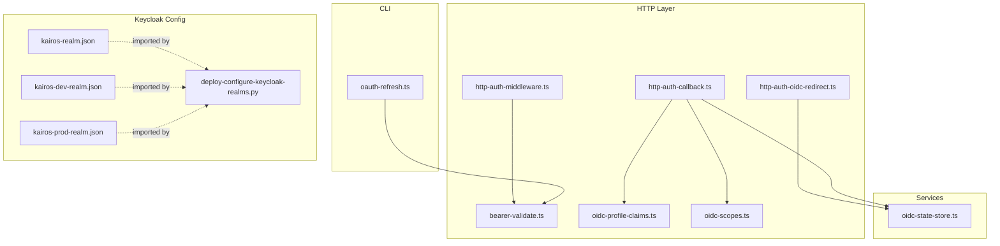
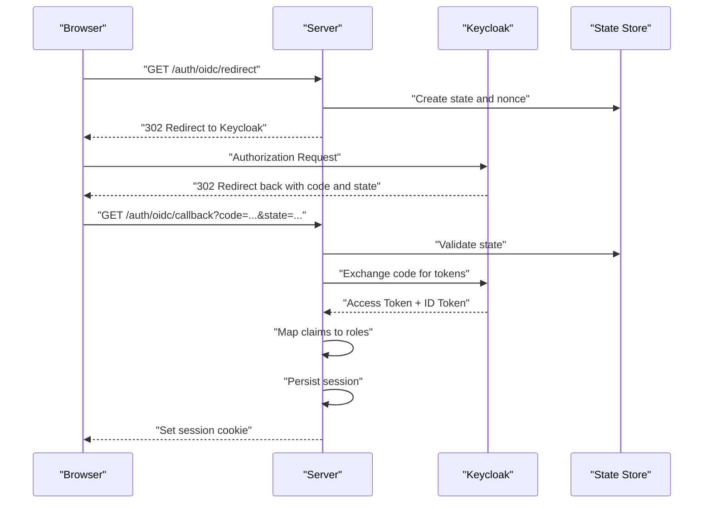
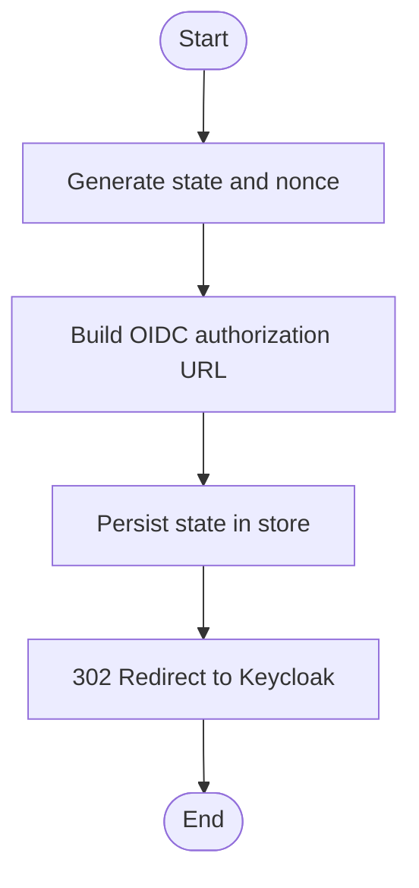
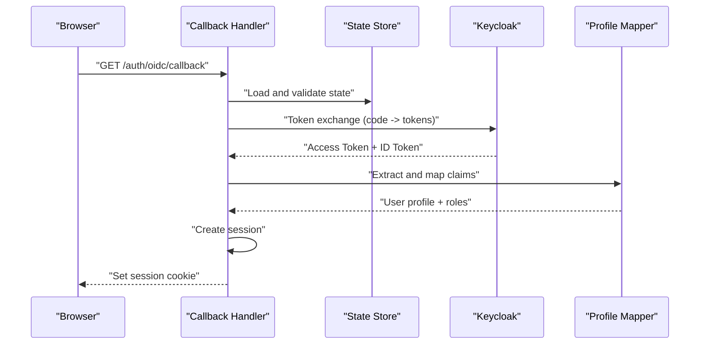
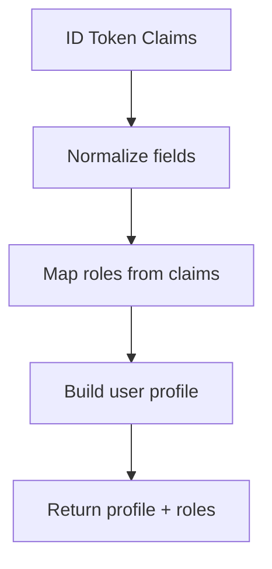
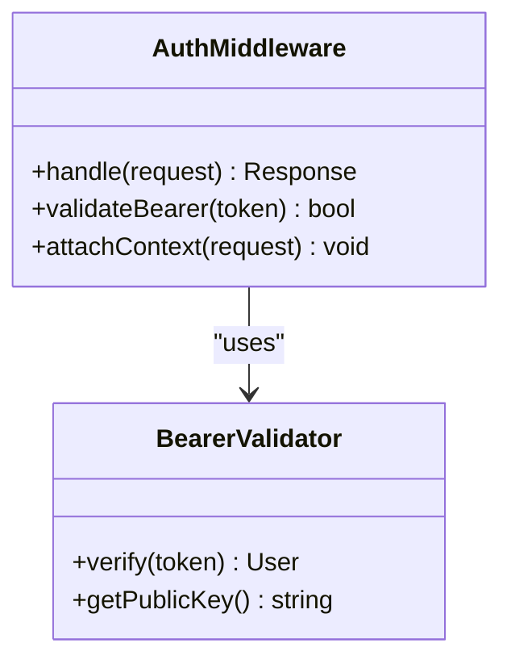
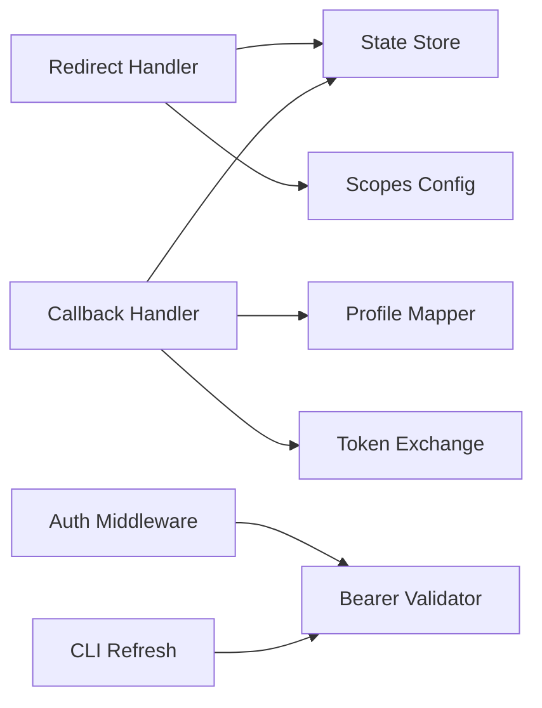

# OIDC Integration and Identity Management

<cite>
**Referenced Files in This Document**
- [http-auth-oidc-redirect.ts](file://src/http/http-auth-oidc-redirect.ts)
- [http-auth-callback.ts](file://src/http/http-auth-callback.ts)
- [oidc-state-store.ts](file://src/services/oidc-state-store.ts)
- [oidc-profile-claims.ts](file://src/http/oidc-profile-claims.ts)
- [oidc-scopes.ts](file://src/http/oidc-scopes.ts)
- [http-auth-middleware.ts](file://src/http/http-auth-middleware.ts)
- [bearer-validate.ts](file://src/http/bearer-validate.ts)
- [oauth-refresh.ts](file://src/cli/oauth-refresh.ts)
- [kairos-realm.json](file://helm/kairos-mcp/files/kairos-realm.json)
- [kairos-dev-realm.json](file://scripts/keycloak/import/kairos-dev-realm.json)
- [kairos-prod-realm.json](file://scripts/keycloak/import/kairos-prod-realm.json)
- [deploy-configure-keycloak-realms.py](file://scripts/deploy-configure-keycloak-realms.py)
- [auth-overview.md](file://docs/architecture/auth-overview.md)
</cite>

## Table of Contents
1. [Introduction](#introduction)
2. [Project Structure](#project-structure)
3. [Core Components](#core-components)
4. [Architecture Overview](#architecture-overview)
5. [Detailed Component Analysis](#detailed-component-analysis)
6. [Dependency Analysis](#dependency-analysis)
7. [Performance Considerations](#performance-considerations)
8. [Troubleshooting Guide](#troubleshooting-guide)
9. [Conclusion](#conclusion)
10. [Appendices](#appendices)

## Introduction
This document explains the OpenID Connect (OIDC) integration with Keycloak, covering the authorization code flow, token exchange, profile claim mapping, session state management, secure redirect handling, callback processing, role mapping from claims to application roles, session persistence strategies, configuration examples for Keycloak realms and clients, token refresh mechanisms, logout procedures, error handling, and security considerations including PKCE support, state validation, and CSRF protection.

## Project Structure
The OIDC implementation is primarily implemented in HTTP handlers and services:
- Redirect initiation and callback endpoints
- State store for OAuth sessions
- Profile claim extraction and mapping
- Scopes configuration
- Authentication middleware and bearer token validation
- CLI token refresh utilities
- Keycloak realm import files and deployment scripts

**Diagram sources**
- [http-auth-oidc-redirect.ts](file://src/http/http-auth-oidc-redirect.ts)
- [http-auth-callback.ts](file://src/http/http-auth-callback.ts)
- [oidc-state-store.ts](file://src/services/oidc-state-store.ts)
- [oidc-profile-claims.ts](file://src/http/oidc-profile-claims.ts)
- [oidc-scopes.ts](file://src/http/oidc-scopes.ts)
- [http-auth-middleware.ts](file://src/http/http-auth-middleware.ts)
- [bearer-validate.ts](file://src/http/bearer-validate.ts)
- [oauth-refresh.ts](file://src/cli/oauth-refresh.ts)
- [kairos-realm.json](file://helm/kairos-mcp/files/kairos-realm.json)
- [kairos-dev-realm.json](file://scripts/keycloak/import/kairos-dev-realm.json)
- [kairos-prod-realm.json](file://scripts/keycloak/import/kairos-prod-realm.json)
- [deploy-configure-keycloak-realms.py](file://scripts/deploy-configure-keycloak-realms.py)

**Section sources**
- [auth-overview.md](file://docs/architecture/auth-overview.md)

## Core Components
- Authorization Code Flow Initiation: Builds the OIDC authorization URL with required parameters and redirects the user agent to the identity provider.
- Callback Processing: Validates the incoming authorization response, exchanges the authorization code for tokens, validates state, and establishes a session.
- State Store: Persists transient OAuth state and related metadata during the authorization flow.
- Profile Claim Mapping: Extracts and normalizes user profile attributes from OIDC ID token claims.
- Scopes Configuration: Defines requested scopes for the OIDC client.
- Authentication Middleware: Enforces authentication on protected routes using bearer tokens or cookies.
- Bearer Token Validation: Validates access tokens issued by the identity provider.
- CLI Token Refresh: Supports refreshing tokens via CLI flows when needed.
- Keycloak Realm and Client Configuration: Provides realm JSON imports and deployment scripts to configure Keycloak consistently across environments.

**Section sources**
- [http-auth-oidc-redirect.ts](file://src/http/http-auth-oidc-redirect.ts)
- [http-auth-callback.ts](file://src/http/http-auth-callback.ts)
- [oidc-state-store.ts](file://src/services/oidc-state-store.ts)
- [oidc-profile-claims.ts](file://src/http/oidc-profile-claims.ts)
- [oidc-scopes.ts](file://src/http/oidc-scopes.ts)
- [http-auth-middleware.ts](file://src/http/http-auth-middleware.ts)
- [bearer-validate.ts](file://src/http/bearer-validate.ts)
- [oauth-refresh.ts](file://src/cli/oauth-refresh.ts)
- [kairos-realm.json](file://helm/kairos-mcp/files/kairos-realm.json)
- [kairos-dev-realm.json](file://scripts/keycloak/import/kairos-dev-realm.json)
- [kairos-prod-realm.json](file://scripts/keycloak/import/kairos-prod-realm.json)
- [deploy-configure-keycloak-realms.py](file://scripts/deploy-configure-keycloak-realms.py)

## Architecture Overview
The OIDC integration follows the standard authorization code flow with PKCE where applicable. The server initiates an authorization request, stores ephemeral state, processes the callback, exchanges the code for tokens, maps claims into application roles, and persists a session. Protected endpoints validate tokens via middleware.

**Diagram sources**
- [http-auth-oidc-redirect.ts](file://src/http/http-auth-oidc-redirect.ts)
- [http-auth-callback.ts](file://src/http/http-auth-callback.ts)
- [oidc-state-store.ts](file://src/services/oidc-state-store.ts)
- [oidc-profile-claims.ts](file://src/http/oidc-profile-claims.ts)
- [oidc-scopes.ts](file://src/http/oidc-scopes.ts)

## Detailed Component Analysis

### Authorization Code Flow Initiation
- Generates a unique state value and optional nonce for CSRF protection and ID token verification.
- Constructs the OIDC authorization URL with client ID, redirect URI, scope, response type, and PKCE parameters if enabled.
- Stores the state and associated metadata in the state store with expiration.
- Issues a 302 redirect to the Keycloak authorization endpoint.

**Diagram sources**
- [http-auth-oidc-redirect.ts](file://src/http/http-auth-oidc-redirect.ts)
- [oidc-state-store.ts](file://src/services/oidc-state-store.ts)
- [oidc-scopes.ts](file://src/http/oidc-scopes.ts)

**Section sources**
- [http-auth-oidc-redirect.ts](file://src/http/http-auth-oidc-redirect.ts)
- [oidc-state-store.ts](file://src/services/oidc-state-store.ts)
- [oidc-scopes.ts](file://src/http/oidc-scopes.ts)

### Callback Processing and Token Exchange
- Receives the authorization response containing code and state.
- Validates the state against the stored value to prevent CSRF attacks.
- Exchanges the authorization code for tokens at the token endpoint.
- Verifies the ID token signature and claims.
- Maps OIDC claims to application roles and constructs a user profile.
- Establishes a server-side session and sets a secure cookie.

**Diagram sources**
- [http-auth-callback.ts](file://src/http/http-auth-callback.ts)
- [oidc-state-store.ts](file://src/services/oidc-state-store.ts)
- [oidc-profile-claims.ts](file://src/http/oidc-profile-claims.ts)

**Section sources**
- [http-auth-callback.ts](file://src/http/http-auth-callback.ts)
- [oidc-state-store.ts](file://src/services/oidc-state-store.ts)
- [oidc-profile-claims.ts](file://src/http/oidc-profile-claims.ts)

### Profile Claim Mapping and Role Assignment
- Extracts standard and custom claims from the ID token.
- Normalizes email, name, and identifiers for consistent user profiles.
- Maps role-related claims to application roles based on configured mappings.
- Handles missing or malformed claims gracefully.

**Diagram sources**
- [oidc-profile-claims.ts](file://src/http/oidc-profile-claims.ts)

**Section sources**
- [oidc-profile-claims.ts](file://src/http/oidc-profile-claims.ts)

### Scopes Configuration
- Defines the set of OIDC scopes requested during authorization.
- Ensures minimal necessary privileges are requested.
- Can include custom scopes for extended claims if supported by Keycloak.

**Section sources**
- [oidc-scopes.ts](file://src/http/oidc-scopes.ts)

### Authentication Middleware and Bearer Validation
- Protects API routes by requiring valid authentication.
- Accepts bearer tokens or session cookies depending on route context.
- Validates tokens using the identity provider’s public keys or introspection endpoint.
- Attaches authenticated user context to requests.

**Diagram sources**
- [http-auth-middleware.ts](file://src/http/http-auth-middleware.ts)
- [bearer-validate.ts](file://src/http/bearer-validate.ts)

**Section sources**
- [http-auth-middleware.ts](file://src/http/http-auth-middleware.ts)
- [bearer-validate.ts](file://src/http/bearer-validate.ts)

### CLI Token Refresh Mechanism
- Supports refreshing tokens via CLI flows when long-running tasks require updated credentials.
- Uses stored refresh tokens or re-authentication prompts depending on configuration.
- Updates local token storage securely.

**Section sources**
- [oauth-refresh.ts](file://src/cli/oauth-refresh.ts)

### Logout Procedures
- Clears server-side session data and invalidates cookies.
- Optionally triggers a front-channel or back-channel logout with the identity provider.
- Ensures no residual tokens remain in memory or storage.

[No sources needed since this section provides general guidance]

### Error Handling for Authentication Failures
- Handles invalid state, mismatched nonces, and expired states.
- Manages token exchange failures and invalid responses from the identity provider.
- Returns appropriate HTTP status codes and safe error messages.
- Logs detailed diagnostics without exposing sensitive information.

**Section sources**
- [http-auth-callback.ts](file://src/http/http-auth-callback.ts)
- [bearer-validate.ts](file://src/http/bearer-validate.ts)

## Dependency Analysis
The OIDC components interact through well-defined interfaces:
- Redirect handler depends on state store and scopes configuration.
- Callback handler depends on state store, token exchange logic, and profile mapper.
- Middleware depends on bearer validator and session store.
- CLI refresh depends on bearer validator and token storage.

**Diagram sources**
- [http-auth-oidc-redirect.ts](file://src/http/http-auth-oidc-redirect.ts)
- [http-auth-callback.ts](file://src/http/http-auth-callback.ts)
- [oidc-state-store.ts](file://src/services/oidc-state-store.ts)
- [oidc-profile-claims.ts](file://src/http/oidc-profile-claims.ts)
- [oidc-scopes.ts](file://src/http/oidc-scopes.ts)
- [http-auth-middleware.ts](file://src/http/http-auth-middleware.ts)
- [bearer-validate.ts](file://src/http/bearer-validate.ts)
- [oauth-refresh.ts](file://src/cli/oauth-refresh.ts)

**Section sources**
- [http-auth-oidc-redirect.ts](file://src/http/http-auth-oidc-redirect.ts)
- [http-auth-callback.ts](file://src/http/http-auth-callback.ts)
- [oidc-state-store.ts](file://src/services/oidc-state-store.ts)
- [oidc-profile-claims.ts](file://src/http/oidc-profile-claims.ts)
- [oidc-scopes.ts](file://src/http/oidc-scopes.ts)
- [http-auth-middleware.ts](file://src/http/http-auth-middleware.ts)
- [bearer-validate.ts](file://src/http/bearer-validate.ts)
- [oauth-refresh.ts](file://src/cli/oauth-refresh.ts)

## Performance Considerations
- Minimize token endpoint calls by caching JWKS and validating tokens locally when possible.
- Use short-lived sessions and refresh tokens to reduce exposure windows.
- Avoid heavy claim transformations; precompute and cache role mappings where feasible.
- Ensure state store operations are fast and use appropriate TTLs to prevent memory growth.

[No sources needed since this section provides general guidance]

## Troubleshooting Guide
Common issues and resolutions:
- Invalid or expired state: Verify state generation and TTL settings in the state store.
- Mismatched nonces: Ensure nonce is included and validated for ID token checks.
- Token exchange failures: Check client credentials, redirect URIs, and network connectivity to Keycloak.
- Missing claims: Confirm Keycloak client mappers and scopes align with expected claims.
- Session not persisted: Inspect session store configuration and cookie settings.

**Section sources**
- [http-auth-callback.ts](file://src/http/http-auth-callback.ts)
- [oidc-state-store.ts](file://src/services/oidc-state-store.ts)
- [bearer-validate.ts](file://src/http/bearer-validate.ts)

## Conclusion
The OIDC integration with Keycloak implements a robust authorization code flow with strong state management, secure redirect handling, and comprehensive claim mapping. It supports token refresh, logout, and thorough error handling while adhering to security best practices such as PKCE and CSRF protection. Proper Keycloak realm and client configuration ensures consistent behavior across environments.

[No sources needed since this section summarizes without analyzing specific files]

## Appendices

### Keycloak Realm Setup and Client Registration
- Import realm definitions from JSON files to bootstrap Keycloak configuration.
- Configure client registration with correct redirect URIs, scopes, and PKCE settings.
- Use deployment scripts to automate realm and client setup across environments.

**Section sources**
- [kairos-realm.json](file://helm/kairos-mcp/files/kairos-realm.json)
- [kairos-dev-realm.json](file://scripts/keycloak/import/kairos-dev-realm.json)
- [kairos-prod-realm.json](file://scripts/keycloak/import/kairos-prod-realm.json)
- [deploy-configure-keycloak-realms.py](file://scripts/deploy-configure-keycloak-realms.py)

### Custom Claim Mappings
- Define custom mappers in Keycloak to expose application-specific attributes.
- Map group memberships or roles to claims consumed by the application.
- Validate that requested scopes include necessary claims.

**Section sources**
- [oidc-profile-claims.ts](file://src/http/oidc-profile-claims.ts)
- [oidc-scopes.ts](file://src/http/oidc-scopes.ts)

### Security Considerations
- Enable PKCE for all authorization requests to mitigate authorization code interception.
- Strictly validate state and nonce values to prevent CSRF and replay attacks.
- Set secure, HttpOnly, SameSite cookies for sessions.
- Restrict scopes to the minimum required for functionality.
- Rotate secrets and manage client credentials securely.

**Section sources**
- [http-auth-oidc-redirect.ts](file://src/http/http-auth-oidc-redirect.ts)
- [http-auth-callback.ts](file://src/http/http-auth-callback.ts)
- [oidc-state-store.ts](file://src/services/oidc-state-store.ts)