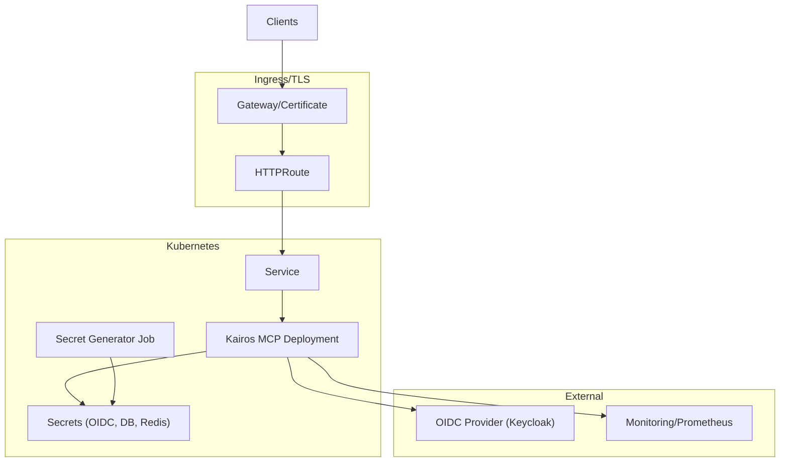
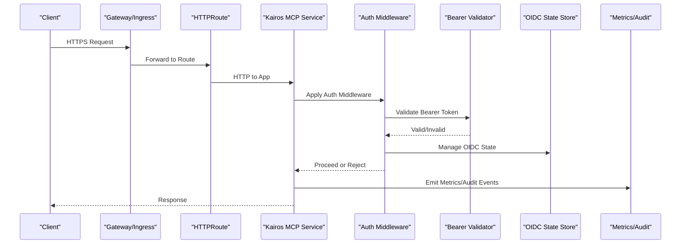
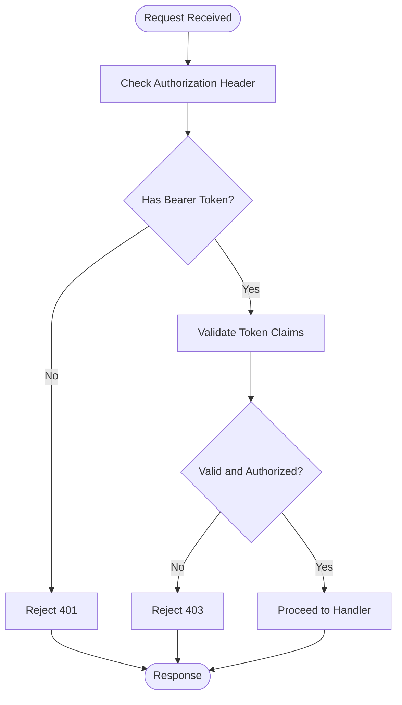
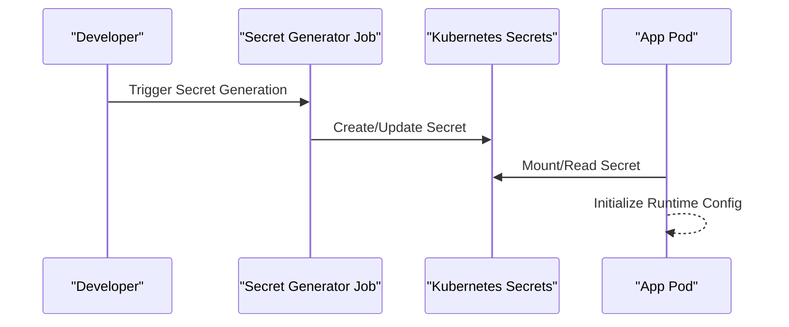
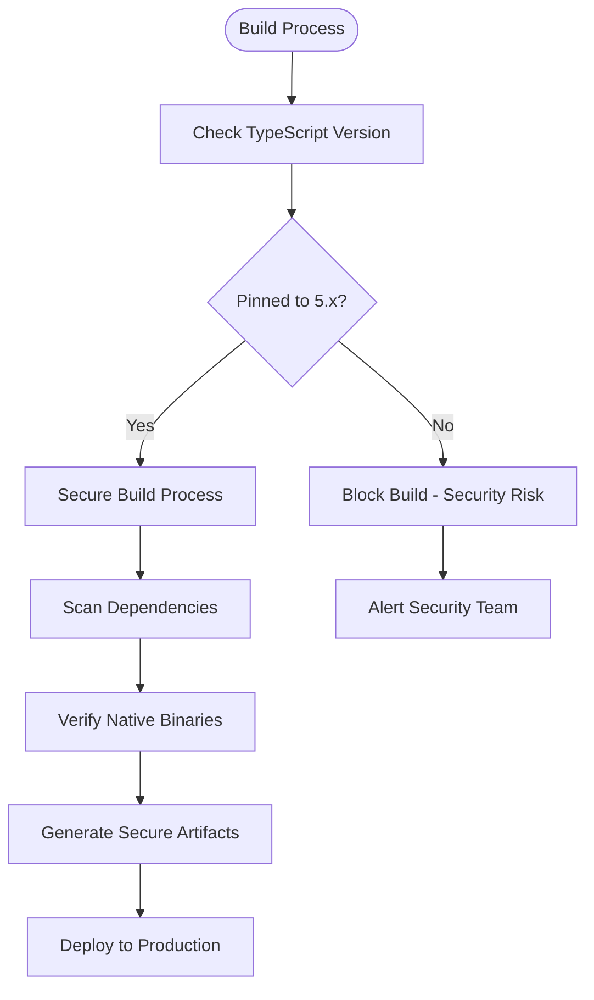

# Security Best Practices and Configuration

<cite>
**Referenced Files in This Document**
- [SECURITY.md](file://SECURITY.md)
- [Dockerfile](file://Dockerfile)
- [compose.yaml](file://compose.yaml)
- [package.json](file://package.json)
- [package-lock.json](file://package-lock.json)
- [.github/dependabot.yml](file://.github/dependabot.yml)
- [.trivyignore](file://.trivyignore)
- [helm/kairos-mcp/values.yaml](file://helm/kairos-mcp/values.yaml)
- [helm/kairos-mcp/templates/gateway-certificate.yaml](file://helm/kairos-mcp/templates/gateway-certificate.yaml)
- [helm/kairos-mcp/templates/httproute-mcp.yaml](file://helm/kairos-mcp/templates/httproute-mcp.yaml)
- [helm/kairos-mcp/templates/kairos-mcp-deployment.yaml](file://helm/kairos-mcp/templates/kairos-mcp-deployment.yaml)
- [helm/kairos-mcp/templates/credentials-secret-generator-job.yaml](file://helm/kairos-mcp/templates/credentials-secret-generator-job.yaml)
- [src/http/http-server-config.ts](file://src/http/http-server-config.ts)
- [src/http/http-auth-middleware.ts](file://src/http/http-auth-middleware.ts)
- [src/http/bearer-validate.ts](file://src/http/bearer-validate.ts)
- [src/http/http-mcp-cors.ts](file://src/http/http-mcp-cors.ts)
- [src/http/http-api-routes.ts](file://src/http/http-api-routes.ts)
- [src/http/http-health-routes.ts](file://src/http/http-health-routes.ts)
- [src/http/http-well-known.ts](file://src/http/http-well-known.ts)
- [src/services/oidc-state-store.ts](file://src/services/oidc-state-store.ts)
- [src/utils/audit-log-events.ts](file://src/utils/audit-log-events.ts)
- [src/utils/structured-logger.ts](file://src/utils/structured-logger.ts)
- [scripts/deploy-generate-dev-secrets.py](file://scripts/deploy-generate-dev-secrets.py)
- [docs/security/incident-runbook.md](file://docs/security/incident-runbook.md)
</cite>

## Update Summary
**Changes Made**
- Updated dependency security section to reflect TypeScript 5.x pinning addressing CVE-2026-39822 vulnerability
- Enhanced supply chain security guidance with specific focus on native binary vulnerabilities
- Added new section on build toolchain security and dependency pinning strategies
- Updated vulnerability assessment procedures to include native binary scanning

## Table of Contents
1. Introduction
2. Project Structure
3. Core Components
4. Architecture Overview
5. Detailed Component Analysis
6. Dependency Security and Supply Chain Protection
7. Performance Considerations
8. Troubleshooting Guide
9. Conclusion
10. Appendices

## Introduction
This document provides a comprehensive security best practices guide for deploying Kairos MCP in production. It covers TLS/HTTPS configuration, CORS policies, request validation, secret management, environment variable security, credential rotation, network and container hardening, vulnerability assessment, dependency scanning, monitoring, Kubernetes deployment patterns, service mesh integration, zero-trust principles, performance-security trade-offs, rate limiting, DDoS mitigation, production readiness checklists, incident response procedures, and security testing methodologies.

## Project Structure
Kairos MCP exposes an HTTP API and MCP endpoints with OIDC-based authentication, structured logging, audit events, and Helm-based Kubernetes deployment. Key security-relevant areas include:
- HTTP server configuration and middleware (TLS termination at ingress, CORS, auth)
- OIDC state handling and bearer token validation
- Secret generation and injection via Helm jobs
- Audit logging and metrics
- Container image and CI/CD security tooling
- **Updated**: Secure dependency management with pinned TypeScript versions addressing native binary vulnerabilities

**Diagram sources**
- [helm/kairos-mcp/templates/gateway-certificate.yaml](file://helm/kairos-mcp/templates/gateway-certificate.yaml)
- [helm/kairos-mcp/templates/httproute-mcp.yaml](file://helm/kairos-mcp/templates/httproute-mcp.yaml)
- [helm/kairos-mcp/templates/kairos-mcp-deployment.yaml](file://helm/kairos-mcp/templates/kairos-mcp-deployment.yaml)
- [helm/kairos-mcp/templates/credentials-secret-generator-job.yaml](file://helm/kairos-mcp/templates/credentials-secret-generator-job.yaml)

**Section sources**
- [helm/kairos-mcp/values.yaml](file://helm/kairos-mcp/values.yaml)
- [helm/kairos-mcp/templates/gateway-certificate.yaml](file://helm/kairos-mcp/templates/gateway-certificate.yaml)
- [helm/kairos-mcp/templates/httproute-mcp.yaml](file://helm/kairos-mcp/templates/httproute-mcp.yaml)
- [helm/kairos-mcp/templates/kairos-mcp-deployment.yaml](file://helm/kairos-mcp/templates/kairos-mcp-deployment.yaml)
- [helm/kairos-mcp/templates/credentials-secret-generator-job.yaml](file://helm/kairos-mcp/templates/credentials-secret-generator-job.yaml)

## Core Components
- HTTP server configuration and startup
- Authentication middleware and bearer token validation
- CORS policy for MCP endpoints
- Health and well-known endpoints
- OIDC state store
- Structured logging and audit event emission
- Secret generator job for runtime secrets
- **Updated**: Secure build toolchain with pinned TypeScript dependencies

Security responsibilities are distributed across these components to enforce least privilege, validate inputs, and ensure secure transport and identity verification.

**Section sources**
- [src/http/http-server-config.ts](file://src/http/http-server-config.ts)
- [src/http/http-auth-middleware.ts](file://src/http/http-auth-middleware.ts)
- [src/http/bearer-validate.ts](file://src/http/bearer-validate.ts)
- [src/http/http-mcp-cors.ts](file://src/http/http-mcp-cors.ts)
- [src/http/http-health-routes.ts](file://src/http/http-health-routes.ts)
- [src/http/http-well-known.ts](file://src/http/http-well-known.ts)
- [src/services/oidc-state-store.ts](file://src/services/oidc-state-store.ts)
- [src/utils/audit-log-events.ts](file://src/utils/audit-log-events.ts)
- [src/utils/structured-logger.ts](file://src/utils/structured-logger.ts)
- [helm/kairos-mcp/templates/credentials-secret-generator-job.yaml](file://helm/kairos-mcp/templates/credentials-secret-generator-job.yaml)

## Architecture Overview
The recommended production architecture terminates TLS at the gateway/ingress layer, enforces strict CORS for MCP routes, validates OIDC tokens via middleware, and emits audit logs and metrics. Secrets are generated and injected securely into pods. Build processes use pinned dependencies to prevent supply chain attacks through compromised native binaries.

**Diagram sources**
- [helm/kairos-mcp/templates/httproute-mcp.yaml](file://helm/kairos-mcp/templates/httproute-mcp.yaml)
- [src/http/http-auth-middleware.ts](file://src/http/http-auth-middleware.ts)
- [src/http/bearer-validate.ts](file://src/http/bearer-validate.ts)
- [src/services/oidc-state-store.ts](file://src/services/oidc-state-store.ts)
- [src/utils/audit-log-events.ts](file://src/utils/audit-log-events.ts)
- [src/utils/structured-logger.ts](file://src/utils/structured-logger.ts)

## Detailed Component Analysis

### TLS/HTTPS and Ingress Termination
- Terminate TLS at the gateway using managed certificates.
- Configure HTTPRoute to forward only HTTPS traffic to the application.
- Ensure the application does not accept plaintext on public ports; rely on internal cluster networking.

Operational guidance:
- Use short-lived certificates and automated renewal.
- Restrict allowed ciphers and protocols at the gateway.
- Enforce HSTS via gateway headers where supported.

**Section sources**
- [helm/kairos-mcp/templates/gateway-certificate.yaml](file://helm/kairos-mcp/templates/gateway-certificate.yaml)
- [helm/kairos-mcp/templates/httproute-mcp.yaml](file://helm/kairos-mcp/templates/httproute-mcp.yaml)

### CORS Policies for MCP Endpoints
- Define explicit allow-lists for origins, methods, and headers.
- Avoid wildcard origins in production.
- Keep CORS minimal and scoped to required MCP UI resources.

**Section sources**
- [src/http/http-mcp-cors.ts](file://src/http/http-mcp-cors.ts)

### Request Validation and Input Sanitization
- Validate all incoming requests early in the middleware stack.
- Enforce content-type and size limits.
- Normalize and sanitize paths and payloads before processing.

**Section sources**
- [src/http/http-api-routes.ts](file://src/http/http-api-routes.ts)
- [src/http/http-auth-middleware.ts](file://src/http/http-auth-middleware.ts)

### Authentication and Authorization
- Use OIDC for user and machine identities.
- Validate bearer tokens with strict checks (signature, issuer, audience, expiry).
- Maintain OIDC state securely and rotate state secrets regularly.

**Diagram sources**
- [src/http/http-auth-middleware.ts](file://src/http/http-auth-middleware.ts)
- [src/http/bearer-validate.ts](file://src/http/bearer-validate.ts)
- [src/services/oidc-state-store.ts](file://src/services/oidc-state-store.ts)

**Section sources**
- [src/http/http-auth-middleware.ts](file://src/http/http-auth-middleware.ts)
- [src/http/bearer-validate.ts](file://src/http/bearer-validate.ts)
- [src/services/oidc-state-store.ts](file://src/services/oidc-state-store.ts)

### Secret Management and Credential Rotation
- Generate secrets via a dedicated job and inject them as Kubernetes Secrets.
- Rotate credentials by updating secrets and rolling deployments.
- Avoid embedding secrets in images or configs; use environment variables from Secrets.

**Diagram sources**
- [helm/kairos-mcp/templates/credentials-secret-generator-job.yaml](file://helm/kairos-mcp/templates/credentials-secret-generator-job.yaml)
- [helm/kairos-mcp/templates/kairos-mcp-deployment.yaml](file://helm/kairos-mcp/templates/kairos-mcp-deployment.yaml)

**Section sources**
- [helm/kairos-mcp/templates/credentials-secret-generator-job.yaml](file://helm/kairos-mcp/templates/credentials-secret-generator-job.yaml)
- [helm/kairos-mcp/templates/kairos-mcp-deployment.yaml](file://helm/kairos-mcp/templates/kairos-mcp-deployment.yaml)
- [scripts/deploy-generate-dev-secrets.py](file://scripts/deploy-generate-dev-secrets.py)

### Network Security and Firewall Rules
- Restrict inbound access to the gateway only.
- Allow inter-service communication within the cluster namespace.
- Block direct pod-to-external egress unless explicitly required.

Operational guidance:
- Use NetworkPolicies to limit traffic between namespaces.
- Enable mTLS at the service mesh layer if available.

### Container Security Hardening
- Build minimal images and remove unnecessary packages.
- Run as non-root with read-only root filesystem where possible.
- Drop capabilities and set resource limits.

**Section sources**
- [Dockerfile](file://Dockerfile)

### Vulnerability Assessment and Dependency Scanning
- Integrate container scanning (e.g., Trivy) in CI.
- Use Dependabot/Renovate for dependency updates.
- Maintain ignore lists with justification and review cadence.
- **Updated**: Pin critical build tools like TypeScript to specific major versions to address native binary vulnerabilities such as CVE-2026-39822.

**Section sources**
- [.github/dependabot.yml](file://.github/dependabot.yml)
- [.trivyignore](file://.trivyignore)

### Security Monitoring and Observability
- Expose health endpoints for liveness/readiness probes.
- Emit structured logs and audit events for sensitive operations.
- Collect metrics for anomaly detection and alerting.

**Section sources**
- [src/http/http-health-routes.ts](file://src/http/http-health-routes.ts)
- [src/utils/audit-log-events.ts](file://src/utils/audit-log-events.ts)
- [src/utils/structured-logger.ts](file://src/utils/structured-logger.ts)
- [src/http/http-well-known.ts](file://src/http/http-well-known.ts)

### Secure Deployment Patterns for Kubernetes
- Use Helm values to configure TLS, OIDC, and feature flags per environment.
- Separate dev/staging/prod values files and enforce RBAC.
- Prefer immutable artifacts and signed images.

**Section sources**
- [helm/kairos-mcp/values.yaml](file://helm/kairos-mcp/values.yaml)

### Service Mesh Integration and Zero-Trust Principles
- Enable mutual TLS between services.
- Enforce identity-based access control and least privilege.
- Route traffic through sidecars for observability and policy enforcement.

### Rate Limiting and DDoS Mitigation
- Implement rate limiting at the gateway and/or application level.
- Use adaptive throttling for expensive operations (e.g., training, export).
- Combine with WAF rules and IP reputation filtering at the edge.

### Production Readiness Checklist
- TLS enabled and validated end-to-end.
- CORS restricted to known origins.
- OIDC configured with strict scopes and audiences.
- Secrets rotated and audited.
- Health and readiness probes passing.
- Logging and audit trails enabled.
- Vulnerability scans clean and dependencies up to date.
- **Updated**: Build toolchain dependencies pinned to secure versions (TypeScript 5.x).
- Resource limits and quotas applied.
- Backup and disaster recovery tested.

### Incident Response Procedures
- Define runbooks for key scenarios (token compromise, data exfiltration, DoS).
- Centralize alerts and integrate with ticketing systems.
- Preserve evidence and maintain chain-of-custody for logs.

**Section sources**
- [docs/security/incident-runbook.md](file://docs/security/incident-runbook.md)

### Security Testing Methodologies
- Unit tests for auth flows and input validation.
- Integration tests for OIDC login and token validation.
- Load tests to validate rate limiting and resilience.
- Adversarial input tests for parsers and serializers.

## Dependency Security and Supply Chain Protection

### Critical Dependency Pinning Strategy
Kairos MCP implements a comprehensive dependency security strategy that addresses both JavaScript package vulnerabilities and native binary supply chain risks. The most significant recent enhancement involves pinning TypeScript to version 5.x to address CVE-2026-39822, a vulnerability in the native tsc Go binary that could enable supply chain attacks.

**Updated** Implementation of TypeScript 5.x pinning eliminates the attack surface associated with uncontrolled native binary compilation during builds.

### Native Binary Vulnerability Mitigation
The CVE-2026-39822 vulnerability specifically affects the native TypeScript compiler binary, which is written in Go. This vulnerability could potentially be exploited during the build process to inject malicious code into compiled outputs. By pinning to TypeScript 5.x, we eliminate this risk while maintaining full compatibility with existing codebases.

### Build Toolchain Security
Build toolchains represent a critical attack vector in modern software development. The following measures are implemented:

- **Version Pinning**: Critical build tools (TypeScript, Node.js) are pinned to specific major versions
- **Lock File Integrity**: package-lock.json ensures reproducible builds with verified checksums
- **Supply Chain Scanning**: Automated scanning of both runtime and build-time dependencies
- **Binary Verification**: Where possible, verify cryptographic signatures of downloaded binaries

**Diagram sources**
- [package.json](file://package.json)
- [package-lock.json](file://package-lock.json)

### Dependency Management Best Practices
- **Major Version Locking**: Pin major versions of critical dependencies to prevent breaking changes and security regressions
- **Automated Updates**: Use Dependabot for minor and patch updates with manual review for major version bumps
- **Vulnerability Scanning**: Integrate Trivy and other scanners in CI/CD pipeline
- **Audit Reports**: Generate regular dependency audit reports for compliance and security reviews

### Supply Chain Attack Prevention
The updated security posture addresses multiple layers of supply chain risk:

1. **Build-Time Attacks**: Prevented through pinned TypeScript versions and verified lock files
2. **Runtime Dependencies**: Scanned and monitored for known vulnerabilities
3. **Native Binary Risks**: Mitigated by avoiding dynamic compilation and using pre-built binaries
4. **Third-Party Integrations**: Vetted and version-controlled through dependency manifests

**Section sources**
- [package.json](file://package.json)
- [package-lock.json](file://package-lock.json)
- [.github/dependabot.yml](file://.github/dependabot.yml)

## Performance Considerations
- Balance strict validation with latency; cache OIDC metadata and JWKS where safe.
- Use connection pooling and timeouts for downstream services.
- Profile and monitor CPU/memory usage under load; tune concurrency limits.
- **Updated**: Pinned dependencies reduce build time variability and improve reproducibility.

## Troubleshooting Guide
Common issues and mitigations:
- TLS handshake failures: verify certificate chains and gateway config.
- CORS errors: confirm origin allow-list and preflight responses.
- 401/403 responses: inspect token claims, issuer, and audience settings.
- High error rates: correlate with audit logs and metrics.
- **Updated**: Build failures due to dependency conflicts: verify package-lock.json integrity and TypeScript version alignment.

## Conclusion
Adopting these practices ensures secure, resilient, and observable Kairos MCP deployments. Prioritize strong identity verification, least-privilege access, encrypted transport, continuous scanning, and robust monitoring. The recent enhancement of pinning TypeScript to version 5.x addresses critical supply chain vulnerabilities while maintaining full compatibility. Regularly test and rehearse incident response to maintain operational security posture.

## Appendices

### Security Policy and Reporting
Report vulnerabilities according to the project's security policy.

**Section sources**
- [SECURITY.md](file://SECURITY.md)

### Local Development and Compose
Use compose for local development with isolated networks and minimal exposure.

**Section sources**
- [compose.yaml](file://compose.yaml)

### Dependency Security Configuration
The following configuration files implement the enhanced dependency security posture:

**Section sources**
- [package.json](file://package.json)
- [package-lock.json](file://package-lock.json)
- [.github/dependabot.yml](file://.github/dependabot.yml)
- [.trivyignore](file://.trivyignore)