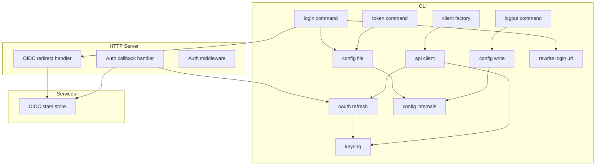
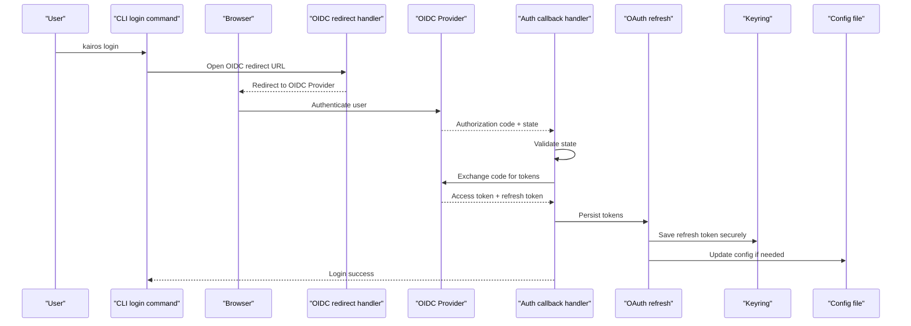
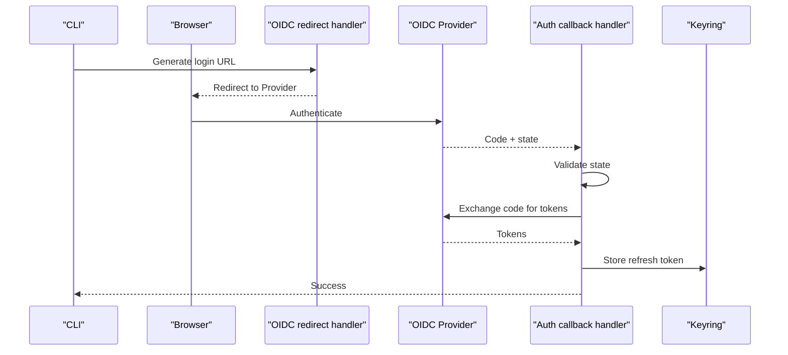
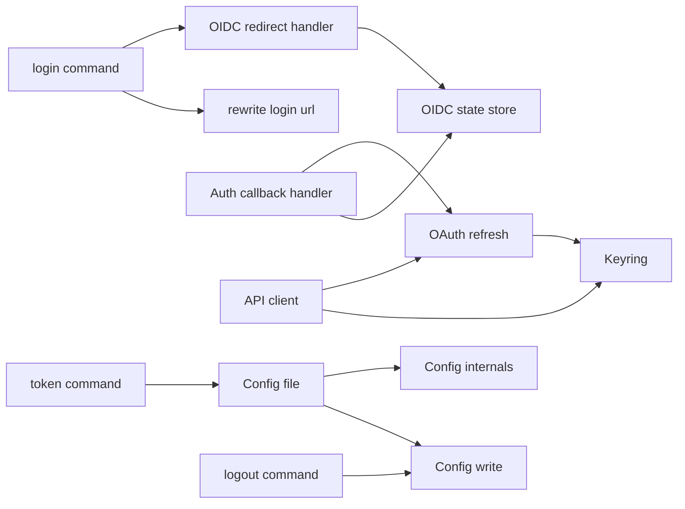

# Authentication and Credentials

<cite>
**Referenced Files in This Document**
- [src/cli/auth-error.ts](file://src/cli/auth-error.ts)
- [src/cli/keyring.ts](file://src/cli/keyring.ts)
- [src/cli/oauth-refresh.ts](file://src/cli/oauth-refresh.ts)
- [src/cli/rewrite-login-url.ts](file://src/cli/rewrite-login-url.ts)
- [src/cli/config-file.ts](file://src/cli/config-file.ts)
- [src/cli/config-file-write.ts](file://src/cli/config-file-write.ts)
- [src/cli/config-file-internals.ts](file://src/cli/config-file-internals.ts)
- [src/cli/api-client.ts](file://src/cli/api-client.ts)
- [src/cli/client-factory.ts](file://src/cli/client-factory.ts)
- [src/cli/commands/login.ts](file://src/cli/commands/login.ts)
- [src/cli/commands/logout.ts](file://src/cli/commands/logout.ts)
- [src/cli/commands/token.ts](file://src/cli/commands/token.ts)
- [src/http/http-auth-callback.ts](file://src/http/http-auth-callback.ts)
- [src/http/http-auth-middleware.ts](file://src/http/http-auth-middleware.ts)
- [src/http/http-auth-oidc-redirect.ts](file://src/http/http-auth-oidc-redirect.ts)
- [src/services/oidc-state-store.ts](file://src/services/oidc-state-store.ts)
- [tests/integration/cli-auth-browser-login.e2e.test.ts](file://tests/integration/cli-auth-browser-login.e2e.test.ts)
- [tests/unit/oauth-refresh.test.ts](file://tests/unit/oauth-refresh.test.ts)
</cite>

## Update Summary
**Changes Made**
- Updated timeout handling documentation to reflect 30-second AbortController timeouts for login and token refresh operations
- Enhanced keyring operation reliability documentation with 10-second timeouts and timer leak fixes
- Added troubleshooting guidance for persistent login hangs on macOS systems
- Updated performance considerations section with timeout-related recommendations

## Table of Contents
1. [Introduction](#introduction)
2. [Project Structure](#project-structure)
3. [Core Components](#core-components)
4. [Architecture Overview](#architecture-overview)
5. [Detailed Component Analysis](#detailed-component-analysis)
6. [Dependency Analysis](#dependency-analysis)
7. [Performance Considerations](#performance-considerations)
8. [Troubleshooting Guide](#troubleshooting-guide)
9. [Conclusion](#conclusion)
10. [Appendices](#appendices)

## Introduction
This document explains how the Kairos MCP CLI authenticates users and manages credentials. It covers:
- Keyring integration for secure credential storage
- OAuth2/OIDC browser-based login flow
- Token refresh mechanisms
- Service account usage and multi-environment scenarios
- Error handling, retry logic, and troubleshooting
- Automation in CI/CD pipelines and credential rotation strategies
- Security best practices for tokens and secrets across environments

## Project Structure
The authentication-related code is primarily located under src/cli and src/http, with supporting services and tests:
- CLI commands: login, logout, token management
- Auth utilities: keyring, OIDC state store, OAuth refresh, URL rewriting
- HTTP server components: OIDC redirect and callback handlers, auth middleware
- Configuration persistence: config file read/write and internals
- Tests: unit and integration covering refresh and browser login flows

**Diagram sources**
- [src/cli/commands/login.ts](file://src/cli/commands/login.ts)
- [src/cli/commands/logout.ts](file://src/cli/commands/logout.ts)
- [src/cli/commands/token.ts](file://src/cli/commands/token.ts)
- [src/cli/api-client.ts](file://src/cli/api-client.ts)
- [src/cli/client-factory.ts](file://src/cli/client-factory.ts)
- [src/cli/keyring.ts](file://src/cli/keyring.ts)
- [src/cli/oauth-refresh.ts](file://src/cli/oauth-refresh.ts)
- [src/cli/config-file.ts](file://src/cli/config-file.ts)
- [src/cli/config-file-write.ts](file://src/cli/config-file-write.ts)
- [src/cli/config-file-internals.ts](file://src/cli/config-file-internals.ts)
- [src/cli/rewrite-login-url.ts](file://src/cli/rewrite-login-url.ts)
- [src/http/http-auth-oidc-redirect.ts](file://src/http/http-auth-oidc-redirect.ts)
- [src/http/http-auth-callback.ts](file://src/http/http-auth-callback.ts)
- [src/http/http-auth-middleware.ts](file://src/http/http-auth-middleware.ts)
- [src/services/oidc-state-store.ts](file://src/services/oidc-state-store.ts)

**Section sources**
- [src/cli/commands/login.ts](file://src/cli/commands/login.ts)
- [src/cli/commands/logout.ts](file://src/cli/commands/logout.ts)
- [src/cli/commands/token.ts](file://src/cli/commands/token.ts)
- [src/cli/api-client.ts](file://src/cli/api-client.ts)
- [src/cli/client-factory.ts](file://src/cli/client-factory.ts)
- [src/cli/keyring.ts](file://src/cli/keyring.ts)
- [src/cli/oauth-refresh.ts](file://src/cli/oauth-refresh.ts)
- [src/cli/config-file.ts](file://src/cli/config-file.ts)
- [src/cli/config-file-write.ts](file://src/cli/config-file-write.ts)
- [src/cli/config-file-internals.ts](file://src/cli/config-file-internals.ts)
- [src/cli/rewrite-login-url.ts](file://src/cli/rewrite-login-url.ts)
- [src/http/http-auth-oidc-redirect.ts](file://src/http/http-auth-oidc-redirect.ts)
- [src/http/http-auth-callback.ts](file://src/http/http-auth-callback.ts)
- [src/http/http-auth-middleware.ts](file://src/http/http-auth-middleware.ts)
- [src/services/oidc-state-store.ts](file://src/services/oidc-state-store.ts)

## Core Components
- Keyring: Securely stores and retrieves sensitive tokens using the platform's native keychain where available.
- OAuth Refresh: Implements token refresh against the OIDC provider, including error handling and backoff.
- OIDC State Store: Manages transient state required for the authorization code flow (state, nonce).
- Config File: Persists user configuration, including environment selection and cached tokens when appropriate.
- API Client: Attaches bearer tokens to requests and triggers refresh on 401 responses.
- Login/Logout Commands: Orchestrate browser-based login and cleanup of local credentials.
- OIDC Redirect and Callback Handlers: Provide the server endpoints used by the browser-based login flow.
- Auth Middleware: Validates incoming requests and enforces authentication requirements.
- Rewrite Login URL: Adjusts login URLs based on environment or proxy settings.

**Section sources**
- [src/cli/keyring.ts](file://src/cli/keyring.ts)
- [src/cli/oauth-refresh.ts](file://src/cli/oauth-refresh.ts)
- [src/services/oidc-state-store.ts](file://src/services/oidc-state-store.ts)
- [src/cli/config-file.ts](file://src/cli/config-file.ts)
- [src/cli/config-file-write.ts](file://src/cli/config-file-write.ts)
- [src/cli/config-file-internals.ts](file://src/cli/config-file-internals.ts)
- [src/cli/api-client.ts](file://src/cli/api-client.ts)
- [src/cli/client-factory.ts](file://src/cli/client-factory.ts)
- [src/cli/commands/login.ts](file://src/cli/commands/login.ts)
- [src/cli/commands/logout.ts](file://src/cli/commands/logout.ts)
- [src/cli/commands/token.ts](file://src/cli/commands/token.ts)
- [src/http/http-auth-oidc-redirect.ts](file://src/http/http-auth-oidc-redirect.ts)
- [src/http/http-auth-callback.ts](file://src/http/http-auth-callback.ts)
- [src/http/http-auth-middleware.ts](file://src/http/http-auth-middleware.ts)
- [src/cli/rewrite-login-url.ts](file://src/cli/rewrite-login-url.ts)

## Architecture Overview
The CLI uses an OIDC Authorization Code flow with PKCE-like state management via the server. The user opens a browser, logs in, and the server exchanges the code for tokens. Tokens are stored securely and reused until expiration, at which point they are refreshed automatically.

**Diagram sources**
- [src/cli/commands/login.ts](file://src/cli/commands/login.ts)
- [src/http/http-auth-oidc-redirect.ts](file://src/http/http-auth-oidc-redirect.ts)
- [src/http/http-auth-callback.ts](file://src/http/http-auth-callback.ts)
- [src/cli/oauth-refresh.ts](file://src/cli/oauth-refresh.ts)
- [src/cli/keyring.ts](file://src/cli/keyring.ts)
- [src/cli/config-file.ts](file://src/cli/config-file.ts)

## Detailed Component Analysis

### Keyring Integration
Purpose:
- Provides secure storage for sensitive values such as refresh tokens.
- Abstracts platform-specific keychain access to ensure consistent behavior across OSes.

Behavior:
- Stores tokens under well-known keys associated with the current environment.
- Returns errors when the keychain is unavailable or locked, allowing graceful fallbacks.

Security considerations:
- Avoid storing long-lived tokens in plaintext files.
- Prefer short-lived access tokens in memory and refresh tokens in the keyring.

**Updated** Enhanced reliability with 10-second timeouts for all keyring operations and fixed timer leak issues to prevent resource exhaustion.

**Section sources**
- [src/cli/keyring.ts](file://src/cli/keyring.ts)

### OAuth Refresh Mechanism
Purpose:
- Extends session lifetime by refreshing access tokens using stored refresh tokens.
- Handles provider errors, network failures, and token revocation.

Flow:
- On 401 Unauthorized, the API client attempts a refresh.
- If refresh succeeds, the request is retried with the new access token.
- If refresh fails, the CLI prompts re-authentication or falls back to service account mode.

Retry strategy:
- Exponential backoff with jitter for transient errors.
- Limited number of retries to avoid infinite loops.

**Updated** Now includes 30-second AbortController timeouts for token refresh operations to prevent hanging during network issues or provider unavailability.

**Section sources**
- [src/cli/oauth-refresh.ts](file://src/cli/oauth-refresh.ts)
- [src/cli/api-client.ts](file://src/cli/api-client.ts)
- [tests/unit/oauth-refresh.test.ts](file://tests/unit/oauth-refresh.test.ts)

### OIDC State Store
Purpose:
- Maintains transient state for the authorization code flow (state, nonce).
- Ensures CSRF protection by validating state on callback.

Lifecycle:
- Created during login initiation.
- Validated and consumed during callback processing.
- Purged after successful exchange.

**Section sources**
- [src/services/oidc-state-store.ts](file://src/services/oidc-state-store.ts)

### Config File Management
Purpose:
- Persists environment selection, base URLs, and optional cached tokens.
- Supports multiple profiles/environments for different deployments.

Operations:
- Read configuration from disk.
- Write updated configuration safely with atomic writes.
- Internals provide shared parsing/validation helpers.

Best practices:
- Do not commit secrets; use environment variables or keyring-backed values.
- Keep per-environment configurations separate and minimal.

**Section sources**
- [src/cli/config-file.ts](file://src/cli/config-file.ts)
- [src/cli/config-file-write.ts](file://src/cli/config-file-write.ts)
- [src/cli/config-file-internals.ts](file://src/cli/config-file-internals.ts)

### API Client and Client Factory
Purpose:
- Centralizes HTTP interactions with the Kairos API.
- Attaches bearer tokens and handles automatic refresh on 401.

Responsibilities:
- Construct headers with access tokens.
- Trigger refresh when necessary.
- Surface meaningful errors to the CLI layer.

Factory:
- Creates configured clients per environment or profile.

**Section sources**
- [src/cli/api-client.ts](file://src/cli/api-client.ts)
- [src/cli/client-factory.ts](file://src/cli/client-factory.ts)

### Login Command
Purpose:
- Initiates browser-based OIDC login.
- Rewrites login URLs for different environments or proxies.
- Waits for callback completion and confirms success.

Flow:
- Builds OIDC redirect URL.
- Opens browser.
- Listens for callback result.
- Persists tokens and updates config.

**Updated** Now implements 30-second AbortController timeouts for login operations to address persistent login hangs, particularly on macOS systems.

**Section sources**
- [src/cli/commands/login.ts](file://src/cli/commands/login.ts)
- [src/cli/rewrite-login-url.ts](file://src/cli/rewrite-login-url.ts)

### Logout Command
Purpose:
- Removes locally stored credentials and clears active sessions.
- Optionally invalidates server-side sessions if supported.

**Section sources**
- [src/cli/commands/logout.ts](file://src/cli/commands/logout.ts)

### Token Command
Purpose:
- Displays or rotates tokens for debugging and automation.
- Can export tokens for non-interactive contexts when explicitly requested.

Usage:
- Inspect current token status.
- Force refresh or rotate tokens.

**Section sources**
- [src/cli/commands/token.ts](file://src/cli/commands/token.ts)

### OIDC Redirect and Callback Handlers
Redirect Handler:
- Generates OIDC authorization URL with state and nonce.
- Redirects the browser to the OIDC provider.

Callback Handler:
- Validates state and nonce.
- Exchanges authorization code for tokens.
- Persists tokens and returns success to the CLI.

**Section sources**
- [src/http/http-auth-oidc-redirect.ts](file://src/http/http-auth-oidc-redirect.ts)
- [src/http/http-auth-callback.ts](file://src/http/http-auth-callback.ts)

### Auth Middleware
Purpose:
- Enforces authentication on protected routes.
- Validates bearer tokens and maps claims to context.

Behavior:
- Rejects unauthenticated requests with clear WWW-Authenticate challenges.
- Integrates with OIDC scopes and claims validation.

**Section sources**
- [src/http/http-auth-middleware.ts](file://src/http/http-auth-middleware.ts)

### Browser-Based Login Flow
End-to-end sequence:
- CLI constructs login URL and opens browser.
- User authenticates with OIDC provider.
- Provider redirects back to the server callback.
- Server validates state and exchanges code for tokens.
- Tokens are stored securely and returned to CLI.

**Diagram sources**
- [src/cli/commands/login.ts](file://src/cli/commands/login.ts)
- [src/http/http-auth-oidc-redirect.ts](file://src/http/http-auth-oidc-redirect.ts)
- [src/http/http-auth-callback.ts](file://src/http/http-auth-callback.ts)
- [src/cli/keyring.ts](file://src/cli/keyring.ts)

**Section sources**
- [tests/integration/cli-auth-browser-login.e2e.test.ts](file://tests/integration/cli-auth-browser-login.e2e.test.ts)

### Multi-Environment Authentication
Concept:
- Use distinct environments (dev, staging, prod) with separate OIDC providers and realms.
- Maintain per-environment configuration and tokens.

Implementation:
- Environment selection via config file or flags.
- Rewrite login URLs to target specific providers.
- Separate keyring entries per environment to avoid cross-contamination.

**Section sources**
- [src/cli/config-file.ts](file://src/cli/config-file.ts)
- [src/cli/rewrite-login-url.ts](file://src/cli/rewrite-login-url.ts)

### Service Account Setup
Concept:
- For automated workflows, use service accounts or machine identities instead of interactive login.
- Configure client credentials or pre-provisioned tokens in CI/CD.

Guidance:
- Prefer short-lived tokens with refresh capability.
- Restrict scopes to minimum required permissions.
- Rotate tokens regularly and audit usage.

[No sources needed since this section provides general guidance]

### Automated Authentication in CI/CD
Approach:
- Pre-seed tokens or configure service account credentials in CI secrets.
- Use non-interactive login flows where supported.
- Ensure environment variables map to correct OIDC endpoints.

Considerations:
- Avoid logging tokens.
- Use ephemeral runners and clean up artifacts.
- Test authentication early in pipeline steps.

[No sources needed since this section provides general guidance]

### Credential Rotation Strategies
Strategies:
- Periodic refresh token rotation via admin APIs.
- Short-lived access tokens with automatic refresh.
- Immediate revocation on suspected compromise.

Operational tips:
- Monitor token expiry and refresh metrics.
- Alert on repeated refresh failures.
- Automate rotation schedules in CI/CD.

[No sources needed since this section provides general guidance]

## Dependency Analysis
High-level dependencies among authentication components:

**Diagram sources**
- [src/cli/commands/login.ts](file://src/cli/commands/login.ts)
- [src/cli/commands/logout.ts](file://src/cli/commands/logout.ts)
- [src/cli/commands/token.ts](file://src/cli/commands/token.ts)
- [src/cli/rewrite-login-url.ts](file://src/cli/rewrite-login-url.ts)
- [src/http/http-auth-oidc-redirect.ts](file://src/http/http-auth-oidc-redirect.ts)
- [src/http/http-auth-callback.ts](file://src/http/http-auth-callback.ts)
- [src/services/oidc-state-store.ts](file://src/services/oidc-state-store.ts)
- [src/cli/oauth-refresh.ts](file://src/cli/oauth-refresh.ts)
- [src/cli/keyring.ts](file://src/cli/keyring.ts)
- [src/cli/api-client.ts](file://src/cli/api-client.ts)
- [src/cli/config-file.ts](file://src/cli/config-file.ts)
- [src/cli/config-file-write.ts](file://src/cli/config-file-write.ts)
- [src/cli/config-file-internals.ts](file://src/cli/config-file-internals.ts)

**Section sources**
- [src/cli/commands/login.ts](file://src/cli/commands/login.ts)
- [src/cli/commands/logout.ts](file://src/cli/commands/logout.ts)
- [src/cli/commands/token.ts](file://src/cli/commands/token.ts)
- [src/cli/rewrite-login-url.ts](file://src/cli/rewrite-login-url.ts)
- [src/http/http-auth-oidc-redirect.ts](file://src/http/http-auth-oidc-redirect.ts)
- [src/http/http-auth-callback.ts](file://src/http/http-auth-callback.ts)
- [src/services/oidc-state-store.ts](file://src/services/oidc-state-store.ts)
- [src/cli/oauth-refresh.ts](file://src/cli/oauth-refresh.ts)
- [src/cli/keyring.ts](file://src/cli/keyring.ts)
- [src/cli/api-client.ts](file://src/cli/api-client.ts)
- [src/cli/config-file.ts](file://src/cli/config-file.ts)
- [src/cli/config-file-write.ts](file://src/cli/config-file-write.ts)
- [src/cli/config-file-internals.ts](file://src/cli/config-file-internals.ts)

## Performance Considerations
- Minimize network calls by caching access tokens in memory and only refreshing when necessary.
- Use exponential backoff for refresh retries to reduce load on OIDC providers.
- Avoid heavy serialization of tokens; keep them compact and encrypted at rest.
- Batch operations where possible to reduce repeated authentication overhead.
- **Updated** Implement 30-second AbortController timeouts for login and token refresh operations to prevent indefinite hangs.
- **Updated** Apply 10-second timeouts for keyring operations to improve reliability and prevent timer leaks.
- **Updated** Monitor timeout patterns to identify network or system-specific issues affecting authentication performance.

[No sources needed since this section provides general guidance]

## Troubleshooting Guide
Common issues and resolutions:
- Keychain unavailable: Ensure the system keychain is unlocked and accessible; fall back to manual token input if supported.
- Invalid state on callback: Clear OIDC state store and retry login; verify time synchronization.
- Repeated 401 errors: Check token expiry and refresh logic; inspect OIDC provider logs for scope mismatches.
- Network timeouts during refresh: Retry with backoff; verify firewall rules and proxy settings.
- Multi-environment confusion: Confirm environment selection and rewrite login URL targets.

**Updated** Persistent login hangs:
- **macOS-specific issues**: The enhanced 30-second AbortController timeouts now prevent indefinite hangs during login operations.
- **Keyring timeouts**: 10-second timeouts for keyring operations prevent resource exhaustion from timer leaks.
- **Network connectivity**: Verify that the OIDC provider is reachable and responding within expected timeframes.
- **System resources**: Check for insufficient system resources that may cause authentication operations to hang.

Error handling patterns:
- Normalize OIDC errors into user-friendly messages.
- Provide actionable guidance for recovery steps.

**Section sources**
- [src/cli/auth-error.ts](file://src/cli/auth-error.ts)
- [src/cli/oauth-refresh.ts](file://src/cli/oauth-refresh.ts)
- [tests/unit/oauth-refresh.test.ts](file://tests/unit/oauth-refresh.test.ts)

## Conclusion
Kairos MCP's CLI authentication combines secure keyring-backed storage, robust OIDC flows, and resilient token refresh. Recent enhancements include improved timeout handling with 30-second AbortController timeouts for login and token refresh operations, and enhanced keyring reliability with 10-second timeouts and timer leak fixes. These improvements specifically address persistent login hangs on macOS systems while maintaining overall authentication stability. By following the recommended practices for multi-environment setups, service accounts, and CI/CD automation, teams can maintain secure and reliable access while minimizing operational friction.

[No sources needed since this section summarizes without analyzing specific files]

## Appendices

### Security Best Practices
- Prefer short-lived access tokens and secure refresh tokens in the keyring.
- Limit OIDC scopes to the minimum required for each environment.
- Audit and monitor token usage; alert on anomalies.
- Rotate credentials regularly and revoke compromised tokens immediately.
- Avoid persisting secrets in version control; use secret managers and environment variables.
- **Updated** Monitor timeout patterns to detect potential security issues or system problems affecting authentication.

[No sources needed since this section provides general guidance]