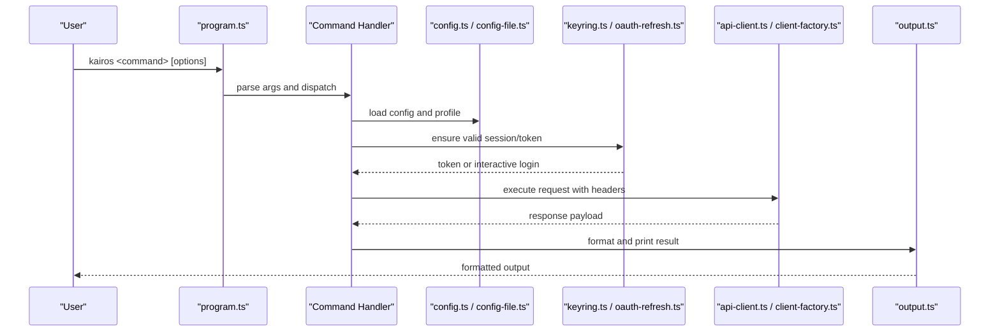
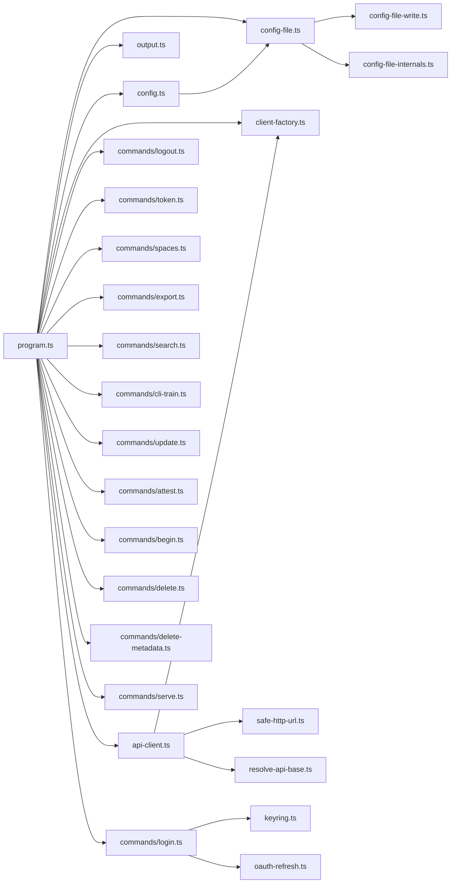

# CLI Tools

<cite>
**Referenced Files in This Document**
- [program.ts](file://src/cli/program.ts)
- [index.ts](file://src/cli/index.ts)
- [config.ts](file://src/cli/config.ts)
- [config-file.ts](file://src/cli/config-file.ts)
- [config-file-internals.ts](file://src/cli/config-file-internals.ts)
- [config-file-write.ts](file://src/cli/config-file-write.ts)
- [keyring.ts](file://src/cli/keyring.ts)
- [output.ts](file://src/cli/output.ts)
- [api-client.ts](file://src/cli/api-client.ts)
- [client-factory.ts](file://src/cli/client-factory.ts)
- [auth-error.ts](file://src/cli/auth-error.ts)
- [oauth-refresh.ts](file://src/cli/oauth-refresh.ts)
- [resolve-api-base.ts](file://src/cli/resolve-api-base.ts)
- [safe-http-url.ts](file://src/cli/safe-http-url.ts)
- [download-export-ref.ts](file://src/cli/download-export-ref.ts)
- [format-next-call.ts](file://src/cli/format-next-call.ts)
- [skill-zip-local-write.ts](file://src/cli/skill-zip-local-write.ts)
- [upload-guards.ts](file://src/cli/upload-guards.ts)
- [commands/login.ts](file://src/cli/commands/login.ts)
- [commands/logout.ts](file://src/cli/commands/logout.ts)
- [commands/token.ts](file://src/cli/commands/token.ts)
- [commands/spaces.ts](file://src/cli/commands/spaces.ts)
- [commands/export.ts](file://src/cli/commands/export.ts)
- [commands/search.ts](file://src/cli/commands/search.ts)
- [commands/train.ts](file://src/cli/commands/cli-train.ts)
- [commands/tune.ts](file://src/cli/commands/update.ts)
- [commands/attest.ts](file://src/cli/commands/attest.ts)
- [commands/begin.ts](file://src/cli/commands/begin.ts)
- [commands/delete.ts](file://src/cli/commands/delete.ts)
- [commands/delete-metadata.ts](file://src/cli/commands/delete-metadata.ts)
- [commands/serve.ts](file://src/cli/commands/serve.ts)
</cite>

## Table of Contents
1. [Introduction](#introduction)
2. [Project Structure](#project-structure)
3. [Core Components](#core-components)
4. [Architecture Overview](#architecture-overview)
5. [Detailed Component Analysis](#detailed-component-analysis)
6. [Dependency Analysis](#dependency-analysis)
7. [Performance Considerations](#performance-considerations)
8. [Troubleshooting Guide](#troubleshooting-guide)
9. [Conclusion](#conclusion)
10. [Appendices](#appendices)

## Introduction
This document provides comprehensive documentation for the Kairos MCP command-line interface (CLI). It covers all available commands, configuration management, credential storage with keyring integration, output formatting, command chaining and scripting patterns, CI/CD integration examples, error handling, logging, debugging techniques, environment variable configuration, and profile management across deployment contexts. The goal is to enable both new users and advanced operators to use the CLI effectively and reliably.

## Project Structure
The CLI is implemented as a Node.js application under src/cli. The entry point initializes the program, registers commands, and wires up shared configuration, authentication, and output utilities. Commands are organized by feature area (authentication, workflow operations, data export/import, administrative functions).

```mermaid
graph TB
A["src/cli/index.ts"] --> B["src/cli/program.ts"]
B --> C["src/cli/config.ts"]
B --> D["src/cli/config-file.ts"]
B --> E["src/cli/keyring.ts"]
B --> F["src/cli/output.ts"]
B --> G["src/cli/api-client.ts"]
B --> H["src/cli/client-factory.ts"]
subgraph "Commands"
I["src/cli/commands/login.ts"]
J["src/cli/commands/logout.ts"]
K["src/cli/commands/token.ts"]
L["src/cli/commands/spaces.ts"]
M["src/cli/commands/export.ts"]
N["src/cli/commands/search.ts"]
O["src/cli/commands/cli-train.ts"]
P["src/cli/commands/update.ts"]
Q["src/cli/commands/attest.ts"]
R["src/cli/commands/begin.ts"]
S["src/cli/commands/delete.ts"]
T["src/cli/commands/delete-metadata.ts"]
U["src/cli/commands/serve.ts"]
end
B --> I
B --> J
B --> K
B --> L
B --> M
B --> N
B --> O
B --> P
B --> Q
B --> R
B --> S
B --> T
B --> U
```

**Diagram sources**
- [index.ts](file://src/cli/index.ts)
- [program.ts](file://src/cli/program.ts)
- [config.ts](file://src/cli/config.ts)
- [config-file.ts](file://src/cli/config-file.ts)
- [keyring.ts](file://src/cli/keyring.ts)
- [output.ts](file://src/cli/output.ts)
- [api-client.ts](file://src/cli/api-client.ts)
- [client-factory.ts](file://src/cli/client-factory.ts)
- [commands/login.ts](file://src/cli/commands/login.ts)
- [commands/logout.ts](file://src/cli/commands/logout.ts)
- [commands/token.ts](file://src/cli/commands/token.ts)
- [commands/spaces.ts](file://src/cli/commands/spaces.ts)
- [commands/export.ts](file://src/cli/commands/export.ts)
- [commands/search.ts](file://src/cli/commands/search.ts)
- [commands/cli-train.ts](file://src/cli/commands/cli-train.ts)
- [commands/update.ts](file://src/cli/commands/update.ts)
- [commands/attest.ts](file://src/cli/commands/attest.ts)
- [commands/begin.ts](file://src/cli/commands/begin.ts)
- [commands/delete.ts](file://src/cli/commands/delete.ts)
- [commands/delete-metadata.ts](file://src/cli/commands/delete-metadata.ts)
- [commands/serve.ts](file://src/cli/commands/serve.ts)

**Section sources**
- [index.ts](file://src/cli/index.ts)
- [program.ts](file://src/cli/program.ts)

## Core Components
- Program bootstrap and command registration: Initializes the CLI framework, global options, and registers all commands.
- Configuration system: Loads defaults, environment variables, and user config files; supports profiles and interpolation.
- Authentication and token management: Handles login flows, token refresh, secure storage via keyring, and OIDC interactions.
- API client and HTTP helpers: Provides authenticated HTTP requests, base URL resolution, and safe URL validation.
- Output formatting: Supports multiple output formats (e.g., JSON, text), pretty printing, and structured logs.
- Utilities: Download helpers, skill zip writing, upload guards, and next-call formatting.

Key responsibilities and relationships:
- program.ts orchestrates command registration and global flags.
- config.ts and config-file.ts manage configuration loading and persistence.
- keyring.ts abstracts platform keychain access for secrets.
- api-client.ts and client-factory.ts build and configure HTTP clients with auth headers.
- output.ts standardizes how commands render results.

**Section sources**
- [program.ts](file://src/cli/program.ts)
- [config.ts](file://src/cli/config.ts)
- [config-file.ts](file://src/cli/config-file.ts)
- [config-file-internals.ts](file://src/cli/config-file-internals.ts)
- [config-file-write.ts](file://src/cli/config-file-write.ts)
- [keyring.ts](file://src/cli/keyring.ts)
- [output.ts](file://src/cli/output.ts)
- [api-client.ts](file://src/cli/api-client.ts)
- [client-factory.ts](file://src/cli/client-factory.ts)

## Architecture Overview
The CLI follows a layered architecture:
- Entry layer: index.ts bootstraps the process and delegates to program.ts.
- Command layer: Each command file implements a specific operation (login, logout, spaces, export, search, train, tune, attest, begin, delete, serve).
- Shared services: Configuration, authentication, HTTP client, and output formatting are reused across commands.
- External integrations: Keyring for credentials, OIDC provider for login, and remote API endpoints for data operations.

**Diagram sources**
- [program.ts](file://src/cli/program.ts)
- [config.ts](file://src/cli/config.ts)
- [config-file.ts](file://src/cli/config-file.ts)
- [keyring.ts](file://src/cli/keyring.ts)
- [oauth-refresh.ts](file://src/cli/oauth-refresh.ts)
- [api-client.ts](file://src/cli/api-client.ts)
- [client-factory.ts](file://src/cli/client-factory.ts)
- [output.ts](file://src/cli/output.ts)

## Detailed Component Analysis

### Authentication Management
Commands:
- login: Initiates OIDC login flow, stores tokens securely, and updates config.
- logout: Clears stored credentials and invalidates sessions.
- token: Displays or manages tokens (e.g., show current token info).

Configuration and storage:
- Config keys include server base URL, default profile, and token metadata.
- Tokens are persisted using keyring.ts when available; fallback to encrypted config if needed.
- OAuth refresh logic ensures long-lived sessions without repeated logins.

Common workflows:
- Interactive browser-based login.
- Headless login using environment variables for automation.
- Profile switching for different environments (dev/staging/prod).

Error handling:
- Network errors, invalid responses, and expired tokens are handled gracefully.
- Auth errors provide actionable guidance and retry suggestions.

**Section sources**
- [commands/login.ts](file://src/cli/commands/login.ts)
- [commands/logout.ts](file://src/cli/commands/logout.ts)
- [commands/token.ts](file://src/cli/commands/token.ts)
- [config-file.ts](file://src/cli/config-file.ts)
- [config-file-internals.ts](file://src/cli/config-file-internals.ts)
- [config-file-write.ts](file://src/cli/config-file-write.ts)
- [keyring.ts](file://src/cli/keyring.ts)
- [oauth-refresh.ts](file://src/cli/oauth-refresh.ts)
- [auth-error.ts](file://src/cli/auth-error.ts)

### Workflow Operations
Commands:
- begin: Start a guided workflow run.
- attest: Submit attestations or proofs within a workflow.
- update: Update artifacts or state during a workflow.
- delete: Remove workflow-related resources.
- delete-metadata: Clean up metadata entries.
- serve: Run an embedded UI or local service for interactive workflows.

Processing logic:
- Commands coordinate with the API client to perform state transitions.
- Some commands require proof-of-work challenges or validation steps.
- Output formatting adapts to workflow context (e.g., step-by-step progress).

Automation patterns:
- Chain begin -> attest -> update -> delete in scripts for end-to-end runs.
- Use environment variables to pass inputs and outputs between commands.

**Section sources**
- [commands/begin.ts](file://src/cli/commands/begin.ts)
- [commands/attest.ts](file://src/cli/commands/attest.ts)
- [commands/update.ts](file://src/cli/commands/update.ts)
- [commands/delete.ts](file://src/cli/commands/delete.ts)
- [commands/delete-metadata.ts](file://src/cli/commands/delete-metadata.ts)
- [commands/serve.ts](file://src/cli/commands/serve.ts)
- [format-next-call.ts](file://src/cli/format-next-call.ts)

### Data Export and Import
Commands:
- export: Export datasets, skills, or artifacts with selection filters and output formats.
- search: Query memory or knowledge base with filters and scoring.

Features:
- Selection criteria support filtering by space, tags, and content types.
- Export can produce zipped bundles or individual files; download helpers resolve references.
- Search returns structured results suitable for downstream processing.

CI/CD integration:
- Use export and search in pipelines to generate artifacts or validate content.
- Combine with jq or other tools to transform JSON outputs.

**Section sources**
- [commands/export.ts](file://src/cli/commands/export.ts)
- [commands/search.ts](file://src/cli/commands/search.ts)
- [download-export-ref.ts](file://src/cli/download-export-ref.ts)
- [output.ts](file://src/cli/output.ts)

### Administrative Functions
Commands:
- spaces: Manage spaces (list, create, update, delete) and permissions.
- train: Train models or indexes from exported data or artifacts.
- tune: Tune parameters or configurations for improved performance.

Capabilities:
- Spaces operations enforce access controls and validate payloads.
- Train and tune commands accept batch inputs and report metrics.
- Upload guards prevent unsafe or oversized uploads.

Operational considerations:
- Use profiles to target different clusters or tenants.
- Monitor logs and metrics for long-running jobs.

**Section sources**
- [commands/spaces.ts](file://src/cli/commands/spaces.ts)
- [commands/cli-train.ts](file://src/cli/commands/cli-train.ts)
- [commands/update.ts](file://src/cli/commands/update.ts)
- [upload-guards.ts](file://src/cli/upload-guards.ts)

### Configuration File Management
Responsibilities:
- Load defaults, environment overrides, and user-specific config files.
- Support profiles for multi-environment setups.
- Write and persist changes safely with atomic writes and backups.

Key features:
- Interpolation of environment variables within config values.
- Validation of required fields and type coercion.
- Safe path resolution for relative references.

Best practices:
- Store sensitive values in keyring rather than plaintext config.
- Use profiles to separate dev/staging/prod settings.

**Section sources**
- [config.ts](file://src/cli/config.ts)
- [config-file.ts](file://src/cli/config-file.ts)
- [config-file-internals.ts](file://src/cli/config-file-internals.ts)
- [config-file-write.ts](file://src/cli/config-file-write.ts)

### Credential Storage with Keyring Integration
Capabilities:
- Securely store tokens and secrets using the platform keychain.
- Fallback mechanisms when keyring is unavailable.
- Automatic refresh and rotation strategies.

Security considerations:
- Minimize exposure of secrets in logs and outputs.
- Validate and sanitize URLs and identifiers before storage.

**Section sources**
- [keyring.ts](file://src/cli/keyring.ts)
- [safe-http-url.ts](file://src/cli/safe-http-url.ts)

### Output Formatting Options
Options:
- Choose between JSON, text, or structured formats.
- Pretty-printing and compact modes.
- Consistent error reporting with actionable messages.

Usage patterns:
- Pipe JSON outputs to jq for transformations.
- Use text mode for human-readable logs in terminals.

**Section sources**
- [output.ts](file://src/cli/output.ts)

### Command Chaining, Scripting, and Automation
Patterns:
- Chain commands using shell pipes and temporary files.
- Pass IDs and URIs between commands via environment variables.
- Use exit codes and structured outputs for conditional logic.

Examples:
- Begin a workflow, capture the run ID, then attest and update using that ID.
- Export selected artifacts, compute checksums, and upload to artifact storage.

**Section sources**
- [program.ts](file://src/cli/program.ts)
- [output.ts](file://src/cli/output.ts)

### Environment Variables and Profiles
Environment variables:
- Configure API base URL, timeouts, and debug flags.
- Provide headless login credentials and token refresh hints.

Profiles:
- Define named profiles with distinct server endpoints and scopes.
- Switch profiles per task or pipeline stage.

**Section sources**
- [config.ts](file://src/cli/config.ts)
- [config-file.ts](file://src/cli/config-file.ts)
- [resolve-api-base.ts](file://src/cli/resolve-api-base.ts)

## Dependency Analysis
The CLI components have clear separation of concerns:
- program.ts depends on config, output, and command modules.
- Commands depend on api-client, config, and output.
- Authentication utilities depend on keyring and oauth-refresh.
- HTTP helpers depend on safe-http-url and resolve-api-base.

**Diagram sources**
- [program.ts](file://src/cli/program.ts)
- [config.ts](file://src/cli/config.ts)
- [config-file.ts](file://src/cli/config-file.ts)
- [config-file-write.ts](file://src/cli/config-file-write.ts)
- [config-file-internals.ts](file://src/cli/config-file-internals.ts)
- [output.ts](file://src/cli/output.ts)
- [api-client.ts](file://src/cli/api-client.ts)
- [client-factory.ts](file://src/cli/client-factory.ts)
- [safe-http-url.ts](file://src/cli/safe-http-url.ts)
- [resolve-api-base.ts](file://src/cli/resolve-api-base.ts)
- [keyring.ts](file://src/cli/keyring.ts)
- [oauth-refresh.ts](file://src/cli/oauth-refresh.ts)
- [commands/login.ts](file://src/cli/commands/login.ts)
- [commands/logout.ts](file://src/cli/commands/logout.ts)
- [commands/token.ts](file://src/cli/commands/token.ts)
- [commands/spaces.ts](file://src/cli/commands/spaces.ts)
- [commands/export.ts](file://src/cli/commands/export.ts)
- [commands/search.ts](file://src/cli/commands/search.ts)
- [commands/cli-train.ts](file://src/cli/commands/cli-train.ts)
- [commands/update.ts](file://src/cli/commands/update.ts)
- [commands/attest.ts](file://src/cli/commands/attest.ts)
- [commands/begin.ts](file://src/cli/commands/begin.ts)
- [commands/delete.ts](file://src/cli/commands/delete.ts)
- [commands/delete-metadata.ts](file://src/cli/commands/delete-metadata.ts)
- [commands/serve.ts](file://src/cli/commands/serve.ts)

**Section sources**
- [program.ts](file://src/cli/program.ts)
- [api-client.ts](file://src/cli/api-client.ts)
- [client-factory.ts](file://src/cli/client-factory.ts)
- [config.ts](file://src/cli/config.ts)
- [config-file.ts](file://src/cli/config-file.ts)
- [keyring.ts](file://src/cli/keyring.ts)
- [oauth-refresh.ts](file://src/cli/oauth-refresh.ts)

## Performance Considerations
- Prefer JSON output for machine consumption to reduce parsing overhead.
- Use profiles to avoid repeated network calls for discovery.
- Batch operations where supported (e.g., train with multiple artifacts).
- Enable caching or reuse sessions to minimize authentication latency.
- Limit concurrent exports or searches based on server capacity.

[No sources needed since this section provides general guidance]

## Troubleshooting Guide
Common issues and resolutions:
- Authentication failures: Verify OIDC configuration, check token expiry, and re-run login.
- Network errors: Confirm API base URL and connectivity; inspect proxy settings.
- Permission errors: Ensure correct profile and scope; validate space access.
- Large uploads: Check size limits and chunking behavior; review upload guards.

Debugging techniques:
- Increase verbosity via global flags.
- Inspect structured logs and error messages.
- Use environment variables to toggle debug modes.
- Capture intermediate outputs for analysis.

**Section sources**
- [auth-error.ts](file://src/cli/auth-error.ts)
- [output.ts](file://src/cli/output.ts)
- [config.ts](file://src/cli/config.ts)

## Conclusion
The Kairos MCP CLI provides a robust set of commands for authentication, workflow operations, data export/import, and administration. Its modular design, strong configuration system, and secure credential storage make it suitable for both interactive use and automated pipelines. By leveraging profiles, environment variables, and structured outputs, teams can integrate the CLI into CI/CD workflows effectively while maintaining security and reliability.

[No sources needed since this section summarizes without analyzing specific files]

## Appendices

### Common CLI Workflows
- Authenticate once per session and reuse tokens across commands.
- Use profiles to switch between development and production environments.
- Chain commands to automate end-to-end tasks (begin -> attest -> update -> delete).
- Export and search data for analysis or archival purposes.

### CI/CD Integration Examples
- Headless login using environment variables.
- Export artifacts and compute checksums for provenance.
- Run training jobs with batch inputs and collect metrics.
- Validate outputs using structured JSON and assertion tools.

[No sources needed since this section provides general guidance]