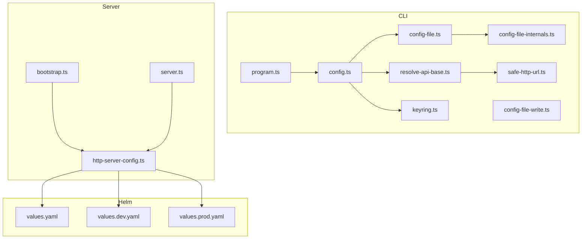
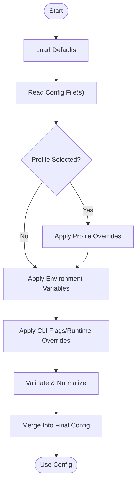
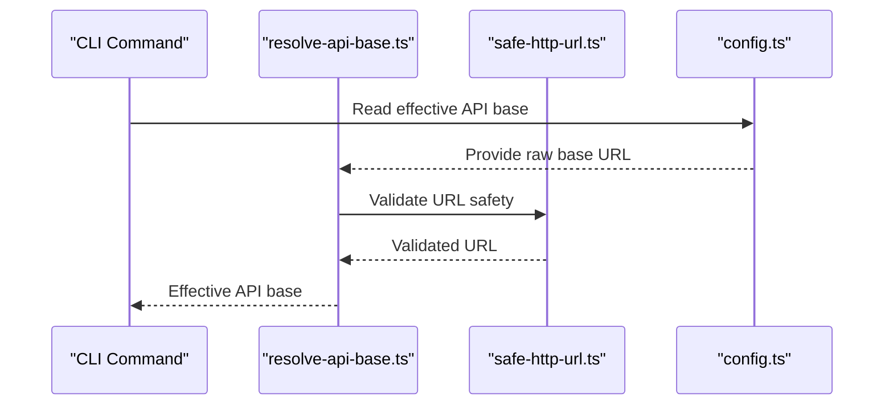
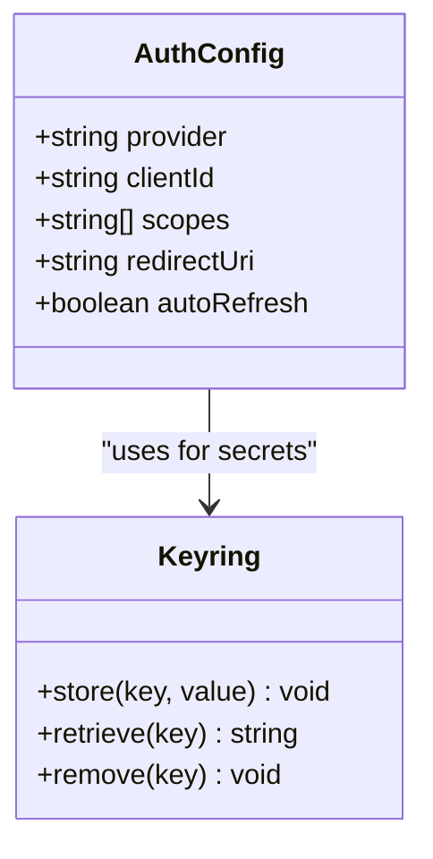
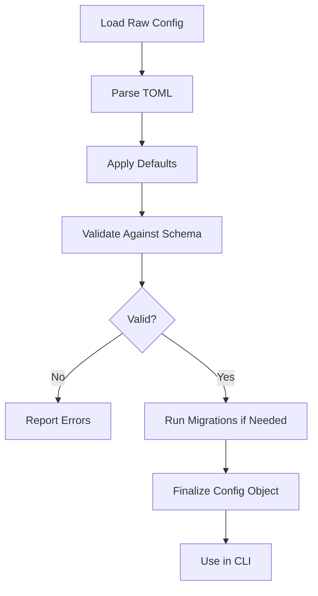
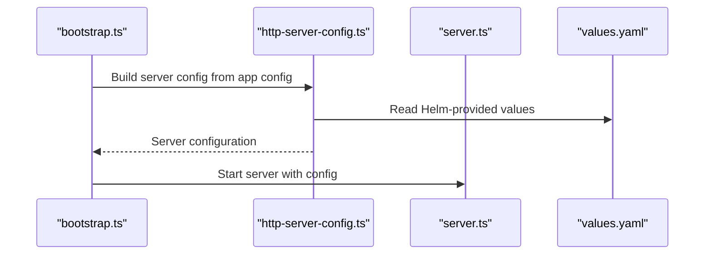
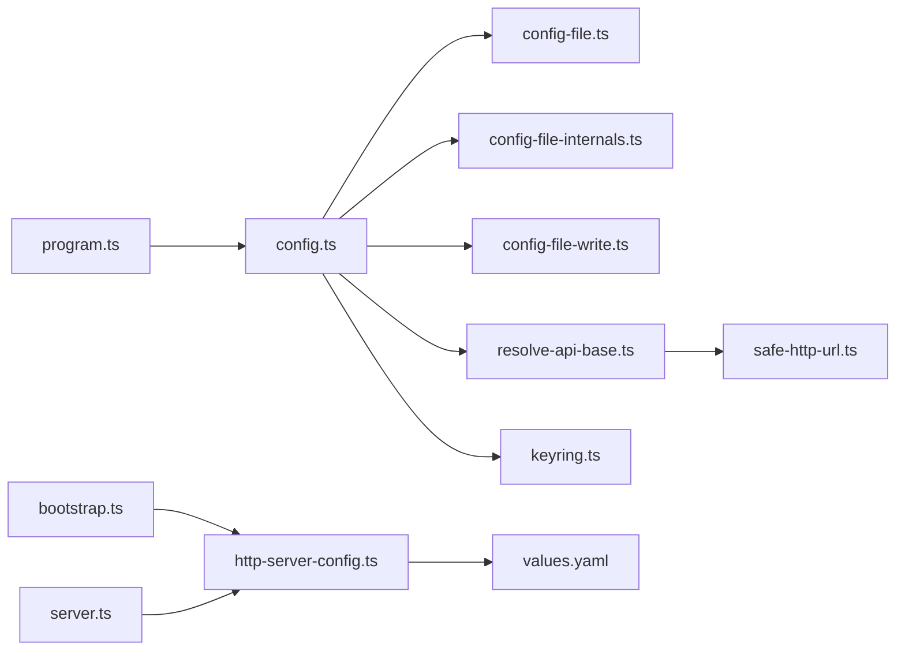

# Configuration Management

<cite>
**Referenced Files in This Document**
- [config.ts](file://src/cli/config.ts)
- [config-file.ts](file://src/cli/config-file.ts)
- [config-file-internals.ts](file://src/cli/config-file-internals.ts)
- [config-file-write.ts](file://src/cli/config-file-write.ts)
- [program.ts](file://src/cli/program.ts)
- [resolve-api-base.ts](file://src/cli/resolve-api-base.ts)
- [safe-http-url.ts](file://src/cli/safe-http-url.ts)
- [keyring.ts](file://src/cli/keyring.ts)
- [http-server-config.ts](file://src/http/http-server-config.ts)
- [bootstrap.ts](file://src/bootstrap.ts)
- [server.ts](file://src/server.ts)
- [values.yaml](file://helm/kairos-mcp/values.yaml)
- [values.dev.yaml](file://helm/values.dev.yaml)
- [values.prod.yaml](file://helm/values.prod.yaml)
</cite>

## Table of Contents
1. [Introduction](#introduction)
2. [Project Structure](#project-structure)
3. [Core Components](#core-components)
4. [Architecture Overview](#architecture-overview)
5. [Detailed Component Analysis](#detailed-component-analysis)
6. [Dependency Analysis](#dependency-analysis)
7. [Performance Considerations](#performance-considerations)
8. [Troubleshooting Guide](#troubleshooting-guide)
9. [Conclusion](#conclusion)
10. [Appendices](#appendices)

## Introduction
This document explains how Kairos MCP manages CLI configuration, including file structure and format (TOML), environment variable overrides, profile management for different deployment contexts, and configuration inheritance patterns. It also covers API endpoint configuration, authentication settings, timeouts, logging options, validation, defaults, migration between versions, and secure handling of sensitive data. Examples are provided for development, staging, and production scenarios.

## Project Structure
The CLI configuration is implemented under the CLI module and integrates with server-side HTTP configuration and Helm values for deployments. The key files include:
- CLI configuration loader and writer
- TOML parsing and schema validation
- Environment variable resolution and precedence
- Profile selection and interpolation
- API base URL resolution and safe URL validation
- Keyring integration for secrets
- Server-side HTTP configuration and bootstrap

**Diagram sources**
- [config.ts](file://src/cli/config.ts)
- [config-file.ts](file://src/cli/config-file.ts)
- [config-file-internals.ts](file://src/cli/config-file-internals.ts)
- [config-file-write.ts](file://src/cli/config-file-write.ts)
- [program.ts](file://src/cli/program.ts)
- [resolve-api-base.ts](file://src/cli/resolve-api-base.ts)
- [safe-http-url.ts](file://src/cli/safe-http-url.ts)
- [keyring.ts](file://src/cli/keyring.ts)
- [http-server-config.ts](file://src/http/http-server-config.ts)
- [bootstrap.ts](file://src/bootstrap.ts)
- [server.ts](file://src/server.ts)
- [values.yaml](file://helm/kairos-mcp/values.yaml)
- [values.dev.yaml](file://helm/values.dev.yaml)
- [values.prod.yaml](file://helm/values.prod.yaml)

**Section sources**
- [config.ts](file://src/cli/config.ts)
- [config-file.ts](file://src/cli/config-file.ts)
- [config-file-internals.ts](file://src/cli/config-file-internals.ts)
- [config-file-write.ts](file://src/cli/config-file-write.ts)
- [program.ts](file://src/cli/program.ts)
- [resolve-api-base.ts](file://src/cli/resolve-api-base.ts)
- [safe-http-url.ts](file://src/cli/safe-http-url.ts)
- [keyring.ts](file://src/cli/keyring.ts)
- [http-server-config.ts](file://src/http/http-server-config.ts)
- [bootstrap.ts](file://src/bootstrap.ts)
- [server.ts](file://src/server.ts)
- [values.yaml](file://helm/kairos-mcp/values.yaml)
- [values.dev.yaml](file://helm/values.dev.yaml)
- [values.prod.yaml](file://helm/values.prod.yaml)

## Core Components
- Configuration loader and resolver: centralizes reading from config files, environment variables, and profiles; merges and validates into a unified runtime config object.
- Config file internals: handles TOML parsing, schema definitions, default values, and versioning/migration helpers.
- Config file writer: persists changes back to disk safely, preserving comments and formatting where possible.
- Program entrypoint: wires CLI flags and commands to the configuration system.
- API base resolution: computes effective API base URL using config, environment, and platform hints; validates URLs.
- Keyring integration: securely stores and retrieves sensitive tokens or credentials.
- Server HTTP configuration: maps application configuration to HTTP server behavior (ports, TLS, timeouts).
- Bootstrap and server startup: initialize configuration before starting services.

**Section sources**
- [config.ts](file://src/cli/config.ts)
- [config-file.ts](file://src/cli/config-file.ts)
- [config-file-internals.ts](file://src/cli/config-file-internals.ts)
- [config-file-write.ts](file://src/cli/config-file-write.ts)
- [program.ts](file://src/cli/program.ts)
- [resolve-api-base.ts](file://src/cli/resolve-api-base.ts)
- [safe-http-url.ts](file://src/cli/safe-http-url.ts)
- [keyring.ts](file://src/cli/keyring.ts)
- [http-server-config.ts](file://src/http/http-server-config.ts)
- [bootstrap.ts](file://src/bootstrap.ts)
- [server.ts](file://src/server.ts)

## Architecture Overview
The configuration architecture follows a layered approach:
- Defaults layer: built-in defaults defined in code.
- File layer: TOML-based configuration file(s) on disk.
- Profile layer: named sections or files that override defaults and base file.
- Environment layer: environment variables that override all other layers.
- Runtime layer: CLI flags and programmatic overrides applied at startup.

[No sources needed since this diagram shows conceptual workflow, not actual code structure]

## Detailed Component Analysis

### Configuration File Structure and Format (TOML)
- Location: The CLI reads a TOML configuration file from a well-known user directory path resolved at runtime.
- Format: TOML with top-level sections for general settings, API endpoints, authentication, timeouts, and logging.
- Fields:
  - General: profile name, feature toggles, cache paths.
  - API: base URL, retry policy, timeout values.
  - Authentication: provider type, client ID, scopes, token storage backend.
  - Timeouts: request timeouts, connection timeouts, idle timeouts.
  - Logging: level, output targets, structured JSON toggle.
- Inheritance: Profiles can extend a base profile and override specific keys. Interpolation supports referencing other fields within the same profile.

For exact field names, types, and defaults, see the configuration schema and loader implementation.

**Section sources**
- [config-file.ts](file://src/cli/config-file.ts)
- [config-file-internals.ts](file://src/cli/config-file-internals.ts)
- [config.ts](file://src/cli/config.ts)

### Environment Variable Overrides
- Precedence: Environment variables override both file and profile values.
- Naming convention: Environment variables map to configuration keys via a consistent naming scheme (e.g., uppercase with underscores).
- Supported overrides: API base URL, authentication credentials, timeouts, logging level, and profile selection.
- Resolution order: Defaults < File < Profile < Environment < CLI flags.

**Section sources**
- [config.ts](file://src/cli/config.ts)
- [config-file-internals.ts](file://src/cli/config-file-internals.ts)

### Profile Management and Inheritance
- Profiles: Named configuration blocks that encapsulate environment-specific settings (development, staging, production).
- Selection: Profiles can be selected via a config field or an environment variable.
- Inheritance: Profiles may extend a base profile and only specify differences.
- Interpolation: References to other fields within the same profile are supported for reuse.

**Section sources**
- [config-file.ts](file://src/cli/config-file.ts)
- [config-file-internals.ts](file://src/cli/config-file-internals.ts)
- [config.ts](file://src/cli/config.ts)

### API Endpoint Configuration
- Base URL: Resolved from config, environment, or computed defaults.
- Validation: Enforced safe URL checks to prevent malformed endpoints.
- Path composition: Helpers ensure trailing slashes and path segments are handled consistently.

**Diagram sources**
- [resolve-api-base.ts](file://src/cli/resolve-api-base.ts)
- [safe-http-url.ts](file://src/cli/safe-http-url.ts)
- [config.ts](file://src/cli/config.ts)

**Section sources**
- [resolve-api-base.ts](file://src/cli/resolve-api-base.ts)
- [safe-http-url.ts](file://src/cli/safe-http-url.ts)
- [config.ts](file://src/cli/config.ts)

### Authentication Settings
- Providers: Supports OIDC/OAuth flows with configurable client ID, scopes, and redirect URIs.
- Token storage: Integrates with a secure keyring backend for storing tokens and secrets.
- Refresh: Automatic token refresh logic is available when configured.

**Diagram sources**
- [config.ts](file://src/cli/config.ts)
- [keyring.ts](file://src/cli/keyring.ts)

**Section sources**
- [config.ts](file://src/cli/config.ts)
- [keyring.ts](file://src/cli/keyring.ts)

### Timeout Values
- Request timeout: Maximum time to wait for a response.
- Connection timeout: Maximum time to establish a connection.
- Idle timeout: Maximum time to keep connections alive.
- Defaults: Reasonable defaults are provided and can be overridden by environment or config.

**Section sources**
- [config.ts](file://src/cli/config.ts)
- [config-file-internals.ts](file://src/cli/config-file-internals.ts)

### Logging Options
- Level: Controls verbosity (e.g., debug, info, warn, error).
- Output: Console, file, or structured JSON output.
- Context: Includes correlation IDs and timestamps for traceability.

**Section sources**
- [config.ts](file://src/cli/config.ts)
- [config-file-internals.ts](file://src/cli/config-file-internals.ts)

### Configuration Validation, Defaults, and Migration
- Validation: Schema-driven validation ensures required fields and correct types.
- Defaults: Built-in defaults fill unspecified fields.
- Migration: Versioned configuration schemas support upgrades; migration helpers transform legacy formats to current schema.

**Diagram sources**
- [config-file-internals.ts](file://src/cli/config-file-internals.ts)
- [config-file.ts](file://src/cli/config-file.ts)
- [config.ts](file://src/cli/config.ts)

**Section sources**
- [config-file-internals.ts](file://src/cli/config-file-internals.ts)
- [config-file.ts](file://src/cli/config-file.ts)
- [config.ts](file://src/cli/config.ts)

### Secure Configuration Practices and Sensitive Data Handling
- Secrets: Prefer keyring-backed storage for tokens and passwords.
- Avoid plaintext: Do not store secrets directly in config files unless necessary; use environment variables or keyring.
- Least privilege: Limit access to configuration directories and files.
- Audit: Enable audit logging for sensitive operations when appropriate.

**Section sources**
- [keyring.ts](file://src/cli/keyring.ts)
- [config.ts](file://src/cli/config.ts)

### Development, Staging, and Production Examples
- Development: Local API base, verbose logging, minimal security constraints.
- Staging: Mid-tier timeouts, structured logging, OIDC enabled with test clients.
- Production: Strict timeouts, secure keyring usage, hardened logging, explicit profiles.

These examples should be created using the profile mechanism and environment overrides described above. Refer to the configuration schema and loader for exact keys and valid values.

**Section sources**
- [config-file.ts](file://src/cli/config-file.ts)
- [config-file-internals.ts](file://src/cli/config-file-internals.ts)
- [config.ts](file://src/cli/config.ts)

### Server-Side HTTP Configuration Integration
- Mapping: Application configuration maps to HTTP server settings such as port, TLS, CORS, and metrics.
- Bootstrap: Server bootstrap initializes configuration before starting listeners.
- Helm values: Deployment values influence server configuration through environment injection.

**Diagram sources**
- [bootstrap.ts](file://src/bootstrap.ts)
- [http-server-config.ts](file://src/http/http-server-config.ts)
- [server.ts](file://src/server.ts)
- [values.yaml](file://helm/kairos-mcp/values.yaml)

**Section sources**
- [http-server-config.ts](file://src/http/http-server-config.ts)
- [bootstrap.ts](file://src/bootstrap.ts)
- [server.ts](file://src/server.ts)
- [values.yaml](file://helm/kairos-mcp/values.yaml)
- [values.dev.yaml](file://helm/values.dev.yaml)
- [values.prod.yaml](file://helm/values.prod.yaml)

## Dependency Analysis
The CLI configuration depends on several modules for parsing, validation, and secure storage. The server configuration depends on Helm values and bootstrap routines.

**Diagram sources**
- [program.ts](file://src/cli/program.ts)
- [config.ts](file://src/cli/config.ts)
- [config-file.ts](file://src/cli/config-file.ts)
- [config-file-internals.ts](file://src/cli/config-file-internals.ts)
- [config-file-write.ts](file://src/cli/config-file-write.ts)
- [resolve-api-base.ts](file://src/cli/resolve-api-base.ts)
- [safe-http-url.ts](file://src/cli/safe-http-url.ts)
- [keyring.ts](file://src/cli/keyring.ts)
- [bootstrap.ts](file://src/bootstrap.ts)
- [http-server-config.ts](file://src/http/http-server-config.ts)
- [server.ts](file://src/server.ts)
- [values.yaml](file://helm/kairos-mcp/values.yaml)

**Section sources**
- [program.ts](file://src/cli/program.ts)
- [config.ts](file://src/cli/config.ts)
- [config-file.ts](file://src/cli/config-file.ts)
- [config-file-internals.ts](file://src/cli/config-file-internals.ts)
- [config-file-write.ts](file://src/cli/config-file-write.ts)
- [resolve-api-base.ts](file://src/cli/resolve-api-base.ts)
- [safe-http-url.ts](file://src/cli/safe-http-url.ts)
- [keyring.ts](file://src/cli/keyring.ts)
- [bootstrap.ts](file://src/bootstrap.ts)
- [http-server-config.ts](file://src/http/http-server-config.ts)
- [server.ts](file://src/server.ts)
- [values.yaml](file://helm/kairos-mcp/values.yaml)

## Performance Considerations
- Minimize config reloads: Cache parsed configuration during process lifetime.
- Efficient interpolation: Resolve references once and reuse results.
- Lazy loading: Defer heavy initialization until needed.
- Network timeouts: Tune timeouts based on expected latency to avoid long waits.

[No sources needed since this section provides general guidance]

## Troubleshooting Guide
- Invalid configuration: Review validation errors and ensure required fields are present and correctly typed.
- API connectivity issues: Verify base URL safety and network reachability; check timeouts.
- Authentication failures: Confirm provider settings, client ID, scopes, and keyring availability.
- Logging problems: Adjust log level and output targets; verify file permissions.

**Section sources**
- [config-file-internals.ts](file://src/cli/config-file-internals.ts)
- [resolve-api-base.ts](file://src/cli/resolve-api-base.ts)
- [safe-http-url.ts](file://src/cli/safe-http-url.ts)
- [keyring.ts](file://src/cli/keyring.ts)

## Conclusion
Kairos MCP’s CLI configuration system provides a robust, layered approach to managing settings across environments. By leveraging TOML files, profiles, environment overrides, and secure secret storage, it supports flexible and safe configuration for development, staging, and production. Validation and migration mechanisms ensure reliability and forward compatibility.

[No sources needed since this section summarizes without analyzing specific files]

## Appendices

### Quick Reference: Configuration Layers and Precedence
- Defaults (built-in)
- Config file (TOML)
- Profile (extends base, overrides)
- Environment variables
- CLI flags/runtime overrides

**Section sources**
- [config.ts](file://src/cli/config.ts)
- [config-file-internals.ts](file://src/cli/config-file-internals.ts)

### Example Scenarios (Conceptual)
- Development: Set local API base, enable debug logs, use dev profile.
- Staging: Configure OIDC with staging clients, set moderate timeouts, enable structured logs.
- Production: Use keyring for secrets, strict timeouts, production profile, audit logging.

[No sources needed since this section provides conceptual examples]