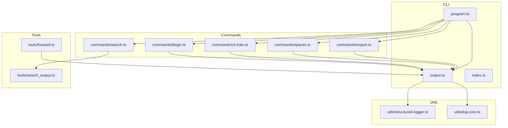
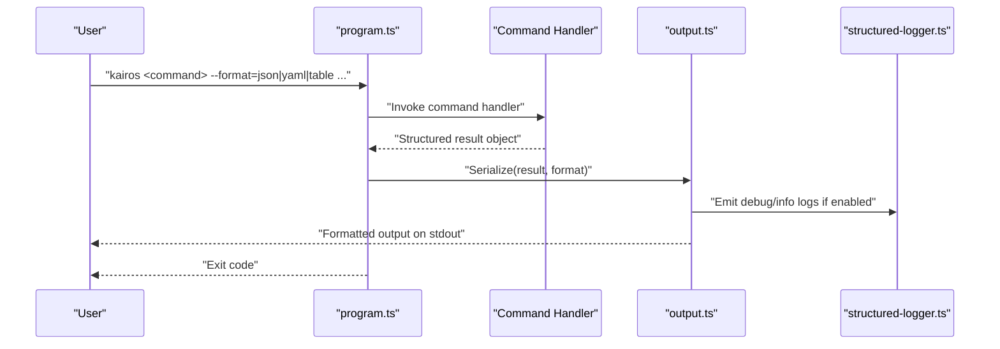
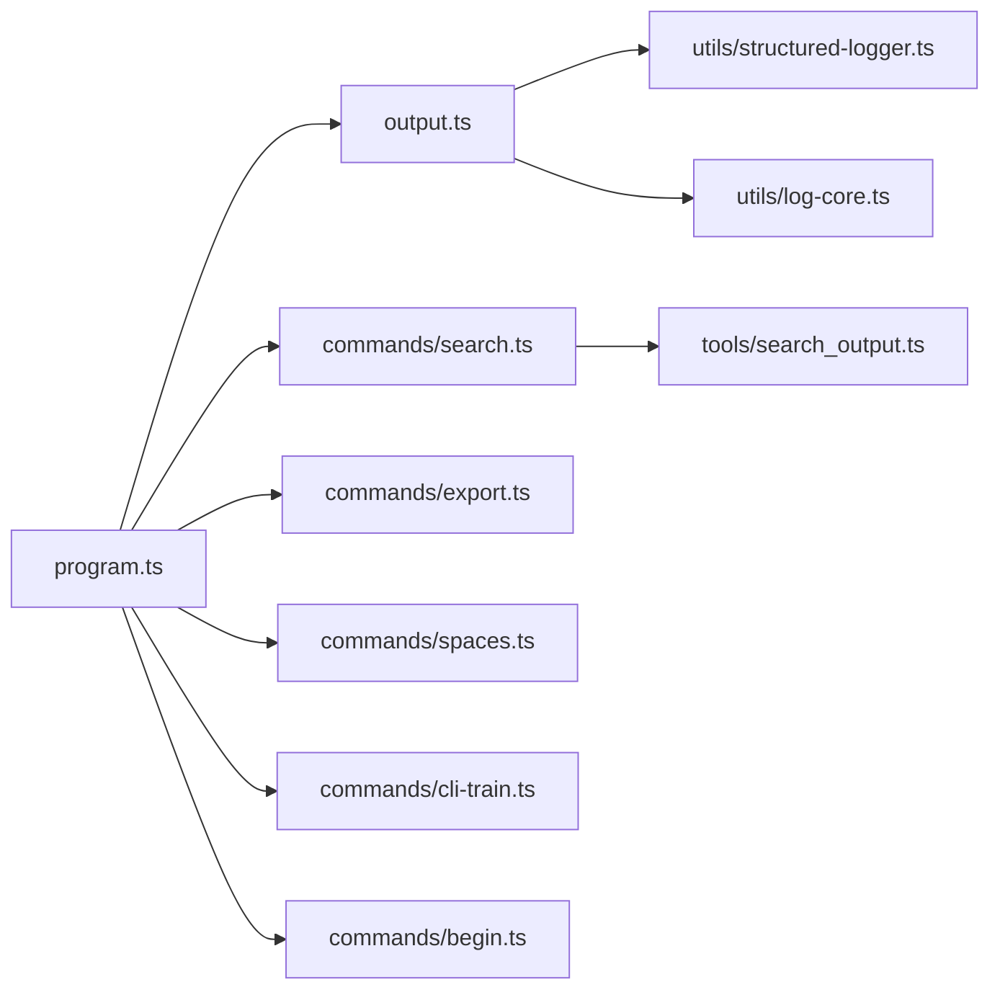

# Output Formatting and Scripting

<cite>
**Referenced Files in This Document**
- [CLI.md](file://docs/CLI.md)
- [program.ts](file://src/cli/program.ts)
- [output.ts](file://src/cli/output.ts)
- [index.ts](file://src/cli/index.ts)
- [search.ts](file://src/cli/commands/search.ts)
- [export.ts](file://src/cli/commands/export.ts)
- [spaces.ts](file://src/cli/commands/spaces.ts)
- [train.ts](file://src/cli/commands/cli-train.ts)
- [begin.ts](file://src/cli/commands/begin.ts)
- [forward.ts](file://src/tools/forward.ts)
- [search_output.ts](file://src/tools/search_output.ts)
- [structured-logger.ts](file://src/utils/structured-logger.ts)
- [log-core.ts](file://src/utils/log-core.ts)
</cite>

## Table of Contents
1. [Introduction](#introduction)
2. [Project Structure](#project-structure)
3. [Core Components](#core-components)
4. [Architecture Overview](#architecture-overview)
5. [Detailed Component Analysis](#detailed-component-analysis)
6. [Dependency Analysis](#dependency-analysis)
7. [Performance Considerations](#performance-considerations)
8. [Troubleshooting Guide](#troubleshooting-guide)
9. [Conclusion](#conclusion)

## Introduction
This document explains how Kairos MCP formats CLI output and how to script against it. It covers available output formats (JSON, YAML, table), structured output parsing, filtering and transformation patterns, scripting for automation and command chaining, programmatic usage, exit status handling, logging levels and verbose options, debugging techniques, and performance considerations for large datasets and streaming outputs.

## Project Structure
The CLI subsystem is implemented under src/cli with a small set of core modules:
- Program entrypoint and command registration
- Centralized output formatting and printing
- Command implementations that produce structured results
- Tool-level output helpers used by commands
- Logging utilities for structured logs and verbosity

**Diagram sources**
- [program.ts](file://src/cli/program.ts)
- [output.ts](file://src/cli/output.ts)
- [index.ts](file://src/cli/index.ts)
- [search.ts](file://src/cli/commands/search.ts)
- [export.ts](file://src/cli/commands/export.ts)
- [spaces.ts](file://src/cli/commands/spaces.ts)
- [cli-train.ts](file://src/cli/commands/cli-train.ts)
- [begin.ts](file://src/cli/commands/begin.ts)
- [forward.ts](file://src/tools/forward.ts)
- [search_output.ts](file://src/tools/search_output.ts)
- [structured-logger.ts](file://src/utils/structured-logger.ts)
- [log-core.ts](file://src/utils/log-core.ts)

**Section sources**
- [CLI.md](file://docs/CLI.md)
- [program.ts](file://src/cli/program.ts)
- [output.ts](file://src/cli/output.ts)
- [index.ts](file://src/cli/index.ts)

## Core Components
- Program bootstrap and command wiring: The CLI entrypoint registers commands and parses flags, then delegates to command handlers.
- Output formatter: A centralized module serializes results into requested formats and writes them to stdout or files.
- Command implementations: Each command builds a result object and passes it to the output formatter.
- Tool-level helpers: Some commands use tool-level helpers to shape output before formatting.
- Logging: Structured logger and log core provide consistent logging and verbosity control.

Key responsibilities:
- Accept format flags and environment variables to select JSON, YAML, or table rendering.
- Provide stable, machine-parseable structures for scripting.
- Support filtering and transformation via flags where applicable.
- Emit structured logs at appropriate levels for debugging and automation.

**Section sources**
- [program.ts](file://src/cli/program.ts)
- [output.ts](file://src/cli/output.ts)
- [search.ts](file://src/cli/commands/search.ts)
- [export.ts](file://src/cli/commands/export.ts)
- [spaces.ts](file://src/cli/commands/spaces.ts)
- [cli-train.ts](file://src/cli/commands/cli-train.ts)
- [begin.ts](file://src/cli/commands/begin.ts)
- [search_output.ts](file://src/tools/search_output.ts)
- [structured-logger.ts](file://src/utils/structured-logger.ts)
- [log-core.ts](file://src/utils/log-core.ts)

## Architecture Overview
The CLI follows a simple pipeline:
- Parse arguments and flags
- Execute command handler
- Build structured result
- Serialize using output formatter
- Write to stdout or file
- Exit with appropriate status code

**Diagram sources**
- [program.ts](file://src/cli/program.ts)
- [output.ts](file://src/cli/output.ts)
- [structured-logger.ts](file://src/utils/structured-logger.ts)

## Detailed Component Analysis

### Output Formatting Engine
Responsibilities:
- Select serialization format based on flags or environment variables.
- Render JSON, YAML, or human-friendly tables.
- Ensure deterministic field ordering and stable keys for scripting.
- Optionally write to files when requested.

Common behaviors:
- When JSON/YAML is selected, output is fully machine-readable with no extra text.
- When table is selected, output is optimized for readability and may omit low-value fields.
- Errors are reported consistently and do not break structured output streams.

Scripting tips:
- Prefer JSON/YAML for automation; parse with jq, yq, or language-native parsers.
- Use explicit format flags rather than relying on terminal detection.
- Capture exit codes to detect success/failure.

**Section sources**
- [output.ts](file://src/cli/output.ts)

### Search Command Output
Capabilities:
- Produces search results as structured objects suitable for filtering and transformation.
- Supports selecting fields and applying filters via flags.
- Outputs in multiple formats.

Parsing and filtering:
- Use JSON output and tools like jq to filter by score, space, or metadata.
- For YAML, use yq to transform and extract nested fields.
- Table mode is best for quick inspection, not for automation.

Example patterns:
- Filter top-k results by relevance threshold.
- Extract specific fields for downstream processing.
- Combine with sort/group operations in shell pipelines.

**Section sources**
- [search.ts](file://src/cli/commands/search.ts)
- [search_output.ts](file://src/tools/search_output.ts)
- [output.ts](file://src/cli/output.ts)

### Export Command Output
Capabilities:
- Generates exports in selectable formats.
- Provides progress and summary information.
- Emits telemetry and audit-friendly logs when enabled.

Automation patterns:
- Pipe export artifacts to storage or CI steps.
- Validate checksums and sizes post-export.
- Use structured logs to track export duration and item counts.

**Section sources**
- [export.ts](file://src/cli/commands/export.ts)
- [output.ts](file://src/cli/output.ts)

### Spaces Command Output
Capabilities:
- Lists and manages spaces with structured responses.
- Supports filtering by name, visibility, or tags.
- Renders tabular summaries for interactive use.

Automation patterns:
- Query space IDs for subsequent commands.
- Generate configuration from space listings.

**Section sources**
- [spaces.ts](file://src/cli/commands/spaces.ts)
- [output.ts](file://src/cli/output.ts)

### Train Command Output
Capabilities:
- Reports training job status, metrics, and artifacts.
- Supports batched runs with per-item summaries.
- Emits detailed logs for diagnostics.

Automation patterns:
- Poll job status until completion.
- Aggregate metrics across runs.
- Archive artifacts referenced in structured output.

**Section sources**
- [cli-train.ts](file://src/cli/commands/cli-train.ts)
- [output.ts](file://src/cli/output.ts)

### Begin Command Output
Capabilities:
- Starts workflows and returns session identifiers and next actions.
- Provides guidance for subsequent steps.

Automation patterns:
- Capture session IDs and pass them to follow-up commands.
- Integrate with orchestration systems using structured outputs.

**Section sources**
- [begin.ts](file://src/cli/commands/begin.ts)
- [output.ts](file://src/cli/output.ts)

### Forward Tool Integration
Capabilities:
- Used by commands to perform forward operations.
- Returns structured results consumed by the output formatter.

Integration notes:
- Commands should rely on tool outputs rather than re-implementing logic.
- Error propagation is handled centrally for consistent user experience.

**Section sources**
- [forward.ts](file://src/tools/forward.ts)
- [output.ts](file://src/cli/output.ts)

### Logging and Verbose Options
Features:
- Structured logging with levels (e.g., info, warn, error).
- Verbose flag enables additional context and debug details.
- Logs can be parsed programmatically for dashboards and alerts.

Best practices:
- Use structured logs for machine consumption; reserve console messages for humans.
- Avoid sensitive data in logs.
- Set verbosity appropriately in CI environments.

**Section sources**
- [structured-logger.ts](file://src/utils/structured-logger.ts)
- [log-core.ts](file://src/utils/log-core.ts)

## Dependency Analysis
High-level dependencies among CLI components:

**Diagram sources**
- [program.ts](file://src/cli/program.ts)
- [output.ts](file://src/cli/output.ts)
- [search.ts](file://src/cli/commands/search.ts)
- [export.ts](file://src/cli/commands/export.ts)
- [spaces.ts](file://src/cli/commands/spaces.ts)
- [cli-train.ts](file://src/cli/commands/cli-train.ts)
- [begin.ts](file://src/cli/commands/begin.ts)
- [search_output.ts](file://src/tools/search_output.ts)
- [structured-logger.ts](file://src/utils/structured-logger.ts)
- [log-core.ts](file://src/utils/log-core.ts)

**Section sources**
- [program.ts](file://src/cli/program.ts)
- [output.ts](file://src/cli/output.ts)

## Performance Considerations
- Prefer JSON/YAML for large outputs to avoid expensive table rendering.
- Use pagination or limit flags where available to reduce payload size.
- Stream outputs when supported to minimize memory pressure.
- Avoid excessive verbosity in automated pipelines to reduce I/O overhead.
- Cache repeated queries and reuse session identifiers when possible.

[No sources needed since this section provides general guidance]

## Troubleshooting Guide
- Verify output format selection via flags and environment variables.
- Inspect structured logs for errors and warnings; enable verbose mode for deeper context.
- Check exit codes to distinguish between successful partial results and failures.
- Validate JSON/YAML with linters to catch unexpected shapes early.
- For network-related issues, review logs for retry behavior and timeouts.

**Section sources**
- [structured-logger.ts](file://src/utils/structured-logger.ts)
- [log-core.ts](file://src/utils/log-core.ts)

## Conclusion
Kairos MCP’s CLI provides robust, script-friendly output through consistent structured formats and clear logging. By leveraging JSON/YAML outputs, targeted filtering, and proper exit code handling, you can build reliable automation pipelines. Use verbose logging judiciously and apply performance best practices to handle large datasets efficiently.