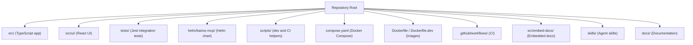
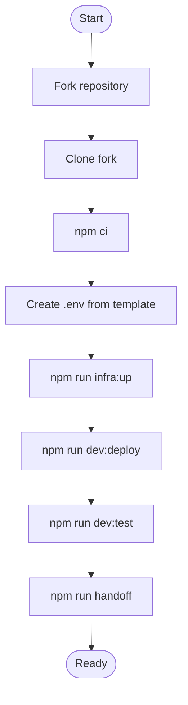
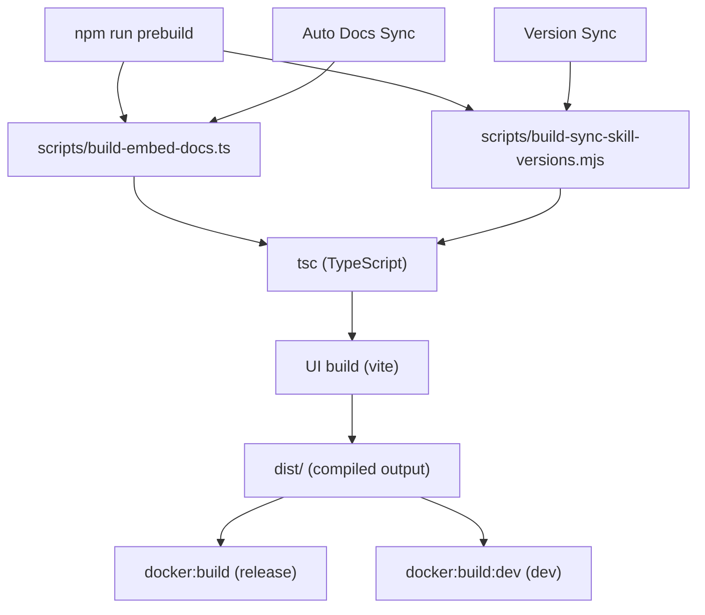
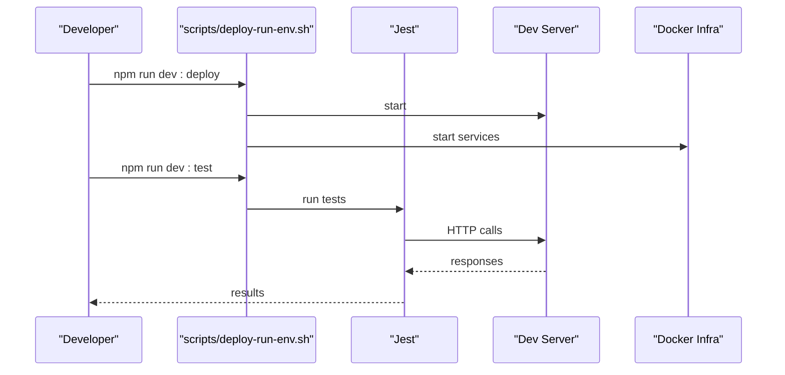
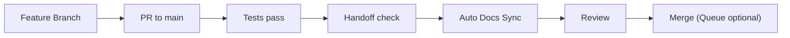
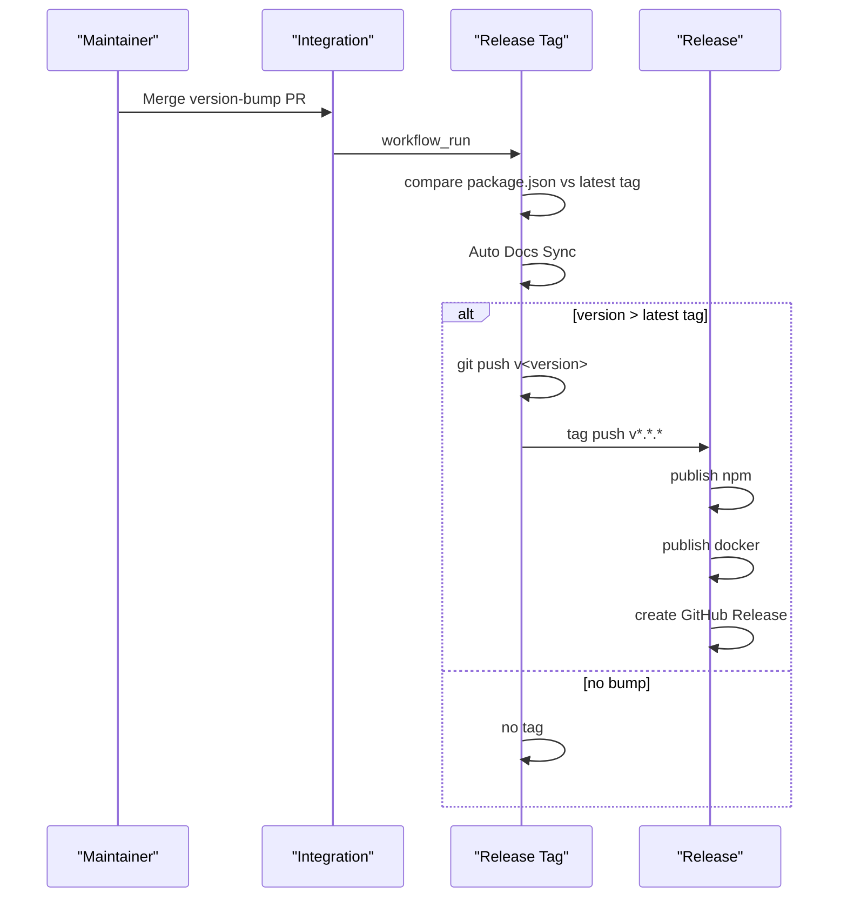
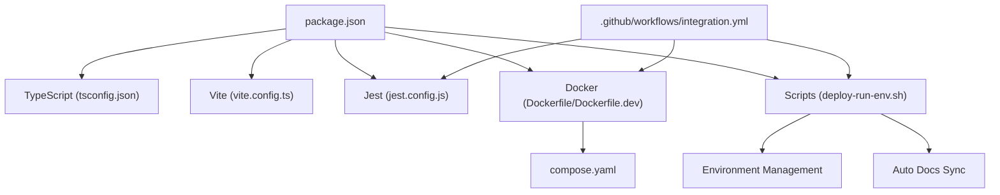

# Contributing & Development

<cite>
**Referenced Files in This Document**
- [CONTRIBUTING.md](file://CONTRIBUTING.md)
- [README.md](file://README.md)
- [package.json](file://package.json)
- [jest.config.js](file://jest.config.js)
- [vite.config.ts](file://vite.config.ts)
- [tsconfig.json](file://tsconfig.json)
- [scripts/deploy-run-env.sh](file://scripts/deploy-run-env.sh)
- [scripts/env/create-env.sh](file://scripts/env/create-env.sh)
- [compose.yaml](file://compose.yaml)
- [Dockerfile](file://Dockerfile)
- [Dockerfile.dev](file://Dockerfile.dev)
- [.github/workflows/integration.yml](file://.github/workflows/integration.yml)
- [.github/workflows/README.md](file://.github/workflows/README.md)
</cite>

## Update Summary
**Changes Made**
- Enhanced project structure documentation to reflect comprehensive development workflow
- Added detailed automated documentation processes and build pipeline information
- Expanded development tools section with new script-based workflows
- Updated CI/CD integration details with automated documentation synchronization
- Improved troubleshooting section with new environment management commands

## Table of Contents
1. [Introduction](#introduction)
2. [Project Structure](#project-structure)
3. [Core Components](#core-components)
4. [Architecture Overview](#architecture-overview)
5. [Detailed Component Analysis](#detailed-component-analysis)
6. [Dependency Analysis](#dependency-analysis)
7. [Performance Considerations](#performance-considerations)
8. [Troubleshooting Guide](#troubleshooting-guide)
9. [Conclusion](#conclusion)
10. [Appendices](#appendices)

## Introduction
This document provides comprehensive contributing and development guidance for KAIROS MCP. It covers local environment setup, build and test procedures, code standards, pull request processes, release management, and community practices. The documentation reflects the current state of the project with emphasis on automated workflows, comprehensive tooling, and integrated development processes.

## Project Structure
KAIROS MCP is a TypeScript application with an HTTP server, React UI, CLI, and extensive integration tests. The repository includes:
- Application source under src/
- Embedded documentation and tooling under src/embed-docs/
- UI under src/ui/
- Tests under tests/ and tests/ui/
- Helm chart under helm/kairos-mcp/
- Scripts for local development and CI under scripts/
- Docker images for production and development under Dockerfile and Dockerfile.dev
- GitHub Actions workflows under .github/workflows/

**Section sources**
- [README.md:94-192](file://README.md#L94-L192)
- [package.json:38-116](file://package.json#L38-L116)

## Core Components
- HTTP server and API: Express-based server exposing MCP, REST, and UI endpoints.
- Qdrant-backed memory store: Persistent vector memory for agent workflows.
- Optional Redis cache/state: Proof-of-work and key-value caching.
- Optional Keycloak auth: Browser sessions and Bearer JWT validation.
- React UI: Served from the same origin at /ui.
- CLI: Talks to the HTTP API for local and remote operations.
- Automated documentation system: Embedded documentation generation and synchronization.

Development commands are npm scripts that orchestrate building, deploying, testing, and infrastructure management with comprehensive environment management capabilities.

**Section sources**
- [README.md:94-104](file://README.md#L94-L104)
- [package.json:38-116](file://package.json#L38-L116)

## Architecture Overview
The development and runtime architecture integrates Docker Compose for local stacks, a Node.js server with TypeScript, a React UI, and optional external services (Qdrant, Redis, Keycloak). CI uses GitHub Actions to validate builds, tests, and container images with automated documentation synchronization.

```mermaid
graph TB
subgraph "Local Dev"
U["User"]
CLI["CLI (kairos)"]
APP["Express App (src/server.ts)"]
UI["React UI (/ui)"]
QD["Qdrant"]
RD["Redis"]
KC["Keycloak"]
ENV["Environment Manager"]
END["End-to-End Tests"]
end
subgraph "Docker Compose"
C1["compose.yaml"]
end
subgraph "CI/CD Pipeline"
GH["GitHub Actions"]
AUTODOCS["Auto Docs Sync"]
BUILD["Build Pipeline"]
TEST["Test Suite"]
PUBLISH["Publish Pipeline"]
end
U --> CLI
CLI --> APP
APP --> UI
APP --> QD
APP --> RD
APP --> KC
ENV --> APP
ENV --> QD
ENV --> RD
ENV --> KC
C1 --> APP
C1 --> QD
C1 --> RD
C1 --> KC
APP --> GH
GH --> AUTODOCS
GH --> BUILD
GH --> TEST
GH --> PUBLISH
```

**Diagram sources**
- [compose.yaml:10-183](file://compose.yaml#L10-L183)
- [README.md:94-104](file://README.md#L94-L104)
- [.github/workflows/integration.yml:571-612](file://.github/workflows/integration.yml#L571-L612)

**Section sources**
- [compose.yaml:10-183](file://compose.yaml#L10-L183)
- [Dockerfile:9-76](file://Dockerfile#L9-L76)
- [Dockerfile.dev:1-68](file://Dockerfile.dev#L1-L68)

## Detailed Component Analysis

### Development Setup and Environment
- Prerequisites: Node.js 24+, Docker and Docker Compose, Git.
- Create .env from the template and configure environment variables for embeddings, Qdrant, Redis, and identity providers.
- Start infrastructure with Docker Compose profiles (minimal or fullstack).
- Deploy and test using npm scripts with comprehensive environment management.

**Section sources**
- [CONTRIBUTING.md:151-327](file://CONTRIBUTING.md#L151-L327)
- [README.md:105-192](file://README.md#L105-L192)
- [scripts/env/create-env.sh:1-12](file://scripts/env/create-env.sh#L1-L12)

### Build Procedures
- Prebuild tasks: sync embedded docs and skill versions, then TypeScript compile.
- UI build: Vite produces static assets under dist/ui.
- Packaging: npm run build compiles TS, builds UI, and prepares CLI.
- Docker: Release image installs the published npm package; dev image builds from source.
- Automated documentation: scripts automatically synchronize embedded documentation during build.

**Section sources**
- [package.json:102-108](file://package.json#L102-L108)
- [vite.config.ts:10-44](file://vite.config.ts#L10-L44)
- [tsconfig.json:1-53](file://tsconfig.json#L1-L53)
- [Dockerfile:30-76](file://Dockerfile#L30-L76)
- [Dockerfile.dev:18-28](file://Dockerfile.dev#L18-L28)

### Testing Requirements
- Tests run against a deployed dev server; deploy first, then run targeted tests.
- Jest configuration supports ESM, coverage thresholds, and global setup/teardown.
- CI runs integration tests with Docker Compose infrastructure and Keycloak.
- UI tests use Playwright; caching is supported across runners.
- Comprehensive test reporting with GitHub Actions integration.

**Section sources**
- [CONTRIBUTING.md:245-294](file://CONTRIBUTING.md#L245-L294)
- [jest.config.js:1-72](file://jest.config.js#L1-72)
- [.github/workflows/integration.yml:260-416](file://.github/workflows/integration.yml#L260-L416)

### Code Standards and Style
- Language: TypeScript for all source files.
- Linter: ESLint; Husky pre-commit hook runs lint and skill checks.
- Imports: Use .js extensions on relative imports (Node ESM).
- Naming: camelCase for variables/functions, PascalCase for classes/types, SCREAMING_SNAKE_CASE for constants.
- Error handling: Prefer typed errors and structured error objects; include error_code and request_id in logs.
- Logger: Use structuredLogger for HTTP/MCP request flow.
- Tests: Place integration tests under tests/integration/.
- Automated documentation: Embedded documentation synchronized during build process.

**Section sources**
- [CONTRIBUTING.md:412-440](file://CONTRIBUTING.md#L412-L440)

### Pull Request and Merge Process
- Branch from main; keep PRs focused and up to date.
- All tests must pass; run the full handoff check locally.
- PR description should document what changed, why, and how to test.
- Merge queue can be enabled for main; use gh pr merge to enqueue.
- Automated documentation synchronization ensures docs stay current.

**Section sources**
- [CONTRIBUTING.md:342-387](file://CONTRIBUTING.md#L342-L387)

### Release Management and Versioning
- Version is driven by package.json; do not create git tags manually.
- Release flow: bump version → open PR to main → merge → Release tag on version bump → Release workflow (publish npm → Docker → GitHub Release).
- CI enforces Node 24 as the merge gate; Node Current is advisory.
- Automated documentation synchronization during release process.

**Diagram sources**
- [.github/workflows/README.md:157-206](file://.github/workflows/README.md#L157-L206)

**Section sources**
- [CONTRIBUTING.md:388-411](file://CONTRIBUTING.md#L388-L411)
- [.github/workflows/README.md:157-206](file://.github/workflows/README.md#L157-L206)

### Deployment Workflow
- Local development: npm run infra:up starts Qdrant, Redis, Postgres, Keycloak; then deploy and test.
- Production: Dockerfile installs the published npm package; compose.yaml defines service dependencies.
- CI builds release-equivalent images and scans with Trivy.
- Environment management: comprehensive script-based environment control with multiple profiles.

**Section sources**
- [CONTRIBUTING.md:295-327](file://CONTRIBUTING.md#L295-L327)
- [compose.yaml:10-183](file://compose.yaml#L10-L183)
- [.github/workflows/integration.yml:571-612](file://.github/workflows/integration.yml#L571-L612)

### Contribution Guidelines and Community Practices
- Follow agent-facing design principles: deterministic execution, structured contracts, recoverable errors.
- Multitenancy audit checklist for Qdrant and Redis access.
- Reporting issues: include description, steps, expected/actual behavior, environment, and logs.
- Feature requests and questions: open an issue.
- Automated documentation: embedded docs synchronized during development and release.

**Section sources**
- [CONTRIBUTING.md:7-146](file://CONTRIBUTING.md#L7-L146)
- [CONTRIBUTING.md:441-462](file://CONTRIBUTING.md#L441-L462)
- [CONTRIBUTING.md:485-504](file://CONTRIBUTING.md#L485-L504)

### Development Tools and Debugging
- Dev scripts: dev:start, dev:stop, dev:restart, dev:logs, dev:status, dev:redis-cli, dev:qdrant-curl.
- Infrastructure: docker compose profiles (minimal/fullstack).
- UI build: Vite with React plugin and asset chunking.
- CI: Parallel jobs for build, UI checks, integration, and Docker verification.
- Environment management: comprehensive script-based control with multiple environments.
- Automated documentation synchronization during build process.

**Section sources**
- [CONTRIBUTING.md:283-327](file://CONTRIBUTING.md#L283-L327)
- [vite.config.ts:10-44](file://vite.config.ts#L10-L44)
- [.github/workflows/integration.yml:13-630](file://.github/workflows/integration.yml#L13-L630)

### Code Review Processes
- Required checks configured in repository settings; Integration workflow passed is the primary required check.
- Advisory lanes run on Node Current; they do not block merges when Node 24 is green.
- Dependabot PRs can auto-merge when checks pass.
- Automated documentation synchronization ensures review consistency.

**Section sources**
- [.github/workflows/README.md:49-67](file://.github/workflows/README.md#L49-L67)
- [.github/workflows/README.md:141-149](file://.github/workflows/README.md#L141-L149)

## Dependency Analysis
The project relies on Node ESM, TypeScript strictness, and a set of libraries for HTTP, auth, UI, and vector operations. CI validates across Node versions and ensures Docker images meet security policies. The dependency graph includes comprehensive tooling for automated documentation, testing, and deployment.

**Diagram sources**
- [package.json:117-183](file://package.json#L117-L183)
- [tsconfig.json:1-53](file://tsconfig.json#L1-L53)
- [vite.config.ts:10-44](file://vite.config.ts#L10-L44)
- [jest.config.js:1-72](file://jest.config.js#L1-72)
- [Dockerfile:9-76](file://Dockerfile#L9-L76)
- [Dockerfile.dev:1-68](file://Dockerfile.dev#L1-L68)
- [compose.yaml:10-183](file://compose.yaml#L10-L183)
- [.github/workflows/integration.yml:13-630](file://.github/workflows/integration.yml#L13-L630)

**Section sources**
- [package.json:117-183](file://package.json#L117-L183)
- [.github/workflows/integration.yml:13-630](file://.github/workflows/integration.yml#L13-L630)

## Performance Considerations
- Keep UI assets chunked and minimize inline images to satisfy CSP.
- Use Redis for caching and proof-of-work state when available.
- Ensure Qdrant is healthy and reachable; slow or failing Qdrant impacts performance.
- Prefer deterministic tool schemas and structured error messages to reduce retries.
- Leverage automated documentation caching to reduce build overhead.
- Utilize environment-specific optimizations for different deployment scenarios.

## Troubleshooting Guide
- Server does not start: check container logs and required ports; ensure Qdrant is ready.
- Health check returns 503: wait for Qdrant to finish starting.
- Embeddings fail on startup: set one working embedding backend in .env.
- Auth-enabled development failing: start fullstack profile and configure realms.
- CLI keeps asking for login: confirm API URL, token validity, and issuer/audience alignment.
- Environment management issues: use scripts/deploy-run-env.sh for comprehensive environment control.
- Automated documentation sync failures: check embedded docs generation scripts.
- CI build failures: verify Node.js version compatibility and dependency resolution.

**Section sources**
- [README.md:346-402](file://README.md#L346-L402)

## Conclusion
This guide consolidates the end-to-end development lifecycle for KAIROS MCP, from environment setup to releases. The comprehensive automated documentation system, environment management tools, and integrated CI/CD pipeline ensure reliable contributions and predictable deployments. The project's emphasis on deterministic execution, structured contracts, and agent-focused design principles creates a robust foundation for AI agent development.

## Appendices

### Appendix A: Key Commands Reference
- Build: npm run dev:build
- Deploy: npm run dev:deploy
- Test: npm run dev:test
- Dev environment controls: dev:start, dev:stop, dev:restart, dev:logs, dev:status
- Infrastructure: npm run infra:up
- Code quality: npm run lint, npm run lint:fix, npm run lint:skills, npm run knip
- Docker: npm run docker:build, npm run docker:build:dev
- Snapshot management: set QDRANT_SNAPSHOT_ON_START and POST /api/snapshot
- Environment management: scripts/deploy-run-env.sh with ENV profiles
- Automated documentation: npm run prebuild (auto-syncs embedded docs)
- Handoff workflow: npm run handoff (complete development cycle)

**Section sources**
- [CONTRIBUTING.md:229-327](file://CONTRIBUTING.md#L229-L327)
- [package.json:38-116](file://package.json#L38-L116)