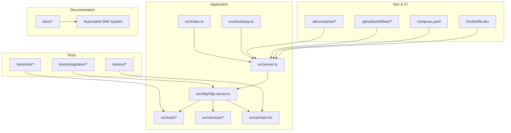
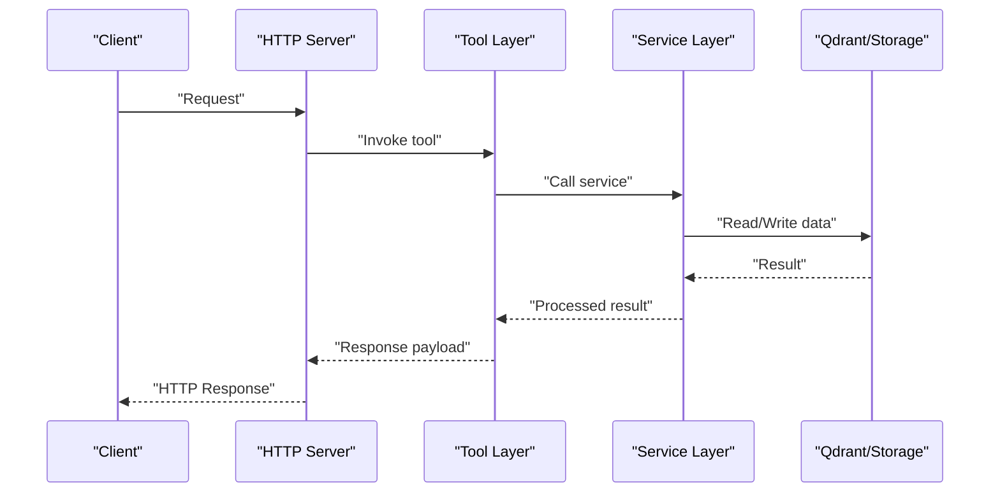
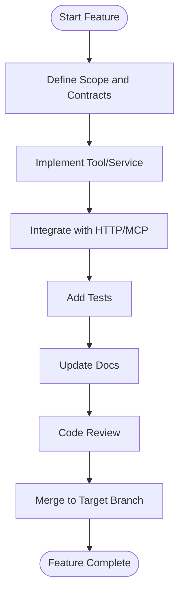

# Contributing and Development

<cite>
**Referenced Files in This Document**
- [CONTRIBUTING.md](file://CONTRIBUTING.md)
- [README.md](file://README.md)
- [.devcontainer/devcontainer.json.base](file://.devcontainer/devcontainer.json.base)
- [.devcontainer/README.md](file://.devcontainer/README.md)
- [.github/workflows](file://.github/workflows)
- [.husky](file://.husky)
- [eslint.config.cjs](file://eslint.config.cjs)
- [jest.config.js](file://jest.config.js)
- [vitest.config.ts](file://vitest.config.ts)
- [tsconfig.json](file://tsconfig.json)
- [package.json](file://package.json)
- [compose.yaml](file://compose.yaml)
- [Dockerfile.dev](file://Dockerfile.dev)
- [scripts/helm-bump-version.mjs](file://scripts/helm-bump-version.mjs)
- [scripts/helm-sync-app-version.mjs](file://scripts/helm-sync-app-version.mjs)
- [helm/kairos-mcp/Chart.yaml](file://helm/kairos-mcp/Chart.yaml)
- [src/server.ts](file://src/server.ts)
- [src/index.ts](file://src/index.ts)
- [src/bootstrap.ts](file://src/bootstrap.ts)
- [src/http/http-server.ts](file://src/http/http-server.ts)
- [src/mcp-apps/list-offerings-for-ui.ts](file://src/mcp-apps/list-offerings-for-ui.ts)
- [src/tools/export.ts](file://src/tools/export.ts)
- [src/services/qdrant/service.ts](file://src/services/qdrant/service.ts)
- [src/services/memory/store.ts](file://src/services/memory/store.ts)
- [src/ui/main.tsx](file://src/ui/main.tsx)
- [tests/integration](file://tests/integration)
- [tests/unit](file://tests/unit)
- [tests/ui](file://tests/ui)
</cite>

## Update Summary
**Changes Made**
- Updated Project Structure section to reflect removal of manual Strategy.md file
- Added clarification about automated documentation system migration
- Updated Community Guidelines section to reference wiki-based contribution process
- Removed references to manual strategy documentation in favor of automated systems

## Table of Contents
1. [Introduction](#introduction)
2. [Project Structure](#project-structure)
3. [Development Environment Setup](#development-environment-setup)
4. [Coding Standards](#coding-standards)
5. [Testing Requirements](#testing-requirements)
6. [Code Review Process](#code-review-process)
7. [Pull Request Guidelines](#pull-request-guidelines)
8. [Release Management](#release-management)
9. [Versioning Strategy](#versioning-strategy)
10. [Changelog Maintenance](#changelog-maintenance)
11. [Architectural Guidelines](#architectural-guidelines)
12. [Design Principles](#design-principles)
13. [Adding New Features](#adding-new-features)
14. [Fixing Bugs](#fixing-bugs)
15. [Improving Existing Functionality](#improving-existing-functionality)
16. [Community Guidelines](#community-guidelines)
17. [Communication Channels](#communication-channels)
18. [Recognition Processes](#recognition-processes)
19. [Troubleshooting Guide](#troubleshooting-guide)
20. [Conclusion](#conclusion)

## Introduction

This document provides comprehensive guidance for contributing to Kairos MCP development. It covers the development environment setup using VS Code dev containers, coding standards, testing requirements, code review processes, pull request workflows, release management, versioning strategy, changelog maintenance, architectural guidelines, design principles, and community contribution practices. The goal is to make it easy for new and experienced contributors to understand how to contribute effectively and consistently.

**Updated** The project has migrated from manual strategy documentation to an automated documentation system, with contributing guidelines now maintained in a structured wiki format for better maintainability and accessibility.

## Project Structure

Kairos MCP is a TypeScript-based application with a modular architecture:
- Core server and HTTP API under src/http
- CLI commands under src/cli
- Tools and business logic under src/tools and src/services
- Embedded UI under src/ui
- Tests organized by type under tests/{unit,integration,ui}
- Dev container configuration under .devcontainer
- GitHub Actions workflows under .github/workflows
- Helm charts under helm
- Documentation under docs

**Diagram sources**
- [src/server.ts](file://src/server.ts)
- [src/index.ts](file://src/index.ts)
- [src/bootstrap.ts](file://src/bootstrap.ts)
- [src/http/http-server.ts](file://src/http/http-server.ts)
- [src/ui/main.tsx](file://src/ui/main.tsx)
- [.devcontainer/README.md](file://.devcontainer/README.md)
- [.github/workflows](file://.github/workflows)
- [compose.yaml](file://compose.yaml)
- [Dockerfile.dev](file://Dockerfile.dev)

**Section sources**
- [README.md](file://README.md)
- [src/server.ts](file://src/server.ts)
- [src/index.ts](file://src/index.ts)
- [src/bootstrap.ts](file://src/bootstrap.ts)
- [src/http/http-server.ts](file://src/http/http-server.ts)
- [src/ui/main.tsx](file://src/ui/main.tsx)
- [.devcontainer/README.md](file://.devcontainer/README.md)
- [.github/workflows](file://.github/workflows)
- [compose.yaml](file://compose.yaml)
- [Dockerfile.dev](file://Dockerfile.dev)

## Development Environment Setup

Use VS Code dev containers to ensure consistent local development:
- Open the repository in VS Code and use the "Reopen in Container" command or follow instructions in the dev container README.
- The base dev container configuration is provided; extend as needed via compose overrides.
- Local services (e.g., databases, caches) can be started with Docker Compose using the provided compose file.

Key steps:
- Install VS Code and Docker.
- Use the dev container profile that matches your needs (fullstack or minimal).
- Start dependent services with Docker Compose before running the app.
- Verify the server starts and health endpoints respond.

**Section sources**
- [.devcontainer/README.md](file://.devcontainer/README.md)
- [.devcontainer/devcontainer.json.base](file://.devcontainer/devcontainer.json.base)
- [compose.yaml](file://compose.yaml)
- [Dockerfile.dev](file://Dockerfile.dev)

## Coding Standards

- Language and tooling:
  - TypeScript project configured with tsconfig.json.
  - ESLint flat config used for linting rules.
  - Husky hooks enforce pre-commit checks.
- Formatting and style:
  - Follow existing patterns in src and tests.
  - Keep imports grouped and sorted per team conventions.
- Naming and structure:
  - Prefer small, focused modules with clear responsibilities.
  - Use descriptive names for functions, variables, and files.
- Error handling:
  - Centralize error handling in HTTP layer where applicable.
  - Return structured errors with actionable messages.
- Logging and metrics:
  - Use structured logging utilities.
  - Expose relevant metrics for observability.

**Section sources**
- [eslint.config.cjs](file://eslint.config.cjs)
- [.husky](file://.husky)
- [tsconfig.json](file://tsconfig.json)

## Testing Requirements

- Test frameworks:
  - Jest for unit and integration tests.
  - Vitest for UI tests.
- Test organization:
  - Unit tests under tests/unit.
  - Integration tests under tests/integration.
  - UI tests under tests/ui.
- Running tests:
  - Use npm scripts defined in package.json to run all tests or specific suites.
  - Ensure environment dependencies are available for integration tests.
- Quality gates:
  - All tests must pass before merging.
  - Add tests for new features and bug fixes.

**Section sources**
- [jest.config.js](file://jest.config.js)
- [vitest.config.ts](file://vitest.config.ts)
- [package.json](file://package.json)
- [tests/unit](file://tests/unit)
- [tests/integration](file://tests/integration)
- [tests/ui](file://tests/ui)

## Code Review Process

- Pull requests should include:
  - Clear description of changes and rationale.
  - Links to related issues or specs when applicable.
  - Updated tests and documentation if needed.
- Review checklist:
  - Does the change meet coding standards?
  - Are there sufficient tests covering the change?
  - Is the change backward compatible or properly versioned?
  - Are there any security or performance implications?
- Feedback and iteration:
  - Address reviewer comments promptly.
  - Re-run tests and linters after updates.

## Pull Request Guidelines

- Branching:
  - Create feature branches from main or the appropriate target branch.
  - Use descriptive branch names (e.g., feat/add-export-tool, fix/auth-error-handling).
- Commit hygiene:
  - Write concise, meaningful commit messages.
  - Keep commits atomic and logically grouped.
- PR template:
  - Fill out all required fields in the PR template.
  - Include screenshots or recordings for UI changes.
- CI expectations:
  - Ensure all CI checks pass (lint, test, build).
  - Resolve conflicts before requesting review.

## Release Management

- Pre-release validation:
  - Run full test suites locally and in CI.
  - Validate Helm chart packaging and values.
- Publishing artifacts:
  - Build Docker images using provided Dockerfiles.
  - Package Helm charts and update versions accordingly.
- Post-release verification:
  - Confirm deployment on staging environments.
  - Monitor logs and metrics for anomalies.

**Section sources**
- [Dockerfile.dev](file://Dockerfile.dev)
- [helm/kairos-mcp/Chart.yaml](file://helm/kairos-mcp/Chart.yaml)
- [scripts/helm-bump-version.mjs](file://scripts/helm-bump-version.mjs)
- [scripts/helm-sync-app-version.mjs](file://scripts/helm-sync-app-version.mjs)

## Versioning Strategy

- Semantic versioning:
  - MAJOR for incompatible API changes.
  - MINOR for backward-compatible functionality additions.
  - PATCH for backward-compatible bug fixes.
- Chart and app version alignment:
  - Use scripts to synchronize Helm chart versions with application versions.
- Deprecation policy:
  - Announce deprecations in advance and provide migration paths.

**Section sources**
- [scripts/helm-bump-version.mjs](file://scripts/helm-bump-version.mjs)
- [scripts/helm-sync-app-version.mjs](file://scripts/helm-sync-app-version.mjs)
- [helm/kairos-mcp/Chart.yaml](file://helm/kairos-mcp/Chart.yaml)

## Changelog Maintenance

- Maintain a changelog reflecting user-facing changes.
- Categorize entries (Features, Fixes, Breaking Changes, Docs, etc.).
- Link PRs and issues to changelog entries for traceability.
- Update changelog during release preparation.

## Architectural Guidelines

- Layered architecture:
  - HTTP layer handles routing, middleware, and response formatting.
  - Tool layer encapsulates business operations.
  - Service layer abstracts storage and external integrations.
- Modularity:
  - Keep components cohesive and loosely coupled.
  - Favor composition over inheritance.
- Observability:
  - Emit metrics and logs at key boundaries.
  - Provide health endpoints for readiness and liveness.

**Diagram sources**
- [src/http/http-server.ts](file://src/http/http-server.ts)
- [src/tools/export.ts](file://src/tools/export.ts)
- [src/services/qdrant/service.ts](file://src/services/qdrant/service.ts)

**Section sources**
- [src/server.ts](file://src/server.ts)
- [src/index.ts](file://src/index.ts)
- [src/bootstrap.ts](file://src/bootstrap.ts)
- [src/http/http-server.ts](file://src/http/http-server.ts)
- [src/tools/export.ts](file://src/tools/export.ts)
- [src/services/qdrant/service.ts](file://src/services/qdrant/service.ts)

## Design Principles

- Simplicity:
  - Prefer straightforward solutions that are easy to understand and maintain.
- Extensibility:
  - Design interfaces and contracts to allow future enhancements without breaking changes.
- Reliability:
  - Implement robust error handling and retries where appropriate.
- Security:
  - Validate inputs, sanitize outputs, and follow least privilege access.
- Performance:
  - Optimize hot paths and avoid unnecessary allocations.

## Adding New Features

Steps:
- Identify the feature scope and impact.
- Add corresponding tools and services under src/tools and src/services.
- Expose new capabilities via HTTP routes or MCP offerings.
- Write unit and integration tests.
- Update documentation and examples.

**Section sources**
- [src/tools/export.ts](file://src/tools/export.ts)
- [src/mcp-apps/list-offerings-for-ui.ts](file://src/mcp-apps/list-offerings-for-ui.ts)
- [src/http/http-server.ts](file://src/http/http-server.ts)

## Fixing Bugs

Steps:
- Reproduce the issue and add a failing test case.
- Implement the fix with minimal changes.
- Ensure existing tests continue to pass.
- Add regression tests to prevent recurrence.
- Document known limitations if applicable.

**Section sources**
- [tests/integration](file://tests/integration)
- [tests/unit](file://tests/unit)

## Improving Existing Functionality

Guidelines:
- Profile and measure current performance.
- Refactor incrementally with tests guarding behavior.
- Update schemas and contracts carefully to maintain compatibility.
- Communicate changes through PR descriptions and docs.

**Section sources**
- [src/services/memory/store.ts](file://src/services/memory/store.ts)
- [src/services/qdrant/service.ts](file://src/services/qdrant/service.ts)

## Community Guidelines

- Be respectful and inclusive in discussions.
- Focus on constructive feedback and collaboration.
- Follow the code of conduct and legal notices.
- Acknowledge contributions and recognize effort.

**Updated** The project has transitioned from manual strategy documentation to an automated documentation system. All contributing guidelines, development approaches, and project strategies are now maintained in a structured wiki format for better accessibility and maintainability. Contributors should refer to the wiki pages for up-to-date project direction and development guidelines rather than looking for standalone strategy documents.

## Communication Channels

- Use GitHub Issues for bug reports and feature requests.
- Engage in PR discussions for technical decisions.
- Refer to documentation for setup and usage details.
- Check the wiki for project strategy and development guidelines.

**Updated** With the migration to automated documentation, the wiki serves as the central source for project strategy, development approaches, and contributing guidelines.

## Recognition Processes

- Contributors are recognized through:
  - Commits and PR authorship.
  - Mentions in release notes and changelogs.
  - Community acknowledgments in discussions.

## Troubleshooting Guide

Common issues and resolutions:
- Dev container not starting:
  - Ensure Docker is running and permissions are correct.
  - Check compose services status and logs.
- Tests failing due to missing services:
  - Start dependent services via Docker Compose.
  - Verify environment variables and URLs.
- Linting errors:
  - Run linter locally and fix reported issues.
  - Ensure Husky hooks are installed.

**Section sources**
- [.devcontainer/README.md](file://.devcontainer/README.md)
- [compose.yaml](file://compose.yaml)
- [eslint.config.cjs](file://eslint.config.cjs)
- [.husky](file://.husky)

## Conclusion

Contributing to Kairos MCP involves setting up a consistent development environment, adhering to coding standards, writing thorough tests, following code review practices, and aligning with the release and versioning strategy. By following these guidelines, contributors can help improve the project's quality, reliability, and extensibility while collaborating effectively within the community.

**Updated** The project's commitment to maintaining high-quality documentation through automated systems ensures that contributors always have access to current and accurate information about development practices, project strategy, and contribution guidelines.