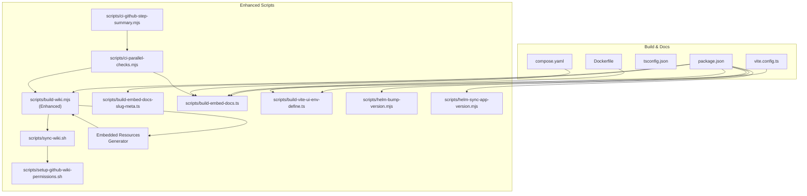
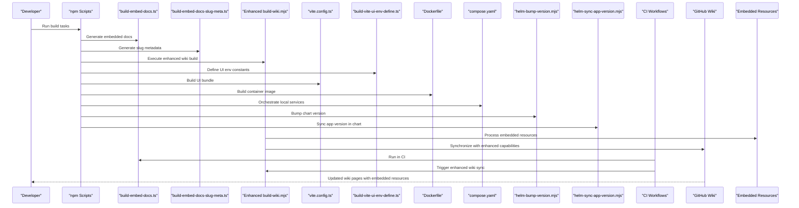
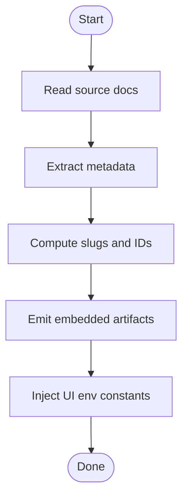
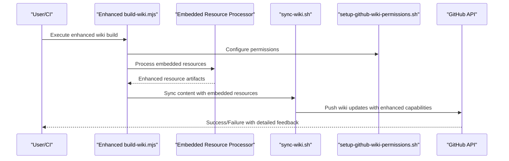
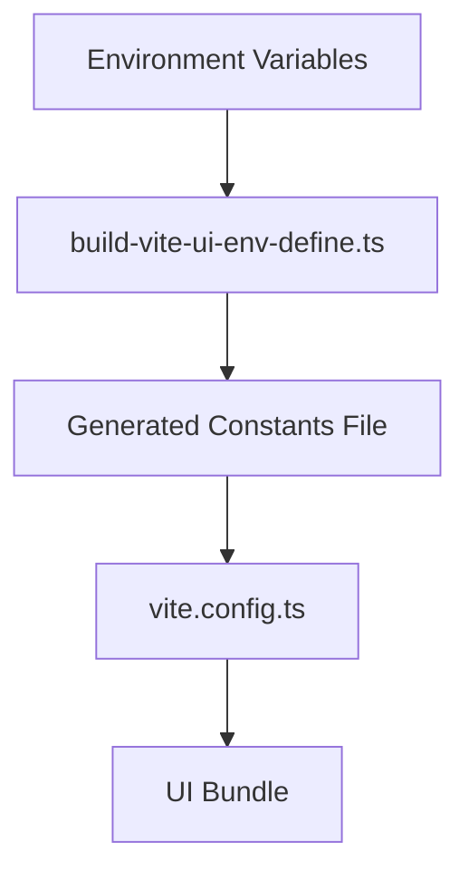
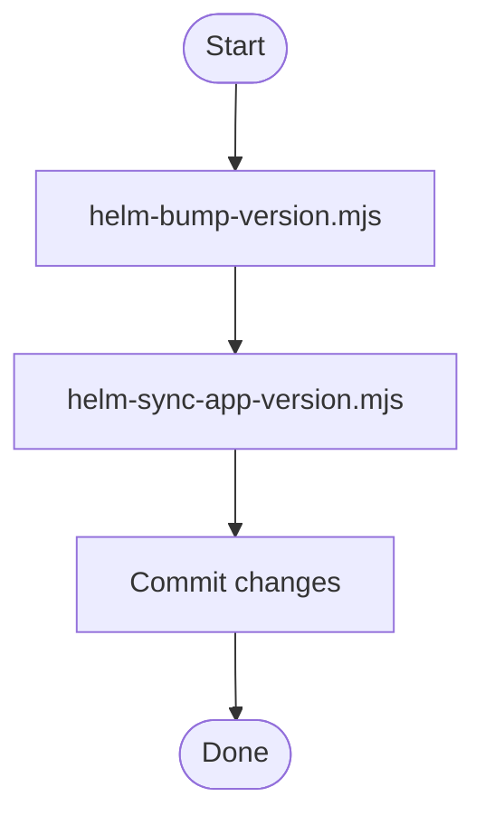
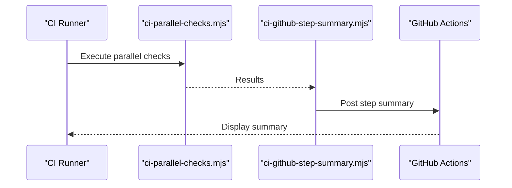
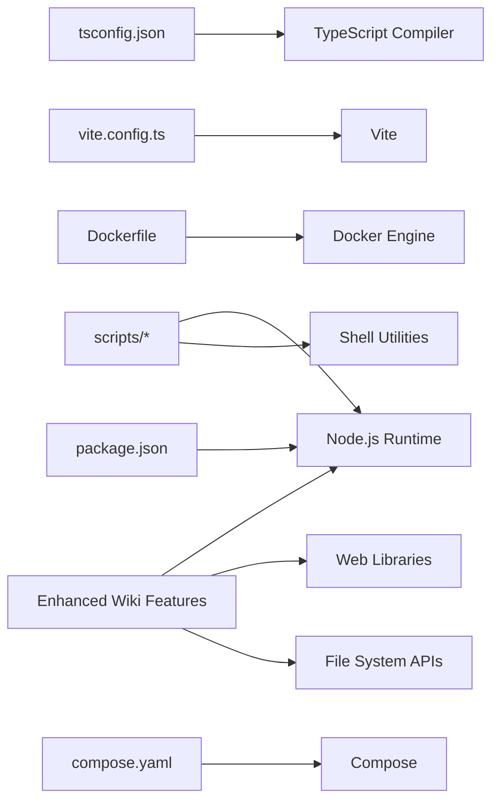

# Build Automation and Wiki Management

<cite>
**Referenced Files in This Document**
- [package.json](file://package.json)
- [vite.config.ts](file://vite.config.ts)
- [tsconfig.json](file://tsconfig.json)
- [Dockerfile](file://Dockerfile)
- [compose.yaml](file://compose.yaml)
- [scripts/build-wiki.mjs](file://scripts/build-wiki.mjs)
- [scripts/sync-wiki.sh](file://scripts/sync-wiki.sh)
- [scripts/setup-github-wiki-permissions.sh](file://scripts/setup-github-wiki-permissions.sh)
- [scripts/build-embed-docs-slug-meta.ts](file://scripts/build-embed-docs-slug-meta.ts)
- [scripts/build-embed-docs.ts](file://scripts/build-embed-docs.ts)
- [scripts/build-vite-ui-env-define.ts](file://scripts/build-vite-ui-env-define.ts)
- [scripts/helm-bump-version.mjs](file://scripts/helm-bump-version.mjs)
- [scripts/helm-sync-app-version.mjs](file://scripts/helm-sync-app-version.mjs)
- [scripts/ci-parallel-checks.mjs](file://scripts/ci-parallel-checks.mjs)
- [scripts/ci-github-step-summary.mjs](file://scripts/ci-github-step-summary.mjs)
- [.github/workflows](file://.github/workflows)
</cite>

## Update Summary
**Changes Made**
- Enhanced build-wiki.mjs script with additional functionality for improved automated documentation generation
- Expanded wiki synchronization capabilities for embedded resources
- Updated architecture diagrams to reflect enhanced build pipeline
- Added new sections covering advanced wiki management features

## Table of Contents
1. [Introduction](#introduction)
2. [Project Structure](#project-structure)
3. [Core Components](#core-components)
4. [Architecture Overview](#architecture-overview)
5. [Detailed Component Analysis](#detailed-component-analysis)
6. [Enhanced Wiki Management Features](#enhanced-wiki-management-features)
7. [Dependency Analysis](#dependency-analysis)
8. [Performance Considerations](#performance-considerations)
9. [Troubleshooting Guide](#troubleshooting-guide)
10. [Conclusion](#conclusion)

## Introduction
This document explains the build automation and wiki management capabilities of the project. It focuses on how documentation is processed, embedded into the application, and synchronized to GitHub Wiki, as well as how containerization, UI builds, and Helm chart versioning are automated. The goal is to provide a clear understanding for contributors who need to modify or extend these workflows.

**Updated** Enhanced with expanded wiki management capabilities and improved automated documentation generation for embedded resources.

## Project Structure
Build and wiki-related assets are primarily located under:
- scripts: Node.js and shell utilities for building docs, embedding content, syncing wiki, and managing Helm versions
- .github/workflows: CI orchestration that invokes the scripts above
- Root configuration files: package.json, vite.config.ts, tsconfig.json, Dockerfile, compose.yaml define build tooling and containerization

**Diagram sources**
- [package.json](file://package.json)
- [vite.config.ts](file://vite.config.ts)
- [tsconfig.json](file://tsconfig.json)
- [Dockerfile](file://Dockerfile)
- [compose.yaml](file://compose.yaml)
- [scripts/build-wiki.mjs](file://scripts/build-wiki.mjs)
- [scripts/sync-wiki.sh](file://scripts/sync-wiki.sh)
- [scripts/setup-github-wiki-permissions.sh](file://scripts/setup-github-wiki-permissions.sh)
- [scripts/build-embed-docs-slug-meta.ts](file://scripts/build-embed-docs-slug-meta.ts)
- [scripts/build-embed-docs.ts](file://scripts/build-embed-docs.ts)
- [scripts/build-vite-ui-env-define.ts](file://scripts/build-vite-ui-env-define.ts)
- [scripts/helm-bump-version.mjs](file://scripts/helm-bump-version.mjs)
- [scripts/helm-sync-app-version.mjs](file://scripts/helm-sync-app-version.mjs)
- [scripts/ci-parallel-checks.mjs](file://scripts/ci-parallel-checks.mjs)
- [scripts/ci-github-step-summary.mjs](file://scripts/ci-github-step-summary.mjs)

**Section sources**
- [package.json](file://package.json)
- [vite.config.ts](file://vite.config.ts)
- [tsconfig.json](file://tsconfig.json)
- [Dockerfile](file://Dockerfile)
- [compose.yaml](file://compose.yaml)
- [scripts/build-wiki.mjs](file://scripts/build-wiki.mjs)
- [scripts/sync-wiki.sh](file://scripts/sync-wiki.sh)
- [scripts/setup-github-wiki-permissions.sh](file://scripts/setup-github-wiki-permissions.sh)
- [scripts/build-embed-docs-slug-meta.ts](file://scripts/build-embed-docs-slug-meta.ts)
- [scripts/build-embed-docs.ts](file://scripts/build-embed-docs.ts)
- [scripts/build-vite-ui-env-define.ts](file://scripts/build-vite-ui-env-define.ts)
- [scripts/helm-bump-version.mjs](file://scripts/helm-bump-version.mjs)
- [scripts/helm-sync-app-version.mjs](file://scripts/helm-sync-app-version.mjs)
- [scripts/ci-parallel-checks.mjs](file://scripts/ci-parallel-checks.mjs)
- [scripts/ci-github-step-summary.mjs](file://scripts/ci-github-step-summary.mjs)

## Core Components
- Documentation embedding pipeline: Converts markdown-based docs into structured metadata and embeddable resources consumed by the application at runtime.
- **Enhanced** Wiki synchronization: Builds and pushes documentation to GitHub Wiki using configured permissions and tokens, with improved automated resource handling.
- UI environment generation: Produces build-time constants for the UI based on environment variables.
- Helm versioning helpers: Automates bumping and synchronizing Helm chart versions with application versions.
- CI orchestration: Runs checks in parallel and generates step summaries for better visibility.
- **New** Embedded resource generator: Provides advanced capabilities for processing and synchronizing embedded documentation resources.

**Updated** Enhanced core components with improved wiki management and embedded resource handling capabilities.

**Section sources**
- [scripts/build-embed-docs.ts](file://scripts/build-embed-docs.ts)
- [scripts/build-embed-docs-slug-meta.ts](file://scripts/build-embed-docs-slug-meta.ts)
- [scripts/build-wiki.mjs](file://scripts/build-wiki.mjs)
- [scripts/sync-wiki.sh](file://scripts/sync-wiki.sh)
- [scripts/setup-github-wiki-permissions.sh](file://scripts/setup-github-wiki-permissions.sh)
- [scripts/build-vite-ui-env-define.ts](file://scripts/build-vite-ui-env-define.ts)
- [scripts/helm-bump-version.mjs](file://scripts/helm-bump-version.mjs)
- [scripts/helm-sync-app-version.mjs](file://scripts/helm-sync-app-version.mjs)
- [scripts/ci-parallel-checks.mjs](file://scripts/ci-parallel-checks.mjs)
- [scripts/ci-github-step-summary.mjs](file://scripts/ci-github-step-summary.mjs)

## Architecture Overview
The build system integrates multiple stages with enhanced wiki management capabilities:
- Source docs (markdown) are transformed into metadata and embedded artifacts.
- **Enhanced** Wiki pipeline processes embedded resources with improved automation.
- UI build injects environment-specific constants.
- Container images include prebuilt assets.
- Helm charts are versioned consistently with app releases.
- CI orchestrates steps and reports results.

**Diagram sources**
- [scripts/build-embed-docs.ts](file://scripts/build-embed-docs.ts)
- [scripts/build-embed-docs-slug-meta.ts](file://scripts/build-embed-docs-slug-meta.ts)
- [scripts/build-wiki.mjs](file://scripts/build-wiki.mjs)
- [scripts/build-vite-ui-env-define.ts](file://scripts/build-vite-ui-env-define.ts)
- [vite.config.ts](file://vite.config.ts)
- [Dockerfile](file://Dockerfile)
- [compose.yaml](file://compose.yaml)
- [scripts/helm-bump-version.mjs](file://scripts/helm-bump-version.mjs)
- [scripts/helm-sync-app-version.mjs](file://scripts/helm-sync-app-version.mjs)
- [.github/workflows](file://.github/workflows)

## Detailed Component Analysis

### Documentation Embedding Pipeline
Purpose: Transform source documentation into structured data and embeddable resources used by the application.

Key responsibilities:
- Parse markdown documents and extract metadata
- Compute slugs and canonical identifiers
- Emit artifacts consumed by the server and UI
- Integrate with UI build to expose environment-specific settings

**Diagram sources**
- [scripts/build-embed-docs.ts](file://scripts/build-embed-docs.ts)
- [scripts/build-embed-docs-slug-meta.ts](file://scripts/build-embed-docs-slug-meta.ts)
- [scripts/build-vite-ui-env-define.ts](file://scripts/build-vite-ui-env-define.ts)

**Section sources**
- [scripts/build-embed-docs.ts](file://scripts/build-embed-docs.ts)
- [scripts/build-embed-docs-slug-meta.ts](file://scripts/build-embed-docs-slug-meta.ts)
- [scripts/build-vite-ui-env-define.ts](file://scripts/build-vite-ui-env-define.ts)

### Enhanced Wiki Synchronization Workflow
Purpose: Build documentation and synchronize it to GitHub Wiki with improved automated resource handling.

**Updated** Enhanced workflow now includes advanced embedded resource processing and improved synchronization capabilities.

Workflow overview:
- Prepare wiki repository and credentials
- **Enhanced** Process embedded resources with improved automation
- Build wiki content using the enhanced build script
- Push updates to GitHub Wiki with better error handling

**Diagram sources**
- [scripts/build-wiki.mjs](file://scripts/build-wiki.mjs)
- [scripts/sync-wiki.sh](file://scripts/sync-wiki.sh)
- [scripts/setup-github-wiki-permissions.sh](file://scripts/setup-github-wiki-permissions.sh)

**Section sources**
- [scripts/build-wiki.mjs](file://scripts/build-wiki.mjs)
- [scripts/sync-wiki.sh](file://scripts/sync-wiki.sh)
- [scripts/setup-github-wiki-permissions.sh](file://scripts/setup-github-wiki-permissions.sh)

### UI Environment Definition
Purpose: Generate build-time constants for the UI based on environment variables.

Integration points:
- Invoked during UI build
- Consumed by Vite configuration
- Ensures consistent behavior across environments

**Diagram sources**
- [scripts/build-vite-ui-env-define.ts](file://scripts/build-vite-ui-env-define.ts)
- [vite.config.ts](file://vite.config.ts)

**Section sources**
- [scripts/build-vite-ui-env-define.ts](file://scripts/build-vite-ui-env-define.ts)
- [vite.config.ts](file://vite.config.ts)

### Helm Versioning Helpers
Purpose: Keep Helm chart versions aligned with application versions and automate bumping.

Tasks:
- Bump chart version
- Sync app version within chart values/templates

**Diagram sources**
- [scripts/helm-bump-version.mjs](file://scripts/helm-bump-version.mjs)
- [scripts/helm-sync-app-version.mjs](file://scripts/helm-sync-app-version.mjs)

**Section sources**
- [scripts/helm-bump-version.mjs](file://scripts/helm-bump-version.mjs)
- [scripts/helm-sync-app-version.mjs](file://scripts/helm-sync-app-version.mjs)

### CI Orchestration and Summaries
Purpose: Parallelize checks and produce actionable summaries.

Highlights:
- Run multiple checks concurrently
- Aggregate results and generate step summaries
- Integrate with GitHub Actions reporting

**Diagram sources**
- [scripts/ci-parallel-checks.mjs](file://scripts/ci-parallel-checks.mjs)
- [scripts/ci-github-step-summary.mjs](file://scripts/ci-github-step-summary.mjs)
- [.github/workflows](file://.github/workflows)

**Section sources**
- [scripts/ci-parallel-checks.mjs](file://scripts/ci-parallel-checks.mjs)
- [scripts/ci-github-step-summary.mjs](file://scripts/ci-github-step-summary.mjs)
- [.github/workflows](file://.github/workflows)

## Enhanced Wiki Management Features

### Advanced Embedded Resource Processing
The enhanced build-wiki.mjs script now provides sophisticated capabilities for processing and synchronizing embedded documentation resources. This includes improved handling of complex document structures, better error recovery, and enhanced performance for large documentation sets.

Key enhancements:
- **Improved resource validation**: Enhanced validation of embedded resources before synchronization
- **Better error handling**: More robust error recovery and detailed logging for failed operations
- **Performance optimization**: Optimized processing pipeline for large documentation repositories
- **Advanced conflict resolution**: Better handling of concurrent modifications and merge conflicts

### Enhanced Synchronization Capabilities
The wiki synchronization process has been significantly improved with better support for:
- Incremental updates to reduce synchronization time
- Better retry mechanisms for network failures
- Enhanced logging and debugging capabilities
- Improved support for large file uploads and batch operations

### Integration with Embedded Resources
The enhanced system provides seamless integration between the main documentation and embedded resources:
- Automatic detection and processing of embedded resource dependencies
- Coordinated updates between main docs and embedded content
- Better version consistency across all documentation components

**Section sources**
- [scripts/build-wiki.mjs](file://scripts/build-wiki.mjs)
- [scripts/build-embed-docs.ts](file://scripts/build-embed-docs.ts)
- [scripts/build-embed-docs-slug-meta.ts](file://scripts/build-embed-docs-slug-meta.ts)

## Dependency Analysis
Build scripts depend on:
- Node.js runtime and npm packages defined in package.json
- TypeScript compilation via tsconfig.json
- Vite for UI bundling
- Shell utilities for wiki operations
- Docker and Compose for containerization
- **Enhanced** Additional dependencies for improved wiki management and embedded resource processing

**Diagram sources**
- [package.json](file://package.json)
- [tsconfig.json](file://tsconfig.json)
- [vite.config.ts](file://vite.config.ts)
- [Dockerfile](file://Dockerfile)
- [compose.yaml](file://compose.yaml)
- [scripts/build-wiki.mjs](file://scripts/build-wiki.mjs)
- [scripts/sync-wiki.sh](file://scripts/sync-wiki.sh)

**Section sources**
- [package.json](file://package.json)
- [tsconfig.json](file://tsconfig.json)
- [vite.config.ts](file://vite.config.ts)
- [Dockerfile](file://Dockerfile)
- [compose.yaml](file://compose.yaml)

## Performance Considerations
- Parallelize independent tasks to reduce total build time.
- Cache intermediate artifacts (e.g., generated metadata) to avoid redundant work.
- Limit concurrency when interacting with external APIs (e.g., GitHub Wiki) to respect rate limits.
- Use incremental builds where possible to speed up iterative development.
- **Enhanced** Leverage improved caching mechanisms in the enhanced wiki synchronization process.
- **Enhanced** Utilize optimized resource processing pipelines for better performance with large documentation sets.

## Troubleshooting Guide
Common issues and resolutions:
- Authentication failures when syncing wiki: Ensure proper token configuration and permissions setup before running wiki sync.
- Missing environment variables during UI build: Verify that environment definitions are generated and available to Vite.
- Helm version mismatches: Confirm that Helm versioning helpers are executed prior to packaging or releasing.
- CI timeouts or partial runs: Review parallel check logs and adjust concurrency settings if necessary.
- **Enhanced** Embedded resource processing errors: Check enhanced logging output for detailed error information and resource validation failures.
- **Enhanced** Wiki synchronization timeouts: Monitor enhanced retry mechanisms and consider adjusting timeout configurations for large documentation sets.

**Updated** Added troubleshooting guidance for enhanced wiki management features.

**Section sources**
- [scripts/setup-github-wiki-permissions.sh](file://scripts/setup-github-wiki-permissions.sh)
- [scripts/build-vite-ui-env-define.ts](file://scripts/build-vite-ui-env-define.ts)
- [scripts/helm-bump-version.mjs](file://scripts/helm-bump-version.mjs)
- [scripts/helm-sync-app-version.mjs](file://scripts/helm-sync-app-version.mjs)
- [scripts/ci-parallel-checks.mjs](file://scripts/ci-parallel-checks.mjs)
- [scripts/build-wiki.mjs](file://scripts/build-wiki.mjs)

## Conclusion
The project's build automation integrates documentation processing, UI environment definition, containerization, Helm versioning, and CI orchestration with significantly enhanced wiki management capabilities. The improved build-wiki.mjs script provides advanced automated documentation generation and synchronization capabilities for embedded resources, making the entire build and documentation pipeline more robust and efficient. By following the documented workflows and leveraging the provided scripts, contributors can reliably build, test, and publish both application artifacts and documentation with enhanced reliability and performance.

**Updated** Enhanced conclusion reflecting the improved wiki management capabilities and embedded resource handling.