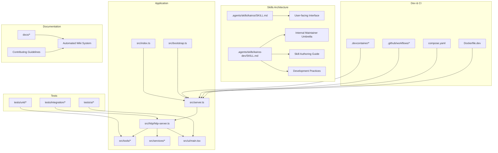
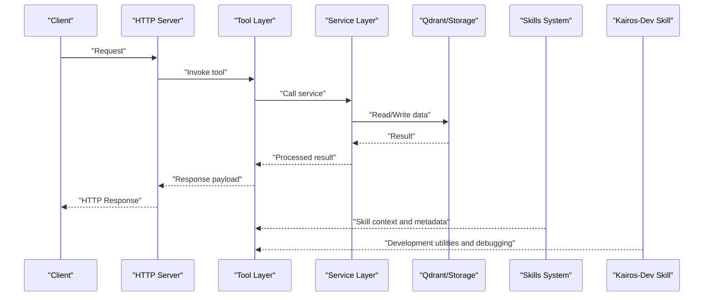
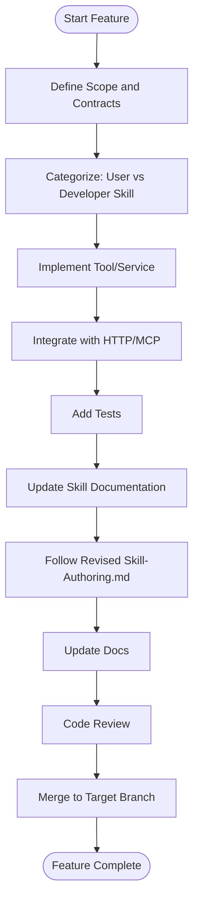

# Contributing and Development

<cite>
**Referenced Files in This Document**
- [CONTRIBUTING.md](file://CONTRIBUTING.md)
- [README.md](file://README.md)
- [.agents/skills/kairos/SKILL.md](file://.agents/skills/kairos/SKILL.md)
- [.agents/skills/kairos-dev/SKILL.md](file://.agents/skills/kairos-dev/SKILL.md)
- [.devcontainer/devcontainer.json.base](file://.devcontainer/devcontainer.json.base)
- [.devcontainer/README.md](file://.devcontainer/README.md)
- [.github/workflows](file://.github/workflows)
- [.husky](file://.husky)
- [eslint.config.cjs](file://eslint.config.cjs)
- [jest.config.js](file://jest.config.js)
- [vitest.config.ts](file://vitest.config.ts)
- [tsconfig.json](file://tsconfig.json)
- [package.json](file://package.json)
- [compose.yaml](file://compose.yaml)
- [Dockerfile.dev](file://Dockerfile.dev)
- [scripts/helm-bump-version.mjs](file://scripts/helm-bump-version.mjs)
- [scripts/helm-sync-app-version.mjs](file://scripts/helm-sync-app-version.mjs)
- [helm/kairos-mcp/Chart.yaml](file://helm/kairos-mcp/Chart.yaml)
- [src/server.ts](file://src/server.ts)
- [src/index.ts](file://src/index.ts)
- [src/bootstrap.ts](file://src/bootstrap.ts)
- [src/http/http-server.ts](file://src/http/http-server.ts)
- [src/mcp-apps/list-offerings-for-ui.ts](file://src/mcp-apps/list-offerings-for-ui.ts)
- [src/tools/export.ts](file://src/tools/export.ts)
- [src/services/qdrant/service.ts](file://src/services/qdrant/service.ts)
- [src/services/memory/store.ts](file://src/services/memory/store.ts)
- [src/ui/main.tsx](file://src/ui/main.tsx)
- [tests/integration](file://tests/integration)
- [tests/unit](file://tests/unit)
- [tests/ui](file://tests/ui)
</cite>

## Update Summary
**Changes Made**
- Updated Skills Organization section to reflect the complete restructuring from 15 individual skills to two consolidated discoverable skills under .agents/skills/
- Added documentation for the new 'kairos' skill as user-facing interface and 'kairos-dev' as internal maintainer umbrella skill
- Removed references to old skills directory structure and SKILLS.md file
- Updated development environment setup to reference new skills organization
- Enhanced contributor guidelines for working with the new skill architecture
- Updated kairos-dev skill references including major revisions to skill-authoring.md with 57 additions and 29 deletions
- Updated references for bugfix-ship.md, build-test.md, dev-environment.md, mcp-qa-e2e.md, release-semver.md, ui-spec.md, and worktree-env.md reflecting current development practices and tooling changes

## Table of Contents
1. [Introduction](#introduction)
2. [Project Structure](#project-structure)
3. [Skills Organization](#skills-organization)
4. [Development Environment Setup](#development-environment-setup)
5. [Coding Standards](#coding-standards)
6. [Testing Requirements](#testing-requirements)
7. [Code Review Process](#code-review-process)
8. [Pull Request Guidelines](#pull-request-guidelines)
9. [Release Management](#release-management)
10. [Versioning Strategy](#versioning-strategy)
11. [Changelog Maintenance](#changelog-maintenance)
12. [Architectural Guidelines](#architectural-guidelines)
13. [Design Principles](#design-principles)
14. [Adding New Features](#adding-new-features)
15. [Fixing Bugs](#fixing-bugs)
16. [Improving Existing Functionality](#improving-existing-functionality)
17. [Community Guidelines](#community-guidelines)
18. [Communication Channels](#communication-channels)
19. [Recognition Processes](#recognition-processes)
20. [Troubleshooting Guide](#troubleshooting-guide)
21. [Conclusion](#conclusion)

## Introduction

This document provides comprehensive guidance for contributing to Kairos MCP development. It covers the development environment setup using VS Code dev containers, coding standards, testing requirements, code review processes, pull request workflows, release management, versioning strategy, changelog maintenance, architectural guidelines, design principles, and community contribution practices. The goal is to make it easy for new and experienced contributors to understand how to contribute effectively and consistently.

**Updated** The project has undergone a significant skills organization restructuring, consolidating 15 individual skills into two streamlined discoverable skills under .agents/skills/. This change simplifies the development experience while maintaining comprehensive functionality through the new 'kairos' user-facing skill and 'kairos-dev' internal maintainer skill architecture. Recent updates include major revisions to skill-authoring.md with enhanced guidance for developers and maintainers.

## Project Structure

Kairos MCP is a TypeScript-based application with a modular architecture:
- Core server and HTTP API under src/http
- CLI commands under src/cli
- Tools and business logic under src/tools and src/services
- Embedded UI under src/ui
- Tests organized by type under tests/{unit,integration,ui}
- Dev container configuration under .devcontainer
- GitHub Actions workflows under .github/workflows
- Helm charts under helm
- Documentation under docs
- **New**: Consolidated skills under .agents/skills/

**Diagram sources**
- [src/server.ts](file://src/server.ts)
- [src/index.ts](file://src/index.ts)
- [src/bootstrap.ts](file://src/bootstrap.ts)
- [src/http/http-server.ts](file://src/http/http-server.ts)
- [src/ui/main.tsx](file://src/ui/main.tsx)
- [.agents/skills/kairos/SKILL.md](file://.agents/skills/kairos/SKILL.md)
- [.agents/skills/kairos-dev/SKILL.md](file://.agents/skills/kairos-dev/SKILL.md)
- [.devcontainer/README.md](file://.devcontainer/README.md)
- [.github/workflows](file://.github/workflows)
- [compose.yaml](file://compose.yaml)
- [Dockerfile.dev](file://Dockerfile.dev)

**Section sources**
- [README.md](file://README.md)
- [src/server.ts](file://src/server.ts)
- [src/index.ts](file://src/index.ts)
- [src/bootstrap.ts](file://src/bootstrap.ts)
- [src/http/http-server.ts](file://src/http/http-server.ts)
- [src/ui/main.tsx](file://src/ui/main.tsx)
- [.agents/skills/kairos/SKILL.md](file://.agents/skills/kairos/SKILL.md)
- [.agents/skills/kairos-dev/SKILL.md](file://.agents/skills/kairos-dev/SKILL.md)
- [.devcontainer/README.md](file://.devcontainer/README.md)
- [.github/workflows](file://.github/workflows)
- [compose.yaml](file://compose.yaml)
- [Dockerfile.dev](file://Dockerfile.dev)

## Skills Organization

The project has undergone a major restructuring of its skills architecture, moving from 15 individual skills to a streamlined two-skill system designed for better discoverability and maintainability. This restructuring includes significant updates to the kairos-dev skill with enhanced authoring guidance and development practices.

### New Skills Architecture

**User-Facing Skill ('kairos')**: 
- Serves as the primary interface for end users
- Provides simplified access to core Kairos MCP functionality
- Focuses on essential operations and guided workflows
- Optimized for ease of use and clear documentation

**Internal Maintainer Skill ('kairos-dev')**:
- Functions as an umbrella skill for developers and maintainers
- Provides advanced tools and administrative capabilities
- Includes debugging, testing, and deployment utilities
- Offers deeper access to internal APIs and configuration
- **Updated**: Major revisions to skill-authoring.md with enhanced guidance for skill development and maintenance

### Migration Benefits

- **Improved Discoverability**: Users can easily find relevant functionality without navigating complex skill hierarchies
- **Reduced Complexity**: Consolidation eliminates redundant skills and streamlines the learning curve
- **Better Maintainability**: Centralized skill definitions reduce duplication and improve consistency
- **Enhanced User Experience**: Clear separation between user-facing and developer-facing capabilities
- **Updated Development Practices**: Comprehensive updates to development workflow documentation including bugfix-ship.md, build-test.md, dev-environment.md, mcp-qa-e2e.md, release-semver.md, ui-spec.md, and worktree-env.md

### Working with Skills

When contributing to skills:
- Place new user-facing functionality in `.agents/skills/kairos/`
- Add internal tools and utilities to `.agents/skills/kairos-dev/`
- Follow the established SKILL.md format for consistent documentation
- Ensure proper categorization based on target audience (users vs. developers)
- **Updated**: Refer to the revised skill-authoring.md for detailed guidance on skill development practices

**Section sources**
- [.agents/skills/kairos/SKILL.md](file://.agents/skills/kairos/SKILL.md)
- [.agents/skills/kairos-dev/SKILL.md](file://.agents/skills/kairos-dev/SKILL.md)

## Development Environment Setup

Use VS Code dev containers to ensure consistent local development:
- Open the repository in VS Code and use the "Reopen in Container" command or follow instructions in the dev container README.
- The base dev container configuration is provided; extend as needed via compose overrides.
- Local services (e.g., databases, caches) can be started with Docker Compose using the provided compose file.
- **Updated**: The development environment now includes the new consolidated skills structure under `.agents/skills/` with enhanced kairos-dev skill support.

Key steps:
- Install VS Code and Docker.
- Use the dev container profile that matches your needs (fullstack or minimal).
- Start dependent services with Docker Compose before running the app.
- Verify the server starts and health endpoints respond.
- **New**: Explore the new skills structure in `.agents/skills/kairos/` and `.agents/skills/kairos-dev/` to understand the updated skill organization.
- **Updated**: Utilize the enhanced kairos-dev skill for development tasks including debugging, testing, and deployment workflows.

**Section sources**
- [.devcontainer/README.md](file://.devcontainer/README.md)
- [.devcontainer/devcontainer.json.base](file://.devcontainer/devcontainer.json.base)
- [compose.yaml](file://compose.yaml)
- [Dockerfile.dev](file://Dockerfile.dev)
- [.agents/skills/kairos/SKILL.md](file://.agents/skills/kairos/SKILL.md)
- [.agents/skills/kairos-dev/SKILL.md](file://.agents/skills/kairos-dev/SKILL.md)

## Coding Standards

- Language and tooling:
  - TypeScript project configured with tsconfig.json.
  - ESLint flat config used for linting rules.
  - Husky hooks enforce pre-commit checks.
- Formatting and style:
  - Follow existing patterns in src and tests.
  - Keep imports grouped and sorted per team conventions.
- Naming and structure:
  - Prefer small, focused modules with clear responsibilities.
  - Use descriptive names for functions, variables, and files.
- Error handling:
  - Centralize error handling in HTTP layer where applicable.
  - Return structured errors with actionable messages.
- Logging and metrics:
  - Use structured logging utilities.
  - Expose relevant metrics for observability.
- **Updated**: Skills documentation:
  - Follow SKILL.md format for all skill definitions.
  - Maintain clear separation between user-facing and developer-facing skills.
  - Include comprehensive examples and usage instructions.
  - **New**: Adhere to the revised skill-authoring.md guidelines for consistent skill development practices.

**Section sources**
- [eslint.config.cjs](file://eslint.config.cjs)
- [.husky](file://.husky)
- [tsconfig.json](file://tsconfig.json)
- [.agents/skills/kairos/SKILL.md](file://.agents/skills/kairos/SKILL.md)
- [.agents/skills/kairos-dev/SKILL.md](file://.agents/skills/kairos-dev/SKILL.md)

## Testing Requirements

- Test frameworks:
  - Jest for unit and integration tests.
  - Vitest for UI tests.
- Test organization:
  - Unit tests under tests/unit.
  - Integration tests under tests/integration.
  - UI tests under tests/ui.
- Running tests:
  - Use npm scripts defined in package.json to run all tests or specific suites.
  - Ensure environment dependencies are available for integration tests.
- Quality gates:
  - All tests must pass before merging.
  - Add tests for new features and bug fixes.
- **Updated**: Skills testing:
  - Validate skill definitions and documentation format.
  - Test skill discovery and loading mechanisms.
  - Ensure backward compatibility during skill migrations.
  - **New**: Utilize the enhanced kairos-dev skill for comprehensive testing workflows including MCP QA and end-to-end testing procedures.

**Section sources**
- [jest.config.js](file://jest.config.js)
- [vitest.config.ts](file://vitest.config.ts)
- [package.json](file://package.json)
- [tests/unit](file://tests/unit)
- [tests/integration](file://tests/integration)
- [tests/ui](file://tests/ui)

## Code Review Process

- Pull requests should include:
  - Clear description of changes and rationale.
  - Links to related issues or specs when applicable.
  - Updated tests and documentation if needed.
  - **Updated**: For skills-related changes, explain the impact on the new two-skill architecture and adherence to revised skill-authoring.md guidelines.
- Review checklist:
  - Does the change meet coding standards?
  - Are there sufficient tests covering the change?
  - Is the change backward compatible or properly versioned?
  - Are there any security or performance implications?
  - **Updated**: For skills changes, verify proper categorization between user-facing and developer-facing functionality and compliance with updated development practices.
- Feedback and iteration:
  - Address reviewer comments promptly.
  - Re-run tests and linters after updates.

## Pull Request Guidelines

- Branching:
  - Create feature branches from main or the appropriate target branch.
  - Use descriptive branch names (e.g., feat/add-export-tool, fix/auth-error-handling).
- Commit hygiene:
  - Write concise, meaningful commit messages.
  - Keep commits atomic and logically grouped.
- PR template:
  - Fill out all required fields in the PR template.
  - Include screenshots or recordings for UI changes.
  - **Updated**: For skills changes, specify whether modifications affect the user-facing 'kairos' skill or internal 'kairos-dev' skill and reference relevant sections in the updated skill-authoring.md.
- CI expectations:
  - Ensure all CI checks pass (lint, test, build).
  - Resolve conflicts before requesting review.

## Release Management

- Pre-release validation:
  - Run full test suites locally and in CI.
  - Validate Helm chart packaging and values.
  - **Updated**: Verify skills migration completeness and backward compatibility with the new two-skill architecture.
- Publishing artifacts:
  - Build Docker images using provided Dockerfiles.
  - Package Helm charts and update versions accordingly.
  - **Updated**: Update skills documentation and migration guides as needed, ensuring alignment with revised skill-authoring.md and development practices.
- Post-release verification:
  - Confirm deployment on staging environments.
  - Monitor logs and metrics for anomalies.
  - **Updated**: Validate skills functionality in production environments and ensure compatibility with updated development workflows.

**Section sources**
- [Dockerfile.dev](file://Dockerfile.dev)
- [helm/kairos-mcp/Chart.yaml](file://helm/kairos-mcp/Chart.yaml)
- [scripts/helm-bump-version.mjs](file://scripts/helm-bump-version.mjs)
- [scripts/helm-sync-app-version.mjs](file://scripts/helm-sync-app-version.mjs)

## Versioning Strategy

- Semantic versioning:
  - MAJOR for incompatible API changes.
  - MINOR for backward-compatible functionality additions.
  - PATCH for backward-compatible bug fixes.
- Chart and app version alignment:
  - Use scripts to synchronize Helm chart versions with application versions.
- Deprecation policy:
  - Announce deprecations in advance and provide migration paths.
- **Updated**: Skills versioning:
  - Coordinate skill updates with application releases.
  - Maintain backward compatibility for skill interfaces.
  - Provide clear migration guides for breaking skill changes.
  - **New**: Align skill versioning with the revised release-semver.md guidelines and updated development practices.

**Section sources**
- [scripts/helm-bump-version.mjs](file://scripts/helm-bump-version.mjs)
- [scripts/helm-sync-app-version.mjs](file://scripts/helm-sync-app-version.mjs)
- [helm/kairos-mcp/Chart.yaml](file://helm/kairos-mcp/Chart.yaml)

## Changelog Maintenance

- Maintain a changelog reflecting user-facing changes.
- Categorize entries (Features, Fixes, Breaking Changes, Docs, etc.).
- Link PRs and issues to changelog entries for traceability.
- Update changelog during release preparation.
- **Updated**: Include skills migration notes and breaking changes in the new two-skill architecture, referencing the updated skill-authoring.md and development practice changes.

## Architectural Guidelines

- Layered architecture:
  - HTTP layer handles routing, middleware, and response formatting.
  - Tool layer encapsulates business operations.
  - Service layer abstracts storage and external integrations.
- Modularity:
  - Keep components cohesive and loosely coupled.
  - Favor composition over inheritance.
- Observability:
  - Emit metrics and logs at key boundaries.
  - Provide health endpoints for readiness and liveness.
- **Updated**: Skills architecture:
  - Clear separation between user-facing and developer-facing capabilities.
  - Consistent skill definition format and discovery mechanism.
  - Proper scoping and access control for different skill types.
  - **New**: Enhanced kairos-dev skill provides comprehensive development tooling and maintains alignment with updated development practices.

**Diagram sources**
- [src/http/http-server.ts](file://src/http/http-server.ts)
- [src/tools/export.ts](file://src/tools/export.ts)
- [src/services/qdrant/service.ts](file://src/services/qdrant/service.ts)
- [.agents/skills/kairos/SKILL.md](file://.agents/skills/kairos/SKILL.md)
- [.agents/skills/kairos-dev/SKILL.md](file://.agents/skills/kairos-dev/SKILL.md)

**Section sources**
- [src/server.ts](file://src/server.ts)
- [src/index.ts](file://src/index.ts)
- [src/bootstrap.ts](file://src/bootstrap.ts)
- [src/http/http-server.ts](file://src/http/http-server.ts)
- [src/tools/export.ts](file://src/tools/export.ts)
- [src/services/qdrant/service.ts](file://src/services/qdrant/service.ts)
- [.agents/skills/kairos/SKILL.md](file://.agents/skills/kairos/SKILL.md)
- [.agents/skills/kairos-dev/SKILL.md](file://.agents/skills/kairos-dev/SKILL.md)

## Design Principles

- Simplicity:
  - Prefer straightforward solutions that are easy to understand and maintain.
- Extensibility:
  - Design interfaces and contracts to allow future enhancements without breaking changes.
- Reliability:
  - Implement robust error handling and retries where appropriate.
- Security:
  - Validate inputs, sanitize outputs, and follow least privilege access.
- Performance:
  - Optimize hot paths and avoid unnecessary allocations.
- **Updated**: Skills design:
  - Clear separation of concerns between user and developer interfaces.
  - Consistent patterns across all skill implementations.
  - Forward-compatible skill evolution strategies.
  - **New**: Enhanced kairos-dev skill design supports comprehensive development workflows and maintains alignment with updated skill-authoring.md guidelines.

## Adding New Features

Steps:
- Identify the feature scope and impact.
- Determine if the feature belongs in the user-facing 'kairos' skill or internal 'kairos-dev' skill.
- Add corresponding tools and services under src/tools and src/services.
- Expose new capabilities via HTTP routes or MCP offerings.
- Write unit and integration tests.
- Update documentation and examples.
- **Updated**: Create or update skill documentation following the established SKILL.md format and revised skill-authoring.md guidelines.

**Section sources**
- [src/tools/export.ts](file://src/tools/export.ts)
- [src/mcp-apps/list-offerings-for-ui.ts](file://src/mcp-apps/list-offerings-for-ui.ts)
- [src/http/http-server.ts](file://src/http/http-server.ts)
- [.agents/skills/kairos/SKILL.md](file://.agents/skills/kairos/SKILL.md)
- [.agents/skills/kairos-dev/SKILL.md](file://.agents/skills/kairos-dev/SKILL.md)

## Fixing Bugs

Steps:
- Reproduce the issue and add a failing test case.
- Implement the fix with minimal changes.
- Ensure existing tests continue to pass.
- Add regression tests to prevent recurrence.
- Document known limitations if applicable.
- **Updated**: For skills-related bugs, verify the fix works across both user-facing and developer-facing skill contexts and align with the revised kairos-dev skill development practices.

**Section sources**
- [tests/integration](file://tests/integration)
- [tests/unit](file://tests/unit)

## Improving Existing Functionality

Guidelines:
- Profile and measure current performance.
- Refactor incrementally with tests guarding behavior.
- Update schemas and contracts carefully to maintain compatibility.
- Communicate changes through PR descriptions and docs.
- **Updated**: When improving skills, ensure changes align with the new two-skill architecture, maintain clear separation of concerns, and adhere to the revised skill-authoring.md guidelines and updated development practices.

**Section sources**
- [src/services/memory/store.ts](file://src/services/memory/store.ts)
- [src/services/qdrant/service.ts](file://src/services/qdrant/service.ts)
- [.agents/skills/kairos/SKILL.md](file://.agents/skills/kairos/SKILL.md)
- [.agents/skills/kairos-dev/SKILL.md](file://.agents/skills/kairos-dev/SKILL.md)

## Community Guidelines

- Be respectful and inclusive in discussions.
- Focus on constructive feedback and collaboration.
- Follow the code of conduct and legal notices.
- Acknowledge contributions and recognize effort.
- **Updated**: Understand and respect the new skills architecture when discussing feature proposals or improvements, particularly the enhanced kairos-dev skill and revised development practices.

**Updated** The project has transitioned from manual strategy documentation to an automated documentation system. All contributing guidelines, development approaches, and project strategies are now maintained in a structured wiki format for better accessibility and maintainability. Contributors should refer to the wiki pages for up-to-date project direction and development guidelines rather than looking for standalone strategy documents.

## Communication Channels

- Use GitHub Issues for bug reports and feature requests.
- Engage in PR discussions for technical decisions.
- Refer to documentation for setup and usage details.
- Check the wiki for project strategy and development guidelines.
- **Updated**: Discuss skills-related changes in the context of the new two-skill architecture and enhanced kairos-dev skill capabilities.

**Updated** With the migration to automated documentation, the wiki serves as the central source for project strategy, development approaches, and contributing guidelines.

## Recognition Processes

- Contributors are recognized through:
  - Commits and PR authorship.
  - Mentions in release notes and changelogs.
  - Community acknowledgments in discussions.
- **Updated**: Special recognition for contributions to the skills architecture migration, enhanced kairos-dev skill development, and improvements to skill-authoring.md and related development practice documentation.

## Troubleshooting Guide

Common issues and resolutions:
- Dev container not starting:
  - Ensure Docker is running and permissions are correct.
  - Check compose services status and logs.
- Tests failing due to missing services:
  - Start dependent services via Docker Compose.
  - Verify environment variables and URLs.
- Linting errors:
  - Run linter locally and fix reported issues.
  - Ensure Husky hooks are installed.
- **Updated**: Skills-related issues:
  - Verify skills are properly located in `.agents/skills/` directory.
  - Check SKILL.md format compliance for new or modified skills.
  - Ensure proper categorization between user-facing and developer-facing skills.
  - **New**: Utilize the enhanced kairos-dev skill for debugging and troubleshooting development environment issues.
  - **New**: Reference the updated dev-environment.md and worktree-env.md for current development environment setup and troubleshooting procedures.

**Section sources**
- [.devcontainer/README.md](file://.devcontainer/README.md)
- [compose.yaml](file://compose.yaml)
- [eslint.config.cjs](file://eslint.config.cjs)
- [.husky](file://.husky)
- [.agents/skills/kairos/SKILL.md](file://.agents/skills/kairos/SKILL.md)
- [.agents/skills/kairos-dev/SKILL.md](file://.agents/skills/kairos-dev/SKILL.md)

## Conclusion

Contributing to Kairos MCP involves setting up a consistent development environment, adhering to coding standards, writing thorough tests, following code review practices, and aligning with the release and versioning strategy. By following these guidelines, contributors can help improve the project's quality, reliability, and extensibility while collaborating effectively within the community.

**Updated** The recent skills organization restructuring demonstrates the project's commitment to continuous improvement and user-centric design. The new two-skill architecture provides a clearer path for contributors to understand their role in enhancing either the user experience or developer capabilities. The major revisions to the kairos-dev skill, including enhanced skill-authoring.md guidance and updated development practices, ensure that contributors have comprehensive support for all aspects of Kairos MCP development. The project's commitment to maintaining high-quality documentation through automated systems ensures that contributors always have access to current and accurate information about development practices, project strategy, and contribution guidelines.